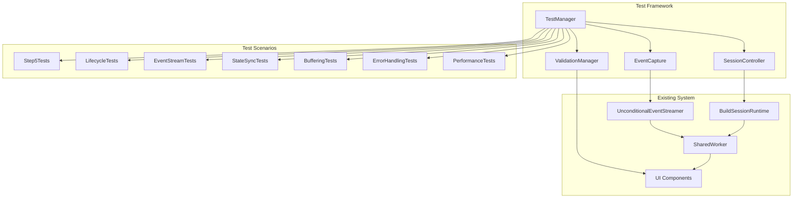

# Design Document

## Overview

ビルドセッション包括的テスト機能は、既存のUnconditionalEventStreamerとビルドセッション管理システムを活用した統合テストフレームワークです。この設計では、Step5表示時の既存セッション処理から完全なライフサイクルテストまで、7つの主要要件をカバーする包括的なテスト機能を提供します。

既存の370テスト通過済みの基盤を活用し、Worker-UI間通信、イベントストリーミング、状態同期機能の正確性を検証します。特に、マルチステージセッションの状態遷移、並列タスク実行、イベントバッファリング、エラー処理、パフォーマンス特性を重点的にテストします。

## Architecture

### Core Components



### Test Architecture Layers

1. **Test Management Layer**: テスト実行の制御と結果集約
2. **Session Control Layer**: ビルドセッションの生成・制御・監視
3. **Event Capture Layer**: イベントストリームの捕捉・検証
4. **Validation Layer**: 状態検証・アサーション・レポート生成

## Components and Interfaces

### TestManager

```typescript
interface TestManager {
  // Test execution control
  runStep5Tests(scenarios: Step5TestScenario[]): Promise<TestResult[]>;
  runLifecycleTests(scenarios: LifecycleTestScenario[]): Promise<TestResult[]>;
  runEventStreamTests(scenarios: EventStreamTestScenario[]): Promise<TestResult[]>;
  runStateSyncTests(scenarios: StateSyncTestScenario[]): Promise<TestResult[]>;
  runBufferingTests(scenarios: BufferingTestScenario[]): Promise<TestResult[]>;
  runErrorHandlingTests(scenarios: ErrorHandlingTestScenario[]): Promise<TestResult[]>;
  runPerformanceTests(scenarios: PerformanceTestScenario[]): Promise<TestResult[]>;
  
  // Test suite management
  runComprehensiveTestSuite(): Promise<ComprehensiveTestReport>;
  generateTestReport(results: TestResult[]): TestReport;
}
```

### SessionController

```typescript
interface SessionController {
  // Session lifecycle management
  createNewSession(nodeId: NodeId, metadata: BuildMetadata): Promise<SessionHandle>;
  resetSession(nodeId: NodeId): Promise<void>;
  clearCache(nodeId: NodeId, stage?: BuildStage): Promise<void>;
  
  // Session state control
  pauseSession(sessionId: SessionId): Promise<void>;
  resumeSession(sessionId: SessionId): Promise<void>;
  cancelSession(sessionId: SessionId): Promise<void>;
  
  // Session monitoring
  getSessionState(sessionId: SessionId): Promise<SessionState>;
  waitForSessionCompletion(sessionId: SessionId, timeout?: number): Promise<SessionResult>;
}
```

### EventCapture

```typescript
interface EventCapture {
  // Event stream monitoring
  captureEventStream(nodeId: NodeId, eventTypes: NotificationType[]): EventStreamCapture;
  stopCapture(capture: EventStreamCapture): CapturedEvents;
  
  // Event validation
  validateEventSequence(events: CapturedEvent[], expectedPattern: EventPattern): ValidationResult;
  validateEventTiming(events: CapturedEvent[], timingConstraints: TimingConstraints): ValidationResult;
  
  // Sequence number verification
  verifySequenceNumbers(events: CapturedEvent[]): SequenceValidationResult;
  detectEventLoss(events: CapturedEvent[], expectedCount: number): EventLossReport;
}
```

### ValidationManager

```typescript
interface ValidationManager {
  // UI state validation
  validateStep5Display(nodeId: NodeId, expectedState: ExpectedUIState): ValidationResult;
  validateProgressDisplay(nodeId: NodeId, expectedProgress: ExpectedProgress): ValidationResult;
  
  // Session state validation
  validateSessionState(sessionId: SessionId, expectedState: ExpectedSessionState): ValidationResult;
  validateTaskSnapshots(snapshots: TaskSnapshot[], expectedTasks: ExpectedTask[]): ValidationResult;
  
  // Performance validation
  validatePerformanceMetrics(metrics: PerformanceMetrics, constraints: PerformanceConstraints): ValidationResult;
  validateResourceUsage(usage: ResourceUsage, limits: ResourceLimits): ValidationResult;
}
```

## Data Models

### Test Scenario Models

```typescript
// Step5 test scenarios
interface Step5TestScenario {
  scenarioId: string;
  description: string;
  initialSessionState: 'none' | 'existing' | 'completed' | 'error';
  expectedUIState: ExpectedUIState;
  progressEvents?: ProgressEvent[];
}

interface ExpectedUIState {
  emptyStateContent?: string;
  taskCount?: number;
  progressValues?: Record<string, number>;
  displayStatus?: 'running' | 'paused' | 'completed' | 'error';
}

// Lifecycle test scenarios
interface LifecycleTestScenario {
  scenarioId: string;
  description: string;
  sessionType: 'new' | 'reset' | 'cache-cleared';
  buildMetadata: BuildMetadata;
  expectedStages: BuildStage[];
  expectedTaskCount: number;
  parallelTasksPerStage: number;
}

// Event stream test scenarios
interface EventStreamTestScenario {
  scenarioId: string;
  description: string;
  eventTypes: NotificationType[];
  eventCount: number;
  emissionRate: number; // events per second
  subscriberCount: number;
  expectedDeliveryRate: number; // percentage
}
```

### Event and State Models

```typescript
interface CapturedEvent {
  nodeId: NodeId;
  eventType: NotificationType;
  sequenceNumber: number;
  timestamp: number;
  payload: unknown;
  deliveryLatency?: number;
}

interface SessionState {
  sessionId: SessionId;
  nodeId: NodeId;
  status: 'idle' | 'running' | 'paused' | 'completed' | 'error';
  currentStage: BuildStage;
  taskProgress: Record<TaskId, TaskProgress>;
  startTime: number;
  lastUpdateTime: number;
}

interface TaskSnapshot {
  nodeId: NodeId;
  stage: BuildStage;
  tasks: TaskSummary[];
  generatedAt: number;
  metadata: BuildMetadata;
}
```

### Performance and Resource Models

```typescript
interface PerformanceMetrics {
  taskSnapshotGenerationTime: number;
  eventDeliveryLatency: number[];
  uiUpdateResponseTime: number[];
  memoryUsage: MemoryUsage;
  cpuUsage: CPUUsage;
}

interface ResourceUsage {
  peakMemoryMB: number;
  averageMemoryMB: number;
  cpuUtilizationPercent: number;
  eventBufferSize: number;
  subscriberCount: number;
}

interface PerformanceConstraints {
  maxTaskSnapshotGenerationTimeMs: number;
  maxEventDeliveryLatencyMs: number;
  maxUIUpdateResponseTimeMs: number;
  maxMemoryUsageMB: number;
}
```

## Correctness Properties

*A property is a characteristic or behavior that should hold true across all valid executions of a system-essentially, a formal statement about what the system should do. Properties serve as the bridge between human-readable specifications and machine-verifiable correctness guarantees.*

まず、受容基準の分析を行います。
### Property 1: Session snapshot capture consistency

*For any* existing Build_Session state, capturing a task status and progress snapshot should produce data that accurately reflects the current session state and validates against expected task states and progress values.

**Validates: Requirements 1.2, 1.4**

### Property 2: Progress event UI reflection

*For any* Progress_Event received from SharedWorker, the UI should reflect the progress update correctly, maintaining data consistency across single events and event sequences without data loss.

**Validates: Requirements 1.3, 1.5, 2.4, 2.7**

### Property 3: Build session creation round-trip

*For any* build session creation request (new, reset, or cache-cleared) with provided metadata, the system should create a new Build_Session, generate the correct Task_Snapshot, communicate it to UI via UnconditionalEventStreamer, and complete the full round-trip from session start through task generation to UI reflection.

**Validates: Requirements 2.1, 2.2, 2.3, 2.8**

### Property 4: Parallel task execution coordination

*For any* build session with multiple stages, when stages start child workers, parallel task execution should begin and Progress_Events should be sent to UI via UnconditionalEventStreamer with proper coordination.

**Validates: Requirements 2.5, 2.6**

### Property 5: Event delivery integrity

*For any* event emitted by UnconditionalEventStreamer (session-state, task-progress, stage-snapshot), all subscribed UI components should receive the event with data delivered without corruption and referential integrity maintained.

**Validates: Requirements 3.1, 3.2, 3.3**

### Property 6: Event ordering and sequence preservation

*For any* combination of multiple event types emitted simultaneously, event ordering and sequence numbers should be preserved across the delivery process.

**Validates: Requirements 3.4**

### Property 7: Exception isolation

*For any* event subscriber callback failure, other subscribers should continue to receive events without cascade failures, ensuring proper exception isolation.

**Validates: Requirements 3.5, 6.2**

### Property 8: Multi-stage session state synchronization

*For any* Build_Session stage transition, Session_State should remain synchronized across Worker and UI, with accurate aggregate progress calculations and correct next stage initialization.

**Validates: Requirements 4.1, 4.2, 4.3**

### Property 9: Session lifecycle management

*For any* session heartbeat event emission or session termination, the UI should maintain connection awareness and all resources should be properly cleaned up respectively.

**Validates: Requirements 4.4, 4.5**

### Property 10: Event buffering and sequence integrity

*For any* high-frequency event emission scenario, event buffering should prevent data loss, maintain correct ordering across multiple workers, and ensure sequence number generation is monotonic and gap-free within each notification type.

**Validates: Requirements 5.1, 5.2, 5.4**

### Property 11: UI reconnection event delivery

*For any* UI disconnection and reconnection cycle, buffered events should be delivered in correct sequence, and buffer overflow handling should maintain data integrity.

**Validates: Requirements 5.3, 5.5**

### Property 12: Error propagation and handling

*For any* child worker failure, build session timeout, or invalid task metadata, error events should be properly propagated to UI with descriptive messages, and critical errors should trigger proper state transitions with cleanup.

**Validates: Requirements 6.1, 6.3, 6.4, 6.5**

### Property 13: Concurrent session resource isolation

*For any* multiple Build_Sessions running concurrently, resource isolation should prevent interference between sessions.

**Validates: Requirements 7.3**

### Property 14: Memory usage bounds

*For any* long-running build session, memory usage should remain bounded within acceptable limits.

**Validates: Requirements 7.4**

## Error Handling

### Error Categories and Response Strategies

#### 1. Worker Communication Errors
- **Scenario**: SharedWorker crashes, communication timeouts, message corruption
- **Detection**: Heartbeat monitoring, message validation, connection state tracking
- **Response**: Automatic reconnection attempts, error event emission, graceful degradation
- **Recovery**: Session state restoration from last known snapshot

#### 2. Event Streaming Errors  
- **Scenario**: UnconditionalEventStreamer failures, subscriber callback exceptions, buffer overflows
- **Detection**: Exception catching, delivery confirmation, buffer monitoring
- **Response**: Exception isolation, alternative delivery paths, buffer management
- **Recovery**: Event replay from sequence numbers, subscriber re-registration

#### 3. Session State Errors
- **Scenario**: Invalid state transitions, metadata corruption, task execution failures
- **Detection**: State validation, metadata checksums, task result monitoring
- **Response**: State rollback, error logging, user notification
- **Recovery**: Session reset, cache clearing, manual intervention options

#### 4. Performance Degradation
- **Scenario**: High latency, memory leaks, CPU overutilization, UI freezing
- **Detection**: Performance monitoring, resource usage tracking, response time measurement
- **Response**: Load balancing, resource throttling, background processing
- **Recovery**: Session pause/resume, resource cleanup, performance optimization

#### 5. Data Integrity Errors
- **Scenario**: Sequence number gaps, event loss, snapshot inconsistencies
- **Detection**: Sequence validation, checksum verification, consistency checks
- **Response**: Data reconstruction, integrity alerts, fallback mechanisms
- **Recovery**: Full state synchronization, snapshot regeneration

### Error Handling Implementation Strategy

```typescript
interface ErrorHandler {
  // Error detection and classification
  detectError(context: ExecutionContext): ErrorClassification | null;
  classifyError(error: Error, context: ExecutionContext): ErrorSeverity;
  
  // Error response and recovery
  handleError(error: ClassifiedError): ErrorResponse;
  attemptRecovery(error: ClassifiedError): RecoveryResult;
  
  // Error reporting and logging
  reportError(error: ClassifiedError, response: ErrorResponse): void;
  logError(error: ClassifiedError, context: ExecutionContext): void;
}

interface ErrorClassification {
  category: 'worker-communication' | 'event-streaming' | 'session-state' | 'performance' | 'data-integrity';
  severity: 'low' | 'medium' | 'high' | 'critical';
  recoverable: boolean;
  requiresUserIntervention: boolean;
}
```

## Testing Strategy

### Dual Testing Approach

この包括的テスト機能では、ユニットテストとプロパティベーステストの両方を活用した二重テスト戦略を採用します。

**Unit Tests**: 
- 特定の例外ケースとエッジケースの検証
- Step5空状態表示の具体的内容確認
- 大規模タスクセット（>1000タスク）の性能閾値検証
- 高頻度イベント（>100イベント/秒）の応答性検証
- 多数購読者（>50購読者）での配信遅延検証
- コンポーネント間の統合ポイント検証

**Property-Based Tests**:
- 14の正確性プロパティの包括的検証
- ランダム化されたセッション状態、イベントシーケンス、エラー条件での動作確認
- 最小100回の反復実行による網羅的入力カバレッジ
- 各プロパティテストは対応する設計文書プロパティを参照

### Property-Based Testing Configuration

**Testing Library**: fast-check (JavaScript/TypeScript向けプロパティベーステストライブラリ)

**Test Configuration**:
- 各プロパティテストは最小100回の反復実行
- タグ形式: **Feature: build-session-comprehensive-test, Property {number}: {property_text}**
- 各正確性プロパティは単一のプロパティベーステストで実装

**Example Property Test Structure**:
```typescript
import fc from 'fast-check';

describe('Build Session Comprehensive Tests', () => {
  it('Property 1: Session snapshot capture consistency', () => {
    // Feature: build-session-comprehensive-test, Property 1: Session snapshot capture consistency
    fc.assert(fc.property(
      fc.record({
        nodeId: fc.string(),
        sessionState: fc.oneof(fc.constant('running'), fc.constant('paused'), fc.constant('completed')),
        taskProgress: fc.dictionary(fc.string(), fc.integer(0, 100))
      }),
      (sessionData) => {
        const snapshot = captureSessionSnapshot(sessionData);
        const validation = validateSnapshot(snapshot, sessionData);
        return validation.isValid && validation.accuratelyReflectsState;
      }
    ), { numRuns: 100 });
  });
  
  // Additional property tests for Properties 2-14...
});
```

### Test Execution Strategy

1. **Isolated Test Environment**: 各テストは独立したWorker環境とUI環境で実行
2. **Mock Integration**: 既存のUnconditionalEventStreamerとの統合にはモック環境を活用
3. **Performance Monitoring**: テスト実行中のリソース使用量とパフォーマンス指標を監視
4. **Comprehensive Reporting**: 全14プロパティの検証結果と性能指標を含む包括的レポート生成

### Integration with Existing Test Suite

既存の370テスト通過済みのテストスイートとの統合：
- 既存のWorker-UI通信テストとの互換性確保
- UnconditionalEventStreamerの既存テストケースとの重複回避
- 新規テストは既存テストの実行に影響を与えない独立実行
- CI/CDパイプラインでの自動実行とレポート生成