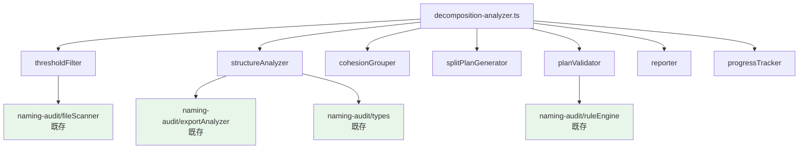

# 設計書: 大規模ファイル分割 (Large File Decomposition)

## 概要 (Overview)

本設計は、600行以上の大規模 `.ts` / `.tsx` ファイル（約40ファイル）を自動解析し、分割計画を生成・検証する CLI ツール **Decomposition Analyzer** を構築する。

既存の Audit Tool（`scripts/naming-audit/`）のアーキテクチャ・型定義・ts-morph 基盤を最大限に再利用し、新規モジュールとして `scripts/decomposition/` に配置する。CLI エントリポイントは `scripts/decomposition-analyzer.ts` とする。

### 設計判断の根拠

1. **既存 Audit Tool との共存**: Audit Tool はファイル命名規約の検証に特化しており、分割解析とは責務が異なる。共通基盤（`fileScanner`, `exportAnalyzer`, `types`）は import で再利用し、分割固有ロジックは独立モジュールとして実装する。
2. **ts-morph の一貫利用**: 既存の `exportAnalyzer` が ts-morph で AST 解析を行っているため、シンボル間依存グラフの構築も ts-morph を使用する。新たな AST パーサーの導入は不要。
3. **段階的実行モデル**: 検出 → 解析 → 計画生成 → 検証 の4段階パイプラインとし、各段階を独立にテスト可能にする。

## アーキテクチャ (Architecture)

### パイプライン構成


### ディレクトリ構成

```
scripts/
  decomposition-analyzer.ts          # CLI エントリポイント
  decomposition/
    types.ts                         # 分割解析固有の型定義
    thresholdFilter.ts               # 行数フィルタ + 優先度スコア算出
    structureAnalyzer.ts             # ファイル内シンボル依存グラフ構築
    cohesionGrouper.ts               # 凝集グループ自動分類
    splitPlanGenerator.ts            # 分割計画生成（.ts / .tsx パターン適用）
    planValidator.ts                 # 計画検証（命名規約・循環 import・行数）
    reporter.ts                      # 結果出力（table / json）
    progressTracker.ts               # 分割済みファイル追跡
    __tests__/
      thresholdFilter.test.ts
      structureAnalyzer.test.ts
      cohesionGrouper.test.ts
      splitPlanGenerator.test.ts
      planValidator.test.ts
```

### 既存モジュールとの依存関係



緑色のノードは既存モジュール（変更なし・import のみ）を示す。

## コンポーネントとインターフェース (Components and Interfaces)

### 1. ThresholdFilter

既存の `fileScanner.scanFiles()` の結果を受け取り、行数 ≥ 600 のファイルをフィルタする。

```typescript
/** Filter files exceeding the line threshold and compute priority scores. */
export function filterByThreshold(
  files: readonly FileEntry[],
  threshold: number
): ThresholdResult[];

/** Compute priority score: lineCount × exportCount. */
export function computePriorityScore(lineCount: number, exportCount: number): number;
```

### 2. StructureAnalyzer

ts-morph を使用してファイル内シンボル間の参照関係を解析し、依存グラフを構築する。

```typescript
/** Analyze intra-file symbol dependencies using ts-morph AST. */
export function analyzeStructure(
  file: FileEntry,
  project: Project
): FileStructure;

/** Build a dependency graph of symbols within a single file. */
export function buildDependencyGraph(
  sourceFile: SourceFile
): DependencyGraph;
```

### 3. CohesionGrouper

依存グラフに基づき、強連結成分（SCC）アルゴリズムで凝集グループを自動分類する。

```typescript
/** Group symbols into cohesion groups based on dependency strength. */
export function groupByCohesion(
  graph: DependencyGraph
): CohesionGroup[];

/** Detect inter-group circular references. */
export function detectInterGroupCycles(
  groups: readonly CohesionGroup[],
  graph: DependencyGraph
): CycleWarning[];
```

### 4. SplitPlanGenerator

凝集グループと分割パターン（`.ts` / `.tsx`）に基づき、分割計画を生成する。

```typescript
/** Generate a split plan for a single file. */
export function generateSplitPlan(
  structure: FileStructure,
  groups: readonly CohesionGroup[],
  options: SplitPlanOptions
): SplitPlan;

/** Apply .tsx Container/Presentational pattern. */
export function applyContainerPresentationalPattern(
  structure: FileStructure,
  groups: readonly CohesionGroup[]
): SplitTarget[];

/** Apply .ts decomposition patterns (hook, utility, multi-function). */
export function applyTsDecompositionPattern(
  structure: FileStructure,
  groups: readonly CohesionGroup[]
): SplitTarget[];
```

### 5. PlanValidator

分割計画が命名規約・行数制約・循環 import 禁止に準拠しているかを検証する。

```typescript
/** Validate a split plan against all constraints. */
export function validatePlan(plan: SplitPlan): ValidationResult;

/** Check naming guideline compliance for all target file names. */
export function validateNaming(targets: readonly SplitTarget[]): NamingViolation[];

/** Detect circular imports in the proposed file structure. */
export function detectCircularImports(plan: SplitPlan): CircularImportWarning[];

/** Verify all public APIs are preserved after split. */
export function verifyApiPreservation(
  original: FileStructure,
  plan: SplitPlan
): ApiPreservationResult;
```

### 6. Reporter

検出結果・分割計画・検証結果を table / json 形式で出力する。

```typescript
/** Report analysis results to stdout. */
export function reportResults(
  results: AnalysisReport,
  format: 'json' | 'table'
): void;
```

### 7. ProgressTracker

分割済みファイルの追跡と残数報告を行う。

```typescript
/** Track decomposition progress across sessions. */
export function loadProgress(trackingFilePath: string): ProgressState;
export function saveProgress(state: ProgressState, trackingFilePath: string): void;
export function markCompleted(state: ProgressState, filePath: string): ProgressState;
```

### CLI インターフェース

```
pnpm tsx scripts/decomposition-analyzer.ts [options]

Options:
  --format <json|table>   出力形式（デフォルト: table）
  --batch <n>             上位 n 件のみ対象
  --target <dir>          対象ディレクトリ上書き（複数指定可）
  --validate-only         計画検証のみ実行
  --threshold <n>         行数閾値の上書き（デフォルト: 600）
```

## データモデル (Data Models)

### 分割解析固有の型定義

```typescript
// === ThresholdFilter types ===

/** Result of threshold filtering for a single file. */
export interface ThresholdResult {
  readonly file: FileEntry;
  readonly lineCount: number;
  readonly exportCount: number;
  readonly estimatedCohesionGroups: number;
  readonly priorityScore: number;
}

// === StructureAnalyzer types ===

/** A symbol extracted from a file with its location and references. */
export interface SymbolNode {
  readonly name: string;
  readonly kind: ExportKind | 'local';
  readonly isExported: boolean;
  readonly startLine: number;
  readonly endLine: number;
  /** Names of other symbols in the same file that this symbol references. */
  readonly references: readonly string[];
}

/** Dependency graph: adjacency list of symbol references within a file. */
export interface DependencyGraph {
  readonly nodes: readonly SymbolNode[];
  /** Map from symbol name to names of symbols it depends on. */
  readonly edges: ReadonlyMap<string, readonly string[]>;
}

/** Full structural analysis of a single file. */
export interface FileStructure {
  readonly file: FileEntry;
  readonly lineCount: number;
  readonly analysis: FileAnalysis;
  readonly graph: DependencyGraph;
  readonly cohesionGroups: readonly CohesionGroup[];
}

// === CohesionGrouper types ===

/** A group of tightly coupled symbols that should stay together. */
export interface CohesionGroup {
  readonly id: string;
  readonly symbols: readonly SymbolNode[];
  readonly lineCount: number;
  /** Suggested role for this group (types, utils, hook, component, etc.). */
  readonly suggestedRole: GroupRole;
}

export type GroupRole =
  | 'types'
  | 'utils'
  | 'constants'
  | 'hook'
  | 'stateHook'
  | 'component'
  | 'view'
  | 'container'
  | 'main'
  | 'other';

/** Warning about circular references between cohesion groups. */
export interface CycleWarning {
  readonly groupIds: readonly string[];
  readonly involvedSymbols: readonly string[];
  readonly message: string;
}

// === SplitPlanGenerator types ===

/** A single target file in a split plan. */
export interface SplitTarget {
  readonly targetPath: string;
  readonly symbols: readonly string[];
  readonly estimatedLineCount: number;
  readonly role: GroupRole;
}

/** Complete split plan for a single source file. */
export interface SplitPlan {
  readonly sourceFile: FileEntry;
  readonly sourceLineCount: number;
  readonly targets: readonly SplitTarget[];
  readonly importUpdates: readonly ImportUpdate[];
  readonly pattern: SplitPattern;
}

export type SplitPattern =
  | 'container-presentational'
  | 'hook-decomposition'
  | 'multi-function'
  | 'single-main-with-helpers'
  | 'type-extraction'
  | 'mixed';

/** An import statement that needs updating after the split. */
export interface ImportUpdate {
  readonly importingFile: string;
  readonly oldImportPath: string;
  readonly newImportPath: string;
  readonly importedSymbols: readonly string[];
}

// === PlanValidator types ===

export interface NamingViolation {
  readonly targetPath: string;
  readonly rule: string;
  readonly message: string;
  readonly suggestedFix: string;
}

export interface CircularImportWarning {
  readonly cycle: readonly string[];
  readonly message: string;
}

export interface ApiPreservationResult {
  readonly preserved: boolean;
  readonly missingExports: readonly string[];
  readonly message: string;
}

export interface ValidationResult {
  readonly valid: boolean;
  readonly namingViolations: readonly NamingViolation[];
  readonly circularImports: readonly CircularImportWarning[];
  readonly apiPreservation: ApiPreservationResult;
  readonly thresholdViolations: readonly string[];
}

// === SplitPlanOptions ===

export interface SplitPlanOptions {
  readonly threshold: number;
  readonly namingGuideline: NamingGuidelineConfig;
}

export interface NamingGuidelineConfig {
  readonly hookPrefix: 'use';
  readonly viewSuffix: 'View';
  readonly typesFileName: 'types.ts';
  readonly constantsFileName: 'constants.ts';
  readonly utilsFileName: 'utils.ts';
  readonly indexReExportOnly: boolean;
}

// === Reporter types ===

export interface AnalysisReport {
  readonly thresholdResults: readonly ThresholdResult[];
  readonly splitPlans: readonly SplitPlan[];
  readonly validationResults: readonly ValidationResult[];
  readonly progressState: ProgressState;
}

// === ProgressTracker types ===

export interface ProgressState {
  readonly completedFiles: readonly string[];
  readonly totalTargetFiles: number;
  readonly remainingCount: number;
  readonly lastUpdated: string;
}
```

### 既存型の再利用

以下の型は `scripts/naming-audit/types.ts` から直接 import して使用する（再定義しない）:

- `FileEntry` — ファイルスキャン結果
- `FileAnalysis` — エクスポート解析結果
- `ExportInfo`, `ExportKind` — エクスポートメタデータ
- `ComponentMetrics` — `.tsx` コンポーネントメトリクス
- `Violation`, `Rule`, `RuleEngineConfig` — ルールエンジン型


## 正当性プロパティ (Correctness Properties)

*プロパティとは、システムの全ての有効な実行において真であるべき特性や振る舞いのことである。要件を人間が読める仕様から機械検証可能な正当性保証へと橋渡しする役割を果たす。*

### Property 1: 閾値フィルタの正確性

*For any* `FileEntry` の配列と閾値 T に対して、`filterByThreshold` の結果は以下を全て満たす: (a) 全結果の `lineCount ≥ T`、(b) テストファイル（`__tests__/` 配下、`*.test.ts`、`*.test.tsx`、`*.spec.ts`、`*.spec.tsx`）が含まれない、(c) 入力中の条件を満たす全ファイルが結果に含まれる。

**Validates: Requirements 1.1, 1.2**

### Property 2: 検出結果の行数降順ソート

*For any* `ThresholdResult` の配列に対して、ソート後の結果は隣接する全ペア `(results[i], results[i+1])` で `results[i].lineCount ≥ results[i+1].lineCount` を満たす。

**Validates: Requirements 1.3**

### Property 3: 凝集グループのパーティション性

*For any* `DependencyGraph` に対して、`groupByCohesion` の結果は以下を全て満たす: (a) 全シンボルがちょうど1つのグループに属する（パーティション）、(b) 相互依存するシンボル（同一 SCC 内）は同一グループに属する、(c) グループの和集合がグラフの全ノードと一致する。

**Validates: Requirements 2.3**

### Property 4: グループ間循環参照の検出

*For any* `DependencyGraph` と `CohesionGroup[]` に対して、グループ間に循環参照が存在する場合、`detectInterGroupCycles` は該当する全ての循環を報告する。循環が存在しない場合、警告は空である。

**Validates: Requirements 2.4**

### Property 5: 分割計画の命名規約準拠

*For any* `SplitPlan` に対して、全ての `SplitTarget.targetPath` が命名規約バリデータを通過する。具体的には: Hook ファイルは `use*.ts` プレフィックス、Presentational コンポーネントは `*View.tsx` サフィックス、型定義ファイルは `types.ts`、ユーティリティファイルは `utils.ts` の命名規則に準拠する。

**Validates: Requirements 3.1, 4.1**

### Property 6: 分割後ファイルの閾値遵守

*For any* `SplitPlan` に対して、全ての `SplitTarget.estimatedLineCount ≤ threshold`（デフォルト 600）を満たす。

**Validates: Requirements 3.2, 4.2**

### Property 7: Container/Presentational パターンの適用

*For any* `.tsx` ファイル構造で `jsxLineCount > 50` または `hookCallCount > 2` の場合、`generateSplitPlan` は Container/Presentational 分離パターン（`ComponentName.tsx` + `ComponentNameView.tsx` + `useComponentNameState.ts`）を適用した `SplitTarget[]` を生成する。

**Validates: Requirements 3.4, 6.1**

### Property 8: 分割計画の非循環性

*For any* `SplitPlan` に対して、`SplitTarget` 間の import 関係グラフは DAG（有向非巡回グラフ）である。すなわち、循環 import が存在しない。

**Validates: Requirements 3.5**

### Property 9: シンボル抽出閾値

*For any* `FileStructure` に対して、型定義（type / interface）が 3 個以上含まれる場合は `types.ts` への分離が提案され、純関数ユーティリティが 3 個以上含まれる場合は `utils.ts` への分離が提案される。

**Validates: Requirements 3.6, 3.7**

### Property 10: パブリック API の保全

*For any* `FileStructure` とその `SplitPlan` に対して、元ファイルの全エクスポートシンボルの集合と、全 `SplitTarget` のシンボル集合の和集合が等しい。すなわち、分割によってパブリック API が失われない。

**Validates: Requirements 4.4, 7.1**

### Property 11: 単一メイン関数 + ヘルパーパターン

*For any* `.ts` ファイル構造で、1つの大規模エクスポート関数と複数のヘルパー関数で構成される場合、メイン関数は元ファイルに残り、ヘルパー関数はサブディレクトリ内の責務別ファイルに配置される。

**Validates: Requirements 5.1**

### Property 12: 複数独立関数の分離パターン

*For any* `.ts` ファイル構造で、複数の独立したエクスポート関数（相互依存なし）で構成される場合、各 `CohesionGroup` は個別の `SplitTarget` にマッピングされる。

**Validates: Requirements 5.2**

### Property 13: Hook 分割パターン

*For any* Hook ファイル（`use*.ts`）構造に対して、`SplitPlan` は AGENTS.md の Hook 4分類ルールに従い、子孫ロジックをサブディレクトリに分離する構成を生成する。親 Hook は元ファイルに残る。

**Validates: Requirements 5.3**

### Property 14: index.ts の再エクスポート専用制約

*For any* `SplitPlan` に `index.ts` が含まれる場合、その `SplitTarget` の `role` は再エクスポート専用であり、実ロジックのシンボルを含まない。

**Validates: Requirements 5.4**

### Property 15: .tsx 複数コンポーネント・render ヘルパーの分離

*For any* `.tsx` ファイル構造で、複数のコンポーネント定義または `render*` プレフィックスのヘルパー関数が含まれる場合、各コンポーネントは個別ファイルに分離され、`render*` ヘルパーは `*View.tsx` に配置される。

**Validates: Requirements 6.2, 6.3**

### Property 16: import 更新の完全性

*For any* `SplitPlan` に対して、元ファイルを import している全ての外部ファイルが `importUpdates` に含まれる。

**Validates: Requirements 7.2**

### Property 17: テストファイル import 更新

*For any* `SplitPlan` に対して、元ファイルに対応するテストファイルが存在する場合、テストファイルの import パス更新が `importUpdates` に含まれる。

**Validates: Requirements 7.5**

### Property 18: 優先度スコアの算出と順序

*For any* 正の整数 `lineCount` と `exportCount` に対して、`computePriorityScore(lineCount, exportCount) = lineCount × exportCount` であり、結果リストは `priorityScore` の降順でソートされる。

**Validates: Requirements 9.1, 9.2**

### Property 19: バッチ制限

*For any* 結果リストとバッチサイズ `n` に対して、`--batch n` 適用後の出力件数は `min(n, totalResults)` であり、出力は優先度スコア上位 n 件と一致する。

**Validates: Requirements 9.3**

### Property 20: 進捗追跡のラウンドトリップ

*For any* `ProgressState` に対して、`saveProgress` で保存した後 `loadProgress` で読み込むと、元の状態と等価な `ProgressState` が復元される。また、`markCompleted` を k 回適用した後の `remainingCount` は `totalTargetFiles - k` と等しい。

**Validates: Requirements 9.4**

## エラーハンドリング (Error Handling)

### ファイルシステムエラー

| エラー状況 | 対応 |
|---|---|
| 対象ファイルが読み取り不可 | 警告を stderr に出力し、該当ファイルをスキップ。他ファイルの処理は継続。 |
| ts-morph パース失敗 | 構文エラーの詳細を警告として報告し、該当ファイルをスキップ。 |
| 対象ディレクトリが存在しない | 警告を出力し、該当ディレクトリをスキップ。 |
| 進捗追跡ファイルの読み書き失敗 | 初回は新規作成。書き込み失敗時は警告を出力し処理は継続。 |

### 解析エラー

| エラー状況 | 対応 |
|---|---|
| 依存グラフ構築中の未解決参照 | 警告として報告し、該当エッジを除外してグラフ構築を継続。 |
| 凝集グループ分類で単一グループが閾値超過 | 分割不可能な旨を警告し、手動分割を推奨するメッセージを出力。 |
| 分割計画で閾値以下にできない場合 | 最善の分割案を提示し、閾値超過の旨を警告として報告。 |

### CLI エラー

| エラー状況 | 対応 |
|---|---|
| 不正なオプション | エラーメッセージと使用方法を stderr に出力し、exit code 2 で終了。 |
| `--batch` に非正整数 | エラーメッセージを出力し、exit code 2 で終了。 |
| `--format` に不正な値 | エラーメッセージを出力し、exit code 2 で終了。 |

### 終了コード体系

| コード | 意味 |
|---|---|
| 0 | 正常終了（検証違反なし） |
| 1 | 検証違反あり（命名規約違反・閾値超過等） |
| 2 | CLI 引数エラー |

## テスト戦略 (Testing Strategy)

### テストフレームワーク

- **ユニットテスト / プロパティテスト**: vitest + [fast-check](https://github.com/dubzzz/fast-check)
- **テスト配置**: `scripts/decomposition/__tests__/`
- **実行**: `pnpm vitest run scripts/decomposition/__tests__/`

### プロパティベーステスト (PBT)

本機能は純関数ベースのデータ変換パイプラインであり、PBT に適している。

- 各プロパティテストは最低 **100 イテレーション** で実行する
- 各テストにはコメントで設計書のプロパティ番号を参照する
- タグ形式: `Feature: large-file-decomposition, Property {number}: {property_text}`

#### PBT 対象プロパティ一覧

| Property | テスト対象モジュール | ジェネレータ概要 |
|---|---|---|
| 1 | thresholdFilter | ランダム FileEntry 配列（行数 0〜2000、テスト/非テストパス混在） |
| 2 | thresholdFilter (sort) | ランダム ThresholdResult 配列 |
| 3 | cohesionGrouper | ランダム有向グラフ（ノード 1〜30、エッジ密度 0〜50%） |
| 4 | cohesionGrouper (cycles) | グループ間エッジを含むランダムグラフ |
| 5 | planValidator + splitPlanGenerator | ランダム CohesionGroup（各種 role） |
| 6 | splitPlanGenerator | ランダム FileStructure（行数 600〜2000） |
| 7 | splitPlanGenerator (.tsx) | ランダム ComponentMetrics（JSX 0〜200行、hooks 0〜10） |
| 8 | splitPlanGenerator (DAG) | ランダム SplitPlan の import グラフ |
| 9 | splitPlanGenerator (extraction) | ランダム SymbolNode 配列（type/function 混在） |
| 10 | planValidator (API) | ランダム FileStructure + SplitPlan |
| 11-15 | splitPlanGenerator (patterns) | 各パターン固有のランダム FileStructure |
| 16-17 | splitPlanGenerator (imports) | ランダム外部 importer 配列 |
| 18 | thresholdFilter (priority) | ランダム正整数ペア |
| 19 | thresholdFilter (batch) | ランダム結果配列 + バッチサイズ |
| 20 | progressTracker | ランダム ProgressState + markCompleted 操作列 |

### ユニットテスト（例示ベース）

PBT で網羅しにくい以下の項目はユニットテストで補完する:

- CLI 引数パース（`--format json`, `--format table`, `--batch 5`, 不正引数）
- JSON / table 出力フォーマットの具体的な形式検証
- 終了コード体系（0, 1, 2）
- React.memo / displayName アノテーションの存在確認
- 既存 Audit Tool ルールエンジンとの統合確認

### インテグレーションテスト

- 実際のリポジトリファイル（サンプル 2〜3 ファイル）に対してパイプライン全体を実行し、end-to-end の動作を検証する
- 分割計画生成後に Audit Tool を実行し、命名違反 0 件を確認する
