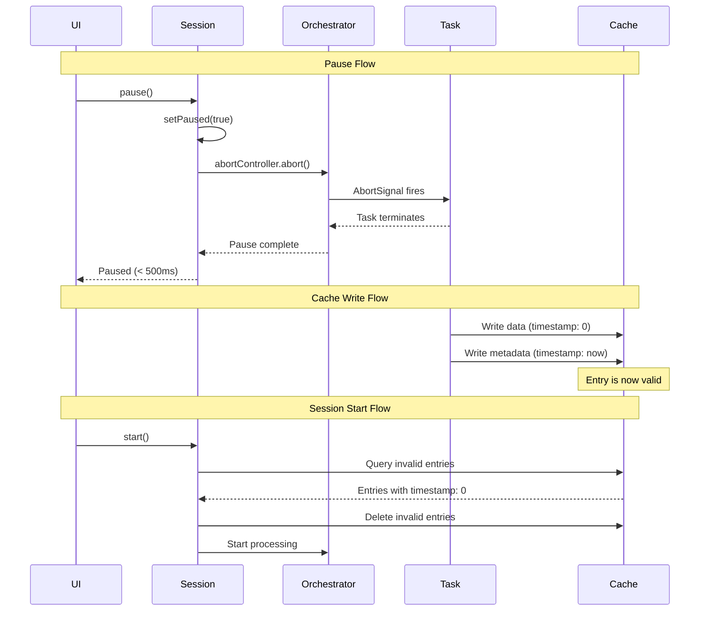

# Design Document: Shape Build Force Terminate on Pause

## Overview

This design addresses the UX issue where pause operations in shape build sessions wait for long-running tasks (e.g., turf.simplify on complex geometries) to complete cooperatively. The current implementation uses `waitIfPaused()` for cooperative suspension, which can take several seconds or minutes when processing complex geometries.

The solution introduces immediate termination of parallel stage processing on pause, while preserving completed task results and safely handling incomplete data through a metadata-based validation strategy. This approach avoids Dexie transaction locks and provides a clean separation between completed and incomplete work.

### Key Design Principles

1. **Immediate Responsiveness**: Pause operations complete within 500ms
2. **Work Preservation**: All completed tasks are preserved across pause/resume cycles
3. **Lock-Free Validation**: Metadata-based cache validation without Dexie transactions
4. **Consistent State**: Invalid cache entries are cleaned up automatically on session start
5. **Idempotent Resume**: Multiple pause/resume cycles produce the same final output

## Architecture

### Current Architecture

The shape build pipeline consists of three stages:
- **Source Stage**: Downloads and processes source data
- **Transform Stage**: Applies geometry transformations (simplification, filtering)
- **Tile Emit Stage**: Generates vector tiles from processed geometries

Each stage uses `runVectorTileStageOrchestrator` from `@hierarchidb/vectortile-orchestrator` to process tasks in parallel. The orchestrator accepts a `waitIfPaused` callback that is called before processing each task, implementing cooperative suspension.

**Current Pause Flow**:
1. User clicks pause
2. `setPaused(true)` is called
3. `waitIfPaused()` blocks on next task
4. Running tasks continue until completion
5. Pause completes when all running tasks finish

**Problem**: Long-running tasks (e.g., turf.simplify on complex geometries) can take 10+ seconds to complete, making pause feel unresponsive.

### Proposed Architecture

The new architecture introduces immediate termination through AbortController and metadata-based cache validation.

**New Pause Flow**:
1. User clicks pause
2. `setPaused(true)` is called
3. `abortController.abort()` is called immediately
4. Running tasks receive abort signal and terminate
5. Pause completes within 500ms

**Cache Write Flow** (Lock-Free):
1. Write cache data with `timestamp: 0`
2. Complete data write
3. Write cache metadata with non-zero timestamp
4. Cache entry is now valid

**Session Start Flow**:
1. Query cache data where `timestamp === 0`
2. Delete invalid cache data entries
3. Log cleanup count
4. Proceed with normal task processing

### Component Interactions



## Components and Interfaces

### 1. Session Control Interface

```typescript
interface ShapeBuildSession {
  /**
   * Start or resume the build session
   */
  start(): Promise<void>;

  /**
   * Pause the build session immediately
   * Completes within 500ms
   */
  pause(): Promise<void>;

  /**
   * Resume a paused build session
   */
  resume(): Promise<void>;

  /**
   * Cancel the build session and clean up all data
   */
  cancel(): Promise<void>;

  /**
   * Get current session status
   */
  getStatus(): BuildSessionStatus;
}

interface BuildSessionStatus {
  state: 'idle' | 'running' | 'paused' | 'completed' | 'failed';
  progress: {
    completed: number;
    total: number;
    failed: number;
  };
  currentStage?: 'source' | 'transform' | 'tile-emit';
}
```

### 2. Cache Validation Interface

```typescript
interface CacheValidator {
  /**
   * Find and delete invalid cache entries for a node
   * Returns count of deleted entries
   */
  cleanupInvalidEntries(nodeId: NodeId): Promise<{
    geometryDeleted: number;
    sourceDeleted: number;
  }>;

  /**
   * Check if a cache entry is valid
   */
  isValidEntry(cacheId: string, cacheType: 'geometry' | 'source'): Promise<boolean>;
}

interface CacheEntry {
  id: string;
  nodeId: NodeId;
  data: ArrayBuffer;
  timestamp: number; // 0 = invalid, >0 = valid
}

interface CacheMetadata {
  id: string;
  nodeId: NodeId;
  timestamp: number;
  size: number;
}
```

### 3. Task State Management Interface

```typescript
interface TaskStateManager {
  /**
   * Mark tasks as running
   */
  markRunning(taskIds: string[]): Promise<void>;

  /**
   * Mark tasks as completed
   */
  markCompleted(taskIds: string[]): Promise<void>;

  /**
   * Mark tasks as failed
   */
  markFailed(taskIds: string[], error: Error): Promise<void>;

  /**
   * Get tasks that need reprocessing after pause
   */
  getTasksForReprocessing(nodeId: NodeId): Promise<Task[]>;

  /**
   * Reset running tasks to queued state
   */
  resetRunningTasks(nodeId: NodeId): Promise<number>;
}

interface Task {
  id: string;
  nodeId: NodeId;
  status: 'queued' | 'running' | 'completed' | 'skipped' | 'failed';
  stage: 'source' | 'transform' | 'tile-emit';
  input: unknown;
  output?: unknown;
  error?: string;
  startedAt?: number;
  completedAt?: number;
}
```

### 4. Abort Control Interface

```typescript
interface AbortControlManager {
  /**
   * Create a new abort controller for a session
   */
  createController(sessionId: string): AbortController;

  /**
   * Get the abort signal for a session
   */
  getSignal(sessionId: string): AbortSignal;

  /**
   * Abort a session immediately
   */
  abort(sessionId: string): void;

  /**
   * Clean up abort controller after session ends
   */
  cleanup(sessionId: string): void;
}
```

## Data Models

### Cache Tables

**geometryCache** (existing, modified):
```typescript
interface GeometryCacheEntry {
  id: string;           // Primary key
  nodeId: NodeId;       // Indexed
  bandId: string;
  featureId: string;
  data: ArrayBuffer;
  timestamp: number;    // 0 = invalid, >0 = valid (NEW)
}
```

**geometryCacheMeta** (existing):
```typescript
interface GeometryCacheMetadata {
  id: string;           // Primary key (matches geometryCache.id)
  nodeId: NodeId;       // Indexed
  timestamp: number;    // Write completion timestamp
  size: number;
  bandId: string;
  featureId: string;
}
```

**sourceCache** (existing, modified):
```typescript
interface SourceCacheEntry {
  id: string;           // Primary key
  nodeId: NodeId;       // Indexed
  url: string;
  data: ArrayBuffer;
  timestamp: number;    // 0 = invalid, >0 = valid (NEW)
}
```

**sourceCacheMeta** (existing):
```typescript
interface SourceCacheMetadata {
  id: string;           // Primary key (matches sourceCache.id)
  nodeId: NodeId;       // Indexed
  timestamp: number;    // Write completion timestamp
  size: number;
  url: string;
}
```

### Task Queue Tables

**vtTaskQueue** (existing):
```typescript
interface VtTaskQueueEntry {
  id: string;
  nodeId: NodeId;
  status: 'queued' | 'running' | 'completed' | 'skipped' | 'failed';
  stage: 'source' | 'geometry';
  input: unknown;
  output?: unknown;
  error?: string;
  startedAt?: number;
  completedAt?: number;
}
```

**tileEmitTaskQueue** (existing):
```typescript
interface TileEmitTaskQueueEntry {
  id: string;
  nodeId: NodeId;
  status: 'queued' | 'running' | 'completed' | 'skipped' | 'failed';
  input: unknown;
  output?: unknown;
  error?: string;
  startedAt?: number;
  completedAt?: number;
}
```

### Session State

```typescript
interface SessionState {
  sessionId: string;
  nodeId: NodeId;
  state: 'idle' | 'running' | 'paused' | 'completed' | 'failed';
  currentStage?: 'source' | 'transform' | 'tile-emit';
  abortController?: AbortController;
  startedAt?: number;
  pausedAt?: number;
  resumedAt?: number;
  completedAt?: number;
}
```


## Correctness Properties

*A property is a characteristic or behavior that should hold true across all valid executions of a system-essentially, a formal statement about what the system should do. Properties serve as the bridge between human-readable specifications and machine-verifiable correctness guarantees.*

### Property 1: Immediate Worker Termination

*For any* build session in running state, when a pause request is received, all parallel stage workers should terminate immediately without waiting for running tasks to complete cooperatively.

**Validates: Requirements 1.1, 1.2**

### Property 2: Termination Time Bound

*For any* build session, the time elapsed between receiving a pause request and completing force termination should be less than 500 milliseconds.

**Validates: Requirements 1.3**

### Property 3: Task State Preservation on Termination

*For any* build session with tasks in various states, when force termination occurs, all task state information (status, input, output, timestamps) should be preserved for resume.

**Validates: Requirements 1.4**

### Property 4: Terminal State Cache Preservation

*For any* build session with tasks in terminal states (Completed, Skipped, or Failed), when force termination occurs, all associated cache data and cache metadata should be preserved.

**Validates: Requirements 2.1, 2.2, 2.3**

### Property 5: Terminal Task Idempotence

*For any* build session with tasks in terminal states (Completed, Skipped, or Failed), when a resume request is received, those tasks should not appear in the processing queue.

**Validates: Requirements 2.4**

### Property 6: Cache Write Ordering

*For any* cache write operation, the cache data should be written with timestamp 0 before the corresponding cache metadata is written with a non-zero timestamp.

**Validates: Requirements 3.1, 3.2, 6.3, 6.4**

### Property 7: Cache Entry Validation

*For any* cache entry, it should be treated as valid if and only if both cache data and cache metadata exist, and invalid if cache data exists but cache metadata is missing.

**Validates: Requirements 3.3, 3.4**

### Property 8: Invalid Cache Cleanup

*For any* build session start, all invalid cache entries (cache data without metadata) for the target node should be identified and deleted before processing any new tasks, and the count of deleted entries should be logged.

**Validates: Requirements 4.1, 4.2, 4.3, 4.4**

### Property 9: Non-Terminal Task Identification

*For any* build session, when force termination occurs, all tasks with status Running or Queued should be identified and marked as eligible for reprocessing.

**Validates: Requirements 5.1, 5.2, 5.3**

### Property 10: Non-Terminal Task Reprocessing

*For any* build session that was force terminated, when a resume request is received, all tasks that were Running or Queued during termination should be included in the processing queue.

**Validates: Requirements 5.4**

### Property 11: Cache Type Consistency

*For any* cache type (geometry or source), the metadata-based validation strategy (timestamp-based validity, write ordering, cleanup) should be applied consistently.

**Validates: Requirements 6.1, 6.2**

### Property 12: No Intermediate Persistence

*For any* task during execution, no cache data or cache metadata should be persisted until the task transitions to a terminal state (Completed, Skipped, or Failed).

**Validates: Requirements 7.1, 7.2**

### Property 13: Running Task Cache Invariant

*For any* task in Running status, there should be no associated cache data or cache metadata records, even after force termination.

**Validates: Requirements 7.3, 7.4**

### Property 14: Resume Continuation

*For any* build session that is paused and resumed, the next task processed should be the first task that is not in a terminal state (Completed, Skipped, or Failed).

**Validates: Requirements 8.1**

### Property 15: Pause/Resume Equivalence

*For any* build configuration and input data, a build session that is paused and resumed should produce the same final output (cache entries, task results) as an uninterrupted session.

**Validates: Requirements 8.2**

### Property 16: Multi-Cycle State Consistency

*For any* build session that is paused and resumed multiple times, task states (status, completed count, failed count) should remain consistent across all pause/resume cycles.

**Validates: Requirements 8.3**

### Property 17: Progress Reporting Accuracy

*For any* build session that resumes after pause, the reported progress (completed count, total count, failed count) should accurately reflect the count of tasks in terminal states.

**Validates: Requirements 8.4**

## Error Handling

### Abort Signal Handling

Tasks must check the abort signal at appropriate points during execution:

```typescript
async function processTask(input: TaskInput, signal: AbortSignal): Promise<TaskOutput> {
  // Check before expensive operations
  if (signal.aborted) {
    throw new Error('Task aborted');
  }

  // Perform work
  const result = await expensiveOperation(input);

  // Check again before writing results
  if (signal.aborted) {
    throw new Error('Task aborted');
  }

  return result;
}
```

### Cache Write Failures

If cache data write fails, the metadata write should not occur:

```typescript
async function writeCacheEntry(entry: CacheEntry): Promise<void> {
  try {
    // Write data with timestamp 0
    await cacheTable.put({ ...entry, timestamp: 0 });

    // Write metadata with non-zero timestamp
    await metaTable.put({
      id: entry.id,
      nodeId: entry.nodeId,
      timestamp: Date.now(),
      size: entry.data.byteLength,
    });
  } catch (error) {
    // If data write fails, metadata is never written
    // If metadata write fails, entry remains invalid (timestamp: 0)
    throw error;
  }
}
```

### Cleanup Failures

If cleanup fails to delete invalid entries, the session should fail to start:

```typescript
async function startSession(nodeId: NodeId): Promise<void> {
  try {
    const cleanupResult = await cleanupInvalidEntries(nodeId);
    console.log(`Cleaned up ${cleanupResult.geometryDeleted + cleanupResult.sourceDeleted} invalid entries`);
  } catch (error) {
    throw new Error(`Failed to cleanup invalid entries: ${error.message}`);
  }

  // Proceed with session start
  await processTaskQueue(nodeId);
}
```

### Termination Timeout

If force termination takes longer than 500ms, log a warning but continue:

```typescript
async function pause(): Promise<void> {
  const startTime = Date.now();
  setPaused(true);
  abortController.abort();

  // Wait for in-flight operations to terminate
  await Promise.race([
    waitForTermination(),
    new Promise(resolve => setTimeout(resolve, 500)),
  ]);

  const elapsed = Date.now() - startTime;
  if (elapsed > 500) {
    console.warn(`Force termination took ${elapsed}ms (target: 500ms)`);
  }
}
```

## Testing Strategy

### Unit Testing

Unit tests should focus on specific examples and edge cases:

1. **Cache Write Ordering**: Verify that data is written before metadata
2. **Cache Validation**: Test valid and invalid cache entry detection
3. **Cleanup Logic**: Test identification and deletion of invalid entries
4. **Task State Transitions**: Test state changes during pause/resume
5. **Abort Signal Propagation**: Test that abort signals reach tasks
6. **Error Conditions**: Test cache write failures, cleanup failures, timeout handling

Example unit test:

```typescript
describe('Cache Write Ordering', () => {
  it('should write data with timestamp 0 before metadata', async () => {
    const writes: Array<{ table: string; timestamp: number }> = [];

    // Mock cache tables to track write order
    const mockCacheTable = {
      put: async (entry: CacheEntry) => {
        writes.push({ table: 'data', timestamp: entry.timestamp });
      },
    };

    const mockMetaTable = {
      put: async (meta: CacheMetadata) => {
        writes.push({ table: 'meta', timestamp: meta.timestamp });
      },
    };

    await writeCacheEntry({ id: 'test', data: new ArrayBuffer(100) });

    expect(writes).toHaveLength(2);
    expect(writes[0]).toEqual({ table: 'data', timestamp: 0 });
    expect(writes[1].table).toBe('meta');
    expect(writes[1].timestamp).toBeGreaterThan(0);
  });
});
```

### Property-Based Testing

Property tests should verify universal properties across all inputs. Each test should run a minimum of 100 iterations.

**Property Test Library**: Use `fast-check` for TypeScript/JavaScript property-based testing.

**Test Configuration**:
- Minimum 100 iterations per property test
- Each test must reference its design document property
- Tag format: **Feature: shape-build-force-terminate-on-pause, Property {number}: {property_text}**

Example property test:

```typescript
import fc from 'fast-check';

describe('Property 4: Terminal State Cache Preservation', () => {
  /**
   * Feature: shape-build-force-terminate-on-pause
   * Property 4: For any build session with tasks in terminal states,
   * when force termination occurs, all associated cache data and metadata
   * should be preserved.
   */
  it('should preserve cache for all terminal state tasks', async () => {
    await fc.assert(
      fc.asyncProperty(
        fc.array(fc.record({
          id: fc.string(),
          status: fc.constantFrom('completed', 'skipped', 'failed'),
          cacheId: fc.string(),
        })),
        async (tasks) => {
          // Setup: Create session with terminal state tasks
          const session = await createSession(tasks);

          // Action: Force terminate
          await session.pause();

          // Verification: All cache entries should exist
          for (const task of tasks) {
            const cacheData = await getCacheData(task.cacheId);
            const cacheMeta = await getCacheMeta(task.cacheId);
            expect(cacheData).toBeDefined();
            expect(cacheMeta).toBeDefined();
          }
        }
      ),
      { numRuns: 100 }
    );
  });
});
```

**Property Test Coverage**:

1. **Property 1-3**: Termination behavior (timing, state preservation)
2. **Property 4-5**: Terminal state handling (preservation, idempotence)
3. **Property 6-7**: Cache write and validation (ordering, validity)
4. **Property 8**: Cleanup behavior (identification, deletion, logging)
5. **Property 9-10**: Non-terminal task handling (identification, reprocessing)
6. **Property 11**: Cache type consistency (geometry vs source)
7. **Property 12-13**: Intermediate persistence (no writes during execution)
8. **Property 14-17**: Resume behavior (continuation, equivalence, consistency, progress)

### Integration Testing

Integration tests should verify the complete pause/resume flow:

1. **End-to-End Pause/Resume**: Start a build, pause during processing, verify immediate termination, resume, verify completion
2. **Multiple Pause/Resume Cycles**: Pause and resume multiple times, verify final output matches uninterrupted build
3. **Cache Cleanup on Start**: Create invalid cache entries, start session, verify cleanup
4. **Long-Running Task Termination**: Start a task that takes 10+ seconds, pause immediately, verify termination within 500ms

### Performance Testing

Performance tests should verify timing constraints:

1. **Termination Time**: Measure time from pause request to termination completion, verify < 500ms
2. **Cleanup Performance**: Measure cleanup time for various numbers of invalid entries
3. **Resume Overhead**: Measure time to resume after pause, verify minimal overhead

