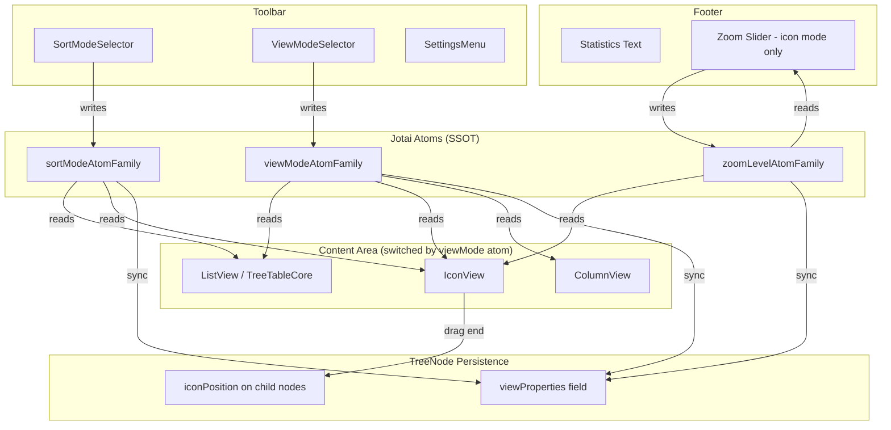

# Design Document: TreeConsole View Modes

## Overview

This design adds a macOS Finder-like view mode system to the TreeConsole UI. Three view modes (Icon, List, Column) and a sort mode selector are introduced into the toolbar. The existing TreeTableCore serves as the List view. A new IconView component provides grid/free-positioning icon display, and a new ColumnView component provides Smalltalk-class-browser-style hierarchical column navigation using the allotment library.

View-related settings (viewMode, sortMode, zoomLevel, iconPosition) are persisted as `viewProperties` on TreeNode, and managed at runtime through jotai atoms scoped per folder NodeId, following the project's SSOT principle.

### Key Design Decisions

1. **ViewMode atom family keyed by NodeId**: Each folder gets its own atom instance, so navigating between folders restores per-folder settings without global state pollution.
2. **TreeNode.viewProperties as optional field**: Avoids breaking existing TreeNode consumers. Default values are applied at the atom initialization layer, not at the data layer.
3. **ColumnView headless API mirrors TanStack Table expandable API**: Reuses `getIsExpanded`/`toggleExpanded`/`getCanExpand` shape so existing TreeTableController consumers can work with ColumnView without adapter changes.
4. **Toolbar right-side insertion order**: SortModeSelector → ViewModeSelector → SettingsMenu (left to right), inserted into the existing `Box sx={{ marginLeft: 'auto' }}` container in `TreeConsoleToolbarContent`.
5. **Footer zoom slider**: Conditionally rendered only when viewMode is "icon", placed on the right side of the existing footer layout.

## Architecture



### Data Flow

1. **User changes viewMode** → ViewModeSelector writes to `viewModeAtomFamily(nodeId)` → Content area re-renders the appropriate view component → atom sync effect writes to `TreeNode.viewProperties.viewMode`.
2. **User changes sortMode** → SortModeSelector writes to `sortModeAtomFamily(nodeId)` → Active view re-sorts nodes → atom sync effect writes to `TreeNode.viewProperties.sortMode`.
3. **User adjusts zoom** → Footer Slider writes to `zoomLevelAtomFamily(nodeId)` → IconView scales icons → atom sync effect writes to `TreeNode.viewProperties.zoomLevel`.
4. **User drags icon (free mode)** → IconView drag-end handler writes `{x, y}` to child TreeNode's `viewProperties.iconPosition` via TreeNodeUpdaterAPI.
5. **User navigates to folder** → Atoms are initialized from target folder's `TreeNode.viewProperties` (or defaults if absent).

## Components and Interfaces

### New Components

#### ViewModeSelector

- **Location**: `packages/ui/treeconsole/toolbar/src/components/toolbar/ViewModeSelector.tsx`
- **Responsibility**: Renders view mode toggle (ToggleButtonGroup or icon button + SelectedMenu based on viewport width)
- **Props**:
  ```typescript
  interface ViewModeSelectorProps {
    value: ViewMode;
    onChange: (mode: ViewMode) => void;
    breakpoint?: number; // default: 600
  }
  ```
- **Behavior**: Uses `useMediaQuery` or container width to decide between ToggleButtonGroup (wide) and icon-button + menu (narrow).
- **Icons**: Apps (icon), FormatListBulleted (list), ViewColumn (column)

#### SortModeSelector

- **Location**: `packages/ui/treeconsole/toolbar/src/components/toolbar/SortModeSelector.tsx`
- **Responsibility**: Renders sort mode button + SelectedMenu
- **Props**:
  ```typescript
  interface SortModeSelectorProps {
    value: SortMode;
    onChange: (mode: SortMode) => void;
  }
  ```
- **Menu items**: "None" → divider → "Name" | "Type" | "Last Opened" | "Created" | "Modified" | "Size" | "Tag"
- **Active item**: Indicated by check icon

#### SelectedMenu (shared)

- **Location**: `packages/ui/treeconsole/toolbar/src/components/toolbar/SelectedMenu.tsx`
- **Responsibility**: Reusable MUI Menu that shows a check mark next to the currently selected item
- **Props**:
  ```typescript
  interface SelectedMenuProps<T extends string> {
    anchorEl: HTMLElement | null;
    open: boolean;
    onClose: () => void;
    items: ReadonlyArray<{ value: T; label: string } | 'divider'>;
    selectedValue: T;
    onSelect: (value: T) => void;
  }
  ```

#### IconView

- **Location**: `packages/ui/treeconsole/base/src/components/IconView.tsx`
- **Responsibility**: Renders child nodes as icons with labels in grid or free-positioning layout
- **Props**:
  ```typescript
  interface IconViewProps {
    nodes: TreeNodeInUI[];
    zoomLevel: number;
    sortMode: SortMode;
    onIconPositionChange: (nodeId: NodeId, position: { x: number; y: number }) => void;
    onNodeClick?: (nodeId: NodeId, node: TreeNodeInUI) => void;
    onNodeDoubleClick?: (nodeId: NodeId, node: TreeNodeInUI) => void;
    viewWidth: number;
    viewHeight: number;
  }
  ```
- **Layout modes**:
  - `sortMode !== 'none'`: CSS Grid with `auto-fill`, icon size derived from zoomLevel
  - `sortMode === 'none'`: Absolute positioning using `iconPosition` from each node's `viewProperties`

#### ColumnView

- **Location**: `packages/ui/treeconsole/base/src/components/ColumnView.tsx`
- **Responsibility**: Renders hierarchical columns using allotment for resizable panes
- **Props**:
  ```typescript
  interface ColumnViewProps {
    rootNodes: TreeNodeInUI[];
    columnState: ColumnViewState;
    onColumnStateChange: (state: ColumnViewState) => void;
    onNodeClick?: (nodeId: NodeId, node: TreeNodeInUI) => void;
    viewWidth: number;
    viewHeight: number;
  }
  ```

#### ColumnView Headless API

- **Location**: `packages/ui/treeconsole/base/src/hooks/useColumnView.ts`
- **Responsibility**: Manages column expansion state with TanStack Table-compatible API
- **Interface**:
  ```typescript
  interface ColumnViewAPI {
    // TanStack Table expandable API compatible shape
    getIsExpanded: (nodeId: NodeId) => boolean;
    toggleExpanded: (nodeId: NodeId) => void;
    getCanExpand: (nodeId: NodeId) => boolean;

    // Column-specific
    columnPath: NodeId[];  // ordered list of expanded node IDs forming the column chain
    getColumnNodes: (columnIndex: number) => TreeNodeInUI[];
    selectedNodeId: NodeId | null;

    // Callbacks compatible with TreeTableController
    onNodeSelect: (nodeIds: NodeId[], append: boolean) => void;
    onNodeExpand: (nodeId: NodeId, expanded: boolean) => void;
  }

  interface ColumnViewState {
    expandedPath: NodeId[];  // chain of expanded node IDs from root to deepest
    selectedNodeId: NodeId | null;
  }
  ```

### Modified Components

#### TreeConsoleToolbarContent

- **Change**: Add SortModeSelector and ViewModeSelector into the `Box sx={{ marginLeft: 'auto' }}` container, before SettingsMenu.
- **New props**: `viewMode`, `onViewModeChange`, `sortMode`, `onSortModeChange`, `viewModeBreakpoint`

#### TreeConsoleContent / TreeConsolePanel

- **Change**: Switch content rendering based on viewMode atom value:
  - `'list'` → existing TreeTableCore
  - `'icon'` → IconView
  - `'column'` → ColumnView

#### TreeConsoleFooter

- **Change**: Accept optional `rightSlot` prop for the zoom Slider. When viewMode is "icon", the parent passes a Slider component into this slot.
- **New prop**: `rightSlot?: ReactNode`

## Data Models

### ViewMode and SortMode Types

```typescript
// packages/ui/treeconsole/base/src/types/view-mode-types.ts

export type ViewMode = 'icon' | 'list' | 'column';

export type SortMode =
  | 'none'
  | 'name'
  | 'type'
  | 'lastOpened'
  | 'created'
  | 'modified'
  | 'size'
  | 'tag';

export interface IconPosition {
  x: number;
  y: number;
}

export interface ViewProperties {
  viewMode?: ViewMode;
  zoomLevel?: number;
  sortMode?: SortMode;
  iconPosition?: IconPosition;
}

export const VIEW_MODE_DEFAULTS = {
  viewMode: 'list' as const,
  zoomLevel: 50,
  sortMode: 'none' as const,
} satisfies Required<Omit<ViewProperties, 'iconPosition'>>;
```

### TreeNode Extension

The `TreeNode` type in `packages/tree-api/src/NODE_TYPES.ts` gains an optional `viewProperties` field:

```typescript
export type TreeNode<TData extends NodePayload | null = NodePayload | null> = NodeBase & {
  // ... existing fields ...
  viewProperties?: ViewProperties;
};
```

This is a non-breaking additive change. Nodes without `viewProperties` use defaults at the atom layer.

### Jotai Atom Design

```typescript
// packages/ui/treeconsole/base/src/state/view-mode-atoms.ts

import { atomFamily } from 'jotai/utils';
import { atom } from 'jotai';
import type { NodeId } from '@hierarchidb/core-types';
import type { ViewMode, SortMode } from '~/types/view-mode-types';
import { VIEW_MODE_DEFAULTS } from '~/types/view-mode-types';

/** Per-folder viewMode atom. Initialized from TreeNode.viewProperties on navigation. */
export const viewModeAtomFamily = atomFamily(
  (nodeId: NodeId) => atom<ViewMode>(VIEW_MODE_DEFAULTS.viewMode)
);

/** Per-folder sortMode atom. */
export const sortModeAtomFamily = atomFamily(
  (nodeId: NodeId) => atom<SortMode>(VIEW_MODE_DEFAULTS.sortMode)
);

/** Per-folder zoomLevel atom. */
export const zoomLevelAtomFamily = atomFamily(
  (nodeId: NodeId) => atom<number>(VIEW_MODE_DEFAULTS.zoomLevel)
);
```

### Atom Initialization and Sync

When navigating to a folder:
1. Read `TreeNode.viewProperties` from the target folder node
2. Set atom values from persisted properties (or defaults)

When atom values change:
1. A `useEffect` in the TreeConsolePanel (or a dedicated sync hook) detects changes
2. Writes updated `viewProperties` to the TreeNode via `TreeNodeUpdaterAPI`
3. On sync failure: report error, retain in-memory atom state (no silent fallback per AGENTS.md rules)

### ColumnViewState

```typescript
interface ColumnViewState {
  /** Ordered chain of expanded node IDs from root to deepest visible column */
  expandedPath: NodeId[];
  /** Currently selected node (highlighted in its column) */
  selectedNodeId: NodeId | null;
}
```

Each column displays children of `expandedPath[i]`. Selecting a node with children appends it to `expandedPath`. Selecting a leaf truncates `expandedPath` to the current column's depth.


## Correctness Properties

*A property is a characteristic or behavior that should hold true across all valid executions of a system — essentially, a formal statement about what the system should do. Properties serve as the bridge between human-readable specifications and machine-verifiable correctness guarantees.*

### Property 1: Sort comparator produces correctly ordered output

*For any* array of TreeNodeInUI objects and *for any* non-"none" SortMode value, applying the sort comparator function to the array SHALL produce an output where every adjacent pair `(nodes[i], nodes[i+1])` satisfies the ordering relation defined by the SortMode (e.g., for "name": `nodes[i].metadata.name <= nodes[i+1].metadata.name`; for "created": `nodes[i].createdAt <= nodes[i+1].createdAt`).

**Validates: Requirements 3.2, 4.4**

### Property 2: ViewProperties persistence round-trip

*For any* valid `ViewProperties` object (containing arbitrary valid `viewMode`, `zoomLevel`, `sortMode`, and `iconPosition` values), writing it to a TreeNode's `viewProperties` field and then reading it back SHALL produce a value deeply equal to the original. Additionally, *for any* TreeNode with no `viewProperties` field, the resolution function SHALL return the default values (`viewMode: "list"`, `zoomLevel: 50`, `sortMode: "none"`, `iconPosition: undefined`).

**Validates: Requirements 4.6, 5.1, 5.2, 5.3, 5.4, 8.4, 9.2, 9.3**

### Property 3: Zoom level to icon size is monotonically increasing

*For any* two zoomLevel values `a` and `b` where `0 <= a < b <= 100`, the computed icon size for `b` SHALL be strictly greater than the computed icon size for `a`. The mapping function SHALL be a pure function of zoomLevel only.

**Validates: Requirements 4.3**

### Property 4: Column path reflects selection hierarchy

*For any* tree structure and *for any* sequence of node selections in the ColumnView, the resulting `columnPath` SHALL satisfy:
1. Each `columnPath[i]` is a direct child of `columnPath[i-1]` (or a root node when `i === 0`)
2. When a node with children is selected, it is appended to the path and its children appear in the next column
3. When a leaf node is selected at depth `d`, the path is truncated to length `d + 1` (no columns beyond the leaf's level)

**Validates: Requirements 6.2, 6.3, 6.4**

### Property 5: Expansion toggle is self-inverse

*For any* ColumnView state and *for any* node ID, calling `toggleExpanded(nodeId)` twice SHALL return the expansion state to its original value. That is, `toggleExpanded` is its own inverse: `toggleExpanded(toggleExpanded(state, nodeId), nodeId) === state`.

**Validates: Requirements 7.1**

## Error Handling

| Scenario | Behavior |
| --- | --- |
| ViewProperties persistence write fails | Report error via error reporting mechanism. Retain in-memory atom state. Do NOT silently fall back or absorb the error (per AGENTS.md high-priority rules). |
| TreeNode has invalid viewProperties values (e.g., viewMode not in enum) | Treat as contract violation — throw error. Do NOT clamp or default-substitute. |
| ColumnView receives node with circular parent references | Guard at column path computation: if a nodeId already exists in `expandedPath`, stop expansion and report error. |
| Zoom level outside 0–100 range | Treat as bug per AGENTS.md rules. Do NOT clamp. Throw error. |
| allotment pane resize fails | Let allotment handle its own errors. No custom error handling needed. |
| IconView drag position results in negative coordinates | Allow negative coordinates (valid for free positioning). No clamping. |

## Testing Strategy

### Unit Tests (Example-Based)

- Toolbar layout: ViewModeSelector and SortModeSelector render in correct positions relative to SettingsMenu
- Responsive behavior: ViewModeSelector switches between ToggleButtonGroup and icon-button+menu at breakpoint
- Menu items: SortModeSelector displays all 8 sort options with divider in correct order
- Default values: ViewMode defaults to "list" when no persisted value exists
- Conditional rendering: Content area renders correct component for each viewMode
- Footer zoom slider: Appears only when viewMode is "icon"
- Accessibility: aria-label attributes present on all interactive elements
- Keyboard navigation: ToggleButtonGroup and SelectedMenu respond to arrow keys, Enter, Space
- Error handling: Persistence failure is reported, atom state retained

### Property-Based Tests

- **Library**: fast-check (already available in the monorepo's test infrastructure via vitest)
- **Minimum iterations**: 100 per property
- **Tag format**: `Feature: treeconsole-view-modes, Property {N}: {title}`

Each correctness property (1–5) maps to a single property-based test:

1. **Sort comparator test**: Generate arrays of mock TreeNodeInUI with random metadata, apply each SortMode comparator, verify ordering invariant.
2. **ViewProperties round-trip test**: Generate random ViewProperties objects, serialize to TreeNode field, deserialize, verify deep equality. Also test undefined viewProperties → defaults.
3. **Zoom-to-size monotonicity test**: Generate pairs of zoomLevel values where a < b, verify computed size for b > computed size for a.
4. **Column path hierarchy test**: Generate random tree structures (depth 1–5, branching factor 1–4), simulate selection sequences, verify column path invariants.
5. **Toggle self-inverse test**: Generate random initial expansion states and node IDs, apply toggleExpanded twice, verify state equality.

### Integration Tests

- TreeTableCore regression: Existing test suite passes unchanged when viewMode is "list"
- Atom scoping: Changing viewMode in folder A does not affect folder B's atom
- Navigation round-trip: Navigate away from folder, navigate back, verify settings restored from TreeNode
