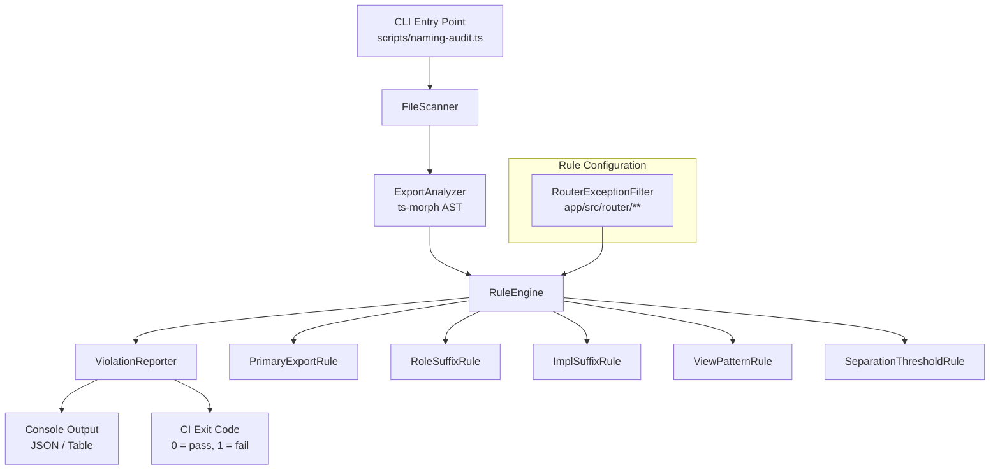
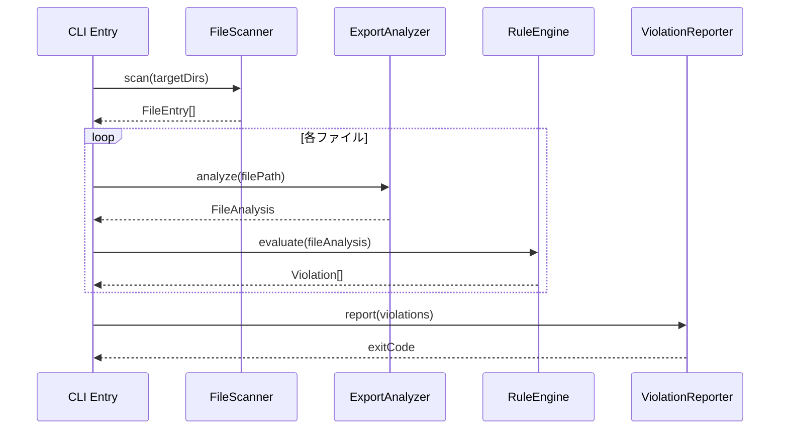
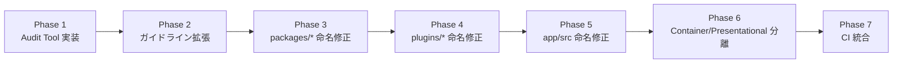
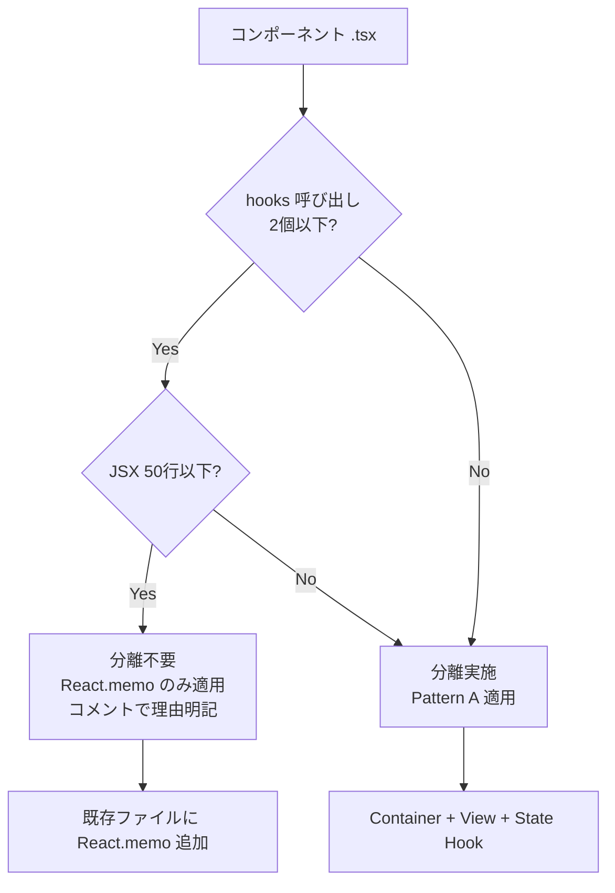

# 設計書: TypeScript ファイル命名統一 & Container/Presentational 分離

## 概要

本設計書は、モノレポ全体の `*.ts` / `*.tsx` ファイル命名規約の統一と、Container/Presentational パターンの標準化を実現するための技術設計を定義する。

主要な成果物:
1. **Audit Tool（`scripts/naming-audit.ts`）**: 命名規約違反を検出する CLI ツール
2. **リファクタリング実行計画**: Sub_Package 単位のフェーズ別移行手順
3. **命名ガイドライン拡張**: `.tsx` ファイル規約の追加

### 設計判断の根拠

- Audit Tool は TypeScript で実装し、`ts-morph` を使用して AST 解析を行う。理由: プロジェクトが TypeScript ベースであり、`ts-morph` は export シンボルの抽出に適している。
- ESLint カスタムルールではなくスタンドアロンスクリプトを選択。理由: ESLint はファイル単位の解析であり、ディレクトリ構造やファイル間の関係（re-export 検出等）を横断的に検査するには不向き。
- リファクタリングは Sub_Package 単位で PR を分割。理由: レビュー負荷の制限（要件 8.3）と、ロールバック粒度の確保。

## アーキテクチャ

### Audit Tool アーキテクチャ



### データフロー



### リファクタリング実行フロー



## コンポーネントとインターフェース

### Audit Tool コンポーネント

#### FileScanner

ファイルシステムを走査し、対象ファイルの一覧を収集する。

```typescript
interface FileEntry {
  /** Absolute path to the file */
  readonly absolutePath: string;
  /** Path relative to the sub-package root (e.g., "src/ui/components/Foo.tsx") */
  readonly relativePath: string;
  /** Sub-package identifier (e.g., "shape-plugin", "app") */
  readonly subPackage: string;
  /** File extension: ".ts" | ".tsx" */
  readonly extension: '.ts' | '.tsx';
}

interface FileScannerOptions {
  /** Target directories to scan */
  readonly targetDirs: readonly string[];
  /** Glob patterns to exclude */
  readonly excludePatterns: readonly string[];
}

function scanFiles(options: FileScannerOptions): FileEntry[];
```

#### ExportAnalyzer

`ts-morph` を使用してファイルの export 情報を解析する。

```typescript
type ExportKind = 'function' | 'class' | 'const' | 'type' | 'interface' | 'enum' | 'reExport';

interface ExportInfo {
  readonly name: string;
  readonly kind: ExportKind;
  readonly isDefault: boolean;
}

interface FileAnalysis {
  readonly file: FileEntry;
  /** Primary export: the main symbol exported from this file */
  readonly primaryExport: ExportInfo | null;
  /** All exports from this file */
  readonly exports: readonly ExportInfo[];
  /** Whether this file is a re-export-only wrapper */
  readonly isReExportOnly: boolean;
  /** For .tsx files: number of JSX lines, hook call count */
  readonly componentMetrics: ComponentMetrics | null;
}

interface ComponentMetrics {
  readonly jsxLineCount: number;
  readonly hookCallCount: number;
  readonly usesReactMemo: boolean;
  readonly hookNames: readonly string[];
}
```

#### RuleEngine

各ルールを評価し、違反を検出する。

```typescript
type Severity = 'error' | 'warning';

type InconsistencyPattern = 1 | 2 | 3 | 4 | 5 | 6;

interface Violation {
  readonly file: FileEntry;
  readonly pattern: InconsistencyPattern;
  readonly severity: Severity;
  readonly message: string;
  readonly suggestedRename: string;
}

interface Rule {
  readonly name: string;
  evaluate(analysis: FileAnalysis): Violation[];
}

interface RuleEngineConfig {
  /** Paths to treat as router-convention exceptions (warning instead of error) */
  readonly routerExceptionPaths: readonly string[];
}

function evaluateRules(
  analyses: readonly FileAnalysis[],
  rules: readonly Rule[],
  config: RuleEngineConfig,
): Violation[];
```

### Container/Presentational 分離パターン

#### パターン A（標準パターン）

```
ComponentName/
  ComponentName.tsx              → Container
  ComponentNameView.tsx          → Presentational (React.memo)
  useComponentNameState.ts       → State hook
```

#### Container コンポーネント例

```typescript
// CacheManagementSection.tsx — Container
import { useCacheManagementSectionState } from './useCacheManagementSectionState.js';
import { CacheManagementSectionView } from './CacheManagementSectionView.js';

interface CacheManagementSectionProps {
  readonly config: ShapeBuildConfig;
  readonly onChange: (config: ShapeBuildConfig) => void;
}

export const CacheManagementSection: React.FC<CacheManagementSectionProps> = (props) => {
  const state = useCacheManagementSectionState(props);
  return <CacheManagementSectionView {...state} />;
};
```

#### State Hook 例

```typescript
// useCacheManagementSectionState.ts — State hook
import { useTranslation } from '@hierarchidb/ui-i18n';
import { useCallback, useMemo } from 'react';

interface CacheManagementSectionStateProps {
  readonly config: ShapeBuildConfig;
  readonly onChange: (config: ShapeBuildConfig) => void;
}

export interface CacheManagementSectionViewProps {
  readonly t: TFunction;
  readonly geometryConfig: GeometryConfig;
  readonly onGeometryConfigChange: (config: GeometryConfig) => void;
  readonly hoverCardSx: SxProps;
}

export function useCacheManagementSectionState(
  props: CacheManagementSectionStateProps,
): CacheManagementSectionViewProps {
  const { t } = useTranslation('shape-plugin');
  const { config, onChange } = props;

  const onGeometryConfigChange = useCallback(
    (geometryConfig: GeometryConfig) => {
      onChange({ ...config, geometryConfig });
    },
    [config, onChange],
  );

  const hoverCardSx = useMemo(() => ({ /* ... */ }), []);

  return { t, geometryConfig: config.geometryConfig, onGeometryConfigChange, hoverCardSx };
}
```

#### Presentational コンポーネント例

```typescript
// CacheManagementSectionView.tsx — Presentational (React.memo)
import React from 'react';

import type { CacheManagementSectionViewProps } from './useCacheManagementSectionState.js';

export const CacheManagementSectionView = React.memo<CacheManagementSectionViewProps>(
  ({ t, geometryConfig, onGeometryConfigChange, hoverCardSx }) => {
    return (
      <Accordion>
        {/* JSX rendering only — no hooks, no side effects */}
      </Accordion>
    );
  },
);

CacheManagementSectionView.displayName = 'CacheManagementSectionView';
```

#### 分離判断フローチャート




## データモデル

### Audit Tool 内部データモデル

```typescript
/** Classification of a file's role based on its content and naming */
type FileRole =
  | 'component'       // React component (.tsx)
  | 'view'            // Presentational component (*View.tsx)
  | 'container'       // Container component (ComponentName.tsx with View counterpart)
  | 'hook'            // React hook (use*.ts)
  | 'stateHook'       // State hook (use*State.ts)
  | 'types'           // Type definitions (*Types.ts / types.ts)
  | 'constants'       // Constants (*Constants.ts / constants.ts)
  | 'utils'           // Utilities (*Utils.ts / utils.ts)
  | 'validators'      // Validators (*Validators.ts / validators.ts)
  | 'index'           // Re-export entry (index.ts)
  | 'internal'        // Internal implementation (*.internal.ts)
  | 'impl'            // Interface implementation (*.impl.ts)
  | 'core'            // Algorithm core (*.core.ts)
  | 'other';          // Unclassified

/** Result of classifying a single file */
interface FileClassification {
  readonly file: FileEntry;
  readonly detectedRole: FileRole;
  readonly expectedRole: FileRole;
  readonly primaryExportName: string | null;
  readonly expectedFileName: string | null;
}

/** Audit summary for a sub-package */
interface AuditSummary {
  readonly subPackage: string;
  readonly totalFiles: number;
  readonly violations: readonly Violation[];
  readonly warnings: readonly Violation[];
  readonly compliant: number;
}
```

### リファクタリング計画データモデル

```typescript
/** A single rename operation */
interface RenameOperation {
  readonly source: string;
  readonly destination: string;
  readonly pattern: InconsistencyPattern;
  readonly reason: string;
  /** Files that import the source and need path updates */
  readonly affectedImports: readonly string[];
}

/** A refactoring plan for a single sub-package */
interface SubPackageRefactorPlan {
  readonly subPackage: string;
  readonly renames: readonly RenameOperation[];
  readonly separations: readonly ComponentSeparation[];
  readonly memoApplications: readonly string[];
}

/** A Container/Presentational separation operation */
interface ComponentSeparation {
  readonly originalFile: string;
  readonly containerFile: string;
  readonly viewFile: string;
  readonly stateHookFile: string;
  readonly metrics: ComponentMetrics;
}
```

## 正確性プロパティ

*プロパティとは、システムの全ての有効な実行において真であるべき特性や振る舞いのことである。本質的には、システムが何をすべきかについての形式的な記述であり、人間が読める仕様と機械で検証可能な正確性保証の橋渡しとなる。*

### Property 1: 命名違反の検出と推奨改名の正確性

*任意の* ファイルパスと export シンボルの組み合わせに対して、Audit Tool の `evaluateRules` 関数は以下を満たす:
- Naming_Guideline に違反するファイルを正しく検出する
- 各違反に対して有効な `InconsistencyPattern` 番号（1〜6）を付与する
- 各違反に対して空でない `suggestedRename` を出力する

**検証対象: 要件 1.1, 1.2**

### Property 2: ルーター例外パスの警告レベル分類

*任意の* `app/src/router/**` 配下のファイルパスに対して、Audit Tool は `severity: 'warning'` を返し、`severity: 'error'` を返さない。

**検証対象: 要件 1.4**

### Property 3: 役割サフィックスの正規化

*任意の* 単一役割ファイル（型定義のみ / 定数のみ / ユーティリティのみ）に対して、Audit Tool は以下の正規化されたサフィックスを推奨する:
- 型定義のみ → `*Types.ts` または `types.ts`
- 定数のみ → `*Constants.ts` または `constants.ts`
- ユーティリティのみ → `*Utils.ts` または `utils.ts`

**検証対象: 要件 3.1, 3.2, 3.3**

### Property 4: View サフィックス検出

*任意の* `.tsx` ファイルについて、hooks 呼び出しを含まず props のみに依存するコンポーネントが `*View.tsx` サフィックスを持たない場合、Audit Tool はパターン 6 の違反として検出する。

**検証対象: 要件 5.3**

### Property 5: 分離閾値判定

*任意の* `.tsx` コンポーネントファイルについて:
- JSX 行数 ≤ 50 かつ hooks 呼び出し数 ≤ 2 の場合、分離不要と判定する
- JSX 行数 > 50 または hooks 呼び出し数 > 2 の場合、分離推奨と判定する

**検証対象: 要件 7.4**

## エラーハンドリング

### Audit Tool のエラーハンドリング

| エラー種別 | 対処 | 終了コード |
|---|---|---|
| ファイル読み取り失敗 | 警告ログを出力し、該当ファイルをスキップして続行 | 0（他に違反がなければ） |
| `ts-morph` パース失敗 | 警告ログを出力し、該当ファイルをスキップして続行 | 0（他に違反がなければ） |
| 対象ディレクトリ不存在 | エラーログを出力し、即座に終了 | 2 |
| 命名違反検出（error レベル） | 違反一覧を出力 | 1 |
| 命名違反検出（warning のみ） | 違反一覧を出力 | 0 |

### リファクタリングのエラーハンドリング

| エラー種別 | 対処 |
|---|---|
| `git mv` 失敗 | 改名を中止し、エラーを報告。手動対応を指示 |
| `pnpm typecheck` 失敗 | import パスの更新漏れを調査。`git checkout` でロールバック |
| 循環依存検出 | 改名を中止し、依存関係整理の Issue を起票（要件 8.4） |
| テスト失敗 | 失敗テストを分析し、memo 化対応が必要か判断（要件 6.3） |

### ロールバック手順

各 PR は以下のロールバック手順を明記する:

```bash
# 1. PR のコミットを特定
git log --oneline -5

# 2. revert コミットを作成
git revert <commit-hash> --no-edit

# 3. typecheck で整合性確認
pnpm lint && pnpm typecheck && pnpm test
```

## テスト戦略

### テストの二層構造

#### 1. プロパティベーステスト（Audit Tool ロジック）

Audit Tool の純粋関数ロジックに対して、`fast-check` を使用したプロパティベーステストを実施する。

- 各プロパティテストは最低 100 回のイテレーションを実行
- 各テストは設計書のプロパティ番号を参照するタグを付与
- タグ形式: `Feature: ts-naming-and-presentational-refactor, Property {number}: {property_text}`

対象プロパティ:
- Property 1: 命名違反の検出と推奨改名の正確性
- Property 2: ルーター例外パスの警告レベル分類
- Property 3: 役割サフィックスの正規化
- Property 4: View サフィックス検出
- Property 5: 分離閾値判定

#### 2. ユニットテスト（具体例・エッジケース）

| テスト対象 | テスト内容 |
|---|---|
| `ExportAnalyzer` | 既知のファイルパターン（re-export ラッパー、型定義集約等）の正しい解析 |
| `RuleEngine` | 各 `InconsistencyPattern` の具体的な違反例と非違反例 |
| `ComponentMetrics` | JSX 行数・hooks 呼び出し数の正確なカウント |
| Router 例外 | `app/src/router/routes/dialog/dialogRoutes.tsx` 等の具体パス |

#### 3. 統合テスト（リファクタリング検証）

各 Sub_Package のリファクタリング PR で以下を実行:

```bash
# 型チェック
pnpm -w turbo run typecheck --filter @hierarchidb/<pkg>

# lint
pnpm -w turbo run lint --filter @hierarchidb/<pkg>

# テスト
pnpm -w turbo run test --filter @hierarchidb/<pkg>

# 循環依存チェック
pnpm depcruise --config .dependency-cruiser.cjs <target-dir>
```

### CI 統合

Audit Tool を CI パイプラインに統合し、新規ファイル追加時の命名違反を自動検出する:

```yaml
# .github/workflows/naming-audit.yml (概要)
- name: Run naming audit
  run: pnpm tsx scripts/naming-audit.ts --ci
  # exit code 1 で PR をブロック
```

### フェーズ別実行計画

| フェーズ | 対象 | PR 粒度 | 依存関係 |
|---|---|---|---|
| 1 | Audit Tool 実装 + テスト | 1 PR | なし |
| 2 | `docs/ts-file-naming-guideline.md` 拡張 | 1 PR | Phase 1 |
| 3 | `packages/*` 命名修正 | パッケージごとに 1 PR | Phase 2 |
| 4 | `plugins/*` 命名修正 | プラグインごとに 1 PR | Phase 2 |
| 5 | `app/src` 命名修正 | ディレクトリごとに 1 PR | Phase 2 |
| 6 | Container/Presentational 分離 | コンポーネント群ごとに 1 PR | Phase 3-5 |
| 7 | CI 統合（Audit Tool を CI に組み込み） | 1 PR | Phase 1 |

Phase 3〜5 は並行実施可能。Phase 6 は命名修正完了後に実施する（ファイル名が安定した状態で分離を行うため）。
