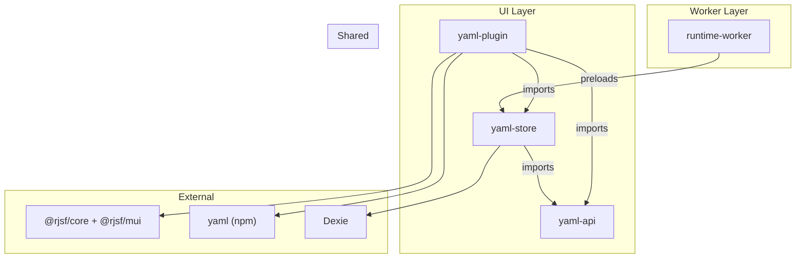
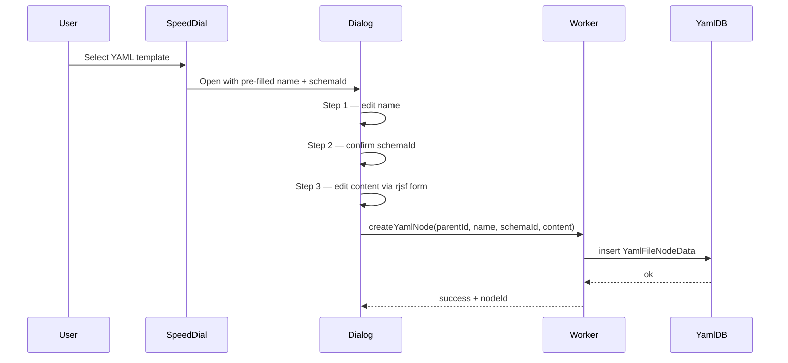
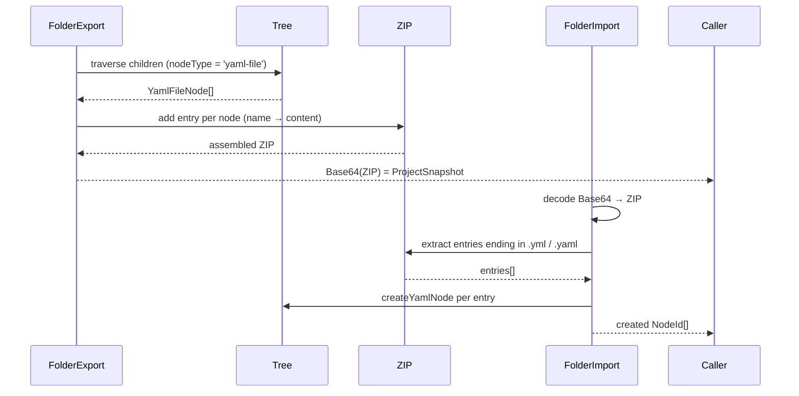

# Design Document: yaml-file-node

> [!IMPORTANT]
> Status: historical baseline. This document records the original three-step YAML design and is not the SSOT for the current subtype, data model, draft, or IDE-GSM Step 4 contract. See [`docs/yaml-plugin-ide-gsm-step4-spec.md`](../../../docs/yaml-plugin-ide-gsm-step4-spec.md). Where this document conflicts with that specification, the `docs/` specification applies.

## Overview

This feature adds a new tree node type `YamlFileNode` (`nodeType = 'yaml-file'`) to hierarchidb for IDE-GSM integration.
A `YamlFileNode` represents a YAML configuration file within a folder node, created and edited through a 3-step dialog.

The implementation follows the existing `spreadsheet-plugin` / `folder-plugin` patterns and is split across three new packages:

- `packages/yaml-api` — shared type definitions, template list, and JSON Schema objects (SSOT)
- `packages/yaml-store` — Worker-side IndexedDB CRUD logic (Dexie)
- `plugins/yaml-plugin` — UI-side 3-step dialog, steps-provider, plugin manifest

## Architecture



### Data Flow: Create



### Data Flow: Export / Import



## Components and Interfaces

### Package: `yaml-api`

Provides the SSOT for all shared types, templates, and schemas.
No runtime dependencies on UI or Worker packages.

```
packages/yaml-api/src/
  YamlFileNodeData.ts   — YamlFileNodeData interface + YAML_NODE_TYPE constant
  YamlTemplate.ts       — YamlTemplate type + YAML_TEMPLATES constant + findYamlTemplate()
  yamlSchemas.ts        — YAML_SCHEMAS record + getYamlSchema()
  index.ts              — re-export only
```

Key interfaces:

```ts
// YamlFileNodeData.ts
export const YAML_NODE_TYPE = 'yaml-file' as NodeType;

export interface YamlFileNodeData {
  name: string;      // file name, e.g. "scenario.yml"
  schemaId: string;  // JSON Schema identifier, e.g. "ide-gsm/scenario"
  content: string;   // YAML text produced by the schema editor
}
```

```ts
// YamlTemplate.ts
export interface YamlTemplate {
  templateId: string;
  displayName: string;
  fileName: string;
  schemaId: string;
}

export const YAML_TEMPLATES: readonly YamlTemplate[] = [ /* 10 entries */ ] as const;

export function findYamlTemplate(templateId: string): YamlTemplate | undefined;
```

```ts
// yamlSchemas.ts
export const YAML_SCHEMAS: Record<string, object> = {
  'ide-gsm/sources':  { /* ... */ },
  'ide-gsm/scenario': { /* ... */ },
  'ide-gsm/calib':    { /* ... */ },
  'ide-gsm/remote':   { /* ... */ },
  'ide-gsm/ssh':      { /* ... */ },
  'ide-gsm/ec2':      { /* ... */ },
};

export function getYamlSchema(schemaId: string): object | undefined;
```

### Package: `yaml-store`

Worker-side IndexedDB CRUD using Dexie. Follows the `location-store` pattern.

```
packages/yaml-store/src/
  YamlDB.ts              — Dexie subclass, singleton accessor
  yamlNodeOperations.ts  — createYamlNode / updateYamlNode / deleteYamlNode
  index.ts               — re-export only
```

`YamlDB` stores `YamlFileNodeData` keyed by `nodeId`:

```ts
// YamlDB.ts
export class YamlDB extends Dexie {
  nodes!: Table<YamlFileNodeData & { nodeId: NodeId }, NodeId>;

  constructor() {
    super(getDBName('yaml'));
    this.version(1).stores({ nodes: '&nodeId' });
    this.nodes = this.table('nodes');
  }
}
```

CRUD operations in `yamlNodeOperations.ts`:

- `createYamlNode(nodeId, data)` — inserts a new record; errors if nodeId already exists
- `updateYamlNode(nodeId, patch)` — updates fields; errors if nodeId not found
- `deleteYamlNode(nodeId)` — removes record; errors if nodeId not found

### Plugin: `yaml-plugin`

UI-side plugin following the `spreadsheet-plugin` pattern.

```
plugins/yaml-plugin/src/
  plugin-manifest.ts
  index.ts
  icon/
    YamlPluginIcon.tsx
    index.ts
  common/
    types/
      YamlEntity.ts        — YamlDraft = Partial<YamlFileNodeData>
    constants.ts
  ui/
    index.ts
    components/
      steps-provider.tsx
      steps/
        YamlBasicInfoStep.tsx
        YamlSchemaSelectionStep.tsx
        YamlSchemaEditorStep.tsx
  worker/
    index.ts
    registerYamlWorkerStores.ts
```

#### plugin-manifest.ts

Declares `nodeType = 'yaml-file'`, `extends: 'folder'`, `category.menuGroup = 'yaml'`, and 3 step title keys.
Follows the `PluginManifest` structure from `@hierarchidb/plugin-base` (same as `spreadsheet-plugin`).

#### steps-provider.tsx

Registers a `PluginStepConfigProvider` for `'yaml-file'` with 3 steps:

| Step | id | Proceed condition |
|------|----|-------------------|
| 1 | `basic-info` | `Boolean(data?.name?.trim())` |
| 2 | `schema-selection` | `Boolean(data?.schemaId)` |
| 3 | `schema-editor` | always (canSave = true) |

#### YamlSchemaEditorStep.tsx (Step 3)

- Calls `getYamlSchema(data.schemaId)` to retrieve the JSON Schema
- Renders `<Form schema={...} validator={...} />` from `@rjsf/core` with `@rjsf/mui` widgets
- On `onChange`, converts the form data object to YAML text via the `yaml` npm package and calls `props.onChange({ ...data, content: yamlText })`

#### registerYamlWorkerStores.ts

Preloaded by the Worker. Initialises `YamlDB` singleton so it is ready before any CRUD command arrives.

### Folder Export / Import Extension

The existing `folder-plugin` export/import logic is extended to handle `YamlFileNode` entries.

**Export additions:**
- During folder traversal, collect nodes where `nodeType === 'yaml-file'`
- For each such node, add a ZIP entry: path = `node.data.name`, content = UTF-8 bytes of `node.data.content`
- If two nodes share the same `name`, abort and return a name-conflict error before producing any ZIP output

**Import additions:**
- After decoding the Base64 ProjectSnapshot to a ZIP, filter entries whose path ends with `.yml` or `.yaml`
- For each matching entry, issue a `createYamlNode` command under the target folder
- If any entry's content is not valid UTF-8, abort the entire import without partial writes
- On success, return the list of newly created `NodeId` values

## Data Models

### YamlFileNodeData (stored in IndexedDB via YamlDB)

| Field | Type | Required | Description |
|-------|------|----------|-------------|
| `nodeId` | `NodeId` | yes | Primary key (assigned by core tree) |
| `name` | `string` | yes | File name, e.g. `scenario.yml` |
| `schemaId` | `string` | yes | JSON Schema identifier |
| `content` | `string` | no | YAML text; empty string when not yet edited |

### YamlTemplate (static, defined in yaml-api)

| Field | Type | Description |
|-------|------|-------------|
| `templateId` | `string` | Unique identifier |
| `displayName` | `string` | Label shown in SpeedDial / context menu |
| `fileName` | `string` | Default file name pre-filled in Step 1 |
| `schemaId` | `string` | JSON Schema to use in Step 2 / Step 3 |

### ProjectSnapshot (exchange format with IDE-GSM)

A Base64-encoded ZIP string. Each YAML file node contributes one ZIP entry:
- Entry path: `YamlFileNodeData.name`
- Entry content: UTF-8 encoded `YamlFileNodeData.content`

## Correctness Properties

*A property is a characteristic or behavior that should hold true across all valid executions of a system — essentially, a formal statement about what the system should do. Properties serve as the bridge between human-readable specifications and machine-verifiable correctness guarantees.*

### Property 1: YAML_TEMPLATES uniqueness invariant

*For any* two distinct entries in `YAML_TEMPLATES`, their `templateId` values SHALL differ and their `fileName` values SHALL differ.

**Validates: Requirements 2.1**

### Property 2: Unknown templateId lookup returns undefined

*For any* string that is not a `templateId` present in `YAML_TEMPLATES`, calling `findYamlTemplate` with that string SHALL return `undefined`.

**Validates: Requirements 2.3**

### Property 3: CRUD lifecycle consistency

*For any* valid `YamlFileNodeData` payload, the following sequence SHALL hold:
1. `createYamlNode` succeeds and the node is readable with the original `name`, `schemaId`, and `content`
2. `updateYamlNode` with new field values succeeds and the node is readable with the updated values and an incremented `version`
3. `deleteYamlNode` succeeds and a subsequent read returns a not-found error

**Validates: Requirements 3.1, 3.2, 3.3**

### Property 4: Invalid parent rejects create

*For any* create command where `parentId` does not reference a `Folder` node, the Worker SHALL return an error result and no new node SHALL be persisted.

**Validates: Requirements 3.4**

### Property 5: Non-existent node rejects update and delete

*For any* `nodeId` that does not exist in the tree, both `updateYamlNode` and `deleteYamlNode` SHALL return an error result without modifying any other state.

**Validates: Requirements 3.5**

### Property 6: Template pre-population

*For any* template in `YAML_TEMPLATES`, opening the create dialog with that template SHALL produce an initial `YamlDraft` where `name === template.fileName` and `schemaId === template.schemaId`.

**Validates: Requirements 4.2, 5.2**

### Property 7: JSON-to-YAML round-trip

*For any* JSON-serializable object produced by the rjsf form, converting it to YAML via the `yaml` package and then parsing that YAML back to a plain object SHALL produce a value deeply equal to the original object.

**Validates: Requirements 4.6**

### Property 8: Empty name validation rejects proceed

*For any* string composed entirely of whitespace characters (including the empty string), the Step 1 `validate` function SHALL return `false`, preventing navigation to Step 2.

**Validates: Requirements 4.7**

### Property 9: Export-import round-trip preserves name and content

*For any* non-empty set of `YamlFileNode` entries under a folder (with distinct `name` values), exporting the folder to a `ProjectSnapshot` and then importing that snapshot into a new folder SHALL produce `YamlFileNode` entries where each `name` and `content` value is identical to the original.

**Validates: Requirements 6.1, 6.2, 6.3, 7.1, 7.2, 8.1, 8.2**

### Property 10: Round-trip assigns new NodeIds

*For any* export-import cycle, the `NodeId` values assigned to the imported `YamlFileNode` entries SHALL differ from the `NodeId` values of the original entries.

**Validates: Requirements 8.3**

### Property 11: Duplicate name on export returns error

*For any* folder containing two or more `YamlFileNode` entries with the same `name` value, the export operation SHALL return an error result and SHALL NOT produce any ZIP output.

**Validates: Requirements 6.5**

### Property 12: Invalid Base64 import returns error

*For any* string that is not valid Base64, calling the import operation with that string as the `ProjectSnapshot` SHALL return an error result and SHALL NOT create any node.

**Validates: Requirements 7.4**

## Error Handling

| Scenario | Behaviour |
|----------|-----------|
| `createYamlNode` with non-folder `parentId` | Return typed error result; no DB write |
| `updateYamlNode` / `deleteYamlNode` with unknown `nodeId` | Return typed error result; no DB write |
| Export with duplicate `name` values | Return name-conflict error before ZIP assembly begins |
| Import with invalid Base64 | Return decode error; no nodes created |
| Import with malformed ZIP | Return ZIP-parse error; no nodes created |
| Import with non-UTF-8 entry content | Return encoding error; entire import aborted (no partial writes) |
| `getYamlSchema` with unknown `schemaId` | Return `undefined`; caller is responsible for handling missing schema |
| `findYamlTemplate` with unknown `templateId` | Return `undefined`; caller is responsible for handling missing template |

All error paths follow the existing result-type pattern used in the codebase (no thrown exceptions for expected failure modes).
Non-null assertion (`!`) is prohibited throughout; all optional lookups must be guarded explicitly.

## Testing Strategy

### Dual Testing Approach

Both unit tests and property-based tests are required. They are complementary:
- Unit tests cover specific examples, integration points, and edge cases
- Property-based tests verify universal invariants across randomised inputs

### Property-Based Testing

Library: **fast-check** (already used in the workspace).
Each property test runs a minimum of **100 iterations**.

Each test is tagged with a comment in the following format:
`// Feature: yaml-file-node, Property <N>: <property_text>`

| Design Property | Test file | fast-check strategy |
|-----------------|-----------|---------------------|
| P1: YAML_TEMPLATES uniqueness | `yaml-api/__tests__/YamlTemplate.test.ts` | Assert on static array (example + invariant check) |
| P2: Unknown templateId → undefined | `yaml-api/__tests__/YamlTemplate.test.ts` | `fc.string()` filtered to exclude known templateIds |
| P3: CRUD lifecycle | `yaml-store/__tests__/yamlNodeOperations.test.ts` | `fc.record({ name, schemaId, content })` |
| P4: Invalid parent rejects create | `yaml-store/__tests__/yamlNodeOperations.test.ts` | `fc.string()` for non-folder parentId |
| P5: Non-existent node error | `yaml-store/__tests__/yamlNodeOperations.test.ts` | `fc.string()` for unknown nodeId |
| P6: Template pre-population | `yaml-plugin/__tests__/stepsProvider.test.ts` | `fc.constantFrom(...YAML_TEMPLATES)` |
| P7: JSON→YAML round-trip | `yaml-plugin/__tests__/YamlSchemaEditorStep.test.ts` | `fc.object()` |
| P8: Empty name validation | `yaml-plugin/__tests__/stepsProvider.test.ts` | `fc.string().filter(s => s.trim() === '')` |
| P9: Export-import round-trip | `folder-plugin/__tests__/yamlRoundTrip.test.ts` | `fc.array(fc.record({ name, content }), { minLength: 1 })` with distinct names |
| P10: Round-trip assigns new NodeIds | `folder-plugin/__tests__/yamlRoundTrip.test.ts` | Same generator as P9 |
| P11: Duplicate name → export error | `folder-plugin/__tests__/yamlRoundTrip.test.ts` | `fc.array(...)` with forced duplicate name |
| P12: Invalid Base64 → import error | `folder-plugin/__tests__/yamlRoundTrip.test.ts` | `fc.string()` filtered to invalid Base64 |

### Unit Tests

Focus areas:
- `getYamlSchema` returns the correct schema object for each of the 6 known schemaIds
- `findYamlTemplate` returns the correct entry for each of the 10 known templateIds
- Step 1 `validate` returns `true` for a non-empty, non-whitespace name
- Step 2 `canProceedToNext` returns `false` when `schemaId` is absent
- Export produces a ZIP with the correct number of entries for a known fixture
- Import correctly skips ZIP entries that do not end in `.yml` or `.yaml`
- `registerYamlWorkerStores` completes without error when called with an already-aborted signal

### Vite optimizeDeps

When `@rjsf/core`, `@rjsf/mui`, and `yaml` are added as imports in `yaml-plugin`, the following must be done simultaneously:
1. Add each package to `app/package.json` `dependencies`
2. Add each package (and any deep import paths) to `app/vite.config.ts` `optimizeDeps.include`
3. Run `pnpm install` to verify resolution
