# CLAUDE.md

This file provides guidance to Claude Code (claude.ai/code) when working with code in this repository.

## Project Overview

HierarchiDB is a high-performance tree-structured data management framework for browser environments. It implements a 4-layer architecture with strict UI-Worker separation via Comlink RPC, dual database strategy (CoreDB/EphemeralDB), and a plugin-based node type system.

## Essential Commands

### Development
- `pnpm install` - Install dependencies (enforces pnpm via preinstall hook)
- `pnpm dev` - Start all development servers in parallel (Turborepo)
- `pnpm build` - Build all packages respecting dependency order
- `pnpm build --force` - Force rebuild without cache

### Testing & Quality
- `pnpm typecheck` - TypeScript checking across all packages
- `pnpm lint` - ESLint validation
- `pnpm format` - Prettier formatting
- `pnpm test` - Unit tests (Vitest)
- `pnpm test:run` - Run tests once without watch
- `pnpm e2e` - E2E tests (Playwright)

### Package-Specific Commands
- `pnpm --filter @hierarchidb/[package] dev` - Run specific package in dev mode
- `pnpm --filter @hierarchidb/[package] build` - Build specific package
- `pnpm --filter @hierarchidb/[package] test` - Test specific package
- `pnpm storybook:ui-core` - Launch UI component Storybook

### Turborepo Usage (Development Operations)
- **Watch specific packages**: `turbo run dev --filter=@hierarchidb/core --filter=@hierarchidb/api --parallel`
- **Build with dependencies**: `turbo run build --filter=@hierarchidb/app` (builds all dependencies first)
- **Force rebuild without cache**: `TURBO_FORCE=true turbo run build --filter=@hierarchidb/core`
- **Development workflow**:
  1. Start app with HMR: `pnpm dev --filter @hierarchidb/app`
  2. Watch library changes: `pnpm --filter @hierarchidb/worker dev` (runs tsc --watch)
  3. For multiple packages: `turbo run dev --filter=@hierarchidb/app --filter=@hierarchidb/core --parallel`

### Document Analysis Tool
- **Analyze docs structure**: `pnpm analyze:docs` - Generates report in docs/_analysis.md
- Checks document flow, similarity between chapters, and suggests missing sections
- Reports help identify gaps and redundancies in documentation

### Build Verification Checklist
After making changes, ALWAYS run in order:
1. `pnpm typecheck` - Must pass without errors (checks branded type usage)
2. `pnpm lint` - Must pass without errors
3. `pnpm test:run` - All tests must pass (includes ID type casting tests)
4. `pnpm build` - Must complete successfully

**Common TypeScript Issues After ID Changes**:
- Missing `as NodeId` / `as TreeId` type casts
- Using deprecated `TreeRootNodeTypes` enum (use string literals)
- Incorrect branded type assignments in test files
- Missing type imports in worker package files

## Architecture

### 4-Layer System
```
UI Layer (React/MUI) ←→ Comlink RPC ←→ Worker Layer ←→ Dexie (CoreDB/EphemeralDB)
```

### Core Patterns

**Working Copy Pattern**
1. Create working copy in EphemeralDB
2. Edit working copy (isolated from main data)
3. Commit to CoreDB or discard
4. Supports full undo/redo via ring buffer

**ID Consistency Rules**:
- **Draft nodes**: Use new generated NodeId for both `id` and working copy key
- **Existing nodes**: Working copy uses same NodeId as original node
- **Type safety**: All IDs properly cast to branded types (`NodeId`, `TreeId`)
- **Working copy operations**: `createNewDraftWorkingCopy()`, `createWorkingCopyFromNode()`, `commitWorkingCopy()`

**Command Pattern**
- All mutations go through CommandManager
- Commands are serializable for undo/redo
- Worker processes commands with lifecycle hooks

**Subscription System**
- UI subscribes to node changes
- Worker detects diffs and publishes updates
- Automatic cleanup on unsubscribe

### Package Dependencies

```mermaid
graph TB
    %% Foundation Layer
    core["core<br/>(types, patterns, utilities)"]
    
    %% API Contract Layer
    api["api<br/>(Comlink interfaces)"]
    
    %% Implementation Layer
    worker["worker<br/>(database, commands)"]
    
    %% UI Foundation Layer
    ui-theme["ui-theme<br/>(MUI theme)"]
    ui-core["ui-core<br/>(base components)"]
    ui-client["ui-client<br/>(worker connection)"]
    
    %% UI Feature Layer
    ui-auth["ui-auth<br/>(authentication)"]
    ui-i18n["ui-i18n<br/>(i18n)"]
    ui-routing["ui-routing<br/>(routing)"]
    ui-navigation["ui-navigation<br/>(navigation)"]
    ui-layout["ui-layout<br/>(layout)"]
    
    %% UI Specialized Components
    ui-file["ui-file<br/>(file handling)"]
    ui-dialog["ui-dialog<br/>(dialogs)"]
    ui-map["ui-map<br/>(maps)"]
    ui-monitoring["ui-monitoring<br/>(monitoring)"]
    ui-usermenu["ui-usermenu<br/>(user menu)"]
    ui-import-export["ui-import-export-plugin"]
    ui-specialized["Other UI<br/>(accordion, country-select,<br/>csv, datasource, etc.)"]
    
    %% TreeConsole Components
    tc-parts["TreeConsole Parts<br/>(breadcrumb, footer,<br/>toolbar, treetable, etc.)"]
    tc-base["ui-treeconsole-base<br/>(orchestrator)"]
    
    %% Plugin Layer
    plugin-basemap["plugin-basemap"]
    plugin-folder["plugin-folder"]
    plugin-project["plugin-project"]
    plugin-shape["plugin-shape"]
    plugin-spreadsheet["plugin-spreadsheet"]
    plugin-stylemap["plugin-stylemap"]
    plugin-import-export["plugin-import-export"]
    
    %% Application Layer
    app["app<br/>(main application)"]
    
    %% Backend Services (Independent)
    bff["backend-bff"]
    cors-proxy["backend-cors-proxy"]
    
    %% Dependencies
    api --> core
    worker --> api
    worker --> core
    
    ui-core --> core
    ui-client --> api
    ui-client --> core
    ui-client --> ui-core
    
    ui-i18n --> core
    ui-routing --> ui-core
    ui-navigation --> ui-core
    ui-layout --> ui-core
    ui-layout --> ui-theme
    
    ui-file --> ui-core
    ui-dialog --> core
    ui-map --> core
    ui-monitoring --> core
    ui-monitoring --> ui-core
    ui-usermenu --> ui-auth
    ui-usermenu --> ui-i18n
    ui-usermenu --> ui-monitoring
    ui-usermenu --> ui-theme
    
    ui-import-export --> core
    ui-import-export --> ui-client
    ui-import-export --> ui-core
    ui-import-export --> tc-parts
    
    tc-parts --> core
    tc-base --> api
    tc-base --> core
    tc-base --> ui-client
    tc-base --> tc-parts
    
    plugin-basemap --> core
    plugin-basemap --> api
    plugin-basemap --> ui-core
    plugin-basemap --> ui-client
    plugin-basemap --> ui-map
    
    plugin-folder --> core
    plugin-folder --> api
    plugin-folder --> ui-core
    plugin-folder --> ui-dialog
    
    plugin-project --> core
    plugin-project --> api
    plugin-project --> ui-client
    plugin-project --> ui-map
    
    plugin-shape --> api
    plugin-shape --> core
    plugin-shape --> ui-client
    plugin-shape --> ui-core
    plugin-shape --> ui-specialized
    plugin-shape --> ui-dialog
    
    plugin-spreadsheet --> core
    plugin-spreadsheet --> ui-auth
    plugin-spreadsheet --> ui-file
    
    plugin-stylemap --> core
    plugin-stylemap --> ui-file
    
    plugin-import-export --> core
    plugin-import-export --> api
    
    app --> core
    app --> ui-auth
    app --> ui-client
    app --> ui-core
    app --> ui-i18n
    app --> ui-layout
    app --> ui-navigation
    app --> ui-routing
    app --> ui-theme
    app --> ui-import-export
    app --> ui-usermenu
    app --> tc-base
    app --> ui-specialized
    
    %% Styling
    classDef foundation fill:#e1f5fe,stroke:#01579b,stroke-width:2px
    classDef api fill:#f3e5f5,stroke:#4a148c,stroke-width:2px
    classDef implementation fill:#fff3e0,stroke:#e65100,stroke-width:2px
    classDef ui fill:#e8f5e9,stroke:#1b5e20,stroke-width:2px
    classDef plugin fill:#fce4ec,stroke:#880e4f,stroke-width:2px
    classDef app fill:#fff8e1,stroke:#f57f17,stroke-width:2px
    classDef backend fill:#efebe9,stroke:#3e2723,stroke-width:2px
    
    class core foundation
    class api api
    class worker implementation
    class ui-theme,ui-core,ui-client,ui-auth,ui-i18n,ui-routing,ui-navigation,ui-layout,ui-file,ui-dialog,ui-map,ui-monitoring,ui-usermenu,ui-import-export,ui-specialized,tc-parts,tc-base ui
    class plugin-basemap,plugin-folder,plugin-project,plugin-shape,plugin-spreadsheet,plugin-stylemap,plugin-import-export plugin
    class app app
    class bff,cors-proxy backend
```



#### Dependency Layers

The architecture follows a strict layered approach with clear dependency rules:

1. **Foundation Layer (Depth 0)**
   - `core` - Pure TypeScript types, branded IDs, patterns, and utilities (no runtime dependencies)
   - 25 packages depend on it (most depended upon package)

2. **API Contract Layer (Depth 1)**
   - `api` - Comlink RPC interfaces between UI and Worker layers
   - 8 packages depend on it

3. **Implementation Layer (Depth 2)**
   - `worker` - Database operations, command processing, lifecycle management
   - Depends on both core and api packages

4. **UI Foundation Layer (Depth 0-2)**
   - `ui-theme` - MUI theme configuration (standalone, depth 0)
   - `ui-core` - Base UI components (12 packages depend on it, depth 1)
   - `ui-client` - Worker connection management and React hooks (6 packages depend on it, depth 2)

5. **UI Feature Layer (Depth 0-2)**
   - `ui-auth` - Authentication components (standalone, depth 0)
   - `ui-i18n` - Internationalization support (depth 1)
   - `ui-routing` - React Router utilities (depth 2)
   - `ui-navigation` - Navigation components (depth 2)
   - `ui-layout` - Layout components (depth 2)

6. **UI Specialized Components (Depth 0-3)**
   - Standalone: `ui-guide`, `ui-landingpage`, `ui-tour`, `ui-accordion-config`, `ui-country-select`, `ui-datasource`, `ui-lru-splitview`
   - With dependencies: `ui-file`, `ui-dialog`, `ui-map`, `ui-monitoring`, `ui-csv-extract`, `ui-validation`
   - Complex: `ui-usermenu` (depth 3, depends on auth, i18n, monitoring, theme)
   - `ui-import-export-plugin` (depth 3, bridges to TreeConsole)

7. **TreeConsole Components (Depth 1-3)**
   - Parts (depth 1-2): `ui-treeconsole-breadcrumb`, `ui-treeconsole-footer`, `ui-treeconsole-speeddial`, `ui-treeconsole-toolbar`, `ui-treeconsole-trashbin`, `ui-treeconsole-treetable`
   - Orchestrator (depth 3): `ui-treeconsole-base` - Aggregates all TreeConsole parts

8. **Plugin Layer (Depth 2-3)**
   - Simple plugins: `plugin-import-export` (depth 2)
   - Standard plugins: `plugin-basemap`, `plugin-folder`, `plugin-project`, `plugin-stylemap`, `plugin-spreadsheet` (depth 3)
   - Complex plugin: `plugin-shape` (depth 3, 9 UI dependencies)
   - **All plugins correctly avoid worker dependency** ✅

9. **Application Layer (Depth 4)**
   - `app` - Main React application with routing
   - Integrates 15 different packages
   - Maximum dependency depth in the system

10. **Backend Services (Depth 0)** - Independent
    - `backend-bff` - Backend for Frontend (Cloudflare Worker)
    - `backend-cors-proxy` - CORS proxy service
    - No dependencies on other packages

#### Package Statistics

- **Total packages**: 43
- **Maximum dependency depth**: 4 (app)
- **Most depended upon**: 
  1. `core` (25 packages)
  2. `ui-core` (12 packages)
  3. `api` (8 packages)
  4. `ui-client` (6 packages)
- **No circular dependencies detected** ✅
- **All architectural rules followed** ✅

#### Key Architectural Rules

1. **No Circular Dependencies**: Higher layers depend on lower layers only
2. **Plugin Independence**: Plugins must not depend on the worker package
3. **Type-Only Core**: The core package contains no runtime code, only TypeScript types and patterns
4. **UI-Worker Separation**: UI never directly accesses the database; all operations go through the Worker via Comlink RPC
5. **Modular UI**: UI functionality is split into focused packages for better code organization and tree-shaking

### Critical Packages

- `packages/core/` - Pure TypeScript types, no runtime code
- `packages/api/` - Comlink interface contracts between UI and Worker
- `packages/worker/` - Database operations, command processing, lifecycle management
- `packages/ui-client/` - Worker connection management, React hooks
- `packages/app/` - React Router v7 file-based routing application

## Code Rules

### Refactoring and Deprecation Policy
When refactoring or renaming APIs, functions, or types:
- **Always use @deprecated JSDoc** to mark old names/methods
- Keep deprecated items functional during transition period
- Include migration guidance in deprecation message
- Example:
```typescript
/**
 * @deprecated Use `removeNodes()` instead. Will be removed in v2.0.
 */
async remove(nodeIds: NodeId[]): Promise<Result> {
  return this.removeNodes(nodeIds);
}
```
- This enables gradual migration without breaking existing code
- Remove deprecated items only after confirming all usages are updated

### TypeScript Strictness
- `any` type forbidden - use `unknown` with type guards
- Non-null assertions (`!`) prohibited - use proper null checks
- All imports must use `~/*` paths (configured via tsconfig)
- `tsc-alias` resolves paths during build
- Use `readonly` for function parameters
- Magic strings/numbers forbidden - use constants with `as const`
- Prefer early returns to reduce nesting
- Use assertion functions instead of non-null assertions:
```typescript
function assertNonNull<T>(v: T | null | undefined, msg='required'): asserts v is T {
  if (v == null) throw new Error(msg);
}
```

### ID Type System (Branded Types)
HierarchiDB uses a branded type system for strict ID type safety:

```typescript
// Core branded types
type NodeId = string & { readonly __brand: 'NodeId' };
type TreeId = string & { readonly __brand: 'TreeId' };
type EntityId = string & { readonly __brand: 'EntityId' };
```

**Type Casting Patterns**:
```typescript
// Cast string literals to branded types
const nodeId = 'node-123' as NodeId;
const treeId = 'tree-456' as TreeId;

// Cast empty strings for initialization
const initialState = {
  treeId: '' as TreeId,
  rootNodeId: '' as NodeId,
};

// Filter and cast arrays
const validNodeIds: NodeId[] = nodeIds.filter(id => 
  typeof id === 'string' && id.length > 0
) as NodeId[];
```

**Migration Notes**:
- **TreeRootNodeTypes enum deprecated** - Use string literals (`'Root'`, `'Trash'`) instead
- All database operations use branded types for compile-time safety
- Type casting required when interfacing with external data sources
- Working Copy pattern maintains ID consistency between CoreDB and EphemeralDB

### Import Paths
- Use `~/*` for package-internal imports
- Use `@hierarchidb/*` for cross-package imports
- ESLint enforces no relative imports

### React Patterns
- Controlled components only
- Required accessibility attributes
- Virtual scrolling for lists >100 items (TanStack Virtual)
- Use MUI theme tokens, no hardcoded styles

### UI Module Structure
UI functionality is split into separate packages:
- `@hierarchidb/ui-core` - Basic UI components (MUI, theme, notifications, icons)
- `@hierarchidb/ui-auth` - Authentication components (OAuth2/OIDC, auth context)
- `@hierarchidb/ui-routing` - React Router navigation and URL helpers
- `@hierarchidb/ui-i18n` - Internationalization with i18next
- `@hierarchidb/ui-client` - Worker connection management, React hooks
- `@hierarchidb/ui-layout` - Layout components
- `@hierarchidb/ui-navigation` - Navigation components
- `@hierarchidb/ui-file` - File handling components
- `@hierarchidb/ui-monitoring` - Performance monitoring
- `@hierarchidb/ui-tour` - User onboarding tours

### Worker Rules
- UI never directly accesses IndexedDB
- All database operations through Worker layer
- Transactions must have clear boundaries
- Use lifecycle hooks for extensibility

## Plugin System

### Node Type Registration
```typescript
// Define node type with branded ID types
const MyNodeDefinition: NodeTypeDefinition<Entity, SubEntity, WorkingCopy> = {
  nodeType: 'mytype', // String literal, not enum
  database: { 
    entityStore: 'mytypes',
    schema: {
      // Dexie schema with proper ID handling
      '&id': 'EntityId', // Primary key with branded type
      'nodeId': 'NodeId', // Foreign key to TreeNode
      'parentEntityId?': 'EntityId', // Optional parent reference
      'createdAt, updatedAt, version': '',
    },
    version: 1 
  },
  entityHandler: new MyEntityHandler(),
  lifecycle: {
    afterCreate: async (node: TreeNode, context) => { 
      // node.id is properly typed as NodeId
      console.log('Created node:', node.id);
    },
    beforeDelete: async (node: TreeNode, context) => { 
      // Proper cleanup with type safety
      await context.cleanupRelatedEntities(node.id);
    }
  },
  ui: {
    dialogComponent: MyDialog,
    panelComponent: MyPanel
  }
};

// Register at startup with type checking
NodeTypeRegistry.getInstance().register(MyNodeDefinition);
```

**Entity Handler Patterns**:
```typescript
class MyEntityHandler extends BaseEntityHandler<MyEntity> {
  async createEntity(nodeId: NodeId, data: Partial<MyEntity>): Promise<MyEntity> {
    const entityId = generateEntityId() as EntityId;
    const entity: MyEntity = {
      id: entityId,
      nodeId: nodeId, // Properly typed branded ID
      ...data,
      createdAt: Date.now(),
      updatedAt: Date.now(),
      version: 1,
    };
    
    await this.table.add(entity);
    return entity;
  }
}
```

## Database Strategy

### CoreDB (Long-lived)
- **TreeEntity** - Tree metadata with `TreeId` branding
- **TreeNodeEntity** - Node hierarchy with `NodeId` branding
- **TreeRootStateEntity** - Root node states with composite keys
- **Plugin entity stores** - Custom entity types with `EntityId` branding

**Key Schema Properties**:
```typescript
// Dexie schema with branded type integration
trees: '&treeId, treeRootNodeId, treeTrashRootNodeId, superRootNodeId'
nodes: '&treeNodeId, parentNodeId, &[parentNodeId+name], [parentNodeId+updatedAt], removedAt, originalParentNodeId, *references'
rootStates: '&[treeId+treeRootNodeType], treeId, treeRootNodeId'
```

### EphemeralDB (Short-lived)
- **WorkingCopyEntity** - Edit sessions with consistent NodeId keys
- **TreeViewStateEntity** - UI state persistence
- **ViewEntity** - Temporary view configurations
- Cleared on browser close or explicit cleanup

## Environment Configuration

### Development (`.env.development`)
```
VITE_APP_NAME=
# Empty for development, no base path
```

### Production (`.env.production`)
```
VITE_APP_NAME=hierarchidb
# Sets base path for deployment
```

### Security Configuration Policy
- **Non-sensitive values** (client IDs, redirect URLs): Managed in `.env` files, added to `.gitignore`
- **Sensitive values** (client secrets, JWT keys): Use Cloudflare Secrets (`wrangler secret put`)
- Never commit secrets to repository
- Use environment-specific configuration files

### React Router Base Path
Configured in `packages/app/react-router.config.ts` and `vite.config.ts` using `VITE_APP_NAME`

## Authentication Flow

1. UI initiates OAuth with provider
2. BFF (Cloudflare Worker) handles OAuth callback
3. BFF generates JWT token
4. CORS Proxy validates JWT for API requests

## Performance Guidelines

- Use `useMemo`/`useCallback` for expensive computations
- Keep Dexie transactions short and focused
- Implement virtual scrolling for large lists
- Code split at package boundaries
- Ring buffer for undo/redo (prevents memory leaks)

## Refactoring Guidelines

### Using Codemods for Safe Refactoring

When performing large-scale refactoring such as renaming functions, variables, or types across the codebase, **always use codemods** instead of manual find-and-replace. This ensures type safety and prevents breaking changes.

#### Recommended Codemod Tools

1. **jscodeshift** - Facebook's codemod toolkit
   ```bash
   # Install globally
   npm install -g jscodeshift
   
   # Example: Rename a function across all TypeScript files
   jscodeshift -t rename-function.js packages/**/*.{ts,tsx}
   ```

2. **ts-morph** - TypeScript compiler API wrapper for programmatic refactoring
   ```typescript
   import { Project } from "ts-morph";
   
   const project = new Project({
     tsConfigFilePath: "tsconfig.json",
   });
   
   // Rename a symbol across the entire project
   const sourceFile = project.getSourceFileOrThrow("src/openstreetmap-type.ts");
   const functionDecl = sourceFile.getFunctionOrThrow("oldFunctionName");
   functionDecl.rename("newFunctionName"); // Automatically updates all references
   
   await project.save();
   ```

3. **Turborepo-aware refactoring**
   ```bash
   # Use turbo to run codemods across affected packages only
   turbo run codemod --filter=...@hierarchidb/app
   ```

#### Common Refactoring Scenarios

1. **Renaming Branded Type Usage**
   ```typescript
   // Codemod to update all NodeId casts
   // Before: generateId() as NodeId
   // After: createNodeId(generateId())
   ```

2. **Updating Import Paths**
   ```typescript
   // When moving files between packages
   // Before: import { foo } from '@hierarchidb/worker/utils'
   // After: import { foo } from '@hierarchidb/core/patterns'
   ```

3. **API Method Renaming**
   ```typescript
   // Rename across Worker API and all consumers
   // Before: observeNode(nodeId)
   // After: subscribeToNode(nodeId)
   ```

#### Codemod Best Practices

1. **Test First**: Always run codemods with `--dry-run` flag first
2. **Type Check**: Run `pnpm typecheck` after each codemod
3. **Incremental Changes**: Break large refactors into smaller, testable steps
4. **Git Commits**: Commit after each successful codemod for easy rollback
5. **Update Tests**: Ensure test files are included in codemod transforms

#### Example: Renaming a Function Across Monorepo

```bash
# Step 1: Create a codemod script
cat > codemods/rename-devLog-to-logger.js << 'EOF'
module.exports = function(fileInfo, api) {
  const j = api.jscodeshift;
  const root = j(fileInfo.source);
  
  // Rename function declarations
  root.find(j.FunctionDeclaration, {
    id: { name: 'devLog' }
  }).forEach(path => {
    path.node.id.name = 'logger';
  });
  
  // Rename function calls
  root.find(j.CallExpression, {
    callee: { name: 'devLog' }
  }).forEach(path => {
    path.node.callee.name = 'logger';
  });
  
  // Rename imports/exports
  root.find(j.ImportSpecifier, {
    imported: { name: 'devLog' }
  }).forEach(path => {
    path.node.imported.name = 'logger';
    if (path.node.local.name === 'devLog') {
      path.node.local.name = 'logger';
    }
  });
  
  return root.toSource();
};
EOF

# Step 2: Run with dry-run to preview changes
jscodeshift -t codemods/rename-devLog-to-logger.js \
  packages/**/*.{ts,tsx} --dry-run

# Step 3: Apply the codemod
jscodeshift -t codemods/rename-devLog-to-logger.js \
  packages/**/*.{ts,tsx}

# Step 4: Verify with TypeScript
pnpm typecheck

# Step 5: Run tests
pnpm test:run

# Step 6: Commit changes
git add -A
git commit -m "refactor: rename devLog to logger using codemod"
```

#### Creating Project-Specific Codemods

Store reusable codemods in `scripts/codemods/`:
```
scripts/
  codemods/
    rename-branded-types.js
    update-import-paths.js
    migrate-api-methods.js
    README.md  # Document available codemods
```

## Common Development Tasks

### Add New Node Type
1. Create entity handler extending `BaseEntityHandler` with proper branded types
2. Define node type definition using string literals (not enums)
3. Register in `NodeTypeRegistry` with type checking
4. Add UI components for dialog/panel with NodeId parameters
5. Implement lifecycle hooks with branded ID type safety
6. **Ensure all IDs are cast to proper branded types** (`as NodeId`, `as EntityId`)

### Working with Branded IDs
```typescript
// ✅ Correct: Cast when creating IDs
const nodeId = generateNodeId() as NodeId;
const entityId = crypto.randomUUID() as EntityId;

// ✅ Correct: Cast when receiving external data
const validNodeIds = externalIds.filter(id => 
  typeof id === 'string' && id.length > 0
) as NodeId[];

// ✅ Correct: Cast constants
const ROOT_NODE_ID = 'root' as NodeId;
const TRASH_NODE_ID = 'trash' as NodeId;

// ❌ Incorrect: Direct assignment
const nodeId: NodeId = 'some-id'; // Type error

// ❌ Incorrect: Using deprecated enums
const nodeType = TreeRootNodeTypes.Root; // Use 'Root' instead
```

### Debug Worker Communication
```typescript
// Enable Comlink debug mode
Comlink.transferHandlers.set('DEBUG', {
  canHandle: () => true,
  serialize: (obj) => console.log('Serialize:', obj)
});
```

### Test Database Operations
```typescript
// Use fake-indexeddb in tests
import 'fake-indexeddb/auto';
// Tests run with in-memory database

// ✅ Test patterns with branded types
describe('NodeId operations', () => {
  it('should handle NodeId casting correctly', async () => {
    const testNodeId = 'test-node-123' as NodeId;
    const parentNodeId = 'parent-456' as NodeId;
    
    const node: TreeNode = {
      id: testNodeId,
      parentNodeId: parentNodeId,
      nodeType: 'folder', // String literal, not enum
      name: 'Test Node',
      createdAt: Date.now(),
      updatedAt: Date.now(),
      version: 1,
    };
    
    await coreDB.createNode(node);
    const retrieved = await coreDB.getNode(testNodeId);
    
    expect(retrieved?.id).toBe(testNodeId);
    expect(retrieved?.parentNodeId).toBe(parentNodeId);
  });
  
  it('should filter and cast NodeId arrays', () => {
    const rawIds = ['node1', 'node2', '', null, 'node3'];
    const validNodeIds: NodeId[] = rawIds.filter(id => 
      typeof id === 'string' && id.length > 0
    ) as NodeId[];
    
    expect(validNodeIds).toHaveLength(3);
    expect(validNodeIds).toEqual(['node1', 'node2', 'node3']);
  });
});
```

## Build Configuration

### Package Export Configuration
**CRITICAL**: Package.json export fields must match actual dist output files

#### tsup Output Patterns
1. **Default tsup** (`format: ['esm', 'cjs']`):
   - ESM → `dist/index.js`
   - CommonJS → `dist/index.cjs`
   - Types → `dist/index.d.ts`

2. **Custom tsup with outExtension**:
   - ESM → `dist/index.mjs`
   - CommonJS → `dist/index.cjs`
   - Types → `dist/index.d.ts`

#### Correct package.json Configuration
```json
// For default tsup output (most packages)
{
  "main": "dist/index.cjs",
  "module": "dist/index.js",
  "exports": {
    ".": {
      "types": "./dist/index.d.ts",
      "import": "./dist/index.js",
      "require": "./dist/index.cjs"
    }
  }
}

// For custom tsup with .mjs output
{
  "main": "dist/index.cjs",
  "module": "dist/index.mjs",
  "exports": {
    ".": {
      "types": "./dist/index.d.ts",
      "import": "./dist/index.mjs",
      "require": "./dist/index.cjs"
    }
  }
}
```

#### Validation Scripts
- `node scripts/validate-package-exports.cjs` - Validate all package configurations
- `node scripts/fix-all-package-exports.cjs` - Auto-fix mismatched configurations

**NEVER** reference `.mjs` files unless tsup is configured with `outExtension` to generate them.

## Deployment

### GitHub Pages
- Set `VITE_APP_NAME` to repository name
- Build: `pnpm build`
- Deploy `packages/app/dist` directory

### Cloudflare Workers
```bash
# BFF
cd packages/bff
wrangler secret put GOOGLE_CLIENT_SECRET
wrangler secret put JWT_SECRET
pnpm deploy

# CORS Proxy
cd packages/cors-proxy
wrangler secret put BFF_JWT_SECRET
pnpm deploy
```