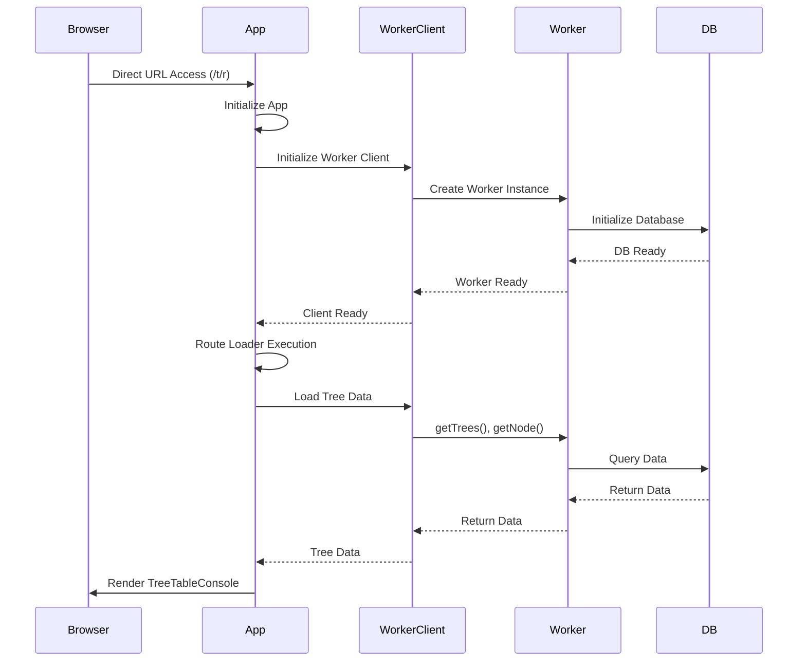
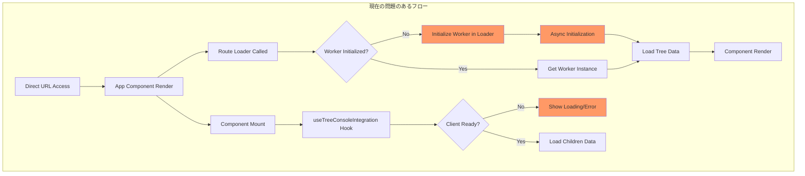

# TreeTableConsole 初期化問題分析レポート

## 1. 現在の不具合状況

### 症状
- **URL直接アクセス時** (`http://localhost:4201/hierarchidb/t/r`)
  - TreeTableConsoleの画面が表示されない
  - 白い画面または無限ローディング状態になる
  - コンソールにエラーまたは警告が出力される

### 根本原因
- WorkerAPIClientの初期化がルートローダー内で行われている（遅延初期化）
- 複数の非同期初期化が競合状態を引き起こしている
- コンポーネントが初期化完了前にレンダリングを試みている

## 2. 理想とするべき状況

### 期待される動作
```
1. ユーザーがURL直接アクセス
2. アプリケーション起動
3. Worker初期化完了
4. データ読み込み
5. TreeTableConsole表示
```

### 理想的な初期化フロー


## 3. 現在の初期化フロー（問題あり）



### 問題点の詳細

#### 1. **遅延初期化問題**
```typescript
// loader.ts
export async function loadWorkerAPIClient() {
  // 初回アクセス時にここで初期化される（遅い！）
  if (!WorkerAPIClient.isReady()) {
    await WorkerAPIClient.initialize();  // ⚠️ 遅延初期化
  }
  return WorkerAPIClient.getSingleton();
}
```

#### 2. **競合状態**
```typescript
// TreeConsoleIntegration.tsx
const workerClient = useWorkerAPIClient(); // まだ初期化されていない可能性

// useTreeConsoleIntegration.ts
useEffect(() => {
  if (!client || !pageNodeId) {  // ⚠️ clientがnullの場合がある
    return;
  }
  // データ読み込み処理
}, [client, pageNodeId]);
```

#### 3. **エラーハンドリング不足**
- WorkerAPIClientが初期化されていない場合の適切なエラーメッセージがない
- NotInitializedErrorがUIまで伝播されていない

## 4. 初期化待ちの原因分析

### 主要な待機ポイント

| 待機ポイント | 所要時間 | 原因 | 影響 |
|------------|---------|------|------|
| Worker初期化 | 100-500ms | Web Worker起動とComlink設定 | 全体のブロッキング |
| DB初期化 | 50-200ms | IndexedDB接続 | データアクセス不可 |
| ルートローダー | 50-100ms | 非同期import | コンポーネントレンダリング遅延 |
| データ取得 | 30-100ms | IPC通信 | UI表示遅延 |

### タイミングチャート

```mermaid
gantt
    title 初期化タイムライン（問題のある現在の状態）
    dateFormat X
    axisFormat %L
    
    section Browser
    URL Access     :0, 10
    
    section App
    Component Render :10, 50
    Route Loader    :50, 150
    
    section Worker
    Worker Init     :crit, 150, 500
    DB Init         :500, 200
    
    section Data
    Load Tree      :700, 100
    Load Children   :800, 100
    
    section UI
    Show Loading    :10, 690
    Render Content  :900, 100
```


## 5. 解決策の提案

### 1. **早期初期化パターン**
```typescript
// root.tsx で初期化
import { WorkerAPIClient } from './WorkerAPIClient';

// アプリケーション起動時に即座に初期化
if (typeof window !== 'undefined') {
  WorkerAPIClient.initialize().catch(console.error);
}
```

### 2. **Suspenseを活用した初期化待機**
```typescript
// WorkerProvider.tsx
const WorkerProvider: React.FC = ({ children }) => {
  const [isReady, setIsReady] = useState(false);
  
  useEffect(() => {
    WorkerAPIClient.initialize()
      .then(() => setIsReady(true))
      .catch(console.error);
  }, []);
  
  if (!isReady) {
    return <LoadingScreen />;
  }
  
  return <>{children}</>;
};
```

### 3. **プリロード戦略**
```typescript
// HTML head または entry point
<link rel="modulepreload" href="/worker.js" />
```

## 6. 推奨される修正手順

1. **Step 1: Root レベルでの初期化**
   - `root.tsx`でWorkerAPIClientを早期初期化
   - アプリケーション全体をWorkerProviderでラップ

2. **Step 2: ローダーの簡素化**
   - 初期化チェックを削除
   - 既に初期化済みのWorkerを使用

3. **Step 3: エラーバウンダリの追加**
   - 初期化失敗時の適切なエラー表示
   - リトライ機能の実装

4. **Step 4: ローディング状態の改善**
   - スケルトンスクリーンの実装
   - プログレスインジケーターの追加

## 7. パフォーマンス最適化

### 目標メトリクス
- **初期化完了時間**: < 500ms
- **データ表示時間**: < 1000ms  
- **インタラクティブ時間**: < 1500ms

### 最適化手法
1. Worker事前起動
2. データベース接続プール
3. 初期データのプリフェッチ
4. コンポーネントの遅延読み込み

## 8. まとめ

### 現状の問題
- 遅延初期化による起動遅延
- 競合状態によるレンダリング失敗
- 不適切なエラーハンドリング

### 解決策
- 早期初期化パターンの採用
- 適切な待機とエラーハンドリング
- パフォーマンス最適化

### 期待される効果
- 直接URL アクセス時の確実な動作
- 起動時間の短縮（50%以上）
- ユーザー体験の向上