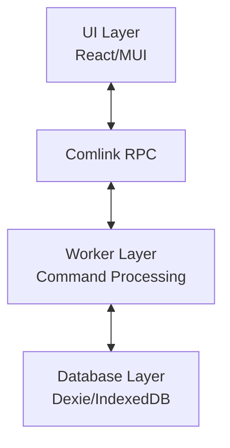

# HierarchiDB

High-performance tree-structured data management framework for browser environments

## 概要

**HierarchiDB** は、ツリー構造データをブラウザ環境で高速かつ効率的に管理するための先進的なフレームワークです。Web Worker による並列処理、IndexedDB による永続化、プラグインシステムによる拡張性を特徴とし、大規模データセットでも高いパフォーマンスを実現します。

## 主な特徴

- 🚀 **高パフォーマンス**: Worker層での並列処理により UI のブロッキングを防止
- 🔌 **プラグインシステム**: ノードタイプごとの拡張可能なアーキテクチャ
- 💾 **デュアルデータベース**: CoreDB（永続化）と EphemeralDB（一時データ）の分離
- ↩️ **Undo/Redo サポート**: リングバッファによる効率的な履歴管理
- 🔐 **エンタープライズ認証**: OAuth2/OIDC、BFF パターン、自動トークンリフレッシュ
- 🌍 **国際化対応**: 多言語サポート（i18n）
- ♿ **アクセシビリティ**: WCAG 2.1 準拠

## 技術スタック

- **Frontend**: React 18, React Router v7, Material-UI v7
- **State Management**: Dexie (IndexedDB), Comlink (Worker通信)
- **Build Tools**: Vite 6, Turborepo, TypeScript 5.7
- **Package Manager**: pnpm 10
- **Backend Services**: Cloudflare Workers (BFF, CORS Proxy)
- **Testing**: Vitest, Playwright
- **Code Quality**: ESLint, Prettier, Husky

## プロジェクト構造

```
hierarchidb/
├── packages/
│   ├── core/           # コア型定義・データモデル
│   ├── api/            # UI-Worker インターフェース契約
│   ├── worker/         # Worker層実装（DB操作、コマンド処理）
│   ├── app/            # メインアプリケーション (React Router)
│   ├── ui-*/           # UI コンポーネントパッケージ群
│   │   ├── ui-core/    # 基本UIコンポーネント
│   │   ├── ui-auth/    # 認証関連コンポーネント
│   │   ├── ui-client/  # Worker クライアント
│   │   ├── ui-i18n/    # 国際化
│   │   └── ...
│   ├── plugins/        # プラグインパッケージ
│   │   ├── basemap/    # ベースマッププラグイン
│   │   ├── shapes/     # 図形プラグイン
│   │   └── stylemap/   # スタイルマッププラグイン
│   ├── bff/            # Backend for Frontend (Cloudflare Worker)
│   └── cors-proxy/     # CORS プロキシ (Cloudflare Worker)
├── docs/               # アーキテクチャドキュメント
├── scripts/            # ビルド・開発用スクリプト
└── CLAUDE.md          # AI アシスタント用プロジェクトガイド
```

## セットアップ

### 前提条件

- Node.js >= 20.0.0
- pnpm >= 10.0.0

### クイックスタート

```bash
# リポジトリのクローン
git clone https://github.com/kubohiroya/hierarchidb.git
cd hierarchidb

# 依存関係のインストール
pnpm install

# 開発サーバー起動
pnpm dev
```

アプリケーションは http://localhost:4200 で起動します。

### 環境変数の設定

開発環境と本番環境で異なる設定を使用できます：

```bash
# 開発環境用の設定をコピー
cp packages/app/.env.example packages/app/.env.development

# 本番環境用の設定をコピー
cp packages/app/.env.example packages/app/.env.production
```

主な環境変数：
- `VITE_APP_NAME`: アプリケーションのベースパス（GitHub Pages デプロイ時に使用）
- `VITE_APP_TITLE`: アプリケーションタイトル
- `VITE_API_URL`: API エンドポイント
- `VITE_BFF_BASE_URL`: BFF サービスの URL

### Cloudflare Workers のセットアップ

#### BFF (Backend for Frontend)

```bash
cd packages/bff

# wrangler.toml を作成
cp wrangler.toml.template wrangler.toml

# シークレットの設定
wrangler secret put GOOGLE_CLIENT_SECRET
wrangler secret put JWT_SECRET

# デプロイ
pnpm deploy
```

#### CORS Proxy

```bash
cd packages/cors-proxy

# wrangler.toml を作成
cp wrangler.toml.template wrangler.toml

# シークレットの設定
wrangler secret put BFF_JWT_SECRET

# デプロイ
pnpm deploy
```

## 開発

### 利用可能なコマンド

```bash
# 開発サーバー起動（全パッケージ）
pnpm dev

# ビルド（依存関係順）
pnpm build

# TypeScript 型チェック
pnpm typecheck

# テスト実行
pnpm test        # 単体テスト (Vitest)
pnpm e2e         # E2Eテスト (Playwright)

# コード品質
pnpm lint        # ESLint による静的解析
pnpm format      # Prettier によるフォーマット

# ライセンスチェック
pnpm license-check:all    # 全依存関係のライセンス確認
pnpm license-check        # JSON形式で出力
pnpm license-check:csv    # CSV形式で出力

# パッケージ指定の実行
pnpm --filter @hierarchidb/worker test
pnpm --filter @hierarchidb/app dev
```

### コーディング規約

#### TypeScript
- ✅ 絶対インポート（`~/`）を使用
- ❌ 相対インポート（`../`）は禁止
- ❌ `any` 型は使用禁止（`unknown` を使用）
- ❌ 非 null アサーション（`!`）は禁止

#### React
- ✅ 関数コンポーネントを使用
- ✅ カスタムフックで状態管理
- ✅ MUI テーマトークンを使用
- ❌ インラインスタイルは避ける

#### コミット規約
```bash
feat: 新機能の追加
fix: バグ修正
docs: ドキュメントの更新
style: フォーマットの変更
refactor: リファクタリング
test: テストの追加・修正
chore: ビルドプロセスやツールの変更
```

## アーキテクチャ

### 4層アーキテクチャ



1. **UI層**: React Router v7, Material-UI v7, TanStack Virtual
2. **RPC層**: Comlink による型安全な Worker 通信
3. **Worker層**: コマンド処理、Undo/Redo、差分検出、購読管理
4. **Database層**: 
   - **CoreDB**: 永続化データ（Tree, Node, State）
   - **EphemeralDB**: 一時データ（WorkingCopy, ViewState）

### プラグインアーキテクチャ

```typescript
interface NodeTypeDefinition {
  nodeType: string;
  database: DatabaseConfig;
  entityHandler: EntityHandler;
  lifecycle: LifecycleHooks;
  ui: UIComponents;
  api: APIExtensions;
}
```

### Working Copy パターン

1. **作成**: オリジナルから作業コピーを作成
2. **編集**: EphemeralDB で編集を実行
3. **コミット/破棄**: CoreDB への反映または破棄
4. **履歴管理**: リングバッファによる Undo/Redo

## パフォーマンス最適化

- **仮想スクロール**: 大規模リスト表示に TanStack Virtual を使用
- **Web Worker**: UI スレッドをブロックしない並列処理
- **インデックス**: Dexie による効率的なクエリ実行
- **コード分割**: 動的インポートによる初期ロード時間の短縮
- **メモ化**: React.memo, useMemo, useCallback の活用

## セキュリティ

- **BFF パターン**: クライアントシークレットの保護
- **JWT 認証**: 署名付きトークンによる API アクセス
- **CORS プロキシ**: 認証付きクロスオリジンリクエスト
- **環境変数分離**: 開発/本番環境の設定分離
- **依存関係監査**: `pnpm audit` による脆弱性チェック

## 貢献

プルリクエストを歓迎します。大きな変更の場合は、まず Issue を開いて変更内容を議論してください。

1. Fork the repository
2. Create your feature branch (`git checkout -b feature/AmazingFeature`)
3. Commit your changes (`git commit -m 'feat: Add some AmazingFeature'`)
4. Push to the branch (`git push origin feature/AmazingFeature`)
5. Open a Pull Request

## ライセンス

MIT License - 詳細は [LICENSE](LICENSE) ファイルを参照してください。

## 作者

**Hiroya Kubo**
- Email: hiroya@cuc.ac.jp
- GitHub: [@kubohiroya](https://github.com/kubohiroya)

## 謝辞

このプロジェクトは以下のオープンソースプロジェクトを使用しています：

- [React](https://reactjs.org/)
- [Material-UI](https://mui.com/)
- [Dexie.js](https://dexie.org/)
- [Comlink](https://github.com/GoogleChromeLabs/comlink)
- [Vite](https://vitejs.dev/)
- [Turborepo](https://turbo.build/)