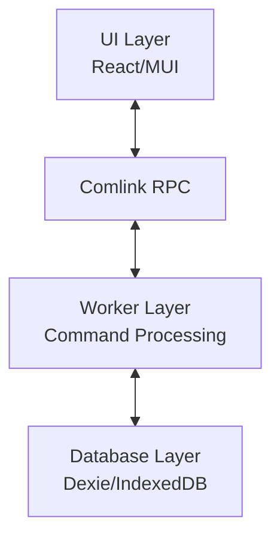

# HierarchiDB

[](https://github.com/OWNER/REPO/actions/workflows/unit-ci.yml)

High-performance tree-structured data management framework for browser environments

## 概要

**HierarchiDB** は、ツリー構造をもつデータをブラウザ環境で効率的かつ一貫性を保ちながら管理・操作するための **高汎用性フレームワーク** です。アプリケーションの UI 層と Worker 層を明確に分離し、Dexie を用いた IndexedDB 永続化と Comlink 経由の非同期通信を組み合わせることで、堅牢かつ拡張性の高い構造を実現しています。
ツリー上で作成可能なオブジェクトのタイプごとの機能をプラグイン機構によって実現するしくみであるため、高度な拡張性を備えています。

本フレームワークは特定ドメインに依存しない汎用コアを提供し、地理情報システム（GIS）、プロジェクト管理、データカタログなど、階層型リソース管理を必要とするあらゆる分野に適用可能です。

## 主な特徴

- 🚀 **高パフォーマンス**: Comlink/Worker層での非同期並列処理により UI のブロッキングを防止
- ↩️ **Undo/Redo サポート**: リングバッファによる効率的な履歴管理
- 💾 **永続化**: Dexie.js/IndexedDBを用いた永続化
- 🔐 **認証**: OAuth2/OIDC、BFF パターン、自動トークンリフレッシュ
- 🌍 **国際化**: 多言語サポート（i18n）
- ♿ **アクセシビリティ**: WCAG 2.1 準拠
- 🔌 **プラグインシステム**: 拡張可能なアーキテクチャ


## 技術スタック

- **Frontend**: React 18, React Router v7, Material-UI v6, Tanstack Table
- **State Management**: Dexie (IndexedDB), Comlink (Worker通信)
- **Build Tools**: Vite 6, Turborepo, TypeScript 4.9
- **Package Manager**: pnpm 10
- **Backend Services**: Cloudflare Workers (BFF, CORS Proxy)
- **Testing**: Vitest, Playwright
- **Code Quality**: ESLint, Prettier, Husky, dep-fence
- **Task Management**: mrtask

## プロジェクト構造

```
hierarchidb/
├── app/                # メインアプリケーション (React Router v7)
├── packages/
│   ├── common/         # 共通コア機能
│   │   ├── api/        # UI-Worker インターフェース契約
│   │   ├── auth/       # 認証共通ロジック
│   │   ├── core/       # コア型定義・データモデル
│   │   ├── plugin-base/# プラグイン基底クラス
│   │   └── types/      # 共通型定義
│   ├── runtime-ui/     # UI層ランタイム
│   │   ├── datasource/         # データソースUIコンポーネント
│   │   ├── plugin-dialog/      # プラグインダイアログ
│   │   ├── search-result-window/ # 検索結果ウィンドウ
│   │   ├── tour/               # ツアーコンポーネント
│   │   ├── appbar/             # アプリケーションバー
│   │   └── landingpage/        # ランディングページ
│   ├── runtime-worker/ # Worker層ランタイム
│   │   ├── worker/             # Worker層実装（DB操作、コマンド処理）
│   │   ├── plugin-registry/    # プラグイン登録管理
│   │   └── worker-bootstrap/   # Worker初期化
│   ├── runtime-shared/ # 共有ランタイム
│   │   ├── fetch-metadata/     # メタデータ取得
│   │   ├── client/             # クライアント機能
│   │   ├── batch-processor/    # バッチ処理
│   │   ├── shape-datasource/   # シェイプデータソース定義
│   │   ├── location-datasource/# ロケーションデータソース定義
│   │   ├── route-datasource/   # ルートデータソース定義
│   │   └── folder-datasource/  # フォルダデータソース定義
│   ├── ui/             # UI コンポーネント群
│   │   ├── core/       # 基本UIコンポーネント
│   │   ├── auth/       # 認証UI
│   │   ├── theme/      # MUIテーマ設定
│   │   ├── i18n/       # 国際化
│   │   ├── routing/    # ルーティングヘルパー
│   │   ├── layout/     # レイアウト
│   │   ├── navigation/ # ナビゲーション
│   │   ├── monitoring/ # パフォーマンス監視
│   │   ├── file/       # ファイル操作
│   │   ├── dialog/     # ダイアログ
│   │   ├── map/        # 地図コンポーネント
│   │   ├── treeconsole/# ツリーコンソール
│   │   ├── import-export/      # インポート/エクスポート
│   │   ├── usermenu/           # ユーザーメニュー
│   │   ├── csv-extract/        # CSV処理
│   │   ├── data-grid/          # データグリッド
│   │   └── ...                 # その他UI部品
│   ├── node-type/      # ノードタイププラグイン
│   │   ├── base-plugin/        # プラグイン基底クラス
│   │   ├── folder-plugin/      # フォルダー
│   │   ├── project-plugin/     # プロジェクト
│   │   ├── basemap-plugin/     # ベースマップ
│   │   ├── shape-plugin/       # 図形
│   │   ├── spreadsheet-plugin/ # スプレッドシート
│   │   ├── styler-plugin/    # スタイルマップ
│   │   ├── location-plugin/    # ロケーション
│   │   ├── route-plugin/       # ルート
│   │   └── resolver-plugin/ # プロパティ解決
│   ├── backend/        # バックエンドサービス
│   │   ├── bff/        # Backend for Frontend (Cloudflare Worker)
│   │   └── cors-proxy/ # CORS プロキシ (Cloudflare Worker)
│   └── util/           # ユーティリティ
├── docs/               # アーキテクチャドキュメント
│   └── _analysis.md    # ドキュメント分析レポート（自動生成）
├── scripts/            # ビルド・開発用スクリプト
└── CLAUDE.md          # AI アシスタント用プロジェクトガイド
```


## アーキテクチャ詳細

## 4層アーキテクチャ


```mermaid
graph TB
    UI[UI Layer<br/>React/MUI] 
    RPC[Comlink RPC]
    Worker[Worker Layer<br/>Command Processing]
    DB[Database Layer<br/>Dexie/IndexedDB]
    
    UI <--> RPC
    RPC <--> Worker
    Worker <--> DB
```

1. **UI層**: React Router v7, Material-UI v6, TanStack Virtual
2. **RPC層**: Comlink による型安全な Worker 通信
3. **Worker層**: コマンド処理、Undo/Redo、差分検出、購読管理
4. **Database層**: 
   - **CoreDB**: 永続化データ（Tree, Node, State）
   - **EphemeralDB**: 一時データ（WorkingCopy, ViewState）

## プラグインアーキテクチャ

```typescript
interface PluginDefinition {
  nodeType: string;
  database: DatabaseConfig;
  entityHandler: EntityHandler;
  lifecycle: LifecycleHooks;
  ui: UIComponents;
  api: APIExtensions;
}
```

## Working Copy パターン

1. **作成**: オリジナルから作業コピーを作成
2. **編集**: EphemeralDB で編集を実行
3. **コミット/破棄**: CoreDB への反映または破棄
4. **履歴管理**: リングバッファによる Undo/Redo

# セットアップ

## 前提条件

- Node.js >= 20.0.0
- pnpm >= 10.0.0

## クイックスタート

```bash
# リポジトリのクローン
git clone https://github.com/kubohiroya/hierarchidb.git
cd hierarchidb

# 依存関係のインストール
pnpm install

# 開発サーバー起動
pnpm dev
```

アプリケーションは http://localhost:4200 で起動します。

## 環境変数の設定

開発環境と本番環境で異なる設定を使用できます：

```bash
# 開発環境用の設定をコピー
cp app/.env.example app/.env.development

# 本番環境用の設定をコピー
cp app/.env.example app/.env.production
```

主な環境変数：
- `VITE_APP_NAME`: アプリケーションのベースパス（GitHub Pages デプロイ時に使用）
- `VITE_APP_TITLE`: アプリケーションタイトル
- `VITE_BFF_BASE_URL`: BFF サービスの URL
- `VITE_USE_HASH_ROUTING`: ハッシュルート方式を有効化

## Cloudflare Workers のセットアップ

#### BFF (Backend for Frontend)

```bash
cd packages/backend/bff

# wrangler.toml を作成
cp wrangler.toml.template wrangler.toml

# シークレットの設定
wrangler secret put GOOGLE_CLIENT_SECRET
wrangler secret put JWT_SECRET

# デプロイ
pnpm deploy
```

#### CORS Proxy

```bash
cd packages/backend/cors-proxy

# wrangler.toml を作成
cp wrangler.toml.template wrangler.toml

# シークレットの設定
wrangler secret put BFF_JWT_SECRET

# デプロイ
pnpm deploy
```

## 開発

## 利用可能なコマンド

```bash
# 開発サーバー起動（全パッケージ）
pnpm dev

# ビルド（依存関係順）
pnpm build

# TypeScript 型チェック
pnpm typecheck

# テスト実行
pnpm test        # 単体テスト (Vitest)
pnpm e2e         # E2Eテスト (Playwright)
pnpm coverage    # すべてのワークスペースでカバレッジ生成 (Vitest)

# コード品質
pnpm lint        # ESLint による静的解析
pnpm format      # Prettier によるフォーマット

# ライセンスチェック
pnpm license-check:all    # 全依存関係のライセンス確認
pnpm license-check        # JSON形式で出力
pnpm license-check:csv    # CSV形式で出力

# パッケージ指定の実行
pnpm --filter @hierarchidb/worker test
pnpm --filter @hierarchidb/app dev
```

#### コミット規約
```bash
feat: 新機能の追加
fix: バグ修正
docs: ドキュメントの更新
style: フォーマットの変更
refactor: リファクタリング
test: テストの追加・修正
chore: ビルドプロセスやツールの変更
```

## パフォーマンス最適化

- **仮想スクロール**: 大規模リスト表示に TanStack Virtual を使用
- **Web Worker**: UI スレッドをブロックしない並列処理
- **インデックス**: Dexie による効率的なクエリ実行
- **コード分割**: 動的インポートによる初期ロード時間の短縮
- **メモ化**: React.memo, useMemo, useCallback の活用

## セキュリティ

- **BFF パターン**: クライアントシークレットの保護
- **JWT 認証**: 署名付きトークンによる API アクセス
- **CORS プロキシ**: 認証付きクロスオリジンリクエスト
- **環境変数分離**: 開発/本番環境の設定分離
- **依存関係監査**: `pnpm audit` による脆弱性チェック

## デプロイ

### GitHub Pages デプロイ
```bash
# 環境変数を設定
export VITE_APP_NAME=hierarchidb

# ビルド実行
pnpm build

# app/dist ディレクトリを GitHub Pages にデプロイ
```

### Cloudflare Workers デプロイ
上記の「Cloudflare Workers のセットアップ」セクションを参照してください。

## 貢献

プルリクエストを歓迎します。大きな変更の場合は、まず Issue を開いて変更内容を議論してください。

1. Fork the repository
2. Create your feature branch (`git checkout -b feature/AmazingFeature`)
3. Commit your changes (`git commit -m 'feat: Add some AmazingFeature'`)
4. Push to the branch (`git push origin feature/AmazingFeature`)
5. Open a Pull Request

## ライセンス

MIT License - 詳細は [LICENSE](LICENSE) ファイルを参照してください。

## 作者

**Hiroya Kubo**
- Email: hiroya@cuc.ac.jp
- GitHub: [@kubohiroya](https://github.com/kubohiroya)

## 謝辞

このプロジェクトは以下のオープンソースプロジェクトを使用しています：

- [React](https://reactjs.org/)
- [Material-UI](https://mui.com/)
- [Dexie.js](https://dexie.org/)
- [Comlink](https://github.com/GoogleChromeLabs/comlink)
- [Vite](https://vitejs.dev/)
- [Turborepo](https://turbo.build/)
