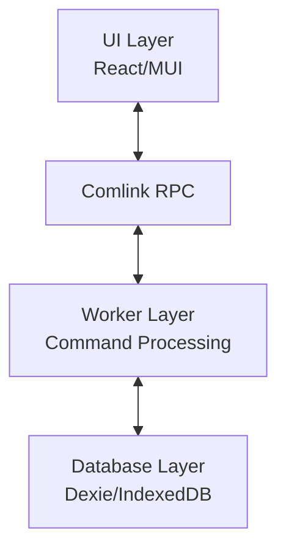

# HierarchiDB

High-performance tree-structured data management framework for browser environments

## 概要

**HierarchiDB** は、ツリー構造をもつデータをブラウザ環境で効率的かつ一貫性を保ちながら管理・操作するための **高汎用性フレームワーク** です。アプリケーションの UI 層と Worker 層を明確に分離し、Dexie を用いた IndexedDB 永続化と Comlink 経由の非同期通信を組み合わせることで、堅牢かつ拡張性の高い構造を実現しています。

本フレームワークは特定ドメインに依存しない汎用コアを提供し、地理情報システム（GIS）、プロジェクト管理、データカタログなど、階層型リソース管理を必要とするあらゆる分野に適用可能です。

## 主な特徴

- 🚀 **高パフォーマンス**: Worker層での並列処理により UI のブロッキングを防止
- 🔌 **プラグインシステム**: ノードタイプごとの拡張可能なアーキテクチャ
- 💾 **デュアルデータベース**: CoreDB（永続化）と EphemeralDB（一時データ）の分離
- ↩️ **Undo/Redo サポート**: リングバッファによる効率的な履歴管理
- 🔐 **エンタープライズ認証**: OAuth2/OIDC、BFF パターン、自動トークンリフレッシュ
- 🌍 **国際化対応**: 多言語サポート（i18n）
- ♿ **アクセシビリティ**: WCAG 2.1 準拠

## 技術スタック

- **Frontend**: React 18, React Router v7, Material-UI v7
- **State Management**: Dexie (IndexedDB), Comlink (Worker通信)
- **Build Tools**: Vite 6, Turborepo, TypeScript 5.7
- **Package Manager**: pnpm 10
- **Backend Services**: Cloudflare Workers (BFF, CORS Proxy)
- **Testing**: Vitest, Playwright
- **Code Quality**: ESLint, Prettier, Husky

## プロジェクト構造

```
hierarchidb/
├── packages/
│   ├── core/           # コア型定義・データモデル
│   ├── api/            # UI-Worker インターフェース契約
│   ├── worker/         # Worker層実装（DB操作、コマンド処理）
│   ├── app/            # メインアプリケーション (React Router)
│   ├── ui-*/           # UI コンポーネントパッケージ群
│   │   ├── ui-core/    # 基本UIコンポーネント
│   │   ├── ui-auth/    # 認証関連コンポーネント
│   │   ├── ui-client/  # Worker クライアント
│   │   ├── ui-i18n/    # 国際化
│   │   └── ...
│   ├── plugins/        # プラグインパッケージ
│   │   ├── basemap/    # ベースマッププラグイン
│   │   ├── shape/      # 図形プラグイン
│   │   └── stylemap/   # スタイルマッププラグイン
│   ├── bff/            # Backend for Frontend (Cloudflare Worker)
│   └── cors-proxy/     # CORS プロキシ (Cloudflare Worker)
├── docs/               # アーキテクチャドキュメント
├── scripts/            # ビルド・開発用スクリプト
└── CLAUDE.md          # AI アシスタント用プロジェクトガイド
```

### ドキュメント運用

- 命名規則: `docs/番号-タイトル.md` 形式（例: `01-overview.md`, `05-0-architecture.md`）
- 番号順ソートで論理的な順序を保証

#### ドキュメント分析ツールの使い方（本作業の成果物）

本リポジトリには、docs 配下の SS-MMM-title.md 形式のドキュメントを「ファイル名順」に並べた時の流れを自動チェックするツールが含まれています。

- 成果物（スクリプト）: scripts/analyze-docs.cjs
- 出力レポート: docs/_analysis.md

使い方:

```bash
# 依存関係のインストール（初回のみ）
pnpm install

# 分析の実行（レポートを docs/_analysis.md に生成）
pnpm analyze:docs
```

レポートの読み方（要点）:
- Similarity: 隣接するファイル同士の「上位キーワードのジャッカード類似度」。極端に低いと話題の断絶、極端に高いと重複の可能性。
- Flags:
  - LOW_SIM_WITH_PREV / LOW_SIM_WITH_NEXT: 前/次章とのつながりが弱い可能性（橋渡しの説明や導入文を検討）
  - HIGH_SIM_WITH_PREV / HIGH_SIM_WITH_NEXT: 前/次章と重複が多い可能性（統合・差別化を検討）
- Suggested sections to consider adding: よくある章（概要/目的/背景/設計/実装/エッジケース/データフロー/受け入れ基準/利点/移行）の不足候補。
- Outline (H1/H2): ページの大まかな見出し構成。

推奨ワークフロー:
1. docs の各ファイル名を SS-MMM-title.md（例: 09-001-plugin-architecture.md）の形式に統一。
2. `pnpm analyze:docs` を実行し、docs/_analysis.md を開く。
3. LOW_SIM の箇所は、章間の橋渡し（概要/背景/導入文）や配置見直しを検討。
4. HIGH_SIM の箇所は、重複解消（統合/差別化）を検討。
5. 「Suggested sections…」に挙がった不足セクションを必要に応じて補完。
6. 修正後にもう一度 `pnpm analyze:docs` を実行して改善を確認。

注意:
- 本リポジトリは package.json の `"type": "module"` 設定のため、CommonJS 版（scripts/analyze-docs.cjs）を使用しています。`pnpm analyze:docs` は .cjs を呼び出します。
- 出力の数値やフラグはヒューリスティック（目安）です。最終判断は人間のレビューで行ってください。

## セットアップ

### 前提条件

- Node.js >= 20.0.0
- pnpm >= 10.0.0

### クイックスタート

```bash
# リポジトリのクローン
git clone https://github.com/kubohiroya/hierarchidb.git
cd hierarchidb

# 依存関係のインストール
pnpm install

# 開発サーバー起動
pnpm dev
```

アプリケーションは http://localhost:4200 で起動します。

### 環境変数の設定

開発環境と本番環境で異なる設定を使用できます：

```bash
# 開発環境用の設定をコピー
cp packages/src/.env.example packages/src/.env.development

# 本番環境用の設定をコピー
cp packages/src/.env.example packages/src/.env.production
```

主な環境変数：
- `VITE_APP_NAME`: アプリケーションのベースパス（GitHub Pages デプロイ時に使用）
- `VITE_APP_TITLE`: アプリケーションタイトル
- `VITE_BFF_BASE_URL`: BFF サービスの URL
- `VITE_USE_HASH_ROUTING`: ハッシュルート方式を有効化

### Cloudflare Workers のセットアップ

#### BFF (Backend for Frontend)

```bash
cd packages/bff

# wrangler.toml を作成
cp wrangler.toml.template wrangler.toml

# シークレットの設定
wrangler secret put GOOGLE_CLIENT_SECRET
wrangler secret put JWT_SECRET

# デプロイ
pnpm deploy
```

#### CORS Proxy

```bash
cd packages/cors-proxy

# wrangler.toml を作成
cp wrangler.toml.template wrangler.toml

# シークレットの設定
wrangler secret put BFF_JWT_SECRET

# デプロイ
pnpm deploy
```

## 開発

### 利用可能なコマンド

```bash
# 開発サーバー起動（全パッケージ）
pnpm dev

# ビルド（依存関係順）
pnpm build

# TypeScript 型チェック
pnpm typecheck

# テスト実行
pnpm test        # 単体テスト (Vitest)
pnpm e2e         # E2Eテスト (Playwright)

# コード品質
pnpm lint        # ESLint による静的解析
pnpm format      # Prettier によるフォーマット

# ライセンスチェック
pnpm license-check:all    # 全依存関係のライセンス確認
pnpm license-check        # JSON形式で出力
pnpm license-check:csv    # CSV形式で出力

# パッケージ指定の実行
pnpm --filter @hierarchidb/worker test
pnpm --filter @hierarchidb/src dev
```

### コーディング規約

#### TypeScript
- ✅ 絶対インポート（`~/`）を使用
- ❌ 相対インポート（`../`）は禁止
- ❌ `any` 型は使用禁止（`unknown` を使用）
- ❌ 非 null アサーション（`!`）は禁止

#### React
- ✅ 関数コンポーネントを使用
- ✅ カスタムフックで状態管理
- ✅ MUI テーマトークンを使用
- ❌ インラインスタイルは避ける

#### コミット規約
```bash
feat: 新機能の追加
fix: バグ修正
docs: ドキュメントの更新
style: フォーマットの変更
refactor: リファクタリング
test: テストの追加・修正
chore: ビルドプロセスやツールの変更
```

## アーキテクチャ

### 4層アーキテクチャ


```mermaid
graph TB
    UI[UI Layer<br/>React/MUI] 
    RPC[Comlink RPC]
    Worker[Worker Layer<br/>Command Processing]
    DB[Database Layer<br/>Dexie/IndexedDB]
    
    UI <--> RPC
    RPC <--> Worker
    Worker <--> DB
```

1. **UI層**: React Router v7, Material-UI v7, TanStack Virtual
2. **RPC層**: Comlink による型安全な Worker 通信
3. **Worker層**: コマンド処理、Undo/Redo、差分検出、購読管理
4. **Database層**: 
   - **CoreDB**: 永続化データ（TreeTypes, Node, State）
   - **EphemeralDB**: 一時データ（WorkingCopyTypes, ViewState）

### プラグインアーキテクチャ

```typescript
interface PluginDefinition {
  nodeType: string;
  database: DatabaseConfig;
  entityHandler: EntityHandler;
  lifecycle: LifecycleHooks;
  ui: UIComponents;
  api: APIExtensions;
}
```

### Working Copy パターン

1. **作成**: オリジナルから作業コピーを作成
2. **編集**: EphemeralDB で編集を実行
3. **コミット/破棄**: CoreDB への反映または破棄
4. **履歴管理**: リングバッファによる Undo/Redo

## パフォーマンス最適化

- **仮想スクロール**: 大規模リスト表示に TanStack Virtual を使用
- **Web Worker**: UI スレッドをブロックしない並列処理
- **インデックス**: Dexie による効率的なクエリ実行
- **コード分割**: 動的インポートによる初期ロード時間の短縮
- **メモ化**: React.memo, useMemo, useCallback の活用

## セキュリティ

- **BFF パターン**: クライアントシークレットの保護
- **JWT 認証**: 署名付きトークンによる API アクセス
- **CORS プロキシ**: 認証付きクロスオリジンリクエスト
- **環境変数分離**: 開発/本番環境の設定分離
- **依存関係監査**: `pnpm audit` による脆弱性チェック

## 貢献

プルリクエストを歓迎します。大きな変更の場合は、まず Issue を開いて変更内容を議論してください。

1. Fork the repository
2. Create your feature branch (`git checkout -b feature/AmazingFeature`)
3. Commit your changes (`git commit -m 'feat: Add some AmazingFeature'`)
4. Push to the branch (`git push origin feature/AmazingFeature`)
5. Open a Pull Request

## ライセンス

MIT License - 詳細は [LICENSE](LICENSE) ファイルを参照してください。

## 作者

**Hiroya Kubo**
- Email: hiroya@cuc.ac.jp
- GitHub: [@kubohiroya](https://github.com/kubohiroya)

## 謝辞

このプロジェクトは以下のオープンソースプロジェクトを使用しています：

- [React](https://reactjs.org/)
- [Material-UI](https://mui.com/)
- [Dexie.js](https://dexie.org/)
- [Comlink](https://github.com/GoogleChromeLabs/comlink)
- [Vite](https://vitejs.dev/)
- [Turborepo](https://turbo.build/)