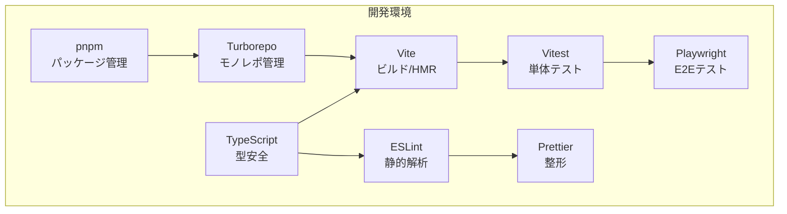

# 2. ツールセット

## 2.1 開発環境の全体方針

本プロジェクトは、**モノレポ構成**とし、複数のモジュール（core, api, worker, ui, bff, cors-proxy, app、および拡張モジュール群）を一元的に管理します。  
依存関係の整合性を保ち、ビルド・テスト・デプロイの効率化を目的として、パッケージマネージャには **pnpm** を採用し、ビルドオーケストレーションには **Turborepo** を利用します。

全モジュール共通で **TypeScript** による型安全な実装を行い、コード品質維持のための Lint / Format / Test / E2E 環境を統一します。

## 2.2 ツールセット一覧

| ツール | 用途 | 補足 |
|--------|------|------|
| **pnpm** | パッケージ管理 | 高速インストール・依存の重複排除 |
| **Turborepo** | モノレポ管理 | ビルド/テストのキャッシュ・並列化・依存解決 |
| **TypeScript** | 型安全な実装 | any禁止、strictモード必須 |
| **ESLint** | 静的解析 | Airbnbベース＋プロジェクト固有ルール |
| **Prettier** | コード整形 | ESLint統合、CIで整形チェック |
| **Vite** | フロントエンドビルド | 高速HMR、React/TypeScript対応 |
| **Vitest** | 単体テスト | Jest互換API、Vite統合 |
| **Playwright** | E2Eテスト | UI操作の自動化・クロスブラウザ検証 |

## 2.3 各ツールの役割と設定方針

### 2.3.1 pnpm
- モノレポルートに `pnpm-workspace.yaml` を配置
- 全モジュールの依存は極力ルートで一元管理し、モジュール固有依存はモジュール直下の `package.json` に記載
- `pnpm install` は常に `--frozen-lockfile` を推奨（CI/CD 一貫性確保）

### 2.3.2 Turborepo
- 各モジュールは `packages/` または `apps/` ディレクトリ配下に配置
- `turbo.json` にてビルドパイプラインを定義
    - 例：`build` → `test` → `lint`
- キャッシュを活用し、未変更モジュールの再ビルドをスキップ

### 2.3.3 TypeScript
- 全モジュールで `tsconfig.json` を共通化（ルートに `tsconfig.base.json`）
- `strict: true`、`noImplicitAny: true`、`exactOptionalPropertyTypes: true` を必須
- 型定義は `core` モジュールに集約し、他モジュールから参照

### 2.3.4 ESLint
- 設定は `eslint-config-project` としてモノレポ内に定義し共有
- 主なルール：
    - `camelCase` 命名必須
    - `any` 使用禁止
    - `max-lines` による 1ファイル 500行制限
    - import順序の自動整列
- CIで `pnpm lint` を実行し、警告を残さない運用

### 2.3.5 Prettier
- ルートに `.prettierrc` を配置し ESLint と統合
- 改行コードは `LF` 固定
- インデントはスペース2

### 2.3.6 Vite
- UIモジュール用ビルドに採用
- HMRを有効化し、開発効率を向上
- TypeScript + React + MUI の構成に最適化
- 本番ビルドではコードスプリッティングを利用

### 2.3.7 Vitest
- 単体テストはUI層・Worker層・coreモジュールを対象
- モジュール直下に `__tests__` ディレクトリを配置
- 100%カバレッジは必須ではないが、重要モジュールは80%以上を推奨

### 2.3.8 Playwright
- E2Eテストでアプリ全体の動作確認を行う
- シナリオ例：
    - ツリーノードの作成・編集・削除
    - Undo/Redo動作確認
    - データ購読と差分反映
- CI/CDでクロスブラウザ（Chromium, Firefox, WebKit）検証

## 2.4 CI/CD連携方針
- GitHub Actions を利用
- プルリクエスト時に以下を実行：
    1. `pnpm install --frozen-lockfile`
    2. `pnpm lint`
    3. `pnpm build`
    4. `pnpm test`
    5. `pnpm e2e`（E2Eテスト）

---

## 2.5 ツールセット構成図

## 2.6 Turborepo を使った開発運用（HMR と再ビルドの使い分け）

本モノレポでは、UI 系（Vite）とライブラリ/ワーカー系（tsc）を Turborepo で横断制御します。変更内容に応じて次のどちらかのフローを選びます。

- 変更が即時反映される（ホットリロード/HMRが効く）ケース
- 変更ごとに個別パッケージのビルド（またはウォッチ）・再起動が必要なケース

### 2.6.1 即時反映（HMR）される主なケース
- apps: `@hierarchidb/app` 直下の画面・ルート・コンポーネントの変更
- UI パッケージが「開発時はソースを参照する」設定の場合（例：条件付きエクスポートで `development` に `src/` を指定）、アプリから参照しても変更が即時反映されることがあります

推奨手順:
1) アプリだけ起動して開発する
   - ルートから（Turborepo経由）
     - `pnpm dev --filter @hierarchidb/app`
     - または `turbo run dev --filter=@hierarchidb/app`
   - Vite の HMR により、`packages/app` 内の変更が即時反映されます。

補足:
- モノレポで多数の `dev` が存在するため、全パッケージを一斉に起動したくない場合は、上記のように `--filter` を必ず付けて対象を絞ってください。
- UI パッケージの開発中にアプリ側の HMR にも反映させたい場合は、該当 UI パッケージをウォッチビルド（tsc --watch）にして出力（dist）を更新するか、開発時にソース参照の設定（例：exports の `development` 条件など）を活用してください。

### 2.6.2 個別パッケージのビルド・インストールが必要な主なケース
- ライブラリ（`@hierarchidb/core`, `@hierarchidb/api`, `@hierarchidb/worker` など）のビルド成果物（dist）を他パッケージが参照している場合
- 型の公開面（exported types）を変更して依存側で型エラーが起きる場合（依存側の再ビルド/再起動が必要）
- Node/Workers ベースのサービス（例：`@hierarchidb/bff`, `@hierarchidb/cors-proxy`）が稼働しており、依存変更を取り込む再起動が必要な場合
- 依存関係（package.json）の追加・更新・削除を行った場合（`pnpm install` が必要）

典型手順:
- あるライブラリだけビルドする
  - `pnpm --filter @hierarchidb/core build`
  - `pnpm --filter @hierarchidb/api build`
  - `pnpm --filter @hierarchidb/worker build`
- 変更を監視しながらライブラリをビルドする（推奨）
  - `pnpm --filter @hierarchidb/core dev`（= `tsc --watch`）
  - `pnpm --filter @hierarchidb/api dev`
  - `pnpm --filter @hierarchidb/worker dev`
  - 複数を並列で:
    - `turbo run dev --filter=@hierarchidb/core --filter=@hierarchidb/api --filter=@hierarchidb/worker --parallel`
- アプリ側に反映させる
  - 上記ウォッチにより dist が更新されると、`@hierarchidb/app` の Vite が差分を取り込み、必要に応じて HMR またはリロードが走ります。
  - うまく反映されない場合は、アプリを再起動（`Ctrl+C` → 再度 `pnpm dev --filter @hierarchidb/app`）。
- 依存を変更した場合
  - ルートで `pnpm install`（CI と同様に一貫性を担保したい場合は `pnpm install --frozen-lockfile`）。
  - その後、関係する `dev`/`build` プロセスを再起動。

### 2.6.3 Turborepo とフィルタの実践例
- モノレポ全体をビルド（依存順に）
  - `pnpm build`（= `turbo run build`）
- 特定パッケージだけビルド
  - `turbo run build --filter=@hierarchidb/app`
- 特定パッケージ群の開発サーバやウォッチを並列起動
  - `turbo run dev --filter=@hierarchidb/app --filter=@hierarchidb/core --parallel`
- キャッシュを無効化して都度実行（デバッグ用）
  - `TURBO_FORCE=true turbo run build --filter=@hierarchidb/core`

ベストプラクティス:
- 日常開発では「アプリ（Vite HMR）+ 変更中ライブラリ（tsc --watch）」の併用が最も快適です。
- 多数パッケージの並列起動はマシン負荷が高いため、`--filter` で最小限に絞る運用を徹底してください。
- 依存の追加/削除時は必ず `pnpm install` を実施し、必要に応じて dev プロセスの再起動を行ってください。
