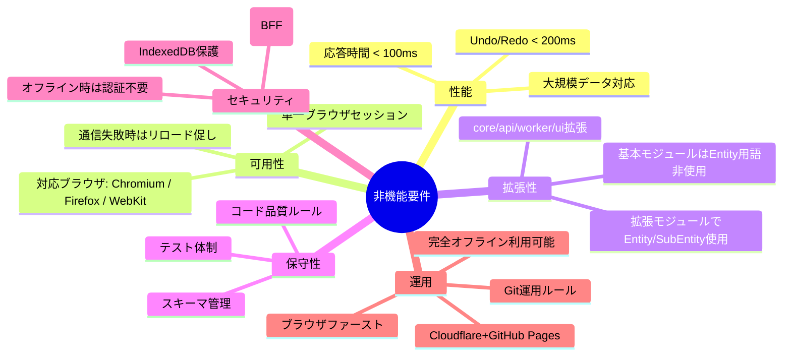

# 3. 非機能要件

## 3.1 性能要件

### 3.1.1 応答時間
- **UI操作 → 表示更新** は、通常条件下で **100ms以内** を目標とする。
- Undo/Redo の適用は **200ms以内** を目標とする。
- 大規模データセット（10万ノード規模）でも、表示対象ノードの展開・折りたたみは遅延なく動作すること。

### 3.1.2 ストレージ使用量
- IndexedDB(CoreDB/EphemeralDB) の総容量は、通常利用で 100MB 以下に収まることを目安とする。
- EphemeralDB のデータはセッション単位で破棄可能であり、容量を圧迫しない設計とする。

### 3.1.3 同時購読数
- 単一UIセッションにおける購読ノード数は、1,000件までを推奨上限とする。
- 購読状態の差分送信を最適化（16msコアレス、去重、changed fields のみ送信）し、通信負荷を低減する。

---

## 3.2 可用性要件

### 3.2.1 単一ブラウザセッション前提
- 異なる端末や複数ブラウザ間でのリアルタイム同期は行わない（仕様上非対応）。
- ワーカとの通信失敗時は再試行せず、**ユーザにページリロードまたはブラウザ再起動を促す**。

### 3.2.2 データ保全
- CoreDB のデータは、ブラウザの IndexedDB に永続保存される。
- EphemeralDB のデータは短期保持であり、消失しても致命的ではない設計とする。

### 3.2.3 ブラウザ対応
- **Chromium, Firefox, WebKit** ベースのモダンブラウザを対象とする。
- 後方互換性は考慮しない（古いブラウザ・非標準実装ブラウザはサポート対象外）。

---

## 3.3 拡張性要件

### 3.3.1 モジュール拡張
- core/api/worker/ui の4層すべてで拡張ポイントを設ける。
- 拡張モジュールはAOP的に機能追加でき、ベースモジュールを直接改変しない。

### 3.3.2 データスキーマ拡張
- **基本モジュール**では `TreeNode` のようにシンプルな型名を用い、`Entity` という用語は使用しない。
- **拡張モジュール**側では、1対1対応する「Entity」および n対1対応する「SubEntity」の用語を使用可能とし、開発者の理解を助ける。

---

## 3.4 保守性要件

### 3.4.1 テスト
- Vitestでの単体テストとPlaywrightでのE2Eテストを導入。
- 主要機能の回帰バグ防止を目的に、最低限のカバレッジ基準を確保。

### 3.4.2 スキーマ管理
- Dexieスキーマは `core` モジュール内で一元管理し、バージョン番号でマイグレーションを制御。
- DBの破棄・再生成手順を開発者ドキュメントに明記。

---

## 3.5 セキュリティ要件

### 3.5.1 認証・認可
- Cloudflare上のBFFモジュールでOAuth2（Google, Microsoft, GitHub）を仲介。
- CORS-proxy利用時はBFF経由の認証を必須とする。
- 外部APIや外部ダウンロードサイトを利用しない場合、ユーザ認証は不要。

### 3.5.2 データ保護
- IndexedDBデータはブラウザのサンドボックス内に格納され、外部から直接アクセスできない。
- 機微情報はCoreDBには格納せず、外部安全ストレージと連携する。

---

## 3.6 運用要件

### 3.6.1 ブラウザファースト・オフライン利用
- 本システムはブラウザファーストで動作し、外部APIや外部ダウンロードサイトを利用しない場合は**完全オフライン利用**が可能。
- IndexedDBを利用したローカルデータ保持により、ネットワーク接続なしでも全機能を利用できる。

### 3.6.2 デプロイ
- Cloudflare Pages / Workers によるBFF・CORS-proxy運用。
- GitHub Pages によるUI/Workerアプリの静的ホスティング。

### 3.6.3 バージョン管理
- GitHub上でOSSとして公開。
- mainブランチは常に安定版、developブランチでの統合テスト後にマージ。

## 3.7 非機能要件図

