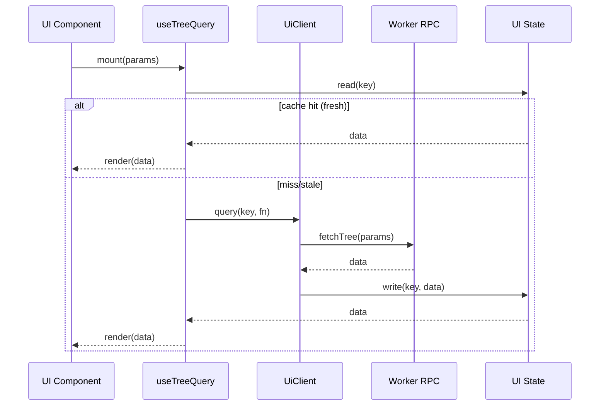
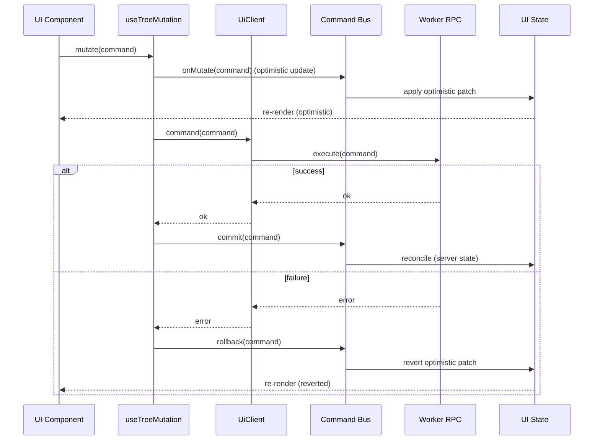
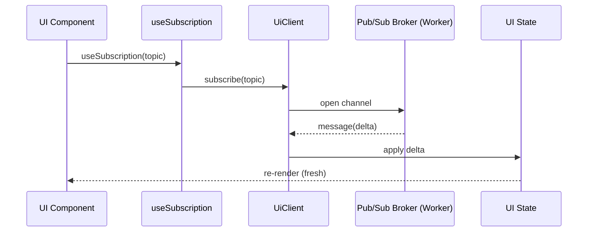
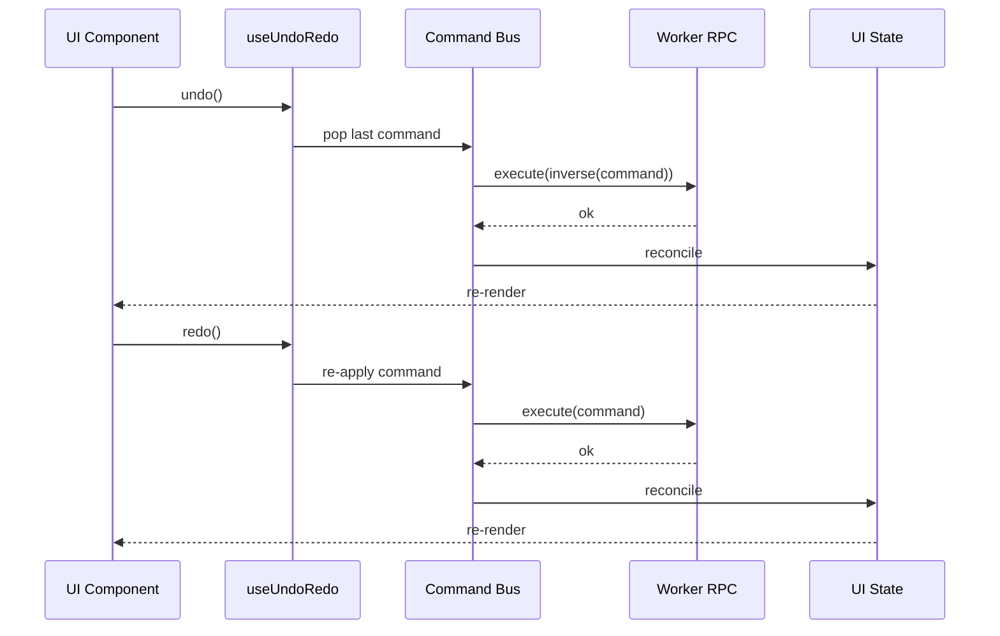

# 7.3 UI クライアント層仕様（ui-client）

本章では、UI と内部サービス（Web Worker / API）を結ぶ `@hierarchidb/ui-client` の詳細を記載する。hook, client, worker, pub-sub, command, undo/redo の各部品がユースケースごとにどのように連携し機能するかを、API 仕様とシーケンス図で示す。

## 7.3.1 概要
- 目的: UI から Worker/API を型安全に呼び出し、状態購読（Pub/Sub）とコマンド実行（Command/Undo-Redo）を統合的に提供。
- 技術: Comlink ベースの RPC、型定義の共有、React Hook による宣言的使用感。
- 境界: UI スレッドと Worker スレッドを明確に分離し、重い処理/IO は Worker 側に寄せる。

## 7.3.2 構成要素
- Hook: `useTreeQuery`, `useTreeMutation`, `useSubscription`, `useClient`, `useCommand`, `useUndoRedo`。
- Client: 型安全な呼び出しラッパー。Retry/Cancel/Timeout を担当。状態は React の state として保持（別キャッシュ層なし）。
- Worker: ドメインロジック・永続化アクセス・Pub/Sub ブローカー（Port or BroadcastChannel）を保持。
- Pub/Sub: Topic（例: `tree:<id>`）に対して push。UI 側は `useSubscription` で購読し React の状態を最新化。
- Command Bus: ミューテーションをコマンドとして扱い、楽観更新・逆操作（Inverse Command）・履歴管理を提供。
- UI State: Query の結果や購読差分を React の state/useReducer/Context で保持し、Subscription/Mutation により合意アルゴリズムで部分更新。

補足: 本仕様では専用のキャッシュ層は持たず、状態は React の状態（UI State）として保持・再レンダリングの契機とする。

## 7.3.3 型と命名（例）
```ts
// 共通型（抽象例）
export type QueryKey = readonly [string, ...Array<string | number>];
export type CommandId = string;
export type Topic = string; // e.g., `tree:${id}`

export interface ClientOptions { retry?: number; timeoutMs?: number; }

export interface UiClient {
  query<T>(key: QueryKey, fn: () => Promise<T>, opt?: ClientOptions): Promise<T>;
  command<C extends { type: string; payload: unknown }>(cmd: C, opt?: ClientOptions): Promise<{ ok: true } | { ok: false; error: string }>;
  subscribe(topic: Topic, onMessage: (ev: unknown) => void): () => void;
}
```

## 7.3.4 接続ライフサイクル
- 初期化: `ClientProvider` マウント時に Worker を起動し、Comlink でエンドポイントを確立。
- 終了: アンマウント/アプリ終了時に購読解除・Worker 終了（必要に応じて keep-alive）。
- 再接続: エラー/タイムアウト時は指数バックオフで再接続。UI はスピナー/トーストで通知。

## 7.3.5 主要 Hook API（UI 側）
- `useTreeQuery(params, opt)`
  - 引数: パラメータ（id 等）とオプション（staleTime, select, enabled）
  - 返値: `{ data, loading, error, refetch }`
- `useTreeMutation(opt)`
  - 引数: 楽観更新関数 `onMutate`, 完了/失敗ハンドラ
  - 返値: `mutate(command)` / `mutateAsync(command)`
- `useSubscription(topic, handler, opt)`
  - 返値: 自動購読とクリーンアップ、ネットワーク不通時の再購読
- `useUndoRedo()`
  - 返値: `{ canUndo, canRedo, undo(), redo() }`

## 7.3.6 ユースケース別シーケンス図

### A. クエリ（Query）フロー


### B. コマンド（Mutation）+ 楽観更新 + ロールバック


### C. 購読（Subscription）による push 更新


### D. Undo / Redo フロー


## 7.3.7 エラー・再試行・キャンセル
- 再試行: 指数バックオフ（maxRetries, jitter）。ユーザ操作で即時再試行 `refetch()`。
- タイムアウト/キャンセル: AbortController を介したキャンセル伝播（UI -> Client -> Worker）。
- 分類: ネットワーク/検証/権限/競合（409）/予期せぬ例外。UI へはコードと説明を返す。

## 7.3.8 セキュリティとスレッド境界
- 直列化: Comlink 伝播に不適切なオブジェクトは構造化クローニング対応のみに限定。
- サニタイズ: UI から渡される文字列は Worker 側で検証・サニタイズ（SQL/パス/URL）。
- 資源管理: 購読リーク防止のため unmount で確実に unsubscribe。

## 7.3.9 参考実装配置（例）
- `@hierarchidb/ui-client`
  - `src/client/index.ts`（UiClient 実装）
  - `src/hooks/*.ts`（React Hooks）
  - `src/worker/endpoint.ts`（Comlink エンドポイント定義）
  - `src/command/*.ts`（Command/Undo/Redo）
  - `src/pubsub/*.ts`（Broker/Topic）

