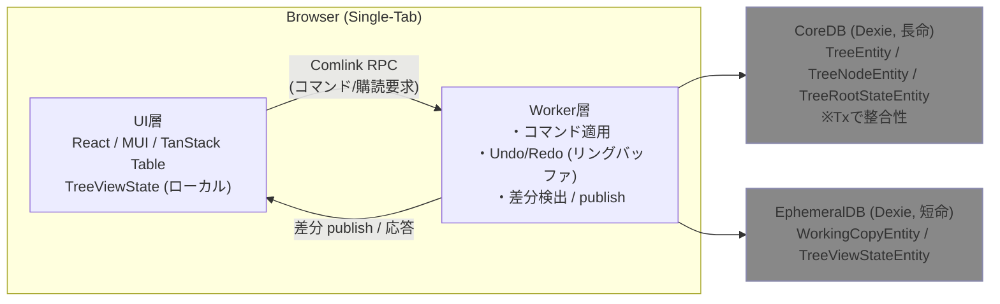

# 1. 概要、仕様書の構成

## 1.1 概要

**hierarchiidb** は、ツリー構造をもつデータをブラウザ環境で効率的かつ一貫性を保ちながら管理・操作するための **高汎用性フレームワーク** です。  
アプリケーションの UI 層と Worker 層を明確に分離し、Dexie を用いた IndexedDB 永続化と Comlink 経由の非同期通信を組み合わせることで、堅牢かつ拡張性の高い構造を実現しています。

本仕様書は **OSS として外部公開**され、以下の二つの利用を想定します。

- **一次的利用**：開発者（人間・生成AI問わず）が本仕様をもとにコアシステムを実装・拡張するための指針
- **二次的利用**：本仕様から派生して構築されたアプリケーション（例：GISアプリ「ERIA-Cartograph」）の機能拡張やメンテナンス

hierarchiidb は特定ドメインに依存しない汎用コアを提供しますが、  
地理情報システム（GIS）、プロジェクト管理、データカタログなど、階層型リソース管理を必要とするあらゆる分野に適用可能です。  
本仕様書では、6〜8章において GIS アプリケーションの具体例として「ERIA-Cartograph」拡張を記載します。

## 1.2 技術アーキテクチャ概要

hierarchiidb のコアアーキテクチャは以下の4層で構成されます。

1. **UI層**
    - React Router / Material UI / TanStack Table を用いたブラウザ表示・操作。
    - ローカルビュー状態（TreeViewState）を保持し、Comlink を介して Worker にコマンド・購読要求を送信。
2. **Worker層**
    - UI からのコマンドを受け、CoreDB/EphemeralDB を更新。
    - Undo/Redo のメモリ・リングバッファ管理、購読ノードの差分検出と UI への publish を担当。
3. **CoreDB（Dexie）**
    - 長命データ：**TreeEntity / TreeNodeEntity / TreeRootStateEntity**。
    - トランザクションで整合性を確保。
4. **EphemeralDB（Dexie）**
    - 短命データ：**WorkingCopyEntity / TreeViewStateEntity**。
    - 頻繁に変化する編集・表示状態を格納。

**処理の流れ（例：ノード編集）**  
UI → Comlink → Worker（EphemeralDB に WorkingCopy 保存）→ コミットで CoreDB に反映 → UI へ差分 publish。

## 1.3 仕様書の構成

本仕様書は次の章立てで構成されます。

1. **概要、仕様書の構成**  
   - プロジェクトの目的、前提、対象読者、構成の説明、アーキテクチャ概要
2. **ツールセット**  
   - 開発環境・ビルド環境の構成（pnpm, turborepo, typescript, eslint, prettier, vite, vitest, playwright）
3. **非機能要件**  
   - 性能、可用性、拡張性、保守性などの要求事項
4. **開発上のローカルルール**  
   - 命名規則、型安全性、ファイル構成などのコーディング規約
5. **ベースモジュール**  
   - Cloudflare上で稼働するBFF・CORSプロキシモジュール  
   - GitHub Pagesで稼働する UI 層・Worker 層・型定義・共通関数群など
6. **プラグインモジュールによるAOPでの機能拡張**  
   - core/api/worker/ui の拡張方式と UnifiedPluginDefinition/NodeTypeRegistry による統合  
   - GIS用途「ERIA-Cartograph」における具体的拡張例（地図描画、データ管理）
7. **AOP アーキテクチャ仕様**  
   - ノードタイプ定義、ライフサイクルフック、エンティティ管理、プラグインシステムの詳細
8. **階層的URLパターンでのプラグインルーティングシステム**  
   - React Router v7 ベースの階層的URL/段階的ローダー設計とプラグインアクションの統合
