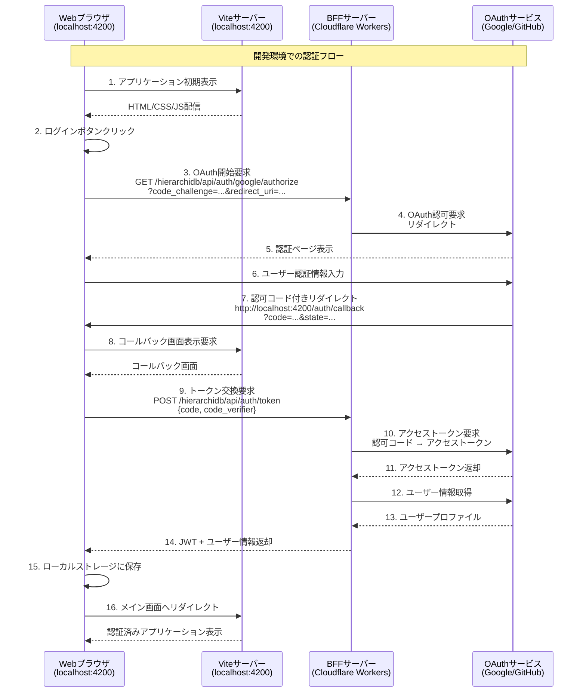
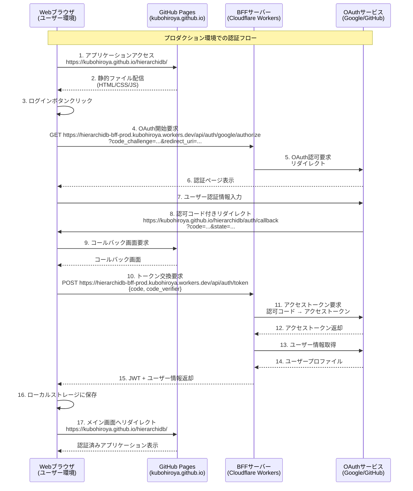
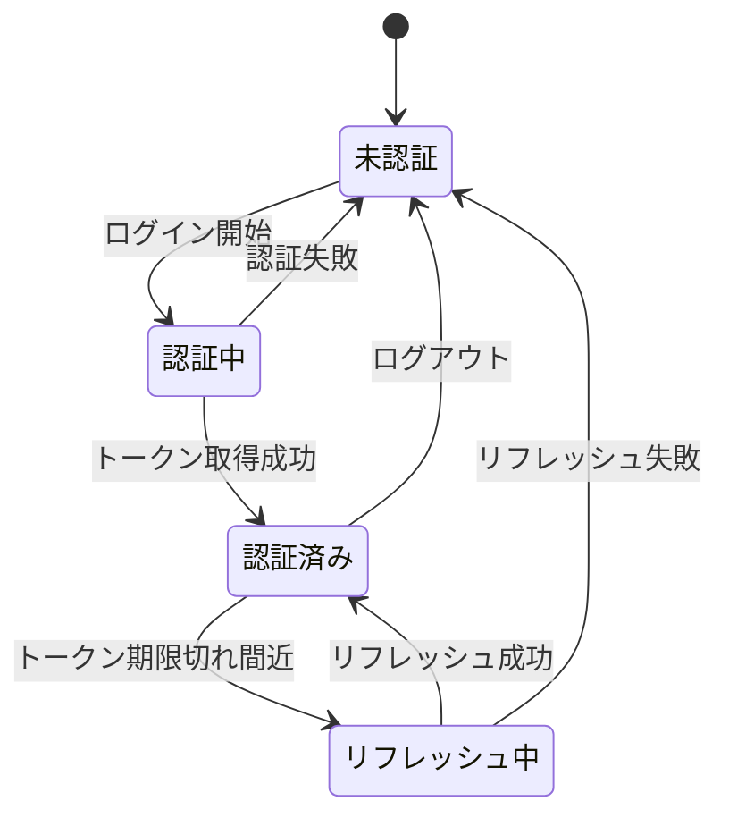

# 認証シーケンス図

**作成日**: 2025年8月25日  
**⚠️ 注意: このドキュメントは設計上の理想像を示しています。現在の実装状態とは異なる部分があります。**

## 現在の実装状態（2025年8月25日時点）

- ✅ クライアント側（BFFAuthService）のOAuth2 + PKCE実装は完了
- ❌ BFFサーバーは`eria-cartograph`プロジェクト用のものを暫定使用中
- ❌ `hierarchidb`専用のBFFサーバーは未デプロイ
- ❌ 環境変数設定が暫定的

本ドキュメントでは、HierarchiDBシステムにおける開発モードとプロダクションモードそれぞれの認証フローの**理想的な設計**を示します。

## システムコンポーネント

- **Webブラウザ**: ユーザーが使用するクライアント
- **Webサーバー**: 
  - 開発: Vite開発サーバー（localhost:4200）
  - 本番: GitHub Pages（静的ホスティング）
- **BFFサーバー**: Cloudflare Workers（認証処理）
- **OAuthサービス**: Google/GitHub（認証プロバイダー）

## 開発モード（Development Mode）

開発環境では、Vite開発サーバーを使用し、BFFサーバーは本番のCloudflare Workersに直接アクセスします。



### 開発モードの特徴

- **ローカル開発サーバー**: Viteがlocalhost:4200で動作
- **HMR対応**: ホットモジュールリロードで即座に変更反映
- **BFFアクセス**: 本番のCloudflare Workersを直接利用
- **リダイレクトURI**: `http://localhost:4200/auth/callback`

## プロダクションモード（Production Mode）

本番環境では、GitHub Pagesから静的ファイルを配信し、Cloudflare WorkersのBFFサーバーと連携します。



### プロダクションモードの特徴

- **静的ホスティング**: GitHub Pagesから配信
- **CDN配信**: GitHubのCDNによる高速配信
- **BFFアクセス**: Cloudflare WorkersのプロダクションURL
- **リダイレクトURI**: `https://kubohiroya.github.io/hierarchidb/auth/callback`

## セキュリティ機能

### OAuth2 + PKCE

両モードとも、以下のセキュリティ機能を実装しています：

1. **PKCE (Proof Key for Code Exchange)**
   - code_verifierとcode_challengeによる認可コード横取り攻撃の防止
   - SHA256によるチャレンジ生成

2. **State パラメータ**
   - CSRF攻撃の防止
   - セッション固有の値を使用

3. **JWT トークン**
   - BFFサーバーで署名付きトークンを生成
   - クライアントサイドでの検証

4. **BFF パターン**
   - クライアントシークレットをBFFサーバーで管理
   - フロントエンドには露出しない

## 環境変数設定

### 現在の暫定設定（.env.development）

```env
# BFF Authentication Service URL - 暫定的にeria-cartograph BFFを使用
VITE_BFF_BASE_URL=https://eria-cartograph-bff.kubohiroya.workers.dev/api/auth

# Hash routing for GitHub Pages compatibility
VITE_USE_HASH_ROUTING=true
```

### 理想的な設定（未実装）

#### 開発環境（.env.development）

```env
# BFF Authentication Service URL - hierarchidb専用BFF
VITE_BFF_BASE_URL=https://hierarchidb-bff.kubohiroya.workers.dev/api/auth

# Hash routing for GitHub Pages compatibility
VITE_USE_HASH_ROUTING=true
```

#### 本番環境（.env.production）

```env
# BFF Authentication Service URL - hierarchidb専用BFF
VITE_BFF_BASE_URL=https://hierarchidb-bff-prod.kubohiroya.workers.dev/api/auth

# Application base path for GitHub Pages
VITE_APP_NAME=hierarchidb
```

## トークンライフサイクル



## エラーハンドリング

認証フローで発生する可能性のあるエラーと対処：

| エラー種別 | 原因 | 対処方法 |
|---------|------|---------|
| Network Error | BFFサーバー接続失敗 | リトライまたは手動再試行 |
| Invalid State | CSRF攻撃の可能性 | 認証フロー再開 |
| Invalid Code | 認可コード期限切れ | 認証フロー再開 |
| Token Expired | JWTトークン期限切れ | リフレッシュトークンで更新 |
| Popup Blocked | ポップアップブロック | リダイレクト方式へフォールバック |

## まとめ

HierarchiDBの認証システムは、開発環境と本番環境で同じCloudflare Workers BFFサーバーを使用し、OAuth2 + PKCEによる安全な認証を提供します。開発時はVite開発サーバーを使用し、本番環境ではGitHub Pagesから静的ファイルを配信する構成により、効率的な開発とデプロイを実現しています。