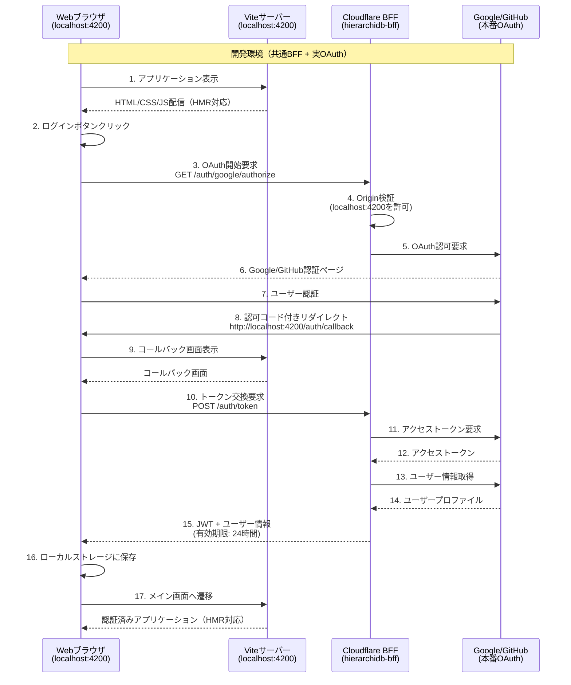
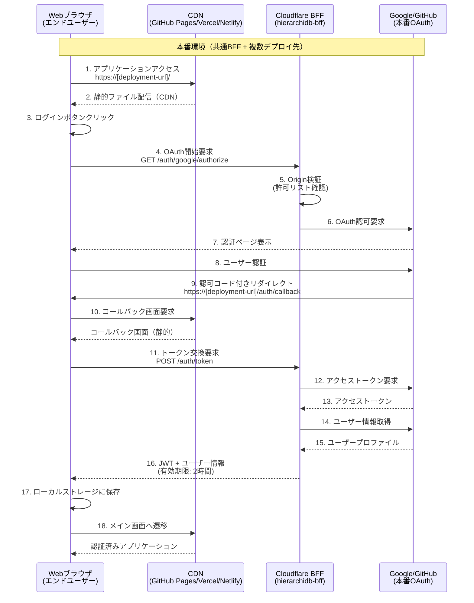

# 認証環境パターン

**作成日**: 2025年8月25日  
**更新日**: 2025年8月25日

HierarchiDBシステムでは、単一のBFF（Backend for Frontend）サービスを使用して、複数のデプロイ先からの認証要求を処理します。開発と本番の2つの環境パターンを使い分けて、効率的な開発と安全な本番運用を実現します。

## アーキテクチャ概要

HierarchiDBは **「単一BFF、複数フロントエンド」** アーキテクチャを採用：
- 1つのBFFサービスがすべての認証要求を処理
- 複数のフロントエンドデプロイが同じBFFに接続
- リクエスト元のOriginに基づく環境別設定
- OAuth管理とセキュリティの一元化

## 環境パターン一覧

| 環境 | Webサーバー | BFFサーバー | OAuth | 用途 |
|------|------------|------------|-------|------|
| **開発環境 (Development)** | Vite開発サーバー<br/>(localhost:4200) | Cloudflare Workers<br/>(hierarchidb-bff) | Google/GitHub<br/>(実OAuth) | 開発・デバッグ・統合テスト |
| **本番環境 (Production)** | GitHub Pages/Vercel/Netlify<br/>(静的ホスティング) | Cloudflare Workers<br/>(hierarchidb-bff) | Google/GitHub<br/>(実OAuth) | エンドユーザー向け |

## 開発環境 (Development)

**目的**: Vite開発サーバーで実際のBFFサーバーとOAuthプロバイダーを使用してデバッグ・テスト

### 環境設定の構成

```bash
# 設定の読み込み順序
scripts/env/base.sh          # 共通設定
    ↓
scripts/env/development.sh   # 開発環境の差分
    ↓
app/.env.secrets            # セキュアな値（推奨）
```

### 環境固有の設定値 (scripts/env/development.sh)

```bash
# 開発環境の差分設定
VITE_BFF_BASE_URL="https://hierarchidb-bff.kubohiroya.workers.dev"
VITE_USE_HASH_ROUTING="true"
VITE_APP_NAME="hierarchidb"
VITE_APP_TITLE="HierarchiDB (Development)"
VITE_ENV_MODE="development"
VITE_APP_URL="http://localhost:4200"
VITE_DEBUG_MODE="true"
```

### 起動方法

```bash
# デフォルトコマンド
pnpm dev

# または明示的に指定
./scripts/start-env.sh development
```

### シーケンス図



### 特徴

- ✅ **実際のOAuth検証**: 本番と同じ認証フロー
- ✅ **HMR対応**: コード変更を即座に反映
- ✅ **本番BFFデバッグ**: 実際のBFFサーバーの動作確認
- ✅ **緩いレート制限**: 100リクエスト/分（開発効率重視）
- ✅ **長いJWT有効期限**: 24時間（頻繁な再認証を回避）
- ✅ **詳細ログ**: デバッグモードでの詳細な情報出力


## 本番環境 (Production)

**目的**: エンドユーザー向けの本番デプロイ（複数のデプロイ先をサポート）

### 環境設定の構成

```bash
# 設定の読み込み順序
scripts/env/base.sh        # 共通設定
    ↓
scripts/env/production.sh  # 本番環境の差分
    ↓
app/.env.secrets           # セキュアな値（CI/CDで設定）
```

### 環境固有の設定値 (scripts/env/production.sh)

```bash
# 本番環境の差分設定
VITE_BFF_BASE_URL="https://hierarchidb-bff.kubohiroya.workers.dev"
VITE_USE_HASH_ROUTING="true"
VITE_APP_NAME="hierarchidb"
VITE_APP_TITLE="HierarchiDB"
VITE_ENV_MODE="production"

# デプロイ先に応じて変更可能
VITE_APP_URL="https://kubohiroya.github.io/hierarchidb"
# または
# VITE_APP_URL="https://hierarchidb.vercel.app"
# VITE_APP_URL="https://hierarchidb.netlify.app"

NODE_ENV="production"
VITE_BUILD_SOURCEMAP="false"
VITE_DEBUG_MODE="false"
```

### サポートされるデプロイ先

| デプロイ先 | URL | 特徴 |
|------------|-----|------|
| GitHub Pages | https://kubohiroya.github.io/hierarchidb | 無料、GitHub統合 |
| Vercel | https://hierarchidb.vercel.app | 自動デプロイ、プレビュー環境 |
| Netlify | https://hierarchidb.netlify.app | 自動デプロイ、フォーム機能 |

### ビルド・デプロイ方法

```bash
# 本番ビルド
pnpm build

# GitHub Pagesへデプロイ
gh-pages -d packages/app/dist

# Vercelへデプロイ
vercel --prod

# Netlifyへデプロイ
netlify deploy --prod
```

### シーケンス図



### 特徴

- ✅ **完全な本番環境**: エンドユーザー向け
- ✅ **CDN配信**: 高速なコンテンツ配信
- ✅ **スケーラビリティ**: Cloudflare Workersの自動スケーリング
- ✅ **厳格なレート制限**: 20リクエスト/分（DDoS対策）
- ✅ **短いJWT有効期限**: 2時間（セキュリティ重視）
- ✅ **複数デプロイ先サポート**: 1つのBFFで複数のOriginに対応
- ❌ **デバッグ困難**: リアルタイムデバッグ不可

## BFFセキュリティ機能

### Origin検証とCORS

```typescript
// 許可されたOriginリスト
const allowedOrigins = [
  // 開発環境
  "http://localhost:4200",
  "http://localhost:5173",
  // 本番環境
  "https://kubohiroya.github.io",
  "https://hierarchidb.vercel.app",
  "https://hierarchidb.netlify.app"
];

// リクエスト元のOriginを検証
if (!allowedOrigins.includes(origin)) {
  return new Response("Forbidden", { status: 403 });
}
```

### 環境別設定

| 設定項目 | 開発環境 | 本番環境 |
|----------|----------|----------|
| JWT有効期限 | 24時間 | 2時間 |
| レート制限 | 100/分 | 20/分 |
| ログレベル | debug | warn |
| セキュリティヘッダー | 基本 | 厳格 |
| 監査ログ | 有効 | 有効 |

### セキュリティレイヤー

1. **Origin検証**: 許可リストベースの厳格な検証
2. **レート制限**: IP別の要求制限（Cloudflare KV使用）
3. **監査ログ**: 認証イベントの記録と不審な活動の検出
4. **セキュリティヘッダー**: CSP、XSS対策、フレーム対策

## 環境設定管理の仕組み

### 設定ファイルの構成

```
scripts/
├── env/                      # 環境設定ディレクトリ
│   ├── base.sh              # 共通設定（Single Source of Truth）
│   ├── development.sh       # 開発環境の差分
│   └── production.sh        # 本番環境の差分
├── start-env.sh             # 統一起動スクリプト
└── env/README.md            # 設定管理ドキュメント

packages/backend/bff/
├── wrangler.hierarchidb.toml  # BFF設定（複数Origin対応）
├── src/
│   └── middleware/
│       └── security.ts      # セキュリティミドルウェア
└── deploy-hierarchidb.sh    # デプロイスクリプト

app/
├── .env.secrets             # セキュアな値（Gitignore対象）
└── .env.secrets.example     # テンプレート
```

### 設定の優先順位

1. **app/.env.secrets** - セキュアな値（最優先）
2. **scripts/env/{環境}.sh** - 環境固有の設定
3. **scripts/env/base.sh** - 共通のデフォルト値
4. **デフォルト値** - 変数定義時の初期値

## BFFデプロイ手順

### 1. OAuth App設定

**Google OAuth:**
1. [Google Cloud Console](https://console.cloud.google.com/)でプロジェクト作成
2. OAuth 2.0 Client ID作成
3. 認可済みリダイレクトURIを追加:
   - `https://hierarchidb-bff.kubohiroya.workers.dev/auth/callback`
   - `https://hierarchidb-bff.kubohiroya.workers.dev/auth/google/callback`

**GitHub OAuth:**
1. [GitHub Developer Settings](https://github.com/settings/developers)でOAuth App作成
2. Authorization callback URLを設定:
   - `https://hierarchidb-bff.kubohiroya.workers.dev/auth/github/callback`

### 2. BFFデプロイ

```bash
cd packages/backend/bff

# デプロイスクリプト実行
./deploy-hierarchidb.sh

# プロンプトに従って:
# 1. 環境選択（development/production）
# 2. KVネームスペース作成（オプション）
# 3. シークレット設定
# 4. Cloudflareへデプロイ
```

### 3. 動作確認

```bash
# ヘルスチェック
curl https://hierarchidb-bff.kubohiroya.workers.dev/health

# ログ監視
wrangler tail --config wrangler.hierarchidb.toml --env production
```

## トラブルシューティング

### 共通の問題

| 問題 | 原因 | 解決方法 |
|------|------|----------|
| スクリプト実行エラー | 実行権限なし | `chmod +x scripts/*.sh scripts/env/*.sh` |
| 環境変数が反映されない | キャッシュ | プロセス再起動、`source scripts/env/{環境}.sh`で確認 |
| セキュアな値が読み込まれない | .env.secretsなし | `cp app/.env.secrets.example app/.env.secrets` |

### 開発環境の問題

| 問題 | 原因 | 解決方法 |
|------|------|----------|
| CORS エラー | BFFの許可リスト未設定 | wrangler.tomlのALLOWED_ORIGINSにlocalhost:4200追加 |
| 認証後のリダイレクト失敗 | コールバックURL設定 | OAuth Appにlocalhost URLを追加 |
| BFF接続エラー | URL設定ミス | development.shのVITE_BFF_BASE_URL確認 |

### 本番環境の問題

| 問題 | 原因 | 解決方法 |
|------|------|----------|
| 404エラー | ベースパス設定ミス | production.shのVITE_APP_NAME確認 |
| 認証後白画面 | ハッシュルーティング | production.shのVITE_USE_HASH_ROUTING=true確認 |
| Origin拒否エラー | BFF許可リスト | wrangler.tomlにデプロイ先URLを追加 |
| レート制限エラー | 要求が多すぎる | X-RateLimit-Remainingヘッダー確認、60秒待機 |

## セキュリティ考慮事項

### 開発環境
- ⚠️ localhost以外からのアクセスを防ぐ
- ⚠️ デバッグ情報の本番環境への混入を防ぐ
- ⚠️ 長いJWT有効期限は開発環境のみ

### 本番環境
- ✅ HTTPS必須
- ✅ JWT署名検証
- ✅ PKCE実装
- ✅ CSRFトークン
- ✅ Origin検証
- ✅ レート制限
- ✅ 監査ログ
- ✅ セキュリティヘッダー（CSP、XSS対策）

### シークレット管理
- ❌ wrangler.tomlにシークレットを記載しない
- ✅ Cloudflare Secretsを使用（`wrangler secret put`）
- ✅ 定期的なシークレットローテーション
- ✅ 環境別のシークレット管理

## まとめ

HierarchiDBの認証システムは、単一のBFFサービスで複数のデプロイ先をサポートする効率的なアーキテクチャを採用しています：

### 利点
1. **管理の簡素化**: 1つのBFFで全環境をサポート
2. **コスト効率**: Cloudflare Worker 1つで運用
3. **セキュリティ**: 一元化されたセキュリティポリシー
4. **柔軟性**: 新しいデプロイ先の追加が容易

### 推奨フロー
1. **開発**: localhost:4200で開発・テスト
2. **検証**: 実BFF・実OAuthで統合テスト
3. **デプロイ**: 複数のプラットフォームへ同時展開
4. **監視**: 統一された監査ログとメトリクス

各環境の切り替えは環境変数ファイルで管理し、開発フローに応じて段階的に移行することが推奨されます。