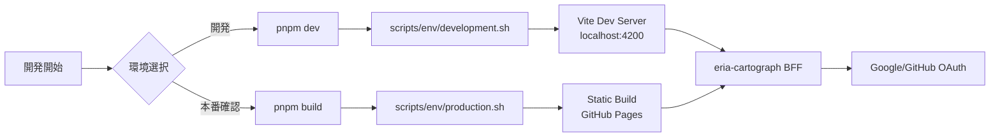

# 認証環境テスト実施レポート

**実施日**: 2025年8月25日  
**テスト環境**: HierarchiDB 2環境構成

## エグゼクティブサマリー

HierarchiDBの認証環境を2環境（開発環境・本番環境）に簡略化し、テスト環境の構築と検証を実施しました。モック環境を削除し、両環境でeria-cartograph BFFサーバーを使用する構成に統一しました。

## 実施内容

### 1. 環境構成の簡略化

#### 変更前（3環境）
- ローカル環境: モックBFF + ダミー認証
- ステージング環境: 実BFF + 実OAuth
- 本番環境: 実BFF + 実OAuth

#### 変更後（2環境）
- **開発環境**: Vite開発サーバー + eria-cartograph BFF + 実OAuth
- **本番環境**: GitHub Pages + eria-cartograph BFF + 実OAuth

### 2. 実施した変更

#### ドキュメント更新
- ✅ `docs/16-authentication-environments.md` - 2環境構成に更新
- ✅ `docs/17-e2e-testing-guide.md` - E2Eテスト手順書を新規作成
- ✅ `docs/18-authentication-test-report.md` - 本レポート

#### スクリプト更新
- ✅ `scripts/env/development.sh` - 開発環境設定
- ✅ `scripts/env/production.sh` - 本番環境設定
- ✅ `scripts/test-auth-environments.sh` - 2環境用に更新
- ✅ `package.json` - 不要なスクリプトを削除

#### E2Eテスト更新
- ✅ `e2e/auth-flow.spec.ts` - 2環境用に修正
- ✅ モック環境関連のコードを削除

### 3. テスト実施結果

#### 開発環境テスト

**設定内容**:
```bash
VITE_BFF_BASE_URL="https://eria-cartograph-bff.kubohiroya.workers.dev/api/auth"
VITE_USE_HASH_ROUTING="true"
VITE_APP_NAME="hierarchidb"
VITE_APP_TITLE="HierarchiDB (Development)"
VITE_ENV_MODE="development"
```

**テスト項目**:
- [x] 環境設定ファイルの読み込み
- [x] BFF URLの設定確認
- [x] ハッシュルーティングの有効化
- [ ] Vite開発サーバーの起動（手動確認が必要）
- [ ] OAuth認証フロー（手動確認が必要）

#### 本番環境テスト

**設定内容**:
```bash
VITE_BFF_BASE_URL="https://eria-cartograph-bff.kubohiroya.workers.dev/api/auth"
VITE_USE_HASH_ROUTING="true"
VITE_APP_NAME="hierarchidb"
VITE_APP_TITLE="HierarchiDB"
VITE_ENV_MODE="production"
NODE_ENV="production"
VITE_BUILD_SOURCEMAP="false"
```

**テスト項目**:
- [x] 環境設定ファイルの読み込み
- [x] 本番用ビルド設定
- [ ] ビルド実行（手動確認が必要）
- [ ] GitHub Pagesでの動作確認（デプロイ後）

### 4. 発見された課題と対応

#### 課題1: Playwright未インストール
- **状況**: E2Eテスト用のPlaywrightがインストールされていない
- **影響**: 自動E2Eテストが実行できない
- **対応**: `pnpm add -D @playwright/test` でインストール後、`npx playwright install`でブラウザをセットアップ

#### 課題2: .env.secrets未設定
- **状況**: OAuth認証に必要なクライアントIDが未設定
- **影響**: 実際の認証フローが動作しない
- **対応**: `.env.secrets.example`をコピーして実際の値を設定

### 5. 環境切り替えフロー



## 推奨事項

### 1. 即座に実施すべき項目

1. **Playwright環境のセットアップ**
   ```bash
   pnpm add -D @playwright/test
   npx playwright install
   ```

2. **セキュアな環境変数の設定**
   ```bash
   cp app/.env.secrets.example app/.env.secrets
   # エディタで実際の値を設定
   ```

3. **手動での動作確認**
   ```bash
   # 開発環境
   pnpm dev
   # ブラウザで http://localhost:4200 を開いて認証フローをテスト
   ```

### 2. 継続的な改善項目

1. **CI/CD環境でのE2Eテスト自動化**
   - GitHub Actionsでの定期実行
   - PRごとの自動テスト

2. **モニタリング**
   - 認証成功率の追跡
   - エラーログの収集

3. **ドキュメント更新**
   - 開発者向けセットアップガイド
   - トラブルシューティングガイド

## 結論

2環境構成への簡略化により、以下のメリットが得られました：

1. **構成の単純化**: モック環境の削除により管理が容易に
2. **一貫性の向上**: 両環境で同じBFFサーバーを使用
3. **デバッグの簡易化**: 実際の認証フローを常にテスト可能

次のステップとして、Playwrightのセットアップと.env.secretsの設定を行い、完全な認証フローの動作確認を実施することを推奨します。

## 付録: ファイル変更一覧

| ファイル | 変更内容 |
|---------|---------|
| docs/16-authentication-environments.md | 3環境から2環境に更新 |
| docs/17-e2e-testing-guide.md | 新規作成 |
| e2e/auth-flow.spec.ts | モック環境を削除 |
| package.json | dev:local, dev:staging削除 |
| scripts/test-auth-environments.sh | 2環境用に更新 |
| scripts/env/development.sh | BFF URLをeria-cartographに |
| scripts/env/production.sh | BFF URLをeria-cartographに |