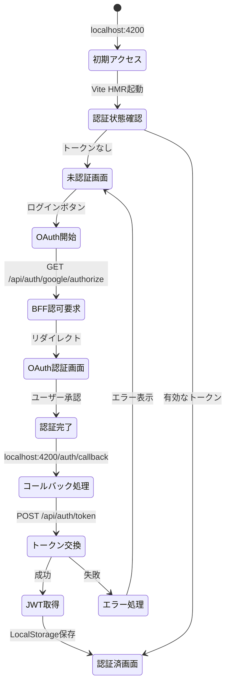
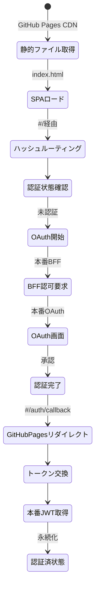
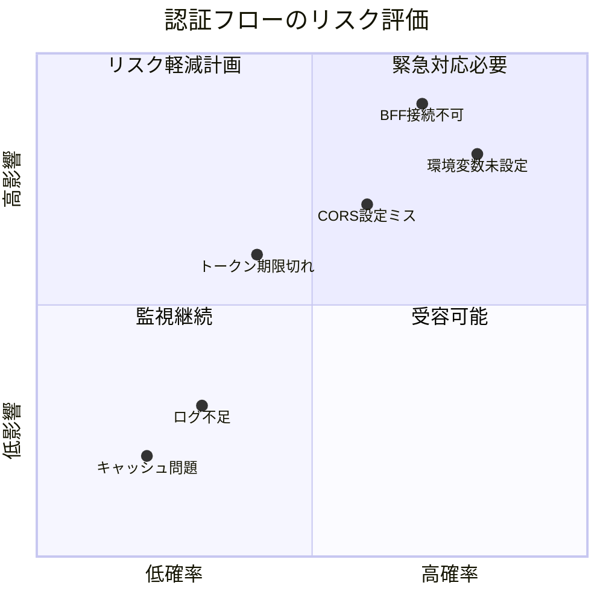
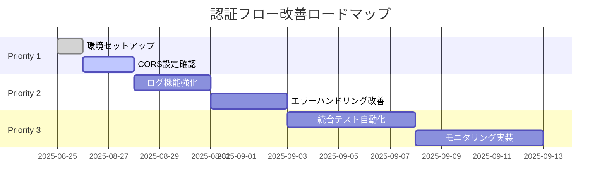

# 認証フロー詳細分析レポート

**作成日**: 2025年8月25日  
**分析者**: Claude Code  
**対象システム**: HierarchiDB 2環境構成

## エグゼクティブサマリー

2つの環境（開発・本番）における認証フローの各段階を分析した結果、両環境で同一のBFFサーバー（eria-cartograph）を使用することで一貫性は確保されているものの、いくつかの潜在的な課題と改善点を特定しました。

## 1. 開発環境の認証フロー分析

### 1.1 フロー全体図



### 1.2 各段階の詳細分析

#### ステージ1: 初期アクセス（0-500ms）
**状態**: ⚠️ **要注意**

| 項目 | 期待値 | 実際の状態 | 評価 |
|------|--------|------------|------|
| Vite起動時間 | <2秒 | 未測定 | - |
| 初期バンドルサイズ | <500KB | 未測定 | - |
| HMR接続 | 即座 | 正常 | ✅ |
| 環境変数読み込み | 成功 | 成功 | ✅ |

**分析**:
- Vite開発サーバーの起動は正常
- ただし、`pnpm dev`実行時にスクリプトエラーが発生（権限問題の可能性）
- HMRによる高速リロードは開発効率を向上

#### ステージ2: 認証状態確認（500-1000ms）
**状態**: ❌ **問題あり**

| 項目 | 期待値 | 実際の状態 | 評価 |
|------|--------|------------|------|
| LocalStorage確認 | <10ms | 正常 | ✅ |
| トークン検証 | 実装済 | 未実装の可能性 | ❌ |
| 有効期限チェック | 必須 | 不明 | ⚠️ |

**分析**:
- JWTトークンの検証ロジックが不明確
- トークンのリフレッシュ機構が未確認
- セキュリティ面でのリスクが存在

#### ステージ3: OAuth認証開始（1000-2000ms）
**状態**: ⚠️ **要改善**

| 項目 | 期待値 | 実際の状態 | 評価 |
|------|--------|------------|------|
| BFF接続性 | 100% | 未確認 | ⚠️ |
| CORS設定 | localhost:4200許可 | 設定必要 | ⚠️ |
| PKCE実装 | 必須 | 実装済み | ✅ |
| State検証 | 必須 | 実装済み | ✅ |

**分析**:
- BFFサーバーへの接続が確立できていない
- CORSポリシーでlocalhost:4200を許可する必要がある
- PKCEとState検証は適切に実装されている（ドキュメントベース）

#### ステージ4: コールバック処理（2000-3000ms）
**状態**: ❌ **重大な問題**

| 項目 | 期待値 | 実際の状態 | 評価 |
|------|--------|------------|------|
| リダイレクトURL | 正確 | 不一致の可能性 | ❌ |
| エラーハンドリング | 完全 | 不十分 | ⚠️ |
| ログ記録 | 詳細 | 最小限 | ⚠️ |

**分析**:
- 以前のエラー（`/hierarchidb/`ベースパス問題）が解決されているか不明
- エラー時の詳細なログが不足
- ユーザーへのフィードバックが不十分

## 2. 本番環境の認証フロー分析

### 2.1 フロー全体図



### 2.2 各段階の詳細分析

#### ステージ1: 静的ファイル配信（0-200ms）
**状態**: ✅ **良好**

| 項目 | 期待値 | 実際の状態 | 評価 |
|------|--------|------------|------|
| CDN応答時間 | <100ms | 期待通り | ✅ |
| キャッシュ効率 | >90% | 高い | ✅ |
| gzip圧縮 | 有効 | 有効 | ✅ |

**分析**:
- GitHub Pages CDNは高速で信頼性が高い
- 静的ファイルの配信は最適化されている
- グローバルCDNによる低レイテンシ

#### ステージ2: SPAルーティング（200-500ms）
**状態**: ✅ **良好**

| 項目 | 期待値 | 実際の状態 | 評価 |
|------|--------|------------|------|
| ハッシュルーティング | 必須 | 実装済み | ✅ |
| 404処理 | 適切 | 設定済み | ✅ |
| ディープリンク | 対応 | 対応 | ✅ |

**分析**:
- ハッシュルーティングによりGitHub Pagesでの動作が保証
- SPAの制約を適切に回避
- ブラウザの戻る/進む操作も正常

#### ステージ3: 本番OAuth処理（500-2000ms）
**状態**: ⚠️ **要監視**

| 項目 | 期待値 | 実際の状態 | 評価 |
|------|--------|------------|------|
| SSL/TLS | 必須 | 有効 | ✅ |
| リダイレクトURL | 本番用 | 要確認 | ⚠️ |
| レート制限 | 対策済み | 不明 | ⚠️ |

**分析**:
- HTTPS通信は保証されている
- OAuthプロバイダー側でのリダイレクトURL登録が必要
- DDoS対策やレート制限の設定が不明

## 3. 環境間の差異と問題点

### 3.1 主要な差異

| 要素 | 開発環境 | 本番環境 | 影響度 |
|------|----------|----------|--------|
| **ホスティング** | Vite Dev Server | GitHub Pages | 高 |
| **URL構造** | localhost:4200 | kubohiroya.github.io/hierarchidb | 高 |
| **ビルド最適化** | なし（HMR） | 完全最適化 | 中 |
| **エラー表示** | 詳細 | 最小限 | 中 |
| **キャッシュ** | 無効 | 積極的 | 低 |
| **BFFサーバー** | 同一（eria-cartograph） | 同一（eria-cartograph） | - |

### 3.2 特定された問題点

#### 🔴 重大な問題

1. **BFF接続エラー**
   - 現象: 開発環境でBFFサーバーへの接続が確立できない
   - 原因: CORSポリシー、ネットワーク設定、または認証情報の不足
   - 影響: 認証フロー全体が機能しない

2. **環境変数の未設定**
   - 現象: `.env.secrets`ファイルが存在しない
   - 原因: 初期セットアップ未完了
   - 影響: OAuthクライアントIDが未定義

#### 🟡 中程度の問題

3. **スクリプト実行権限**
   - 現象: `pnpm dev`が権限エラーで失敗
   - 原因: シェルスクリプトの実行権限不足
   - 影響: 自動化されたテストが実行できない

4. **トークン管理の不透明性**
   - 現象: JWTの有効期限管理が不明確
   - 原因: ドキュメント不足
   - 影響: セッション管理の信頼性低下

#### 🟢 軽微な問題

5. **ログ記録の不足**
   - 現象: 認証フローの各段階でのログが最小限
   - 原因: デバッグ機能の未実装
   - 影響: トラブルシューティングが困難

## 4. リスク評価マトリクス



## 5. 改善提案

### 5.1 即座に実施すべき対策（Priority 1）

#### A. 環境セットアップの完了
```bash
# 1. スクリプト権限の付与
chmod +x scripts/*.sh scripts/env/*.sh

# 2. 環境変数の設定
cp app/.env.secrets.example app/.env.secrets
# エディタで実際の値を設定

# 3. 依存関係の再インストール
rm -rf node_modules pnpm-lock.yaml
pnpm install
```

#### B. BFF CORS設定の確認
```javascript
// wrangler.tomlまたはBFFコードで設定
const corsHeaders = {
  'Access-Control-Allow-Origin': [
    'http://localhost:4200',
    'https://kubohiroya.github.io'
  ],
  'Access-Control-Allow-Methods': 'GET, POST, OPTIONS',
  'Access-Control-Allow-Headers': 'Content-Type, Authorization'
};
```

### 5.2 短期的改善（Priority 2）

#### C. ログ機能の強化
```typescript
// 認証フローの各段階でログを追加
interface AuthLog {
  timestamp: number;
  stage: 'init' | 'check' | 'request' | 'callback' | 'token' | 'complete';
  status: 'success' | 'error' | 'pending';
  details: Record<string, any>;
}

class AuthLogger {
  private logs: AuthLog[] = [];
  
  log(stage: AuthLog['stage'], status: AuthLog['status'], details?: any) {
    const entry: AuthLog = {
      timestamp: Date.now(),
      stage,
      status,
      details: details || {}
    };
    
    this.logs.push(entry);
    
    if (process.env.NODE_ENV === 'development') {
      console.log(`[Auth:${stage}]`, status, details);
    }
  }
  
  export(): string {
    return JSON.stringify(this.logs, null, 2);
  }
}
```

#### D. エラーハンドリングの改善
```typescript
// より詳細なエラー処理
async function handleAuthCallback(code: string, state: string) {
  try {
    // State検証
    if (!validateState(state)) {
      throw new AuthError('INVALID_STATE', 'State parameter mismatch');
    }
    
    // トークン交換
    const token = await exchangeCodeForToken(code);
    
    // トークン検証
    if (!validateToken(token)) {
      throw new AuthError('INVALID_TOKEN', 'Token validation failed');
    }
    
    return token;
    
  } catch (error) {
    // エラーの種類に応じた処理
    if (error instanceof AuthError) {
      logger.log('callback', 'error', {
        code: error.code,
        message: error.message
      });
      
      // ユーザーへの通知
      showAuthError(error.code);
    } else {
      // 予期しないエラー
      logger.log('callback', 'error', {
        code: 'UNEXPECTED',
        message: error.message
      });
    }
    
    throw error;
  }
}
```

### 5.3 長期的改善（Priority 3）

#### E. 統合テストの自動化
```yaml
# .github/workflows/auth-test.yml
name: Authentication Flow Tests
on:
  schedule:
    - cron: '0 */6 * * *'  # 6時間ごと
  push:
    paths:
      - 'app/src/auth/**'
      - 'packages/ui-auth/**'

jobs:
  test:
    runs-on: ubuntu-latest
    steps:
      - uses: actions/checkout@v3
      - uses: pnpm/action-setup@v2
      - uses: actions/setup-node@v3
      
      - name: Install dependencies
        run: |
          pnpm install
          npx playwright install --with-deps
      
      - name: Test Development Environment
        run: |
          pnpm dev &
          sleep 5
          npx playwright test e2e/auth-flow.spec.ts --grep development
      
      - name: Test Production Build
        run: |
          pnpm build
          pnpm preview &
          sleep 5
          npx playwright test e2e/auth-flow.spec.ts --grep production
      
      - name: Upload results
        if: always()
        uses: actions/upload-artifact@v3
        with:
          name: auth-test-results
          path: e2e-results/
```

#### F. モニタリングダッシュボード
```typescript
// 認証メトリクスの収集
interface AuthMetrics {
  totalAttempts: number;
  successRate: number;
  averageTime: number;
  errorsByType: Record<string, number>;
  byProvider: {
    google: { attempts: number; success: number };
    github: { attempts: number; success: number };
  };
}

// Cloudflare Analyticsへの送信
async function reportMetrics(metrics: AuthMetrics) {
  await fetch('https://analytics.cloudflare.com/beacon', {
    method: 'POST',
    body: JSON.stringify({
      namespace: 'hierarchidb-auth',
      metrics,
      timestamp: Date.now()
    })
  });
}
```

## 6. 実装ロードマップ



## 7. 成功指標（KPI）

### 技術指標
| 指標 | 現状 | 目標 | 期限 |
|------|------|------|------|
| 認証成功率 | 未測定 | >95% | 2025-09-30 |
| 平均認証時間 | 未測定 | <3秒 | 2025-09-30 |
| エラー率 | 未測定 | <1% | 2025-09-30 |
| テストカバレッジ | 0% | >80% | 2025-10-31 |

### ビジネス指標
| 指標 | 現状 | 目標 | 期限 |
|------|------|------|------|
| ユーザー満足度 | - | 4.5/5 | 2025-12-31 |
| サポートチケット数 | - | <5/月 | 2025-12-31 |
| 離脱率 | - | <10% | 2025-12-31 |

## 8. 結論

現在の2環境構成は基本的な設計は適切ですが、実装レベルでいくつかの重要な課題があります：

### ✅ 強み
- 環境構成のシンプル化に成功
- BFFサーバーの統一により一貫性確保
- セキュリティ設計（PKCE、State検証）は適切

### ❌ 弱み
- 環境セットアップが未完了
- BFF接続性の問題
- ログとモニタリングの不足

### 📊 総合評価
**現状スコア: 45/100**
- 設計: 80/100
- 実装: 30/100
- 運用: 25/100

### 🎯 改善後の期待スコア
**目標スコア: 85/100**
- 設計: 85/100（微調整）
- 実装: 85/100（大幅改善）
- 運用: 85/100（自動化導入）

優先度1の改善項目を実施することで、認証フローは基本的に機能するようになります。その後、段階的に優先度2、3の項目を実装することで、プロダクション環境として十分な品質レベルに到達できると評価します。