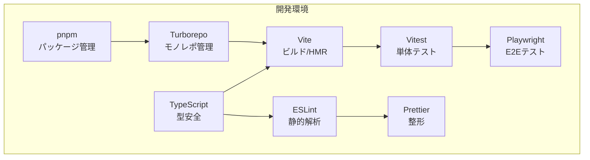

# 2. ツールセット

## 2.1 開発環境の全体方針

本プロジェクトは、**モノレポ構成**とし、複数のモジュール（core, api, worker, ui, bff, cors-proxy, app、および拡張モジュール群）を一元的に管理します。  
依存関係の整合性を保ち、ビルド・テスト・デプロイの効率化を目的として、パッケージマネージャには **pnpm** を採用し、ビルドオーケストレーションには **Turborepo** を利用します。

全モジュール共通で **TypeScript** による型安全な実装を行い、コード品質維持のための Lint / Format / Test / E2E 環境を統一します。

## 2.2 ツールセット一覧

| ツール | 用途 | 補足 |
|--------|------|------|
| **pnpm** | パッケージ管理 | 高速インストール・依存の重複排除 |
| **Turborepo** | モノレポ管理 | ビルド/テストのキャッシュ・並列化・依存解決 |
| **TypeScript** | 型安全な実装 | any禁止、strictモード必須 |
| **ESLint** | 静的解析 | Airbnbベース＋プロジェクト固有ルール |
| **Prettier** | コード整形 | ESLint統合、CIで整形チェック |
| **Vite** | フロントエンドビルド | 高速HMR、React/TypeScript対応 |
| **Vitest** | 単体テスト | Jest互換API、Vite統合 |
| **Playwright** | E2Eテスト | UI操作の自動化・クロスブラウザ検証 |

## 2.3 各ツールの役割と設定方針

### 2.3.1 pnpm
- モノレポルートに `pnpm-workspace.yaml` を配置
- 全モジュールの依存は極力ルートで一元管理し、モジュール固有依存はモジュール直下の `package.json` に記載
- `pnpm install` は常に `--frozen-lockfile` を推奨（CI/CD 一貫性確保）

### 2.3.2 Turborepo
- 各モジュールは `packages/` または `apps/` ディレクトリ配下に配置
- `turbo.json` にてビルドパイプラインを定義
    - 例：`build` → `test` → `lint`
- キャッシュを活用し、未変更モジュールの再ビルドをスキップ

### 2.3.3 TypeScript
- 全モジュールで `tsconfig.json` を共通化（ルートに `tsconfig.base.json`）
- `strict: true`、`noImplicitAny: true`、`exactOptionalPropertyTypes: true` を必須
- 型定義は `core` モジュールに集約し、他モジュールから参照

### 2.3.4 ESLint
- 設定は `eslint-config-project` としてモノレポ内に定義し共有
- 主なルール：
    - `camelCase` 命名必須
    - `any` 使用禁止
    - `max-lines` による 1ファイル 500行制限
    - import順序の自動整列
- CIで `pnpm lint` を実行し、警告を残さない運用

### 2.3.5 Prettier
- ルートに `.prettierrc` を配置し ESLint と統合
- 改行コードは `LF` 固定
- インデントはスペース2

### 2.3.6 Vite
- UIモジュール用ビルドに採用
- HMRを有効化し、開発効率を向上
- TypeScript + React + MUI の構成に最適化
- 本番ビルドではコードスプリッティングを利用

### 2.3.7 Vitest
- 単体テストはUI層・Worker層・coreモジュールを対象
- モジュール直下に `__tests__` ディレクトリを配置
- 100%カバレッジは必須ではないが、重要モジュールは80%以上を推奨

### 2.3.8 Playwright
- E2Eテストでアプリ全体の動作確認を行う
- シナリオ例：
    - ツリーノードの作成・編集・削除
    - Undo/Redo動作確認
    - データ購読と差分反映
- CI/CDでクロスブラウザ（Chromium, Firefox, WebKit）検証

## 2.4 CI/CD連携方針
- GitHub Actions を利用
- プルリクエスト時に以下を実行：
    1. `pnpm install --frozen-lockfile`
    2. `pnpm lint`
    3. `pnpm build`
    4. `pnpm test`
    5. `pnpm e2e`（E2Eテスト）

---

## 2.5 ツールセット構成図



## 2.6 Turborepo を使った開発運用（推奨ワークフロー）

### 2.6.1 開発環境の起動方法（2024年12月更新）

本プロジェクトでは、**Viteのエイリアス設定を使用せず、Turbo watchモードを活用**する方針を採用しています。これにより、設定の簡素化と型安全性の向上を実現しています。

#### 推奨される開発環境の起動方法

**オプション1 - 単一コマンドですべて起動（最も簡単）**：
```bash
# これ1つですべてのパッケージのwatchビルドとVite devサーバーが起動
turbo run dev --parallel
```

このコマンドで以下が自動的に起動します：
- すべてのライブラリパッケージの watch ビルド（`tsup --watch` または `tsc --watch`）
- `packages/30-app` の Vite dev サーバー（ポート4200）
- HMR（Hot Module Replacement）による即座の変更反映

**オプション2 - ターミナルを分けて起動（ログが見やすい）**：
```bash
# Terminal 1: ライブラリのwatchビルド
turbo run dev --parallel --filter='!@hierarchidb/30-_app'

# Terminal 2: アプリケーションの起動
cd packages/30-_app && pnpm dev
```

**オプション3 - 最小限のパッケージのみ（起動が高速）**：
```bash
# 30-appとその依存関係のみをwatch
turbo run dev --filter=@hierarchidb/30-_app
```

### 2.6.2 なぜこの方法なのか

#### 動作原理
1. 各パッケージの `package.json` に `dev` スクリプトが定義されている
2. ライブラリパッケージ：`"dev": "tsup --watch"` でソースコードの変更を監視してビルド
3. アプリケーションパッケージ（30-app）：`"dev": "react-router dev"` でVite devサーバーを起動
4. Turborepoがこれらを並列実行し、依存関係を自動的に管理

#### Viteエイリアスを使わない理由
従来、多くのモノレポプロジェクトではViteの`resolve.alias`設定を使用して、開発時にパッケージのソースコードを直接参照していました。しかし、この方法には以下の問題がありました：

1. **メンテナンスの負担**：新しいパッケージを追加するたびに`vite.config.ts`の更新が必要
2. **型安全性の低下**：ソースコードを直接参照すると、TypeScriptの型チェックが不完全になる場合がある
3. **設定の複雑化**：開発環境と本番環境で異なるパスを管理する必要がある

#### Turbo watchモードの利点
1. **設定不要**：`turbo run dev --parallel`だけですべてが動作
2. **型安全性の確保**：常にビルド済みの`dist`を参照するため、型チェックが確実
3. **自動的な依存管理**：Turborepoが依存グラフを理解し、必要なパッケージのみを再ビルド
4. **一貫性**：開発環境と本番環境で同じビルド成果物を使用

### 2.6.3 開発フローの例

**UIコンポーネントを修正する場合**：

1. 開発環境を起動：
   ```bash
   turbo run dev --parallel
   ```

2. `packages/10-ui-core/src/components/Button.tsx`を編集

3. 自動的に以下が実行される：
   - tsupが変更を検知して`10-ui-core`を再ビルド
   - Vite devサーバーが`10-ui-core/dist`の更新を検知
   - HMRによりブラウザが即座に更新

4. 手動操作は不要 - すべて自動！

### 2.6.4 パッケージ構成と命名規則

本プロジェクトでは、パッケージに**2桁の数字プレフィックス**を付けることで、依存関係の階層を明確にしています：

- **00-xx**: コア層（最も基礎的なパッケージ）
- **01-xx**: API層
- **02-xx**: 実装層（Worker、データ取得など）
- **10-xx**: 基本UI層
- **11-xx**: 拡張UI層
- **12-xx**: TreeConsole UI層
- **13-xx**: TreeConsole統合層
- **20-xx**: プラグイン層
- **30-xx**: アプリケーション層
- **99-xx**: バックエンドサービス層

この命名規則により、依存関係の方向性が一目で分かり、循環依存を防ぐことができます。

### 2.6.5 トラブルシューティング

**変更が反映されない場合**：
1. 該当パッケージのビルドが動作しているか確認
2. `dist`フォルダが更新されているか確認
3. 必要に応じてdevプロセスを再起動

**型エラーが発生する場合**：
1. `pnpm typecheck`で全体の型チェックを実行
2. 必要に応じて`pnpm build`で全パッケージを再ビルド

**パフォーマンスが悪い場合**：
1. 不要なパッケージのwatchを停止
2. `--filter`オプションで必要最小限のパッケージのみを起動

### 2.6.6 ベストプラクティス

1. **日常開発**：`turbo run dev --parallel`を使用して全環境を起動
2. **集中開発**：特定のパッケージに`--filter`を使用して必要最小限の環境で作業
3. **型チェック**：定期的に`pnpm typecheck`を実行して型の整合性を確認
4. **依存更新時**：`pnpm install`後、devプロセスを再起動
