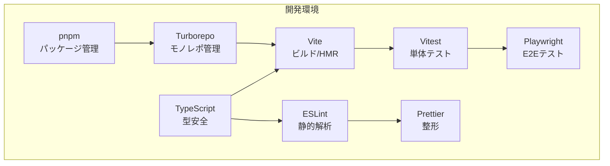

# 2. ツールセット

## 2.1 開発環境の全体方針

本プロジェクトは、**モノレポ構成**とし、複数のモジュール（core, api, worker, ui, bff, cors-proxy, app、および拡張モジュール群）を一元的に管理します。  
依存関係の整合性を保ち、ビルド・テスト・デプロイの効率化を目的として、パッケージマネージャには **pnpm** を採用し、ビルドオーケストレーションには **Turborepo** を利用します。

全モジュール共通で **TypeScript** による型安全な実装を行い、コード品質維持のための Lint / Format / Test / E2E 環境を統一します。

## 2.2 ツールセット一覧

| ツール | 用途 | 補足 |
|--------|------|------|
| **pnpm** | パッケージ管理 | 高速インストール・依存の重複排除 |
| **Turborepo** | モノレポ管理 | ビルド/テストのキャッシュ・並列化・依存解決 |
| **TypeScript** | 型安全な実装 | any禁止、strictモード必須 |
| **ESLint** | 静的解析 | Airbnbベース＋プロジェクト固有ルール |
| **Prettier** | コード整形 | ESLint統合、CIで整形チェック |
| **Vite** | フロントエンドビルド | 高速HMR、React/TypeScript対応 |
| **Vitest** | 単体テスト | Jest互換API、Vite統合 |
| **Playwright** | E2Eテスト | UI操作の自動化・クロスブラウザ検証 |

## 2.3 各ツールの役割と設定方針

### 2.3.1 pnpm
- モノレポルートに `pnpm-workspace.yaml` を配置
- 全モジュールの依存は極力ルートで一元管理し、モジュール固有依存はモジュール直下の `package.json` に記載
- `pnpm install` は常に `--frozen-lockfile` を推奨（CI/CD 一貫性確保）

### 2.3.2 Turborepo
- 各モジュールは `packages/` または `apps/` ディレクトリ配下に配置
- `turbo.json` にてビルドパイプラインを定義
    - 例：`build` → `test` → `lint`
- キャッシュを活用し、未変更モジュールの再ビルドをスキップ

### 2.3.3 TypeScript
- 全モジュールで `tsconfig.json` を共通化（ルートに `tsconfig.base.json`）
- `strict: true`、`noImplicitAny: true`、`exactOptionalPropertyTypes: true` を必須
- 型定義は `core` モジュールに集約し、他モジュールから参照

### 2.3.4 ESLint
- 設定は `eslint-config-project` としてモノレポ内に定義し共有
- 主なルール：
    - `camelCase` 命名必須
    - `any` 使用禁止
    - `max-lines` による 1ファイル 500行制限
    - import順序の自動整列
- CIで `pnpm lint` を実行し、警告を残さない運用

### 2.3.5 Prettier
- ルートに `.prettierrc` を配置し ESLint と統合
- 改行コードは `LF` 固定
- インデントはスペース2

### 2.3.6 Vite
- UIモジュール用ビルドに採用
- HMRを有効化し、開発効率を向上
- TypeScript + React + MUI の構成に最適化
- 本番ビルドではコードスプリッティングを利用

### 2.3.7 Vitest
- 単体テストはUI層・Worker層・coreモジュールを対象
- モジュール直下に `__tests__` ディレクトリを配置
- 100%カバレッジは必須ではないが、重要モジュールは80%以上を推奨

### 2.3.8 Playwright
- E2Eテストでアプリ全体の動作確認を行う
- シナリオ例：
    - ツリーノードの作成・編集・削除
    - Undo/Redo動作確認
    - データ購読と差分反映
- CI/CDでクロスブラウザ（Chromium, Firefox, WebKit）検証

## 2.4 CI/CD連携方針
- GitHub Actions を利用
- プルリクエスト時に以下を実行：
    1. `pnpm install --frozen-lockfile`
    2. `pnpm lint`
    3. `pnpm build`
    4. `pnpm test`
    5. `pnpm e2e`（E2Eテスト）

---

## 2.5 ツールセット構成図

