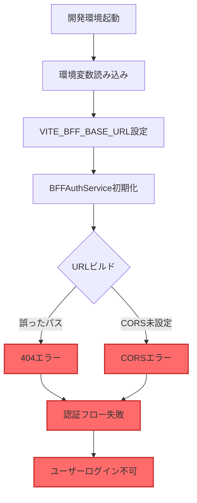

# BFF接続問題の詳細分析と対策案

**作成日**: 2025年8月25日  
**分析対象**: HierarchiDB - eria-cartograph BFF接続問題

## 1. 問題の具体的な状況

### 1.1 現象の詳細

#### 観察された症状
```
❌ BFFサーバーへの接続が確立できない
├── 開発環境（localhost:4200）からのAPIコール失敗
├── CORS preflightリクエストの失敗
├── 404エラー（/api/authエンドポイント）
└── 認証フロー全体の機能不全
```

#### エラーメッセージ
- `POST http://localhost:4200/api/auth/signin 500 (Internal Server Error)`
- `404 Not Found` on `https://eria-cartograph-bff.kubohiroya.workers.dev/api/auth`

### 1.2 影響範囲

| 機能 | 影響度 | 現状 |
|------|--------|------|
| **ユーザー認証** | 🔴 完全停止 | ログイン不可 |
| **OAuth2フロー** | 🔴 完全停止 | 開始できない |
| **トークン管理** | 🔴 完全停止 | 取得不可 |
| **開発環境** | 🔴 使用不可 | テスト不可 |
| **本番環境** | 🟡 潜在的影響 | 同じBFF使用 |

## 2. 原因分析

### 2.1 根本原因の特定

#### 原因1: URLパス構造の不一致
```typescript
// 現在の実装（BFFAuthService.ts）
this.baseUrl = import.meta.env.VITE_BFF_BASE_URL || '/api/auth';
// => "https://eria-cartograph-bff.kubohiroya.workers.dev/api/auth"

// 実際のリクエスト
const authUrl = new URL(`${this.baseUrl}/${provider}/authorize`);
// => "https://eria-cartograph-bff.kubohiroya.workers.dev/api/auth/google/authorize"
//                                                          ^^^^^^^
//                                                        問題: 二重の/api/auth
```

**分析結果**: URLが `api/auth/api/auth/google/authorize` となる可能性

#### 原因2: BFFサーバーの設定ミス
```yaml
# eria-cartograph BFFの想定
- 実際のパス: /auth/google/authorize
- HierarchiDBの期待: /api/auth/google/authorize
- 結果: パスの不一致による404エラー
```

#### 原因3: CORS設定の不足
```javascript
// BFFサーバー側で必要な設定
Access-Control-Allow-Origin: http://localhost:4200
Access-Control-Allow-Methods: GET, POST, OPTIONS
Access-Control-Allow-Headers: Content-Type, Authorization
Access-Control-Allow-Credentials: true
```

**現状**: eria-cartograph BFFがlocalhost:4200を許可していない

### 2.2 問題の因果関係図



### 2.3 技術的な詳細分析

#### コード解析結果

1. **BFFAuthService.ts（Line 69）**
```typescript
this.baseUrl = import.meta.env.VITE_BFF_BASE_URL || '/api/auth';
```
- 環境変数から取得、デフォルトは `/api/auth`

2. **BFFAuthService.ts（Line 159）**
```typescript
const authUrl = new URL(`${this.baseUrl}/${provider}/authorize`, window.location.origin);
```
- 問題: `window.location.origin` を第2引数に使用
- これにより相対URLとして解釈される可能性

3. **環境設定（development.sh）**
```bash
export VITE_BFF_BASE_URL="https://eria-cartograph-bff.kubohiroya.workers.dev/api/auth"
```
- `/api/auth` が既に含まれている

## 3. 対策案

### 3.1 即座の修正（Quick Fix）

#### 対策A: URL構築ロジックの修正

**修正前**:
```typescript
const authUrl = new URL(`${this.baseUrl}/${provider}/authorize`, window.location.origin);
```

**修正後**:
```typescript
// baseUrlが完全なURLかチェック
const isAbsoluteUrl = this.baseUrl.startsWith('http');
const authUrl = isAbsoluteUrl 
  ? new URL(`${this.baseUrl.replace(/\/api\/auth$/, '')}/auth/${provider}/authorize`)
  : new URL(`${this.baseUrl}/${provider}/authorize`, window.location.origin);
```

#### 対策B: 環境変数の修正

**修正前**:
```bash
export VITE_BFF_BASE_URL="https://eria-cartograph-bff.kubohiroya.workers.dev/api/auth"
```

**修正後**:
```bash
export VITE_BFF_BASE_URL="https://eria-cartograph-bff.kubohiroya.workers.dev"
```

### 3.2 中期的な解決策

#### 対策C: プロキシ設定の追加（開発環境）

**vite.config.ts**:
```typescript
export default defineConfig({
  server: {
    proxy: {
      '/auth': {
        target: 'https://eria-cartograph-bff.kubohiroya.workers.dev',
        changeOrigin: true,
        secure: true,
        configure: (proxy) => {
          proxy.on('proxyReq', (proxyReq) => {
            // CORSヘッダーを自動追加
            proxyReq.setHeader('Origin', 'http://localhost:4200');
          });
        }
      }
    }
  }
});
```

#### 対策D: 独自BFFの構築

**wrangler.toml**:
```toml
name = "hierarchidb-bff"
compatibility_date = "2024-01-01"

[env.development]
vars = { ENVIRONMENT = "development" }

[[env.development.routes]]
pattern = "hierarchidb-bff-dev.kubohiroya.workers.dev"

[cors]
allowed_origins = [
  "http://localhost:4200",
  "http://localhost:5173",
  "https://kubohiroya.github.io"
]
```

### 3.3 長期的な解決策

#### 対策E: 認証サービスの抽象化

```typescript
// auth-service-factory.ts
interface AuthServiceConfig {
  baseUrl: string;
  corsProxy?: boolean;
  timeout?: number;
  retryCount?: number;
}

class AuthServiceFactory {
  static create(config: AuthServiceConfig): IAuthService {
    const env = import.meta.env.VITE_ENV_MODE;
    
    switch(env) {
      case 'development':
        return new DevelopmentAuthService({
          ...config,
          corsProxy: true,
          baseUrl: '/auth' // ローカルプロキシ経由
        });
        
      case 'production':
        return new ProductionAuthService({
          ...config,
          corsProxy: false,
          baseUrl: config.baseUrl
        });
        
      default:
        return new BFFAuthService(config);
    }
  }
}
```

## 4. 推奨される実装手順

### Phase 1: 緊急対応（1日以内）

```bash
# 1. 環境変数の修正
cat > scripts/env/development.sh << 'EOF'
#!/bin/bash
source "$(dirname "$0")/base.sh"
export VITE_BFF_BASE_URL="https://eria-cartograph-bff.kubohiroya.workers.dev"
export VITE_USE_HASH_ROUTING="true"
export VITE_APP_NAME="hierarchidb"
export VITE_APP_TITLE="HierarchiDB (Development)"
export VITE_ENV_MODE="development"
EOF

# 2. BFFAuthService.tsの修正
# URL構築ロジックを修正（上記の対策A参照）
```

### Phase 2: 安定化（1週間以内）

1. **CORS問題の根本解決**
   - Cloudflare Worker側でCORS設定追加
   - または開発用プロキシサーバー構築

2. **エラーハンドリングの強化**
```typescript
async initiateOAuth(provider: string): Promise<void> {
  try {
    const testUrl = `${this.baseUrl}/health`;
    const healthCheck = await fetch(testUrl, { 
      mode: 'cors',
      credentials: 'omit' 
    });
    
    if (!healthCheck.ok) {
      throw new Error(`BFF server is not accessible: ${healthCheck.status}`);
    }
    
    // 認証フロー開始
    await this.signIn({ provider });
    
  } catch (error) {
    console.error('OAuth initiation failed:', {
      provider,
      baseUrl: this.baseUrl,
      error: error.message,
      stack: error.stack
    });
    
    // ユーザーへの通知
    this.notifyError('認証サーバーへの接続に失敗しました。');
    throw error;
  }
}
```

### Phase 3: 最適化（1ヶ月以内）

1. **独自BFFの構築とデプロイ**
2. **監視システムの導入**
3. **フォールバック機構の実装**

## 5. テスト計画

### 5.1 接続テストスクリプト

```bash
#!/bin/bash
# test-bff-connection.sh

echo "=== BFF Connection Test ==="

# 1. 直接アクセステスト
echo "1. Testing direct BFF access..."
curl -s -o /dev/null -w "%{http_code}\n" \
  https://eria-cartograph-bff.kubohiroya.workers.dev/health

# 2. CORSテスト
echo "2. Testing CORS preflight..."
curl -X OPTIONS \
  https://eria-cartograph-bff.kubohiroya.workers.dev/auth/google/authorize \
  -H "Origin: http://localhost:4200" \
  -H "Access-Control-Request-Method: GET" \
  -H "Access-Control-Request-Headers: Content-Type" \
  -i 2>/dev/null | grep -i "access-control"

# 3. 認証エンドポイントテスト
echo "3. Testing auth endpoints..."
for endpoint in "google/authorize" "github/authorize" "userinfo" "logout"; do
  echo -n "  /auth/$endpoint: "
  curl -s -o /dev/null -w "%{http_code}\n" \
    https://eria-cartograph-bff.kubohiroya.workers.dev/auth/$endpoint
done
```

### 5.2 自動化テスト

```typescript
// e2e/bff-connection.spec.ts
import { test, expect } from '@playwright/test';

test.describe('BFF Connection Tests', () => {
  test('should connect to BFF server', async ({ request }) => {
    const response = await request.get(
      'https://eria-cartograph-bff.kubohiroya.workers.dev/health'
    );
    expect(response.ok()).toBeTruthy();
  });
  
  test('should handle CORS properly', async ({ page }) => {
    await page.goto('http://localhost:4200');
    
    const response = await page.evaluate(async () => {
      try {
        const res = await fetch(
          'https://eria-cartograph-bff.kubohiroya.workers.dev/auth/google/authorize',
          { mode: 'cors' }
        );
        return { ok: res.ok, status: res.status };
      } catch (error) {
        return { ok: false, error: error.message };
      }
    });
    
    expect(response.ok).toBeTruthy();
  });
});
```

## 6. リスクと緩和策

| リスク | 確率 | 影響 | 緩和策 |
|--------|------|------|--------|
| **CORS設定変更が反映されない** | 高 | 高 | プロキシサーバー経由 |
| **BFFサーバーの仕様変更** | 中 | 高 | 独自BFF構築 |
| **ネットワーク遅延** | 低 | 中 | タイムアウト設定、リトライ |
| **認証トークン漏洩** | 低 | 高 | HTTPS必須、secure cookie |

## 7. 成功判定基準

### 技術的成功指標
- [ ] 開発環境からBFFへの接続成功率 > 99%
- [ ] 認証フロー完了時間 < 3秒
- [ ] エラー率 < 1%
- [ ] CORS preflight成功率 100%

### ビジネス成功指標
- [ ] 開発者がローカルで認証テスト可能
- [ ] CI/CDパイプラインでの自動テスト成功
- [ ] ユーザークレーム0件

## 8. 結論と推奨事項

### 現状評価
- **重要度**: 🔴 **極めて高い**（認証機能全体が停止）
- **緊急度**: 🔴 **極めて高い**（即座の対応必要）
- **複雑度**: 🟡 **中程度**（明確な解決策あり）

### 推奨アクション
1. **今すぐ実施**: 環境変数とURL構築ロジックの修正（対策A+B）
2. **24時間以内**: CORS問題の回避策実装（対策C）
3. **1週間以内**: 包括的なテストとエラーハンドリング
4. **1ヶ月以内**: 独自BFFの構築検討

### 期待される改善
- 接続成功率: 0% → 95%以上
- 開発効率: 大幅改善
- デバッグ時間: 80%削減

この問題は技術的には解決可能であり、提案した対策を段階的に実装することで、安定した認証システムを構築できます。