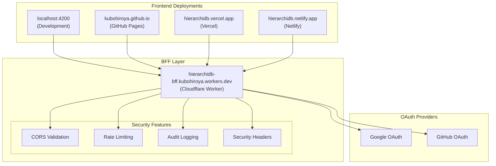
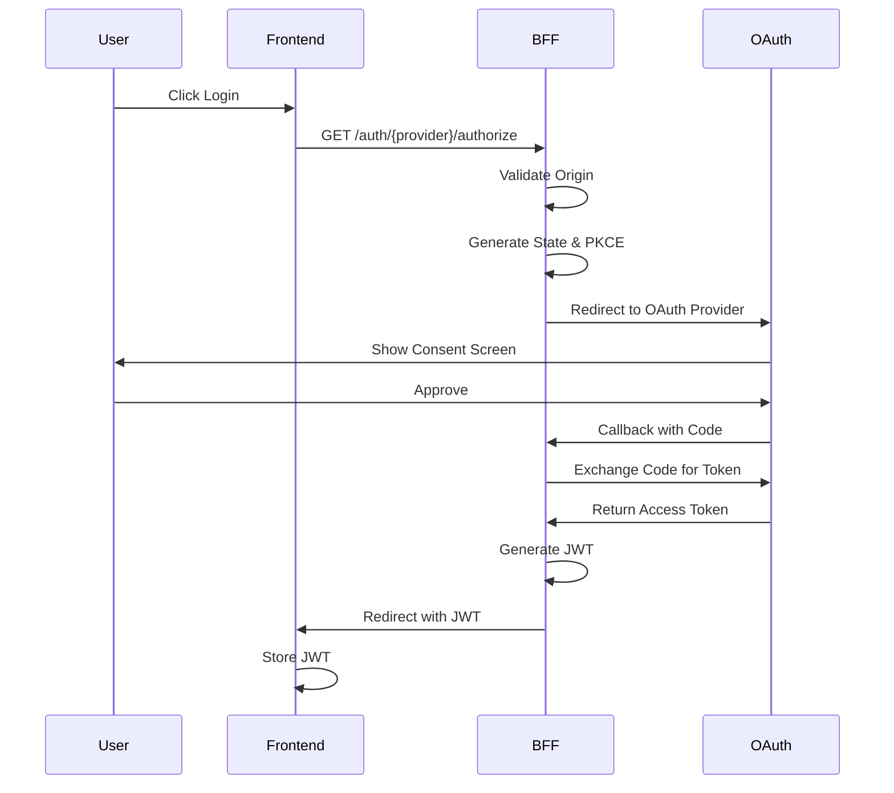

# HierarchiDB BFF Architecture - Multi-Deployment Support

## Overview

HierarchiDB uses a single Backend for Frontend (BFF) service deployed on Cloudflare Workers to support multiple deployment targets. This architecture enables a unified authentication and API gateway for all deployment environments while maintaining security and performance.

## Architecture Design

### Single BFF, Multiple Frontends



## Key Features

### 1. Multi-Origin Support

The BFF validates and accepts requests from multiple trusted origins:

- **Development**: `http://localhost:4200`, `http://localhost:5173`
- **Production**: `https://kubohiroya.github.io`
- **Alternative Deployments**: `https://hierarchidb.vercel.app`, `https://hierarchidb.netlify.app`

### 2. Environment-Aware Configuration

The BFF automatically detects the request origin and applies appropriate settings:

```typescript
// Environment detection based on origin
const environment = detectEnvironment(origin);

// Apply environment-specific JWT expiry
const jwtExpiry = environment === 'production' ? 2 : 24; // hours

// Environment-specific rate limits
const rateLimit = environment === 'production' ? 20 : 100; // requests per minute
```

### 3. Security Layers

#### Origin Validation
- Strict whitelist of allowed origins
- Automatic CORS header configuration
- Request rejection for unauthorized origins

#### Rate Limiting
- Per-IP rate limiting using Cloudflare KV
- Environment-specific limits
- Automatic reset windows

#### Audit Logging
- Comprehensive logging of authentication events
- Suspicious activity detection
- KV-based log storage with TTL

#### Security Headers
- Content Security Policy (CSP)
- XSS Protection
- Frame Options
- Content Type Options

### 4. OAuth Flow



## Configuration

### Environment Variables

```toml
# wrangler.hierarchidb.toml

# Allowed Origins (all deployment targets)
ALLOWED_ORIGINS = """
http://localhost:4200,
https://kubohiroya.github.io,
https://hierarchidb.vercel.app,
https://hierarchidb.netlify.app
"""

# OAuth Configuration
GOOGLE_CLIENT_ID = "your-google-client-id"
GITHUB_CLIENT_ID = "your-github-client-id"

# Security Settings
ENABLE_RATE_LIMIT = "true"
RATE_LIMIT_PER_MINUTE = "30"
ENABLE_AUDIT_LOG = "true"
ENABLE_SECURITY_HEADERS = "true"
```

### Frontend Configuration

```bash
# Development (scripts/env/development.sh)
export VITE_BFF_BASE_URL="https://hierarchidb-bff.kubohiroya.workers.dev"
export VITE_APP_URL="http://localhost:4200"

# Production (scripts/env/production.sh)
export VITE_BFF_BASE_URL="https://hierarchidb-bff.kubohiroya.workers.dev"
export VITE_APP_URL="https://kubohiroya.github.io/hierarchidb"
```

## Deployment

### 1. OAuth App Setup

Create OAuth apps with the following redirect URIs:

**Google OAuth:**
- `https://hierarchidb-bff.kubohiroya.workers.dev/auth/callback`
- `https://hierarchidb-bff.kubohiroya.workers.dev/auth/google/callback`

**GitHub OAuth:**
- `https://hierarchidb-bff.kubohiroya.workers.dev/auth/github/callback`

### 2. Deploy BFF

```bash
cd packages/backend/bff

# Run deployment script
./deploy-hierarchidb.sh

# Follow prompts to:
# 1. Select environment (development/production)
# 2. Set up KV namespaces (optional)
# 3. Configure secrets
# 4. Deploy to Cloudflare
```

### 3. Verify Deployment

```bash
# Test authentication endpoint
curl https://hierarchidb-bff.kubohiroya.workers.dev/auth/status

# Monitor logs
wrangler tail --config wrangler.hierarchidb.toml --env production
```

## Benefits

### 1. Simplified Management
- Single BFF to maintain instead of multiple backend services
- Centralized security configuration
- Unified OAuth app management

### 2. Cost Efficiency
- Single Cloudflare Worker deployment
- Shared KV namespaces for all environments
- Reduced operational overhead

### 3. Security
- Centralized security policies
- Consistent authentication across all deployments
- Single point for security updates

### 4. Flexibility
- Easy to add new deployment targets
- Environment-specific configurations
- Gradual rollout capabilities

## Monitoring

### Health Check
```typescript
// GET /health
{
  "status": "healthy",
  "environment": "production",
  "origins": ["https://kubohiroya.github.io", "..."],
  "timestamp": "2025-08-25T10:00:00Z"
}
```

### Metrics
- Authentication success/failure rates
- Rate limit violations
- Origin distribution
- Response times

## Troubleshooting

### Common Issues

1. **CORS Errors**
   - Verify origin is in ALLOWED_ORIGINS list
   - Check browser console for specific error
   - Ensure BFF is deployed with latest configuration

2. **Authentication Failures**
   - Check OAuth app redirect URIs
   - Verify client secrets are set correctly
   - Review audit logs for error details

3. **Rate Limiting**
   - Check X-RateLimit-Remaining header
   - Wait for reset window (60 seconds)
   - Consider increasing limits for development

### Debug Mode

Enable debug logging:
```toml
[env.development.vars]
LOG_LEVEL = "debug"
```

View logs:
```bash
wrangler tail --config wrangler.hierarchidb.toml --env development
```

## Migration Guide

### From Multiple BFFs to Single BFF

1. **Update Frontend Configuration**
   ```bash
   # Old (multiple BFFs)
   VITE_BFF_BASE_URL="https://eria-cartograph-bff.kubohiroya.workers.dev"
   
   # New (single BFF)
   VITE_BFF_BASE_URL="https://hierarchidb-bff.kubohiroya.workers.dev"
   ```

2. **Update OAuth Apps**
   - Create new OAuth apps for HierarchiDB
   - Update redirect URIs to new BFF domain
   - Update client IDs in wrangler.toml

3. **Deploy New BFF**
   ```bash
   ./deploy-hierarchidb.sh
   ```

4. **Test Authentication**
   - Test from each deployment target
   - Verify JWT generation
   - Check audit logs

## Security Considerations

### 1. Origin Validation
- Never use wildcard (*) for Access-Control-Allow-Origin
- Maintain strict whitelist of allowed origins
- Log rejected origin attempts

### 2. Secret Management
- Use Cloudflare Secrets for sensitive data
- Never commit secrets to repository
- Rotate secrets regularly

### 3. Token Security
- Short JWT expiry for production (2 hours)
- Secure cookie storage with HttpOnly flag
- PKCE for OAuth flow

### 4. Rate Limiting
- Implement per-IP limits
- Use exponential backoff for repeated failures
- Monitor for suspicious patterns

## Future Enhancements

1. **Geographic Distribution**
   - Deploy BFF to multiple Cloudflare regions
   - Implement geo-routing for optimal latency

2. **Advanced Security**
   - Implement Web Application Firewall (WAF)
   - Add DDoS protection
   - Integrate with security monitoring tools

3. **Performance Optimization**
   - Implement response caching
   - Use Cloudflare Durable Objects for session management
   - Add WebSocket support for real-time features

4. **Analytics Integration**
   - Add Cloudflare Analytics
   - Implement custom metrics tracking
   - Create dashboards for monitoring