# 第1部 エグゼクティブサマリー

## 1章 プロジェクト概要 ⭐️⭐️⭐️⭐️

本章では、HierarchiDBの基本的な特徴と技術的位置づけを説明します。システムが解決する問題領域から、技術スタック、主要な設計思想まで、プロジェクト全体の概観を提示します。また、類似システムとの比較において、HierarchiDBの技術的優位性を明確化します。

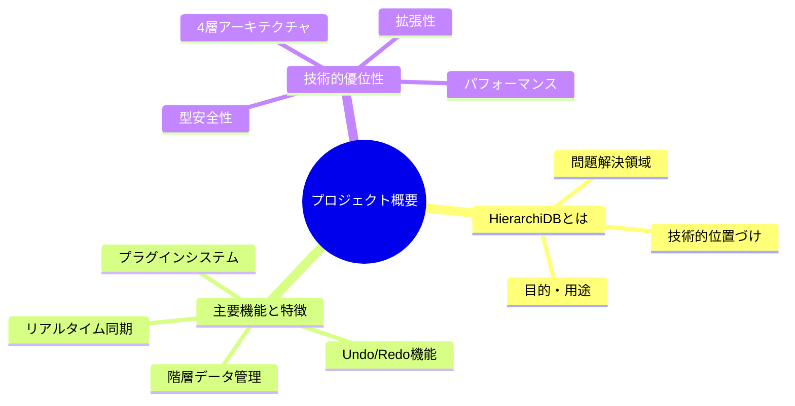
```mermaid
mindmap
  root((プロジェクト概要))
    HierarchiDBとは
      目的・用途
      問題解決領域
      技術的位置づけ
    主要機能と特徴
      階層データ管理
      プラグインシステム
      リアルタイム同期
      Undo/Redo機能
    技術的優位性
      4層アーキテクチャ
      型安全性
      パフォーマンス
      拡張性
```

### 1.1 HierarchiDBとは ⭐️⭐️⭐️⭐️⭐️

#### 1.1.1 システムの目的と用途

HierarchiDBは、ブラウザ環境向けの高性能階層データ管理フレームワークです。GISアプリケーション、プロジェクト管理ツール、データカタログなど、階層構造を持つデータの管理が必要なWebアプリケーションに最適化されています。

| 用途カテゴリ | 具体的なユースケース | 提供価値 |
|------------|-------------------|---------|
| GISアプリケーション | 地図レイヤー管理、空間データ階層 | 大量地理データの効率的管理 |
| プロジェクト管理 | タスク階層、リソース分類 | 複雑な構造の可視化・操作 |
| データカタログ | メタデータ分類、データ系譜 | 企業データ資産の体系化 |
| コンテンツ管理 | ファイル階層、カテゴリ分類 | 直感的なコンテンツ操作 |

#### 1.1.2 解決する技術的課題

従来のWebアプリケーションにおける階層データ管理の課題を以下のように解決します：

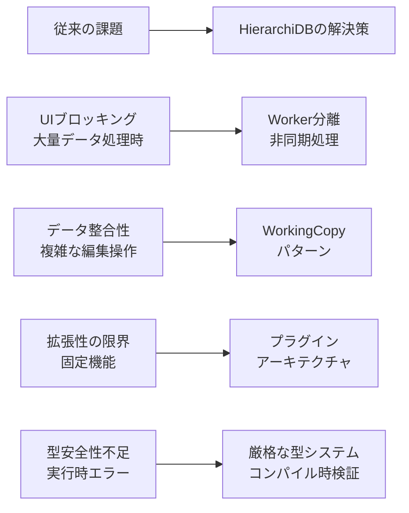
```mermaid
graph LR
    A[従来の課題] --> B[HierarchiDBの解決策]
    
    A1[UIブロッキング<br/>大量データ処理時] --> B1[Worker分離<br/>非同期処理]
    A2[データ整合性<br/>複雑な編集操作] --> B2[WorkingCopy<br/>パターン]
    A3[拡張性の限界<br/>固定機能] --> B3[プラグイン<br/>アーキテクチャ]
    A4[型安全性不足<br/>実行時エラー] --> B4[厳格な型システム<br/>コンパイル時検証]
```

#### 1.1.3 技術的位置づけ

HierarchiDBは、モダンWebアプリケーション開発における以下の技術領域に位置します：

- **データ管理**: IndexedDB上の高レベル抽象化層
- **状態管理**: React Ecosystem内の専門化されたソリューション
- **アーキテクチャ**: Clean Architecture的な層分離
- **型システム**: TypeScriptの高度活用による安全性確保

### 1.2 主要機能と特徴 ⭐️⭐️⭐️⭐️

#### 1.2.1 コア機能体系

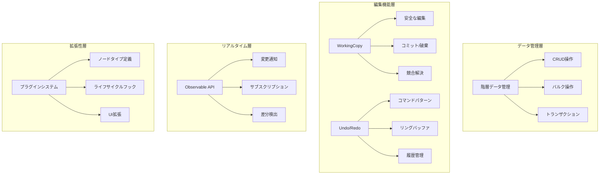
```mermaid
graph TB
    subgraph "データ管理層"
        A[階層データ管理] --> A1[CRUD操作]
        A --> A2[バルク操作]
        A --> A3[トランザクション]
    end
    
    subgraph "編集機能層"
        B[WorkingCopy] --> B1[安全な編集]
        B --> B2[コミット/破棄]
        B --> B3[競合解決]
        
        C[Undo/Redo] --> C1[コマンドパターン]
        C --> C2[リングバッファ]
        C --> C3[履歴管理]
    end
    
    subgraph "リアルタイム層"
        D[Observable API] --> D1[変更通知]
        D --> D2[サブスクリプション]
        D --> D3[差分検出]
    end
    
    subgraph "拡張性層"
        E[プラグインシステム] --> E1[ノードタイプ定義]
        E --> E2[ライフサイクルフック]
        E --> E3[UI拡張]
    end
```

#### 1.2.2 パフォーマンス特性

| 指標 | 仕様値 | 備考 |
|------|--------|------|
| 最大ノード数 | 100万ノード | メモリ4GB環境 |
| UI応答性 | <100ms | 一般的な操作 |
| 初期読み込み | <2秒 | 10万ノード |
| メモリ使用量 | <500MB | 10万ノード+UI |
| データ永続化 | 100% | IndexedDB活用 |

#### 1.2.3 拡張性・保守性

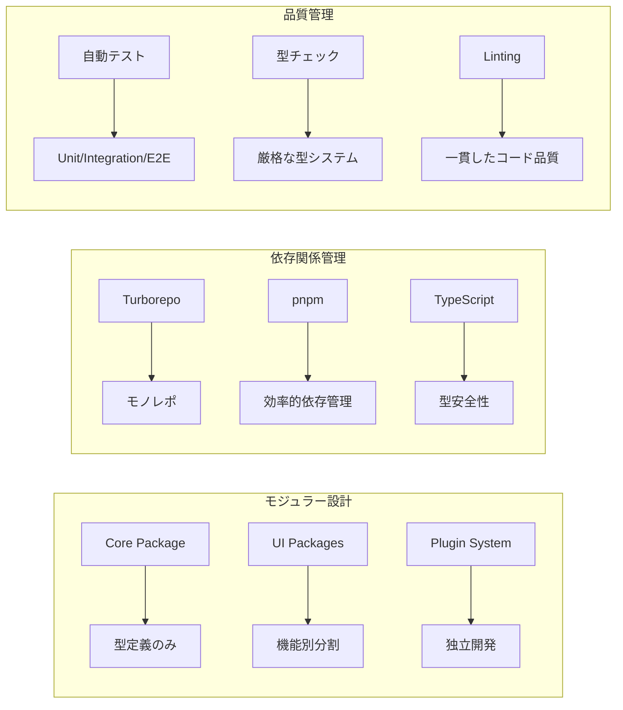
```mermaid
graph LR
    subgraph "モジュラー設計"
        A[Core Package] --> A1[型定義のみ]
        B[UI Packages] --> B1[機能別分割]
        C[Plugin System] --> C1[独立開発]
    end
    
    subgraph "依存関係管理"
        D[Turborepo] --> D1[モノレポ]
        E[pnpm] --> E1[効率的依存管理]
        F[TypeScript] --> F1[型安全性]
    end
    
    subgraph "品質管理"
        G[自動テスト] --> G1[Unit/Integration/E2E]
        H[型チェック] --> H1[厳格な型システム]
        I[Linting] --> I1[一貫したコード品質]
    end
```

### 1.3 技術的優位性 ⭐️⭐️⭐️

#### 1.3.1 アーキテクチャ上の優位性

HierarchiDBは、従来のクライアントサイドアプリケーションとは異なる4層アーキテクチャを採用しています：

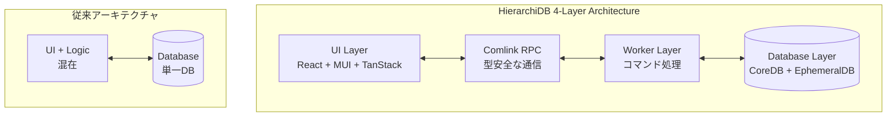
```mermaid
graph TB
    subgraph "HierarchiDB 4-Layer Architecture"
        UI[UI Layer<br/>React + MUI + TanStack]
        RPC[Comlink RPC<br/>型安全な通信]
        Worker[Worker Layer<br/>コマンド処理]
        DB[(Database Layer<br/>CoreDB + EphemeralDB)]
        
        UI <--> RPC
        RPC <--> Worker  
        Worker <--> DB
    end
    
    subgraph "従来アーキテクチャ"
        TradUI[UI + Logic<br/>混在]
        TradDB[(Database<br/>単一DB)]
        
        TradUI <--> TradDB
    end
```

**利点の比較**:

| 項目 | 従来アーキテクチャ | HierarchiDB |
|------|------------------|------------|
| UI応答性 | データ処理でブロック | 常時応答性維持 |
| データ整合性 | 複雑な状態管理 | トランザクション保証 |
| テスト容易性 | UI+Logic混在 | 層別独立テスト |
| 拡張性 | 機能追加でコード増大 | プラグイン方式 |

#### 1.3.2 型安全性における優位性

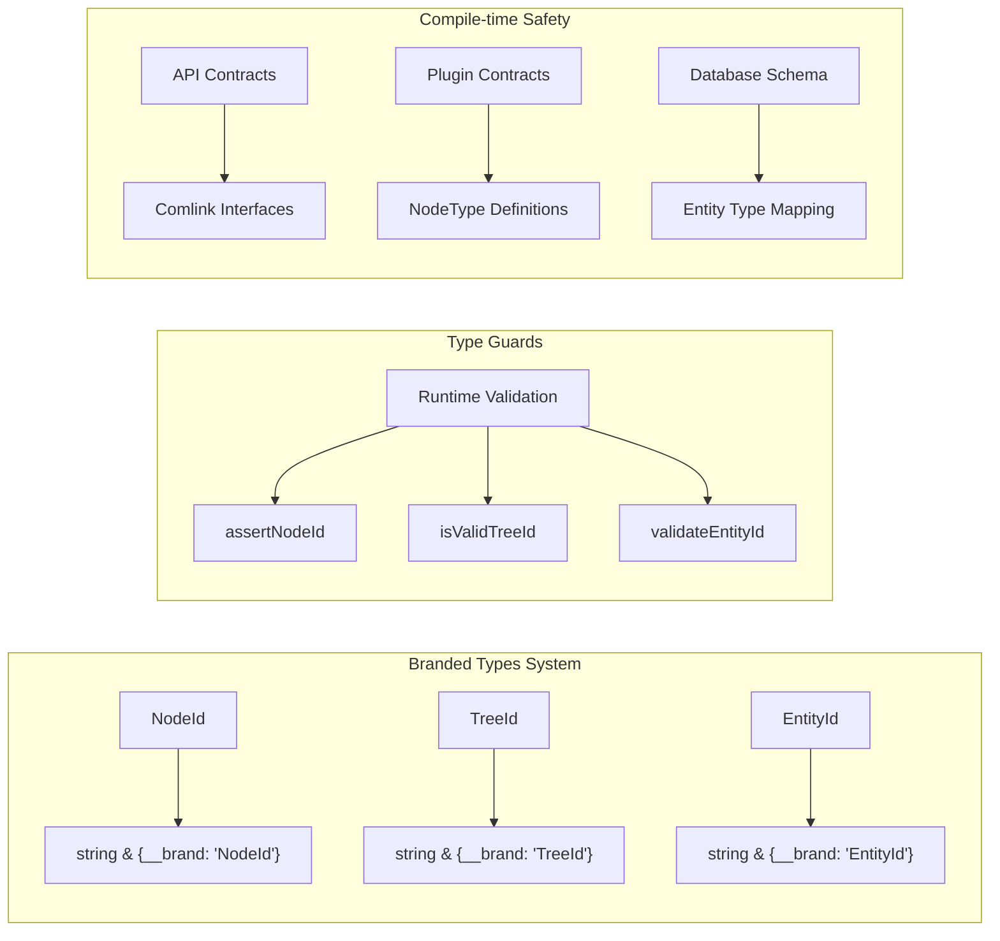
```mermaid
graph LR
    subgraph "Branded Types System"
        A[NodeId] --> A1["string & {__brand: 'NodeId'}"]
        B[TreeId] --> B1["string & {__brand: 'TreeId'}"]
        C[EntityId] --> C1["string & {__brand: 'EntityId'}"]
    end
    
    subgraph "Type Guards"
        D[Runtime Validation] --> D1[assertNodeId]
        D --> D2[isValidTreeId]
        D --> D3[validateEntityId]
    end
    
    subgraph "Compile-time Safety"
        E[API Contracts] --> E1[Comlink Interfaces]
        F[Plugin Contracts] --> F1[NodeType Definitions]
        G[Database Schema] --> G1[Entity Type Mapping]
    end
```

#### 1.3.3 性能・スケーラビリティ優位性

**メモリ効率性**:
- Working Copy パターンによるメモリ使用量最適化
- Ring Buffer による Undo/Redo 履歴サイズ制限
- Virtual Scrolling による大量データ表示

**処理効率性**:
- Worker 分離による非ブロッキング処理
- バッチ操作による DB アクセス最適化  
- インデックス最適化による検索性能向上

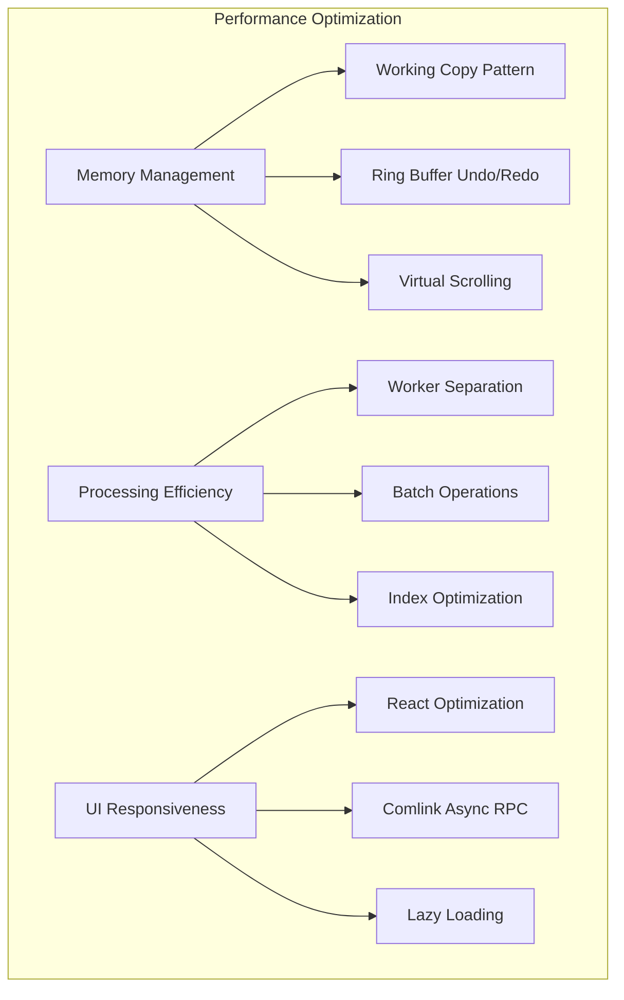
```mermaid
graph TB
    subgraph "Performance Optimization"
        A[Memory Management] --> A1[Working Copy Pattern]
        A --> A2[Ring Buffer Undo/Redo]
        A --> A3[Virtual Scrolling]
        
        B[Processing Efficiency] --> B1[Worker Separation]
        B --> B2[Batch Operations]
        B --> B3[Index Optimization]
        
        C[UI Responsiveness] --> C1[React Optimization]
        C --> C2[Comlink Async RPC]
        C --> C3[Lazy Loading]
    end
```

## 2章 アーキテクチャ概要 ⭐️⭐️⭐️⭐️⭐️

本章では、HierarchiDBの全体アーキテクチャを体系的に説明します。4層構造の詳細、各層間のデータフローパターン、そしてモジュール間の依存関係を明確化します。また、設計原則とその実装における具体的な現れ方について詳述します。

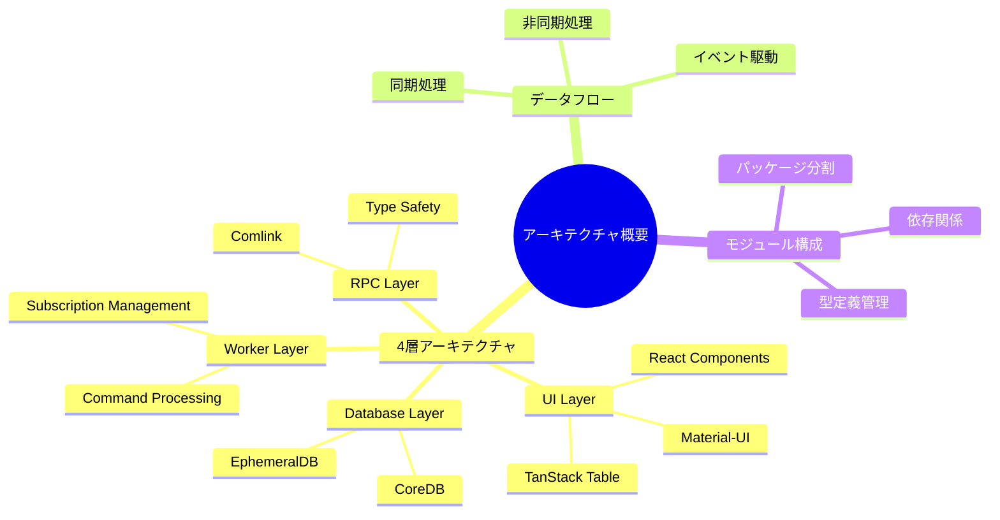
```mermaid
mindmap
  root((アーキテクチャ概要))
    4層アーキテクチャ
      UI Layer
        React Components
        Material-UI
        TanStack Table
      RPC Layer
        Comlink
        Type Safety
      Worker Layer
        Command Processing
        Subscription Management
      Database Layer
        CoreDB
        EphemeralDB
    データフロー
      同期処理
      非同期処理
      イベント駆動
    モジュール構成
      パッケージ分割
      依存関係
      型定義管理
```

### 2.1 4層アーキテクチャ ⭐️⭐️⭐️⭐️⭐️

#### 2.1.1 アーキテクチャ全体像

HierarchiDBは、責任分離の原則に基づいた4層アーキテクチャを採用しています。各層は明確に定義された責務を持ち、上位層は下位層にのみ依存する単方向依存を実現しています。

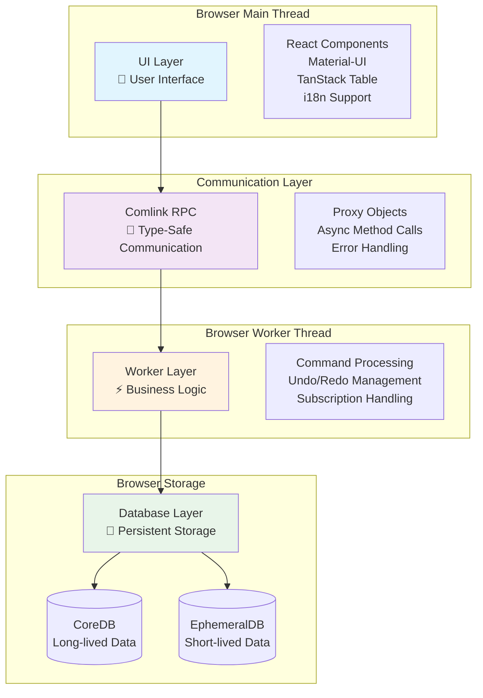
```mermaid
graph TB
    subgraph "Browser Main Thread"
        UI[UI Layer<br/>📱 User Interface]
        UI_SUB[React Components<br/>Material-UI<br/>TanStack Table<br/>i18n Support]
    end
    
    subgraph "Communication Layer"
        RPC[Comlink RPC<br/>🔄 Type-Safe Communication]
        RPC_SUB[Proxy Objects<br/>Async Method Calls<br/>Error Handling]
    end
    
    subgraph "Browser Worker Thread"
        WORKER[Worker Layer<br/>⚡ Business Logic]
        WORKER_SUB[Command Processing<br/>Undo/Redo Management<br/>Subscription Handling]
    end
    
    subgraph "Browser Storage"
        DB[Database Layer<br/>💾 Persistent Storage]
        CORE_DB[(CoreDB<br/>Long-lived Data)]
        EPHEMERAL_DB[(EphemeralDB<br/>Short-lived Data)]
    end
    
    UI --> RPC
    RPC --> WORKER
    WORKER --> DB
    DB --> CORE_DB
    DB --> EPHEMERAL_DB
    
    style UI fill:#e1f5fe
    style RPC fill:#f3e5f5
    style WORKER fill:#fff3e0
    style DB fill:#e8f5e9
```

#### 2.1.2 各層の責務と特徴

| 層 | 主要責務 | 技術スタック | パフォーマンス特性 |
|---|---------|-------------|------------------|
| **UI Layer** | ユーザーインタラクション データ表示 状態管理 | React 18 Material-UI TanStack Table i18next | 60fps レンダリング Virtual Scrolling Lazy Loading |
| **RPC Layer** | 型安全通信 エラー処理 非同期制御 | Comlink TypeScript Proxy Pattern | <1ms オーバーヘッド 自動シリアライゼーション |
| **Worker Layer** | ビジネスロジック コマンド処理 サブスクリプション | Command Pattern Observable Pattern Event-driven | 非ブロッキング処理 バックグラウンド実行 |
| **Database Layer** | データ永続化 トランザクション インデックス管理 | Dexie.js IndexedDB Schema Management | ACID 準拠 インデックス最適化 |

#### 2.1.3 層間インターフェース設計

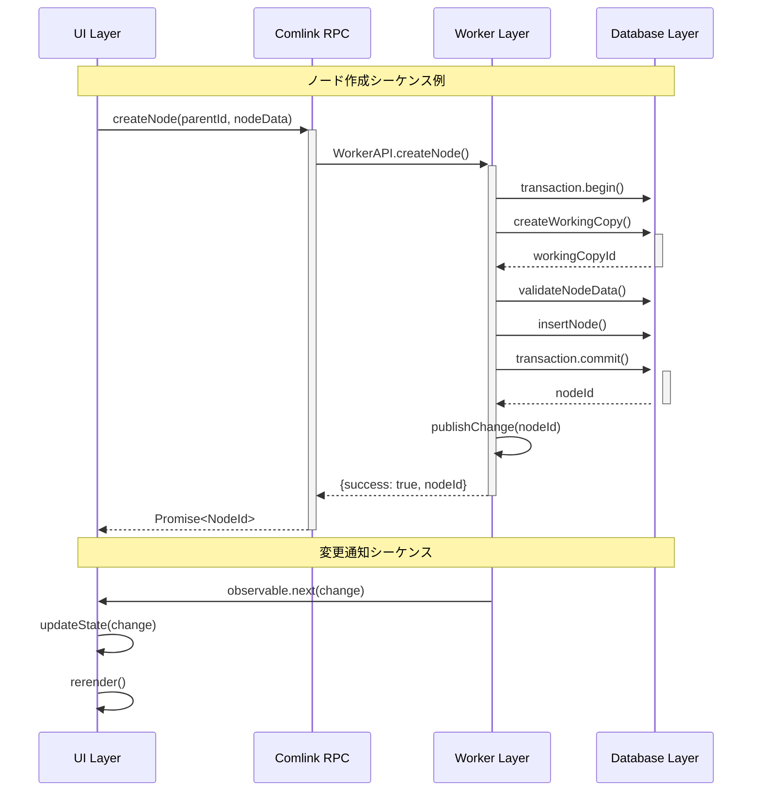
```mermaid
sequenceDiagram
    participant UI as UI Layer
    participant RPC as Comlink RPC
    participant Worker as Worker Layer
    participant DB as Database Layer
    
    Note over UI,DB: ノード作成シーケンス例
    
    UI->>+RPC: createNode(parentId, nodeData)
    RPC->>+Worker: WorkerAPI.createNode()
    Worker->>+DB: transaction.begin()
    Worker->>+DB: createWorkingCopy()
    DB-->>-Worker: workingCopyId
    Worker->>+DB: validateNodeData()
    Worker->>+DB: insertNode()
    Worker->>+DB: transaction.commit()
    DB-->>-Worker: nodeId
    Worker->>Worker: publishChange(nodeId)
    Worker-->>-RPC: {success: true, nodeId}
    RPC-->>-UI: Promise<NodeId>
    
    Note over UI,DB: 変更通知シーケンス
    Worker->>UI: observable.next(change)
    UI->>UI: updateState(change)
    UI->>UI: rerender()
```

### 2.2 データフロー ⭐️⭐️⭐️⭐️⭐️

#### 2.2.1 読み取り処理フロー

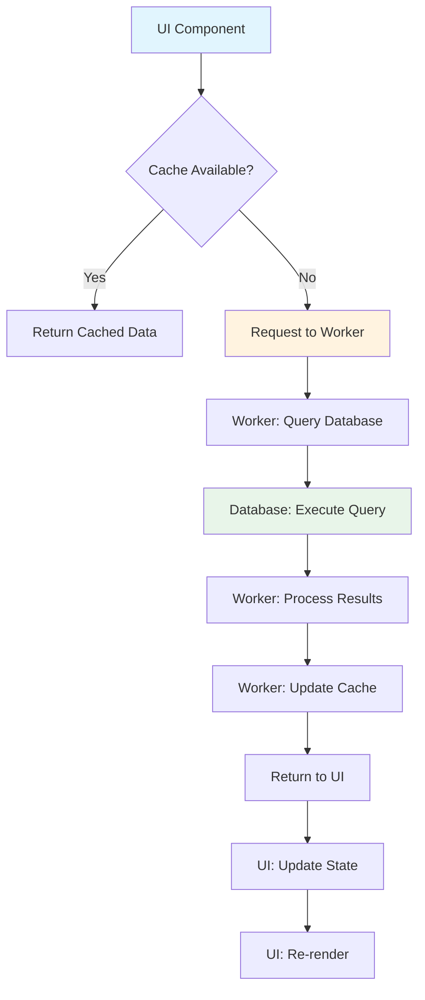
```mermaid
flowchart TD
    A[UI Component] --> B{Cache Available?}
    B -->|Yes| C[Return Cached Data]
    B -->|No| D[Request to Worker]
    D --> E[Worker: Query Database]
    E --> F[Database: Execute Query]
    F --> G[Worker: Process Results]
    G --> H[Worker: Update Cache]
    H --> I[Return to UI]
    I --> J[UI: Update State]
    J --> K[UI: Re-render]
    
    style A fill:#e1f5fe
    style D fill:#fff3e0
    style F fill:#e8f5e9
```

#### 2.2.2 書き込み処理フロー

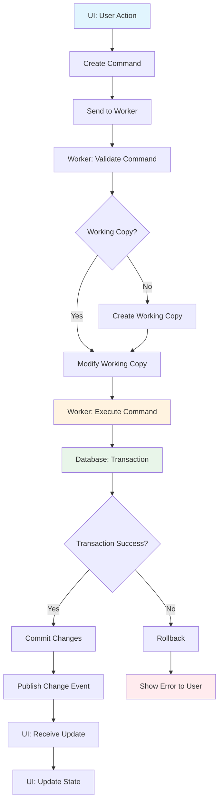
```mermaid
flowchart TD
    A[UI: User Action] --> B[Create Command]
    B --> C[Send to Worker]
    C --> D[Worker: Validate Command]
    D --> E{Working Copy?}
    E -->|Yes| F[Modify Working Copy]
    E -->|No| G[Create Working Copy]
    G --> F
    F --> H[Worker: Execute Command]
    H --> I[Database: Transaction]
    I --> J{Transaction Success?}
    J -->|Yes| K[Commit Changes]
    J -->|No| L[Rollback]
    K --> M[Publish Change Event]
    M --> N[UI: Receive Update]
    N --> O[UI: Update State]
    L --> P[Show Error to User]
    
    style A fill:#e1f5fe
    style H fill:#fff3e0
    style I fill:#e8f5e9
    style P fill:#ffebee
```

#### 2.2.3 サブスクリプション・通知フロー

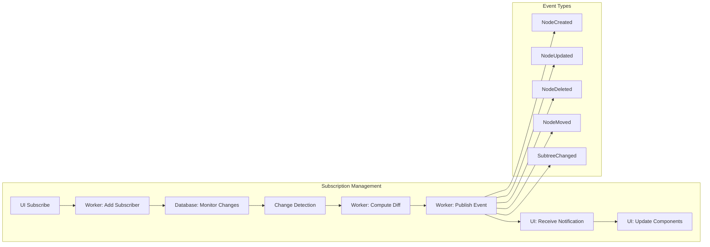
```mermaid
graph LR
    subgraph "Subscription Management"
        A[UI Subscribe] --> B[Worker: Add Subscriber]
        B --> C[Database: Monitor Changes]
        C --> D[Change Detection]
        D --> E[Worker: Compute Diff]
        E --> F[Worker: Publish Event]
        F --> G[UI: Receive Notification]
        G --> H[UI: Update Components]
    end
    
    subgraph "Event Types"
        I[NodeCreated]
        J[NodeUpdated]
        K[NodeDeleted]
        L[NodeMoved]
        M[SubtreeChanged]
    end
    
    F --> I
    F --> J
    F --> K
    F --> L
    F --> M
```

### 2.3 モジュール構成 ⭐️⭐️⭐️⭐️⭐️

#### 2.3.1 パッケージ依存関係図

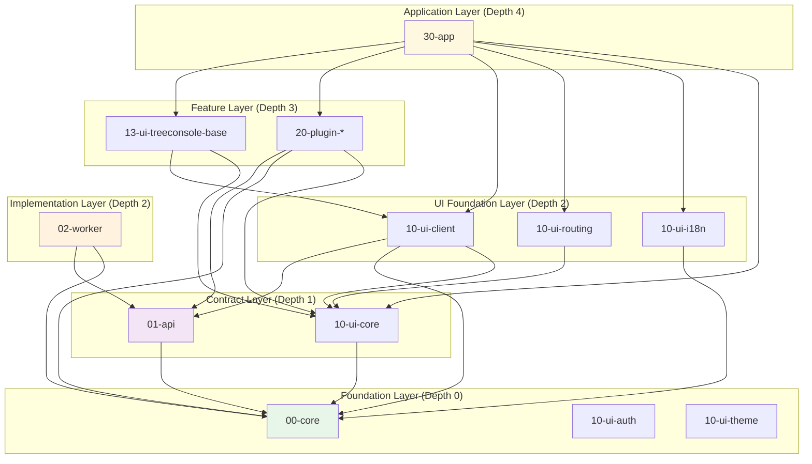
```mermaid
graph TB
    subgraph "Application Layer (Depth 4)"
        APP[30-app]
    end
    
    subgraph "Feature Layer (Depth 3)"
        TC_BASE[13-ui-treeconsole-base]
        PLUGINS[20-plugin-*]
    end
    
    subgraph "UI Foundation Layer (Depth 2)"
        UI_CLIENT[10-ui-client]
        UI_ROUTING[10-ui-routing]
        UI_I18N[10-ui-i18n]
    end
    
    subgraph "Implementation Layer (Depth 2)"
        WORKER[02-worker]
    end
    
    subgraph "Contract Layer (Depth 1)"
        API[01-api]
        UI_CORE[10-ui-core]
    end
    
    subgraph "Foundation Layer (Depth 0)"
        CORE[00-core]
        UI_AUTH[10-ui-auth]
        UI_THEME[10-ui-theme]
    end
    
    APP --> TC_BASE
    APP --> PLUGINS
    APP --> UI_CLIENT
    APP --> UI_ROUTING
    APP --> UI_I18N
    APP --> UI_CORE
    
    TC_BASE --> UI_CLIENT
    TC_BASE --> UI_CORE
    PLUGINS --> API
    PLUGINS --> CORE
    PLUGINS --> UI_CORE
    
    UI_CLIENT --> API
    UI_CLIENT --> CORE
    UI_CLIENT --> UI_CORE
    UI_ROUTING --> UI_CORE
    UI_I18N --> CORE
    
    WORKER --> API
    WORKER --> CORE
    
    API --> CORE
    UI_CORE --> CORE
    
    style CORE fill:#e8f5e9
    style API fill:#f3e5f5
    style WORKER fill:#fff3e0
    style APP fill:#fff8e1
```

#### 2.3.2 パッケージ分類と責務

| カテゴリ | パッケージ | 責務 | 依存関係数 |
|----------|------------|------|-----------|
| **Foundation** | `00-core` | 型定義、ユーティリティ | 0 |
| **Contract** | `01-api` | UI-Worker間インターフェース | 1 (core) |
| **Implementation** | `02-worker` | ビジネスロジック実装 | 2 (api, core) |
| **UI Foundation** | `10-ui-*` | UI基盤コンポーネント | 1-3 |
| **UI Feature** | `11-ui-*` | 機能別UIコンポーネント | 2-4 |
| **TreeConsole** | `12-ui-treeconsole-*` | TreeConsole部品 | 1-2 |
| **Integration** | `13-ui-treeconsole-base` | TreeConsole統合 | 3 |
| **Plugins** | `20-plugin-*` | ノードタイププラグイン | 3-4 |
| **Application** | `30-app` | アプリケーション統合 | 15 |

#### 2.3.3 型定義管理戦略

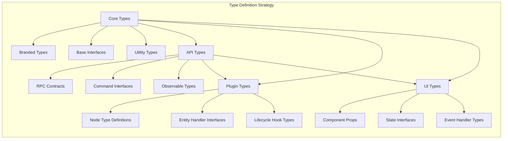
```mermaid
graph LR
    subgraph "Type Definition Strategy"
        A[Core Types] --> A1[Branded Types]
        A --> A2[Base Interfaces]
        A --> A3[Utility Types]
        
        B[API Types] --> B1[RPC Contracts]
        B --> B2[Command Interfaces]
        B --> B3[Observable Types]
        
        C[Plugin Types] --> C1[Node Type Definitions]
        C --> C2[Entity Handler Interfaces]
        C --> C3[Lifecycle Hook Types]
        
        D[UI Types] --> D1[Component Props]
        D --> D2[State Interfaces]
        D --> D3[Event Handler Types]
    end
    
    A --> B
    A --> C
    A --> D
    B --> C
    B --> D
```

## 3章 開発・運用方針 ⭐️⭐️⭐️

本章では、HierarchiDBプロジェクトにおける開発プロセス、品質管理基準、およびデプロイメント戦略について説明します。継続的インテグレーション、テスト戦略、パフォーマンス監視など、プロジェクト成功のための運用体制を体系的に整理します。

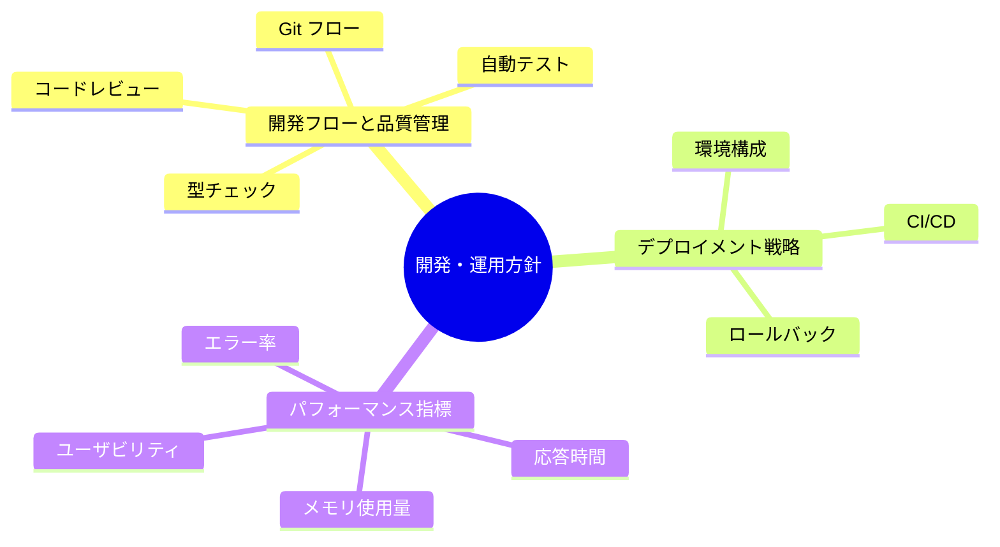
```mermaid
mindmap
  root((開発・運用方針))
    開発フローと品質管理
      Git フロー
      コードレビュー
      自動テスト
      型チェック
    デプロイメント戦略
      環境構成
      CI/CD
      ロールバック
    パフォーマンス指標
      応答時間
      メモリ使用量
      エラー率
      ユーザビリティ
```

### 3.1 開発フローと品質管理 ⭐️⭐️⭐️⭐️

#### 3.1.1 開発フロー体系

```mermaid
gitgraph
    commit id: "main"
    branch feature/new-feature
    checkout feature/new-feature
    commit id: "feat: implement new feature"
    commit id: "test: add unit tests"
    commit id: "docs: update documentation"
    checkout main
    merge feature/new-feature
    commit id: "chore: release v1.1.0"
    branch hotfix/critical-bug
    checkout hotfix/critical-bug
    commit id: "fix: resolve critical issue"
    checkout main
    merge hotfix/critical-bug
    commit id: "chore: release v1.1.1"
```

**開発フローの段階**:

| 段階 | 実施内容 | 品質基準 | 自動化レベル |
|------|----------|----------|-------------|
| **開発** | 機能実装、テスト作成 | ESLint, Prettier準拠 | エディタ統合 |
| **ローカル検証** | 型チェック、ユニットテスト | 100% テストパス | pre-commit hooks |
| **プルリクエスト** | コードレビュー、CI実行 | レビュー承認必須 | GitHub Actions |
| **統合テスト** | E2Eテスト、パフォーマンステスト | 全テスト通過 | 自動実行 |
| **デプロイ** | ステージング→本番 | 段階的リリース | 自動化 |

#### 3.1.2 コード品質基準

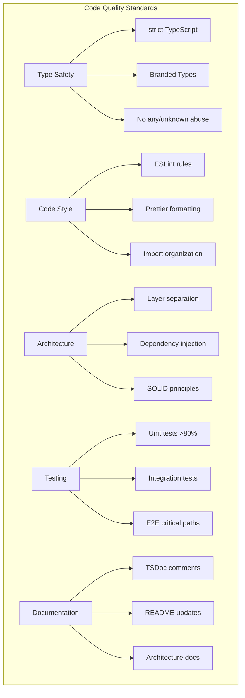
```mermaid
graph TB
    subgraph "Code Quality Standards"
        A[Type Safety] --> A1[strict TypeScript]
        A --> A2[Branded Types]
        A --> A3[No any/unknown abuse]
        
        B[Code Style] --> B1[ESLint rules]
        B --> B2[Prettier formatting]
        B --> B3[Import organization]
        
        C[Architecture] --> C1[Layer separation]
        C --> C2[Dependency injection]
        C --> C3[SOLID principles]
        
        D[Testing] --> D1[Unit tests >80%]
        D --> D2[Integration tests]
        D --> D3[E2E critical paths]
        
        E[Documentation] --> E1[TSDoc comments]
        E --> E2[README updates]
        E --> E3[Architecture docs]
    end
```

#### 3.1.3 自動品質チェック

**ビルド検証プロセス**:

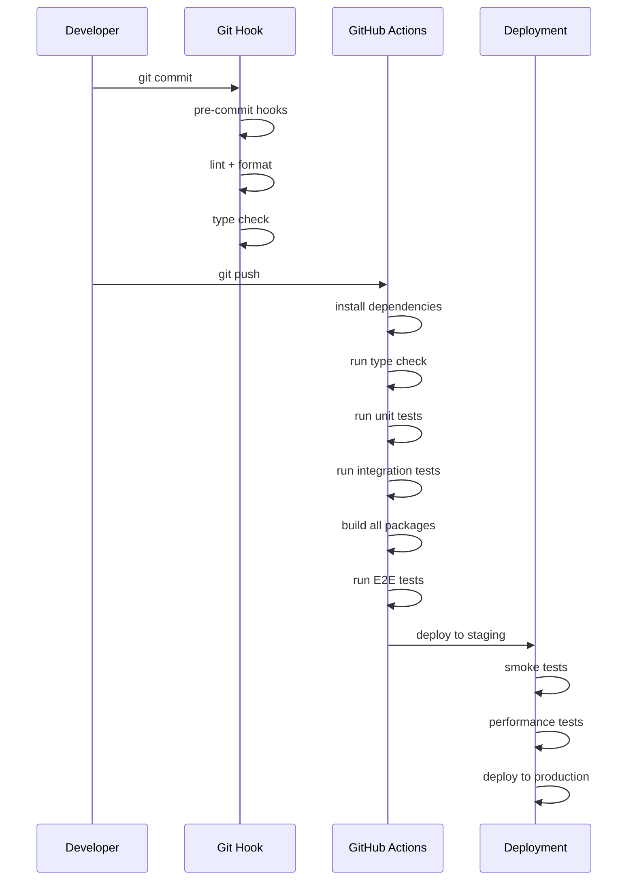
```mermaid
sequenceDiagram
    participant Dev as Developer
    participant Git as Git Hook
    participant CI as GitHub Actions
    participant Deploy as Deployment
    
    Dev->>Git: git commit
    Git->>Git: pre-commit hooks
    Git->>Git: lint + format
    Git->>Git: type check
    
    Dev->>CI: git push
    CI->>CI: install dependencies
    CI->>CI: run type check
    CI->>CI: run unit tests
    CI->>CI: run integration tests
    CI->>CI: build all packages
    CI->>CI: run E2E tests
    CI->>Deploy: deploy to staging
    
    Deploy->>Deploy: smoke tests
    Deploy->>Deploy: performance tests
    Deploy->>Deploy: deploy to production
```

### 3.2 デプロイメント戦略 ⭐️⭐️⭐️

#### 3.2.1 環境構成

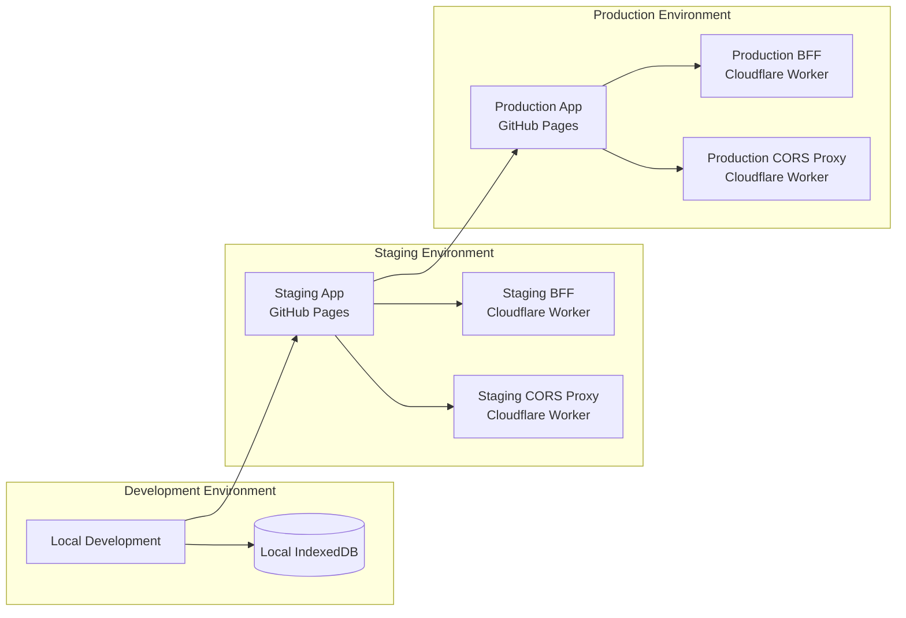
```mermaid
graph LR
    subgraph "Development Environment"
        DEV[Local Development]
        DEV_DB[(Local IndexedDB)]
        DEV --> DEV_DB
    end
    
    subgraph "Staging Environment"
        STAGE[Staging App<br/>GitHub Pages]
        STAGE_BFF[Staging BFF<br/>Cloudflare Worker]
        STAGE_PROXY[Staging CORS Proxy<br/>Cloudflare Worker]
        
        STAGE --> STAGE_BFF
        STAGE --> STAGE_PROXY
    end
    
    subgraph "Production Environment"
        PROD[Production App<br/>GitHub Pages]
        PROD_BFF[Production BFF<br/>Cloudflare Worker]
        PROD_PROXY[Production CORS Proxy<br/>Cloudflare Worker]
        
        PROD --> PROD_BFF
        PROD --> PROD_PROXY
    end
    
    DEV --> STAGE
    STAGE --> PROD
```

#### 3.2.2 CI/CDパイプライン

**GitHub Actionsワークフロー**:

| Stage | Jobs | 実行時間目標 | 成功基準 |
|-------|------|------------|----------|
| **Validate** | Lint, TypeCheck | <2分 | 全チェック通過 |
| **Test** | Unit, Integration | <5分 | 80%以上カバレッジ |
| **Build** | Package Build | <3分 | 全パッケージビルド成功 |
| **E2E** | Critical Path Testing | <10分 | 全シナリオ成功 |
| **Deploy** | Staging Deployment | <2分 | デプロイ成功 |
| **Verify** | Smoke Tests | <3分 | 基本機能確認 |
| **Promote** | Production Deployment | <2分 | 本番リリース |

#### 3.2.3 ロールバック・災害復旧

```mermaid
graph TB
    A[Issue Detection] --> B{Severity Level}
    B -->|Critical| C[Immediate Rollback]
    B -->|High| D[Scheduled Rollback]
    B -->|Medium| E[Hotfix Development]
    B -->|Low| F[Next Release Fix]
    
    C --> G[Previous Version Deployment]
    D --> G
    G --> H[Verify System Recovery]
    H --> I[Post-incident Review]
    
    E --> J[Emergency Patch]
    J --> K[Expedited Testing]
    K --> L[Emergency Deployment]
    
    F --> M[Standard Development Process]
```

### 3.3 パフォーマンス指標 ⭐️⭐️

#### 3.3.1 応答性能指標

```mermaid
graph TB
    subgraph "Performance Metrics"
        A[Response Time] --> A1[UI Operations <100ms]
        A --> A2[Data Loading <2s]
        A --> A3[Search Results <500ms]
        
        B[Throughput] --> B1[10K nodes/sec processing]
        B --> B2[100 concurrent users]
        B --> B3[1M total nodes support]
        
        C[Resource Usage] --> C1[Memory <500MB]
        C --> C2[CPU <30% sustained]
        C --> C3[Network <1MB/page]
        
        D[Reliability] --> D1[Uptime >99.9%]
        D --> D2[Error Rate <0.1%]
        D --> D3[Data Consistency 100%]
    end
```

#### 3.3.2 監視・アラート体系

| 指標カテゴリ | 監視項目 | 閾値 | アラート条件 |
|------------|----------|------|-------------|
| **応答時間** | Page Load Time | <2秒 | 3秒超過が5分継続 |
| | API Response | <100ms | 500ms超過が10回 |
| **エラー率** | JavaScript Errors | <0.1% | 1%超過 |
| | Network Failures | <0.5% | 2%超過 |
| **リソース** | Memory Usage | <500MB | 1GB超過 |
| | CPU Utilization | <30% | 80%超過が5分 |
| **ユーザー** | Session Duration | >5分 | 平均2分未満 |
| | Bounce Rate | <20% | 50%超過 |

#### 3.3.3 継続的改善プロセス

```mermaid
graph LR
    A[Metrics Collection] --> B[Analysis]
    B --> C[Bottleneck Identification]
    C --> D[Optimization Strategy]
    D --> E[Implementation]
    E --> F[Performance Testing]
    F --> G[Deployment]
    G --> H[Monitoring]
    H --> A
    
    subgraph "Optimization Areas"
        I[Database Queries]
        J[UI Rendering]
        K[Memory Management]
        L[Network Requests]
    end
    
    D --> I
    D --> J
    D --> K
    D --> L
```

---

**まとめ**

第1部では、HierarchiDBの全体像を包括的に概説しました。プロジェクトの技術的位置づけから、4層アーキテクチャの詳細、開発・運用方針まで、システム理解の基盤となる情報を提供しています。

次の第2部では、これらの設計を支える具体的な要求仕様について詳述します。