# 第2部 要求仕様

## 4章 機能要求 ⭐️⭐️⭐️⭐️

本章では、HierarchiDBが提供すべき機能要求を体系的に定義します。コア機能、プラグイン機能、ユーザーインターフェース機能の各カテゴリごとに、具体的な機能仕様と品質基準を明示します。また、これらの機能要求が技術アーキテクチャにどのように反映されているかを説明します。

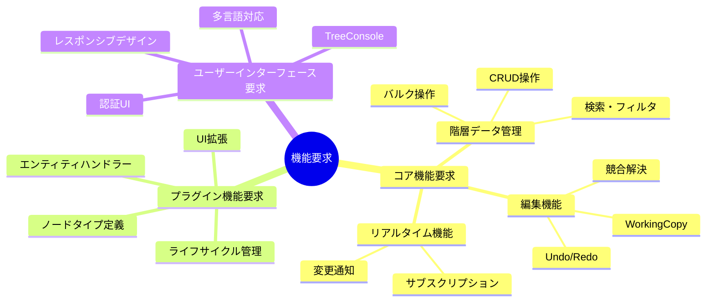
```mermaid
mindmap
  root((機能要求))
    コア機能要求
      階層データ管理
        CRUD操作
        バルク操作
        検索・フィルタ
      編集機能
        WorkingCopy
        Undo/Redo
        競合解決
      リアルタイム機能
        変更通知
        サブスクリプション
    プラグイン機能要求
      ノードタイプ定義
      エンティティハンドラー
      ライフサイクル管理
      UI拡張
    ユーザーインターフェース要求
      TreeConsole
      認証UI
      多言語対応
      レスポンシブデザイン
```

### 4.1 コア機能要求 ⭐️⭐️⭐️⭐️⭐️

#### 4.1.1 階層データ管理機能

**基本CRUD操作**

| 機能ID | 機能名 | 説明 | 品質基準 |
|--------|--------|------|----------|
| F001 | ノード作成 | 指定された親ノード下に新規ノードを作成 | 応答時間<100ms, データ整合性100% |
| F002 | ノード読取 | ノードIDまたはパスによるノード取得 | 応答時間<50ms, キャッシュ効率90%+ |
| F003 | ノード更新 | ノードの属性情報を更新 | 応答時間<100ms, 変更履歴保持 |
| F004 | ノード削除 | ノードを論理削除または物理削除 | 応答時間<100ms, 復元可能性 |

**階層構造操作**

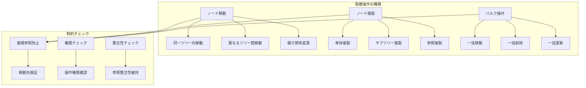
```mermaid
graph TB
    subgraph "階層操作の種類"
        A[ノード移動] --> A1[同一ツリー内移動]
        A --> A2[異なるツリー間移動]
        A --> A3[親子関係変更]
        
        B[ノード複製] --> B1[単体複製]
        B --> B2[サブツリー複製]
        B --> B3[参照複製]
        
        C[バルク操作] --> C1[一括移動]
        C --> C2[一括削除]
        C --> C3[一括更新]
    end
    
    subgraph "制約チェック"
        D[循環参照防止] --> D1[移動先検証]
        E[権限チェック] --> E1[操作権限確認]
        F[整合性チェック] --> F1[参照整合性維持]
    end
    
    A --> D
    B --> D
    C --> D
```

**検索・フィルタ機能**

| 検索タイプ | 対象範囲 | 検索条件 | パフォーマンス目標 |
|-----------|----------|----------|------------------|
| **テキスト検索** | ノード名、説明 | 部分一致、完全一致、正規表現 | <500ms (10万ノード) |
| **属性検索** | ノードタイプ、メタデータ | 等価、範囲、存在チェック | <200ms |
| **階層検索** | 指定深度、親子関係 | パス指定、深度指定 | <100ms |
| **複合検索** | 複数条件組み合わせ | AND/OR/NOT演算 | <1秒 |

#### 4.1.2 編集機能要求

**WorkingCopyパターン実装**

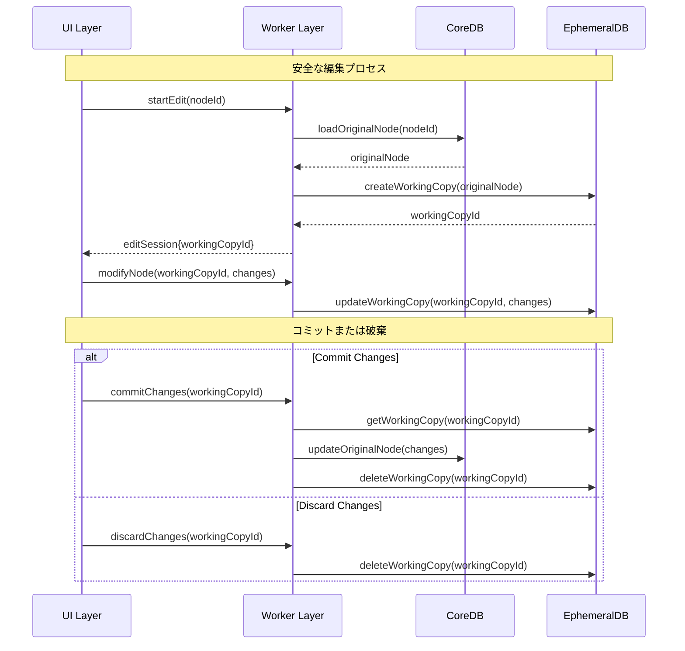
```mermaid
sequenceDiagram
    participant UI as UI Layer
    participant Worker as Worker Layer
    participant CoreDB as CoreDB
    participant EphemeralDB as EphemeralDB
    
    Note over UI,EphemeralDB: 安全な編集プロセス
    
    UI->>Worker: startEdit(nodeId)
    Worker->>CoreDB: loadOriginalNode(nodeId)
    CoreDB-->>Worker: originalNode
    Worker->>EphemeralDB: createWorkingCopy(originalNode)
    EphemeralDB-->>Worker: workingCopyId
    Worker-->>UI: editSession{workingCopyId}
    
    UI->>Worker: modifyNode(workingCopyId, changes)
    Worker->>EphemeralDB: updateWorkingCopy(workingCopyId, changes)
    
    Note over UI,EphemeralDB: コミットまたは破棄
    
    alt Commit Changes
        UI->>Worker: commitChanges(workingCopyId)
        Worker->>EphemeralDB: getWorkingCopy(workingCopyId)
        Worker->>CoreDB: updateOriginalNode(changes)
        Worker->>EphemeralDB: deleteWorkingCopy(workingCopyId)
    else Discard Changes
        UI->>Worker: discardChanges(workingCopyId)
        Worker->>EphemeralDB: deleteWorkingCopy(workingCopyId)
    end
```

**Undo/Redoシステム要求**

| 要求項目 | 仕様値 | 実装方式 |
|----------|--------|----------|
| **履歴サイズ** | 最大1000操作 | リングバッファ |
| **操作粒度** | 単一コマンド | コマンドパターン |
| **応答性能** | Undo/Redo <50ms | インメモリ処理 |
| **メモリ使用量** | <100MB (1000履歴) | 差分ストレージ |
| **永続性** | セッション内のみ | EphemeralDB |

**競合解決機能**

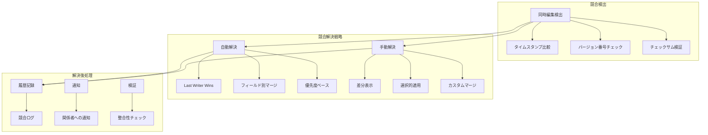
```mermaid
graph TB
    subgraph "競合検出"
        A[同時編集検出] --> A1[タイムスタンプ比較]
        A --> A2[バージョン番号チェック]
        A --> A3[チェックサム検証]
    end
    
    subgraph "競合解決戦略"
        B[自動解決] --> B1[Last Writer Wins]
        B --> B2[フィールド別マージ]
        B --> B3[優先度ベース]
        
        C[手動解決] --> C1[差分表示]
        C --> C2[選択的適用]
        C --> C3[カスタムマージ]
    end
    
    subgraph "解決後処理"
        D[履歴記録] --> D1[競合ログ]
        E[通知] --> E1[関係者への通知]
        F[検証] --> F1[整合性チェック]
    end
    
    A --> B
    A --> C
    B --> D
    C --> D
```

#### 4.1.3 リアルタイム機能要求

**変更通知システム**

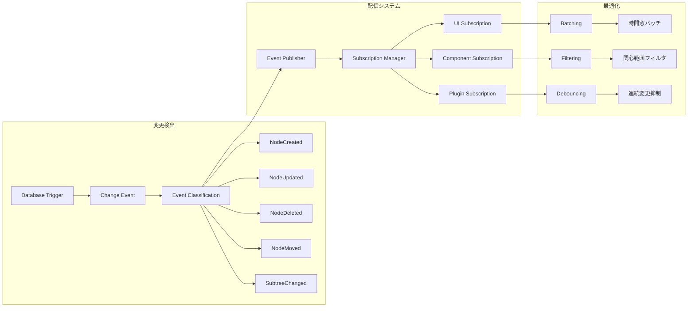
```mermaid
graph LR
    subgraph "変更検出"
        A[Database Trigger] --> B[Change Event]
        B --> C[Event Classification]
        C --> C1[NodeCreated]
        C --> C2[NodeUpdated]
        C --> C3[NodeDeleted]
        C --> C4[NodeMoved]
        C --> C5[SubtreeChanged]
    end
    
    subgraph "配信システム"
        D[Event Publisher] --> E[Subscription Manager]
        E --> F1[UI Subscription]
        E --> F2[Component Subscription]
        E --> F3[Plugin Subscription]
    end
    
    subgraph "最適化"
        G[Batching] --> G1[時間窓バッチ]
        H[Filtering] --> H1[関心範囲フィルタ]
        I[Debouncing] --> I1[連続変更抑制]
    end
    
    C --> D
    F1 --> G
    F2 --> H
    F3 --> I
```

**サブスクリプション管理**

| サブスクリプション種類 | 対象 | パフォーマンス | メモリ使用量 |
|-------------------|------|-------------|-------------|
| **ノード単体** | 単一ノードの変更 | <10ms通知遅延 | <1KB/subscription |
| **サブツリー** | 指定ノード以下全体 | <50ms通知遅延 | <10KB/subscription |
| **クエリベース** | 検索条件一致ノード | <100ms通知遅延 | <5KB/subscription |
| **カスタム** | プラグイン定義条件 | <200ms通知遅延 | 可変 |

### 4.2 プラグイン機能要求 ⭐️⭐️⭐️

#### 4.2.1 ノードタイプ定義システム

**プラグインアーキテクチャ要求**

```mermaid
graph TB
    subgraph "プラグイン定義"
        A[NodeTypeDefinition] --> A1[nodeType: string]
        A --> A2[database: Schema]
        A --> A3[entityHandler: Handler]
        A --> A4[ui: Components]
        A --> A5[lifecycle: Hooks]
    end
    
    subgraph "登録・管理"
        B[NodeTypeRegistry] --> B1[register()]
        B --> B2[unregister()]
        B --> B3[getHandler()]
        B --> B4[listTypes()]
    end
    
    subgraph "ランタイム解決"
        C[Type Resolution] --> C1[ハンドラー取得]
        C --> C2[UI コンポーネント解決]
        C --> C3[ライフサイクルフック実行]
    end
    
    A --> B
    B --> C
```

**エンティティハンドラー要求**

| 必須メソッド | 説明 | 戻り値 | エラーハンドリング |
|-------------|------|--------|------------------|
| `createEntity()` | エンティティ新規作成 | `Promise<EntityId>` | ValidationError, DatabaseError |
| `getEntity()` | エンティティ取得 | `Promise<Entity \| null>` | NotFoundError |
| `updateEntity()` | エンティティ更新 | `Promise<void>` | ValidationError, ConcurrencyError |
| `deleteEntity()` | エンティティ削除 | `Promise<void>` | IntegrityError |
| `listEntities()` | エンティティ一覧 | `Promise<Entity[]>` | QueryError |

**ライフサイクルフック要求**

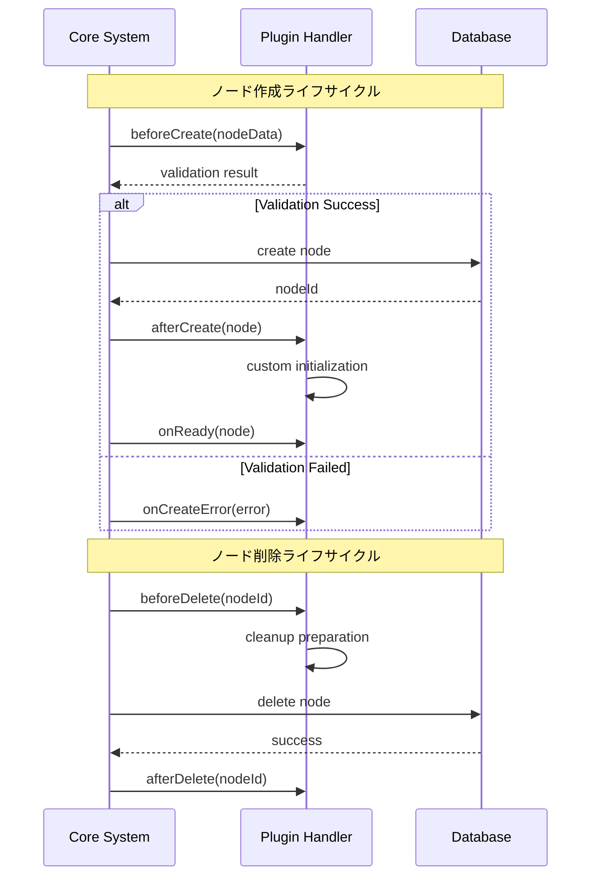
```mermaid
sequenceDiagram
    participant Core as Core System
    participant Plugin as Plugin Handler
    participant DB as Database
    
    Note over Core,DB: ノード作成ライフサイクル
    
    Core->>Plugin: beforeCreate(nodeData)
    Plugin-->>Core: validation result
    
    alt Validation Success
        Core->>DB: create node
        DB-->>Core: nodeId
        Core->>Plugin: afterCreate(node)
        Plugin->>Plugin: custom initialization
        Core->>Plugin: onReady(node)
    else Validation Failed
        Core->>Plugin: onCreateError(error)
    end
    
    Note over Core,DB: ノード削除ライフサイクル
    
    Core->>Plugin: beforeDelete(nodeId)
    Plugin->>Plugin: cleanup preparation
    Core->>DB: delete node
    DB-->>Core: success
    Core->>Plugin: afterDelete(nodeId)
```

#### 4.2.2 プラグイン拡張機能

**UIコンポーネント拡張**

| コンポーネント種類 | 必須プロパティ | 省略可能プロパティ | イベントハンドラー |
|------------------|---------------|------------------|------------------|
| **Dialog Component** | `node: TreeNode`<br/>`onSave: Function`<br/>`onCancel: Function` | `mode: 'create' \| 'edit'`<br/>`initialData: Partial<Entity>` | `onValidate`<br/>`onChange`<br/>`onError` |
| **Panel Component** | `nodeId: NodeId`<br/>`entity: Entity` | `readonly: boolean`<br/>`compact: boolean` | `onUpdate`<br/>`onAction` |
| **Icon Component** | `nodeType: string` | `size: 'small' \| 'medium' \| 'large'`<br/>`color: string` | なし |
| **Context Menu** | `node: TreeNode`<br/>`actions: Action[]` | `disabled: boolean`<br/>`position: {x, y}` | `onAction` |

**API拡張メカニズム**

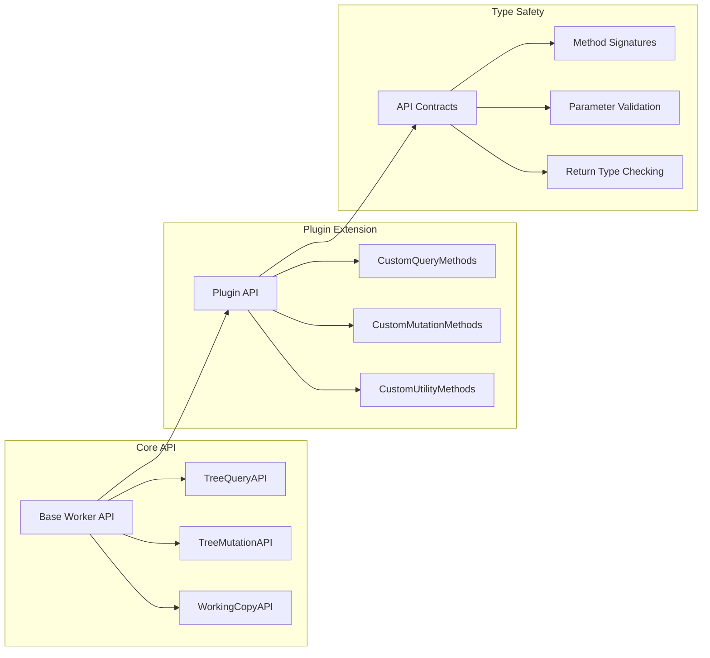
```mermaid
graph LR
    subgraph "Core API"
        A[Base Worker API] --> A1[TreeQueryAPI]
        A --> A2[TreeMutationAPI]
        A --> A3[WorkingCopyAPI]
    end
    
    subgraph "Plugin Extension"
        B[Plugin API] --> B1[CustomQueryMethods]
        B --> B2[CustomMutationMethods]
        B --> B3[CustomUtilityMethods]
    end
    
    subgraph "Type Safety"
        C[API Contracts] --> C1[Method Signatures]
        C --> C2[Parameter Validation]
        C --> C3[Return Type Checking]
    end
    
    A --> B
    B --> C
```

#### 4.2.3 プラグイン品質要求

**パフォーマンス要求**

| 項目 | 要求値 | 測定方法 |
|------|--------|----------|
| **プラグイン登録時間** | <100ms | 初期化時間計測 |
| **ハンドラー解決時間** | <1ms | ベンチマークテスト |
| **UI コンポーネント初期化** | <200ms | レンダリング時間 |
| **メモリ使用量** | <50MB/プラグイン | プロファイリング |
| **ライフサイクルフック実行** | <50ms | フック実行時間 |

**分離・独立性要求**

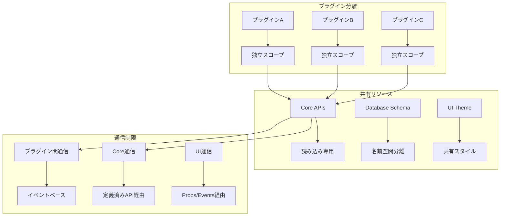
```mermaid
graph TB
    subgraph "プラグイン分離"
        A[プラグインA] --> A1[独立スコープ]
        B[プラグインB] --> B1[独立スコープ]
        C[プラグインC] --> C1[独立スコープ]
    end
    
    subgraph "共有リソース"
        D[Core APIs] --> D1[読み込み専用]
        E[Database Schema] --> E1[名前空間分離]
        F[UI Theme] --> F1[共有スタイル]
    end
    
    subgraph "通信制限"
        G[プラグイン間通信] --> G1[イベントベース]
        H[Core通信] --> H1[定義済みAPI経由]
        I[UI通信] --> I1[Props/Events経由]
    end
    
    A1 --> D
    B1 --> D
    C1 --> D
    D --> G
    D --> H
```

### 4.3 ユーザーインターフェース要求 ⭐️⭐️⭐️⭐️

#### 4.3.1 TreeConsoleシステム要求

**TreeConsole基本機能**

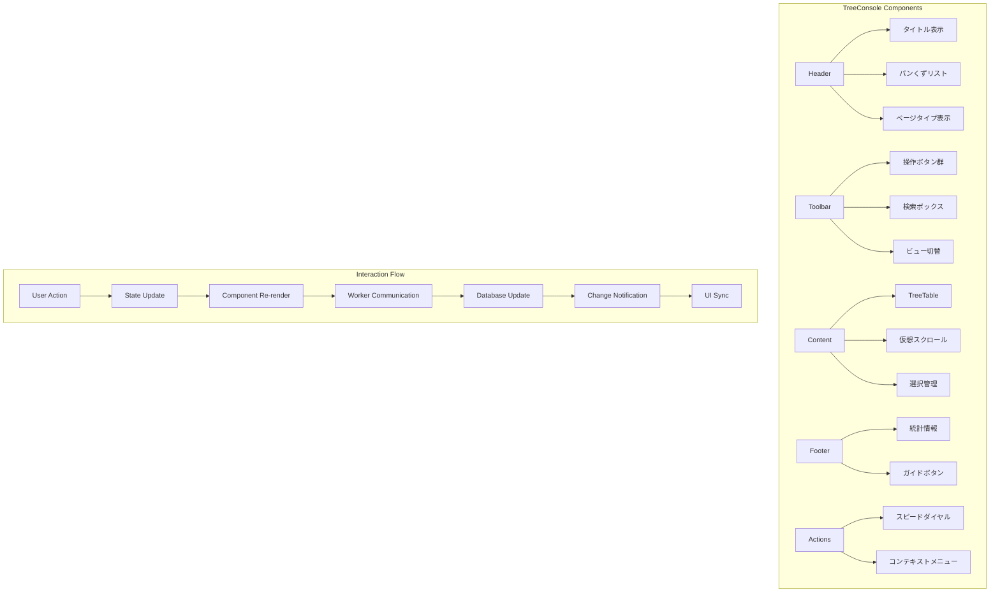
```mermaid
graph TB
    subgraph "TreeConsole Components"
        A[Header] --> A1[タイトル表示]
        A --> A2[パンくずリスト]
        A --> A3[ページタイプ表示]
        
        B[Toolbar] --> B1[操作ボタン群]
        B --> B2[検索ボックス]
        B --> B3[ビュー切替]
        
        C[Content] --> C1[TreeTable]
        C --> C2[仮想スクロール]
        C --> C3[選択管理]
        
        D[Footer] --> D1[統計情報]
        D --> D2[ガイドボタン]
        
        E[Actions] --> E1[スピードダイヤル]
        E --> E2[コンテキストメニュー]
    end
    
    subgraph "Interaction Flow"
        F[User Action] --> G[State Update]
        G --> H[Component Re-render]
        H --> I[Worker Communication]
        I --> J[Database Update]
        J --> K[Change Notification]
        K --> L[UI Sync]
    end
```

**TreeTable表示要求**

| 要求項目 | 仕様 | パフォーマンス目標 |
|----------|------|------------------|
| **表示可能行数** | 10万行以上 | 仮想スクロールで対応 |
| **列カスタマイズ** | 表示/非表示、幅調整、順序変更 | 設定保存機能 |
| **ソート機能** | 複数列、昇順/降順 | <500ms (10万行) |
| **フィルタ機能** | 列単位、複合条件 | <200ms |
| **選択機能** | 単一/複数/範囲選択 | キーボードショートカット対応 |
| **編集機能** | インライン編集、検証 | リアルタイム検証 |

**レスポンシブデザイン要求**

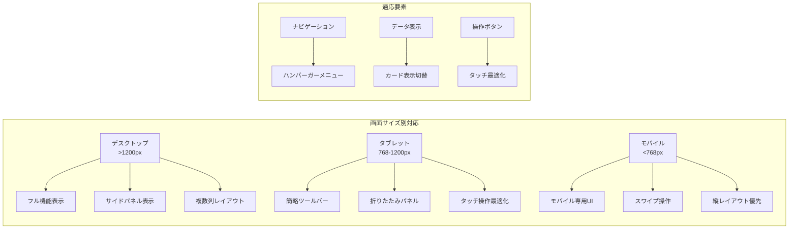
```mermaid
graph LR
    subgraph "画面サイズ別対応"
        A[デスクトップ<br/>>1200px] --> A1[フル機能表示]
        A --> A2[サイドパネル表示]
        A --> A3[複数列レイアウト]
        
        B[タブレット<br/>768-1200px] --> B1[簡略ツールバー]
        B --> B2[折りたたみパネル]
        B --> B3[タッチ操作最適化]
        
        C[モバイル<br/><768px] --> C1[モバイル専用UI]
        C --> C2[スワイプ操作]
        C --> C3[縦レイアウト優先]
    end
    
    subgraph "適応要素"
        D[ナビゲーション] --> D1[ハンバーガーメニュー]
        E[データ表示] --> E1[カード表示切替]
        F[操作ボタン] --> F1[タッチ最適化]
    end
```

#### 4.3.2 認証・セキュリティUI要求

**認証フロー要求**

| 認証段階 | UI要求 | セキュリティ要求 |
|----------|--------|-----------------|
| **ログイン画面** | OAuth2プロバイダー選択<br/>ブランディング表示<br/>ローディング状態 | HTTPS必須<br/>CSRF対策<br/>セッション管理 |
| **認証中** | プログレス表示<br/>キャンセル機能<br/>エラー処理 | 認証状態検証<br/>タイムアウト処理 |
| **認証後** | ユーザー情報表示<br/>ログアウト機能<br/>権限表示 | JWT検証<br/>権限チェック<br/>自動更新 |

**ユーザーメニュー要求**

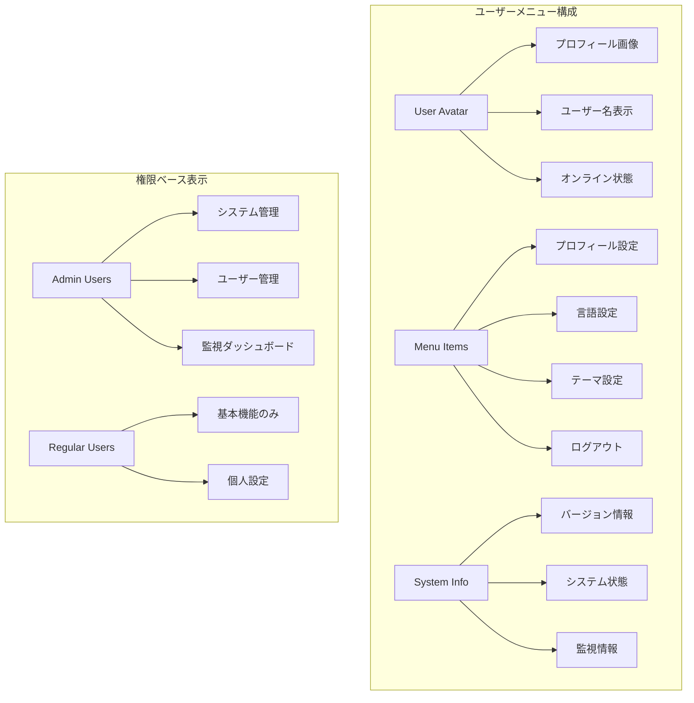
```mermaid
graph TB
    subgraph "ユーザーメニュー構成"
        A[User Avatar] --> A1[プロフィール画像]
        A --> A2[ユーザー名表示]
        A --> A3[オンライン状態]
        
        B[Menu Items] --> B1[プロフィール設定]
        B --> B2[言語設定]
        B --> B3[テーマ設定]
        B --> B4[ログアウト]
        
        C[System Info] --> C1[バージョン情報]
        C --> C2[システム状態]
        C --> C3[監視情報]
    end
    
    subgraph "権限ベース表示"
        D[Admin Users] --> D1[システム管理]
        D --> D2[ユーザー管理]
        D --> D3[監視ダッシュボード]
        
        E[Regular Users] --> E1[基本機能のみ]
        E --> E2[個人設定]
    end
```

#### 4.3.3 多言語・アクセシビリティ要求

**国際化（i18n）要求**

| 対応項目 | 仕様 | 実装方式 |
|----------|------|----------|
| **対応言語** | 日本語（主要）、英語 | i18next |
| **動的言語切替** | リロード不要 | リアルタイム切替 |
| **日付・数値形式** | ロケール依存 | Intl API活用 |
| **文字エンコーディング** | UTF-8 | 全コンポーネント対応 |
| **RTL対応** | 将来拡張予定 | CSS論理プロパティ |

**アクセシビリティ要求**

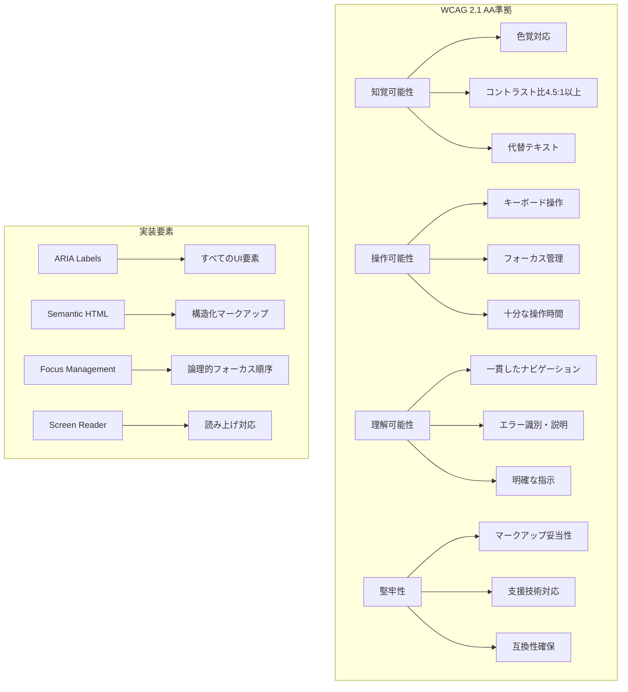
```mermaid
graph TB
    subgraph "WCAG 2.1 AA準拠"
        A[知覚可能性] --> A1[色覚対応]
        A --> A2[コントラスト比4.5:1以上]
        A --> A3[代替テキスト]
        
        B[操作可能性] --> B1[キーボード操作]
        B --> B2[フォーカス管理]
        B --> B3[十分な操作時間]
        
        C[理解可能性] --> C1[一貫したナビゲーション]
        C --> C2[エラー識別・説明]
        C --> C3[明確な指示]
        
        D[堅牢性] --> D1[マークアップ妥当性]
        D --> D2[支援技術対応]
        D --> D3[互換性確保]
    end
    
    subgraph "実装要素"
        E[ARIA Labels] --> E1[すべてのUI要素]
        F[Semantic HTML] --> F1[構造化マークアップ]
        G[Focus Management] --> G1[論理的フォーカス順序]
        H[Screen Reader] --> H1[読み上げ対応]
    end
```

## 5章 非機能要求 ⭐️⭐️⭐️

本章では、HierarchiDBの性能、可用性、セキュリティに関する非機能要求を定義します。これらの要求は、システムの品質特性を保証し、実運用環境での安定性を確保するために不可欠です。具体的な数値目標と、それらを実現するための技術的アプローチを示します。

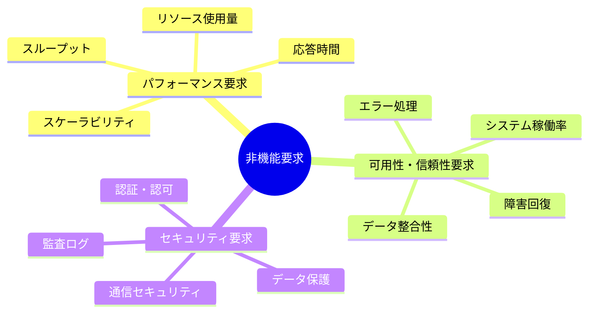
```mermaid
mindmap
  root((非機能要求))
    パフォーマンス要求
      応答時間
      スループット
      リソース使用量
      スケーラビリティ
    可用性・信頼性要求
      システム稼働率
      障害回復
      データ整合性
      エラー処理
    セキュリティ要求
      認証・認可
      データ保護
      通信セキュリティ
      監査ログ
```

### 5.1 パフォーマンス要求 ⭐️⭐️⭐️

#### 5.1.1 応答時間要求

**ユーザーインタラクション応答時間**

| 操作カテゴリ | 目標値 | 最大許容値 | 測定条件 |
|-------------|-------|------------|----------|
| **基本UI操作** | <100ms | <200ms | クリック、キー入力への反応 |
| **データ表示** | <500ms | <1秒 | 1万ノード以下の表示 |
| **検索結果** | <500ms | <2秒 | 全文検索、属性検索 |
| **階層ナビゲーション** | <200ms | <500ms | 展開/折りたたみ |
| **ページ遷移** | <1秒 | <3秒 | ルートナビゲーション |

**データ処理応答時間**

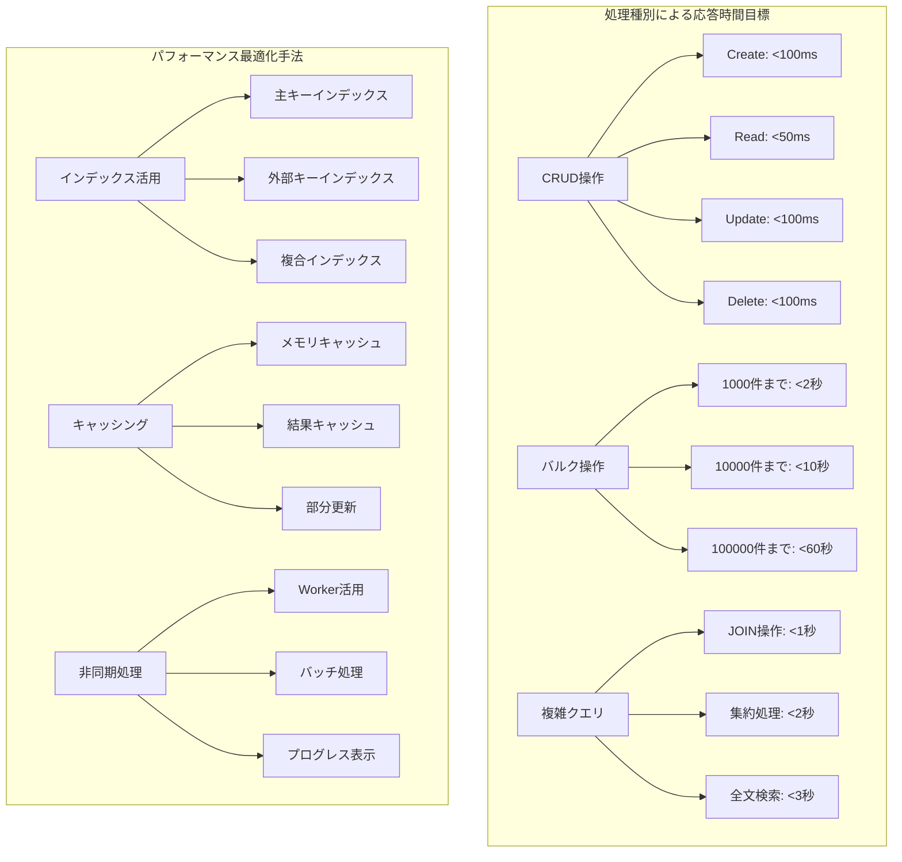
```mermaid
graph TB
    subgraph "処理種別による応答時間目標"
        A[CRUD操作] --> A1[Create: <100ms]
        A --> A2[Read: <50ms]
        A --> A3[Update: <100ms]  
        A --> A4[Delete: <100ms]
        
        B[バルク操作] --> B1[1000件まで: <2秒]
        B --> B2[10000件まで: <10秒]
        B --> B3[100000件まで: <60秒]
        
        C[複雑クエリ] --> C1[JOIN操作: <1秒]
        C --> C2[集約処理: <2秒]
        C --> C3[全文検索: <3秒]
    end
    
    subgraph "パフォーマンス最適化手法"
        D[インデックス活用] --> D1[主キーインデックス]
        D --> D2[外部キーインデックス]
        D --> D3[複合インデックス]
        
        E[キャッシング] --> E1[メモリキャッシュ]
        E --> E2[結果キャッシュ]
        E --> E3[部分更新]
        
        F[非同期処理] --> F1[Worker活用]
        F --> F2[バッチ処理]
        F --> F3[プログレス表示]
    end
```

#### 5.1.2 スループット要求

**同時接続・処理能力**

| 指標 | 要求値 | 設計目標 | スケーリング方式 |
|------|--------|----------|-----------------|
| **同時ユーザー数** | 100人 | 500人 | ブラウザサイドスケーリング |
| **DB同時接続** | ユーザー当たり1接続 | 効率的コネクション管理 | 接続プール |
| **API処理能力** | 1000req/秒 | 5000req/秒 | Worker並列処理 |
| **データ転送量** | 10MB/秒/ユーザー | 帯域幅最適化 | 差分転送 |

**リソース効率性**

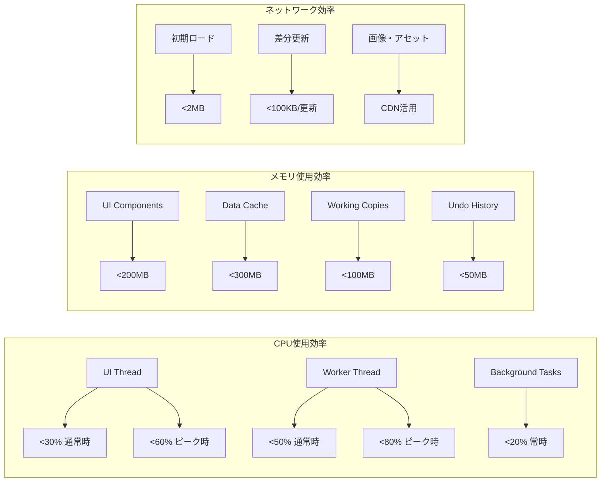
```mermaid
graph LR
    subgraph "CPU使用効率"
        A[UI Thread] --> A1[<30% 通常時]
        A --> A2[<60% ピーク時]
        
        B[Worker Thread] --> B1[<50% 通常時]
        B --> B2[<80% ピーク時]
        
        C[Background Tasks] --> C1[<20% 常時]
    end
    
    subgraph "メモリ使用効率"
        D[UI Components] --> D1[<200MB]
        E[Data Cache] --> E1[<300MB]
        F[Working Copies] --> F1[<100MB]
        G[Undo History] --> G1[<50MB]
    end
    
    subgraph "ネットワーク効率"
        H[初期ロード] --> H1[<2MB]
        I[差分更新] --> I1[<100KB/更新]
        J[画像・アセット] --> J1[CDN活用]
    end
```

#### 5.1.3 スケーラビリティ要求

**データ量スケーラビリティ**

| データ規模 | ノード数 | 応答性能維持 | 実装手法 |
|-----------|---------|-------------|----------|
| **小規模** | ~1万ノード | 全データメモリ保持 | 単純キャッシュ |
| **中規模** | ~10万ノード | 仮想スクロール必須 | 部分読み込み |
| **大規模** | ~100万ノード | ページネーション | 非同期読み込み |
| **超大規模** | 100万ノード+ | 階層別読み込み | オンデマンド |

**機能拡張性**

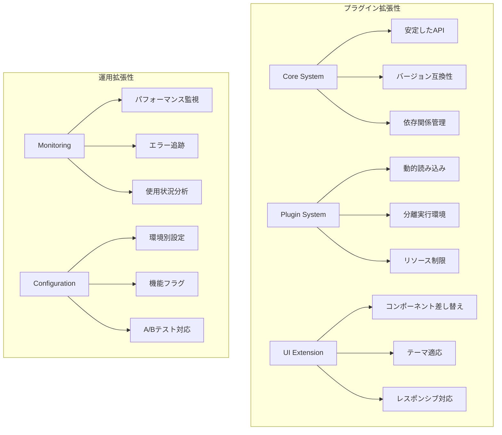
```mermaid
graph TB
    subgraph "プラグイン拡張性"
        A[Core System] --> A1[安定したAPI]
        A --> A2[バージョン互換性]
        A --> A3[依存関係管理]
        
        B[Plugin System] --> B1[動的読み込み]
        B --> B2[分離実行環境]
        B --> B3[リソース制限]
        
        C[UI Extension] --> C1[コンポーネント差し替え]
        C --> C2[テーマ適応]
        C --> C3[レスポンシブ対応]
    end
    
    subgraph "運用拡張性"
        D[Monitoring] --> D1[パフォーマンス監視]
        D --> D2[エラー追跡]
        D --> D3[使用状況分析]
        
        E[Configuration] --> E1[環境別設定]
        E --> E2[機能フラグ]
        E --> E3[A/Bテスト対応]
    end
```

### 5.2 欠番

### 5.3 セキュリティ要求 ⭐️⭐️⭐️

#### 5.3.1 認証・認可

**認証要求**

| 認証方式 | 実装レベル | セキュリティレベル | 対象ユーザー |
|----------|------------|------------------|-------------|
| **OAuth2/OIDC** | 必須 | 高 | 全ユーザー |
| **JWT Token** | 必須 | 高 | API アクセス |
| **セッション管理** | 必須 | 中 | UI セッション |
| **多要素認証** | 推奨 | 最高 | 管理者 |

**認可モデル**

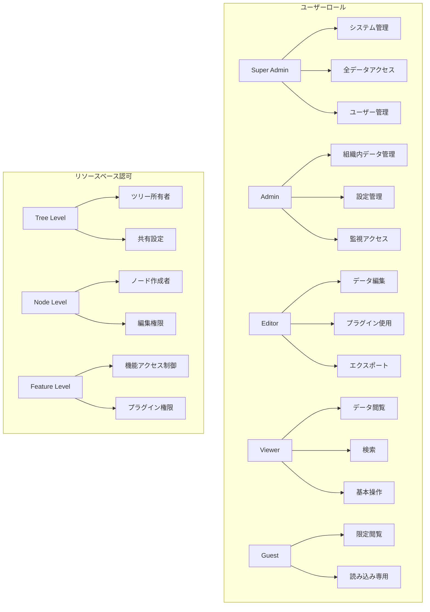
```mermaid
graph TB
    subgraph "ユーザーロール"
        A[Super Admin] --> A1[システム管理]
        A --> A2[全データアクセス]
        A --> A3[ユーザー管理]
        
        B[Admin] --> B1[組織内データ管理]
        B --> B2[設定管理]
        B --> B3[監視アクセス]
        
        C[Editor] --> C1[データ編集]
        C --> C2[プラグイン使用]
        C --> C3[エクスポート]
        
        D[Viewer] --> D1[データ閲覧]
        D --> D2[検索]
        D --> D3[基本操作]
        
        E[Guest] --> E1[限定閲覧]
        E --> E2[読み込み専用]
    end
    
    subgraph "リソースベース認可"
        F[Tree Level] --> F1[ツリー所有者]
        F --> F2[共有設定]
        
        G[Node Level] --> G1[ノード作成者]
        G --> G2[編集権限]
        
        H[Feature Level] --> H1[機能アクセス制御]
        H --> H2[プラグイン権限]
    end
```

#### 5.3.2 データ保護

**データ暗号化要求**

| データ種別 | 保存時暗号化 | 転送時暗号化 | 暗号化方式 |
|-----------|-------------|-------------|-----------|
| **認証情報** | 必須 | 必須 | AES-256-GCM |
| **個人データ** | 必須 | 必須 | AES-256-GCM |
| **ビジネスデータ** | 推奨 | 必須 | AES-256-GCM |
| **システムログ** | 任意 | 必須 | TLS 1.3 |

**プライバシー保護**

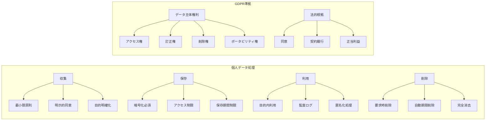
```mermaid
graph LR
    subgraph "個人データ処理"
        A[収集] --> A1[最小限原則]
        A --> A2[明示的同意]
        A --> A3[目的明確化]
        
        B[保存] --> B1[暗号化必須]
        B --> B2[アクセス制限]
        B --> B3[保存期間制限]
        
        C[利用] --> C1[目的内利用]
        C --> C2[監査ログ]
        C --> C3[匿名化処理]
        
        D[削除] --> D1[要求時削除]
        D --> D2[自動期限削除]
        D --> D3[完全消去]
    end
    
    subgraph "GDPR準拠"
        E[データ主体権利] --> E1[アクセス権]
        E --> E2[訂正権]
        E --> E3[削除権]
        E --> E4[ポータビリティ権]
        
        F[法的根拠] --> F1[同意]
        F --> F2[契約履行]
        F --> F3[正当利益]
    end
```

#### 5.3.3 通信セキュリティ

**ネットワークセキュリティ**

| セキュリティ層 | 実装要求 | 技術仕様 |
|---------------|----------|----------|
| **Transport Layer** | TLS 1.3必須 | 最新暗号化スイート |
| **Application Layer** | HTTPS必須 | HSTS有効 |
| **API Security** | JWT + CORS | Token有効期限管理 |
| **Content Security** | CSP適用 | XSS攻撃防止 |

**攻撃対策**

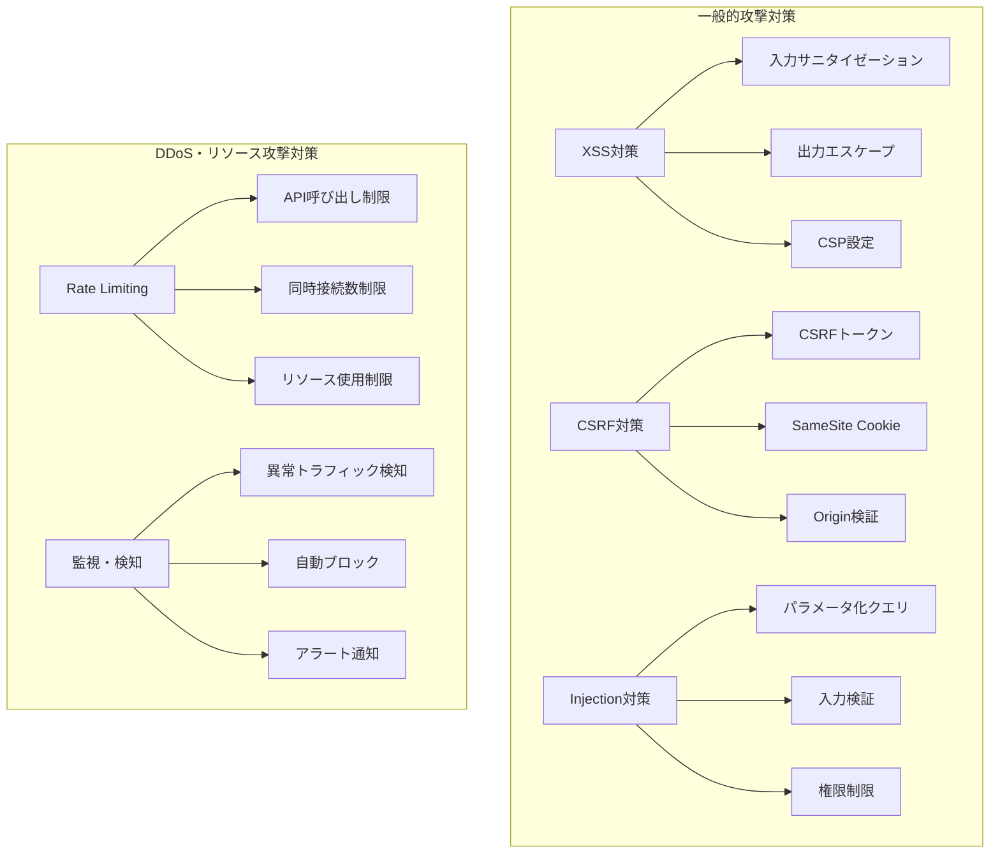
```mermaid
graph TB
    subgraph "一般的攻撃対策"
        A[XSS対策] --> A1[入力サニタイゼーション]
        A --> A2[出力エスケープ]
        A --> A3[CSP設定]
        
        B[CSRF対策] --> B1[CSRFトークン]
        B --> B2[SameSite Cookie]
        B --> B3[Origin検証]
        
        C[Injection対策] --> C1[パラメータ化クエリ]
        C --> C2[入力検証]
        C --> C3[権限制限]
    end
    
    subgraph "DDoS・リソース攻撃対策"
        D[Rate Limiting] --> D1[API呼び出し制限]
        D --> D2[同時接続数制限]
        D --> D3[リソース使用制限]
        
        E[監視・検知] --> E1[異常トラフィック検知]
        E --> E2[自動ブロック]
        E --> E3[アラート通知]
    end
```

## 6章 制約・前提条件 ⭐️⭐️⭐️

本章では、HierarchiDBの設計・実装・運用における技術制約、運用制約、コンプライアンス要求を明確化します。これらの制約は、システムアーキテクチャの決定要因となり、実装選択肢の範囲を定義します。また、将来の拡張性を考慮した制約の設計方針についても説明します。

```mermaid
mindmap
  root((制約・前提条件))
    技術制約
      ブラウザ環境
      JavaScript/TypeScript
      IndexedDB制限
      Worker制限
    運用制約
      クラウド環境
      コスト制約
      人員体制
      時間制約
    コンプライアンス要求
      プライバシー規制
      セキュリティ基準
      業界標準
      監査要求
```

### 6.1 技術制約 ⭐️⭐️⭐️⭐️

#### 6.1.1 ブラウザ環境制約

**対応ブラウザ要求**

| ブラウザ | 最小バージョン | 市場シェア | 対応レベル |
|----------|---------------|-----------|-----------|
| **Chrome** | 90+ | 65% | フル対応 |
| **Firefox** | 88+ | 8% | フル対応 |
| **Safari** | 14+ | 19% | フル対応 |
| **Edge** | 90+ | 4% | フル対応 |
| **Mobile Safari** | 14+ | モバイル主要 | 基本対応 |
| **Chrome Mobile** | 90+ | モバイル主要 | 基本対応 |

**ブラウザAPI依存性**

```mermaid
graph TB
    subgraph "必須API"
        A[IndexedDB] --> A1[トランザクション対応]
        A --> A2[複合インデックス対応]
        A --> A3[バイナリデータ対応]
        
        B[Web Workers] --> B1[ES Modules対応]
        B --> B2[SharedArrayBuffer]
        B --> B3[Comlink互換]
        
        C[ES2020+] --> C1[Optional Chaining]
        C --> C2[Nullish Coalescing]
        C --> C3[BigInt]
    end
    
    subgraph "推奨API"
        D[WebAssembly] --> D1[計算集約処理]
        E[OffscreenCanvas] --> E1[描画処理最適化]
        F[Web Streams] --> F1[大容量データ処理]
    end
    
    subgraph "制約事項"
        G[Storage Quota] --> G1[ユーザー当たり制限]
        H[Memory Limit] --> H1[タブ当たり制限]
        I[CPU Throttling] --> I1[バックグラウンド制限]
    end
```

#### 6.1.2 JavaScript/TypeScript制約

**TypeScript設定制約**

| 設定項目 | 要求値 | 理由 |
|----------|--------|------|
| **target** | ES2020 | モダンブラウザ対応 |
| **lib** | ES2020, DOM, WebWorker | 必要API利用 |
| **strict** | true | 型安全性確保 |
| **noImplicitAny** | true | 明示的型定義 |
| **strictNullChecks** | true | null安全性 |
| **noImplicitReturns** | true | 関数戻り値保証 |

**依存関係制約**

```mermaid
graph TB
    subgraph "Core Dependencies"
        A[React 18+] --> A1[Concurrent Features]
        A --> A2[Hooks API]
        A --> A3[Error Boundaries]
        
        B[Material-UI 5+] --> B1[Theme System v5]
        B --> B2[sx Prop]
        B --> B3[Emotion CSS-in-JS]
        
        C[Dexie 3+] --> C1[Transaction API]
        C --> C2[TypeScript Support]
        C --> C3[Hook Integration]
    end
    
    subgraph "Build Dependencies"
        D[Vite 4+] --> D1[ES Modules]
        D --> D2[Worker Support]
        D --> D3[TypeScript Integration]
        
        E[Turborepo 1+] --> E1[Monorepo Management]
        E --> E2[Parallel Builds]
        E --> E3[Caching]
    end
    
    subgraph "Version Constraints"
        F[Node.js] --> F1[18.0+ LTS]
        G[pnpm] --> G1[8.0+]
        H[TypeScript] --> H1[5.0+]
    end
```

#### 6.1.3 ストレージ・パフォーマンス制約

**IndexedDB制約**

| 制約項目 | 制限値 | 対応策 |
|----------|--------|--------|
| **データベースサイズ** | ユーザー依存（通常1-2GB） | クォータ管理API使用 |
| **単一トランザクションサイズ** | ~100MB | バッチ処理分割 |
| **インデックス数** | テーブル当たり64個 | 複合インデックス活用 |
| **キーサイズ** | 最大2KB | 適切なキー設計 |
| **同時トランザクション** | 3-5個 | 排他制御実装 |

**メモリ使用制約**

```mermaid
graph LR
    subgraph "メモリ使用量目標"
        A[UI Layer] --> A1[200MB以下]
        B[Worker Layer] --> B1[300MB以下]
        C[Data Cache] --> C1[200MB以下]
        D[Working Copies] --> D1[100MB以下]
    end
    
    subgraph "制約対応"
        E[Virtual Scrolling] --> E1[DOM要素制限]
        F[Lazy Loading] --> F1[必要時読み込み]
        G[Cache Eviction] --> G1[LRU方式]
        H[Memory Monitoring] --> H1[使用量追跡]
    end
    
    subgraph "制限値監視"
        I[Warning Level] --> I1[80%使用時]
        J[Critical Level] --> J1[90%使用時]
        K[Emergency Action] --> K1[強制クリア]
    end
    
    A1 --> E
    B1 --> F
    C1 --> G
    D1 --> H
```

### 6.2 運用制約 ⭐️⭐️

#### 6.2.1 クラウド環境制約

**デプロイ環境制約**

| 環境 | プラットフォーム | 制約事項 | 対応方針 |
|------|----------------|----------|----------|
| **Frontend** | GitHub Pages | 静的サイトのみ | SPA設計 |
| **BFF** | Cloudflare Workers | 実行時間制限（30秒） | 非同期処理設計 |
| **CORS Proxy** | Cloudflare Workers | メモリ制限（128MB） | ステートレス設計 |
| **CDN** | Cloudflare | キャッシュ制御制限 | 適切なCache-Control |

**コスト制約**

```mermaid
graph TB
    subgraph "費用構造"
        A[Cloudflare Workers] --> A1[10万リクエスト/月：無料]
        A --> A2[超過分：$0.50/100万リクエスト]
        
        B[GitHub Pages] --> B1[パブリックリポジトリ：無料]
        B --> B2[帯域幅制限：100GB/月]
        
        C[ドメイン・SSL] --> C1[Let's Encrypt：無料]
        C --> C2[Cloudflare SSL：無料]
    end
    
    subgraph "コスト最適化"
        D[キャッシング戦略] --> D1[静的リソース最大化]
        D --> D2[API応答キャッシュ]
        
        E[リクエスト最適化] --> E1[バッチ処理]
        E --> E2[不要リクエスト削減]
        
        F[帯域幅最適化] --> F1[アセット圧縮]
        F --> F2[CDN活用]
    end
```

#### 6.2.2 人員・スキル制約

**開発チーム構成**

| 役割 | 人数 | 必要スキル | 経験年数 |
|------|------|-----------|----------|
| **Tech Lead** | 1名 | TypeScript, React, Architecture | 5年+ |
| **Frontend Developer** | 2名 | React, TypeScript, UI/UX | 3年+ |
| **Backend Developer** | 1名 | Worker API, Database, Security | 3年+ |
| **QA Engineer** | 1名 | Test Automation, E2E Testing | 2年+ |

**スキルギャップ対応**

```mermaid
graph LR
    subgraph "現在のスキル"
        A[React開発] --> A1[Hooks, Context]
        B[TypeScript] --> B1[基本型定義]
        C[テスト] --> C1[Unit Test]
    end
    
    subgraph "必要なスキル"
        D[Advanced TypeScript] --> D1[Branded Types]
        D --> D2[Conditional Types]
        E[Worker API] --> E1[Comlink]
        E --> E2[IndexedDB]
        F[Performance] --> F1[Virtual Scrolling]
        F --> F2[Memory Management]
    end
    
    subgraph "習得計画"
        G[学習期間] --> G1[1-2ヶ月]
        H[実践適用] --> H1[段階的導入]
        I[メンタリング] --> I1[Tech Lead指導]
    end
    
    A --> D
    B --> E
    C --> F
    D --> G
    E --> H
    F --> I
```

#### 6.2.3 時間・リソース制約

**開発スケジュール制約**

| フェーズ | 期間 | 主要成果物 | リスク要因 |
|---------|------|-----------|----------|
| **Phase 1** | 3ヶ月 | Core Architecture, Basic UI | 技術学習コスト |
| **Phase 2** | 2ヶ月 | Plugin System, Advanced UI | 複雑性増大 |
| **Phase 3** | 2ヶ月 | Performance Optimization | パフォーマンス目標 |
| **Phase 4** | 1ヶ月 | Production Deployment | 運用準備 |

**リソース制約マトリクス**

```mermaid
graph TB
    subgraph "時間制約"
        A[開発期間] --> A1[8ヶ月固定]
        A --> A2[マイルストーン必達]
        
        B[テスト期間] --> B1[各フェーズ20%]
        B --> B2[統合テスト1ヶ月]
    end
    
    subgraph "人的リソース制約"
        C[開発者稼働] --> C1[平均80%稼働]
        C --> C2[学習時間20%確保]
        
        D[外部協力] --> D1[UI/UXデザイナー]
        D --> D2[セキュリティ監査]
    end
    
    subgraph "技術リソース制約"
        E[開発環境] --> E1[個人PC利用]
        E --> E2[クラウド開発環境]
        
        F[テスト環境] --> F1[GitHub Actions]
        F --> F2[限定並列実行]
    end
```


## 7章 開発者向け注意点・コーディングルール

本章では、HierarchiDB開発における具体的なコーディングルール、注意点、ベストプラクティスを詳説します。型安全性の確保、エラーハンドリング、パフォーマンス最適化、リファクタリング手法など、開発品質を維持するための実践的なガイドラインを提供します。

```mermaid
mindmap
  root((開発者向けルール))
    型安全性規則
      Branded Types
      型ガード
      No any禁止
      Null安全性
    コード品質規則
      エラーハンドリング
      メモリ管理
      パフォーマンス
      可読性
    実装パターン
      アーキテクチャ遵守
      リファクタリング
      テスト戦略
      文書化
```

### 7.1 型安全性規則

#### 7.1.1 Branded Types 必須使用

**HierarchiDBでは、IDの型安全性を確保するためにBranded Typesを必須とします。**

```typescript
// ✅ 正しい使用法
type NodeId = string & { readonly __brand: 'NodeId' };
type TreeId = string & { readonly __brand: 'TreeId' };
type EntityId = string & { readonly __brand: 'EntityId' };

// ✅ ID生成時のキャスト
const nodeId = generateNodeId() as NodeId;
const treeId = crypto.randomUUID() as TreeId;

// ✅ 外部データからの変換
const validateNodeIds = (rawIds: string[]): NodeId[] => {
  return rawIds.filter(id => 
    typeof id === 'string' && id.length > 0
  ) as NodeId[];
};

// ❌ 禁止: 直接代入
const nodeId: NodeId = 'some-id'; // コンパイルエラー

// ❌ 禁止: any型経由での回避
const nodeId = 'some-id' as any as NodeId; // コードレビューで却下
```

**型ガード関数の実装**

```typescript
// ✅ 型ガード関数の実装例
export function assertNodeId(value: unknown, context?: string): asserts value is NodeId {
  if (typeof value !== 'string' || !value.match(/^node_[a-z0-9]+$/)) {
    throw new Error(`Invalid NodeId${context ? ` in ${context}` : ''}: ${value}`);
  }
}

export function isNodeId(value: unknown): value is NodeId {
  return typeof value === 'string' && value.match(/^node_[a-z0-9]+$/) !== null;
}

// ✅ 使用例
function processNode(rawId: unknown): void {
  assertNodeId(rawId, 'processNode parameter');
  // この時点で rawId は NodeId 型として扱える
  const node = await getNode(rawId);
}
```

#### 7.1.2 any型使用禁止・unknown推奨

**`any`型の使用は完全に禁止し、`unknown`と型ガードを使用します。**

```typescript
// ❌ 禁止: any型の使用
function handleData(data: any): void {
  // 型安全性が失われる
  console.log(data.someProperty);
}

// ✅ 推奨: unknown + 型ガード
function handleData(data: unknown): void {
  if (isObject(data) && 'someProperty' in data) {
    console.log(data.someProperty);
  }
}

// ✅ 型ガード関数の実装
function isObject(value: unknown): value is Record<string, unknown> {
  return typeof value === 'object' && value !== null && !Array.isArray(value);
}

function hasProperty<T extends string>(
  obj: Record<string, unknown>,
  prop: T
): obj is Record<T, unknown> {
  return prop in obj;
}
```

#### 7.1.3 Non-null Assertion禁止

**Non-null assertion (`!`) の使用を禁止し、適切なnull/undefinedチェックを実装します。**

```typescript
// ❌ 禁止: Non-null assertion
function processNode(nodeId: NodeId): void {
  const node = getNode(nodeId)!; // 危険: nullの場合にランタイムエラー
  console.log(node.name);
}

// ✅ 推奨: 適切なnullチェック
function processNode(nodeId: NodeId): void {
  const node = getNode(nodeId);
  if (node === null) {
    throw new Error(`Node not found: ${nodeId}`);
  }
  console.log(node.name);
}

// ✅ 推奨: Optional Chaining使用
function getNodeName(nodeId: NodeId): string | undefined {
  const node = getNode(nodeId);
  return node?.name;
}

// ✅ 推奨: assertion関数使用
function assertNonNull<T>(value: T | null | undefined, message = 'Value is required'): asserts value is T {
  if (value == null) {
    throw new Error(message);
  }
}

function processNode(nodeId: NodeId): void {
  const node = getNode(nodeId);
  assertNonNull(node, `Node not found: ${nodeId}`);
  // この時点で node は非null型として扱える
  console.log(node.name);
}
```

#### 7.1.4 Import Path規則

**モジュール間のimportは厳格なパス規則に従います。**

```typescript
// ✅ 推奨: パッケージ内では ~ エイリアス使用
import { NodeId, TreeNode } from '~/types';
import { validateNode } from '~/utils/validation';
import { DatabaseService } from '~/services/DatabaseService';

// ✅ 推奨: パッケージ間では @hierarchidb スコープ使用
import { CoreTypes } from '@hierarchidb/00-core';
import { WorkerAPI } from '@hierarchidb/01-api';
import { UIComponents } from '@hierarchidb/10-ui-core';

// ❌ 禁止: 相対パス使用
import { NodeId } from '../../../core/types'; // ESLintエラー
import { Component } from '../../ui/Component'; // ESLintエラー

// ❌ 禁止: デフォルトエクスポート混在
import DatabaseService, { NodeService } from '~/services'; // 一貫性なし
```

### 7.2 コード品質規則

#### 7.2.1 エラーハンドリング規則

**統一されたエラーハンドリングパターンを適用します。**

```typescript
// ✅ カスタムエラー型定義
export class HierarchiDBError extends Error {
  constructor(
    message: string,
    public readonly code: string,
    public readonly details?: Record<string, unknown>
  ) {
    super(message);
    this.name = 'HierarchiDBError';
  }
}

export class ValidationError extends HierarchiDBError {
  constructor(field: string, value: unknown, reason: string) {
    super(
      `Validation failed for field '${field}': ${reason}`,
      'VALIDATION_ERROR',
      { field, value, reason }
    );
    this.name = 'ValidationError';
  }
}

// ✅ Result型パターン使用
export type Result<T, E = HierarchiDBError> = {
  success: true;
  data: T;
} | {
  success: false;
  error: E;
};

// ✅ エラーハンドリング実装例
export async function createNode(
  parentId: NodeId,
  nodeData: Partial<TreeNode>
): Promise<Result<NodeId>> {
  try {
    // バリデーション
    if (!nodeData.name) {
      return {
        success: false,
        error: new ValidationError('name', nodeData.name, 'Name is required')
      };
    }

    // ビジネスロジック実行
    const nodeId = await nodeService.create(parentId, nodeData);
    
    return {
      success: true,
      data: nodeId
    };
  } catch (error) {
    // 予期しないエラーもResultで包む
    return {
      success: false,
      error: error instanceof HierarchiDBError 
        ? error 
        : new HierarchiDBError('Unexpected error', 'UNKNOWN_ERROR', { originalError: error })
    };
  }
}

// ✅ Result型の使用
const result = await createNode(parentId, nodeData);
if (!result.success) {
  console.error('Node creation failed:', result.error.message);
  return;
}
// この時点で result.data は NodeId 型として利用可能
console.log('Created node:', result.data);
```

#### 7.2.2 メモリ管理規則

**メモリリークを防ぐための厳格な管理を行います。**

```typescript
// ✅ リソースクリーンアップパターン
export class SubscriptionManager {
  private subscriptions = new Map<string, () => void>();
  private isDisposed = false;

  subscribe(nodeId: NodeId, callback: (event: NodeEvent) => void): string {
    if (this.isDisposed) {
      throw new Error('SubscriptionManager is disposed');
    }

    const subscriptionId = crypto.randomUUID();
    const unsubscribe = workerAPI.subscribeToNode(nodeId, callback);
    
    this.subscriptions.set(subscriptionId, unsubscribe);
    return subscriptionId;
  }

  unsubscribe(subscriptionId: string): void {
    const unsubscribe = this.subscriptions.get(subscriptionId);
    if (unsubscribe) {
      unsubscribe();
      this.subscriptions.delete(subscriptionId);
    }
  }

  dispose(): void {
    if (this.isDisposed) return;

    // すべてのサブスクリプションをクリーンアップ
    for (const unsubscribe of this.subscriptions.values()) {
      unsubscribe();
    }
    this.subscriptions.clear();
    this.isDisposed = true;
  }
}

// ✅ Reactでのクリーンアップ
export function useNodeSubscription(nodeId: NodeId) {
  const [data, setData] = useState<TreeNode | null>(null);
  
  useEffect(() => {
    const manager = new SubscriptionManager();
    const subscriptionId = manager.subscribe(nodeId, (event) => {
      setData(event.node);
    });

    // クリーンアップ関数
    return () => {
      manager.unsubscribe(subscriptionId);
      manager.dispose();
    };
  }, [nodeId]);

  return data;
}

// ✅ WeakMap使用でメモリリーク回避
const nodeCache = new WeakMap<TreeNode, CachedData>();

// ❌ 禁止: 循環参照の作成
interface Node {
  parent?: Node; // 循環参照リスクあり
  children: Node[];
}

// ✅ 推奨: ID参照による循環参照回避
interface TreeNode {
  id: NodeId;
  parentNodeId: NodeId | null;
  childNodeIds: NodeId[];
}
```

#### 7.2.3 パフォーマンス最適化規則

**パフォーマンス要件を満たすための実装パターンを強制します。**

```typescript
// ✅ React最適化パターン
export const TreeNodeComponent = memo(function TreeNodeComponent({
  nodeId,
  onNodeClick
}: {
  nodeId: NodeId;
  onNodeClick: (nodeId: NodeId) => void;
}) {
  // ✅ useMemo で重い計算をメモ化
  const nodeData = useMemo(() => {
    return computeNodeDisplayData(nodeId);
  }, [nodeId]);

  // ✅ useCallback でイベントハンドラーを安定化
  const handleClick = useCallback(() => {
    onNodeClick(nodeId);
  }, [nodeId, onNodeClick]);

  return (
    <div onClick={handleClick}>
      {nodeData.name}
    </div>
  );
});

// ✅ Virtual Scrolling必須（1000件以上のリスト）
export function TreeNodeList({ nodes }: { nodes: TreeNode[] }) {
  // 1000件以上は仮想スクロール必須
  if (nodes.length >= 1000) {
    return <VirtualizedTreeNodeList nodes={nodes} />;
  }
  
  return (
    <div>
      {nodes.map(node => (
        <TreeNodeComponent key={node.id} nodeId={node.id} />
      ))}
    </div>
  );
}

// ✅ 効率的なデータアクセスパターン
export class NodeService {
  private cache = new LRUCache<NodeId, TreeNode>(10000);

  async getNode(nodeId: NodeId): Promise<TreeNode | null> {
    // キャッシュから取得を試行
    const cached = this.cache.get(nodeId);
    if (cached) {
      return cached;
    }

    // データベースから取得
    const node = await this.db.nodes.get(nodeId);
    if (node) {
      this.cache.set(nodeId, node);
    }
    
    return node || null;
  }

  // ✅ バッチ処理で効率化
  async getNodes(nodeIds: NodeId[]): Promise<TreeNode[]> {
    const results: TreeNode[] = [];
    const uncachedIds: NodeId[] = [];

    // キャッシュヒット分を先に処理
    for (const nodeId of nodeIds) {
      const cached = this.cache.get(nodeId);
      if (cached) {
        results.push(cached);
      } else {
        uncachedIds.push(nodeId);
      }
    }

    // 残りをバッチで取得
    if (uncachedIds.length > 0) {
      const nodes = await this.db.nodes.bulkGet(uncachedIds);
      for (const node of nodes.filter(Boolean)) {
        this.cache.set(node.id, node);
        results.push(node);
      }
    }

    return results;
  }
}
```

#### 7.2.4 可読性・保守性規則

**一貫性のあるコードスタイルと可読性を確保します。**

```typescript
// ✅ 関数の責務を明確に分離
class TreeMutationService {
  // ✅ 単一責務の原則
  async createNode(parentId: NodeId, nodeData: CreateNodeData): Promise<Result<NodeId>> {
    const validationResult = this.validateNodeData(nodeData);
    if (!validationResult.success) {
      return validationResult;
    }

    const nodeId = this.generateNodeId();
    const node = this.buildTreeNode(nodeId, parentId, nodeData);
    
    return await this.persistNode(node);
  }

  // ✅ プライベートメソッドで実装を隠蔽
  private validateNodeData(nodeData: CreateNodeData): Result<void> {
    if (!nodeData.name?.trim()) {
      return {
        success: false,
        error: new ValidationError('name', nodeData.name, 'Node name is required')
      };
    }
    return { success: true, data: undefined };
  }

  private generateNodeId(): NodeId {
    return `node_${crypto.randomUUID().replace(/-/g, '')}` as NodeId;
  }

  private buildTreeNode(nodeId: NodeId, parentId: NodeId, data: CreateNodeData): TreeNode {
    return {
      id: nodeId,
      parentNodeId: parentId,
      name: data.name.trim(),
      nodeType: data.nodeType,
      createdAt: Date.now(),
      updatedAt: Date.now(),
      version: 1,
    };
  }

  private async persistNode(node: TreeNode): Promise<Result<NodeId>> {
    try {
      await this.db.transaction('rw', this.db.nodes, async () => {
        await this.db.nodes.add(node);
        await this.updateParentChildReferences(node);
      });
      
      return { success: true, data: node.id };
    } catch (error) {
      return {
        success: false,
        error: new HierarchiDBError(
          'Failed to persist node',
          'PERSISTENCE_ERROR',
          { nodeId: node.id, error }
        )
      };
    }
  }
}

// ✅ 定数定義は明確にグループ化
export const TREE_CONSTANTS = {
  MAX_DEPTH: 100,
  MAX_CHILDREN: 10000,
  MAX_NAME_LENGTH: 255,
  RESERVED_NODE_NAMES: ['root', 'trash'] as const,
} as const;

// ✅ 型定義は明確に分離
export interface CreateNodeData {
  readonly name: string;
  readonly nodeType: string;
  readonly description?: string;
  readonly metadata?: Record<string, unknown>;
}

// ✅ コメントは「なぜ」を説明、「何を」は避ける
// ❌ 悪いコメント例
// node.name を取得する
const name = node.name;

// ✅ 良いコメント例  
// UIで表示するため、特殊文字をエスケープ
const displayName = escapeHtml(node.name);

// ✅ 複雑なロジックは意図を説明
// Working Copyパターンにより、元データへの影響なしに編集を実現
const workingCopy = await this.createWorkingCopy(originalNode);
```

### 7.3 実装パターン

#### 7.3.1 アーキテクチャ遵守規則

**4層アーキテクチャへの厳格な準拠を要求します。**

```typescript
// ✅ UI Layer: Worker APIのみ使用、直接DB操作禁止
export function useTreeData(treeId: TreeId) {
  const [nodes, setNodes] = useState<TreeNode[]>([]);
  
  useEffect(() => {
    // ✅ Worker API経由でのみデータ取得
    workerAPI.getTreeNodes(treeId).then(result => {
      if (result.success) {
        setNodes(result.data);
      }
    });
    
    // ❌ 禁止: UI LayerからのDB直接アクセス
    // const db = new Dexie('hierarchidb');
    // db.nodes.where('treeId').equals(treeId).toArray();
  }, [treeId]);

  return nodes;
}

// ✅ Worker Layer: ビジネスロジックとDB操作を分離
export class TreeQueryService {
  constructor(
    private readonly coreDB: CoreDB,
    private readonly ephemeralDB: EphemeralDB
  ) {}

  async getTreeNodes(treeId: TreeId): Promise<Result<TreeNode[]>> {
    try {
      // ✅ データベース層への依存は注入されたインスタンス経由
      const nodes = await this.coreDB.nodes
        .where('treeId')
        .equals(treeId)
        .and(node => node.removedAt === null)
        .toArray();
      
      return { success: true, data: nodes };
    } catch (error) {
      return {
        success: false,
        error: new HierarchiDBError('Failed to get tree nodes', 'DB_ERROR', { treeId, error })
      };
    }
  }

  // ❌ 禁止: Worker LayerからのUI要素操作
  // private showNotification(message: string) {
  //   toast.success(message); // UIはWorker Layerで扱わない
  // }
}

// ✅ Database Layer: データアクセスのみに集中
export class CoreDB extends Dexie {
  nodes!: Table<TreeNodeEntity, NodeId>;
  trees!: Table<TreeEntity, TreeId>;

  constructor() {
    super('HierarchiDB_Core');
    this.version(1).stores({
      nodes: '&id, parentNodeId, treeId, [parentNodeId+name], removedAt',
      trees: '&id, name, createdAt'
    });

    // ✅ データベース層はビジネスロジックを持たない
    // バリデーションやビジネス制約はWorker Layerで実装
  }
}
```

#### 7.3.2 リファクタリング手法

**安全なリファクタリングのためのプロセスを定義します。**

```typescript
// ✅ Deprecation Pattern: 段階的移行
export class NodeService {
  /**
   * @deprecated Use `getNodeById()` instead. Will be removed in v2.0.
   * Migration guide: replace `getNode(id)` with `getNodeById(id)`
   */
  async getNode(nodeId: NodeId): Promise<TreeNode | null> {
    // 旧実装を新実装にデリゲート
    return this.getNodeById(nodeId);
  }

  // ✅ 新しいメソッド
  async getNodeById(nodeId: NodeId): Promise<TreeNode | null> {
    const result = await this.nodeRepository.findById(nodeId);
    return result.success ? result.data : null;
  }
}

// ✅ Codemods使用推奨
// 大規模なリファクタリングはコードモッドツールで実行

// ✅ Feature Flag Pattern
export class FeatureFlags {
  private static flags = {
    NEW_TREE_RENDERING: process.env.ENABLE_NEW_TREE_RENDERING === 'true',
    EXPERIMENTAL_SEARCH: process.env.ENABLE_EXPERIMENTAL_SEARCH === 'true',
  };

  static isEnabled(flag: keyof typeof FeatureFlags.flags): boolean {
    return FeatureFlags.flags[flag] ?? false;
  }
}

// 使用例
export function TreeComponent() {
  if (FeatureFlags.isEnabled('NEW_TREE_RENDERING')) {
    return <NewTreeRenderer />;
  }
  return <LegacyTreeRenderer />;
}
```

#### 7.3.3 テスト戦略

**テスト駆動開発を前提とした実装パターンを適用します。**

```typescript
// ✅ テスタブルな設計
export class NodeValidator {
  // ✅ 純粋関数として実装（副作用なし）
  static validateNodeName(name: string): Result<void> {
    if (!name.trim()) {
      return {
        success: false,
        error: new ValidationError('name', name, 'Name cannot be empty')
      };
    }

    if (name.length > TREE_CONSTANTS.MAX_NAME_LENGTH) {
      return {
        success: false,
        error: new ValidationError('name', name, 'Name is too long')
      };
    }

    return { success: true, data: undefined };
  }

  // ✅ 依存関係注入でテスト容易性確保
  constructor(private readonly reservedNames: ReadonlySet<string>) {}

  validateUniqueness(name: string, siblings: readonly TreeNode[]): Result<void> {
    const normalizedName = name.trim().toLowerCase();
    
    if (this.reservedNames.has(normalizedName)) {
      return {
        success: false,
        error: new ValidationError('name', name, 'Name is reserved')
      };
    }

    const duplicate = siblings.find(sibling => 
      sibling.name.toLowerCase() === normalizedName
    );

    if (duplicate) {
      return {
        success: false,
        error: new ValidationError('name', name, 'Name must be unique among siblings')
      };
    }

    return { success: true, data: undefined };
  }
}

// ✅ テストコード例
describe('NodeValidator', () => {
  const validator = new NodeValidator(new Set(['root', 'trash']));

  describe('validateNodeName', () => {
    it('should reject empty names', () => {
      const result = NodeValidator.validateNodeName('');
      expect(result.success).toBe(false);
      expect(result.error).toBeInstanceOf(ValidationError);
    });

    it('should accept valid names', () => {
      const result = NodeValidator.validateNodeName('Valid Name');
      expect(result.success).toBe(true);
    });
  });

  describe('validateUniqueness', () => {
    it('should reject reserved names', () => {
      const result = validator.validateUniqueness('root', []);
      expect(result.success).toBe(false);
    });

    it('should reject duplicate names', () => {
      const siblings = [
        { name: 'Existing', id: 'node1' as NodeId } as TreeNode
      ];
      const result = validator.validateUniqueness('existing', siblings);
      expect(result.success).toBe(false);
    });
  });
});
```

#### 7.3.4 文書化規則

**コードの意図と設計判断を適切に文書化します。**

```typescript
/**
 * Working Copy パターンを実装するサービス
 * 
 * このパターンにより、元データに影響を与えることなく編集を行い、
 * 明示的なコミットまたは破棄によって変更を制御する。
 * 
 * @example
 * ```typescript
 * const session = await workingCopyService.startEdit(nodeId);
 * await workingCopyService.updateWorkingCopy(session.workingCopyId, changes);
 * await workingCopyService.commitChanges(session.workingCopyId);
 * ```
 */
export class WorkingCopyService {
  /**
   * ノードの編集セッションを開始する
   * 
   * @param sourceNodeId - 編集対象のノードID
   * @returns 編集セッション情報。workingCopyIdを含む
   * @throws {ValidationError} sourceNodeIdが無効な場合
   * @throws {NotFoundError} 指定されたノードが存在しない場合
   * 
   * @performance O(1) - インデックスによる単一ノード取得
   * @sideEffect EphemeralDBにworking copyレコードを作成
   */
  async startEdit(sourceNodeId: NodeId): Promise<EditSession> {
    // 実装...
  }

  /**
   * Working Copyの変更をコミットしてCoreDBに反映する
   * 
   * @param workingCopyId - コミット対象のworking copy ID
   * @returns コミット結果
   * 
   * @throws {ConcurrencyError} 元ノードが他で変更されている場合
   * @throws {ValidationError} working copyデータが無効な場合
   * 
   * @transactional CoreDBとEphemeralDBの両方でトランザクション実行
   * @performance O(1) for single node, O(n) for subtree operations
   */
  async commitChanges(workingCopyId: NodeId): Promise<Result<void>> {
    // 実装...
  }
}

// ✅ 複雑なアルゴリズムには詳細説明
/**
 * LRU (Least Recently Used) キャッシュ実装
 * 
 * 双方向リンクリストとハッシュマップを組み合わせて、
 * O(1)での挿入・削除・検索を実現している。
 * 
 * アルゴリズム：
 * - get: ノードをリストの先頭に移動（最近使用をマーク）
 * - set: 先頭に新ノード追加、容量超過時は末尾から削除
 * 
 * @template K キーの型
 * @template V 値の型
 */
export class LRUCache<K, V> {
  // 実装...
}
```

---

**まとめ**

第2部では、HierarchiDBの要求仕様を機能要求、非機能要求、制約条件、開発者向けルールの4つの観点から包括的に定義しました。特に7章の開発者向けルールは、実装品質の一貫性を保つための具体的なガイドラインを提供します。これらの規則に従うことで、型安全性、保守性、パフォーマンスを確保した高品質なコードベースを維持できます。

次の第3部では、これらの要求を実現するための環境・ツールセットについて詳述します。