# 第3部 環境・ツールセット

## 7章 開発環境 ⭐️⭐️⭐️⭐️⭐️

本章では、HierarchiDB開発に使用するツールチェーン、ビルドシステム、品質管理ツールについて詳説します。開発効率の最大化、コード品質の維持、チーム間の一貫性確保を目的とした統合開発環境の構築方法と、各ツールの役割・設定・運用方針を説明します。

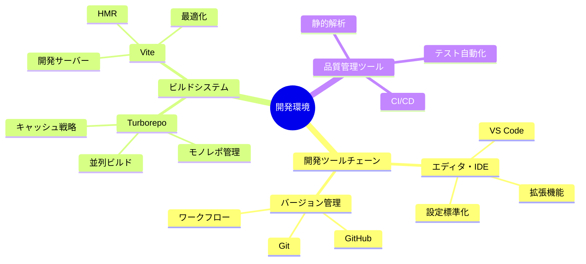
```mermaid
mindmap
  root((開発環境))
    開発ツールチェーン
      エディタ・IDE
        VS Code
        拡張機能
        設定標準化
      バージョン管理
        Git
        GitHub
        ワークフロー
    ビルドシステム
      Turborepo
        モノレポ管理
        並列ビルド
        キャッシュ戦略
      Vite
        開発サーバー
        HMR
        最適化
    品質管理ツール
      静的解析
      テスト自動化
      CI/CD
```

### 7.1 開発ツールチェーン ⭐️⭐️⭐️⭐️⭐️

#### 7.1.1 統合開発環境（IDE）

**VS Code標準設定**

```json
{
  "editor.formatOnSave": true,
  "editor.codeActionsOnSave": {
    "source.fixAll.eslint": true,
    "source.organizeImports": true
  },
  "typescript.preferences.importModuleSpecifier": "relative",
  "typescript.updateImportsOnFileMove.enabled": "always",
  "files.exclude": {
    "**/node_modules": true,
    "**/dist": true,
    "**/.turbo": true
  },
  "search.exclude": {
    "**/node_modules": true,
    "**/dist": true,
    "**/*.d.ts": true
  }
}
```

**必須拡張機能**

| 拡張機能 | 用途 | 設定ポイント |
|----------|------|-------------|
| **TypeScript Hero** | import自動整理 | 相対パス優先 |
| **ESLint** | 構文チェック | プロジェクト設定連携 |
| **Prettier** | コード整形 | 保存時自動実行 |
| **Thunder Client** | API テスト | Worker API テスト用 |
| **GitLens** | Git 履歴表示 | Blame情報表示 |
| **Todo Tree** | TODO管理 | カスタムタグ設定 |

**開発環境標準化**

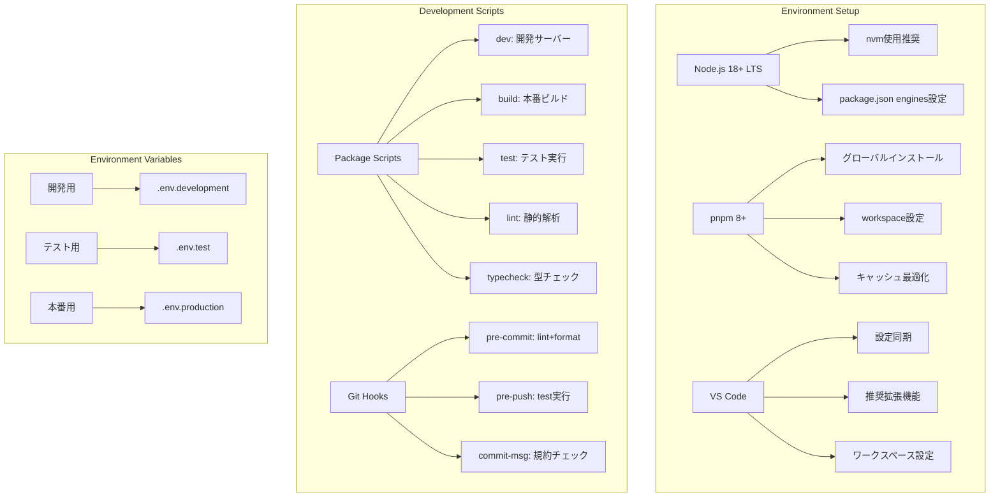
```mermaid
graph TB
    subgraph "Environment Setup"
        A[Node.js 18+ LTS] --> A1[nvm使用推奨]
        A --> A2[package.json engines設定]
        
        B[pnpm 8+] --> B1[グローバルインストール]
        B --> B2[workspace設定]
        B --> B3[キャッシュ最適化]
        
        C[VS Code] --> C1[設定同期]
        C --> C2[推奨拡張機能]
        C --> C3[ワークスペース設定]
    end
    
    subgraph "Development Scripts"
        D[Package Scripts] --> D1[dev: 開発サーバー]
        D --> D2[build: 本番ビルド]
        D --> D3[test: テスト実行]
        D --> D4[lint: 静的解析]
        D --> D5[typecheck: 型チェック]
        
        E[Git Hooks] --> E1[pre-commit: lint+format]
        E --> E2[pre-push: test実行]
        E --> E3[commit-msg: 規約チェック]
    end
    
    subgraph "Environment Variables"
        F[開発用] --> F1[.env.development]
        G[テスト用] --> G1[.env.test]
        H[本番用] --> H1[.env.production]
    end
```

#### 7.1.2 バージョン管理・協業

**Git ワークフロー**

| ブランチタイプ | 命名規則 | 用途 | マージ先 |
|---------------|----------|------|---------|
| **main** | main | 本番リリース | - |
| **develop** | develop | 開発統合 | main |
| **feature** | feature/[issue-number]-[short-desc] | 機能開発 | develop |
| **hotfix** | hotfix/[version]-[short-desc] | 緊急修正 | main, develop |
| **release** | release/[version] | リリース準備 | main, develop |

**コミットメッセージ規約**

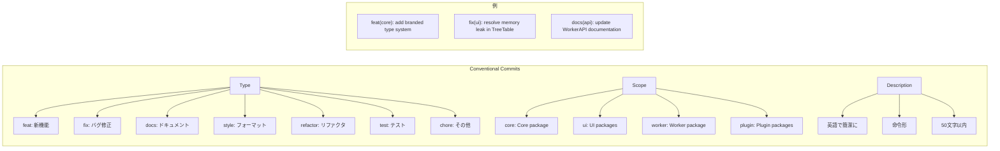
```mermaid
graph LR
    subgraph "Conventional Commits"
        A[Type] --> A1[feat: 新機能]
        A --> A2[fix: バグ修正]
        A --> A3[docs: ドキュメント]
        A --> A4[style: フォーマット]
        A --> A5[refactor: リファクタ]
        A --> A6[test: テスト]
        A --> A7[chore: その他]
        
        B[Scope] --> B1[core: Core package]
        B --> B2[ui: UI packages]
        B --> B3[worker: Worker package]
        B --> B4[plugin: Plugin packages]
        
        C[Description] --> C1[英語で簡潔に]
        C --> C2[命令形]
        C --> C3[50文字以内]
    end
    
    subgraph "例"
        D["feat(core): add branded type system"]
        E["fix(ui): resolve memory leak in TreeTable"]
        F["docs(api): update WorkerAPI documentation"]
    end
```

**プルリクエストプロセス**

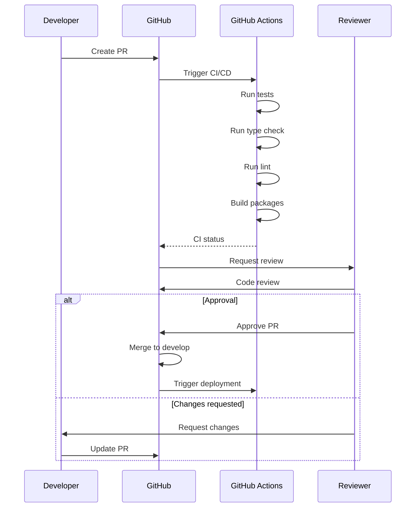
```mermaid
sequenceDiagram
    participant Dev as Developer
    participant GitHub as GitHub
    participant CI as GitHub Actions
    participant Rev as Reviewer
    
    Dev->>GitHub: Create PR
    GitHub->>CI: Trigger CI/CD
    CI->>CI: Run tests
    CI->>CI: Run type check
    CI->>CI: Run lint
    CI->>CI: Build packages
    CI-->>GitHub: CI status
    
    GitHub->>Rev: Request review
    Rev->>GitHub: Code review
    
    alt Approval
        Rev->>GitHub: Approve PR
        GitHub->>GitHub: Merge to develop
        GitHub->>CI: Trigger deployment
    else Changes requested
        Rev->>Dev: Request changes
        Dev->>GitHub: Update PR
    end
```

#### 7.1.3 依存関係管理

**pnpm Workspace構成**

```yaml
# pnpm-workspace.yaml
packages:
  - 'packages/*'
  - 'packages/plugins/*'
  - '!**/test/**'
  - '!**/dist/**'
```

**依存関係戦略**

| 依存関係タイプ | 管理方針 | 更新頻度 |
|---------------|----------|----------|
| **Core Dependencies** | セマンティックバージョニング厳格 | 慎重に更新 |
| **UI Dependencies** | マイナーバージョン自動更新 | 月次 |
| **Development Dependencies** | 最新版積極採用 | 週次 |
| **Security Dependencies** | 即座に更新 | 検知次第 |

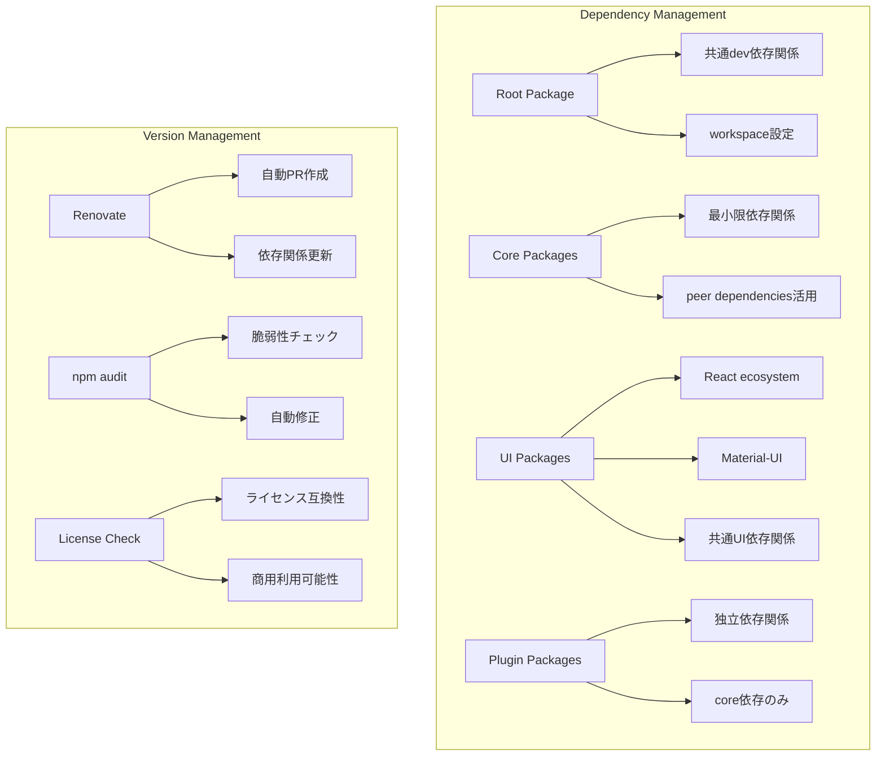
```mermaid
graph TB
    subgraph "Dependency Management"
        A[Root Package] --> A1[共通dev依存関係]
        A --> A2[workspace設定]
        
        B[Core Packages] --> B1[最小限依存関係]
        B --> B2[peer dependencies活用]
        
        C[UI Packages] --> C1[React ecosystem]
        C --> C2[Material-UI]
        C --> C3[共通UI依存関係]
        
        D[Plugin Packages] --> D1[独立依存関係]
        D --> D2[core依存のみ]
    end
    
    subgraph "Version Management"
        E[Renovate] --> E1[自動PR作成]
        E --> E2[依存関係更新]
        
        F[npm audit] --> F1[脆弱性チェック]
        F --> F2[自動修正]
        
        G[License Check] --> G1[ライセンス互換性]
        G --> G2[商用利用可能性]
    end
```

### 7.2 ビルドシステム ⭐️⭐️⭐️⭐️⭐️

#### 7.2.1 Turborepo設定

**モノレポ構成**

```json
{
  "pipeline": {
    "build": {
      "dependsOn": ["^build"],
      "outputs": ["dist/**", ".turbo/**"]
    },
    "dev": {
      "cache": false,
      "persistent": true
    },
    "test": {
      "dependsOn": ["^build"],
      "outputs": ["coverage/**"]
    },
    "lint": {
      "outputs": [".eslintcache"]
    },
    "typecheck": {
      "dependsOn": ["^build"],
      "outputs": ["**/*.tsbuildinfo"]
    }
  }
}
```

**並列ビルド最適化**

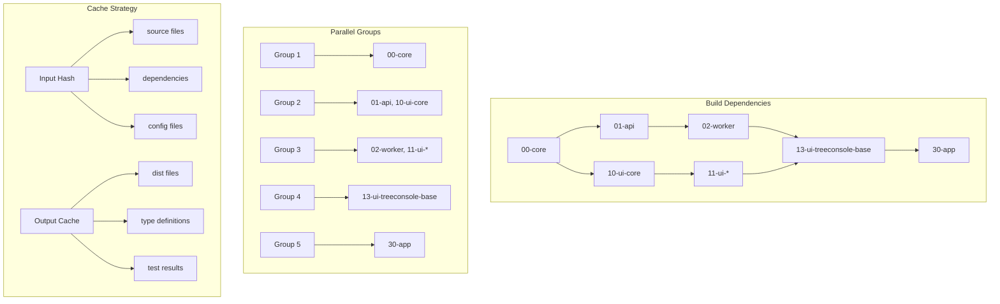
```mermaid
graph TB
    subgraph "Build Dependencies"
        A[00-core] --> B[01-api]
        A --> C[10-ui-core]
        B --> D[02-worker]
        C --> E[11-ui-*]
        D --> F[13-ui-treeconsole-base]
        E --> F
        F --> G[30-app]
    end
    
    subgraph "Parallel Groups"
        H[Group 1] --> H1[00-core]
        I[Group 2] --> I1[01-api, 10-ui-core]
        J[Group 3] --> J1[02-worker, 11-ui-*]
        K[Group 4] --> K1[13-ui-treeconsole-base]
        L[Group 5] --> L1[30-app]
    end
    
    subgraph "Cache Strategy"
        M[Input Hash] --> M1[source files]
        M --> M2[dependencies]
        M --> M3[config files]
        
        N[Output Cache] --> N1[dist files]
        N --> N2[type definitions]
        N --> N3[test results]
    end
```

**パフォーマンス最適化**

| 最適化手法 | 効果 | 設定方法 |
|-----------|------|----------|
| **Remote Cache** | ビルド時間50%短縮 | Vercel/自前キャッシュサーバー |
| **Incremental Builds** | 変更差分のみビルド | tsconfig.json設定 |
| **Parallel Execution** | CPU活用率向上 | --parallel フラグ |
| **Dependency Pruning** | 不要な依存関係除外 | 依存関係グラフ解析 |

#### 7.2.2 Vite設定最適化

**開発環境設定**

```typescript
// vite.config.ts
export default defineConfig({
  plugins: [
    react(),
    dts({
      insertTypesEntry: true,
      exclude: ['**/*.test.*', '**/test/**']
    })
  ],
  build: {
    lib: {
      entry: resolve(__dirname, 'src/openstreetmap-type.ts'),
      formats: ['es', 'cjs'],
      fileName: (format) => `index.${format === 'es' ? 'js' : 'cjs'}`
    },
    rollupOptions: {
      external: ['react', 'react-dom', '@mui/material'],
      output: {
        globals: {
          react: 'React',
          'react-dom': 'ReactDOM'
        }
      }
    }
  },
  worker: {
    format: 'es',
    plugins: [
      // Worker専用プラグイン
    ]
  }
});
```

**最適化設定**

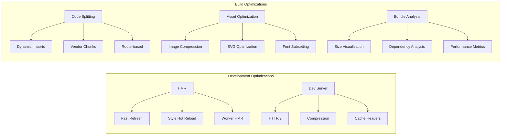
```mermaid
graph LR
    subgraph "Development Optimizations"
        A[HMR] --> A1[Fast Refresh]
        A --> A2[Style Hot Reload]
        A --> A3[Worker HMR]
        
        B[Dev Server] --> B1[HTTP/2]
        B --> B2[Compression]
        B --> B3[Cache Headers]
    end
    
    subgraph "Build Optimizations"
        C[Code Splitting] --> C1[Dynamic Imports]
        C --> C2[Vendor Chunks]
        C --> C3[Route-based]
        
        D[Asset Optimization] --> D1[Image Compression]
        D --> D2[SVG Optimization]
        D --> D3[Font Subsetting]
        
        E[Bundle Analysis] --> E1[Size Visualization]
        E --> E2[Dependency Analysis]
        E --> E3[Performance Metrics]
    end
```

#### 7.2.3 TypeScript設定

**tsconfig階層構造**

```json
{
  "extends": "./tsconfig.base.json",
  "compilerOptions": {
    "composite": true,
    "declaration": true,
    "declarationMap": true,
    "incremental": true,
    "tsBuildInfoFile": "./.turbo/tsconfig.tsbuildinfo"
  },
  "references": [
    {"path": "./packages/00-core"},
    {"path": "./packages/01-api"},
    {"path": "./packages/02-worker"}
  ]
}
```

**型定義管理**

| 設定項目 | 値 | 目的 |
|----------|---|------|
| **strict** | true | 厳格な型チェック |
| **noImplicitAny** | true | any型の暗黙的使用禁止 |
| **strictNullChecks** | true | null/undefined厳格チェック |
| **noImplicitReturns** | true | 戻り値の型保証 |
| **exactOptionalPropertyTypes** | true | オプショナルプロパティ厳格化 |

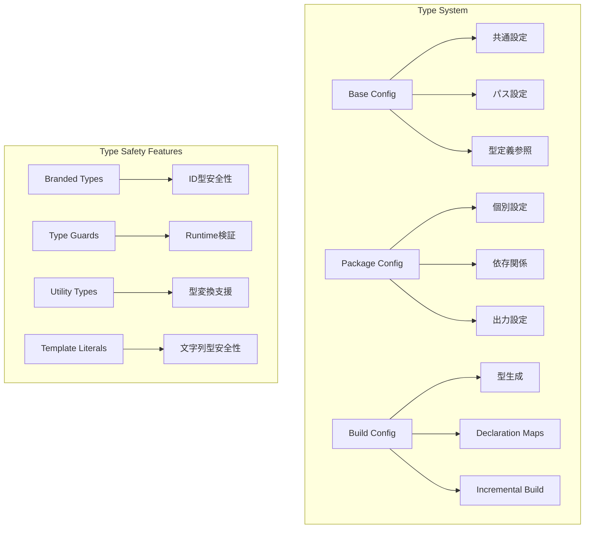
```mermaid
graph TB
    subgraph "Type System"
        A[Base Config] --> A1[共通設定]
        A --> A2[パス設定]
        A --> A3[型定義参照]
        
        B[Package Config] --> B1[個別設定]
        B --> B2[依存関係]
        B --> B3[出力設定]
        
        C[Build Config] --> C1[型生成]
        C --> C2[Declaration Maps]
        C --> C3[Incremental Build]
    end
    
    subgraph "Type Safety Features"
        D[Branded Types] --> D1[ID型安全性]
        E[Type Guards] --> E1[Runtime検証]
        F[Utility Types] --> F1[型変換支援]
        G[Template Literals] --> G1[文字列型安全性]
    end
```

### 7.3 品質管理ツール ⭐️⭐️⭐️⭐️

#### 7.3.1 静的解析ツール

**ESLint設定**

```json
{
  "extends": [
    "@typescript-eslint/recommended",
    "@typescript-eslint/recommended-requiring-type-checking",
    "plugin:react/recommended",
    "plugin:react-hooks/recommended"
  ],
  "rules": {
    "@typescript-eslint/no-explicit-any": "error",
    "@typescript-eslint/no-unused-vars": "error",
    "@typescript-eslint/prefer-readonly": "error",
    "react/react-in-jsx-scope": "off",
    "import/order": ["error", {
      "groups": ["builtin", "external", "internal", "parent", "sibling"],
      "pathGroups": [
        {
          "pattern": "~/**",
          "group": "internal"
        }
      ]
    }]
  }
}
```

**品質メトリクス**

| メトリクス | 目標値 | 測定ツール | 対応アクション |
|-----------|--------|-----------|---------------|
| **Type Coverage** | >95% | type-coverage | 型定義追加 |
| **Test Coverage** | >80% | Istanbul/c8 | テスト追加 |
| **Code Complexity** | <10 | ESLint complexity | リファクタリング |
| **Bundle Size** | <2MB | Bundlephobia | 依存関係見直し |
| **Performance Score** | >90 | Lighthouse | 最適化実施 |

**自動品質チェック**

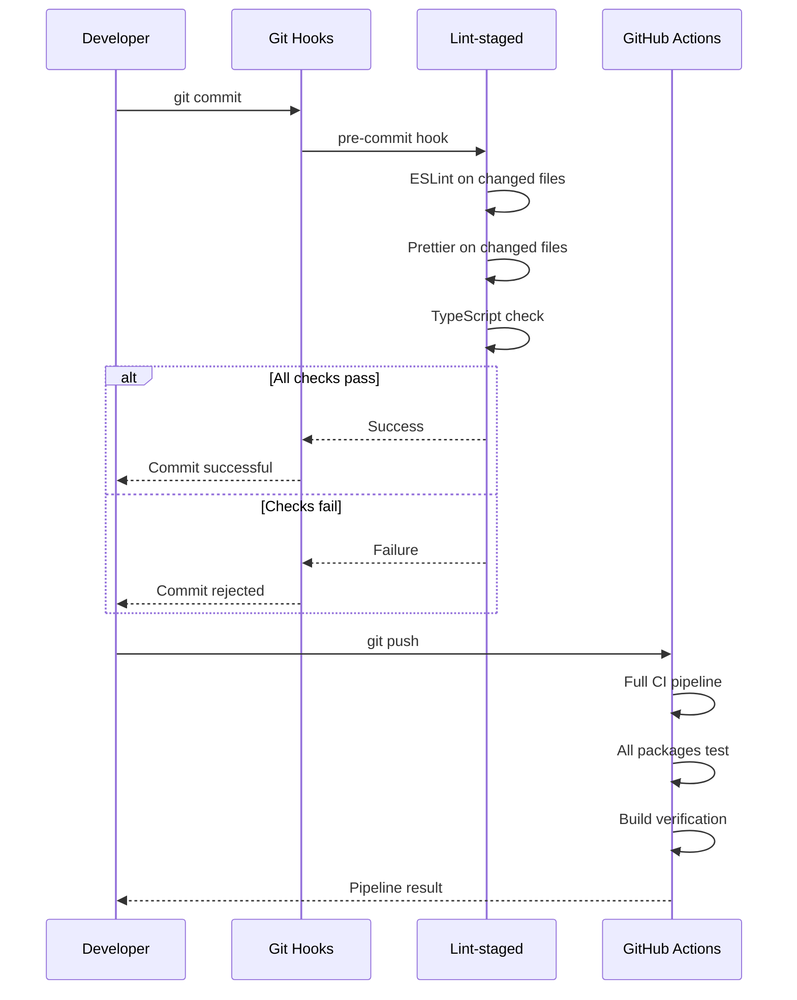
```mermaid
sequenceDiagram
    participant Dev as Developer
    participant Husky as Git Hooks
    participant Lint as Lint-staged
    participant CI as GitHub Actions
    
    Dev->>Husky: git commit
    Husky->>Lint: pre-commit hook
    Lint->>Lint: ESLint on changed files
    Lint->>Lint: Prettier on changed files
    Lint->>Lint: TypeScript check
    
    alt All checks pass
        Lint-->>Husky: Success
        Husky-->>Dev: Commit successful
    else Checks fail
        Lint-->>Husky: Failure
        Husky-->>Dev: Commit rejected
    end
    
    Dev->>CI: git push
    CI->>CI: Full CI pipeline
    CI->>CI: All packages test
    CI->>CI: Build verification
    CI-->>Dev: Pipeline result
```

#### 7.3.2 テスト自動化

**テスト階層構造**

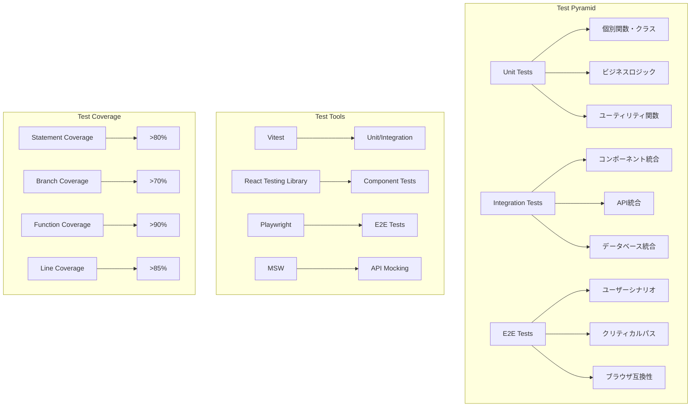
```mermaid
graph TB
    subgraph "Test Pyramid"
        A[Unit Tests] --> A1[個別関数・クラス]
        A --> A2[ビジネスロジック]
        A --> A3[ユーティリティ関数]
        
        B[Integration Tests] --> B1[コンポーネント統合]
        B --> B2[API統合]
        B --> B3[データベース統合]
        
        C[E2E Tests] --> C1[ユーザーシナリオ]
        C --> C2[クリティカルパス]
        C --> C3[ブラウザ互換性]
    end
    
    subgraph "Test Tools"
        D[Vitest] --> D1[Unit/Integration]
        E[React Testing Library] --> E1[Component Tests]
        F[Playwright] --> F1[E2E Tests]
        G[MSW] --> G1[API Mocking]
    end
    
    subgraph "Test Coverage"
        H[Statement Coverage] --> H1[>80%]
        I[Branch Coverage] --> I1[>70%]
        J[Function Coverage] --> J1[>90%]
        K[Line Coverage] --> K1[>85%]
    end
```

**テスト設定**

| テストタイプ | ツール | 設定ファイル | 実行環境 |
|-------------|-------|-------------|----------|
| **Unit Test** | Vitest | vitest.config.ts | jsdom |
| **Component Test** | Vitest + RTL | vitest.workspace.ts | jsdom |
| **Integration Test** | Vitest | vitest.integration.config.ts | node |
| **E2E Test** | Playwright | playwright.config.ts | browsers |

#### 7.3.3 CI/CD パイプライン

**GitHub Actions ワークフロー**

```yaml
name: CI/CD Pipeline
on:
  push:
    branches: [main, develop]
  pull_request:
    branches: [main, develop]

jobs:
  quality:
    runs-on: ubuntu-latest
    steps:
      - uses: actions/checkout@v4
      - uses: actions/setup-node@v4
        with:
          node-version: '18'
      - uses: pnpm/action-setup@v2
        with:
          version: '8'
      - name: Install dependencies
        run: pnpm install --frozen-lockfile
      - name: Type check
        run: pnpm typecheck
      - name: Lint
        run: pnpm lint
      - name: Unit tests
        run: pnpm test:run
      - name: Build
        run: pnpm build

  e2e:
    needs: quality
    runs-on: ubuntu-latest
    steps:
      - uses: actions/checkout@v4
      - name: E2E tests
        run: pnpm e2e:ci

  deploy:
    needs: [quality, e2e]
    if: github.ref == 'refs/heads/main'
    runs-on: ubuntu-latest
    steps:
      - name: Deploy to production
        run: pnpm deploy:prod
```

**パイプライン最適化**

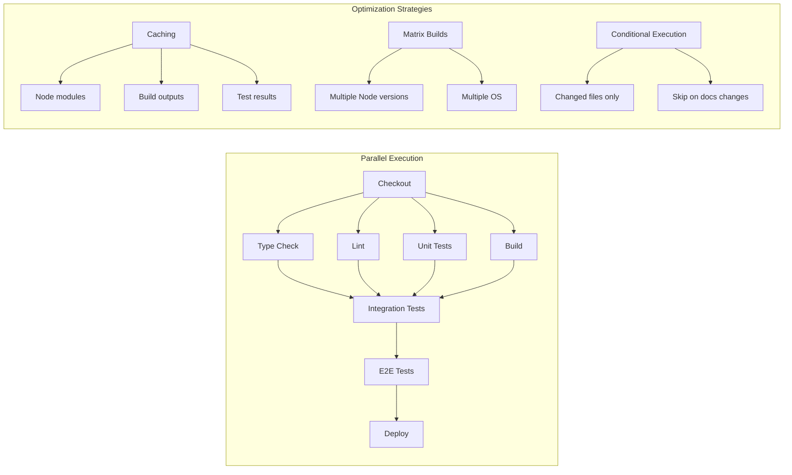
```mermaid
graph LR
    subgraph "Parallel Execution"
        A[Checkout] --> B1[Type Check]
        A --> B2[Lint]
        A --> B3[Unit Tests]
        A --> B4[Build]
        
        B1 --> C[Integration Tests]
        B2 --> C
        B3 --> C
        B4 --> C
        
        C --> D[E2E Tests]
        D --> E[Deploy]
    end
    
    subgraph "Optimization Strategies"
        F[Caching] --> F1[Node modules]
        F --> F2[Build outputs]
        F --> F3[Test results]
        
        G[Matrix Builds] --> G1[Multiple Node versions]
        G --> G2[Multiple OS]
        
        H[Conditional Execution] --> H1[Changed files only]
        H --> H2[Skip on docs changes]
    end
```

## 8章 実行環境 ⭐️⭐️⭐️⭐️

本章では、HierarchiDBが動作するブラウザ環境、クラウドインフラストラクチャ、および外部依存関係について詳説します。実行環境の要求事項、制約、最適化戦略、そして安定した運用を実現するための環境構成について説明します。

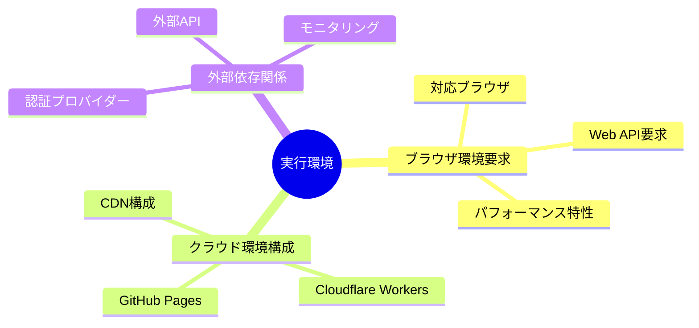
```mermaid
mindmap
  root((実行環境))
    ブラウザ環境要求
      対応ブラウザ
      Web API要求
      パフォーマンス特性
    クラウド環境構成
      GitHub Pages
      Cloudflare Workers
      CDN構成
    外部依存関係
      認証プロバイダー
      外部API
      モニタリング
```

### 8.1 ブラウザ環境要求 ⭐️⭐️⭐️⭐️⭐️

#### 8.1.1 対応ブラウザ仕様

**ブラウザサポートマトリクス**

| ブラウザ | 最小バージョン | 推奨バージョン | 市場シェア | 対応レベル | テスト頻度 |
|----------|---------------|---------------|-----------|-----------|-----------|
| **Chrome** | 90 | Latest | 65% | フル対応 | 毎リリース |
| **Firefox** | 88 | Latest | 8% | フル対応 | 毎リリース |
| **Safari** | 14 | Latest | 19% | フル対応 | メジャーリリース |
| **Edge** | 90 | Latest | 4% | フル対応 | メジャーリリース |
| **Chrome Mobile** | 90 | Latest | モバイル主要 | 基本対応 | メジャーリリース |
| **Safari Mobile** | 14 | Latest | モバイル主要 | 基本対応 | メジャーリリース |

**ブラウザ機能要求**

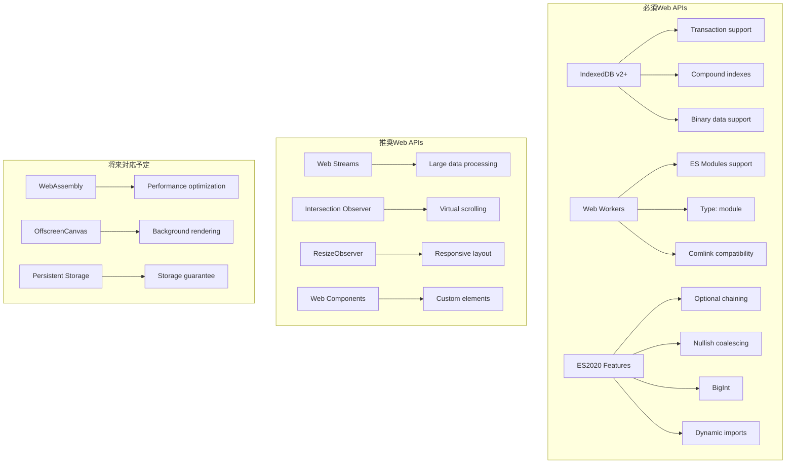
```mermaid
graph TB
    subgraph "必須Web APIs"
        A[IndexedDB v2+] --> A1[Transaction support]
        A --> A2[Compound indexes]
        A --> A3[Binary data support]
        
        B[Web Workers] --> B1[ES Modules support]
        B --> B2[Type: module]
        B --> B3[Comlink compatibility]
        
        C[ES2020 Features] --> C1[Optional chaining]
        C --> C2[Nullish coalescing]
        C --> C3[BigInt]
        C --> C4[Dynamic imports]
    end
    
    subgraph "推奨Web APIs"
        D[Web Streams] --> D1[Large data processing]
        E[Intersection Observer] --> E1[Virtual scrolling]
        F[ResizeObserver] --> F1[Responsive layout]
        G[Web Components] --> G1[Custom elements]
    end
    
    subgraph "将来対応予定"
        H[WebAssembly] --> H1[Performance optimization]
        I[OffscreenCanvas] --> I1[Background rendering]
        J[Persistent Storage] --> J1[Storage guarantee]
    end
```

#### 8.1.2 ストレージ・リソース制限

**ブラウザストレージ制限**

| ストレージタイプ | 一般的な制限 | 制限の種類 | 対応策 |
|-----------------|-------------|-----------|--------|
| **IndexedDB** | 利用可能容量の50% | 動的制限 | Quota Management API |
| **LocalStorage** | 5-10MB | 固定制限 | 重要データのみ保存 |
| **SessionStorage** | 5-10MB | 固定制限 | UI状態の一時保存 |
| **Cache API** | 利用可能容量の50% | 動的制限 | キャッシュローテーション |

**メモリ・CPU制限対応**

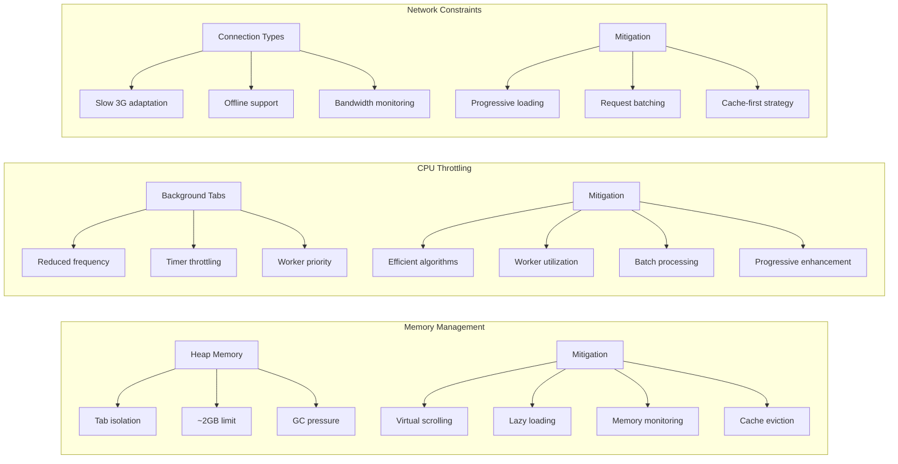
```mermaid
graph LR
    subgraph "Memory Management"
        A[Heap Memory] --> A1[Tab isolation]
        A --> A2[~2GB limit]
        A --> A3[GC pressure]
        
        B[Mitigation] --> B1[Virtual scrolling]
        B --> B2[Lazy loading]
        B --> B3[Memory monitoring]
        B --> B4[Cache eviction]
    end
    
    subgraph "CPU Throttling"
        C[Background Tabs] --> C1[Reduced frequency]
        C --> C2[Timer throttling]
        C --> C3[Worker priority]
        
        D[Mitigation] --> D1[Efficient algorithms]
        D --> D2[Worker utilization]
        D --> D3[Batch processing]
        D --> D4[Progressive enhancement]
    end
    
    subgraph "Network Constraints"
        E[Connection Types] --> E1[Slow 3G adaptation]
        E --> E2[Offline support]
        E --> E3[Bandwidth monitoring]
        
        F[Mitigation] --> F1[Progressive loading]
        F --> F2[Request batching]
        F --> F3[Cache-first strategy]
    end
```

#### 8.1.3 パフォーマンス特性

**レンダリングパフォーマンス**

| 指標 | 目標値 | 測定方法 | 最適化手法 |
|------|--------|----------|-----------|
| **First Contentful Paint** | <1.5秒 | Lighthouse | Critical CSS inlining |
| **Largest Contentful Paint** | <2.5秒 | Web Vitals | Image optimization |
| **Cumulative Layout Shift** | <0.1 | Web Vitals | Size reservation |
| **First Input Delay** | <100ms | Web Vitals | Code splitting |
| **Time to Interactive** | <3秒 | Lighthouse | Bundle optimization |

**JavaScript実行パフォーマンス**

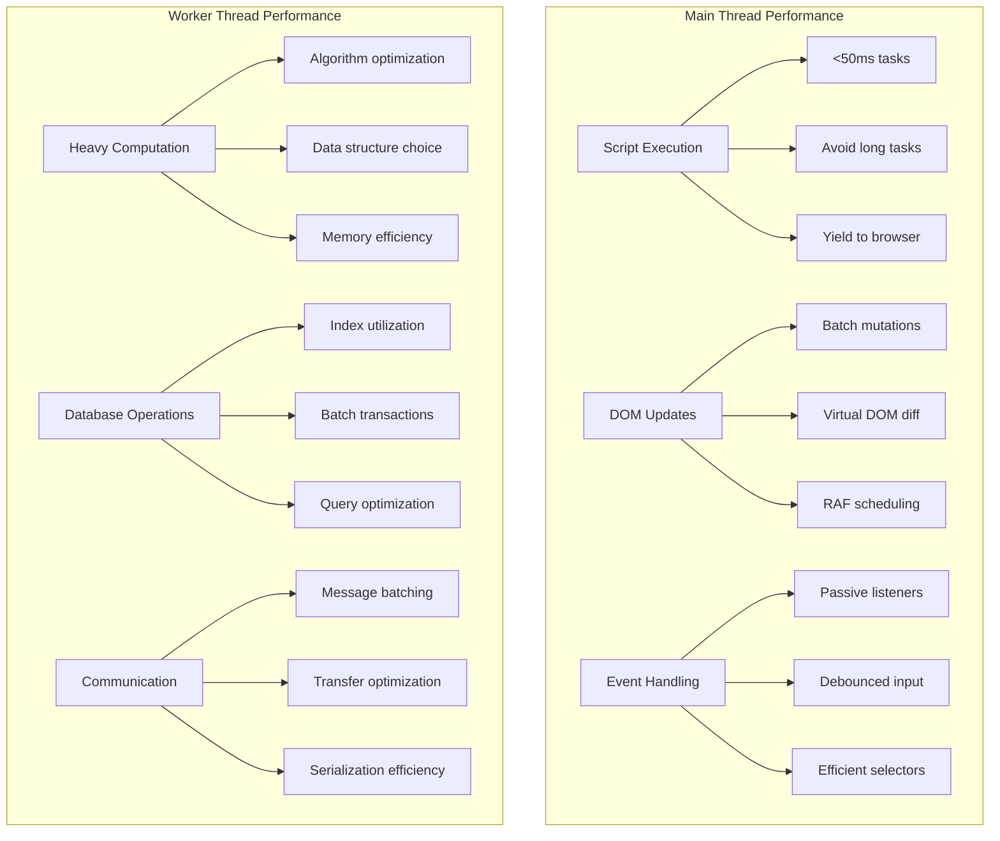
```mermaid
graph TB
    subgraph "Main Thread Performance"
        A[Script Execution] --> A1[<50ms tasks]
        A --> A2[Avoid long tasks]
        A --> A3[Yield to browser]
        
        B[DOM Updates] --> B1[Batch mutations]
        B --> B2[Virtual DOM diff]
        B --> B3[RAF scheduling]
        
        C[Event Handling] --> C1[Passive listeners]
        C --> C2[Debounced input]
        C --> C3[Efficient selectors]
    end
    
    subgraph "Worker Thread Performance"
        D[Heavy Computation] --> D1[Algorithm optimization]
        D --> D2[Data structure choice]
        D --> D3[Memory efficiency]
        
        E[Database Operations] --> E1[Index utilization]
        E --> E2[Batch transactions]
        E --> E3[Query optimization]
        
        F[Communication] --> F1[Message batching]
        F --> F2[Transfer optimization]
        F --> F3[Serialization efficiency]
    end
```

### 8.2 クラウド環境構成 ⭐️⭐️⭐️

#### 8.2.1 GitHub Pages設定

**デプロイメント構成**

```yaml
# .github/workflows/deploy.yml
name: Deploy to GitHub Pages
on:
  push:
    branches: [main]

jobs:
  deploy:
    runs-on: ubuntu-latest
    permissions:
      contents: read
      pages: write
      id-token: write
    
    steps:
      - uses: actions/checkout@v4
      - name: Setup Node.js
        uses: actions/setup-node@v4
        with:
          node-version: '18'
      - name: Install pnpm
        uses: pnpm/action-setup@v2
        with:
          version: '8'
      - name: Install dependencies
        run: pnpm install --frozen-lockfile
      - name: Build application
        run: pnpm build
        env:
          VITE_APP_NAME: hierarchidb
      - name: Setup Pages
        uses: actions/configure-pages@v4
      - name: Upload artifact
        uses: actions/upload-pages-artifact@v3
        with:
          path: packages/30-app/dist
      - name: Deploy to GitHub Pages
        uses: actions/deploy-pages@v4
```

**SPAルーティング対応**

| 課題 | 解決策 | 実装方法 |
|------|--------|----------|
| **404エラー** | フォールバック設定 | 404.html作成 |
| **Direct URL Access** | React Router設定 | BrowserRouter使用 |
| **Base Path** | アプリケーション設定 | basename設定 |
| **Asset Path** | ビルド設定 | publicPath設定 |

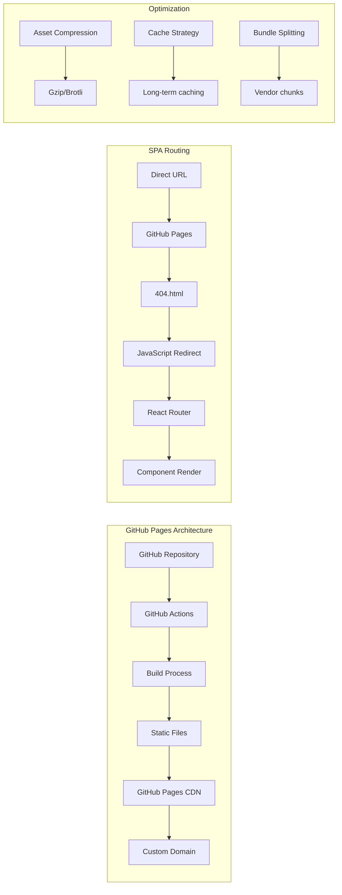
```mermaid
graph LR
    subgraph "GitHub Pages Architecture"
        A[GitHub Repository] --> B[GitHub Actions]
        B --> C[Build Process]
        C --> D[Static Files]
        D --> E[GitHub Pages CDN]
        E --> F[Custom Domain]
    end
    
    subgraph "SPA Routing"
        G[Direct URL] --> H[GitHub Pages]
        H --> I[404.html]
        I --> J[JavaScript Redirect]
        J --> K[React Router]
        K --> L[Component Render]
    end
    
    subgraph "Optimization"
        M[Asset Compression] --> M1[Gzip/Brotli]
        N[Cache Strategy] --> N1[Long-term caching]
        O[Bundle Splitting] --> O1[Vendor chunks]
    end
```

#### 8.2.2 Cloudflare Workers構成

**BFF (Backend for Frontend) 構成**

```typescript
// packages/backend/bff/src/openstreetmap-type.ts
import { Hono } from 'hono';
import { cors } from 'hono/cors';
import { jwt } from 'hono/jwt';

const app = new Hono<{
  Bindings: {
    JWT_SECRET: string;
    OAUTH_CLIENT_ID: string;
    OAUTH_CLIENT_SECRET: string;
  }
}>();

app.use('/api/*', cors());
app.use('/api/protected/*', jwt({ secret: c => c.env.JWT_SECRET }));

// OAuth authentication endpoints
app.get('/auth/callback', async (c) => {
  // OAuth callback handling
});

// Protected API endpoints
app.get('/api/protected/user', async (c) => {
  // User information
});
```

**Workers設定最適化**

| 設定項目 | 推奨値 | 理由 |
|----------|--------|------|
| **Memory Limit** | 128MB | 標準プラン制限 |
| **CPU Time** | 30秒 | 最大実行時間 |
| **Concurrent Requests** | 1000 | スケーラビリティ |
| **Cold Start Optimization** | ES Modules | 起動時間短縮 |

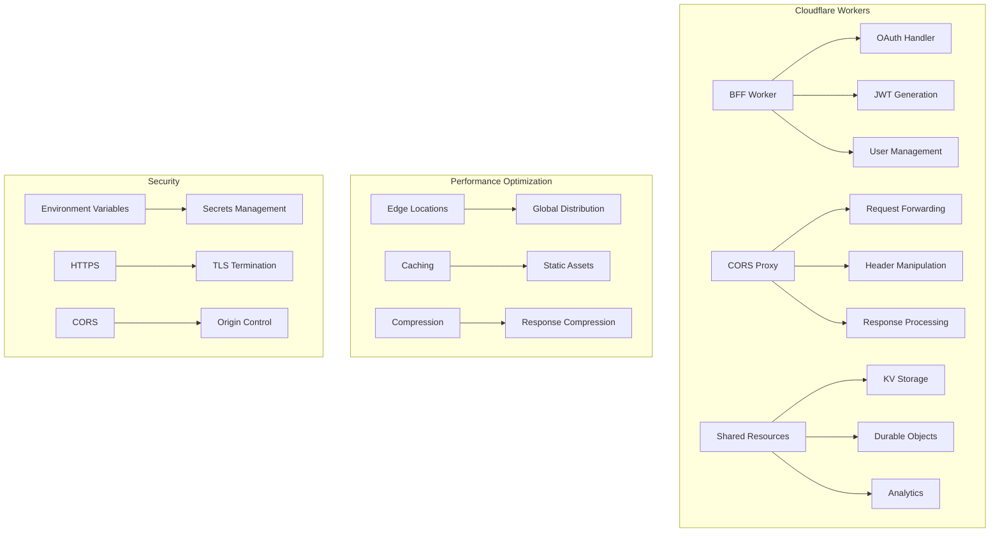
```mermaid
graph TB
    subgraph "Cloudflare Workers"
        A[BFF Worker] --> A1[OAuth Handler]
        A --> A2[JWT Generation]
        A --> A3[User Management]
        
        B[CORS Proxy] --> B1[Request Forwarding]
        B --> B2[Header Manipulation]
        B --> B3[Response Processing]
        
        C[Shared Resources] --> C1[KV Storage]
        C --> C2[Durable Objects]
        C --> C3[Analytics]
    end
    
    subgraph "Performance Optimization"
        D[Edge Locations] --> D1[Global Distribution]
        E[Caching] --> E1[Static Assets]
        F[Compression] --> F1[Response Compression]
    end
    
    subgraph "Security"
        G[Environment Variables] --> G1[Secrets Management]
        H[HTTPS] --> H1[TLS Termination]
        I[CORS] --> I1[Origin Control]
    end
```

#### 8.2.3 CDN・キャッシュ戦略

**キャッシュポリシー設定**

| リソースタイプ | Cache-Control | TTL | 更新戦略 |
|---------------|---------------|-----|----------|
| **HTML** | no-cache | 0 | 常に検証 |
| **JavaScript** | max-age=31536000 | 1年 | ファイル名ハッシュ |
| **CSS** | max-age=31536000 | 1年 | ファイル名ハッシュ |
| **Images** | max-age=2592000 | 30日 | 定期更新 |
| **Fonts** | max-age=31536000 | 1年 | バージョニング |
| **API Responses** | max-age=300 | 5分 | 内容依存 |

**CDN最適化**

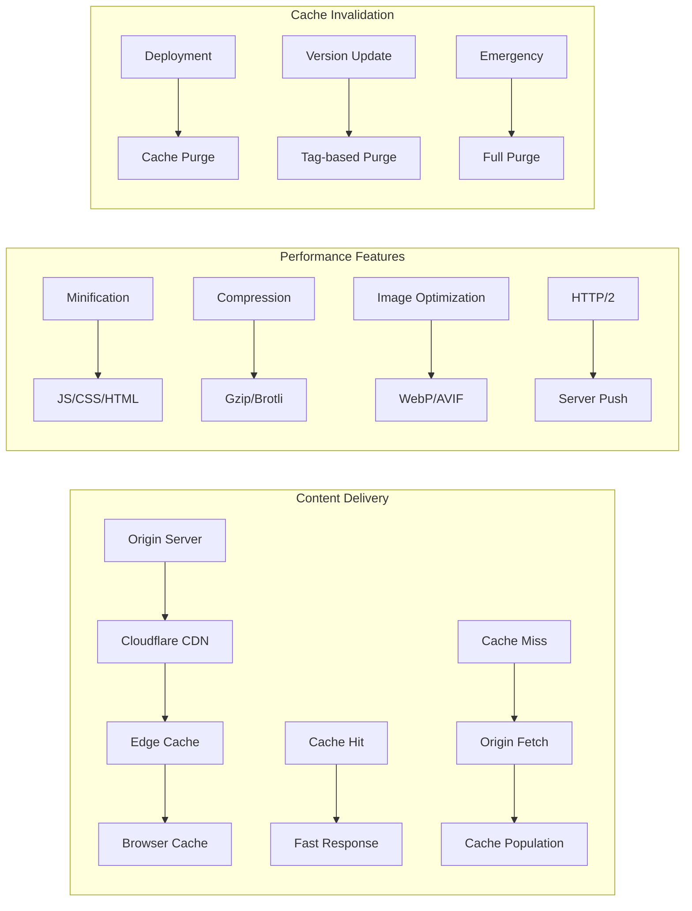
```mermaid
graph LR
    subgraph "Content Delivery"
        A[Origin Server] --> B[Cloudflare CDN]
        B --> C[Edge Cache]
        C --> D[Browser Cache]
        
        E[Cache Hit] --> F[Fast Response]
        G[Cache Miss] --> H[Origin Fetch]
        H --> I[Cache Population]
    end
    
    subgraph "Performance Features"
        J[Minification] --> J1[JS/CSS/HTML]
        K[Compression] --> K1[Gzip/Brotli]
        L[Image Optimization] --> L1[WebP/AVIF]
        M[HTTP/2] --> M1[Server Push]
    end
    
    subgraph "Cache Invalidation"
        N[Deployment] --> N1[Cache Purge]
        O[Version Update] --> O1[Tag-based Purge]
        P[Emergency] --> P1[Full Purge]
    end
```

### 8.3 外部依存関係 ⭐️⭐️⭐️⭐️

#### 8.3.1 認証プロバイダー統合

**OAuth2/OIDC設定**

| プロバイダー | 対応状況 | 設定要件 | セキュリティレベル |
|-------------|----------|----------|------------------|
| **Google** | 実装済み | Client ID/Secret | 高 |
| **GitHub** | 計画中 | OAuth App | 高 |
| **Microsoft** | 計画中 | Azure AD App | 高 |
| **カスタム** | 対応可能 | OIDC準拠 | 設定依存 |

**認証フロー実装**

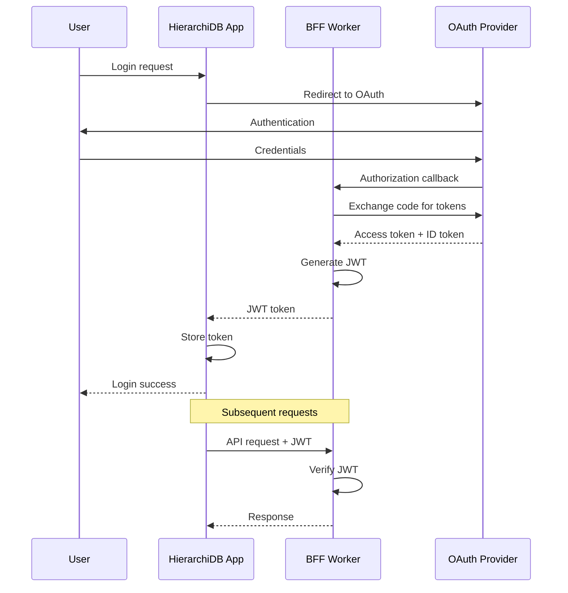
```mermaid
sequenceDiagram
    participant User as User
    participant App as HierarchiDB App
    participant BFF as BFF Worker
    participant OAuth as OAuth Provider
    
    User->>App: Login request
    App->>OAuth: Redirect to OAuth
    OAuth->>User: Authentication
    User->>OAuth: Credentials
    OAuth->>BFF: Authorization callback
    BFF->>OAuth: Exchange code for tokens
    OAuth-->>BFF: Access token + ID token
    BFF->>BFF: Generate JWT
    BFF-->>App: JWT token
    App->>App: Store token
    App-->>User: Login success
    
    Note over App,BFF: Subsequent requests
    App->>BFF: API request + JWT
    BFF->>BFF: Verify JWT
    BFF-->>App: Response
```

#### 8.3.2 外部API・サービス統合

**サードパーティ依存関係**

| サービス | 用途 | SLA要求 | フォールバック |
|----------|------|---------|---------------|
| **Cloudflare** | CDN/Security | 99.9% | GitHub Pages直接 |
| **OAuth Providers** | 認証 | 99.5% | ローカル認証 |
| **Monitoring** | パフォーマンス監視 | 99.0% | ローカル監視 |
| **Analytics** | 使用状況分析 | 95.0% | ローカル集計 |

**API制限・レート制限対応**

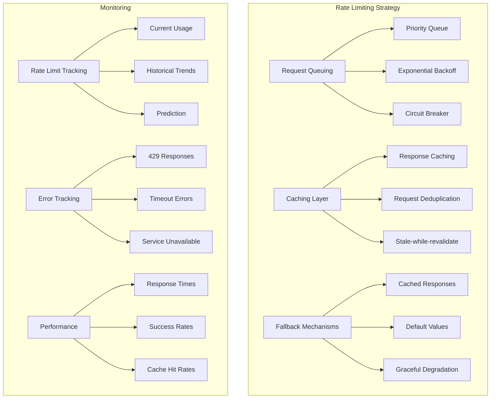
```mermaid
graph TB
    subgraph "Rate Limiting Strategy"
        A[Request Queuing] --> A1[Priority Queue]
        A --> A2[Exponential Backoff]
        A --> A3[Circuit Breaker]
        
        B[Caching Layer] --> B1[Response Caching]
        B --> B2[Request Deduplication]
        B --> B3[Stale-while-revalidate]
        
        C[Fallback Mechanisms] --> C1[Cached Responses]
        C --> C2[Default Values]
        C --> C3[Graceful Degradation]
    end
    
    subgraph "Monitoring"
        D[Rate Limit Tracking] --> D1[Current Usage]
        D --> D2[Historical Trends]
        D --> D3[Prediction]
        
        E[Error Tracking] --> E1[429 Responses]
        E --> E2[Timeout Errors]
        E --> E3[Service Unavailable]
        
        F[Performance] --> F1[Response Times]
        F --> F2[Success Rates]
        F --> F3[Cache Hit Rates]
    end
```

#### 8.3.3 モニタリング・オブザーバビリティ

**監視システム構成**

| 監視領域 | ツール | メトリクス | アラート閾値 |
|----------|-------|-----------|-------------|
| **Application Performance** | Web Vitals | LCP, FID, CLS | 95パーセンタイル |
| **Error Tracking** | Browser APIs | Error Rate, Stack Traces | 0.1%超過 |
| **User Analytics** | Custom Implementation | Page Views, Sessions | 利用状況分析 |
| **Infrastructure** | Cloudflare Analytics | Request Volume, Cache Hit Rate | トラフィック異常 |

**ログ・メトリクス収集**

```mermaid
graph LR
    subgraph "Client-side Monitoring"
        A[Performance Observer] --> A1[Web Vitals]
        A --> A2[Navigation Timing]
        A --> A3[Resource Timing]
        
        B[Error Tracking] --> B1[window.onerror]
        B --> B2[unhandledrejection]
        B --> B3[React Error Boundary]
        
        C[User Analytics] --> C1[Page Views]
        C --> C2[User Actions]
        C --> C3[Feature Usage]
    end
    
    subgraph "Server-side Monitoring"
        D[Worker Analytics] --> D1[Request Metrics]
        D --> D2[Response Times]
        D --> D3[Error Rates]
        
        E[Infrastructure] --> E1[CDN Metrics]
        E --> E2[Cache Performance]
        E --> E3[Origin Health]
    end
    
    subgraph "Data Processing"
        F[Real-time] --> F1[Alerts]
        G[Batch] --> G1[Reports]
        H[Analysis] --> H1[Insights]
    end
    
    A1 --> F
    B1 --> F
    D1 --> F
    C1 --> G
    E1 --> H
```

## 9章 開発プロセス ⭐️⭐️⭐️

本章では、HierarchiDBプロジェクトの開発フロー、テスト戦略、リリース管理について説明します。継続的な品質向上、チーム協業の効率化、安定したリリースサイクルを実現するためのプロセス設計と、各段階での具体的な手順・基準・ツールの活用方法を詳述します。

```mermaid
mindmap
  root((開発プロセス))
    開発フロー
      アジャイル開発
      スクラム手法
      スプリント計画
    テスト戦略
      テストピラミッド
      自動テスト
      品質ゲート
    リリース管理
      バージョニング
      デプロイメント
      ロールバック戦略
```

### 9.1 開発フロー ⭐️⭐️⭐️⭐️

#### 9.1.1 アジャイル開発プロセス

**スクラム手法採用**

| 役割 | 責任 | 主要活動 |
|------|------|----------|
| **Product Owner** | 要求定義、優先度決定 | バックログ管理、ストーリー定義 |
| **Scrum Master** | プロセス管理、障害除去 | スプリント運営、チーム支援 |
| **Development Team** | 実装、テスト | 設計、コーディング、レビュー |

**スプリント構成**

```mermaid
gantt
    title Development Sprint (2 weeks)
    dateFormat  YYYY-MM-DD
    
    section Sprint Planning
    Sprint Planning    :2024-01-01, 1d
    
    section Development
    Feature Development :2024-01-02, 8d
    Code Review        :2024-01-03, 7d
    Testing           :2024-01-04, 6d
    
    section Sprint Review
    Demo Preparation  :2024-01-09, 1d
    Sprint Review     :2024-01-10, 1d
    
    section Sprint Retrospective
    Retrospective     :2024-01-11, 1d
    Next Sprint Planning :2024-01-12, 1d
```

#### 9.1.2 タスク管理・トラッキング

**GitHub Issues活用**

| ラベル分類 | 用途 | 説明 |
|-----------|------|------|
| **Type** | `bug`, `feature`, `enhancement` | 作業種別 |
| **Priority** | `P0`, `P1`, `P2`, `P3` | 優先度レベル |
| **Component** | `core`, `ui`, `worker`, `plugin` | 影響範囲 |
| **Status** | `in-progress`, `review`, `testing` | 進捗状況 |

**プロジェクト管理**

```mermaid
graph TB
    subgraph "Issue Lifecycle"
        A[Issue Creation] --> B[Triage]
        B --> C[Sprint Planning]
        C --> D[Development]
        D --> E[Code Review]
        E --> F[Testing]
        F --> G[Done]
        
        G --> H[Release Planning]
        H --> I[Deployment]
        I --> J[Monitoring]
    end
    
    subgraph "Quality Gates"
        K[Definition of Ready] --> K1[Story defined]
        K --> K2[Acceptance criteria]
        K --> K3[Dependencies identified]
        
        L[Definition of Done] --> L1[Code reviewed]
        L --> L2[Tests passing]
        L --> L3[Documentation updated]
    end
    
    subgraph "Metrics Tracking"
        M[Velocity] --> M1[Story points/sprint]
        N[Burn-down] --> N1[Remaining work]
        O[Cycle Time] --> O1[Issue to deployment]
    end
```

#### 9.1.3 コードレビュープロセス

**レビュー基準**

| チェック項目 | 基準 | 自動化 |
|-------------|------|--------|
| **機能性** | 要求仕様通りの動作 | 手動 |
| **コード品質** | 読みやすさ、保守性 | ESLint + 手動 |
| **パフォーマンス** | 性能要件満足 | ベンチマーク + 手動 |
| **セキュリティ** | 脆弱性なし | 静的解析 + 手動 |
| **テスト** | カバレッジ基準満足 | 自動 |
| **文書化** | API文書、README更新 | 手動 |

**レビューワークフロー**

```mermaid
sequenceDiagram
    participant Dev as Developer
    participant GitHub as GitHub
    participant CI as CI/CD
    participant Reviewer as Reviewer
    participant QA as QA Team
    
    Dev->>GitHub: Create Pull Request
    GitHub->>CI: Trigger automated checks
    CI->>CI: Run tests, linting, build
    CI-->>GitHub: Report status
    
    alt CI Success
        GitHub->>Reviewer: Request review
        Reviewer->>Reviewer: Code review
        
        alt Review Approved
            Reviewer->>GitHub: Approve PR
            GitHub->>QA: Ready for testing
            QA->>QA: Manual testing
            
            alt QA Passed
                QA->>GitHub: Approve merge
                GitHub->>GitHub: Merge to main
            else QA Failed
                QA->>Dev: Request fixes
            end
        else Changes Requested
            Reviewer->>Dev: Request changes
            Dev->>GitHub: Update PR
        end
    else CI Failed
        CI->>Dev: Fix issues
    end
```

### 9.2 テスト戦略 ⭐️⭐️⭐️

#### 9.2.1 テストピラミッド実装

**テスト階層構造**

```mermaid
graph TB
    subgraph "Test Pyramid"
        A[Unit Tests - 70%] --> A1[Functions, Classes]
        A --> A2[Business Logic]
        A --> A3[Utilities]
        
        B[Integration Tests - 20%] --> B1[Component Integration]
        B --> B2[API Integration]
        B --> B3[Database Integration]
        
        C[E2E Tests - 10%] --> C1[Critical User Paths]
        C --> C2[Cross-browser Testing]
        C --> C3[Performance Testing]
    end
    
    subgraph "Test Tools"
        D[Vitest] --> D1[Fast unit testing]
        E[React Testing Library] --> E1[Component testing]
        F[Playwright] --> F1[E2E automation]
        G[MSW] --> G1[API mocking]
    end
    
    subgraph "Coverage Goals"
        H[Unit] --> H1[>80%]
        I[Integration] --> I1[>60%]
        J[E2E] --> J1[100% critical paths]
    end
```

#### 9.2.2 自動テスト実装

**Unit Test例**

```typescript
// packages/00-core/src/utils/__tests__/id.test.ts
describe('ID utilities', () => {
  describe('generateNodeId', () => {
    it('should generate valid NodeId', () => {
      const id = generateNodeId();
      expect(isNodeId(id)).toBe(true);
      expect(id).toMatch(/^node_[a-z0-9]+$/);
    });

    it('should generate unique IDs', () => {
      const ids = Array.from({ length: 100 }, () => generateNodeId());
      const uniqueIds = new Set(ids);
      expect(uniqueIds.size).toBe(100);
    });
  });
});
```

**Integration Test例**

```typescript
// packages/02-worker/src/__tests__/TreeMutationService.integration.test.ts
describe('TreeMutationService Integration', () => {
  let db: TestDatabase;
  let service: TreeMutationService;

  beforeEach(async () => {
    db = await setupTestDatabase();
    service = new TreeMutationService(db);
  });

  it('should create and retrieve node', async () => {
    const parentId = 'parent' as NodeId;
    const nodeData = { name: 'Test Node', nodeType: 'folder' };
    
    const nodeId = await service.createNode(parentId, nodeData);
    const retrieved = await service.getNode(nodeId);
    
    expect(retrieved).toMatchObject(nodeData);
    expect(retrieved.parentNodeId).toBe(parentId);
  });
});
```

**E2E Test例**

```typescript
// e2e/tests/tree-operations.spec.ts
test('should create and edit node', async ({ page }) => {
  await page.goto('/t/test-tree');
  
  // Create new node
  await page.click('[data-testid="create-node-button"]');
  await page.fill('[data-testid="node-name-input"]', 'New Node');
  await page.selectOption('[data-testid="node-type-select"]', 'folder');
  await page.click('[data-testid="save-button"]');
  
  // Verify node created
  await expect(page.locator('[data-testid="tree-node"]')).toContainText('New Node');
  
  // Edit node
  await page.click('[data-testid="tree-node"]:has-text("New Node")');
  await page.click('[data-testid="edit-button"]');
  await page.fill('[data-testid="node-name-input"]', 'Edited Node');
  await page.click('[data-testid="save-button"]');
  
  // Verify edit
  await expect(page.locator('[data-testid="tree-node"]')).toContainText('Edited Node');
});
```

#### 9.2.3 品質ゲート設定

**品質基準マトリクス**

| 品質指標 | 最低基準 | 目標値 | 測定ツール | ブロッキング |
|----------|----------|--------|-----------|-------------|
| **Test Coverage** | 70% | 80% | Istanbul/c8 | Yes |
| **Type Coverage** | 90% | 95% | type-coverage | Yes |
| **ESLint Violations** | 0 errors | 0 warnings | ESLint | Yes |
| **Bundle Size** | <2.5MB | <2MB | Bundlephobia | No |
| **Performance Score** | >80 | >90 | Lighthouse | No |
| **Security Vulnerabilities** | 0 high | 0 medium+ | npm audit | Yes |

**自動品質チェック**

```mermaid
graph LR
    subgraph "Pre-commit Checks"
        A[Staged Files] --> B[ESLint]
        B --> C[Prettier]
        C --> D[Type Check]
        D --> E[Unit Tests]
        E --> F[Commit Allow/Block]
    end
    
    subgraph "CI/CD Checks"
        G[All Files] --> H[Full Lint]
        H --> I[Full Type Check]
        I --> J[All Tests]
        J --> K[Build Verification]
        K --> L[E2E Tests]
        L --> M[Quality Gates]
        M --> N[Deploy/Block]
    end
    
    subgraph "Quality Metrics"
        O[Coverage Report] --> O1[Codecov]
        P[Performance] --> P1[Lighthouse CI]
        Q[Security] --> Q1[Snyk/OSSF]
        R[Dependencies] --> R1[Renovate]
    end
```

### 9.3 リリース管理 ⭐️⭐️

#### 9.3.1 バージョニング戦略

**Semantic Versioning適用**

| バージョンタイプ | 変更内容 | 例 | リリース頻度 |
|-----------------|----------|---|-------------|
| **Major (X.0.0)** | Breaking changes | 1.0.0 → 2.0.0 | 年1-2回 |
| **Minor (0.X.0)** | New features | 1.1.0 → 1.2.0 | 月1-2回 |
| **Patch (0.0.X)** | Bug fixes | 1.1.1 → 1.1.2 | 週1-2回 |
| **Pre-release** | Beta/RC versions | 1.2.0-beta.1 | 必要時 |

**リリースブランチ戦略**

```mermaid
gitgraph
    commit id: "1.0.0" type: HIGHLIGHT
    branch develop
    checkout develop
    commit id: "feat: new feature"
    commit id: "feat: another feature"
    
    branch release/1.1.0
    checkout release/1.1.0
    commit id: "fix: release preparation"
    commit id: "docs: update changelog"
    
    checkout main
    merge release/1.1.0
    commit id: "1.1.0" type: HIGHLIGHT
    
    checkout develop
    merge main
    
    branch hotfix/1.1.1
    checkout hotfix/1.1.1
    commit id: "fix: critical bug"
    
    checkout main
    merge hotfix/1.1.1
    commit id: "1.1.1" type: HIGHLIGHT
    
    checkout develop
    merge main
```

#### 9.3.2 デプロイメント戦略

**環境別デプロイフロー**

| 環境 | トリガー | デプロイ方式 | 検証項目 |
|------|----------|-------------|----------|
| **Development** | Feature branch push | 自動 | 基本動作確認 |
| **Staging** | Develop branch merge | 自動 | 統合テスト |
| **Production** | Release tag | 手動承認後自動 | 本番前検証 |

**Blue-Green デプロイメント**

```mermaid
graph TB
    subgraph "Current Production (Blue)"
        A[Production App v1.0] --> A1[Users]
        A --> A2[Load Balancer]
    end
    
    subgraph "New Version (Green)"
        B[Staging App v1.1] --> B1[Health Checks]
        B --> B2[Smoke Tests]
        B --> B3[Ready for Switch]
    end
    
    subgraph "Deployment Process"
        C[Deploy to Green] --> D[Validate Green]
        D --> E[Switch Traffic]
        E --> F[Monitor Metrics]
        
        F --> G{Success?}
        G -->|Yes| H[Green becomes Blue]
        G -->|No| I[Rollback to Blue]
    end
    
    subgraph "Rollback Strategy"
        J[Issue Detection] --> K[Traffic Switch]
        K --> L[Blue Environment]
        L --> M[Post-incident Review]
    end
```

#### 9.3.3 リリースプロセス自動化

**リリース自動化ワークフロー**

```yaml
# .github/workflows/release.yml
name: Release
on:
  push:
    tags:
      - 'v*'

jobs:
  release:
    runs-on: ubuntu-latest
    steps:
      - uses: actions/checkout@v4
        with:
          fetch-depth: 0
      
      - name: Generate changelog
        run: |
          npx conventional-changelog-cli -p angular -i CHANGELOG.md -s
      
      - name: Create GitHub release
        uses: actions/create-release@v1
        with:
          tag_name: ${{ github.ref }}
          release_name: Release ${{ github.ref }}
          body_path: CHANGELOG.md
      
      - name: Build and deploy
        run: |
          pnpm install
          pnpm build
          pnpm deploy:production
      
      - name: Notify stakeholders
        run: |
          # Slack notification
          # Email notification
          # Update documentation
```

**リリース後監視**

```mermaid
graph LR
    subgraph "Release Monitoring"
        A[Deploy Complete] --> B[Health Checks]
        B --> C[Error Rate Monitor]
        C --> D[Performance Monitor]
        D --> E[User Feedback]
        
        E --> F{Issues Detected?}
        F -->|Yes| G[Emergency Response]
        F -->|No| H[Release Success]
        
        G --> I[Rollback Decision]
        I --> J[Hotfix Planning]
        J --> K[Next Release]
    end
    
    subgraph "Success Metrics"
        L[Error Rate] --> L1[<0.1%]
        M[Response Time] --> M1[<2s avg]
        N[User Satisfaction] --> N1[>95%]
        O[Feature Adoption] --> O1[Usage tracking]
    end
    
    subgraph "Failure Handling"
        P[Incident Response] --> P1[<15min detection]
        Q[Rollback Time] --> Q1[<5min execution]
        R[Communication] --> R1[Status page update]
    end
```

---

**まとめ**

第3部では、HierarchiDBの開発・実行環境について包括的に説明しました。開発ツールチェーン、ビルドシステム、品質管理ツール、実行環境要求、開発プロセスまで、プロジェクトの成功に必要な環境整備の全体像を提示しています。

次の第4部では、これらの環境上で実装される具体的な設計について詳述します。