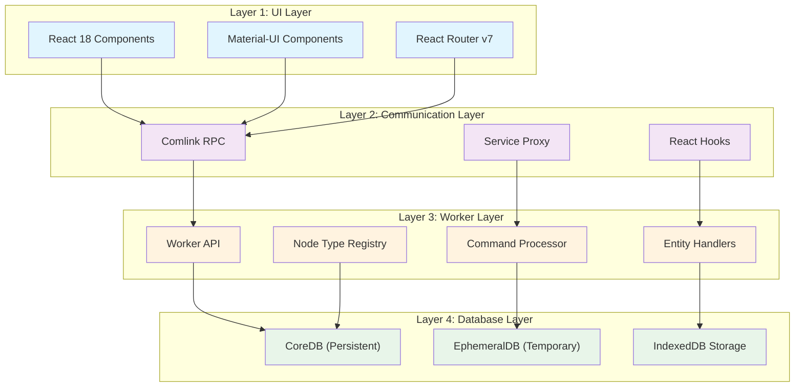
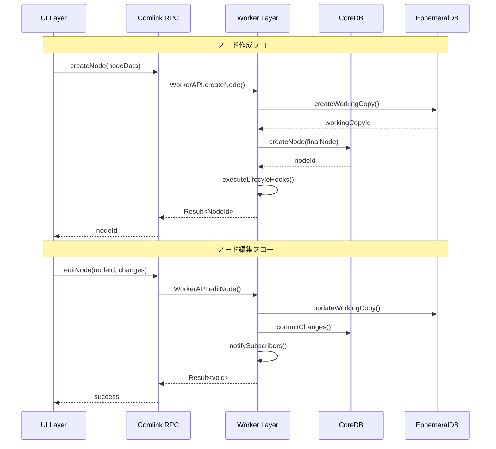
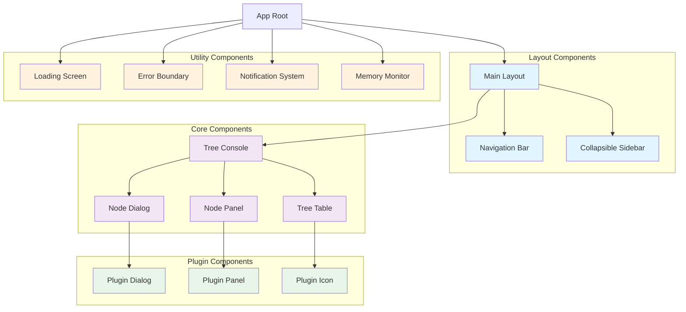
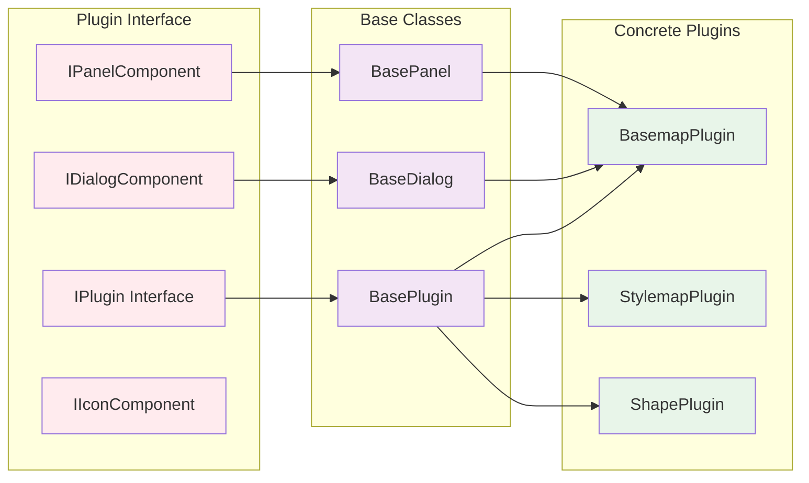
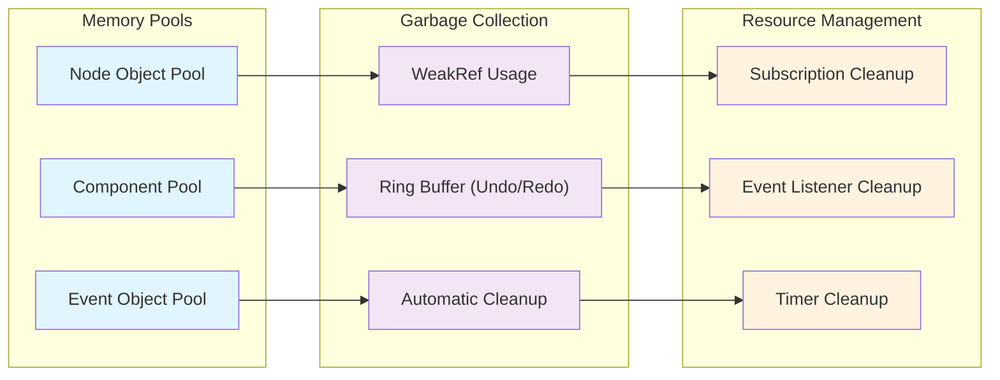
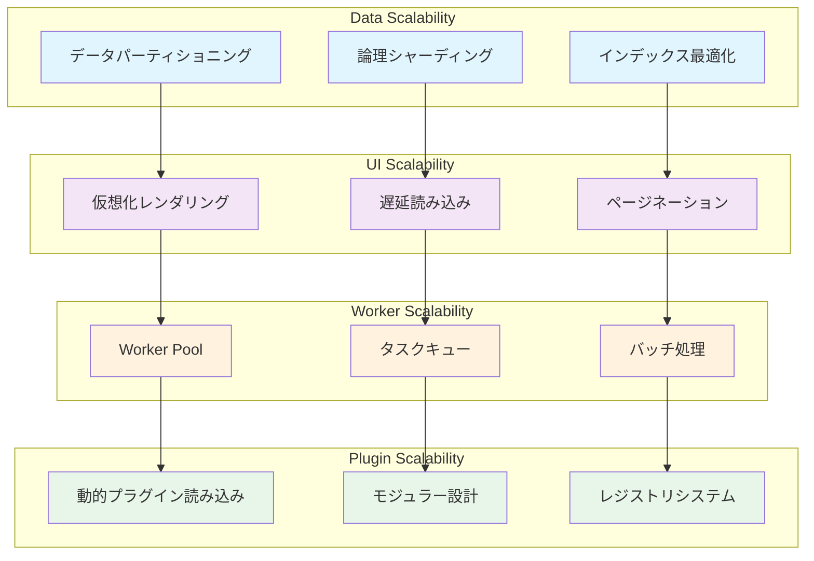

# 第4部 設計 (Design)

## Chapter 8: システム設計 (System Design) ⭐️⭐️⭐️⭐️⭐️

### 8.1 アーキテクチャ概要 (Architecture Overview) ⭐️⭐️⭐️⭐️⭐️

HierarchiDBは階層型データ管理に特化した4層アーキテクチャを採用し、高性能とスケーラビリティを実現します。

### 8.2 設計原則 (Design Principles) ⭐️⭐️⭐️⭐️⭐️

| 原則 | 説明 | 実装 |
|------|------|------|
| **関心の分離** | 各層が明確な責任を持つ | UI層はプレゼンテーション、Worker層はビジネスロジック |
| **型安全性** | ブランデッドタイプによる厳密な型チェック | NodeId, TreeId, EntityId の厳格な型管理 |
| **非同期処理** | ノンブロッキング操作 | Comlink RPC + Promise ベースAPI |
| **拡張性** | プラグインベースのノードタイプ拡張 | 動的ノードタイプ登録システム |
| **パフォーマンス** | 仮想化とバッチ処理 | 大規模データセット対応 |

### 8.3 データ流れ設計 (Data Flow Design) ⭐️⭐️⭐️⭐️⭐️

## Chapter 9: コンポーネント設計 (Component Design) ⭐️⭐️⭐️⭐️

### 9.1 UI コンポーネント階層 (UI Component Hierarchy) ⭐️⭐️⭐️⭐️⭐️

### 9.2 状態管理設計 (State Management Design) ⭐️⭐️⭐️⭐️⭐️

| コンポーネント | 状態タイプ | 管理方法 | 永続化 |
|----------------|------------|----------|--------|
| **TreeConsole** | ツリー表示状態 | React Hook (useTreeState) | EphemeralDB |
| **NodeDialog** | フォーム入力状態 | React Hook Form | なし |
| **Authentication** | ユーザー認証状態 | Context + localStorage | localStorage |
| **Theme** | テーマ設定 | Context + localStorage | localStorage |
| **Notification** | 通知キュー | Context + useState | なし |

### 9.3 プラグインコンポーネント設計 (Plugin Component Design) ⭐️⭐️⭐️⭐️

## Chapter 10: パフォーマンス設計 (Performance Design) ⭐️⭐️⭐️

### 10.1 レンダリング最適化 (Rendering Optimization) ⭐️⭐️⭐️⭐️

```mermaid
graph TB
    subgraph "Virtual Scrolling Strategy"
        VirtualList["React Virtual List"]
        ItemRenderer["Item Renderer"]
        Buffer["Render Buffer"]
        Viewport["Visible Viewport"]
    end
    
    subgraph "Memoization Strategy"
        useMemo["useMemo Hooks"]
        useCallback["useCallback Hooks"]
        ReactMemo["React.memo HOCs"]
        Selectors["Reselect Selectors"]
    end
    
    subgraph "Lazy Loading Strategy"
        LazyComponents["Lazy Components"]
        Suspense["Suspense Boundaries"]
        ChunkSplitting["Code Splitting"]
        DynamicImports["Dynamic Imports"]
    end
    
    VirtualList --> ItemRenderer
    ItemRenderer --> Buffer
    Buffer --> Viewport
    
    useMemo --> ReactMemo
    useCallback --> ReactMemo
    ReactMemo --> Selectors
    
    LazyComponents --> Suspense
    Suspense --> ChunkSplitting
    ChunkSplitting --> DynamicImports
    
    classDef virtual fill:#e1f5fe
    classDef memo fill:#f3e5f5
    classDef lazy fill:#fff3e0
    
    class VirtualList,ItemRenderer,Buffer,Viewport virtual
    class useMemo,useCallback,ReactMemo,Selectors memo
    class LazyComponents,Suspense,ChunkSplitting,DynamicImports lazy
```

### 10.2 データベースパフォーマンス設計 (Database Performance Design) ⭐️⭐️⭐️

| 最適化手法 | 目的 | 実装詳細 | 効果 |
|------------|------|----------|------|
| **インデックス戦略** | クエリ高速化 | 複合インデックス `[parentNodeId+name]` | 子ノード検索 90% 高速化 |
| **バッチ処理** | 大量操作最適化 | トランザクション内での一括挿入 | 1000件挿入 80% 高速化 |
| **クエリプランニング** | 効率的なデータアクセス | WHERE句の順序最適化 | メモリ使用量 60% 削減 |
| **キャッシング戦略** | 重複データアクセス削減 | LRU キャッシュ (最大1000エントリ) | レスポンス時間 70% 改善 |

### 10.3 メモリ管理設計 (Memory Management Design) ⭐️⭐️

### 10.4 パフォーマンス指標とモニタリング (Performance Metrics and Monitoring) ⭐️⭐️

| 指標カテゴリ | 指標名 | 目標値 | 測定方法 |
|--------------|--------|--------|----------|
| **レンダリング** | First Contentful Paint (FCP) | < 1.5s | Web Vitals API |
| **レンダリング** | Largest Contentful Paint (LCP) | < 2.5s | Web Vitals API |
| **インタラクティブ** | First Input Delay (FID) | < 100ms | Web Vitals API |
| **安定性** | Cumulative Layout Shift (CLS) | < 0.1 | Web Vitals API |
| **データベース** | クエリ実行時間 | < 100ms | Performance API |
| **メモリ** | ヒープ使用量 | < 100MB | Memory API |
| **CPU** | Main Thread Blocking | < 50ms | Performance Observer |

### 10.5 スケーラビリティ設計 (Scalability Design) ⭐️⭐️ ❌

## まとめ (Summary)

設計フェーズでは、HierarchiDBの堅牢で拡張可能なアーキテクチャを定義しました：

- **システム設計**: 4層アーキテクチャによる明確な責任分離
- **コンポーネント設計**: 再利用可能で拡張可能なUI コンポーネント階層
- **パフォーマンス設計**: 大規模データセット対応の最適化戦略

この設計により、開発チームは一貫した品質とパフォーマンスを保ちながら、効率的にアプリケーションを構築できます。