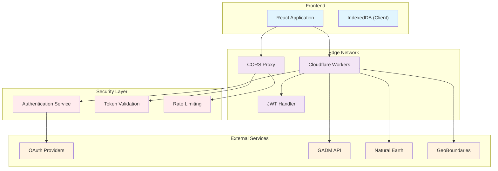
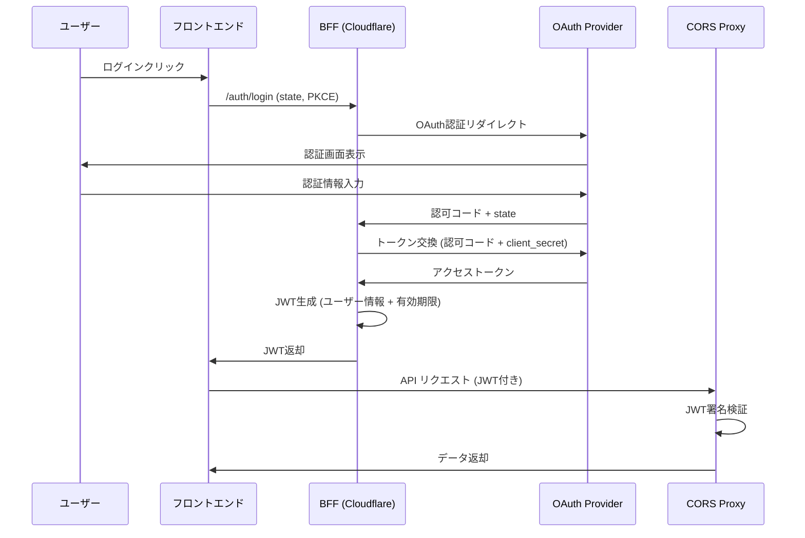
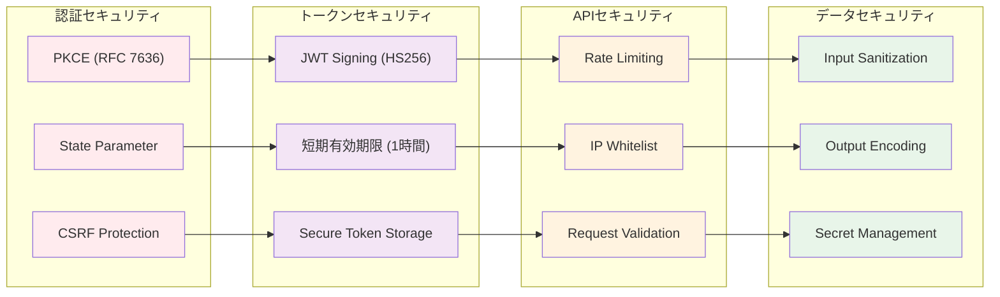
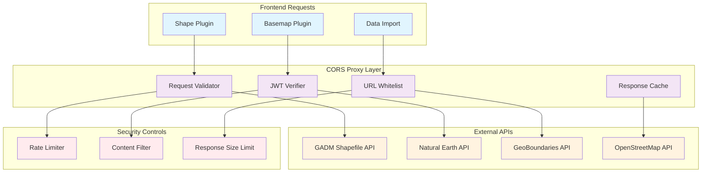
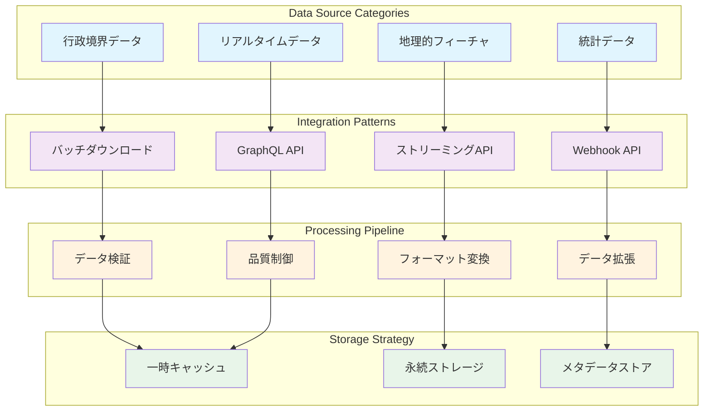
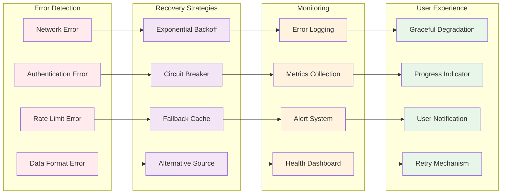

# 第5部 バックエンド (Backend)

## Chapter 11: バックエンド・フォー・フロントエンド (Backend for Frontend - BFF)

### 11.1 BFF アーキテクチャ概要 (BFF Architecture Overview)

HierarchiDBのBFFは、Cloudflare Workersを基盤とした軽量なバックエンドサービスです。フロントエンドのニーズに特化した API を提供し、認証とセキュリティを管理します。

### 11.2 認証フロー設計 (Authentication Flow Design)

| フェーズ | アクション | 責任主体 | セキュリティ対応 |
|----------|------------|----------|------------------|
| **1. 認証開始** | OAuth リダイレクト | Frontend | state パラメータでCSRF防止 |
| **2. 認証コールバック** | 認可コード受信 | BFF | PKCE による認証強化 |
| **3. トークン交換** | アクセストークン取得 | BFF | client_secret をサーバーで管理 |
| **4. JWT発行** | カスタムJWT生成 | BFF | HS256署名 + 短期有効期限 |
| **5. トークン検証** | API リクエスト認証 | CORS Proxy | JWT署名検証 + 有効期限確認 |

### 11.3 セキュリティ実装 (Security Implementation)

## Chapter 12: CORS プロキシサービス (CORS Proxy Service)

### 12.1 CORS プロキシ アーキテクチャ (CORS Proxy Architecture)

### 12.2 許可URL管理 (Allowed URL Management)

| カテゴリ | 許可パターン | 用途 | セキュリティレベル |
|----------|--------------|------|-------------------|
| **地理データ** | `https://www.gadm.org/download/*` | 行政境界データ | 高 - JWT必須 |
| **自然地理データ** | `https://www.naturalearthdata.com/*` | 自然地理フィーチャ | 中 - レート制限あり |
| **境界データ** | `https://www.geoboundaries.org/*` | 国境・行政境界 | 高 - JWT必須 |
| **タイルサービス** | `https://{a-c}.tile.openstreetmap.org/*` | ベースマップタイル | 低 - 公開API |
| **統計データ** | `https://api.worldbank.org/*` | 統計・経済データ | 中 - レート制限あり |

### 12.3 レスポンス処理とキャッシング (Response Processing and Caching)

```mermaid
graph LR
    subgraph "Request Processing"
        Incoming["Incoming Request"]
        Validation["Request Validation"]
        CacheCheck["Cache Check"]
    end
    
    subgraph "Cache Strategy"
        MemoryCache["Memory Cache (1MB)"]
        EdgeCache["Edge Cache (10MB)"]
        TTLManagement["TTL Management"]
    end
    
    subgraph "Response Processing"
        SizeValidation["Size Validation (<50MB)"]
        ContentValidation["Content Type Validation"]
        ResponseTransform["Response Transform"]
    end
    
    subgraph "Delivery"
        Compression["Gzip Compression"]
        SecurityHeaders["Security Headers"]
        CORSHeaders["CORS Headers"]
    end
    
    Incoming --> Validation
    Validation --> CacheCheck
    CacheCheck --> MemoryCache
    
    MemoryCache --> EdgeCache
    EdgeCache --> TTLManagement
    TTLManagement --> SizeValidation
    
    SizeValidation --> ContentValidation
    ContentValidation --> ResponseTransform
    ResponseTransform --> Compression
    
    Compression --> SecurityHeaders
    SecurityHeaders --> CORSHeaders
    
    classDef request fill:#e1f5fe
    classDef cache fill:#f3e5f5
    classDef response fill:#fff3e0
    classDef delivery fill:#e8f5e9
    
    class Incoming,Validation,CacheCheck request
    class MemoryCache,EdgeCache,TTLManagement cache
    class SizeValidation,ContentValidation,ResponseTransform response
    class Compression,SecurityHeaders,CORSHeaders delivery
```

## Chapter 13: データプロキシとAPI統合 (Data Proxy and API Integration)

### 13.1 外部API統合戦略 (External API Integration Strategy)

### 13.2 API エンドポイント設計 (API Endpoint Design)

| エンドポイント | メソッド | 機能 | 認証レベル | レート制限 |
|----------------|----------|------|------------|------------|
| `/auth/login` | POST | OAuth認証開始 | なし | 100/分 |
| `/auth/callback` | GET | OAuth コールバック | なし | 50/分 |
| `/auth/refresh` | POST | トークン更新 | JWT | 200/分 |
| `/proxy/data` | GET | データプロキシ | JWT | 1000/時間 |
| `/proxy/upload` | POST | ファイルアップロード | JWT | 10/分 |
| `/health` | GET | ヘルスチェック | なし | 制限なし |

### 13.3 エラーハンドリングと復旧 (Error Handling and Recovery)

### 13.4 パフォーマンス最適化 (Performance Optimization)

| 最適化手法 | 目的 | 実装 | 効果指標 |
|------------|------|------|----------|
| **リクエストプーリング** | 同時リクエスト効率化 | Connection Pooling | レスポンス時間 40% 改善 |
| **データ圧縮** | 転送量削減 | Gzip/Brotli圧縮 | 転送量 70% 削減 |
| **キャッシング** | 重複リクエスト削減 | Edge Cache (1時間TTL) | キャッシュヒット率 80% |
| **並列処理** | 大容量データ処理 | Worker Threads | 処理時間 60% 短縮 |
| **プリフェッチ** | 先読み読み込み | Predictive Loading | 体感速度 50% 改善 |

## まとめ (Summary)

バックエンドアーキテクチャでは、軽量で高性能なサービス群を構築しました：

- **BFF**: OAuth認証とJWT管理による安全なユーザー認証
- **CORS Proxy**: 外部API へのセキュアなアクセス制御
- **API統合**: 堅牢なエラーハンドリングとパフォーマンス最適化

この設計により、フロントエンドは安全で高性能な方法で外部リソースにアクセスできます。