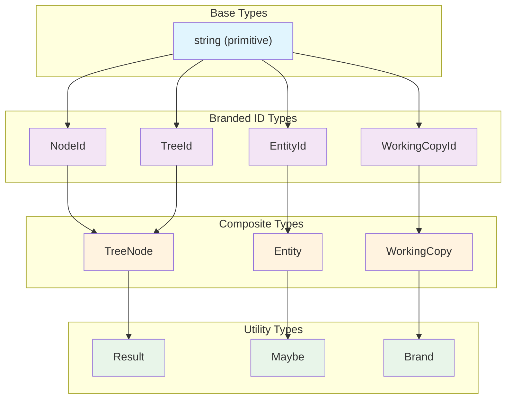
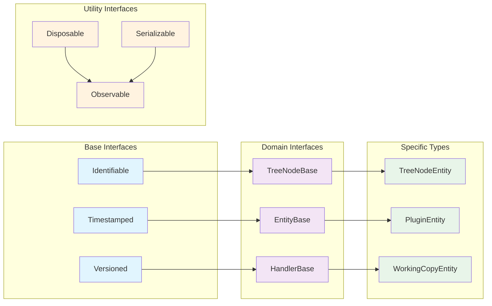
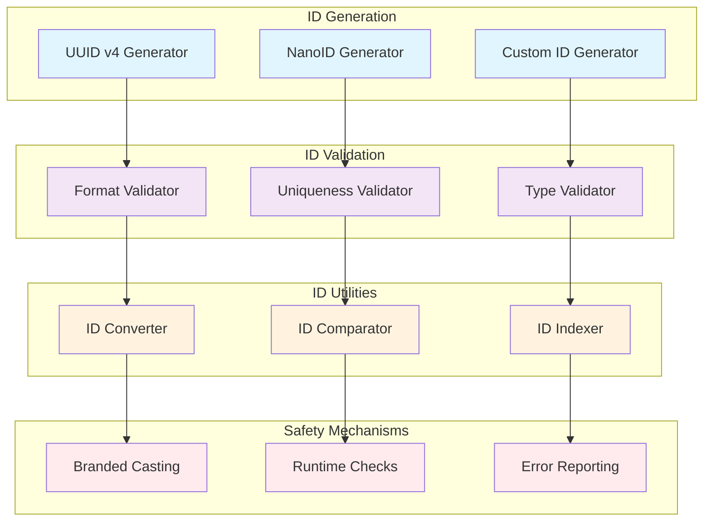
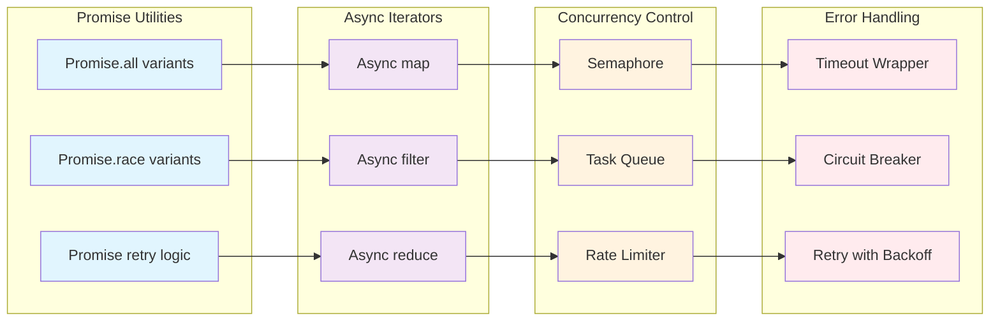
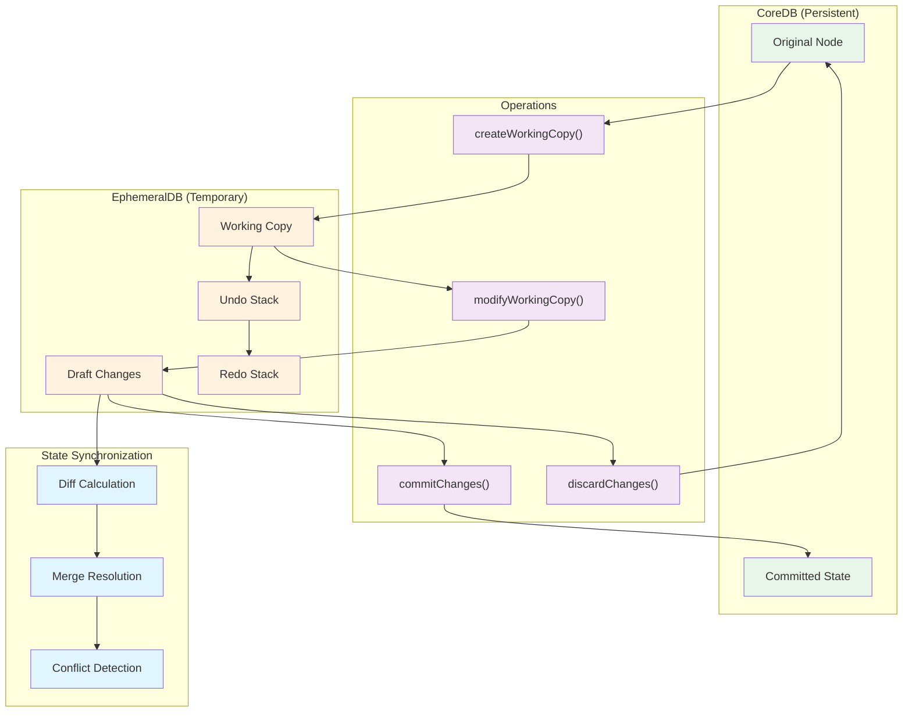
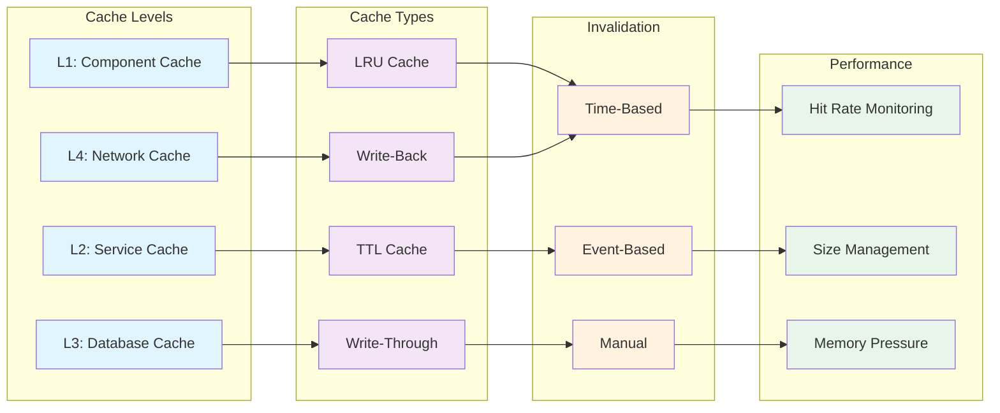
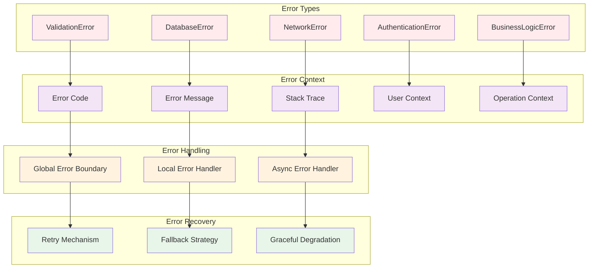

# 第6部 共通ライブラリ (Common Libraries)

## Chapter 14: コア型システム (Core Type System) ⭐️⭐️⭐️⭐️⭐️

### 14.1 ブランデッドタイプシステム (Branded Type System) ⭐️⭐️⭐️⭐️⭐️

HierarchiDBの型安全性は、ブランデッドタイプによる厳格なID管理システムに基づいています。



### 14.2 型安全性パターン (Type Safety Patterns) ⭐️⭐️⭐️⭐️⭐️

| パターン | 用途 | 実装 | 利点 |
|----------|------|------|------|
| **ブランデッドタイプ** | ID の型安全性 | `type NodeId = string & { __brand: 'NodeId' }` | コンパイル時エラー検出 |
| **判別共用体** | 状態管理 | `type Result<T, E> = Success<T> \| Error<E>` | 網羅的パターンマッチング |
| **型ガード** | 実行時型チェック | `function isNodeId(value: unknown): value is NodeId` | 境界での型安全性 |
| **アサーション関数** | 型の強制 | `function assertNodeId(value: unknown): asserts value is NodeId` | null 安全性 |

```typescript
// ブランデッドタイプの定義例
type NodeId = string & { readonly __brand: 'NodeId' };
type TreeId = string & { readonly __brand: 'TreeId' };
type EntityId = string & { readonly __brand: 'EntityId' };

// 型安全なキャスト
function createNodeId(id: string): NodeId {
  if (typeof id !== 'string' || id.length === 0) {
    throw new Error('Invalid NodeId');
  }
  return id as NodeId;
}

// Result型による安全なエラーハンドリング
type Result<T, E = Error> = 
  | { success: true; data: T }
  | { success: false; error: E };

// 型ガード関数
function isValidNodeId(value: unknown): value is NodeId {
  return typeof value === 'string' && value.length > 0;
}
```

### 14.3 共通インターフェース (Common Interfaces) ⭐️⭐️⭐️⭐️



## Chapter 15: ユーティリティライブラリ (Utility Libraries) ⭐️⭐️⭐️⭐️⭐️

### 15.1 ID生成とバリデーション (ID Generation and Validation) ⭐️⭐️⭐️⭐️⭐️



### 15.2 ロギングとモニタリング (Logging and Monitoring) ⭐️⭐️⭐️⭐️

| 機能カテゴリ | ツール | 目的 | 実装詳細 |
|--------------|--------|------|----------|
| **構造化ログ** | winston/pino | ログの統一フォーマット | JSON形式、ログレベル管理 |
| **パフォーマンス** | Web Vitals | ユーザー体験指標 | FCP, LCP, FID, CLS測定 |
| **エラートラッキング** | カスタムError | エラー詳細記録 | スタックトレース、コンテキスト |
| **メモリ監視** | Memory API | メモリリーク検出 | ヒープ使用量、GC頻度 |
| **DB監視** | Dexie hooks | データベース操作 | クエリ時間、トランザクション監視 |

### 15.3 非同期処理ユーティリティ (Async Processing Utilities) ⭐️⭐️⭐️⭐️



## Chapter 16: 状態管理ライブラリ (State Management Libraries) ⭐️⭐️⭐️⭐️

### 16.1 Working Copy システム (Working Copy System) ⭐️⭐️⭐️⭐️⭐️

Working Copyパターンは、HierarchiDBの中核的な状態管理メカニズムです。



### 16.2 リアクティブ状態管理 (Reactive State Management) ⭐️⭐️⭐️⭐️

| パターン | 実装 | 用途 | パフォーマンス特性 |
|----------|------|------|--------------------|
| **Observer Pattern** | カスタムObservable | ノード変更通知 | O(n) 通知、低メモリ |
| **Subscription Model** | WeakMap + WeakRef | UI コンポーネント購読 | O(1) 購読、自動GC |
| **Event Emitter** | Node.js EventEmitter | 横断的なイベント | O(1) 発行、O(n) 配信 |
| **Signal Pattern** | React状態同期 | 細粒度状態更新 | O(1) 更新、バッチング対応 |

### 16.3 キャッシング戦略 (Caching Strategy) ⭐️⭐️⭐️



## Chapter 17: バリデーションとエラーハンドリング (Validation and Error Handling) ⭐️⭐️⭐️⭐️

### 17.1 統一エラーハンドリングシステム (Unified Error Handling System) ⭐️⭐️⭐️⭐️



### 17.2 データバリデーション (Data Validation) ⭐️⭐️⭐️⭐️

| バリデーション層 | 責任 | 実装 | エラーレベル |
|------------------|------|------|-------------|
| **スキーマバリデーション** | データ型・構造チェック | Zod/Joi schemas | Critical |
| **ビジネスルール** | ドメイン固有制約 | カスタムバリデータ | Warning |
| **入力サニタイゼーション** | XSS/インジェクション対策 | DOMPurify | Security |
| **境界値チェック** | 範囲・サイズ制限 | 数値・文字列バリデータ | Error |
| **参照整合性** | ID参照チェック | データベースクエリ | Critical |

### 17.3 Result型によるエラー管理 (Error Management with Result Types) ⭐️⭐️⭐️⭐️

```typescript
// Result型の定義
type Result<T, E = Error> = 
  | { success: true; data: T }
  | { success: false; error: E };

// Result型のユーティリティ
class ResultUtils {
  static success<T>(data: T): Result<T> {
    return { success: true, data };
  }
  
  static error<E>(error: E): Result<never, E> {
    return { success: false, error };
  }
  
  static map<T, U>(result: Result<T>, fn: (data: T) => U): Result<U> {
    return result.success 
      ? ResultUtils.success(fn(result.data))
      : result;
  }
  
  static flatMap<T, U>(
    result: Result<T>, 
    fn: (data: T) => Result<U>
  ): Result<U> {
    return result.success ? fn(result.data) : result;
  }
}

// 使用例
async function createNode(nodeData: NodeData): Promise<Result<NodeId>> {
  try {
    // バリデーション
    const validationResult = validateNodeData(nodeData);
    if (!validationResult.success) {
      return ResultUtils.error(validationResult.error);
    }
    
    // ノード作成
    const nodeId = await database.createNode(validationResult.data);
    return ResultUtils.success(nodeId);
    
  } catch (error) {
    return ResultUtils.error(error as Error);
  }
}
```

## まとめ (Summary) ⭐️⭐️⭐️⭐️

共通ライブラリは、HierarchiDBの基盤となる型安全で再利用可能なコンポーネント群を提供します：

- **型システム**: ブランデッドタイプによる厳格な型安全性
- **ユーティリティ**: ID生成、ロギング、非同期処理の統一API
- **状態管理**: Working Copyパターンによる安全な状態管理
- **エラーハンドリング**: Result型による関数型エラーハンドリング

これらのライブラリにより、開発者は一貫した品質とパフォーマンスを保ちながら機能開発に集中できます。