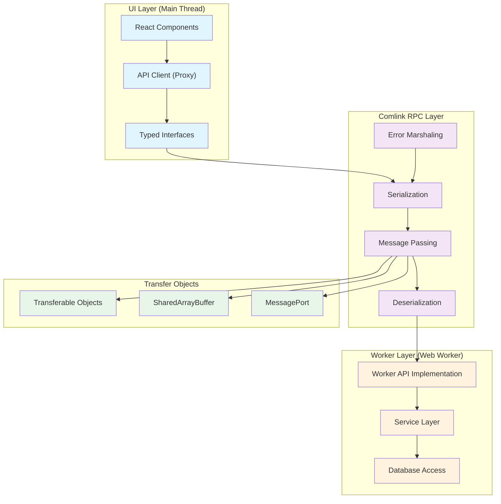
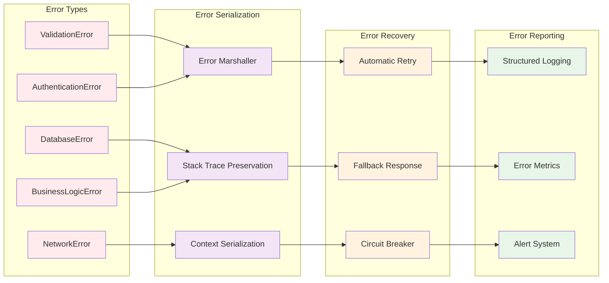
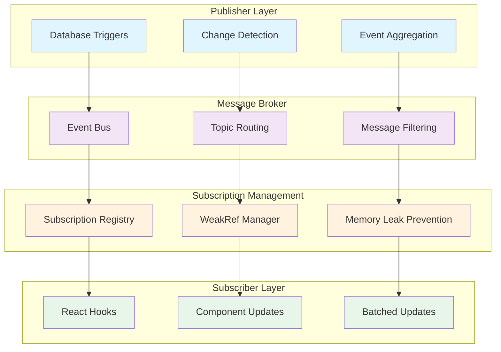
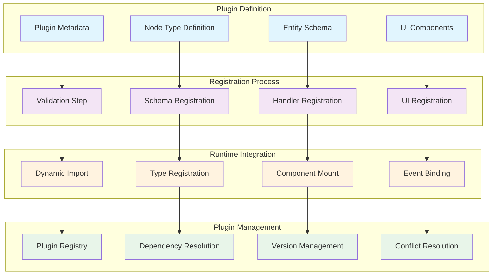
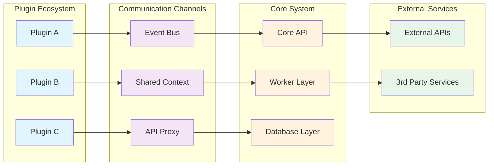

# 第7部 API (Application Programming Interface)

## Chapter 18: Worker API インターフェース (Worker API Interface)

### 18.1 Comlink RPC アーキテクチャ (Comlink RPC Architecture)

HierarchiDBのAPI層は、Comlink RPCを基盤とした非同期通信システムです。UI層とWorker層間の型安全な通信を実現します。



### 18.2 API契約定義 (API Contract Definition)

| API カテゴリ | インターフェース | 目的 | 型安全性 |
|--------------|------------------|------|----------|
| **ツリー操作** | `ITreeAPI` | ツリー構造管理 | `TreeId`, `NodeId` branded types |
| **ノード操作** | `INodeAPI` | ノード CRUD 操作 | `NodeId` validation + type guards |
| **エンティティ管理** | `IEntityAPI` | プラグインエンティティ | `EntityId` generic constraints |
| **Working Copy** | `IWorkingCopyAPI` | 作業コピー管理 | `WorkingCopyId` lifecycle |
| **サブスクリプション** | `ISubscriptionAPI` | リアルタイム通知 | Observer pattern with types |

```typescript
// API インターフェースの例
interface ITreeAPI {
  // ツリー作成
  createTree(name: string): Promise<Result<TreeId>>;
  
  // ツリー削除
  deleteTree(treeId: TreeId): Promise<Result<void>>;
  
  // ルートノード取得
  getRootNode(treeId: TreeId): Promise<Result<TreeNode>>;
  
  // 子ノード一覧取得
  getChildNodes(
    parentNodeId: NodeId, 
    options?: QueryOptions
  ): Promise<Result<TreeNode[]>>;
}

interface INodeAPI {
  // ノード作成
  createNode(
    parentNodeId: NodeId, 
    nodeData: CreateNodeData
  ): Promise<Result<NodeId>>;
  
  // ノード更新
  updateNode(
    nodeId: NodeId, 
    updates: Partial<UpdateNodeData>
  ): Promise<Result<void>>;
  
  // ノード削除
  deleteNode(nodeId: NodeId): Promise<Result<void>>;
  
  // ノード移動
  moveNode(
    nodeId: NodeId, 
    newParentId: NodeId, 
    position?: number
  ): Promise<Result<void>>;
}

interface IWorkingCopyAPI {
  // 作業コピー作成
  createWorkingCopy(
    nodeId: NodeId
  ): Promise<Result<WorkingCopyId>>;
  
  // 作業コピー更新
  updateWorkingCopy(
    workingCopyId: WorkingCopyId, 
    changes: WorkingCopyChanges
  ): Promise<Result<void>>;
  
  // 変更コミット
  commitWorkingCopy(
    workingCopyId: WorkingCopyId
  ): Promise<Result<NodeId>>;
  
  // 変更破棄
  discardWorkingCopy(
    workingCopyId: WorkingCopyId
  ): Promise<Result<void>>;
}
```

### 18.3 エラーハンドリング戦略 (Error Handling Strategy)



## Chapter 19: サブスクリプション システム (Subscription System)

### 19.1 リアルタイム通知アーキテクチャ (Real-time Notification Architecture)



### 19.2 サブスクリプションタイプ (Subscription Types)

| サブスクリプション | 対象 | 粒度 | パフォーマンス | 用途 |
|-------------------|------|------|----------------|------|
| **ノードサブスクリプション** | 単一ノード変更 | ノードレベル | 高速 | フォーム編集、詳細表示 |
| **ツリーサブスクリプション** | ツリー構造変更 | ツリーレベル | 中速 | ツリービュー、ナビゲーション |
| **エンティティサブスクリプション** | エンティティ変更 | エンティティレベル | 高速 | プラグイン固有UI |
| **バルクサブスクリプション** | 複数ノード変更 | バッチレベル | 低速 | テーブルビュー、一括操作 |
| **検索サブスクリプション** | 検索結果変更 | クエリレベル | 中速 | 動的フィルター、検索UI |

### 19.3 サブスクリプション最適化 (Subscription Optimization)

```typescript
// 効率的なサブスクリプション実装
class SubscriptionManager {
  private subscriptions = new Map<string, Set<WeakRef<Subscriber>>>();
  private batchedUpdates = new Map<string, Set<ChangeEvent>>();
  private batchTimeout: number | null = null;

  subscribe<T>(
    topic: string, 
    subscriber: Subscriber<T>,
    filter?: (event: ChangeEvent<T>) => boolean
  ): () => void {
    if (!this.subscriptions.has(topic)) {
      this.subscriptions.set(topic, new Set());
    }
    
    const weakRef = new WeakRef(subscriber);
    this.subscriptions.get(topic)!.add(weakRef);
    
    // Cleanup function
    return () => {
      this.subscriptions.get(topic)?.delete(weakRef);
    };
  }

  notify<T>(topic: string, event: ChangeEvent<T>): void {
    // Batch updates for performance
    if (!this.batchedUpdates.has(topic)) {
      this.batchedUpdates.set(topic, new Set());
    }
    
    this.batchedUpdates.get(topic)!.add(event);
    
    if (this.batchTimeout === null) {
      this.batchTimeout = setTimeout(() => this.flushBatch(), 16); // 60fps
    }
  }

  private flushBatch(): void {
    for (const [topic, events] of this.batchedUpdates) {
      const subscribers = this.subscriptions.get(topic);
      if (!subscribers) continue;

      // Clean up dead references
      for (const weakRef of subscribers) {
        const subscriber = weakRef.deref();
        if (subscriber) {
          subscriber.onUpdate(Array.from(events));
        } else {
          subscribers.delete(weakRef);
        }
      }
    }
    
    this.batchedUpdates.clear();
    this.batchTimeout = null;
  }
}
```

## Chapter 20: プラグインAPI拡張 (Plugin API Extension)

### 20.1 プラグイン登録システム (Plugin Registration System)



### 20.2 プラグインAPI契約 (Plugin API Contract)

```typescript
// プラグインインターフェース定義
interface IPlugin {
  readonly metadata: PluginMetadata;
  readonly nodeType: string;
  readonly version: string;
  readonly dependencies?: PluginDependency[];
  
  // ライフサイクルフック
  onInstall?(context: PluginContext): Promise<void>;
  onUninstall?(context: PluginContext): Promise<void>;
  onActivate?(context: PluginContext): Promise<void>;
  onDeactivate?(context: PluginContext): Promise<void>;
  
  // 設定管理
  getDefaultConfig?(): PluginConfig;
  validateConfig?(config: PluginConfig): ValidationResult;
  
  // UI拡張
  getDialogComponent?(): React.ComponentType<DialogProps>;
  getPanelComponent?(): React.ComponentType<PanelProps>;
  getIconComponent?(): React.ComponentType<IconProps>;
}

interface IEntityHandler<TEntity, TSubEntity = never, TWorkingCopy = TEntity> {
  // CRUD操作
  create(nodeId: NodeId, data: Partial<TEntity>): Promise<Result<EntityId>>;
  read(entityId: EntityId): Promise<Result<TEntity>>;
  update(entityId: EntityId, data: Partial<TEntity>): Promise<Result<void>>;
  delete(entityId: EntityId): Promise<Result<void>>;
  
  // Working Copy操作
  createWorkingCopy(entityId: EntityId): Promise<Result<TWorkingCopy>>;
  updateWorkingCopy(workingCopyId: string, data: Partial<TWorkingCopy>): Promise<Result<void>>;
  commitWorkingCopy(workingCopyId: string): Promise<Result<EntityId>>;
  discardWorkingCopy(workingCopyId: string): Promise<Result<void>>;
  
  // サブエンティティ管理（オプショナル）
  createSubEntity?(parentId: EntityId, data: Partial<TSubEntity>): Promise<Result<EntityId>>;
  getSubEntities?(parentId: EntityId): Promise<Result<TSubEntity[]>>;
  
  // ライフサイクルフック
  beforeCreate?(data: Partial<TEntity>, context: OperationContext): Promise<void>;
  afterCreate?(entity: TEntity, context: OperationContext): Promise<void>;
  beforeUpdate?(entityId: EntityId, data: Partial<TEntity>, context: OperationContext): Promise<void>;
  afterUpdate?(entity: TEntity, context: OperationContext): Promise<void>;
  beforeDelete?(entityId: EntityId, context: OperationContext): Promise<void>;
  afterDelete?(entityId: EntityId, context: OperationContext): Promise<void>;
}

// プラグイン登録の型安全な実装
class NodeTypeRegistry {
  private static instance: NodeTypeRegistry;
  private registrations = new Map<string, NodeTypeRegistration>();
  
  register<TEntity, TSubEntity = never, TWorkingCopy = TEntity>(
    definition: NodeTypeDefinition<TEntity, TSubEntity, TWorkingCopy>
  ): void {
    // バリデーション
    this.validateDefinition(definition);
    
    // 依存関係チェック
    this.resolveDependencies(definition);
    
    // 登録実行
    this.registrations.set(definition.nodeType, {
      definition,
      handler: definition.entityHandler,
      schema: definition.database.schema,
      version: definition.database.version,
      ui: definition.ui,
      lifecycle: definition.lifecycle,
    });
    
    // データベーススキーマ更新
    this.updateDatabaseSchema(definition);
    
    // UI コンポーネント登録
    this.registerUIComponents(definition);
  }
  
  private validateDefinition<T, S, W>(
    definition: NodeTypeDefinition<T, S, W>
  ): void {
    if (!definition.nodeType || typeof definition.nodeType !== 'string') {
      throw new Error('Invalid node type');
    }
    
    if (this.registrations.has(definition.nodeType)) {
      throw new Error(`Node type '${definition.nodeType}' already registered`);
    }
    
    // その他のバリデーション...
  }
}
```

### 20.3 プラグイン通信プロトコル (Plugin Communication Protocol)

| 通信タイプ | プロトコル | 用途 | セキュリティ |
|------------|------------|------|-------------|
| **Plugin-to-Core** | Direct API calls | コア機能アクセス | Type-safe interfaces |
| **Plugin-to-Plugin** | Event Bus | プラグイン間連携 | Namespace isolation |
| **Plugin-to-UI** | React Context | UI状態共有 | Component boundaries |
| **Plugin-to-Worker** | Comlink proxy | バックグラウンド処理 | RPC validation |
| **Plugin-to-External** | CORS Proxy | 外部API アクセス | JWT authentication |



## まとめ (Summary)

API層では、型安全で拡張可能な通信システムを構築しました：

- **Worker API**: Comlink RPCによる非同期・型安全な通信
- **サブスクリプション**: メモリ効率的なリアルタイム通知システム
- **プラグイン API**: 動的で型安全なプラグイン拡張機能

この設計により、フロントエンドとワーカー間の堅牢な通信と、プラグインによる機能拡張を実現しています。