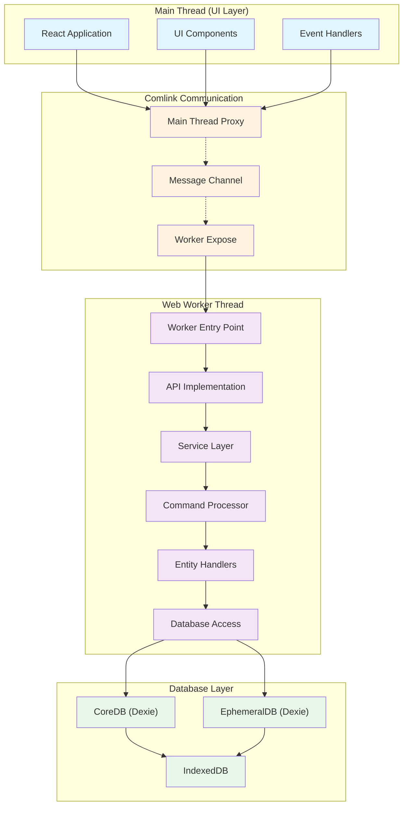
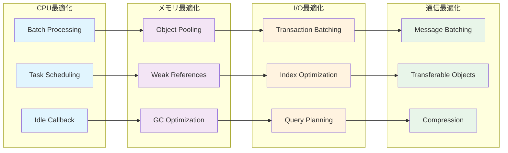
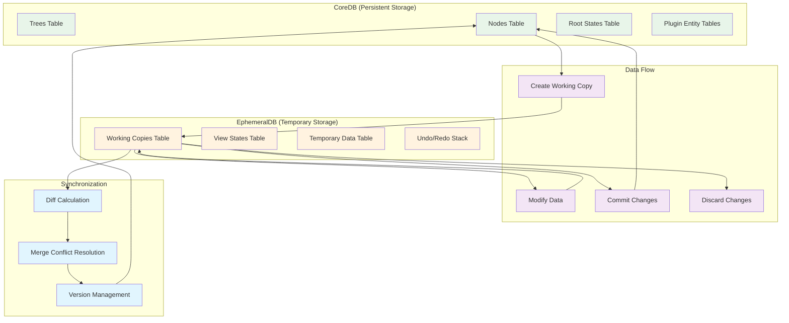
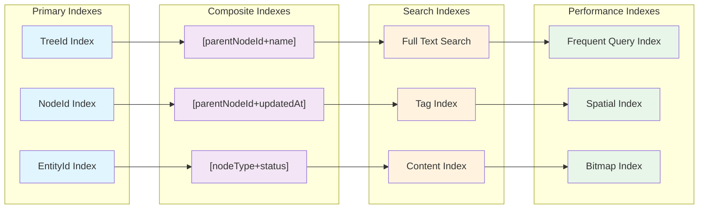
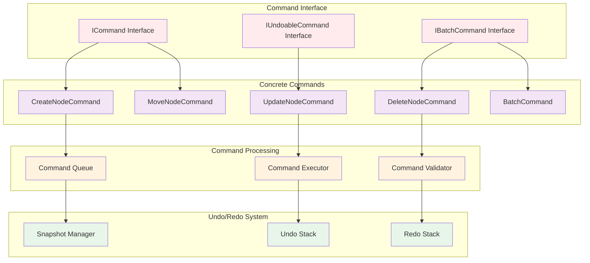
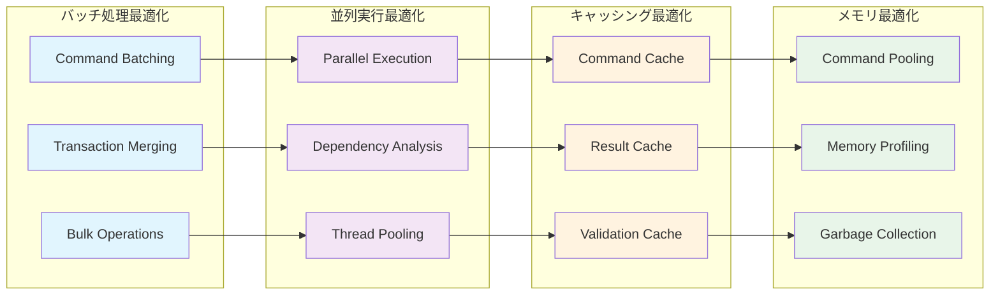

# 第8部 Worker (Web Worker Layer)

## Chapter 21: Worker アーキテクチャ (Worker Architecture) ⭐️⭐️⭐️⭐️⭐️

### 21.1 Worker層の責任分離 (Worker Layer Separation of Concerns) ⭐️⭐️⭐️⭐️⭐️

HierarchiDBのWorker層は、データベース操作とビジネスロジックを担当する独立したレイヤーです。UI層から完全に分離され、高いパフォーマンスと安全性を提供します。



### 21.2 Worker初期化プロセス (Worker Initialization Process) ⭐️⭐️⭐️⭐️⭐️

| フェーズ | 処理内容 | 責任者 | エラーハンドリング |
|----------|----------|--------|-------------------|
| **1. Worker起動** | Web Worker インスタンス作成 | Main Thread | Worker loading timeout |
| **2. 通信確立** | Comlink RPC 接続 | Both threads | Connection retry logic |
| **3. データベース初期化** | IndexedDB スキーマ作成 | Worker Thread | Schema migration |
| **4. プラグイン登録** | ノードタイプ登録 | Worker Thread | Plugin validation |
| **5. サービス開始** | API サービス有効化 | Worker Thread | Health check |

```typescript
// Worker初期化の実装例
class WorkerInitializer {
  private static instance: WorkerInitializer;
  private initializationPromise: Promise<void> | null = null;
  
  async initialize(): Promise<void> {
    if (this.initializationPromise) {
      return this.initializationPromise;
    }
    
    this.initializationPromise = this.performInitialization();
    return this.initializationPromise;
  }
  
  private async performInitialization(): Promise<void> {
    try {
      // 1. データベース初期化
      await this.initializeDatabases();
      
      // 2. プラグイン登録
      await this.registerPlugins();
      
      // 3. サービス開始
      await this.startServices();
      
      // 4. ヘルスチェック
      await this.performHealthCheck();
      
    } catch (error) {
      await this.handleInitializationError(error);
      throw error;
    }
  }
  
  private async initializeDatabases(): Promise<void> {
    // CoreDB初期化
    await CoreDBManager.initialize({
      name: 'hierarchidb-core',
      version: 1,
      stores: ['trees', 'nodes', 'rootStates']
    });
    
    // EphemeralDB初期化
    await EphemeralDBManager.initialize({
      name: 'hierarchidb-ephemeral',
      version: 1,
      stores: ['workingCopies', 'viewStates', 'temporaryData']
    });
  }
}
```

### 21.3 Worker パフォーマンス最適化 (Worker Performance Optimization) ⭐️⭐️⭐️⭐️



## Chapter 22: データベース管理 (Database Management) ⭐️⭐️⭐️⭐️⭐️

### 22.1 デュアルデータベース戦略 (Dual Database Strategy) ⭐️⭐️⭐️⭐️⭐️



### 22.2 トランザクション管理 (Transaction Management) ⭐️⭐️⭐️⭐️

| トランザクションタイプ | 対象データベース | 分離レベル | 期間 | 用途 |
|----------------------|------------------|------------|------|------|
| **Short Transaction** | CoreDB | Read Committed | < 100ms | 単一ノード操作 |
| **Long Transaction** | EphemeralDB | Serializable | 1-60分 | Working Copy編集 |
| **Batch Transaction** | CoreDB | Read Committed | < 5秒 | 一括データ操作 |
| **Cross-DB Transaction** | Both | Snapshot | < 1秒 | Working Copy コミット |
| **Read-Only Transaction** | CoreDB | Read Uncommitted | < 50ms | クエリ専用 |

```typescript
// トランザクション管理の実装
class TransactionManager {
  private activeTransactions = new Map<string, Transaction>();
  
  async executeInTransaction<T>(
    operation: (tx: Transaction) => Promise<T>,
    options: TransactionOptions = {}
  ): Promise<Result<T>> {
    const txId = this.generateTransactionId();
    const tx = await this.beginTransaction(options);
    
    try {
      this.activeTransactions.set(txId, tx);
      
      const result = await operation(tx);
      await tx.commit();
      
      return Result.success(result);
      
    } catch (error) {
      await tx.rollback();
      return Result.error(error as Error);
      
    } finally {
      this.activeTransactions.delete(txId);
    }
  }
  
  async executeBatchOperation<T>(
    operations: BatchOperation<T>[],
    options: BatchOptions = {}
  ): Promise<Result<T[]>> {
    return this.executeInTransaction(async (tx) => {
      const results: T[] = [];
      
      for (const operation of operations) {
        const result = await operation.execute(tx);
        results.push(result);
        
        // Progress callback
        if (options.onProgress) {
          options.onProgress(results.length, operations.length);
        }
      }
      
      return results;
    }, {
      isolationLevel: 'READ_COMMITTED',
      timeout: options.batchTimeout || 30000
    });
  }
}
```

### 22.3 インデックス最適化戦略 (Index Optimization Strategy) ⭐️⭐️⭐️⭐️⭐️



## Chapter 23: コマンドプロセッサ (Command Processor) ⭐️⭐️⭐️⭐️

### 23.1 コマンドパターン実装 (Command Pattern Implementation) ⭐️⭐️⭐️⭐️⭐️



### 23.2 コマンド実行フロー (Command Execution Flow) ⭐️⭐️⭐️⭐️

| フェーズ | 処理内容 | バリデーション | エラー対応 |
|----------|----------|----------------|------------|
| **1. 受信** | コマンド受信・パース | 構文チェック | Invalid command format |
| **2. 検証** | 権限・制約チェック | ビジネスルール | Permission denied |
| **3. 準備** | 前提条件確認 | データ整合性 | Precondition failed |
| **4. 実行** | データベース操作 | トランザクション | Database error |
| **5. 通知** | 変更通知送信 | サブスクリプション | Notification failure |
| **6. 記録** | Undo スタック更新 | 履歴管理 | History corruption |

```typescript
// コマンド実装の例
abstract class BaseCommand<TData = any, TResult = void> implements ICommand<TData, TResult> {
  protected readonly id: string;
  protected readonly timestamp: number;
  protected readonly data: TData;
  
  constructor(data: TData) {
    this.id = generateCommandId();
    this.timestamp = Date.now();
    this.data = data;
  }
  
  abstract validate(context: CommandContext): Promise<ValidationResult>;
  abstract execute(context: CommandContext): Promise<Result<TResult>>;
  
  // デフォルトのUndoサポート
  async undo(context: CommandContext): Promise<Result<void>> {
    throw new Error('Undo not implemented for this command');
  }
}

class CreateNodeCommand extends BaseCommand<CreateNodeData, NodeId> implements IUndoableCommand {
  async validate(context: CommandContext): Promise<ValidationResult> {
    // 親ノード存在チェック
    const parentExists = await context.database.nodeExists(this.data.parentNodeId);
    if (!parentExists) {
      return ValidationResult.error('Parent node does not exist');
    }
    
    // 名前重複チェック
    const nameConflict = await context.database.hasChildWithName(
      this.data.parentNodeId, 
      this.data.name
    );
    if (nameConflict) {
      return ValidationResult.error('Node name already exists');
    }
    
    return ValidationResult.success();
  }
  
  async execute(context: CommandContext): Promise<Result<NodeId>> {
    try {
      const nodeId = await context.database.createNode({
        id: generateNodeId() as NodeId,
        parentNodeId: this.data.parentNodeId,
        name: this.data.name,
        nodeType: this.data.nodeType,
        createdAt: this.timestamp,
        updatedAt: this.timestamp,
        version: 1
      });
      
      // ライフサイクルフック実行
      await context.pluginManager.executeHook('afterCreate', {
        nodeId,
        data: this.data
      });
      
      return Result.success(nodeId);
      
    } catch (error) {
      return Result.error(error as Error);
    }
  }
  
  async undo(context: CommandContext): Promise<Result<void>> {
    // Undoは削除コマンドの実行
    const deleteCommand = new DeleteNodeCommand({ 
      nodeId: this.getCreatedNodeId() 
    });
    
    return deleteCommand.execute(context).then(() => Result.success());
  }
}
```

### 23.3 パフォーマンス最適化 (Performance Optimization) ⭐️⭐️⭐️⭐️⭐️



## まとめ (Summary)

Worker層では、堅牢で高性能なデータ処理システムを構築しました：

- **アーキテクチャ**: UI層から完全分離されたWorkerスレッド
- **データベース管理**: デュアルデータベース戦略による安全な状態管理
- **コマンドプロセッサ**: Undo/Redo対応のコマンドパターン実装

この設計により、メインスレッドをブロックすることなく、大規模データの安全で高速な処理を実現しています。