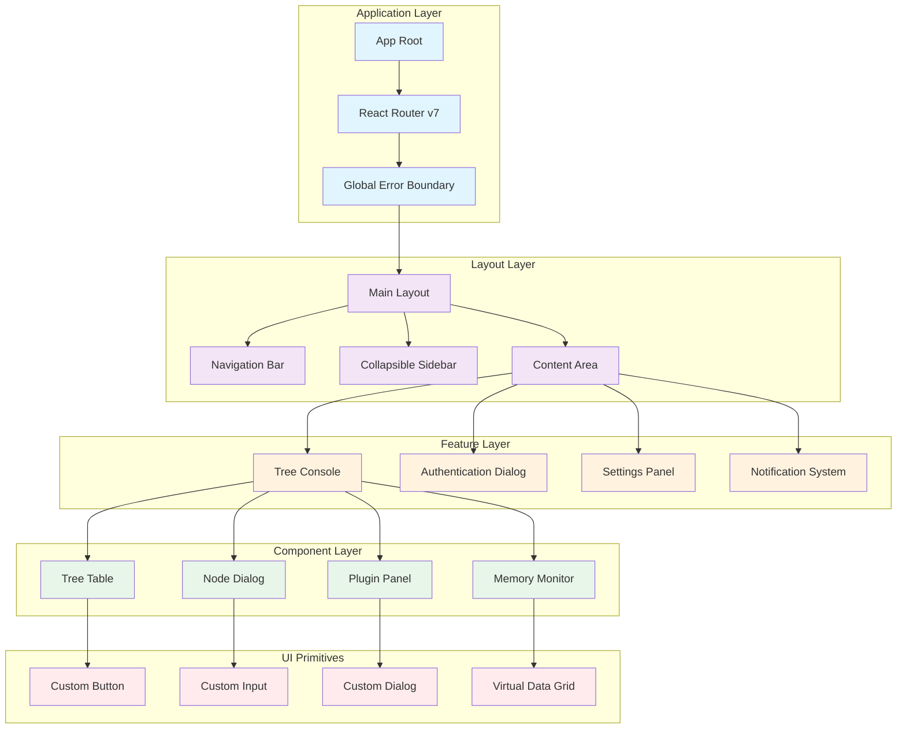
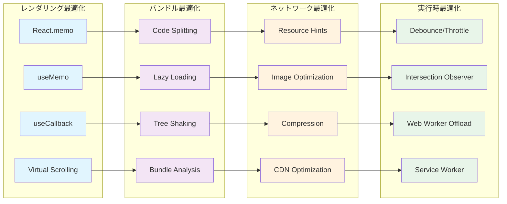
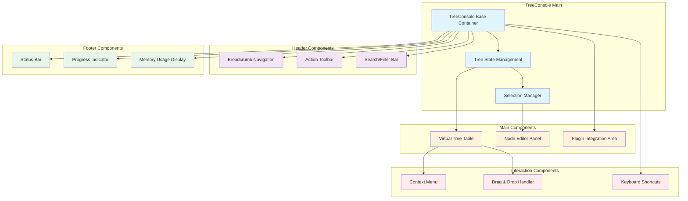
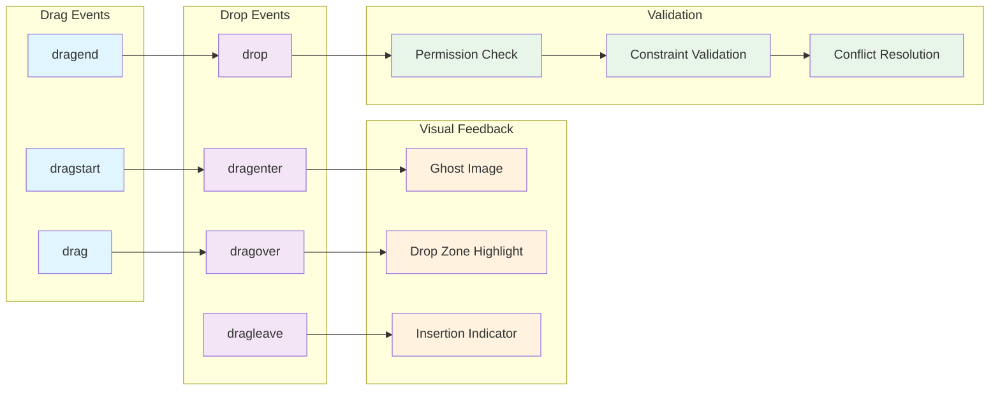
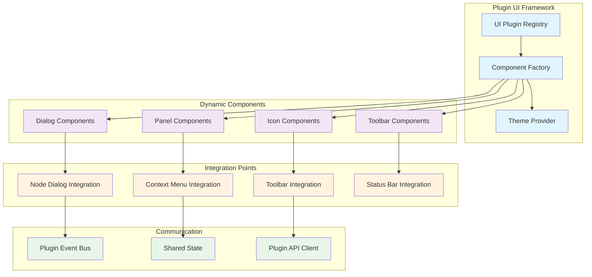
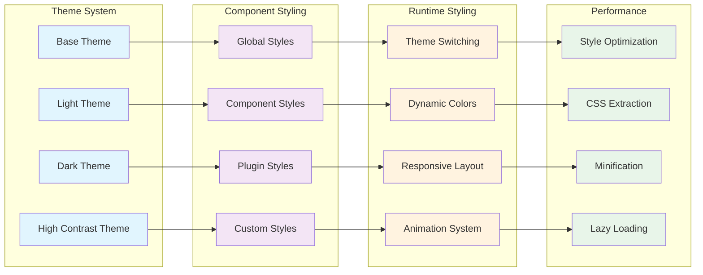

# 第9部 UI (User Interface)

## Chapter 24: React UI アーキテクチャ (React UI Architecture) ⭐️⭐️⭐️⭐️

### 24.1 コンポーネント階層設計 (Component Hierarchy Design)

HierarchiDBのUI層は、React 18とMaterial-UIを基盤とした階層型コンポーネントアーキテクチャを採用しています。



### 24.2 状態管理パターン (State Management Patterns)

| 状態タイプ | 管理方法 | 永続化 | スコープ | パフォーマンス考慮 |
|------------|----------|--------|---------|--------------------|
| **グローバル状態** | React Context | localStorage | アプリ全体 | Context分割で最適化 |
| **ページ状態** | useState/useReducer | SessionStorage | ページ内 | useMemo/useCallback |
| **フォーム状態** | React Hook Form | なし | フォーム内 | Uncontrolled components |
| **ツリー状態** | カスタムHook | EphemeralDB | ツリービュー | 仮想化 + 遅延読み込み |
| **Worker通信状態** | SWR/React Query | なし | API呼び出し | Background refresh |

### 24.3 パフォーマンス最適化戦略 (Performance Optimization Strategy)



## Chapter 25: Tree Console UI (Tree Console UI) ⭐️⭐️⭐️⭐️⭐️

### 25.1 TreeConsole アーキテクチャ (TreeConsole Architecture)



### 25.2 仮想化Tree Table実装 (Virtualized Tree Table Implementation)

```typescript
// 仮想化TreeTableの実装例
interface VirtualTreeTableProps {
  rootNodeId: NodeId;
  height: number;
  itemHeight: number;
  overscan?: number;
  onNodeSelect?: (nodeId: NodeId) => void;
  onNodeExpand?: (nodeId: NodeId, expanded: boolean) => void;
}

const VirtualTreeTable: React.FC<VirtualTreeTableProps> = ({
  rootNodeId,
  height,
  itemHeight,
  overscan = 10,
  onNodeSelect,
  onNodeExpand,
}) => {
  // フラット化されたツリーノードリスト
  const flattenedNodes = useMemo(() => {
    return flattenTreeNodes(rootNodeId, expandedNodes);
  }, [rootNodeId, expandedNodes]);

  // 仮想化の設定
  const rowVirtualizer = useVirtualizer({
    count: flattenedNodes.length,
    getScrollElement: () => scrollElementRef.current,
    estimateSize: () => itemHeight,
    overscan,
  });

  // 選択状態の管理
  const [selectedNodes, setSelectedNodes] = useState<Set<NodeId>>(new Set());
  const [expandedNodes, setExpandedNodes] = useState<Set<NodeId>>(new Set());

  // ノード展開/折りたたみ
  const handleNodeExpand = useCallback((nodeId: NodeId, expanded: boolean) => {
    setExpandedNodes(prev => {
      const newSet = new Set(prev);
      if (expanded) {
        newSet.add(nodeId);
      } else {
        newSet.delete(nodeId);
      }
      return newSet;
    });
    
    onNodeExpand?.(nodeId, expanded);
  }, [onNodeExpand]);

  // キーボード操作
  const handleKeyDown = useCallback((event: React.KeyboardEvent) => {
    const selectedArray = Array.from(selectedNodes);
    const currentIndex = flattenedNodes.findIndex(node => 
      selectedArray.includes(node.id)
    );

    switch (event.key) {
      case 'ArrowDown':
        if (currentIndex < flattenedNodes.length - 1) {
          const nextNode = flattenedNodes[currentIndex + 1];
          setSelectedNodes(new Set([nextNode.id]));
          onNodeSelect?.(nextNode.id);
        }
        break;
        
      case 'ArrowUp':
        if (currentIndex > 0) {
          const prevNode = flattenedNodes[currentIndex - 1];
          setSelectedNodes(new Set([prevNode.id]));
          onNodeSelect?.(prevNode.id);
        }
        break;
        
      case 'ArrowRight':
        if (currentIndex >= 0) {
          const currentNode = flattenedNodes[currentIndex];
          if (!expandedNodes.has(currentNode.id) && currentNode.hasChildren) {
            handleNodeExpand(currentNode.id, true);
          }
        }
        break;
        
      case 'ArrowLeft':
        if (currentIndex >= 0) {
          const currentNode = flattenedNodes[currentIndex];
          if (expandedNodes.has(currentNode.id)) {
            handleNodeExpand(currentNode.id, false);
          }
        }
        break;
    }
  }, [selectedNodes, expandedNodes, flattenedNodes, onNodeSelect, handleNodeExpand]);

  return (
    <div
      ref={scrollElementRef}
      style={{ height, overflow: 'auto' }}
      onKeyDown={handleKeyDown}
      tabIndex={0}
    >
      <div
        style={{
          height: `${rowVirtualizer.getTotalSize()}px`,
          width: '100%',
          position: 'relative',
        }}
      >
        {rowVirtualizer.getVirtualItems().map((virtualItem) => {
          const node = flattenedNodes[virtualItem.index];
          const isSelected = selectedNodes.has(node.id);
          const isExpanded = expandedNodes.has(node.id);

          return (
            <TreeNodeRow
              key={node.id}
              node={node}
              style={{
                position: 'absolute',
                top: 0,
                left: 0,
                width: '100%',
                height: `${virtualItem.size}px`,
                transform: `translateY(${virtualItem.start}px)`,
              }}
              isSelected={isSelected}
              isExpanded={isExpanded}
              onSelect={() => {
                setSelectedNodes(new Set([node.id]));
                onNodeSelect?.(node.id);
              }}
              onExpand={(expanded) => handleNodeExpand(node.id, expanded)}
            />
          );
        })}
      </div>
    </div>
  );
};
```

### 25.3 ドラッグ＆ドロップシステム (Drag & Drop System)

| 操作タイプ | 許可される移動 | 制約 | フィードバック |
|------------|----------------|------|----------------|
| **ノード移動** | 同一ツリー内 | 親子循環禁止 | ドロップゾーン強調 |
| **ファイルアップロード** | 外部→ツリー | ファイル形式制限 | プログレスバー |
| **テキストドロップ** | 外部→ノード | テキスト形式のみ | 挿入位置表示 |
| **複数選択移動** | バッチ操作 | 一貫性チェック | まとめて移動表示 |



## Chapter 26: プラグイン UI統合 (Plugin UI Integration) ⭐️⭐️⭐️⭐️

### 26.1 プラグインUI アーキテクチャ (Plugin UI Architecture)



### 26.2 動的コンポーネント読み込み (Dynamic Component Loading)

```typescript
// 動的プラグインコンポーネント読み込みシステム
class PluginComponentRegistry {
  private componentCache = new Map<string, React.ComponentType<any>>();
  private loadingPromises = new Map<string, Promise<React.ComponentType<any>>>();

  async loadComponent(
    pluginId: string, 
    componentType: 'dialog' | 'panel' | 'icon'
  ): Promise<React.ComponentType<any>> {
    const cacheKey = `${pluginId}:${componentType}`;
    
    // キャッシュから取得
    if (this.componentCache.has(cacheKey)) {
      return this.componentCache.get(cacheKey)!;
    }
    
    // 読み込み中の場合は同じPromiseを返す
    if (this.loadingPromises.has(cacheKey)) {
      return this.loadingPromises.get(cacheKey)!;
    }
    
    // 動的インポート実行
    const loadingPromise = this.performDynamicImport(pluginId, componentType);
    this.loadingPromises.set(cacheKey, loadingPromise);
    
    try {
      const component = await loadingPromise;
      this.componentCache.set(cacheKey, component);
      return component;
    } finally {
      this.loadingPromises.delete(cacheKey);
    }
  }

  private async performDynamicImport(
    pluginId: string, 
    componentType: string
  ): Promise<React.ComponentType<any>> {
    try {
      // プラグインモジュールの動的インポート
      const module = await import(`@hierarchidb/plugin-${pluginId}`);
      
      // コンポーネントタイプに応じた取得
      switch (componentType) {
        case 'dialog':
          return module.DialogComponent;
        case 'panel':
          return module.PanelComponent;
        case 'icon':
          return module.IconComponent;
        default:
          throw new Error(`Unknown component type: ${componentType}`);
      }
      
    } catch (error) {
      console.error(`Failed to load plugin component: ${pluginId}:${componentType}`, error);
      
      // フォールバック用デフォルトコンポーネント
      return this.getDefaultComponent(componentType);
    }
  }

  private getDefaultComponent(componentType: string): React.ComponentType<any> {
    switch (componentType) {
      case 'dialog':
        return ({ children }: { children: React.ReactNode }) => (
          <div>Plugin dialog not available: {children}</div>
        );
      case 'panel':
        return ({ children }: { children: React.ReactNode }) => (
          <div>Plugin panel not available: {children}</div>
        );
      case 'icon':
        return () => <span>?</span>;
      default:
        return () => <div>Unknown component</div>;
    }
  }
}

// React Suspense と組み合わせた使用例
const DynamicPluginComponent: React.FC<{
  pluginId: string;
  componentType: 'dialog' | 'panel' | 'icon';
  props: any;
}> = ({ pluginId, componentType, props }) => {
  const [Component, setComponent] = useState<React.ComponentType<any> | null>(null);
  const [error, setError] = useState<Error | null>(null);

  useEffect(() => {
    let cancelled = false;
    
    PluginComponentRegistry.getInstance()
      .loadComponent(pluginId, componentType)
      .then(component => {
        if (!cancelled) {
          setComponent(() => component);
        }
      })
      .catch(error => {
        if (!cancelled) {
          setError(error);
        }
      });
      
    return () => {
      cancelled = true;
    };
  }, [pluginId, componentType]);

  if (error) {
    return <div>Error loading plugin component: {error.message}</div>;
  }

  if (!Component) {
    return <div>Loading plugin component...</div>;
  }

  return <Component {...props} />;
};
```

### 26.3 テーマとスタイリング統合 (Theme and Styling Integration)

| スタイリング要素 | 実装方法 | カスタマイズ性 | パフォーマンス |
|------------------|----------|----------------|----------------|
| **グローバルテーマ** | MUI Theme Provider | 高 | 優秀 |
| **コンポーネントスタイル** | styled-components | 高 | 良好 |
| **プラグイン固有スタイル** | CSS Modules | 中 | 優秀 |
| **動的スタイル** | CSS-in-JS | 高 | 中程度 |
| **レスポンシブデザイン** | MUI Breakpoints | 高 | 優秀 |



## まとめ (Summary)

UI層では、現代的で高性能なReactアプリケーションを構築しました：

- **コンポーネント階層**: 再利用可能で保守性の高い階層設計
- **TreeConsole**: 仮想化による大規模データ表示対応
- **プラグイン統合**: 動的コンポーネント読み込みによる拡張性

この設計により、ユーザーフレンドリーで高性能なインターフェースを提供し、プラグインによる機能拡張も容易に実現できます。