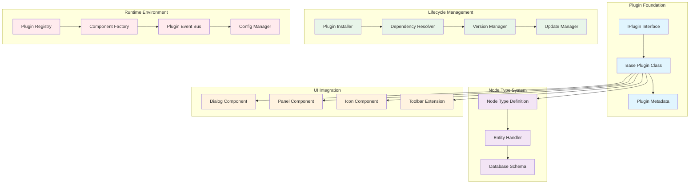
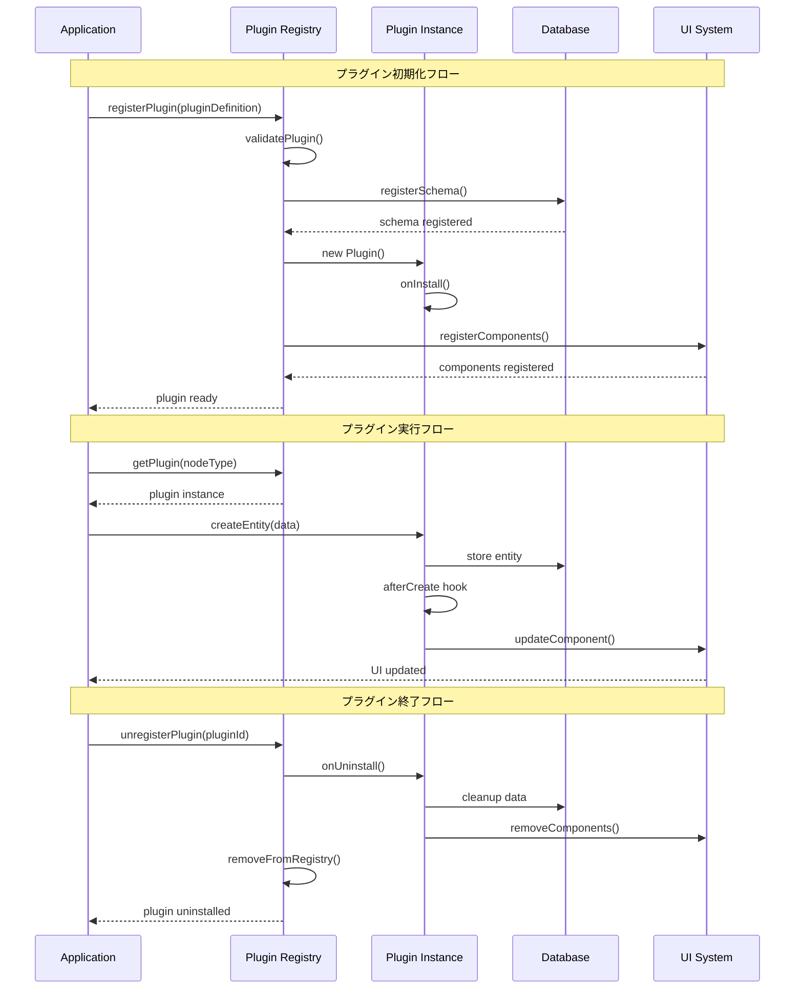
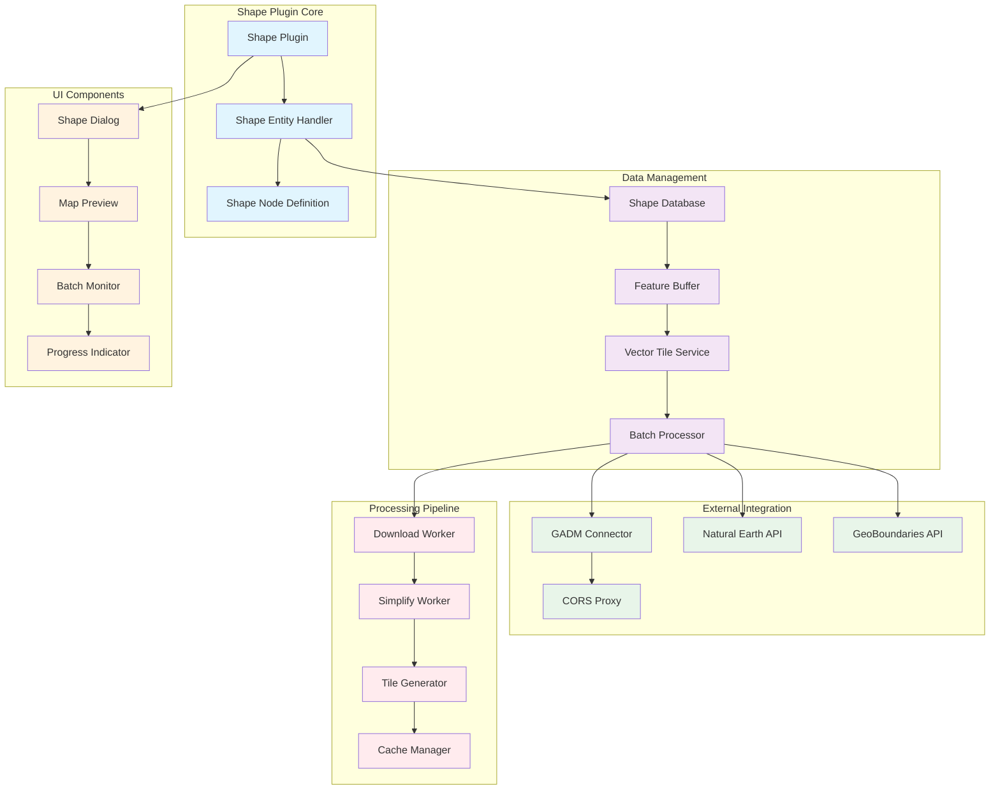
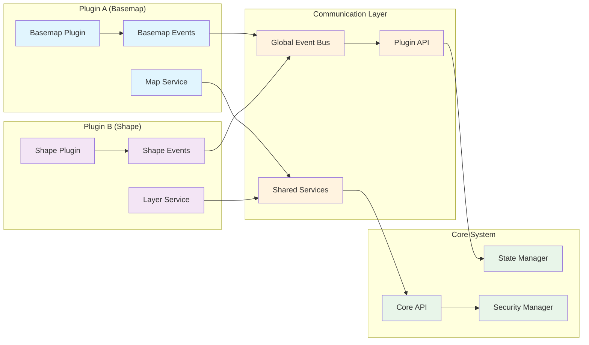

# 第10部 プラグイン (Plugins)

## Chapter 27: プラグインシステム概要 (Plugin System Overview)

### 27.1 プラグインアーキテクチャ (Plugin Architecture)

HierarchiDBのプラグインシステムは、ノードタイプベースの拡張アーキテクチャを採用し、型安全で動的な機能拡張を実現しています。



### 27.2 プラグイン開発パターン (Plugin Development Patterns)

| パターン | 適用場面 | 実装複雑度 | 拡張性 | 例 |
|----------|----------|------------|--------|-----|
| **Simple Entity Plugin** | 基本的なデータ管理 | 低 | 中 | Folder Plugin |
| **Complex Entity Plugin** | 高度なデータ処理 | 高 | 高 | Shape Plugin |
| **Service Plugin** | 外部API統合 | 中 | 中 | Basemap Plugin |
| **UI Extension Plugin** | インターフェース拡張 | 中 | 低 | Toolbar Plugin |
| **Workflow Plugin** | ビジネスプロセス | 高 | 高 | Import/Export Plugin |

### 27.3 プラグインライフサイクル (Plugin Lifecycle)



## Chapter 28: 既存プラグイン解析 (Existing Plugin Analysis)

### 28.1 Shape Plugin アーキテクチャ (Shape Plugin Architecture)

Shape Pluginは、地理的形状データの管理と可視化を担当する複雑なプラグインの代表例です。



### 28.2 Basemap Plugin パターン (Basemap Plugin Pattern)

```typescript
// Basemap Plugin 実装例
@Plugin({
  name: 'basemap',
  version: '1.0.0',
  nodeType: 'basemap',
  dependencies: ['@hierarchidb/ui-map']
})
export class BasemapPlugin implements IPlugin {
  readonly metadata: PluginMetadata = {
    id: 'basemap',
    name: 'Basemap Plugin',
    description: 'Manages basemap configurations for geographic visualization',
    version: '1.0.0',
    author: 'HierarchiDB Team',
    dependencies: [
      { name: '@hierarchidb/ui-map', version: '^1.0.0' }
    ]
  };

  // Node Type Definition
  getNodeTypeDefinition(): NodeTypeDefinition<BasemapEntity> {
    return {
      nodeType: 'basemap',
      database: {
        entityStore: 'basemaps',
        schema: {
          '&id': 'EntityId',
          'nodeId': 'NodeId',
          'name': 'string',
          'url': 'string',
          'type': 'string',
          'attribution': 'string?',
          'maxZoom': 'number?',
          'bounds?': '[number, number, number, number]',
          'createdAt': 'number',
          'updatedAt': 'number',
          'version': 'number'
        },
        version: 1
      },
      entityHandler: new BasemapEntityHandler(),
      lifecycle: {
        afterCreate: this.afterCreate.bind(this),
        beforeDelete: this.beforeDelete.bind(this),
      },
      ui: {
        dialogComponent: BasemapDialog,
        panelComponent: BasemapPanel,
        iconComponent: BasemapIcon
      }
    };
  }

  // Entity Handler Implementation
  private entityHandler = new class extends BaseEntityHandler<BasemapEntity> {
    async createEntity(nodeId: NodeId, data: Partial<BasemapEntity>): Promise<BasemapEntity> {
      const entityId = generateEntityId() as EntityId;
      
      const entity: BasemapEntity = {
        id: entityId,
        nodeId,
        name: data.name || 'New Basemap',
        url: data.url || '',
        type: data.type || 'tile',
        attribution: data.attribution,
        maxZoom: data.maxZoom || 18,
        bounds: data.bounds,
        createdAt: Date.now(),
        updatedAt: Date.now(),
        version: 1
      };

      await this.table.add(entity);
      return entity;
    }

    async validateBasemapUrl(url: string): Promise<ValidationResult> {
      try {
        // URL形式チェック
        new URL(url);
        
        // プロトコルチェック
        if (!url.startsWith('https://')) {
          return ValidationResult.error('HTTPS required for basemap URLs');
        }
        
        // 基本的な到達性チェック（HEAD request）
        const response = await fetch(url, { method: 'HEAD' });
        if (!response.ok) {
          return ValidationResult.error(`Basemap URL not accessible: ${response.status}`);
        }
        
        return ValidationResult.success();
        
      } catch (error) {
        return ValidationResult.error(`Invalid basemap URL: ${error.message}`);
      }
    }
  }();

  // Lifecycle Hooks
  private async afterCreate(node: TreeNode, context: OperationContext): Promise<void> {
    // デフォルトBasemap設定の適用
    const defaultBasemap = this.getDefaultBasemapConfig();
    await this.entityHandler.createEntity(node.id, defaultBasemap);
    
    // Map component への通知
    context.eventBus.emit('basemap:created', {
      nodeId: node.id,
      basemap: defaultBasemap
    });
  }

  private async beforeDelete(node: TreeNode, context: OperationContext): Promise<void> {
    // 関連するキャッシュデータの清理
    await this.clearBasemapCache(node.id);
    
    // Map component への通知
    context.eventBus.emit('basemap:deleted', {
      nodeId: node.id
    });
  }

  // Helper Methods
  private getDefaultBasemapConfig(): Partial<BasemapEntity> {
    return {
      name: 'OpenStreetMap',
      url: 'https://tile.openstreetmap.org/{z}/{x}/{y}.png',
      type: 'tile',
      attribution: '© OpenStreetMap contributors',
      maxZoom: 19
    };
  }

  private async clearBasemapCache(nodeId: NodeId): Promise<void> {
    // 実装: キャッシュクリア処理
  }
}

// Plugin UI Components
const BasemapDialog: React.FC<PluginDialogProps<BasemapEntity>> = ({ 
  entity, 
  onSave, 
  onCancel 
}) => {
  const [formData, setFormData] = useState<Partial<BasemapEntity>>(entity || {});
  const [validationErrors, setValidationErrors] = useState<Record<string, string>>({});

  const handleUrlValidation = useCallback(async (url: string) => {
    if (!url) return;
    
    const handler = new BasemapPlugin().entityHandler;
    const result = await handler.validateBasemapUrl(url);
    
    if (!result.success) {
      setValidationErrors(prev => ({
        ...prev,
        url: result.error
      }));
    } else {
      setValidationErrors(prev => {
        const { url, ...rest } = prev;
        return rest;
      });
    }
  }, []);

  return (
    <Dialog open onClose={onCancel}>
      <DialogTitle>
        {entity ? 'Edit Basemap' : 'Create Basemap'}
      </DialogTitle>
      
      <DialogContent>
        <TextField
          fullWidth
          label="Basemap Name"
          value={formData.name || ''}
          onChange={(e) => setFormData(prev => ({ 
            ...prev, 
            name: e.target.value 
          }))}
          margin="normal"
        />
        
        <TextField
          fullWidth
          label="Tile URL Template"
          value={formData.url || ''}
          onChange={(e) => setFormData(prev => ({ 
            ...prev, 
            url: e.target.value 
          }))}
          onBlur={(e) => handleUrlValidation(e.target.value)}
          error={!!validationErrors.url}
          helperText={validationErrors.url || 'Use {x}, {y}, {z} for tile coordinates'}
          margin="normal"
        />
        
        <Select
          fullWidth
          value={formData.type || 'tile'}
          onChange={(e) => setFormData(prev => ({ 
            ...prev, 
            type: e.target.value 
          }))}
        >
          <MenuItem value="tile">Tile Layer</MenuItem>
          <MenuItem value="wms">WMS Layer</MenuItem>
          <MenuItem value="vector">Vector Layer</MenuItem>
        </Select>
        
        <TextField
          fullWidth
          label="Attribution"
          value={formData.attribution || ''}
          onChange={(e) => setFormData(prev => ({ 
            ...prev, 
            attribution: e.target.value 
          }))}
          margin="normal"
        />
      </DialogContent>
      
      <DialogActions>
        <Button onClick={onCancel}>Cancel</Button>
        <Button 
          onClick={() => onSave(formData)}
          disabled={Object.keys(validationErrors).length > 0}
        >
          Save
        </Button>
      </DialogActions>
    </Dialog>
  );
};
```

### 28.3 プラグイン間通信 (Inter-Plugin Communication)

| 通信パターン | 実装方法 | 用途 | セキュリティ |
|--------------|----------|------|-------------|
| **Event Bus** | カスタムEventEmitter | 疎結合な通知 | イベント型検証 |
| **Shared Service** | Singleton Service | 共通機能提供 | インターフェース制限 |
| **Plugin API** | 公開API呼び出し | 機能連携 | 権限チェック |
| **State Sharing** | React Context | UI状態共有 | スコープ制限 |
| **Message Passing** | Worker通信 | 非同期処理 | メッセージ検証 |



## Chapter 29: プラグイン開発ガイド (Plugin Development Guide)

### 29.1 プラグイン開発プロセス (Plugin Development Process)

```mermaid
graph TB
    subgraph "1. 設計フェーズ"
        RequirementAnalysis["要件分析"]
        ArchitectureDesign["アーキテクチャ設計"]
        UIWireframe["UI ワイヤーフレーム"]
        DataModelDesign["データモデル設計"]
    end
    
    subgraph "2. 開発フェーズ"
        ProjectSetup["プロジェクト初期化"]
        CoreImplementation["コア機能実装"]
        UIImplementation["UI 実装"]
        TestImplementation["テスト実装"]
    end
    
    subgraph "3. 統合フェーズ"
        PluginRegistration["プラグイン登録"]
        IntegrationTesting["統合テスト"]
        PerformanceTesting["パフォーマンステスト"]
        UITesting["UI テスト"]
    end
    
    subgraph "4. デプロイフェーズ"
        PackageBuilding["パッケージビルド"]
        DocumentationGeneration["ドキュメント生成"]
        PluginPublishing["プラグイン公開"]
        VersionManagement["バージョン管理"]
    end
    
    RequirementAnalysis --> ArchitectureDesign
    ArchitectureDesign --> UIWireframe
    UIWireframe --> DataModelDesign
    
    DataModelDesign --> ProjectSetup
    ProjectSetup --> CoreImplementation
    CoreImplementation --> UIImplementation
    UIImplementation --> TestImplementation
    
    TestImplementation --> PluginRegistration
    PluginRegistration --> IntegrationTesting
    IntegrationTesting --> PerformanceTesting
    PerformanceTesting --> UITesting
    
    UITesting --> PackageBuilding
    PackageBuilding --> DocumentationGeneration
    DocumentationGeneration --> PluginPublishing
    PluginPublishing --> VersionManagement
    
    classDef design fill:#e1f5fe
    classDef development fill:#f3e5f5
    classDef integration fill:#fff3e0
    classDef deployment fill:#e8f5e9
    
    class RequirementAnalysis,ArchitectureDesign,UIWireframe,DataModelDesign design
    class ProjectSetup,CoreImplementation,UIImplementation,TestImplementation development
    class PluginRegistration,IntegrationTesting,PerformanceTesting,UITesting integration
    class PackageBuilding,DocumentationGeneration,PluginPublishing,VersionManagement deployment
```



### 29.2 プラグイン開発テンプレート (Plugin Development Template)

```typescript
// Plugin Template - plugin-template/src/index.ts
import { 
  IPlugin, 
  PluginMetadata, 
  NodeTypeDefinition,
  BaseEntityHandler,
  ValidationResult 
} from '@hierarchidb/core';
import type { EntityId, NodeId } from '@hierarchidb/core/types';

// Entity Type Definition
export interface TemplateEntity {
  id: EntityId;
  nodeId: NodeId;
  name: string;
  description?: string;
  config: TemplateConfig;
  createdAt: number;
  updatedAt: number;
  version: number;
}

export interface TemplateConfig {
  enabled: boolean;
  settings: Record<string, any>;
}

// Entity Handler
class TemplateEntityHandler extends BaseEntityHandler<TemplateEntity> {
  protected tableName = 'template_entities';

  async createEntity(nodeId: NodeId, data: Partial<TemplateEntity>): Promise<TemplateEntity> {
    const entityId = this.generateEntityId() as EntityId;
    
    const entity: TemplateEntity = {
      id: entityId,
      nodeId,
      name: data.name || 'New Template Entity',
      description: data.description,
      config: data.config || {
        enabled: true,
        settings: {}
      },
      createdAt: Date.now(),
      updatedAt: Date.now(),
      version: 1
    };

    // Custom validation
    const validation = await this.validateEntity(entity);
    if (!validation.success) {
      throw new Error(validation.error);
    }

    await this.table.add(entity);
    return entity;
  }

  async updateEntity(entityId: EntityId, updates: Partial<TemplateEntity>): Promise<void> {
    const existing = await this.table.get(entityId);
    if (!existing) {
      throw new Error('Entity not found');
    }

    const updated: TemplateEntity = {
      ...existing,
      ...updates,
      updatedAt: Date.now(),
      version: existing.version + 1
    };

    // Custom validation
    const validation = await this.validateEntity(updated);
    if (!validation.success) {
      throw new Error(validation.error);
    }

    await this.table.update(entityId, updated);
  }

  private async validateEntity(entity: TemplateEntity): Promise<ValidationResult> {
    // Custom business logic validation
    if (!entity.name?.trim()) {
      return ValidationResult.error('Name is required');
    }
    
    if (entity.name.length > 100) {
      return ValidationResult.error('Name too long (max 100 characters)');
    }
    
    // Additional validations...
    
    return ValidationResult.success();
  }
}

// Main Plugin Class
export class TemplatePlugin implements IPlugin {
  readonly metadata: PluginMetadata = {
    id: 'template',
    name: 'Template Plugin',
    description: 'A template plugin for demonstration purposes',
    version: '1.0.0',
    author: 'Your Name',
    dependencies: [
      { name: '@hierarchidb/core', version: '^1.0.0' },
      { name: '@hierarchidb/ui-core', version: '^1.0.0' }
    ]
  };

  private entityHandler = new TemplateEntityHandler();

  getNodeTypeDefinition(): NodeTypeDefinition<TemplateEntity> {
    return {
      nodeType: 'template',
      database: {
        entityStore: 'template_entities',
        schema: {
          '&id': 'EntityId',
          'nodeId': 'NodeId',
          'name': 'string',
          'description': 'string?',
          'config': 'object',
          'createdAt': 'number',
          'updatedAt': 'number',
          'version': 'number'
        },
        version: 1
      },
      entityHandler: this.entityHandler,
      lifecycle: {
        afterCreate: this.afterCreate.bind(this),
        beforeUpdate: this.beforeUpdate.bind(this),
        beforeDelete: this.beforeDelete.bind(this)
      },
      ui: {
        dialogComponent: React.lazy(() => import('./components/TemplateDialog')),
        panelComponent: React.lazy(() => import('./components/TemplatePanel')),
        iconComponent: React.lazy(() => import('./components/TemplateIcon'))
      }
    };
  }

  // Lifecycle Hooks
  async afterCreate(node: TreeNode, context: OperationContext): Promise<void> {
    console.log(`Template node created: ${node.id}`);
    
    // Initialize default entity
    await this.entityHandler.createEntity(node.id, {
      name: node.name,
      config: {
        enabled: true,
        settings: this.getDefaultSettings()
      }
    });
  }

  async beforeUpdate(node: TreeNode, updates: Partial<TreeNode>, context: OperationContext): Promise<void> {
    console.log(`Template node updating: ${node.id}`);
    
    // Sync entity name with node name if changed
    if (updates.name && updates.name !== node.name) {
      const entity = await this.entityHandler.getByNodeId(node.id);
      if (entity) {
        await this.entityHandler.updateEntity(entity.id, {
          name: updates.name
        });
      }
    }
  }

  async beforeDelete(node: TreeNode, context: OperationContext): Promise<void> {
    console.log(`Template node deleting: ${node.id}`);
    
    // Cleanup associated data
    const entity = await this.entityHandler.getByNodeId(node.id);
    if (entity) {
      await this.entityHandler.deleteEntity(entity.id);
    }
  }

  // Plugin-specific methods
  async getDefaultSettings(): Promise<Record<string, any>> {
    return {
      theme: 'default',
      showAdvanced: false,
      autoSave: true
    };
  }

  async exportData(nodeId: NodeId): Promise<any> {
    const entity = await this.entityHandler.getByNodeId(nodeId);
    return {
      entity,
      exportedAt: new Date().toISOString(),
      version: this.metadata.version
    };
  }

  async importData(nodeId: NodeId, data: any): Promise<void> {
    // Validate import data
    if (!data.entity) {
      throw new Error('Invalid import data');
    }

    // Update entity with imported data
    const existing = await this.entityHandler.getByNodeId(nodeId);
    if (existing) {
      await this.entityHandler.updateEntity(existing.id, {
        ...data.entity,
        nodeId, // Ensure nodeId consistency
        updatedAt: Date.now()
      });
    }
  }
}

// Export plugin instance
export default new TemplatePlugin();
```

### 29.3 プラグインテスト戦略 (Plugin Testing Strategy)

| テストタイプ | 目的 | 実装方法 | カバレッジ目標 |
|--------------|------|----------|----------------|
| **Unit Tests** | 個別機能テスト | Jest + Testing Library | 90%+ |
| **Integration Tests** | プラグイン統合テスト | Cypress | 80%+ |
| **UI Component Tests** | UI コンポーネントテスト | Storybook + Jest | 85%+ |
| **E2E Tests** | エンドツーエンドテスト | Playwright | 主要フロー100% |
| **Performance Tests** | パフォーマンステスト | Lighthouse CI | Core Web Vitals |

```typescript
// Plugin Test Example - __tests__/TemplatePlugin.test.ts
import { TemplatePlugin } from '../src/TemplatePlugin';
import { mockNodeTypeRegistry, mockDatabase } from '@hierarchidb/test-utils';

describe('TemplatePlugin', () => {
  let plugin: TemplatePlugin;
  let mockDB: any;

  beforeEach(() => {
    plugin = new TemplatePlugin();
    mockDB = mockDatabase();
  });

  describe('Entity Creation', () => {
    it('should create entity with default values', async () => {
      const nodeId = 'node-123' as NodeId;
      const entity = await plugin.entityHandler.createEntity(nodeId, {
        name: 'Test Entity'
      });

      expect(entity).toMatchObject({
        nodeId,
        name: 'Test Entity',
        config: {
          enabled: true,
          settings: expect.any(Object)
        }
      });
    });

    it('should validate entity data', async () => {
      const nodeId = 'node-123' as NodeId;
      
      await expect(
        plugin.entityHandler.createEntity(nodeId, { name: '' })
      ).rejects.toThrow('Name is required');
    });
  });

  describe('Lifecycle Hooks', () => {
    it('should initialize entity after node creation', async () => {
      const node = createMockNode('template');
      const context = createMockContext();

      await plugin.afterCreate(node, context);

      const entity = await plugin.entityHandler.getByNodeId(node.id);
      expect(entity).toBeDefined();
      expect(entity.name).toBe(node.name);
    });
  });

  describe('Data Export/Import', () => {
    it('should export entity data', async () => {
      const nodeId = 'node-123' as NodeId;
      const entity = await plugin.entityHandler.createEntity(nodeId, {
        name: 'Test Entity'
      });

      const exported = await plugin.exportData(nodeId);
      
      expect(exported).toMatchObject({
        entity: expect.objectContaining({
          id: entity.id,
          name: 'Test Entity'
        }),
        version: plugin.metadata.version
      });
    });
  });
});
```

## まとめ (Summary)

プラグインシステムでは、拡張性と保守性を両立した設計を実現しました：

- **アーキテクチャ**: 型安全で動的なプラグイン拡張システム
- **既存プラグイン**: Shape、Basemap等の実装パターンの解析
- **開発ガイド**: テンプレートとベストプラクティスの提供

この設計により、開発者は一貫した方法でHierarchiDBの機能を拡張し、エンドユーザーに価値ある機能を提供できます。