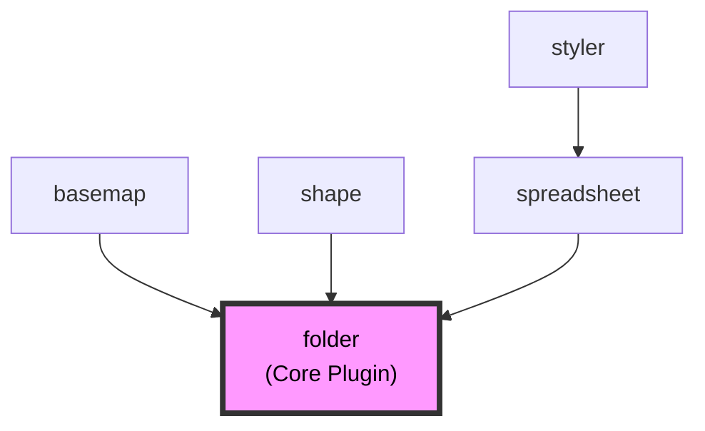
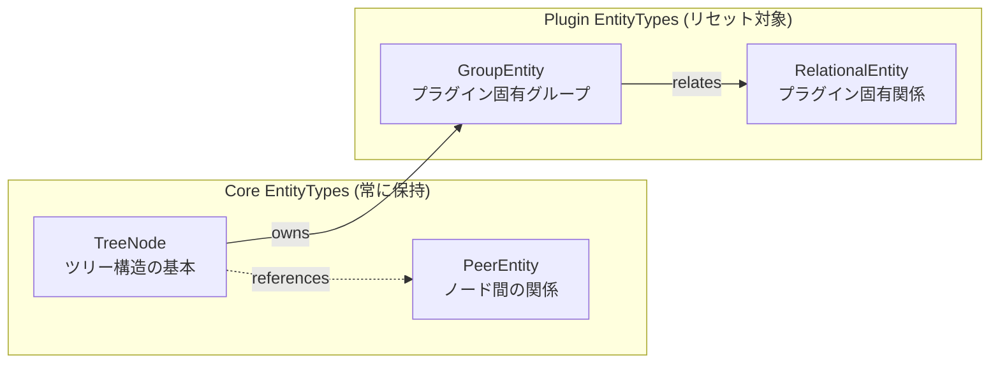

# Chapter 31: プラグイン管理システム (Plugin Management System) ⭐️⭐️⭐️⭐️⭐️

## 31.1 プラグイン自動検出システム (Plugin Auto-Discovery System)

### 31.1.1 Package.jsonベースの自動検出

HierarchiDBは、アプリケーションの`package.json`の`dependencies`から、特定のパターンに合致するパッケージを自動的にプラグインとして検出します。

```typescript
// packages/common/core/src/plugin-loader/SimplePluginDiscovery.ts

export class SimplePluginDiscovery {
  private static readonly NODE_TYPE_PLUGIN_PATTERN = /^@hierarchidb\/node-type-(.+)-plugin$/;

  /**
   * app/package.jsonのdependenciesから自動検出
   * @hierarchidb/node-type-*-plugin パターンに合致するものがプラグイン
   */
  discoverPluginsFromPackageJson(packageJson: PackageJson): NodeType[] {
    const plugins: NodeType[] = [];
    
    for (const packageName of Object.keys(packageJson.dependencies || {})) {
      const pluginName = this.extractPluginName(packageName);
      if (pluginName) {
        plugins.push(pluginName as NodeType);
      }
    }
    
    return plugins;
  }
}
```

### 31.1.2 依存関係の自動解決

各プラグインの`package.json`から依存関係を読み取り、推移的な依存関係を含めて解決します。

```json
// packages/node-type-plugin/styler-plugin/package.json
{
  "name": "@hierarchidb/node-type-styler-plugin-plugin",
  "dependencies": {
    "@hierarchidb/node-type-spreadsheet-plugin": "workspace:*"
  },
  "hierarchidb": {
    "plugin": {
      "nodeType": "styler-plugin",
      "extends": "spreadsheet-plugin",
      "dependencies": ["spreadsheet-plugin"]
    }
  }
}
```

### 31.1.3 循環依存の検出

DFS（深さ優先探索）アルゴリズムを使用して循環依存を検出し、エラーを報告します。

```typescript
private detectCircularDependencies(graph: Record<NodeType, NodeType[]>): void {
  const visited = new Set<NodeType>();
  const recursionStack = new Set<NodeType>();
  
  const hasCycle = (node: NodeType): boolean => {
    visited.add(node);
    recursionStack.add(node);
    
    for (const neighbor of graph[node] || []) {
      if (!visited.has(neighbor)) {
        if (hasCycle(neighbor)) return true;
      } else if (recursionStack.has(neighbor)) {
        return true; // 循環依存検出
      }
    }
    
    recursionStack.delete(node);
    return false;
  };
  
  for (const node of Object.keys(graph)) {
    if (!visited.has(node) && hasCycle(node)) {
      throw new Error(`Circular dependency detected involving: ${node}`);
    }
  }
}
```

## 31.2 プラグイン依存関係構造

### 31.2.1 現在の依存関係グラフ



### 31.2.2 依存関係の意味

| プラグイン | 依存先 | 依存理由 |
|-----------|--------|----------|
| basemap | folder | フォルダ構造を継承、地理データの階層管理 |
| shape | folder | フォルダ構造を継承、シェイプデータの組織化 |
| spreadsheet | folder | フォルダ構造を継承、表データの管理 |
| styler | spreadsheet | CSV/TSV処理機能を利用、表データ形式の継承 |

## 31.3 プラグイン操作仕様

### 31.3.1 Reset操作

#### Folderプラグインのリセット（完全システムリセット）

Folderプラグインは基盤プラグインとして特別な扱いを受けます。

**削除されるデータ：**
- すべての`TreeNode`（ツリー構造）
- すべての`PeerEntity`（ノード間の関係）
- すべての`GroupEntity`（グループデータ）
- すべての`RelationalEntity`（関係データ）

**処理後の状態：**
- 初期ツリーの再作成
- ルートノードの再作成
- すべてのプラグインの初期化

**Production環境での警告：**
```typescript
if (isProduction && isFolderPlugin) {
  // "DANGER! ALL DATA WILL BE DELETED!"
  // 赤色の危険警告を表示
}
```

#### 個別プラグインのリセット

個別プラグインのリセットは、プラグイン固有のデータのみをクリアします。

**削除されるデータ：**
- 該当プラグイン型の`GroupEntity`
- 該当プラグイン型の`RelationalEntity`

**保持されるデータ：**
- `TreeNode`（ツリー構造は維持）
- `PeerEntity`（ノード間の関係は維持）

**理由：**
TreeNodeが存在する状態でプラグイン固有のデータだけを削除することで、ツリー構造を維持しながらプラグインの状態をクリーンにリセットできます。

### 31.3.2 Delete操作

#### 削除可能性

| プラグイン | 削除可否 | 理由 |
|-----------|---------|------|
| folder | ❌ 不可 | Core Plugin、システムの基盤 |
| basemap | ✅ 可能 | 依存プラグインがない場合 |
| shape | ✅ 可能 | 依存プラグインがない場合 |
| spreadsheet | ⚠️ 条件付き | stylerが存在する場合は警告 |
| styler | ✅ 可能 | 最も依存度が低い |

#### 連鎖削除

プラグインを削除する際、そのプラグインに依存するすべての子プラグインも削除されます。

```typescript
const calculateAffectedPlugins = (pluginName: string): string[] => {
  const affected = new Set<string>([pluginName]);
  const queue = [pluginName];
  
  while (queue.length > 0) {
    const current = queue.shift()!;
    
    // 現在のプラグインに依存するすべてのプラグインを検索
    for (const [plugin, deps] of Object.entries(pluginDependencies)) {
      if (deps.includes(current) && !affected.has(plugin)) {
        affected.add(plugin);
        queue.push(plugin);
      }
    }
  }
  
  return Array.from(affected);
};
```

## 31.4 エンティティタイプと責務

### 31.4.1 エンティティの分類



### 31.4.2 エンティティの責務

| エンティティタイプ | 責務 | リセット時の扱い |
|------------------|------|----------------|
| TreeNode | ツリー構造の基本ノード、階層関係の管理 | 個別リセット時は保持 |
| PeerEntity | ノード間の水平的な関係データ | 個別リセット時は保持 |
| GroupEntity | プラグイン固有のグループ化データ | リセット時に削除 |
| RelationalEntity | プラグイン固有の関係性データ | リセット時に削除 |

## 31.5 UI実装

### 31.5.1 プラグイン一覧画面

`http://localhost/hierarchidb/plugins`で以下の機能を提供：

1. **依存関係の可視化**
   - 各プラグインの依存先を表示
   - 依存グラフの表示

2. **操作ボタン**
   - Reset: プラグインデータのリセット
   - Delete: プラグインの削除（folderは無効化）

3. **安全性の確保**
   - 操作前の確認ダイアログ
   - 影響範囲の明示
   - Production環境での追加警告

### 31.5.2 ダイアログの種類

```typescript
interface ResetPluginDialogProps {
  open: boolean;
  pluginName: string;
  affectedPlugins: string[];  // 影響を受けるプラグインリスト
  isProduction: boolean;      // Production環境フラグ
  onConfirm: () => void;
  onCancel: () => void;
  loading?: boolean;
}

interface DeletePluginDialogProps {
  open: boolean;
  pluginName: string;
  affectedPlugins: string[];  // 連鎖削除されるプラグインリスト
  onConfirm: (clearDatabase: boolean) => void;
  onCancel: () => void;
  loading?: boolean;
}
```

## 31.6 実装ファイルリファレンス

### 31.6.1 コア実装

| ファイル | 役割 |
|---------|------|
| packages/common/core/src/plugin-loader/SimplePluginDiscovery.ts | プラグイン自動検出 |
| packages/common/core/src/plugin-loader/PluginDependencyResolver.ts | 依存関係解決 |
| packages/common/core/src/plugin-loader/PluginMetadataValidator.ts | メタデータ検証 |

### 31.6.2 UI実装

| ファイル | 役割 |
|---------|------|
| app/src/routes/plugins.tsx | プラグイン管理画面 |
| app/src/plugins/auto-load.ts | 自動読み込み設定 |

### 31.6.3 プラグイン定義

| ファイル | 役割 |
|---------|------|
| packages/node-type-plugin/*/package.json | 各プラグインのメタデータ |

## 31.7 今後の拡張計画

### 31.7.1 短期計画

1. **Worker API実装**
   - `resetPluginEntities()` メソッドの実装
   - `deletePlugin()` メソッドの実装

2. **バックアップ機能**
   - リセット前の自動バックアップ
   - リストア機能の追加

### 31.7.2 長期計画

1. **プラグインバージョニング**
   - セマンティックバージョニング
   - 自動アップデート機能

2. **プラグインマーケットプレイス**
   - サードパーティプラグイン対応
   - プラグイン配布システム

## 31.8 ベストプラクティス

### 31.8.1 プラグイン開発者向け

1. **依存関係の明示**
   ```json
   {
     "dependencies": {
       "@hierarchidb/node-type-folder-plugin": "workspace:*"
     },
     "hierarchidb": {
       "plugin": {
         "dependencies": ["folder-plugin"]
       }
     }
   }
   ```

2. **エンティティの適切な分離**
   - TreeNodeに依存しないデータはGroupEntity/RelationalEntityに
   - リセット可能なデータの明確な分離

### 31.8.2 システム管理者向け

1. **定期的なバックアップ**
   - Production環境でのリセット前バックアップ
   - 自動バックアップスケジュールの設定

2. **依存関係の監視**
   - 循環依存の定期チェック
   - プラグイン更新時の互換性確認