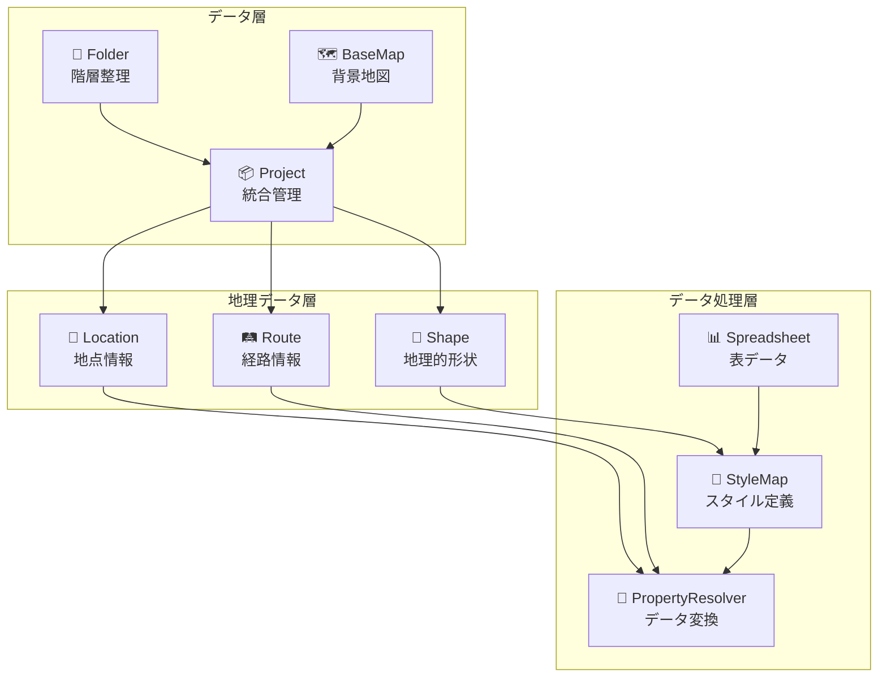
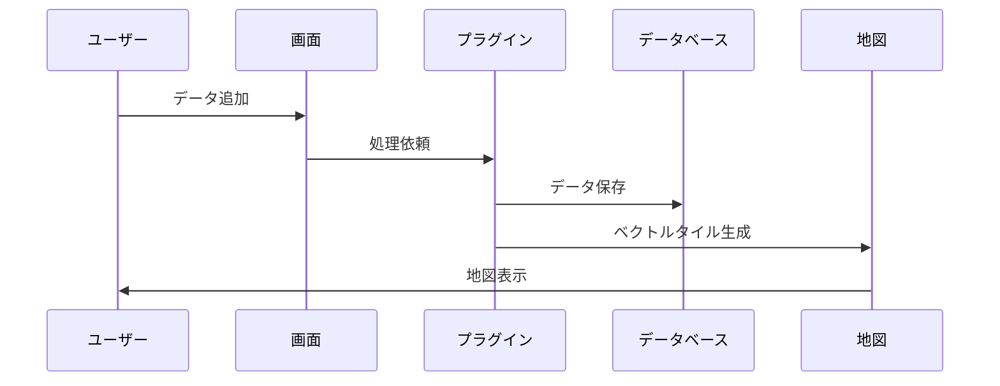
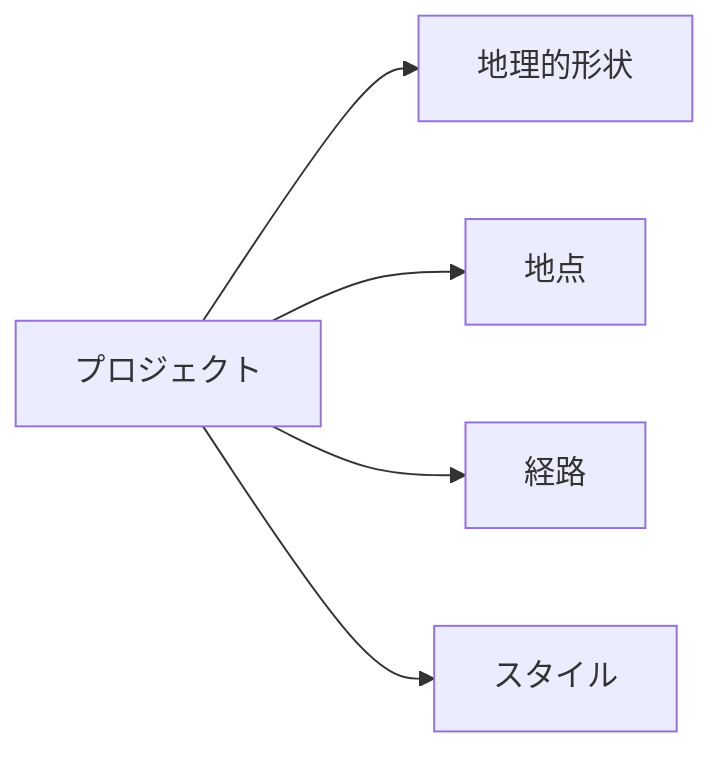
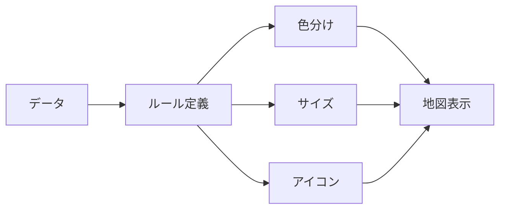
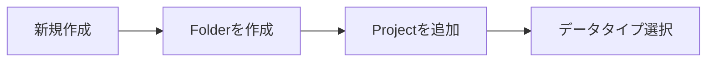
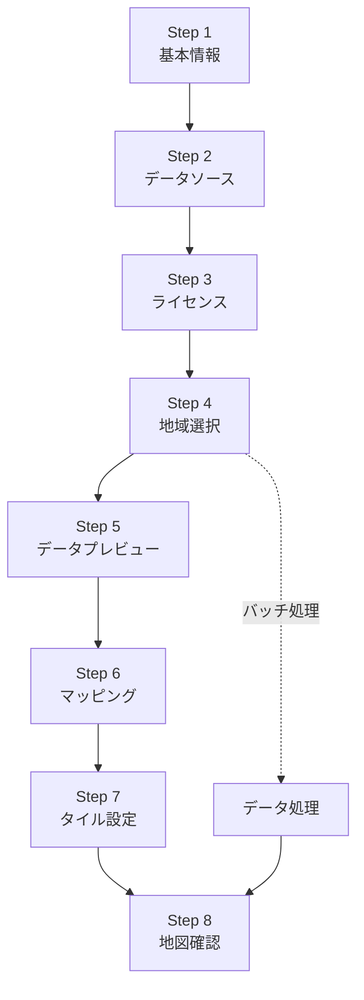
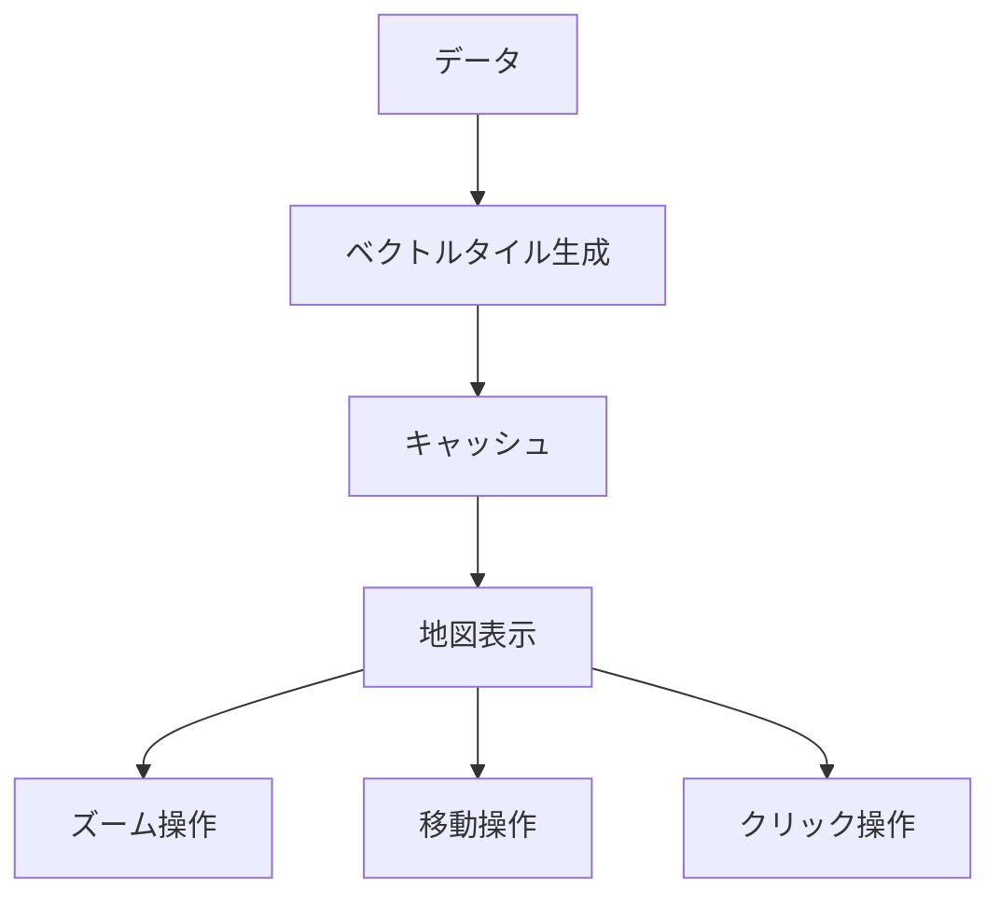
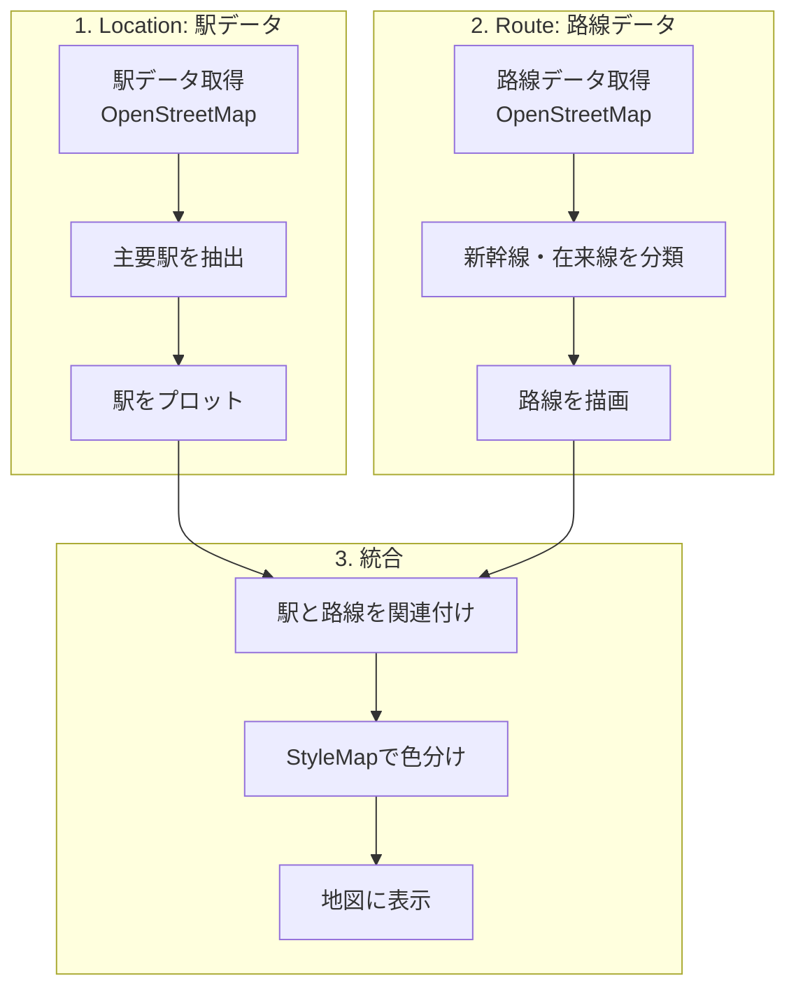
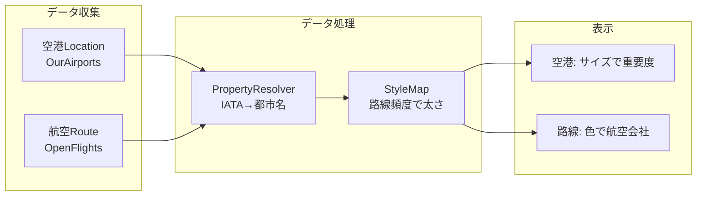
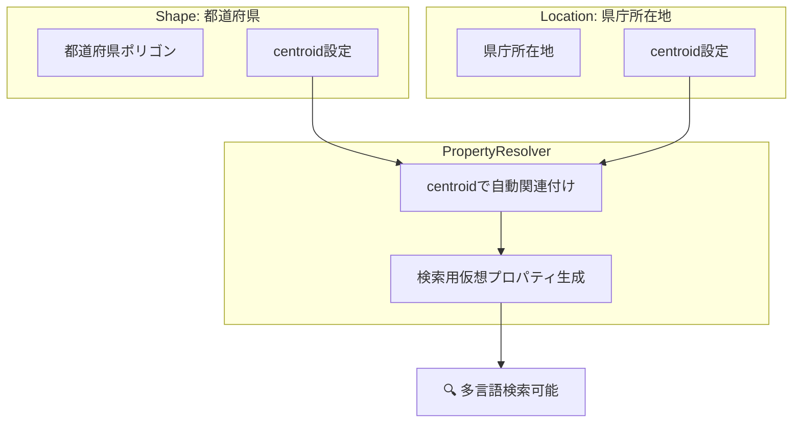

# HierarchiDB 基本ユーザーガイド

## 目次
1. [HierarchiDBとは](#hierarchidbとは)
2. [基本概念](#基本概念)
3. [主要プラグインの紹介](#主要プラグインの紹介)
4. [基本的な使い方](#基本的な使い方)
5. [実践例](#実践例)

---

## HierarchiDBとは

HierarchiDBは、地理空間データを階層的に管理・可視化するための統合プラットフォームです。様々な形式のデータを取り込み、地図上で表示・分析できます。

### システムの全体像



---

## 基本概念

### 1. プラグインシステム

HierarchiDBは**プラグイン**という単位で機能を提供します。各プラグインは特定の役割を持ち、組み合わせることで強力なデータ管理が可能になります。

### 2. ツリー構造

すべてのデータは**ツリー構造**で管理されます。フォルダで整理し、プロジェクトでまとめ、必要に応じて階層的にアクセスできます。

```
📁 My Data
├── 📁 日本
│   ├── 📦 関東地方プロジェクト
│   │   ├── 🗾 都県境界（Shape）
│   │   ├── 📍 主要駅（Location）
│   │   └── 🛤️ 鉄道路線（Route）
│   └── 📦 関西地方プロジェクト
└── 📁 アジア
    └── 📦 主要空港ネットワーク
```

### 3. データの流れ



---

## 主要プラグインの紹介

### 📁 Folder（フォルダ）
**データを整理するための基本コンテナ**

- 階層的にデータを整理
- タグによる分類
- 表示/非表示の制御

### 🗺️ BaseMap（ベースマップ）
**背景地図の設定**

- OpenStreetMap、Mapbox、Google Mapsなど
- 複数の地図スタイル
- 3D表示対応

### 📦 Project（プロジェクト）
**複数のデータを統合管理**



### 🗾 Shape（シェイプ）
**地理的な形状データ（ポリゴン・ライン）**

#### 扱えるデータ
- 行政境界（都道府県、市区町村）
- 自然地形（河川、湖沼、山地）
- 土地利用（農地、森林、市街地）

#### データソース
- OpenStreetMap
- Natural Earth
- 国土数値情報

### 📍 Location（ロケーション）
**地点情報（ポイント）**

#### 扱えるデータ
- 空港、駅、港
- 都市、町村
- 観光地、施設

#### 特徴
- クラスタリング（密集地点の集約表示）
- 重要度による表示制御
- アイコン表示

### 🛤️ Route（ルート）
**経路情報（ライン）**

#### 扱えるデータ
- 航空路線
- 鉄道路線
- 道路網
- 海上航路

#### 経路生成方法
1. **直線接続**: 始点と終点を直線で結ぶ
2. **大圏航路**: 地球の曲率を考慮（航空路用）
3. **実経路**: OSMなどから実際の道路・鉄道経路を取得

### 📊 Spreadsheet（スプレッドシート）
**表形式データの管理**

- CSV/TSVファイルの読み込み
- データのフィルタリング
- 列の選択と変換

### 🎨 StyleMap（スタイルマップ）
**地図表示スタイルの定義**



### 🔄 PropertyResolver（プロパティリゾルバー）
**データの変換と関連付け**

#### 主な機能
- データ間の紐付け
- 多言語対応
- 仮想プロパティの生成

---

## 基本的な使い方

### Step 1: プロジェクトの作成



1. **フォルダを作成**して整理
2. **プロジェクトを追加**
3. 必要な**データタイプを選択**（Shape/Location/Route）

### Step 2: データの追加（8ステップウィザード）

すべてのデータ追加は、わかりやすい8ステップのウィザードで行います：



#### 各ステップの説明

| Step | 内容 | 説明 |
|------|------|------|
| 1 | 基本情報 | 名前と説明を入力 |
| 2 | データソース | どこからデータを取得するか選択 |
| 3 | ライセンス | 利用規約に同意 |
| 4 | 地域選択 | 対象の国・地域を選択 |
| 5 | プレビュー | データの中身を確認 |
| 6 | マッピング | データの列と項目を対応付け |
| 7 | タイル設定 | 地図表示の詳細設定 |
| 8 | 地図確認 | 結果を地図で確認 |

### Step 3: データの可視化

データが追加されると、自動的に地図上に表示されます。



---

## 実践例

### 例1: 日本の鉄道ネットワークを作る



#### 手順
1. **Locationプラグイン**で駅データを追加
   - データソース: OpenStreetMap
   - フィルタ: railway=station
   - 地域: 日本

2. **Routeプラグイン**で路線データを追加
   - データソース: OpenStreetMap
   - タイプ: railway
   - 路線種別で分類

3. **StyleMapプラグイン**でスタイル設定
   - 新幹線: 青色、太線
   - 在来線: 緑色、細線
   - 主要駅: 大きいアイコン

### 例2: アジアの空港ネットワーク



### 例3: 都市と行政区域の関連付け



---

## よくある質問

### Q: どのくらいのデータを扱えますか？
A: 
- Shape: 10万ポリゴンまで
- Location: 10万地点まで
- Route: 1万路線まで

### Q: オフラインで使えますか？
A: 一度取得したデータはローカルに保存され、オフラインでも表示できます。

### Q: データの更新はどうすればいいですか？
A: プロジェクトの「更新」ボタンから、最新データを取得できます。

### Q: 複数の地図を重ねて表示できますか？
A: はい、Projectで複数のデータを統合し、レイヤーとして重ね合わせできます。

---

## 次のステップ

基本的な使い方を理解したら、[上級ユーザーガイド](./02_ADVANCED_USER_GUIDE.md)で、より高度な機能を学びましょう：

- PropertyResolverによる高度なデータ連携
- カスタムデータソースの追加
- バッチ処理の最適化
- プラグイン開発

---

## サポート

- 📧 メール: support@hierarchidb.example.com
- 💬 コミュニティ: https://forum.hierarchidb.example.com
- 📚 ドキュメント: https://docs.hierarchidb.example.com