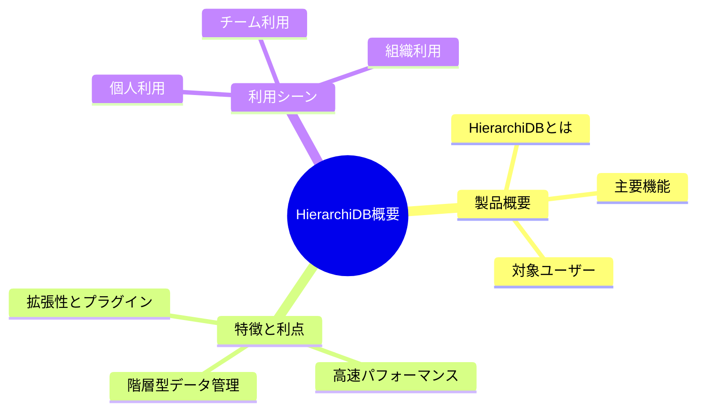
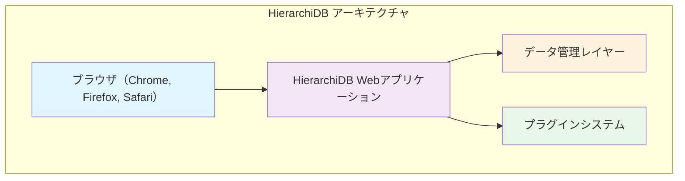
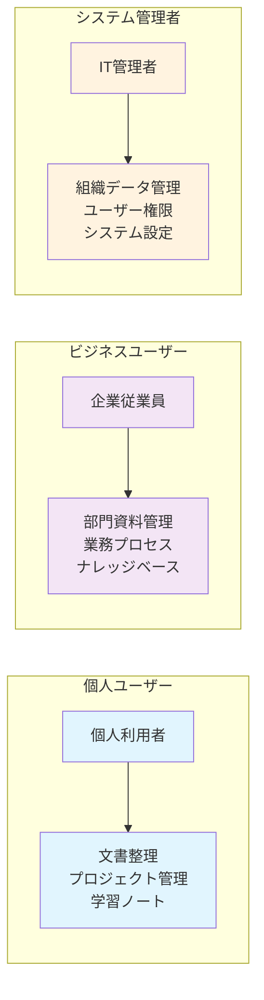
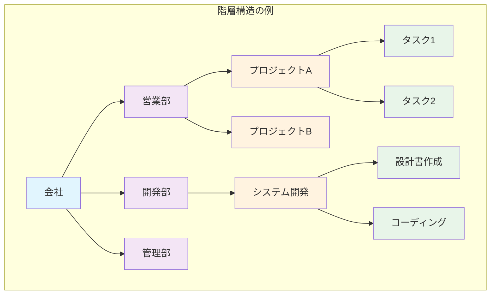
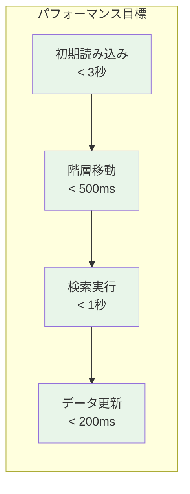
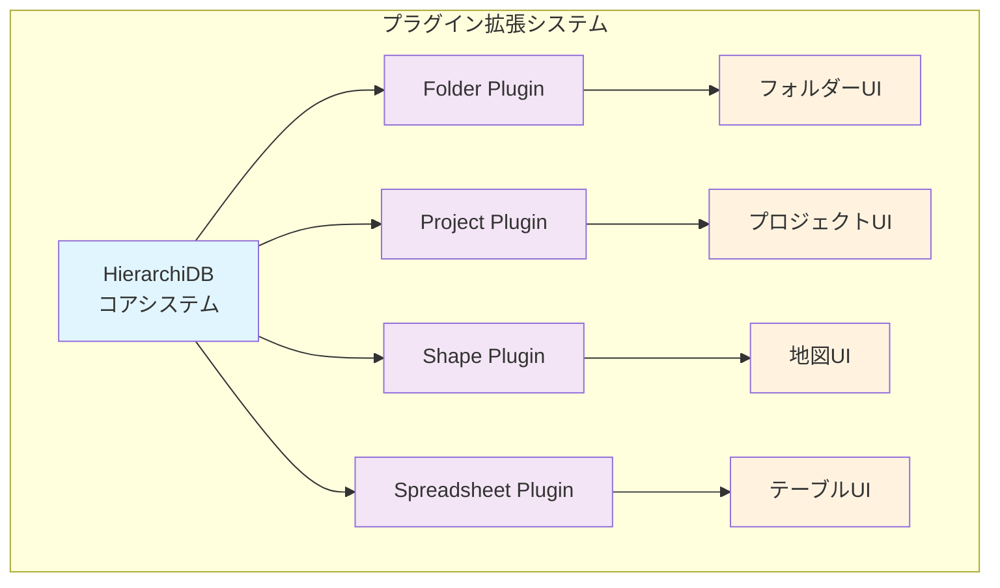
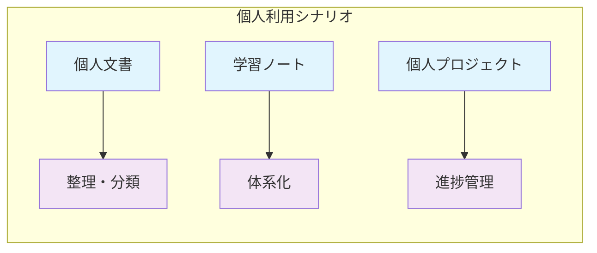
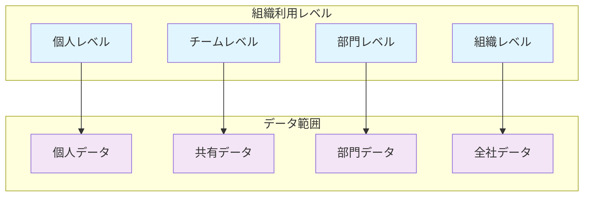

# 第1部 エグゼクティブサマリー

## Chapter 1: HierarchiDB概要

この章では、HierarchiDBの基本的な概念と特徴について説明します。製品の目的、主要機能、対象ユーザーを明確にし、なぜHierarchiDBが有用なのかを理解していただきます。また、階層型データ管理の利点と、現代的なWebアプリケーションとしての特徴について詳しく解説します。

### 1.1 概要 ⭐️⭐️⭐️⭐️

#### 1.1.1 HierarchiDBとは ⭐️⭐️⭐️⭐️⭐️

HierarchiDBは、ブラウザ上で動作する高性能な階層型データ管理アプリケーションです。複雑なデータを直感的なツリー構造で整理し、効率的に管理できるWebアプリケーションとして設計されています。

**基本コンセプト**

| 概念 | 説明 | 利点 |
|------|------|------|
| **階層構造** | データをツリー形式で組織化 | 直感的な分類・整理 |
| **ブラウザベース** | インストール不要のWebアプリ | どこからでもアクセス可能 |
| **リアルタイム** | 変更が即座に反映 | 協調作業に最適 |
| **プラグイン拡張** | 機能を柔軟に追加 | 用途に応じたカスタマイズ |

#### 1.1.2 主要機能 ⭐️⭐️⭐️⭐️

HierarchiDBの主要機能は以下の通りです：

**データ管理機能**
- **階層型組織化**: フォルダとサブフォルダのようなツリー構造でデータを整理
- **ノード管理**: 個別のデータ項目（ノード）の作成、編集、削除
- **検索・フィルタリング**: 大量のデータから必要な情報を素早く検索
- **タグ付け**: 分類を超えた横断的な整理

**操作機能**
- **ドラッグ＆ドロップ**: 直感的なマウス操作でデータを移動
- **一括操作**: 複数のノードを同時に処理
- **undo/redo**: 操作の取り消しとやり直し
- **コピー＆ペースト**: データの複製と移動

**表示・ナビゲーション機能**
- **ツリービュー**: 階層構造を視覚的に表示
- **詳細ビュー**: 個別ノードの詳細情報表示
- **パンくずリスト**: 現在位置の明確な表示
- **仮想スクロール**: 大量データの高速表示

#### 1.1.3 対象ユーザー ⭐️⭐️⭐️

### 1.2 特徴と利点 ⭐️⭐️⭐️⭐️

#### 1.2.1 階層型データ管理 ⭐️⭐️⭐️⭐️⭐️

階層型データ管理は、HierarchiDBの核となる機能です。従来のフラットなデータ管理とは異なり、親子関係を持つ構造でデータを整理できます。

**階層構造の利点**

| 利点 | 説明 | 具体例 |
|------|------|--------|
| **直感的理解** | フォルダー構造のような馴染みのある整理方法 | 部門→プロジェクト→タスク |
| **効率的検索** | 階層を絞り込んで対象範囲を限定 | 特定プロジェクト内のファイル検索 |
| **文脈保持** | データの関係性と位置づけが明確 | タスクがどのプロジェクトに属するか |
| **柔軟な拡張** | 必要に応じて階層を深くしたり広くしたり | サブプロジェクトの追加 |

#### 1.2.2 高速パフォーマンス ⭐️⭐️⭐️⭐️

HierarchiDBは、大量のデータでも高速に動作するよう最適化されています。

**パフォーマンス特徴**

| 技術 | 効果 | 体感メリット |
|------|------|-------------|
| **仮想スクロール** | 表示部分のみレンダリング | 数万件でもスムーズスクロール |
| **増分読み込み** | 必要な部分のみデータ取得 | 初期表示の高速化 |
| **インメモリキャッシュ** | 頻繁アクセスデータを高速化 | 既存データへの瞬時アクセス |
| **バックグラウンド処理** | UI をブロックしない処理 | 操作中断なし |

**パフォーマンス指標**

#### 1.2.3 拡張性とプラグイン ⭐️⭐️⭐️⭐️

HierarchiDBは、プラグインシステムにより機能を柔軟に拡張できます。

**利用可能なプラグイン**

| プラグイン | 機能 | 用途 |
|------------|------|------|
| **Folder** | 基本的なフォルダ機能 | 一般的な文書整理 |
| **Project** | プロジェクト管理機能 | タスク管理、進捗追跡 |
| **Shape** | 地理データ管理 | 地図データ、境界情報 |
| **Spreadsheet** | 表形式データ | 数値データ、一覧表 |

### 1.3 利用シーン ⭐️⭐️⭐️

#### 1.3.1 個人利用 ⭐️⭐️⭐️⭐️

**GISデータ管理（開発完了：リリース準備中) **

- 地理情報の階層的整理
- 地図データの管理と可視化
- 地図上の表現としての統計データの可視化

**文書・資料整理（開発検討中）**
- 個人ファイルの分類整理
- 学習ノートの体系化
- 写真・メディアの整理

**プロジェクト管理（開発検討中）**
- 個人プロジェクトのタスク管理
- 目標設定と進捗管理
- アイデア・メモの整理

#### 1.3.2 チーム利用 ❌❌

**チーム情報共有（開発検討中）**
- プロジェクト資料の共有
- ナレッジベースの構築
- 会議資料・議事録管理

**コラボレーション（開発検討中）**
- タスクの割り振りと進捗共有
- ファイルの共同編集
- コメント・フィードバック

#### 1.3.3 組織利用 ❌❌❌

**部門データ管理（開発検討中）**
- 部門別資料管理
- 業務プロセス文書化
- 規程・マニュアル管理

**組織ナレッジ管理（開発検討中）**
- 企業ナレッジの蓄積
- ベストプラクティス共有
- 教育・研修資料管理

**権限・セキュリティ管理（開発検討中）**
- アクセス権限の設定
- 機密情報の保護
- 監査ログの管理

## 文書構成

本マニュアルは以下の6部構成となっています：

- **第1部 エグゼクティブサマリー**: 製品概要と主要機能
- **第2部 動作条件**: システム要件と環境設定  
- **第3部 インストール方法**: セットアップと初期設定
- **第4部 画面構成と基本操作**: UI構成と基本的な操作方法
- **第5部 ユースケースごとの操作**: 実際の活用シナリオと操作手順
- **第6部 トラブルシューティング**: 問題解決、データ復旧、サポート情報

各部では、具体的な手順、診断方法、そして包括的なサポート体制について詳しく説明しています。特に第6部では、一般的な問題の解決方法から緊急時の復旧手順まで、ユーザーが安心してシステムを利用できるための情報を網羅的に提供しています。

**まとめ**

HierarchiDBは、階層型データ管理の利点を活かした現代的なWebアプリケーションです。個人からチーム、組織まで幅広い利用シーンに対応し、プラグインシステムによる柔軟な機能拡張を実現しています。直感的な操作性と高いパフォーマンス、そして充実したサポート体制により、効率的なデータ管理を支援します。