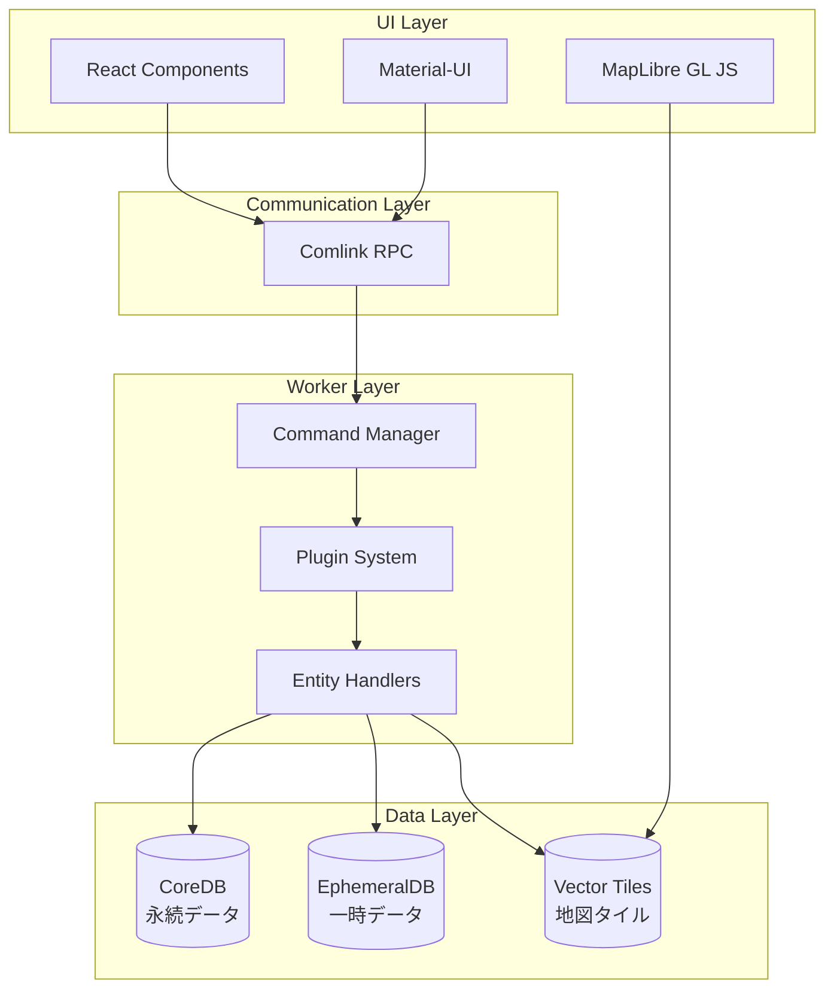
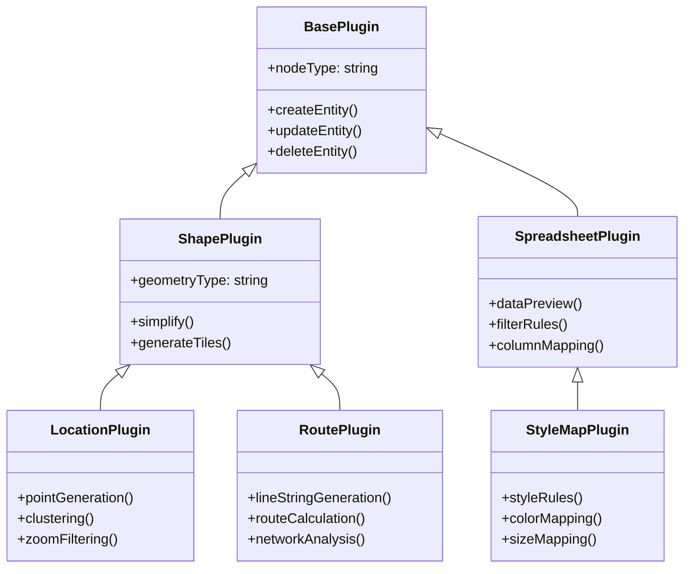
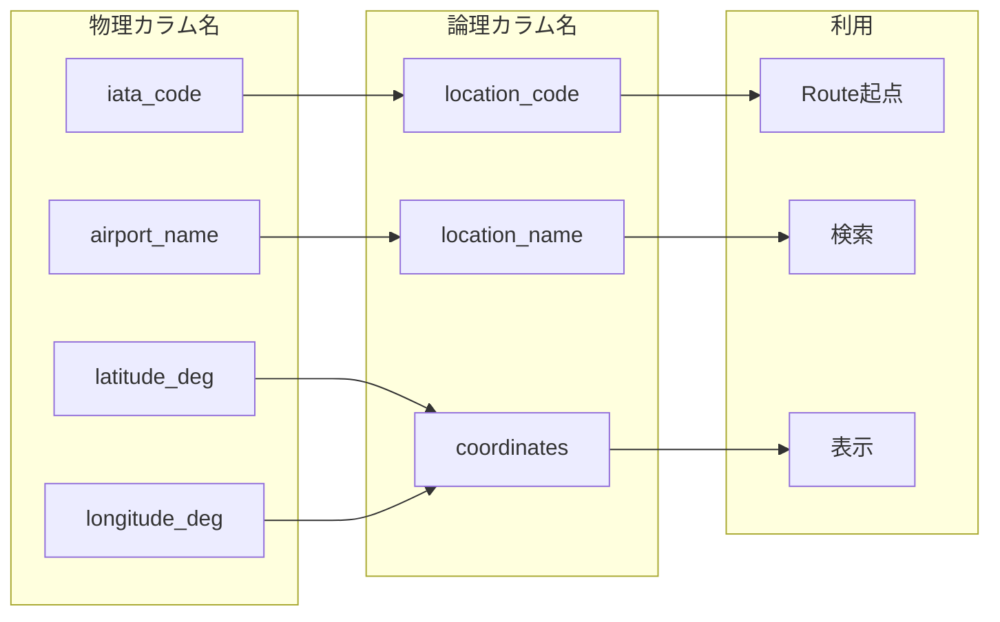
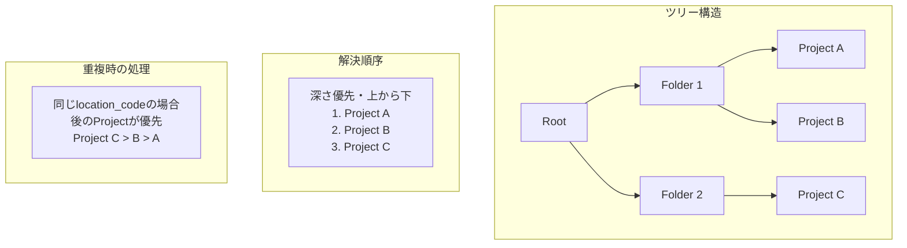
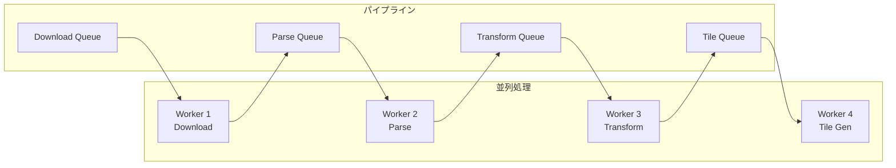
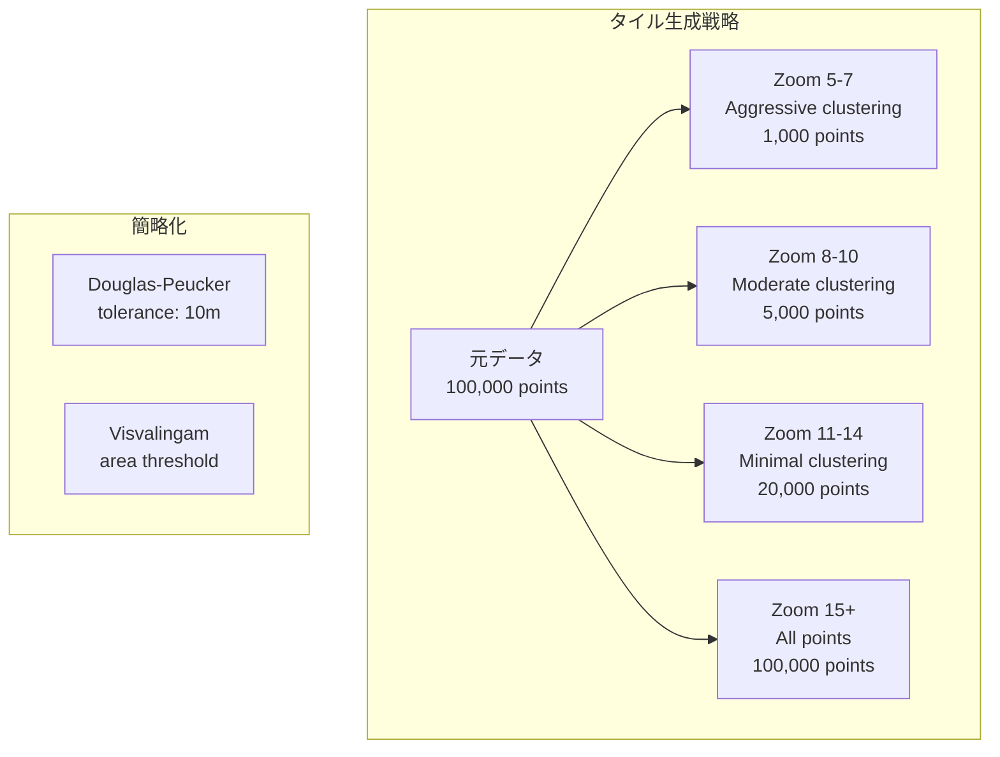
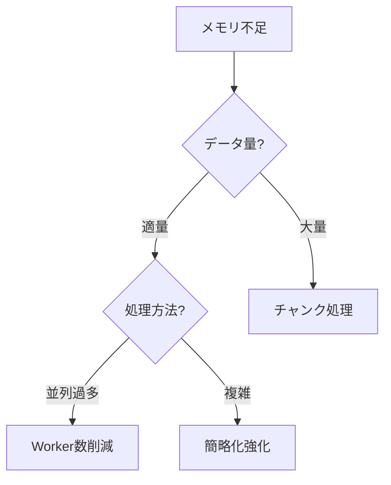
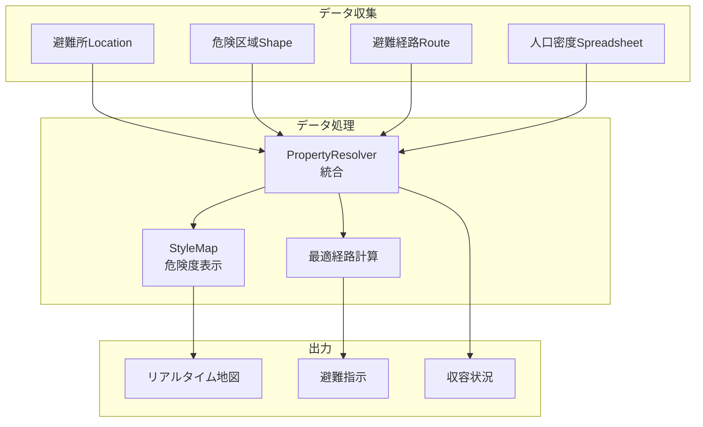

# HierarchiDB 上級ユーザーガイド

## 目次
1. [アーキテクチャ詳解](#アーキテクチャ詳解)
2. [高度なデータ連携](#高度なデータ連携)
3. [PropertyResolverマスターガイド](#propertyresolverマスターガイド)
4. [パフォーマンス最適化](#パフォーマンス最適化)
5. [カスタマイズと拡張](#カスタマイズと拡張)
6. [トラブルシューティング](#トラブルシューティング)

---

## アーキテクチャ詳解

### 4層アーキテクチャ



### プラグイン継承関係



---

## 高度なデータ連携

### 論理カラム名システム

物理的なデータソースの違いを吸収し、統一的なインターフェースを提供します。



### データソース設定の階層

```typescript
// 1. システムデフォルト
const systemDefault = {
  filterRules: [],
  mappingTemplate: {},
  routeGeneration: { method: 'direct' }
};

// 2. データソース固有デフォルト
const dataSourceDefault = {
  'openflights-airlines': {
    filterRules: [{ column: 'Active', value: 'Y' }],
    mappingTemplate: {
      startLocation: 'Source airport',
      endLocation: 'Destination airport'
    },
    routeGeneration: { method: 'great_circle' }
  }
};

// 3. ユーザー設定（Step 6で上書き）
const userConfig = {
  filterRules: [
    ...dataSourceDefault.filterRules,
    { column: 'Airline', value: 'JAL' } // 追加フィルタ
  ],
  mappingTemplate: {
    ...dataSourceDefault.mappingTemplate,
    routeName: 'Flight Number' // カスタムマッピング
  }
};
```

### リソース解決の優先順位



---

## PropertyResolverマスターガイド

### 基本概念

PropertyResolverは、異なるデータ間の関連付けと変換を行う強力なツールです。

```mermaid
graph TB
    subgraph "入力"
        I1[物理プロパティ<br/>gid0: "jp"]
        I2[論理カラム<br/>location_code: "NRT"]
    end
    
    subgraph "PropertyResolver"
        R1[変換ルール定義]
        R2[マッピング実行]
        R3[仮想プロパティ生成]
    end
    
    subgraph "出力"
        O1[search: "Japan"]
        O2[search_ja: "日本"]
        O3[location_name: "成田空港"]
    end
    
    I1 --> R1
    I2 --> R1
    R1 --> R2
    R2 --> R3
    R3 --> O1
    R3 --> O2
    R3 --> O3
```

### 高度な変換パターン

#### 1. 多言語変換
```typescript
const multilingualResolver = {
  rules: [
    {
      source: 'country_code',
      targets: {
        'search': countryCode => countryNames[countryCode].en,
        'search_ja': countryCode => countryNames[countryCode].ja,
        'search_zh': countryCode => countryNames[countryCode].zh,
      }
    }
  ]
};
```

#### 2. 条件付き変換
```typescript
const conditionalResolver = {
  rules: [
    {
      source: 'airport_type',
      target: 'importance',
      transform: (type) => {
        switch(type) {
          case 'large_airport': return 1.0;
          case 'medium_airport': return 0.7;
          case 'small_airport': return 0.4;
          default: return 0.1;
        }
      }
    }
  ]
};
```

#### 3. 複数ソースの結合
```typescript
const combiningResolver = {
  rules: [
    {
      sources: ['city_name', 'country_code'],
      target: 'full_location',
      transform: (city, country) => `${city}, ${country}`
    }
  ]
};
```

### セントロイド連携の詳細

```mermaid
graph TB
    subgraph "Shape: 東京都"
        S1[Polygon Geometry]
        S2[centroid: "tokyo_center"]
        S3[Properties]
    end
    
    subgraph "Location: 都庁"
        L1[Point Geometry]
        L2[centroid: "tokyo_center"]
        L3[Properties]
    end
    
    subgraph "PropertyResolver"
        R1[centroid matching]
        R2[Bidirectional link]
    end
    
    subgraph "Result"
        Result1[Shape ↔ Location linked]
        Result2[Unified search]
        Result3[Combined visualization]
    end
    
    S2 --> R1
    L2 --> R1
    R1 --> R2
    R2 --> Result1
    R2 --> Result2
    R2 --> Result3
```

---

## パフォーマンス最適化

### バッチ処理の最適化



### メモリ管理戦略

```typescript
class MemoryManager {
  // チャンク処理
  async processInChunks(data: any[], chunkSize = 1000) {
    for (let i = 0; i < data.length; i += chunkSize) {
      const chunk = data.slice(i, i + chunkSize);
      await this.processChunk(chunk);
      
      // メモリ解放
      if (i % (chunkSize * 10) === 0) {
        await this.garbageCollect();
      }
    }
  }
  
  // リングバッファ（undo/redo用）
  class RingBuffer {
    constructor(size = 100) {
      this.buffer = new Array(size);
      this.head = 0;
      this.tail = 0;
    }
    
    push(item) {
      this.buffer[this.head] = item;
      this.head = (this.head + 1) % this.buffer.length;
      if (this.head === this.tail) {
        this.tail = (this.tail + 1) % this.buffer.length;
      }
    }
  }
}
```

### ベクトルタイル最適化



### インデックス戦略

```typescript
// 空間インデックス
class SpatialIndex {
  constructor() {
    this.rtree = new RTree();
    this.geohash = new GeohashIndex();
    this.h3 = new H3Index();
  }
  
  // 最適なインデックスを選択
  selectIndex(queryType) {
    switch(queryType) {
      case 'bbox': return this.rtree;
      case 'nearest': return this.geohash;
      case 'hexagon': return this.h3;
    }
  }
}

// 仮想プロパティインデックス
class VirtualPropertyIndex {
  constructor() {
    this.index = new Map();
    this.trie = new Trie(); // 前方一致検索用
    this.ngram = new NGramIndex(); // 部分一致検索用
  }
}
```

---

## カスタマイズと拡張

### カスタムプラグインの作成

```typescript
class CustomLocationPlugin extends LocationPlugin {
  // 独自のLocationTypeを追加
  static customTypes = {
    'energy:charging_station': {
      icon: '🔌',
      color: '#4CAF50',
      importance: 0.6
    },
    'emergency:shelter': {
      icon: '🏠',
      color: '#F44336',
      importance: 0.9
    }
  };
  
  // 独自の処理を追加
  async processCustomData(data) {
    // 電力会社のAPIから充電ステーション情報を取得
    const chargingStations = await fetchChargingStations();
    
    // LocationEntityに変換
    return chargingStations.map(station => ({
      nodeId: generateNodeId(),
      locationType: 'energy:charging_station',
      locationName: station.name,
      point: {
        coordinates: [station.lon, station.lat]
      },
      customProperties: {
        power: station.power,
        connectorType: station.connectorType,
        availability: station.availability
      }
    }));
  }
}
```

### カスタムデータソースの追加

```typescript
const customDataSource = {
  id: 'my-organization-api',
  name: 'My Organization Data',
  format: 'json',
  provider: 'api.myorg.com',
  
  // データ取得
  async fetch(config) {
    const response = await fetch(`${this.provider}/data`, {
      headers: { 'Authorization': `Bearer ${config.apiKey}` }
    });
    return response.json();
  },
  
  // デフォルト設定
  defaultSettings: {
    filterRules: [],
    mappingTemplate: {
      locationName: 'facility_name',
      locationCode: 'facility_id',
      coordinates: data => [data.longitude, data.latitude]
    },
    authentication: {
      type: 'bearer',
      required: true
    }
  }
};

// データソースを登録
DataSourceRegistry.register(customDataSource);
```

### カスタム経路生成アルゴリズム

```typescript
class CustomRouteGenerator {
  // 避難経路の最適化（例）
  async generateEvacuationRoute(start, shelters, hazards) {
    const graph = await this.buildRoadNetwork();
    
    // 危険エリアを除外
    hazards.forEach(hazard => {
      graph.removeNodesInArea(hazard.bounds);
    });
    
    // 最も近い避難所への最短経路
    let bestRoute = null;
    let minDistance = Infinity;
    
    for (const shelter of shelters) {
      const route = graph.dijkstra(start, shelter);
      if (route.distance < minDistance) {
        minDistance = route.distance;
        bestRoute = route;
      }
    }
    
    return {
      lineGeometry: bestRoute.path,
      distance: bestRoute.distance,
      estimatedTime: bestRoute.distance / WALKING_SPEED,
      safetyScore: this.calculateSafety(bestRoute, hazards)
    };
  }
}
```

---

## トラブルシューティング

### よくある問題と解決策

#### 1. メモリ不足エラー



**解決コード例**:
```typescript
// チャンク処理の実装
async function processLargeDataset(data) {
  const CHUNK_SIZE = 10000;
  const results = [];
  
  for (let i = 0; i < data.length; i += CHUNK_SIZE) {
    const chunk = data.slice(i, Math.min(i + CHUNK_SIZE, data.length));
    
    // 各チャンクを処理
    const chunkResult = await processChunk(chunk);
    results.push(...chunkResult);
    
    // 進捗表示
    const progress = (i / data.length) * 100;
    updateProgress(progress);
    
    // メモリ解放のための小休止
    if (i % (CHUNK_SIZE * 5) === 0) {
      await new Promise(resolve => setTimeout(resolve, 100));
    }
  }
  
  return results;
}
```

#### 2. タイル生成の遅延

```typescript
// タイル生成の最適化
class TileOptimizer {
  // プリジェネレーション戦略
  async preGenerateTiles(data, config) {
    // 重要なズームレベルを優先
    const priorityZooms = [8, 11, 14];
    const normalZooms = [5, 6, 7, 9, 10, 12, 13];
    
    // 優先度の高いタイルを先に生成
    for (const zoom of priorityZooms) {
      await this.generateTilesForZoom(data, zoom, {
        simplification: 'moderate',
        clustering: zoom < 10
      });
    }
    
    // バックグラウンドで残りを生成
    this.generateInBackground(data, normalZooms);
  }
  
  // 動的タイル生成
  async generateOnDemand(bounds, zoom) {
    const cacheKey = `${bounds}-${zoom}`;
    
    // キャッシュチェック
    if (this.cache.has(cacheKey)) {
      return this.cache.get(cacheKey);
    }
    
    // 必要な部分のみ生成
    const tile = await this.generateTile(bounds, zoom);
    this.cache.set(cacheKey, tile);
    
    return tile;
  }
}
```

#### 3. PropertyResolver の循環参照

```typescript
class CircularReferenceDetector {
  detectCycles(rules) {
    const graph = this.buildDependencyGraph(rules);
    const visited = new Set();
    const recursionStack = new Set();
    
    for (const node of graph.nodes) {
      if (this.hasCycle(node, graph, visited, recursionStack)) {
        throw new Error(`Circular reference detected: ${[...recursionStack].join(' -> ')}`);
      }
    }
  }
  
  hasCycle(node, graph, visited, stack) {
    visited.add(node);
    stack.add(node);
    
    for (const neighbor of graph.edges[node] || []) {
      if (!visited.has(neighbor)) {
        if (this.hasCycle(neighbor, graph, visited, stack)) {
          return true;
        }
      } else if (stack.has(neighbor)) {
        return true;
      }
    }
    
    stack.delete(node);
    return false;
  }
}
```

### デバッグツール

```typescript
// Worker通信のデバッグ
class WorkerDebugger {
  static enableLogging() {
    const originalPostMessage = Worker.prototype.postMessage;
    
    Worker.prototype.postMessage = function(message) {
      console.group('Worker Message');
      console.log('Type:', message.type);
      console.log('Payload:', message.payload);
      console.log('Timestamp:', new Date().toISOString());
      console.groupEnd();
      
      return originalPostMessage.call(this, message);
    };
  }
  
  static profilePerformance() {
    performance.mark('worker-start');
    
    return {
      end: () => {
        performance.mark('worker-end');
        performance.measure('worker-duration', 'worker-start', 'worker-end');
        
        const measure = performance.getEntriesByName('worker-duration')[0];
        console.log(`Worker execution time: ${measure.duration}ms`);
      }
    };
  }
}
```

---

## 高度な統合例

### 災害対応システムの構築



実装コード:
```typescript
class DisasterResponseSystem {
  async initialize() {
    // 1. 避難所データ
    const shelters = await this.loadShelters();
    
    // 2. 危険区域
    const hazards = await this.loadHazardZones();
    
    // 3. PropertyResolverで統合
    const resolver = new PropertyResolver({
      rules: [
        {
          // 避難所の収容可能人数を計算
          sources: ['capacity', 'current_occupancy'],
          target: 'available_capacity',
          transform: (cap, occ) => cap - occ
        },
        {
          // 危険度レベルを色に変換
          source: 'hazard_level',
          target: 'display_color',
          transform: level => {
            const colors = ['#4CAF50', '#FFEB3B', '#FF9800', '#F44336'];
            return colors[level] || '#9E9E9E';
          }
        }
      ]
    });
    
    // 4. リアルタイム更新
    this.startRealTimeUpdates();
  }
  
  async findOptimalEvacuation(userLocation) {
    const nearestShelters = await this.findNearestShelters(userLocation, 5);
    const routes = [];
    
    for (const shelter of nearestShelters) {
      const route = await this.calculateSafeRoute(
        userLocation,
        shelter,
        { avoid: this.hazardZones }
      );
      
      routes.push({
        shelter,
        route,
        score: this.calculateEvacuationScore(route, shelter)
      });
    }
    
    return routes.sort((a, b) => b.score - a.score)[0];
  }
}
```

---

## まとめ

HierarchiDBの上級機能を活用することで、複雑な地理空間データの管理と分析が可能になります。

### 重要なポイント

1. **プラグインアーキテクチャ**: 継承と組み合わせによる柔軟な機能拡張
2. **論理カラム名**: データソースの違いを吸収する抽象化層
3. **PropertyResolver**: 強力なデータ変換・連携エンジン
4. **パフォーマンス最適化**: チャンク処理、並列化、キャッシング
5. **カスタマイズ性**: 独自のプラグイン、データソース、アルゴリズムの追加

### 次のステップ

- [開発者ガイド](./03_DEVELOPER_GUIDE.md): プラグイン開発の詳細
- [API リファレンス](./04_API_REFERENCE.md): 全APIの詳細仕様
- [ベストプラクティス](./05_BEST_PRACTICES.md): 実践的なTips集

---

## リソース

- 🔧 GitHub: https://github.com/hierarchidb/hierarchidb
- 📹 チュートリアル動画: https://youtube.com/hierarchidb
- 💡 サンプルプロジェクト: https://examples.hierarchidb.com
- 🤝 コントリビューション: https://github.com/hierarchidb/hierarchidb/contribute