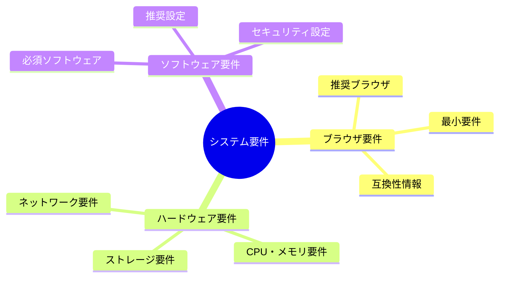
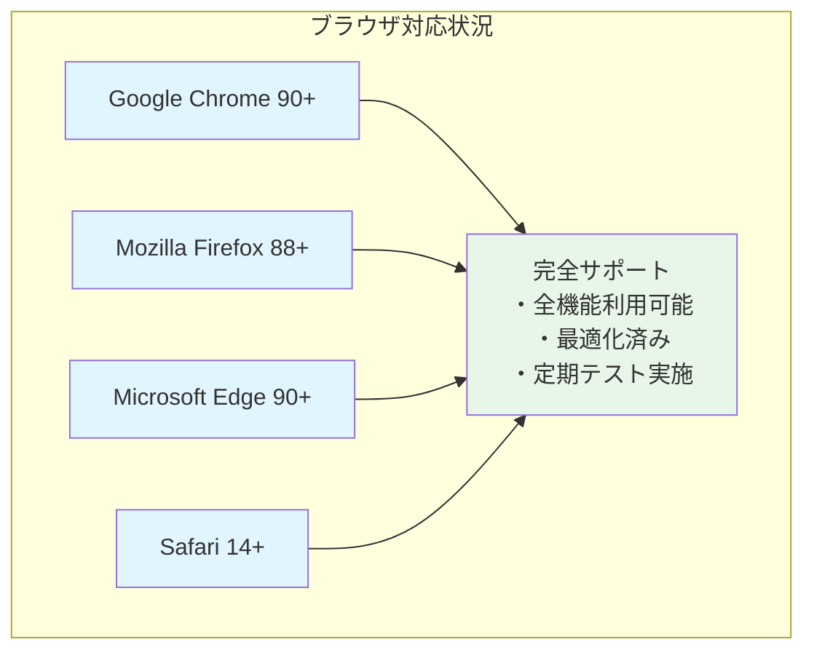
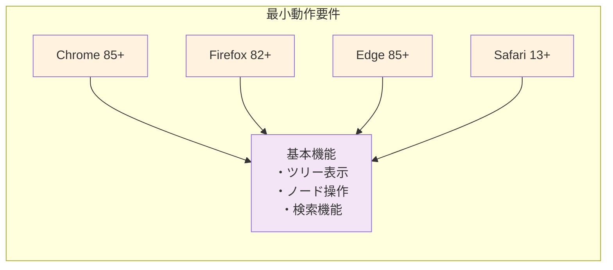
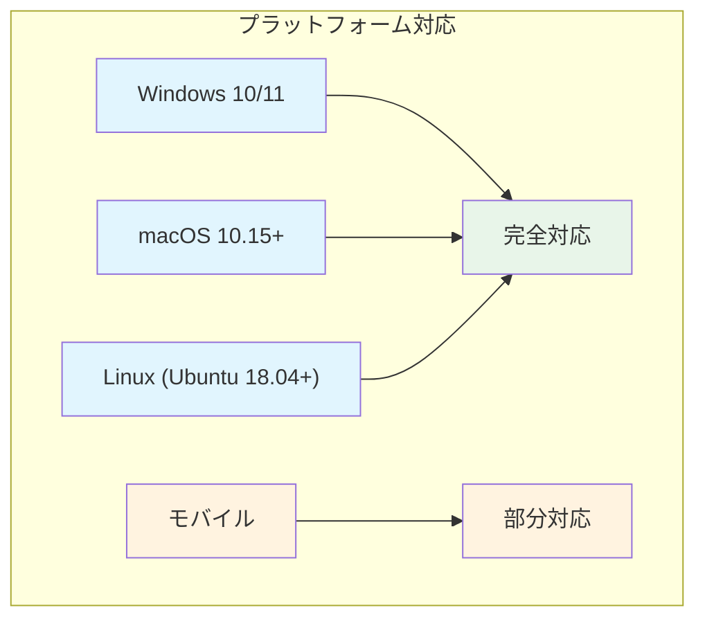
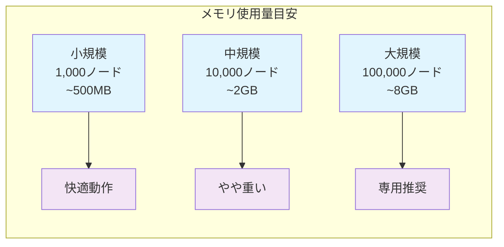
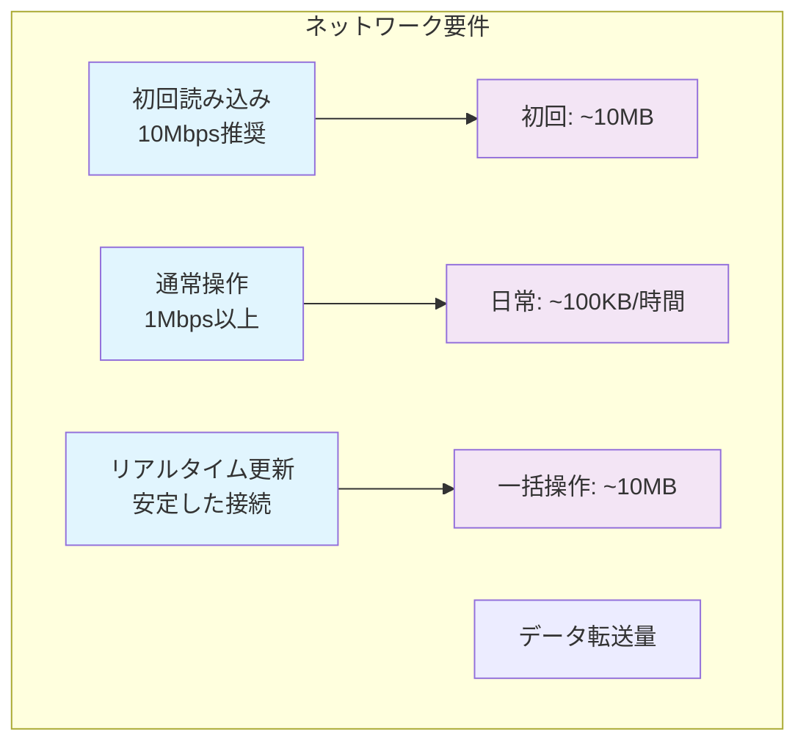
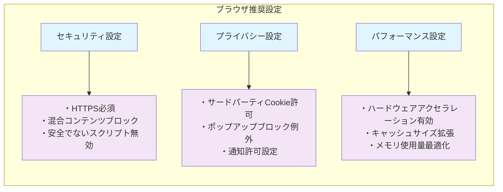
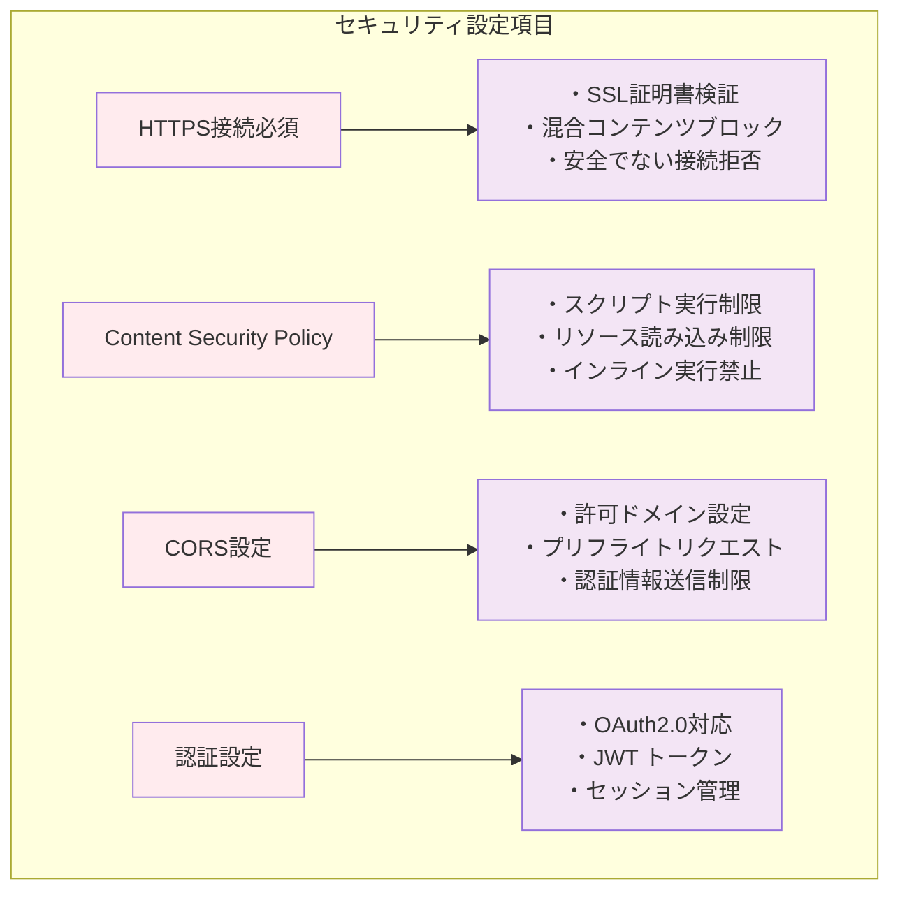

# 第2部 動作条件

## Chapter 2: システム要件

この章では、HierarchiDBを快適に利用するために必要なシステム要件について説明します。ブラウザの種類やバージョン、ハードウェア要件、ソフトウェア設定など、事前に確認すべき動作条件を詳しく解説します。適切な環境を準備することで、HierarchiDBの性能を最大限に活用できます。

### 2.1 ブラウザ要件

#### 2.1.1 推奨ブラウザ

HierarchiDBは、最新のWeb標準に基づいて開発されており、モダンブラウザでの利用を推奨します。

**推奨ブラウザとバージョン**

| ブラウザ | 推奨バージョン | サポート状況 | 特記事項 |
|----------|----------------|--------------|----------|
| **Google Chrome** | 90以上 | 完全サポート | 最高のパフォーマンス |
| **Mozilla Firefox** | 88以上 | 完全サポート | プライバシー重視ユーザーに推奨 |
| **Microsoft Edge** | 90以上 | 完全サポート | Windows環境で最適化 |
| **Safari** | 14以上 | 完全サポート | macOS/iOS環境で最適化 |

**ブラウザ機能要件**

HierarchiDBが正常に動作するために必要なブラウザ機能：

| 機能 | 説明 | 確認方法 |
|------|------|----------|
| **JavaScript ES2020** | モダンJavaScript機能 | 自動検出・警告表示 |
| **Web Workers** | バックグラウンド処理 | アプリケーション起動時にチェック |
| **IndexedDB** | クライアントサイドデータベース | 初回アクセス時に確認 |
| **CSS Grid/Flexbox** | レスポンシブレイアウト | 画面表示で確認 |
| **WebGL** | 地図表示（Shape Plugin使用時） | プラグイン使用時にチェック |

#### 2.1.2 最小要件

**動作可能な最小構成**

**制限事項**

| ブラウザ | 制限内容 | 代替手段 |
|----------|----------|----------|
| **旧バージョンChrome (85-89)** | 一部プラグイン機能制限 | ブラウザアップデート推奨 |
| **旧バージョンFirefox (82-87)** | パフォーマンス低下 | 新しいバージョンへの更新 |
| **Internet Explorer** | サポート対象外 | Edgeへの移行 |
| **モバイルブラウザ** | 限定的サポート | デスクトップ版推奨 |

#### 2.1.3 互換性情報

**プラットフォーム別対応状況**

### 2.2 ハードウェア要件

#### 2.2.1 CPU・メモリ要件

**推奨スペック**

| 項目 | 最小要件 | 推奨要件 | 高負荷対応 | 備考 |
|------|----------|----------|------------|------|
| **CPU** | 2コア 2GHz | 4コア 2.5GHz | 8コア 3GHz+ | 地図処理時に高負荷 |
| **メモリ** | 4GB | 8GB | 16GB+ | 大量データ処理時必要 |
| **GPU** | 不要 | 統合GPU | 専用GPU | WebGL使用時に有効 |

#### 2.2.2 ストレージ要件

**ディスク容量**

| 用途 | 容量 | 説明 |
|------|------|------|
| **アプリケーション** | 50MB | ブラウザキャッシュ |
| **ユーザーデータ** | 1GB～ | IndexedDBストレージ |
| **一時ファイル** | 500MB | インポート・エクスポート用 |
| **合計推奨容量** | 2GB以上 | 余裕をもった容量 |

#### 2.2.3 ネットワーク要件

**接続要件**

### 2.3 ソフトウェア要件

#### 2.3.1 必須ソフトウェア

**基本要件**

| ソフトウェア | 要件 | 用途 |
|--------------|------|------|
| **ブラウザ** | 前述の対応ブラウザ | アプリケーション実行環境 |
| **JavaScript** | 有効化必須 | アプリケーション動作 |
| **Cookie** | 有効化推奨 | セッション管理 |
| **Local Storage** | 有効化必須 | 設定保存 |

**オプション要件**

| ソフトウェア | 用途 | 必須度 |
|--------------|------|--------|
| **PDF リーダー** | PDF表示 | 推奨 |
| **Office ソフト** | ファイル編集 | オプション |
| **圧縮ソフト** | ファイル圧縮・展開 | 推奨 |

#### 2.3.2 推奨設定

**ブラウザ設定**

**システム設定**

| 設定項目 | 推奨値 | 理由 |
|----------|--------|------|
| **仮想メモリ** | 物理メモリの1.5倍 | 大量データ処理時の安定性 |
| **一時フォルダ** | 十分な空き容量 | ファイル処理時の作業領域 |
| **ウイルス対策** | リアルタイム保護 | セキュリティ確保 |
| **ファイアウォール** | 適切な設定 | 通信許可設定 |

#### 2.3.3 セキュリティ設定

**必須セキュリティ設定**

**セキュリティチェックリスト**

| 項目 | 確認内容 | 重要度 |
|------|----------|--------|
| ✅ **HTTPS接続** | URLがhttps://で始まる | 必須 |
| ✅ **証明書検証** | SSL証明書が有効 | 必須 |
| ✅ **Cookie設定** | セキュアフラグ設定 | 推奨 |
| ✅ **パスワード** | 強固なパスワード使用 | 必須 |
| ✅ **二要素認証** | 可能な場合は有効化 | 推奨 |
| ✅ **定期更新** | ブラウザの定期更新 | 推奨 |

**まとめ**

HierarchiDBを快適に利用するためには、適切なシステム環境の準備が重要です。推奨ブラウザの使用、十分なハードウェアスペック、適切なセキュリティ設定により、アプリケーションの性能を最大限に活用できます。特にセキュリティ設定は、データ保護の観点から必須の要件となります。