# 第3部 インストール方法 ⭐️⭐️⭐️⭐️

## Chapter 3: アクセス方法

この章では、HierarchiDBへのアクセス方法と初回セットアップについて詳しく説明します。WebアプリケーションとしてのHierarchiDBは、従来のソフトウェアとは異なりインストール作業が不要です。適切なブラウザからアクセスし、初期設定を行うだけで利用を開始できます。効率的な利用のためのブックマーク設定やデータ準備についても解説します。

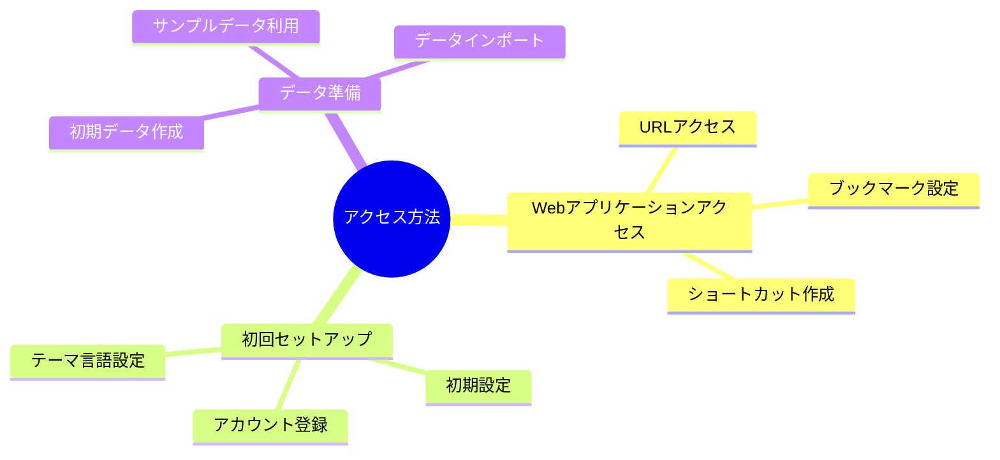

### 3.1 Webアプリケーションアクセス ⭐️⭐️⭐️⭐️⭐️

#### 3.1.1 URL アクセス ⭐️⭐️⭐️⭐️⭐️

HierarchiDBは、Webブラウザから直接アクセスできるWebアプリケーションです。インストール作業は必要ありません。

**基本アクセス手順**

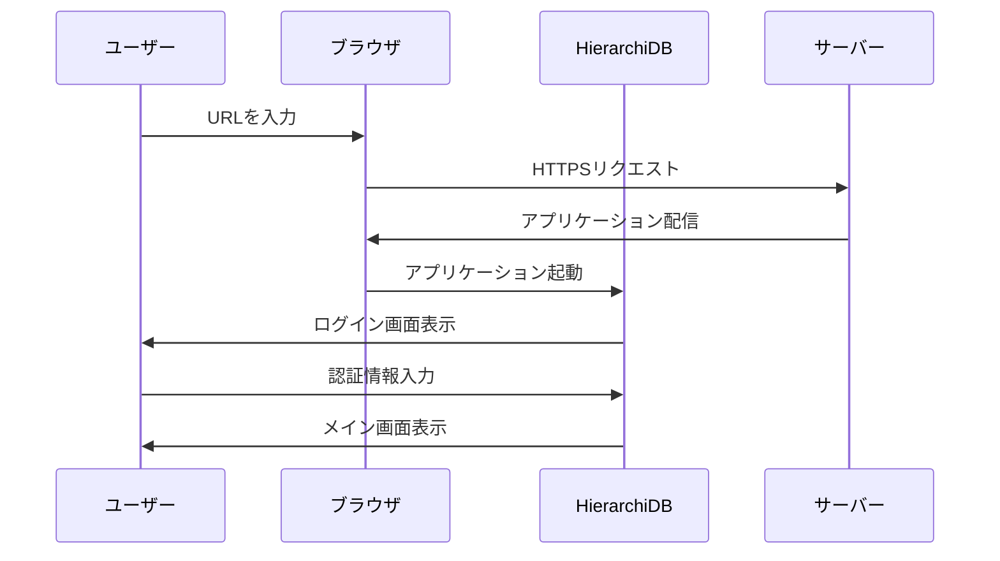

**アクセスURL構成**

| URL構成要素 | 説明 | 例 |
|-------------|------|-----|
| **プロトコル** | 必ずHTTPS | `https://` |
| **ドメイン** | アプリケーションドメイン | `your-domain.com` |
| **パス** | アプリケーションパス | `/hierarchidb/` |
| **完全URL** | 完全なアクセスURL | `https://your-domain.com/hierarchidb/` |

**初回アクセス時の流れ**

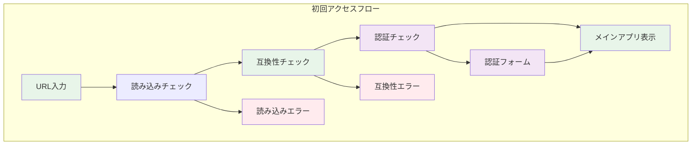

#### 3.1.2 ブックマーク設定 ⭐️⭐️⭐️⭐️

効率的な利用のために、ブラウザのブックマーク機能を活用します。

**基本ブックマーク設定**

| ブックマーク名             | URL                     | 用途              |
|---------------------|-------------------------|-----------------|
| **HierarchiDB メイン** | `/`                     | トップページ          |
| **リソースツリー**         | `/t/r`                  | リソース管理          |
| **プロジェクトツリー**       | `/t/p`                  | プロジェクト管理        |
| **ライセンス情報**         | `/info` | オープンソースライセンス確認用 |

**ブックマーク作成手順**

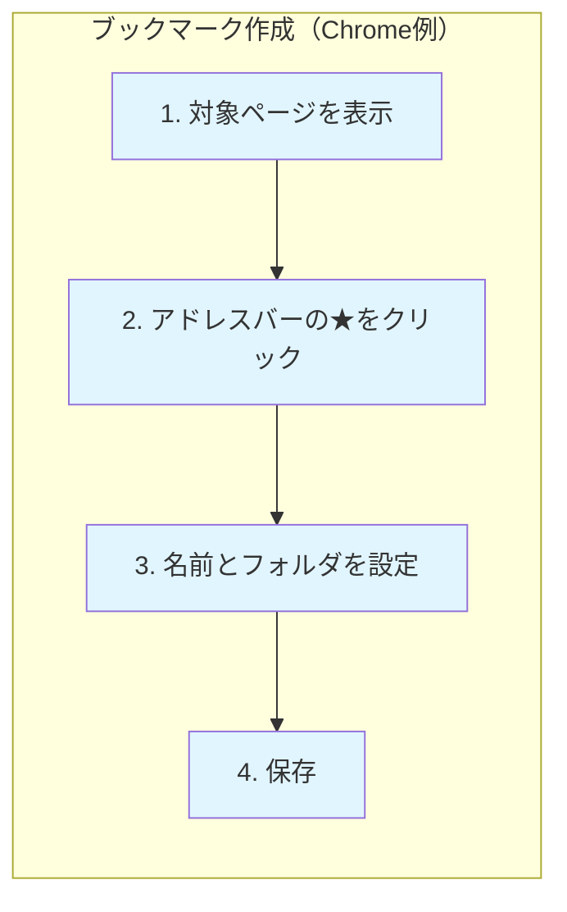

**ブックマークフォルダ構成例**

```
📁 HierarchiDB
├── 🏠 メインページ
├── 📊 ダッシュボード
├── 📁 プロジェクト
│   ├── プロジェクトA
│   ├── プロジェクトB
│   └── アーカイブ
├── 📂 リソース
│   ├── 文書管理
│   ├── 画像ファイル
│   └── データベース
└── ⚙️ 設定・管理
```

#### 3.1.3 ショートカット作成 ⭐️⭐️⭐️

デスクトップやタスクバーにショートカットを作成することで、より簡単にアクセスできます。

**Windowsでのショートカット作成**

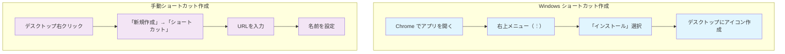

**macOS でのショートカット作成**

| 方法 | 手順 | 結果 |
|------|------|------|
| **Safari** | 共有 → Dockに追加 | Dock にアイコン追加 |
| **Chrome** | インストール → PWA化 | アプリケーションフォルダに追加 |
| **手動** | ブックマーク → デスクトップにドラッグ | デスクトップエイリアス作成 |

### 3.2 初回セットアップ ⭐️⭐️⭐️⭐️

#### 3.2.1 アカウント登録 ⭐️⭐️⭐️⭐️

HierarchiDBの利用には、必要に応じて認証が必要です（環境によって設定が異なります）。

**認証方式の種類**

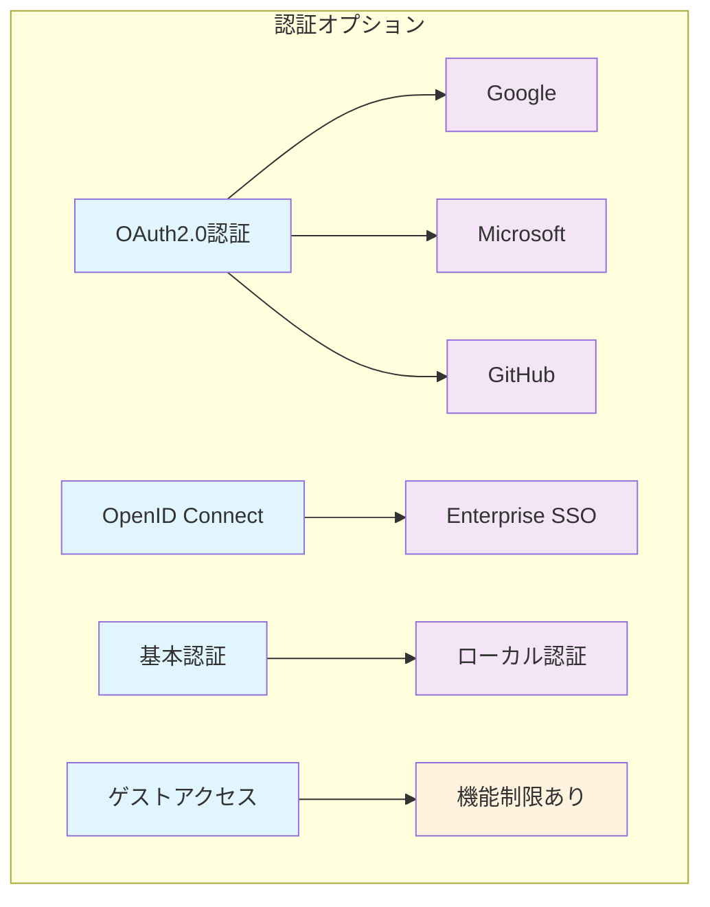

**初回登録フロー**

| ステップ | 操作 | 画面表示 |
|----------|------|----------|
| 1 | アプリケーションにアクセス | スプラッシュ画面 |
| 2 | 「ログイン」ボタンをクリック | 認証プロバイダ選択 |
| 3 | 認証プロバイダを選択 | 外部認証サイトへリダイレクト |
| 4 | アカウント情報を入力 | 認証プロバイダのログイン画面 |
| 5 | 権限許可を確認 | 権限確認ダイアログ |
| 6 | アプリケーションに戻る | プロフィール設定画面 |

#### 3.2.2 初期設定 ⭐️⭐️⭐️

認証完了後、個人設定を行います。

**基本プロフィール設定**

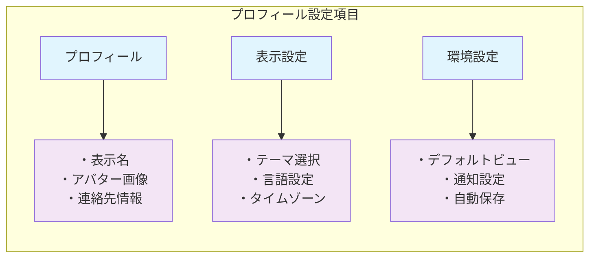

**ワークスペース設定**

| 設定項目 | 選択肢 | 推奨値 | 説明 |
|----------|--------|--------|------|
| **デフォルトツリー** | Resources / Projects | Resources | 起動時に表示するツリー |
| **表示モード** | Table / Card / List | Table | ノード表示形式 |
| **ページサイズ** | 25 / 50 / 100 / 200 | 50 | 1ページあたりの表示件数 |
| **自動展開** | ON / OFF | OFF | サブツリーの自動展開 |

#### 3.2.3 テーマ・言語設定 ⭐️⭐️⭐️⭐️

ユーザーの好みに応じてインターフェースをカスタマイズできます。

**テーマ選択**

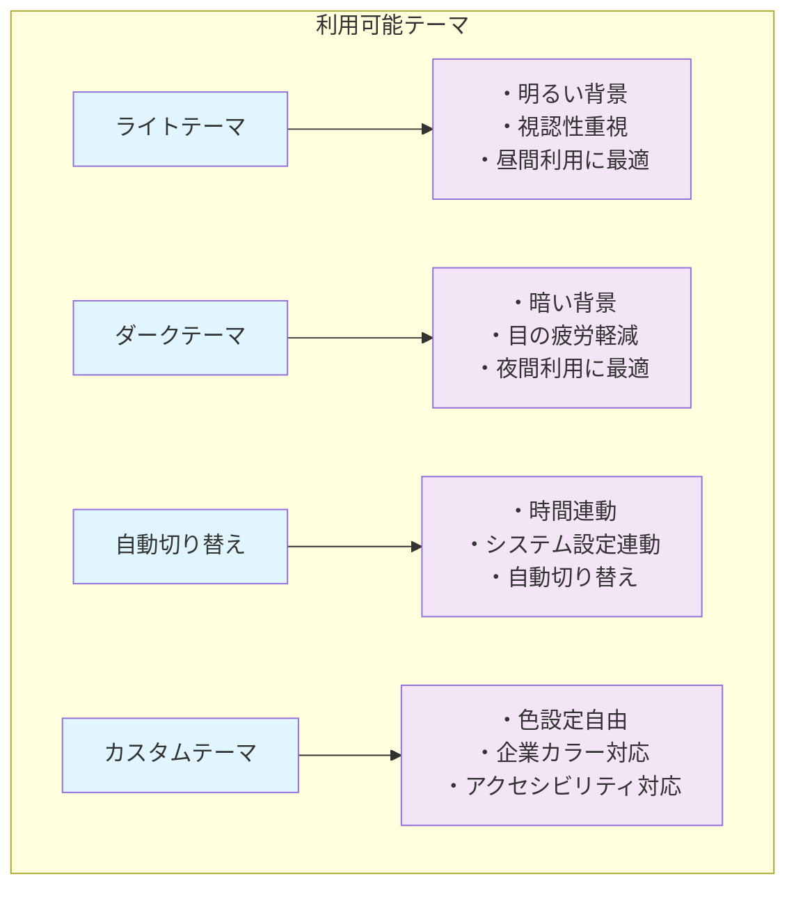

**言語設定**

| 言語 | コード | サポート状況 | 備考 |
|------|--------|--------------|------|
| **日本語** | ja-JP | 完全サポート | UIメッセージ、ヘルプ含む |
| **英語** | en-US | 完全サポート | デフォルト言語 |
| **中国語（簡体）** | zh-CN | 部分サポート | UI翻訳のみ |
| **韓国語** | ko-KR | 部分サポート | UI翻訳のみ |

### 3.3 データ準備 ⭐️⭐️⭐️⭐️

#### 3.3.1 初期データ作成 ⭐️⭐️⭐️⭐️⭐️

初回利用時に基本的なデータ構造を作成します。

**推奨初期構造**

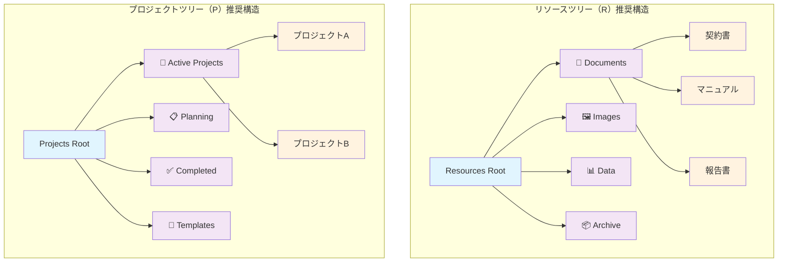

**初期ノード作成手順**

| ステップ | 操作 | 作成内容 |
|----------|------|----------|
| 1 | ツリー選択 | Resources または Projects |
| 2 | 右クリックメニュー | 「新しいフォルダ作成」 |
| 3 | 名前入力 | カテゴリ名を入力 |
| 4 | アイコン選択 | 適切なアイコンを選択 |
| 5 | 説明入力 | 用途を説明 |
| 6 | 保存 | ノード作成完了 |

#### 3.3.2 サンプルデータ利用 ❌❌

学習目的でサンプルデータを利用できます（環境により提供状況が異なります）。

**サンプルデータの種類**

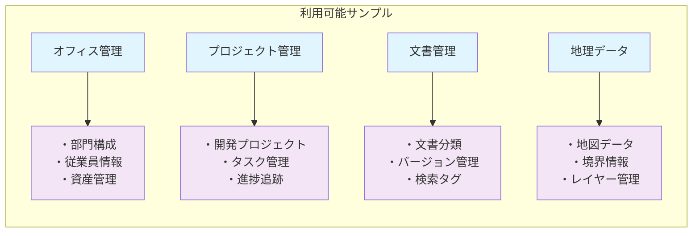

#### 3.3.3 データインポート ⭐️⭐️⭐️

既存データをHierarchiDBに取り込む方法です。

**対応インポート形式**

| 形式 | 拡張子 | 対応プラグイン | 制限事項 |
|------|--------|----------------|----------|
| **JSON** | .json | 全プラグイン | 構造データのみ |
| **CSV** | .csv | Spreadsheet | 表形式データのみ |
| **Shapefile** | .shp | Shape | 地理データのみ |
| **ZIP** | .zip | 全プラグイン | 圧縮ファイル対応 |

**インポート手順**

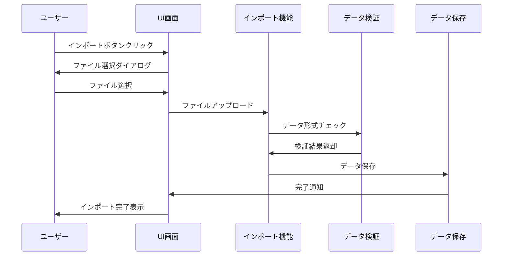

**インポート時の注意事項**

- **データ形式の確認**: 対応形式であることを事前に確認
- **ファイルサイズ制限**: 大きなファイルは分割推奨（目安：10MB以下）
- **文字エンコード**: UTF-8形式を推奨
- **階層構造**: 既存のツリー構造との整合性を確認
- **バックアップ**: インポート前に既存データのバックアップを推奨

**まとめ**

HierarchiDBのセットアップは、ブラウザからのアクセスと基本設定だけで完了します。適切なブックマーク設定とショートカット作成により、日常的な利用が便利になります。初期データの準備とサンプルデータの活用により、すぐに実用的な利用を開始できます。