# Project と PropertyResolver 完全ガイド

わかりやすい図と実例で学ぶ、HierarchiDBの中核機能

## 目次
1. [Projectとは？](#projectとは)
2. [PropertyResolverとは？](#propertyresolverとは)
3. [実例で学ぶProject](#実例で学ぶproject)
4. [実例で学ぶPropertyResolver](#実例で学ぶpropertyresolver)
5. [よくあるパターン集](#よくあるパターン集)

---

## Projectとは？

### 📦 Projectは「データのコンテナ」

Projectは、関連するデータをまとめて管理する**コンテナ**です。
レゴブロックのように、いろいろなデータを組み合わせて、ひとつの作品を作るイメージです。

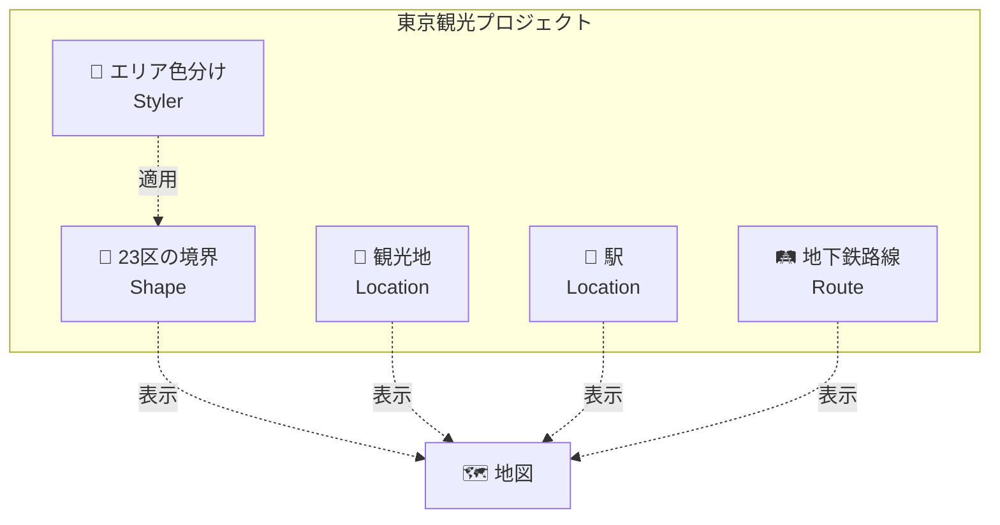

### なぜProjectが必要？

#### ❌ Projectがない場合
```
📁 データ
├── 東京の境界.shp
├── 観光地リスト.csv
├── 駅データ.json
└── 地下鉄路線.geojson

→ バラバラで管理が大変！
→ どれとどれが関連するか不明！
```

#### ✅ Projectがある場合
```
📦 東京観光プロジェクト
├── 🗾 23区の境界
├── 📍 観光地（浅草寺、スカイツリー...）
├── 📍 駅（東京駅、新宿駅...）
└── 🛤️ 地下鉄路線

→ 関連データが一目瞭然！
→ まとめて管理・更新できる！
```

---

## PropertyResolverとは？

### 🔄 PropertyResolverは「翻訳機」

PropertyResolverは、データ間の**翻訳機**や**連結器**のような役割を果たします。

```mermaid
graph LR
    subgraph "入力データ"
        A[空港コード<br/>"NRT"]
        B[国コード<br/>"JP"]
    end
    
    subgraph "PropertyResolver<br/>🔄 変換・翻訳"
        T[変換ルール]
    end
    
    subgraph "出力データ"
        C[空港名<br/>"成田国際空港"]
        D[国名<br/>"日本"<br/>"Japan"]
    end
    
    A --> T
    B --> T
    T --> C
    T --> D
```

### わかりやすい例：コーヒーショップ

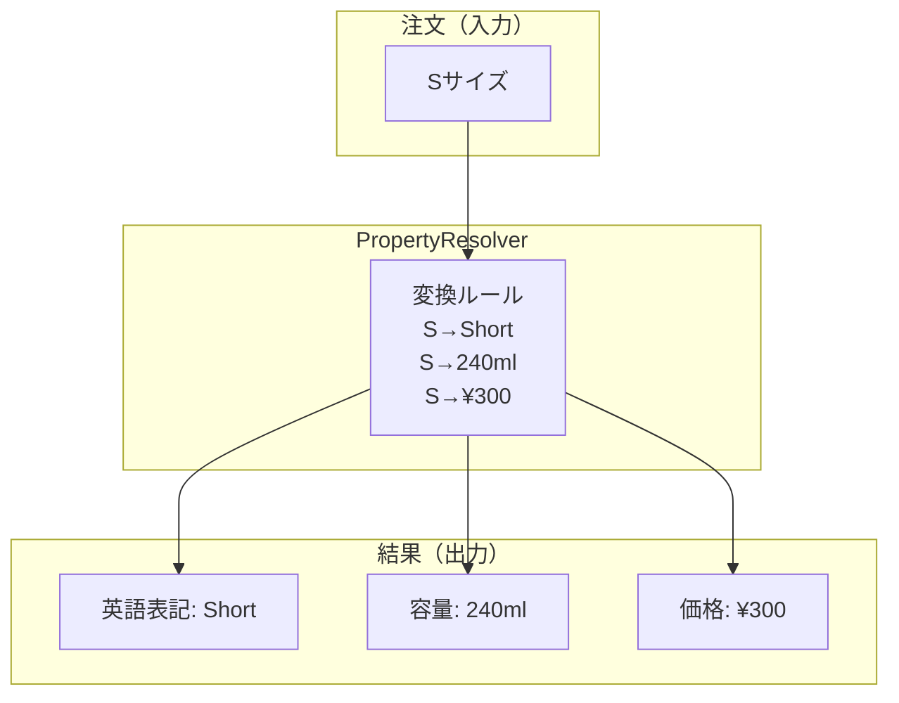

---

## 実例で学ぶProject

### 例1: 日本の交通ネットワークプロジェクト

#### Step 1: プロジェクトの構成を決める

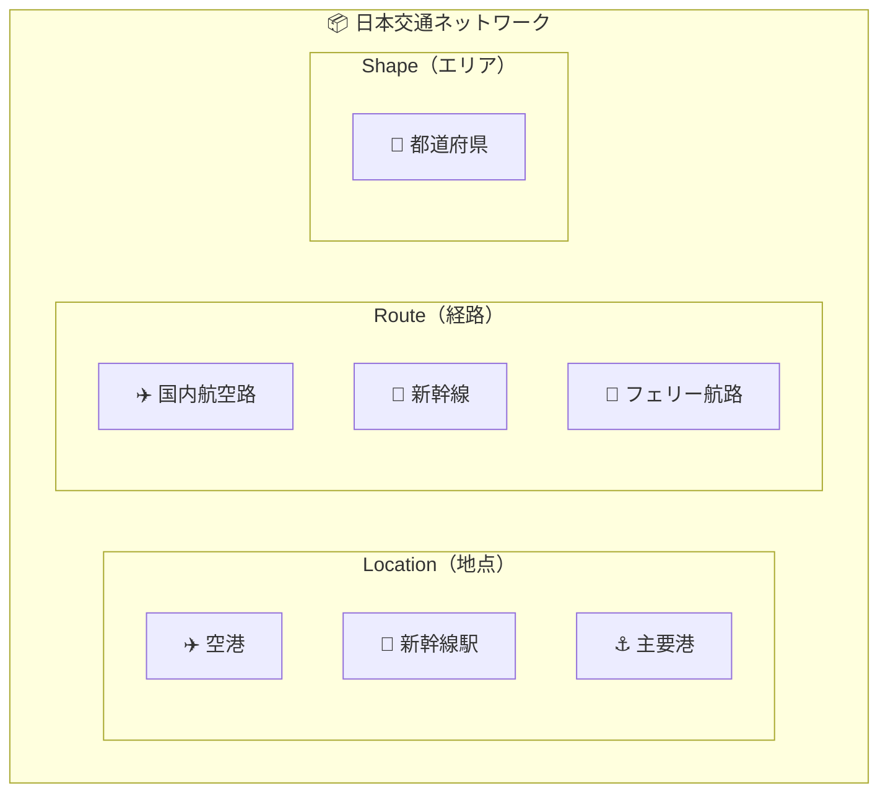

#### Step 2: データを追加していく

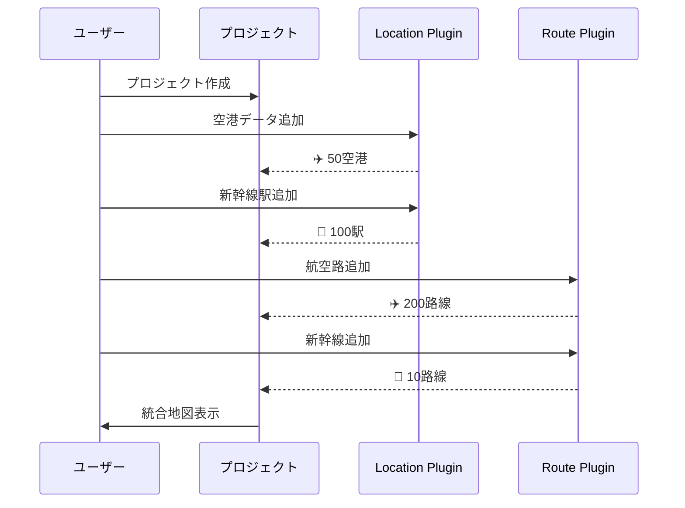

#### Step 3: 結果

```
📦 日本交通ネットワーク
├── 📍 150地点（空港50 + 駅100）
├── 🛤️ 210路線（航空200 + 新幹線10）
└── 🗾 47都道府県

→ すべてが地図上に統合表示される！
```

### 例2: 災害対策プロジェクト

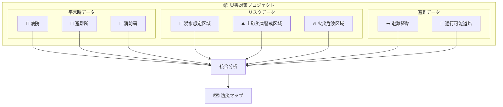

### 例3: 観光案内プロジェクト

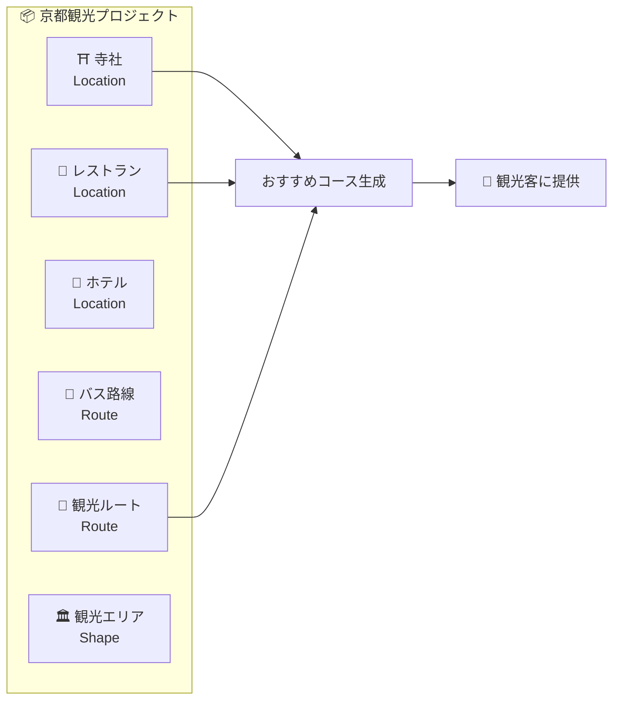

---

## 実例で学ぶPropertyResolver

### 例1: 空港コードの変換

#### 設定前：意味不明なコード
```
NRT, HND, KIX, NGO, CTS...
```

#### PropertyResolver設定
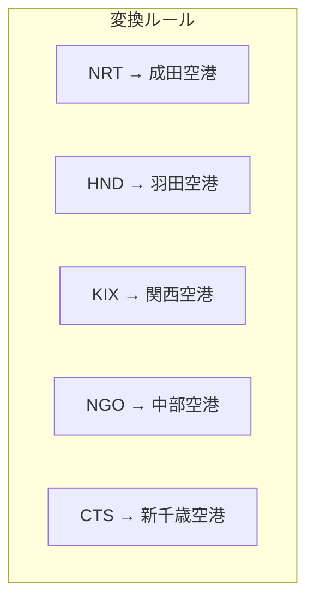

#### 設定後：わかりやすい名前で検索可能
```
✅ "成田"で検索 → NRTがヒット
✅ "羽田"で検索 → HNDがヒット
✅ "Narita"で検索 → NRTがヒット
```

### 例2: 多言語対応

```mermaid
graph TB
    subgraph "元データ"
        Data[country: "JP"]
    end
    
    subgraph "PropertyResolver"
        subgraph "変換ルール"
            R1[JP → Japan]
            R2[JP → 日本]
            R3[JP → 日本国]
            R4[JP → Japon]
            R5[JP → 일본]
        end
    end
    
    subgraph "検索可能になる"
        S1[🔍 "Japan" ✓]
        S2[🔍 "日本" ✓]
        S3[🔍 "Japon" ✓]
        S4[🔍 "일본" ✓]
    end
    
    Data --> R1 --> S1
    Data --> R2 --> S2
    Data --> R3 --> S2
    Data --> R4 --> S3
    Data --> R5 --> S4
```

### 例3: 駅とバス停の統合検索

#### 問題：異なるデータ形式
```mermaid
graph TB
    subgraph "鉄道データ"
        Train[駅名: "東京"<br/>駅コード: "TYO"<br/>路線: "JR"]
    end
    
    subgraph "バスデータ"
        Bus[停留所: "東京駅前"<br/>系統: "都01"<br/>会社: "都営"]
    end
    
    Problem[❌ 形式が違うので統合検索できない！]
    
    Train --> Problem
    Bus --> Problem
```

#### 解決：PropertyResolverで統一
```mermaid
graph TB
    subgraph "PropertyResolver設定"
        Rule1[駅名 → location_name]
        Rule2[停留所 → location_name]
        Rule3[駅コード → location_code]
        Rule4["東京駅前" → "東京"]
    end
    
    subgraph "統一された形式"
        Unified[location_name: "東京"<br/>location_type: "station/bus_stop"<br/>location_code: "TYO"]
    end
    
    Rule1 --> Unified
    Rule2 --> Unified
    Rule3 --> Unified
    Rule4 --> Unified
    
    Unified --> Search[✅ "東京"で両方検索可能！]
```

### 例4: ショッピングモールの例

```mermaid
graph TB
    subgraph "元データ（バラバラ）"
        Shop1[店舗名: "Starbucks"<br/>階: "1F"<br/>カテゴリ: "CAFE"]
        Shop2[テナント: "ユニクロ"<br/>フロア: "2"<br/>業種: "衣料"]
        Shop3[name: "Apple Store"<br/>level: "Ground"<br/>type: "Electronics"]
    end
    
    subgraph "PropertyResolver"
        R1[店舗名/テナント/name → shop_name]
        R2[階/フロア/level → floor]
        R3[CAFE → カフェ]
        R4[衣料 → ファッション]
        R5[Electronics → 家電]
    end
    
    subgraph "統一後"
        Result[すべて同じ形式で検索可能！<br/>🔍 "カフェ" → Starbucks<br/>🔍 "2階" → ユニクロ<br/>🔍 "家電" → Apple Store]
    end
    
    Shop1 --> R1 --> Result
    Shop2 --> R1 --> Result
    Shop3 --> R1 --> Result
```

---

## よくあるパターン集

### パターン1: 階層的な地域データ

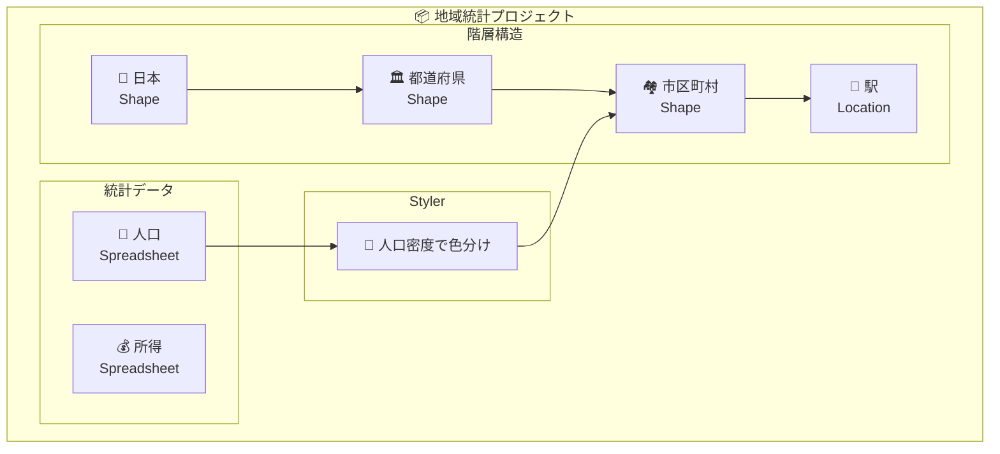

### パターン2: 時系列データの管理

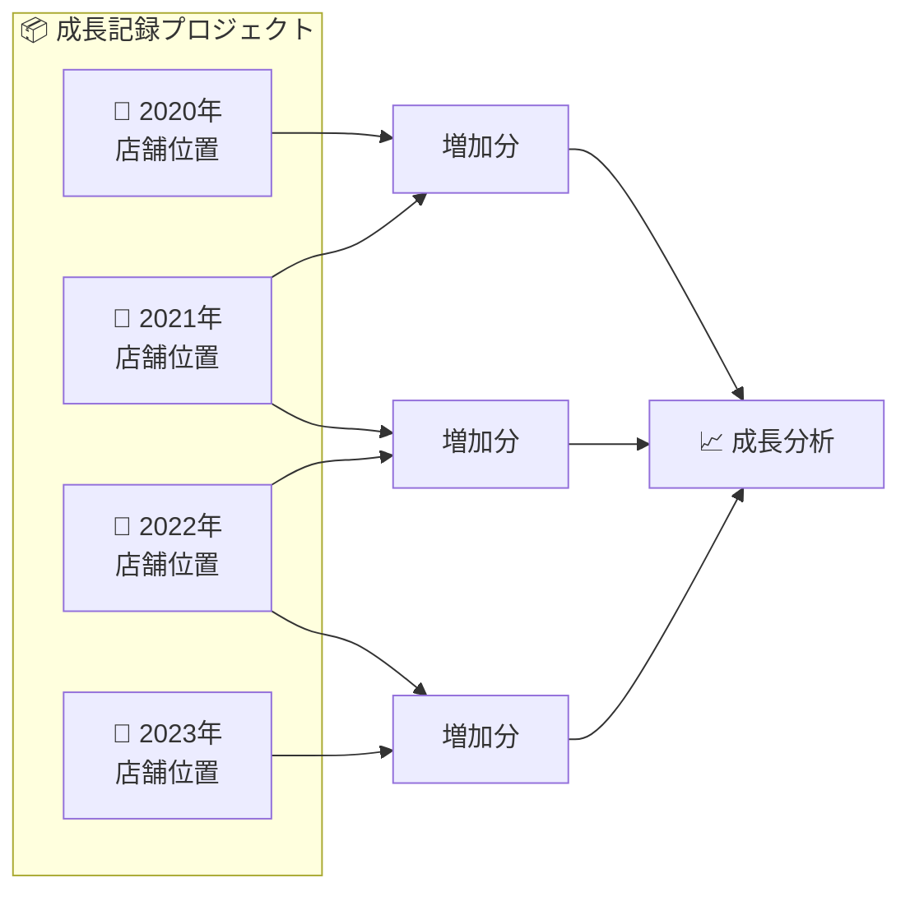

### パターン3: マルチソース統合

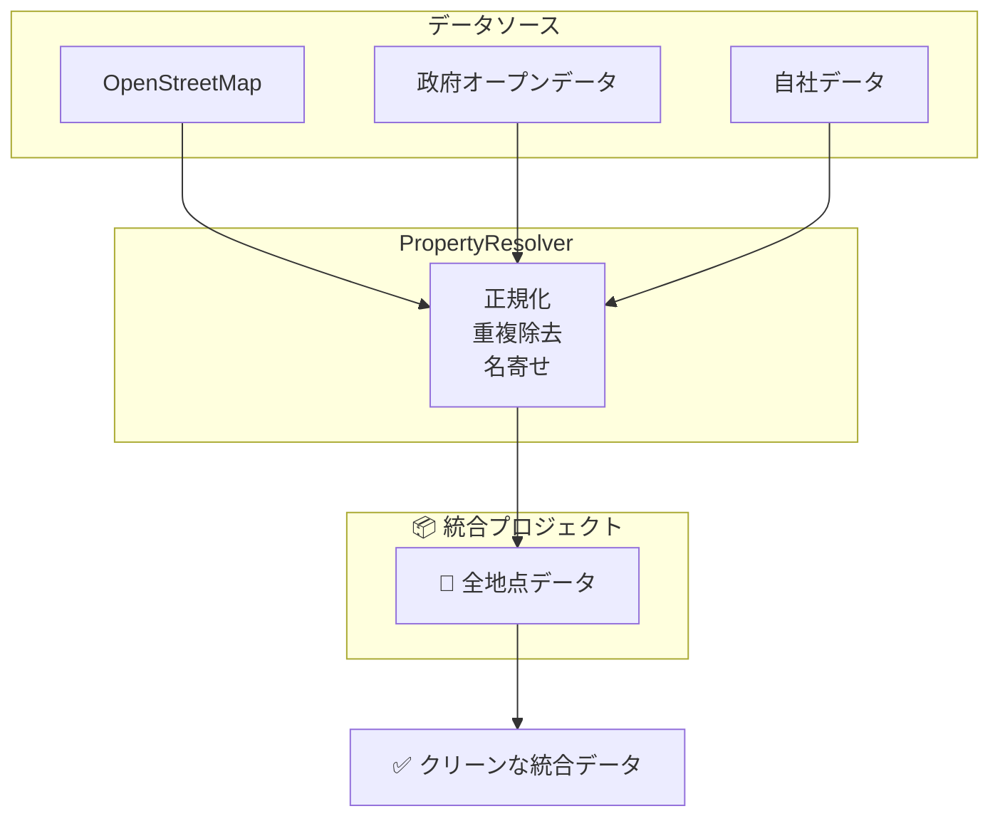

### パターン4: 条件付き表示

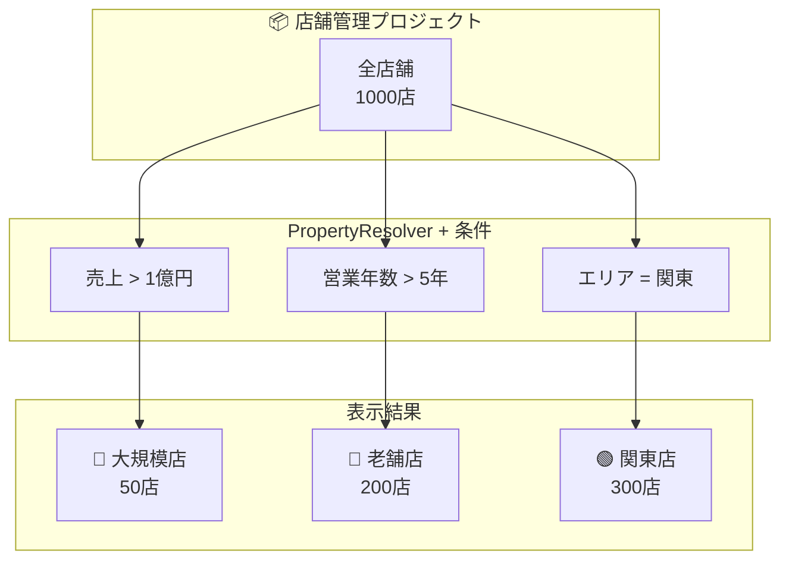

---

## まとめ：ProjectとPropertyResolverの関係

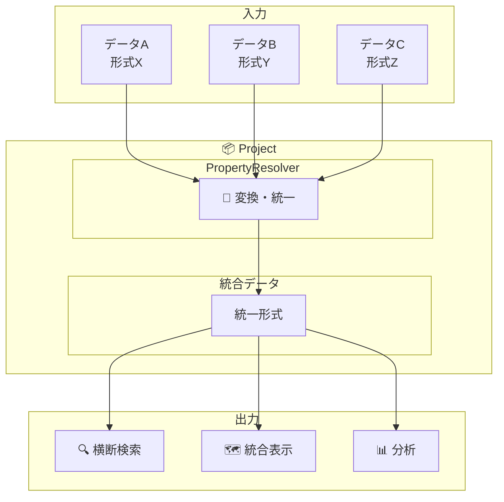

### 覚えておくべきポイント

1. **Project** = データをまとめる箱
2. **PropertyResolver** = データを変換・つなぐ翻訳機
3. **組み合わせ** = 異なるデータを統合して価値を生む

### 次のステップ

- 実際にProjectを作ってみる
- PropertyResolverで変換ルールを設定してみる
- 複数のデータを組み合わせて地図を作成してみる

---

## FAQ

### Q: ProjectとFolderの違いは？
**A:** 
- Folder = ただの整理用の箱（ファイルフォルダと同じ）
- Project = データを統合・連携させる賢い箱

### Q: PropertyResolverは必須？
**A:** 必須ではありませんが、使うと：
- 異なるデータを簡単に連携
- 多言語検索が可能に
- データの価値が大幅アップ

### Q: 1つのProjectにいくつまでデータを入れられる？
**A:** 制限はありませんが、管理しやすさを考えると：
- Location: 10個程度
- Route: 5個程度  
- Shape: 5個程度
が目安です。