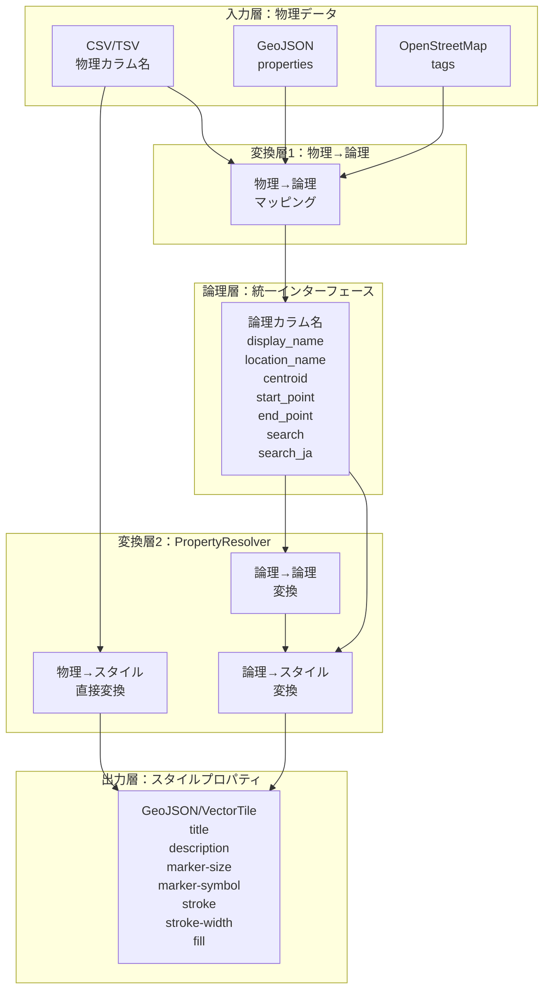
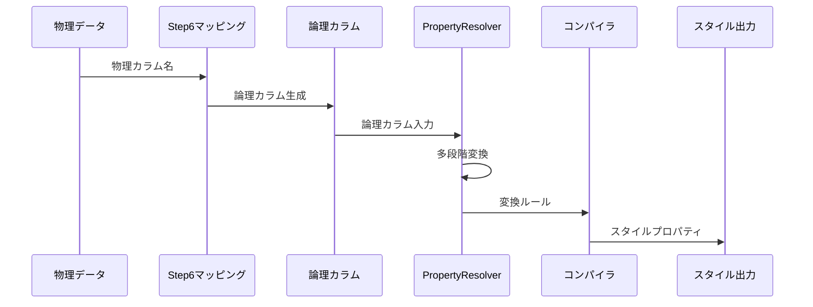

# マッピングシステム アーキテクチャガイド

物理カラムから論理カラム、そしてスタイルプロパティまでの完全な変換フロー

## 目次
1. [マッピングシステム概要](#マッピングシステム概要)
2. [論理カラム名体系](#論理カラム名体系)
3. [PropertyResolverによる多段階変換](#propertyresolverによる多段階変換)
4. [スタイルプロパティへの最終変換](#スタイルプロパティへの最終変換)
5. [実装例とベストプラクティス](#実装例とベストプラクティス)

---

## マッピングシステム概要

### 全体アーキテクチャ



### 変換フローの詳細



---

## 論理カラム名体系

### 標準論理カラム名定義

#### 基本属性（全プラグイン共通）

| 論理カラム名 | 用途 | Shape | Location | Route |
|-------------|------|-------|----------|-------|
| `display_name` | 表示名 | ✓ | ✓ | ✓ |
| `description` | 説明文 | ✓ | ✓ | ✓ |
| `category` | カテゴリ | ✓ | ✓ | ✓ |
| `importance` | 重要度（0-1） | ✓ | ✓ | ✓ |
| `tags` | タグ（配列） | ✓ | ✓ | ✓ |

#### 地理属性（Shape用）

| 論理カラム名 | 用途 | 例 |
|-------------|------|-----|
| `area_name` | 地域名 | "関東地方" |
| `country_name` | 国名 | "日本" |
| `admin_level` | 行政レベル | 1（国）, 2（都道府県）, 3（市区町村） |
| `centroid` | 中心点ID | "tokyo_center_001" |
| `population` | 人口 | 13960000 |
| `area_km2` | 面積（km²） | 2194.07 |

#### 地点属性（Location用）

| 論理カラム名 | 用途 | 例 |
|-------------|------|-----|
| `location_name` | 地点名 | "東京駅" |
| `location_code` | 地点コード | "TYO", "RJTT" |
| `location_type` | 地点タイプ | "station", "airport" |
| `latitude` | 緯度 | 35.681236 |
| `longitude` | 経度 | 139.767125 |
| `altitude` | 標高 | 3.0 |
| `centroid` | 関連Shape ID | "tokyo_center_001" |

#### 経路属性（Route用）

| 論理カラム名 | 用途 | 例 |
|-------------|------|-----|
| `route_name` | 路線名 | "東海道新幹線" |
| `route_code` | 路線コード | "TKD-SHK" |
| `route_type` | 路線タイプ | "railway", "highway" |
| `start_point` | 始点ID/座標 | "tokyo_station" or [139.767, 35.681] |
| `end_point` | 終点ID/座標 | "osaka_station" or [135.495, 34.702] |
| `distance_km` | 距離（km） | 515.4 |
| `duration_min` | 所要時間（分） | 156 |

#### 検索用属性（全プラグイン共通）

| 論理カラム名 | 用途 | 例 |
|-------------|------|-----|
| `search` | 汎用検索用 | "Tokyo Station" |
| `search_ja` | 日本語検索用 | "東京駅" |
| `search_en` | 英語検索用 | "Tokyo Station" |
| `search_local` | 現地語検索用 | "東京駅" |
| `search_alt` | 別名検索用 | "東京中央駅" |

### マッピング設定例

```typescript
// Step 6での物理→論理マッピング設定
const shapeMapping = {
  // 物理カラム → 論理カラム
  'prefecture_name': 'area_name',      // 都道府県名 → 地域名
  'pref_code': 'location_code',        // 都道府県コード → 地点コード
  'population_2020': 'population',     // 2020年人口 → 人口
  'capital_id': 'centroid',            // 県庁所在地ID → セントロイド
  'name_ja': 'search_ja',              // 日本語名 → 日本語検索
  'name_en': 'search_en',              // 英語名 → 英語検索
};

const locationMapping = {
  'station_name': 'location_name',     // 駅名 → 地点名
  'station_code': 'location_code',     // 駅コード → 地点コード
  'lat': 'latitude',                   // 緯度
  'lon': 'longitude',                  // 経度
  'prefecture_id': 'centroid',         // 都道府県ID → セントロイド
};

const routeMapping = {
  'line_name': 'route_name',           // 路線名
  'origin_station': 'start_point',     // 起点駅 → 始点
  'terminal_station': 'end_point',     // 終点駅 → 終点
  'total_distance': 'distance_km',     // 総距離
};
```

---

## PropertyResolverによる多段階変換

### 変換パターンの種類

```mermaid
graph TB
    subgraph "変換パターン"
        P2L[物理→論理]
        L2L[論理→論理]
        P2S[物理→スタイル]
        L2S[論理→スタイル]
    end
    
    subgraph "例"
        E1["station_name"→"location_name"]
        E2["location_name"→"search"]
        E3["importance"→"marker-size"]
        E4["category"→"marker-symbol"]
    end
    
    P2L --> E1
    L2L --> E2
    P2S --> E3
    L2S --> E4
```

### 実装例：空港データの完全変換

```typescript
// PropertyResolver設定
const airportResolver = {
  // Stage 1: 物理→論理
  physicalToLogical: [
    {
      source: 'iata_code',
      target: 'location_code',
      transform: (code) => code.toUpperCase()
    },
    {
      source: 'airport_name',
      target: 'location_name',
      transform: (name) => name.replace('International Airport', '空港')
    },
    {
      source: ['latitude_deg', 'longitude_deg'],
      target: ['latitude', 'longitude'],
      transform: (lat, lon) => [parseFloat(lat), parseFloat(lon)]
    }
  ],
  
  // Stage 2: 論理→論理
  logicalToLogical: [
    {
      source: 'location_code',
      target: 'search',
      transform: (code) => {
        const names = {
          'NRT': 'Narita',
          'HND': 'Haneda',
          'KIX': 'Kansai'
        };
        return names[code] || code;
      }
    },
    {
      source: 'location_code',
      target: 'search_ja',
      transform: (code) => {
        const names = {
          'NRT': '成田',
          'HND': '羽田',
          'KIX': '関西'
        };
        return names[code] || code;
      }
    },
    {
      source: 'location_name',
      target: 'display_name',
      transform: (name) => name
    }
  ],
  
  // Stage 3: 論理→スタイル
  logicalToStyle: [
    {
      source: 'importance',
      target: 'marker-size',
      transform: (importance) => {
        if (importance > 0.8) return 'large';
        if (importance > 0.5) return 'medium';
        return 'small';
      }
    },
    {
      source: 'location_type',
      target: 'marker-symbol',
      transform: (type) => {
        const symbols = {
          'airport': 'airport',
          'station': 'rail',
          'port': 'harbor',
          'city': 'city'
        };
        return symbols[type] || 'marker';
      }
    },
    {
      source: 'display_name',
      target: 'title',
      transform: (name) => name
    },
    {
      source: ['location_code', 'category'],
      target: 'description',
      transform: (code, cat) => `${cat} (${code})`
    }
  ],
  
  // Stage 4: 直接スタイル設定
  directStyle: {
    'stroke': '#0066CC',
    'stroke-width': 2,
    'fill': '#E6F2FF',
    'fill-opacity': 0.6
  }
};
```

### 関係性マッピング：Shape-Location-Route連携

```typescript
// セントロイドによる Shape ↔ Location 連携
const centroidLinking = {
  // Shape側の設定
  shapeResolver: {
    physicalToLogical: [
      {
        source: 'capital_city_id',
        target: 'centroid',
        transform: (id) => `city_${id}`
      }
    ]
  },
  
  // Location側の設定
  locationResolver: {
    physicalToLogical: [
      {
        source: 'city_id',
        target: 'centroid',
        transform: (id) => `city_${id}`
      }
    ]
  },
  
  // 連携ルール
  linkingRule: {
    type: 'centroid',
    match: (shapeCentroid, locationCentroid) => {
      return shapeCentroid === locationCentroid;
    },
    onMatch: (shape, location) => {
      // 相互参照を設定
      shape.properties.linked_location = location.id;
      location.properties.linked_shape = shape.id;
    }
  }
};

// 始点・終点による Location ↔ Route 連携
const routeLinking = {
  // Route側の設定
  routeResolver: {
    physicalToLogical: [
      {
        source: 'origin_airport_code',
        target: 'start_point',
        transform: (code) => ({ type: 'location_code', value: code })
      },
      {
        source: 'destination_airport_code',
        target: 'end_point',
        transform: (code) => ({ type: 'location_code', value: code })
      }
    ]
  },
  
  // 連携解決
  resolveLinking: async (route, locations) => {
    const startLocation = locations.find(
      loc => loc.properties.location_code === route.properties.start_point.value
    );
    const endLocation = locations.find(
      loc => loc.properties.location_code === route.properties.end_point.value
    );
    
    if (startLocation && endLocation) {
      route.properties.start_coordinates = [
        startLocation.properties.longitude,
        startLocation.properties.latitude
      ];
      route.properties.end_coordinates = [
        endLocation.properties.longitude,
        endLocation.properties.latitude
      ];
    }
  }
};
```

---

## スタイルプロパティへの最終変換

### GeoJSON/VectorTile スタイルプロパティ仕様

```typescript
interface GeoJSONStyleProperties {
  // Mapbox Simple Style Spec
  'title'?: string;              // ポップアップタイトル
  'description'?: string;        // ポップアップ説明
  'marker-size'?: 'small' | 'medium' | 'large';
  'marker-symbol'?: string;      // Maki icon名
  'marker-color'?: string;       // HEX color
  'stroke'?: string;             // 線の色
  'stroke-opacity'?: number;     // 線の透明度 (0-1)
  'stroke-width'?: number;       // 線の太さ
  'fill'?: string;               // 塗りつぶし色
  'fill-opacity'?: number;       // 塗りつぶし透明度 (0-1)
}
```

### コンパイル処理

```typescript
class PropertyResolverCompiler {
  private rules: PropertyResolverRules;
  private cache: Map<string, CompiledFunction>;
  
  compile(feature: GeoJSONFeature): GeoJSONFeature {
    const compiledFeature = { ...feature };
    const props = feature.properties;
    
    // Step 1: 物理→論理
    const logicalProps = this.applyPhysicalToLogical(props);
    
    // Step 2: 論理→論理（多段階）
    const transformedProps = this.applyLogicalToLogical(logicalProps);
    
    // Step 3: スタイルプロパティ生成
    const styleProps = this.generateStyleProperties(transformedProps);
    
    // Step 4: 直接スタイル適用
    const finalStyle = { ...styleProps, ...this.rules.directStyle };
    
    // 結果をFeatureに適用
    compiledFeature.properties = {
      ...transformedProps,
      ...finalStyle
    };
    
    return compiledFeature;
  }
  
  private applyPhysicalToLogical(props: any): any {
    const result = { ...props };
    
    for (const rule of this.rules.physicalToLogical) {
      if (props[rule.source] !== undefined) {
        result[rule.target] = rule.transform
          ? rule.transform(props[rule.source])
          : props[rule.source];
      }
    }
    
    return result;
  }
  
  private applyLogicalToLogical(props: any): any {
    let result = { ...props };
    
    // 複数回の変換に対応（最大10回）
    for (let i = 0; i < 10; i++) {
      let changed = false;
      
      for (const rule of this.rules.logicalToLogical) {
        if (result[rule.source] !== undefined) {
          const newValue = rule.transform
            ? rule.transform(result[rule.source])
            : result[rule.source];
          
          if (result[rule.target] !== newValue) {
            result[rule.target] = newValue;
            changed = true;
          }
        }
      }
      
      if (!changed) break;
    }
    
    return result;
  }
  
  private generateStyleProperties(props: any): any {
    const style: GeoJSONStyleProperties = {};
    
    for (const rule of this.rules.logicalToStyle) {
      if (Array.isArray(rule.source)) {
        // 複数ソースの場合
        const values = rule.source.map(s => props[s]);
        if (values.every(v => v !== undefined)) {
          style[rule.target] = rule.transform
            ? rule.transform(...values)
            : values.join(' ');
        }
      } else {
        // 単一ソースの場合
        if (props[rule.source] !== undefined) {
          style[rule.target] = rule.transform
            ? rule.transform(props[rule.source])
            : props[rule.source];
        }
      }
    }
    
    return style;
  }
}
```

---

## 実装例とベストプラクティス

### 完全な実装例：日本の交通ネットワーク

```typescript
// 1. データソース定義
const dataSources = {
  stations: {
    format: 'csv',
    physicalColumns: ['駅名', '駅コード', '緯度', '経度', '路線名', '乗降客数']
  },
  railways: {
    format: 'geojson',
    physicalColumns: ['線名', '起点', '終点', '営業キロ', '運行本数']
  },
  prefectures: {
    format: 'shapefile',
    physicalColumns: ['県名', '県庁所在地', '人口', '面積']
  }
};

// 2. 統合PropertyResolver設定
const integratedResolver = {
  // 駅データ
  stations: {
    physicalToLogical: [
      { source: '駅名', target: 'location_name' },
      { source: '駅コード', target: 'location_code' },
      { source: '緯度', target: 'latitude' },
      { source: '経度', target: 'longitude' },
      { source: '乗降客数', target: 'importance', 
        transform: (n) => Math.min(n / 1000000, 1) }
    ],
    logicalToLogical: [
      { source: 'location_name', target: 'search_ja' },
      { source: 'location_name', target: 'display_name' }
    ],
    logicalToStyle: [
      { source: 'importance', target: 'marker-size',
        transform: (i) => i > 0.7 ? 'large' : i > 0.3 ? 'medium' : 'small' },
      { source: 'display_name', target: 'title' },
      { source: 'importance', target: 'marker-color',
        transform: (i) => {
          const hue = (1 - i) * 120; // 赤→黄→緑
          return `hsl(${hue}, 70%, 50%)`;
        }}
    ]
  },
  
  // 路線データ
  railways: {
    physicalToLogical: [
      { source: '線名', target: 'route_name' },
      { source: '起点', target: 'start_point' },
      { source: '終点', target: 'end_point' },
      { source: '営業キロ', target: 'distance_km' },
      { source: '運行本数', target: 'frequency' }
    ],
    logicalToLogical: [
      { source: 'route_name', target: 'search_ja' },
      { source: 'route_name', target: 'display_name' },
      { source: 'frequency', target: 'importance',
        transform: (f) => Math.min(f / 100, 1) }
    ],
    logicalToStyle: [
      { source: 'importance', target: 'stroke-width',
        transform: (i) => 1 + i * 4 }, // 1-5px
      { source: 'route_name', target: 'title' },
      { source: ['distance_km', 'frequency'], target: 'description',
        transform: (d, f) => `${d}km, ${f}本/日` },
      { source: 'importance', target: 'stroke',
        transform: (i) => i > 0.7 ? '#FF0000' : i > 0.3 ? '#FFA500' : '#0000FF' }
    ]
  },
  
  // 都道府県データ
  prefectures: {
    physicalToLogical: [
      { source: '県名', target: 'area_name' },
      { source: '県庁所在地', target: 'centroid' },
      { source: '人口', target: 'population' },
      { source: '面積', target: 'area_km2' }
    ],
    logicalToLogical: [
      { source: 'area_name', target: 'search_ja' },
      { source: 'area_name', target: 'display_name' },
      { source: 'population', target: 'importance',
        transform: (p) => Math.min(p / 10000000, 1) }
    ],
    logicalToStyle: [
      { source: 'importance', target: 'fill-opacity',
        transform: (i) => 0.2 + i * 0.6 }, // 0.2-0.8
      { source: 'display_name', target: 'title' },
      { source: 'population', target: 'fill',
        transform: (p) => {
          if (p > 5000000) return '#8B0000';
          if (p > 3000000) return '#FF4500';
          if (p > 1000000) return '#FFA500';
          return '#FFE4B5';
        }},
      { source: ['population', 'area_km2'], target: 'description',
        transform: (p, a) => `人口: ${(p/10000).toFixed(0)}万人, 面積: ${a}km²` }
    ]
  }
};

// 3. コンパイル実行
const compiler = new PropertyResolverCompiler(integratedResolver);

// VectorTile生成時に適用
function generateVectorTile(features: GeoJSONFeature[]): VectorTile {
  const compiledFeatures = features.map(feature => {
    const dataType = detectDataType(feature); // stations/railways/prefectures
    return compiler.compile(feature, dataType);
  });
  
  return createVectorTile(compiledFeatures);
}
```

### ベストプラクティス

#### 1. 命名規則の統一

```typescript
// ✅ 良い例：一貫性のある命名
const namingConvention = {
  display: 'display_name',      // 表示用
  search: 'search_*',          // 検索用
  link: 'link_*',              // 連携用
  geo: 'latitude/longitude',    // 地理情報
  measure: '*_km/*_min',        // 計測値
};

// ❌ 悪い例：バラバラな命名
const badNaming = {
  name: 'name/title/label',     // 統一されていない
  search: 'search/find/query',  // 混在
};
```

#### 2. 変換の段階的適用

```typescript
// ✅ 良い例：段階的で追跡可能
const stagedTransform = {
  stage1_physical: { 'station_nm': '東京' },
  stage2_logical: { 'location_name': '東京' },
  stage3_enriched: { 'location_name': '東京', 'search': 'Tokyo' },
  stage4_styled: { 'title': '東京', 'marker-symbol': 'rail' }
};

// ❌ 悪い例：一度にすべて変換
const directTransform = {
  input: { 'station_nm': '東京' },
  output: { 'title': '東京', 'marker-symbol': 'rail' } // 中間状態が不明
};
```

#### 3. エラーハンドリング

```typescript
class SafePropertyResolver {
  transform(feature: any): any {
    try {
      // 必須フィールドのチェック
      const required = ['location_name', 'latitude', 'longitude'];
      for (const field of required) {
        if (!feature.properties[field]) {
          console.warn(`Missing required field: ${field}`);
          feature.properties[field] = this.getDefault(field);
        }
      }
      
      // 型変換の安全性
      if (feature.properties.latitude) {
        feature.properties.latitude = parseFloat(feature.properties.latitude);
        if (isNaN(feature.properties.latitude)) {
          throw new Error('Invalid latitude value');
        }
      }
      
      return this.compile(feature);
      
    } catch (error) {
      console.error('Transform failed:', error);
      return this.getFallbackFeature(feature);
    }
  }
}
```

### パフォーマンス最適化

```typescript
class OptimizedCompiler {
  private compiledFunctions = new Map<string, Function>();
  
  // ルールを関数にコンパイル（初回のみ）
  compileRule(rule: TransformRule): Function {
    const key = JSON.stringify(rule);
    
    if (!this.compiledFunctions.has(key)) {
      // 動的関数生成
      const func = new Function('props', `
        const source = props['${rule.source}'];
        if (source === undefined) return undefined;
        ${rule.transform ? `return (${rule.transform.toString()})(source);` : `return source;`}
      `);
      
      this.compiledFunctions.set(key, func);
    }
    
    return this.compiledFunctions.get(key)!;
  }
  
  // バッチ処理の最適化
  async processBatch(features: GeoJSONFeature[]): Promise<GeoJSONFeature[]> {
    const BATCH_SIZE = 1000;
    const results: GeoJSONFeature[] = [];
    
    for (let i = 0; i < features.length; i += BATCH_SIZE) {
      const batch = features.slice(i, i + BATCH_SIZE);
      
      // 並列処理
      const processed = await Promise.all(
        batch.map(f => this.processFeature(f))
      );
      
      results.push(...processed);
      
      // 進捗報告
      const progress = ((i + batch.length) / features.length) * 100;
      this.reportProgress(progress);
    }
    
    return results;
  }
}
```

---

## まとめ

### マッピングシステムの利点

1. **統一性**: 異なるデータソースを統一インターフェースで扱える
2. **柔軟性**: 多段階変換により複雑な要件に対応
3. **保守性**: 論理層により物理層の変更に強い
4. **拡張性**: 新しい変換ルールを容易に追加
5. **パフォーマンス**: コンパイルによる高速化

### チェックリスト

- [ ] 物理カラム名から論理カラム名へのマッピング定義
- [ ] Shape/Location/Route間の関係性マッピング
- [ ] 検索用論理カラムの設定
- [ ] PropertyResolverルールの設定
- [ ] スタイルプロパティへの変換定義
- [ ] コンパイル処理の実装
- [ ] エラーハンドリングの実装
- [ ] パフォーマンス最適化

この包括的なマッピングシステムにより、様々なデータソースからの入力を、統一されたGeoJSON/VectorTileフォーマットに変換し、リッチな地図表現を実現できます。