# 第4部 画面構成と基本操作 ⭐️⭐️⭐️⭐️⭐️

## Chapter 4: メイン画面構成

この章では、HierarchiDBのユーザーインターフェースの全体構成について詳しく説明します。ヘッダー部、ナビゲーション部、メインコンテンツ部の役割と機能を理解することで、効率的な操作が可能になります。また、各エリアの具体的な操作方法についても実践的な手順を提供します。

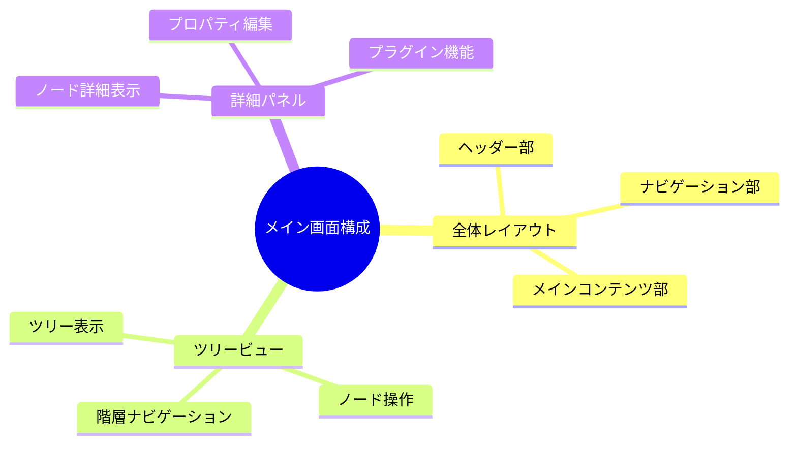

### 4.1 全体レイアウト ⭐️⭐️⭐️⭐️⭐️

#### 4.1.1 ヘッダー部 ⭐️⭐️⭐️⭐️⭐️

ヘッダー部は画面上部に固定表示され、全体のナビゲーションと重要な機能へのアクセスを提供します。

**ヘッダー構成要素**

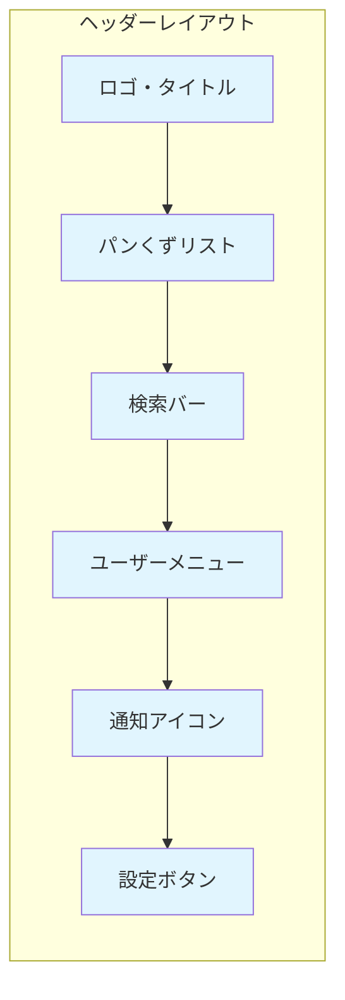

**各要素の機能**

| 要素 | 機能 | 操作方法 | 表示内容 |
|------|------|----------|----------|
| **ロゴ・タイトル** | ホームページへ戻る | クリック | HierarchiDB v1.0.0 |
| **パンくずリスト** | 現在位置表示・階層移動 | 各階層名をクリック | Home > Projects > ProjectA |
| **検索バー** | 全体検索・フィルター | テキスト入力・Enter | 検索結果のハイライト表示 |
| **ユーザーメニュー** | プロフィール・ログアウト | アバタークリック | ドロップダウンメニュー |
| **通知アイコン** | システム通知 | ベルアイコンクリック | 未読通知の件数表示 |
| **設定ボタン** | アプリケーション設定 | 歯車アイコンクリック | 設定パネル展開 |

#### 4.1.2 ナビゲーション部 ⭐️⭐️⭐️⭐️⭐️

画面左側に配置されるナビゲーション部は、主要機能とツリー構造へのアクセスを提供します。

**ナビゲーション構成**

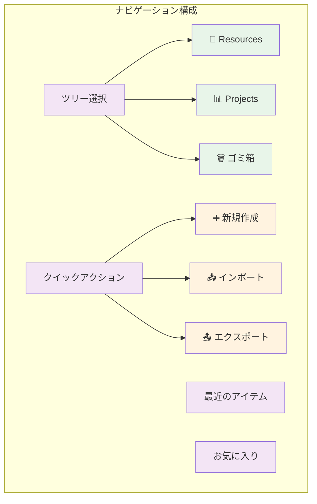

**ツリー切り替え機能**

| ツリー | アイコン | 説明 | 主な用途 |
|--------|----------|------|----------|
| **Resources** | 📁 | リソース管理ツリー | 文書、ファイル、データの整理 |
| **Projects** | 📊 | プロジェクト管理ツリー | タスク、進捗、成果物の管理 |
| **Trash** | 🗑️ | ゴミ箱 | 削除されたアイテムの管理 |

#### 4.1.3 メインコンテンツ部 ⭐️⭐️⭐️⭐️⭐️

画面中央から右側にかけてのメインコンテンツ部では、選択されたツリーの内容表示と詳細操作を行います。

**レイアウト切り替え操作**

| 操作 | 結果 | ショートカット | 使用場面 |
|------|------|----------------|----------|
| **分割表示切り替え** | 2カラム ⟷ 1カラム | `F11` | 詳細確認・集中作業 |
| **パネル幅調整** | ドラッグで比率変更 | ドラッグ | 表示バランス調整 |
| **詳細パネル閉じる** | ツリービューのみ表示 | `Esc` | ツリー操作に集中 |
| **全画面表示** | フルスクリーン | `F11` | プレゼンテーション |

### 4.2 ツリービュー ⭐️⭐️⭐️⭐️⭐️

#### 4.2.1 ツリー表示 ⭐️⭐️⭐️⭐️⭐️

ツリービューは、階層構造データの視覚的表示と操作の中心となる重要なコンポーネントです。

**ツリー表示の要素**

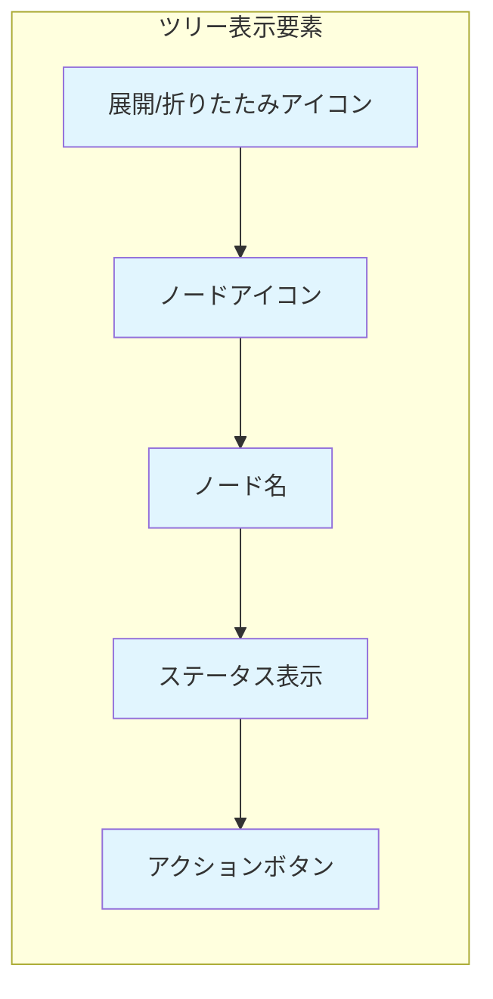

**ツリー行の構成**

| 要素 | 表示 | 機能 | 操作 |
|------|------|------|------|
| **インデント** | 階層の深さに応じたスペース | 階層レベルの視覚化 | - |
| **展開アイコン** | ▶ / ▼ | 子ノードの表示/非表示 | クリックで切り替え |
| **ノードアイコン** | 📁 📄 📊 等 | ノードタイプの識別 | - |
| **ノード名** | テキスト表示 | 項目名 | ダブルクリックで編集 |
| **ステータス** | 色・バッジ表示 | 状態表示 | - |
| **操作メニュー** | ⋮ | コンテキストメニュー | クリックで展開 |

**仮想スクロール対応**

HierarchiDBは、大量のノードでも高速表示できる仮想スクロール技術を採用しています。

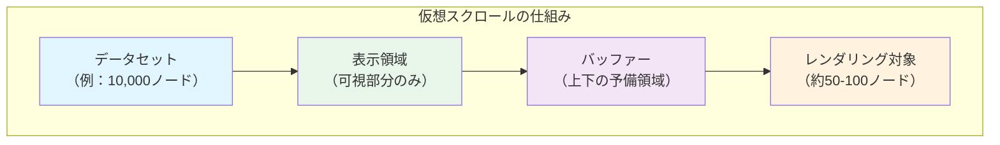

#### 4.2.2 ノード操作 ⭐️⭐️⭐️⭐️⭐️

各ノードに対して実行できる基本操作について説明します。

**基本操作の種類**

| 操作 | 方法 | 結果 | ショートカット |
|------|------|------|----------------|
| **選択** | クリック | ノードが選択状態になる | - |
| **複数選択** | Ctrl+クリック | 複数ノードを選択 | `Ctrl+Click` |
| **範囲選択** | Shift+クリック | 連続範囲を選択 | `Shift+Click` |
| **全選択** | - | 表示中の全ノード選択 | `Ctrl+A` |
| **展開** | ▶アイコンクリック | 子ノードを表示 | `右矢印キー` |
| **折りたたみ** | ▼アイコンクリック | 子ノードを非表示 | `左矢印キー` |

**コンテキストメニュー**

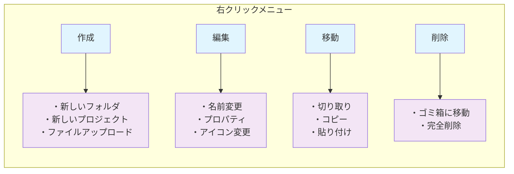

**ドラッグ＆ドロップ操作**

| ドラッグ元 | ドロップ先 | 操作結果 | 制限事項 |
|------------|------------|----------|----------|
| **ノード** | 別のフォルダ | ノードの移動 | 子ノードへの移動不可 |
| **複数ノード** | フォルダ | 一括移動 | 同じ階層内のみ |
| **外部ファイル** | フォルダ | ファイルアップロード | 対応形式のみ |
| **テキスト** | ノード | テキストノード作成 | テキスト形式のみ |

#### 4.2.3 階層ナビゲーション ⭐️⭐️⭐️⭐️⭐️

効率的な階層移動のための機能について説明します。

**ナビゲーション方法**

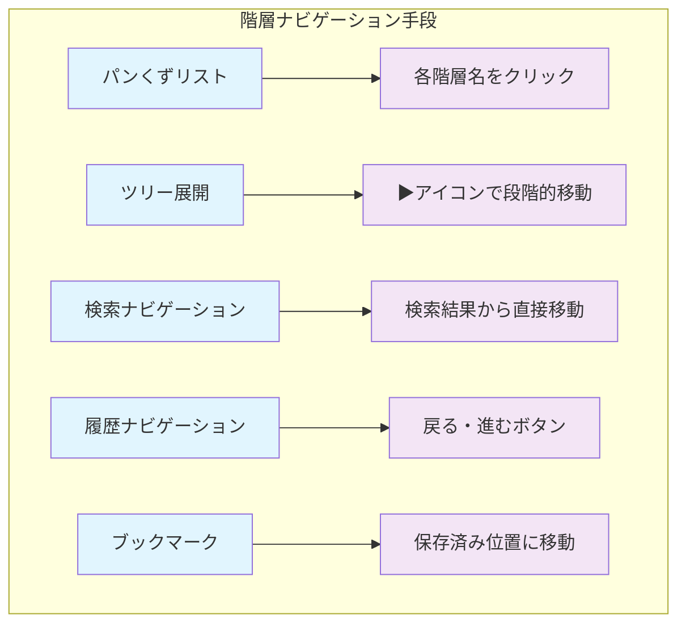

**キーボードナビゲーション**

| キー操作 | 機能 | 対象 |
|----------|------|------|
| `↑` `↓` | 上下移動 | 同階層内 |
| `→` | 展開・子階層移動 | 選択ノード |
| `←` | 折りたたみ・親階層移動 | 選択ノード |
| `Enter` | 詳細表示・編集 | 選択ノード |
| `Space` | チェックボックス切り替え | 選択ノード |
| `Delete` | ゴミ箱に移動 | 選択ノード |
| `F2` | 名前変更 | 選択ノード |

### 4.3 詳細パネル ⭐️⭐️⭐️⭐️

#### 4.3.1 ノード詳細表示 ⭐️⭐️⭐️⭐️⭐️

選択されたノードの詳細情報を表示するパネルです。

**詳細パネルの構成**

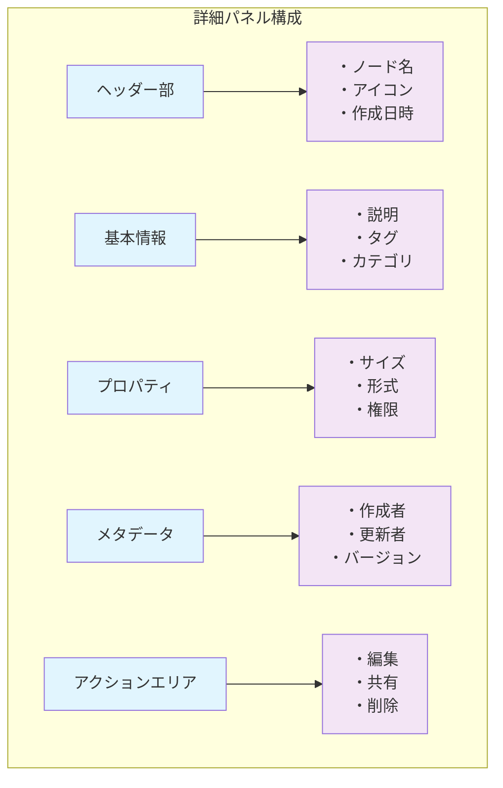

**表示される情報の種類**

| 情報カテゴリ | 項目 | 表示形式 | 編集可否 |
|--------------|------|----------|----------|
| **基本情報** | 名前、説明、タグ | テキスト | ○ |
| **システム情報** | ID、パス、サイズ | 読み取り専用 | × |
| **日時情報** | 作成日時、更新日時 | 日付表示 | × |
| **権限情報** | 所有者、アクセス権限 | アイコン・テキスト | △ |
| **統計情報** | 子ノード数、アクセス回数 | 数値 | × |

#### 4.3.2 プロパティ編集 ⭐️⭐️⭐️⭐️

ノードのプロパティを直接編集できる機能です。

**編集可能なプロパティ**

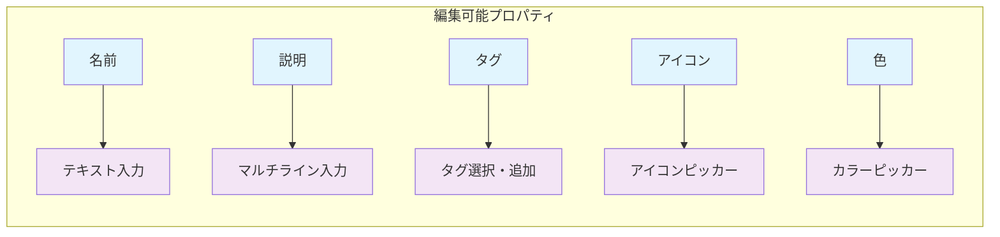

**編集操作の流れ**

| ステップ | 操作 | 画面変化 | 注意点 |
|----------|------|----------|--------|
| 1 | プロパティ項目をクリック | 編集モードに切り替え | 編集権限が必要 |
| 2 | 値を変更 | リアルタイムプレビュー | 検証エラー表示 |
| 3 | Enter または保存ボタン | 変更を確定 | 自動保存 |
| 4 | Escape または キャンセル | 変更を破棄 | 元の値に戻る |

#### 4.3.3 プラグイン機能 ⭐️⭐️⭐️

ノードタイプに応じたプラグイン固有の機能を提供します。

**プラグイン別機能**

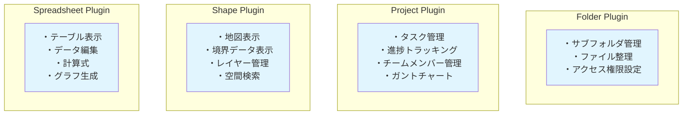

## Chapter 5: 基本操作

この章では、HierarchiDBの日常的な操作方法について詳しく説明します。ナビゲーション操作、ノード管理操作、データ操作の3つのカテゴリに分けて、実践的な手順と効率的な使い方を解説します。これらの基本操作をマスターすることで、HierarchiDBを効果的に活用できるようになります。

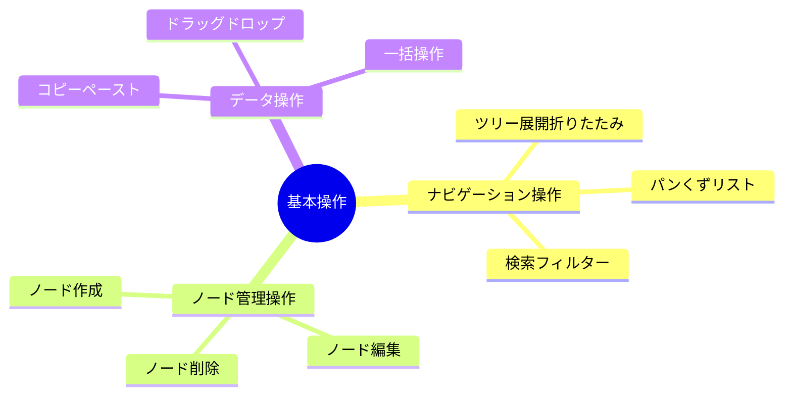

### 5.1 ナビゲーション操作

#### 5.1.1 ツリー展開・折りたたみ

階層構造を効率的に表示・非表示するための操作です。

**展開・折りたたみの方法**

| 操作方法 | 対象 | 結果 | ショートカット |
|----------|------|------|----------------|
| **単一展開** | ▶アイコンクリック | そのノードのみ展開 | `→` |
| **単一折りたたみ** | ▼アイコンクリック | そのノードのみ折りたたみ | `←` |
| **再帰展開** | Shift + ▶アイコン | 子ノードすべて展開 | `Shift + →` |
| **再帰折りたたみ** | Shift + ▼アイコン | 子ノードすべて折りたたみ | `Shift + ←` |
| **全展開** | ツールバー | 表示中すべて展開 | `Ctrl + →` |
| **全折りたたみ** | ツールバー | 表示中すべて折りたたみ | `Ctrl + ←` |

**展開状態の管理**

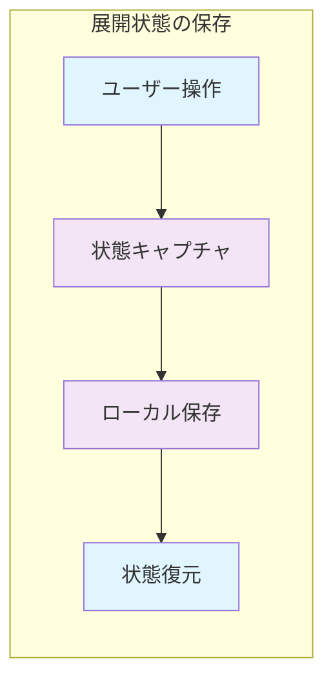

#### 5.1.2 パンくずリスト

現在位置の表示と階層間移動のための機能です。

**パンくずリストの構成**

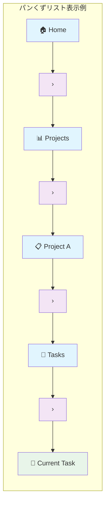

**パンくずリストの機能**

| 要素 | 機能 | 操作 | 表示状態 |
|------|------|------|----------|
| **ルートノード** | ツリーのトップに移動 | クリック | 常に表示 |
| **中間ノード** | 指定階層に移動 | クリック | ホバー時ハイライト |
| **現在ノード** | 現在位置を示す | - | 太字・色変更 |
| **省略表示** | 長いパス時の簡略化 | ホバーで全体表示 | "..." で省略 |

#### 5.1.3 検索・フィルター

大量のデータから目的のノードを効率的に見つけるための機能です。

**検索機能の種類**

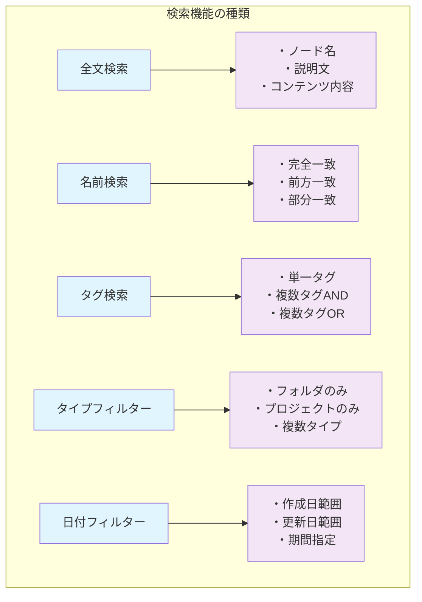

**検索操作の手順**

| ステップ | 操作 | 入力例 | 結果 |
|----------|------|--------|------|
| 1 | 検索バーをクリック | - | カーソル表示・サジェスト表示 |
| 2 | キーワード入力 | "プロジェクト" | インクリメンタル検索実行 |
| 3 | フィルター追加（オプション） | タイプ：Project | 検索結果絞り込み |
| 4 | 検索実行 | Enter キー | 結果一覧表示 |
| 5 | 結果選択 | 項目クリック | 該当ノードに移動 |

### 5.2 ノード管理操作

#### 5.2.1 ノード作成

新しいノードを作成するための操作です。

**作成方法の種類**

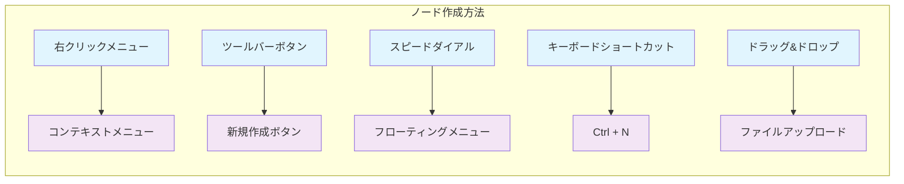

**ノード作成ダイアログ**

| 入力項目 | 必須/任意 | 説明 | 例 |
|----------|-----------|------|-----|
| **ノードタイプ** | 必須 | プラグイン選択 | Folder, Project, Shape |
| **名前** | 必須 | ノード名 | "新しいプロジェクト" |
| **親ノード** | 必須 | 配置場所 | Projects > Active |
| **説明** | 任意 | 詳細説明 | "Webサイト開発プロジェクト" |
| **アイコン** | 任意 | 表示アイコン | 📊 📁 📄 |
| **タグ** | 任意 | 分類タグ | web, development, priority:high |

#### 5.2.2 ノード編集

既存ノードの情報を変更するための操作です。

**編集操作の種類**

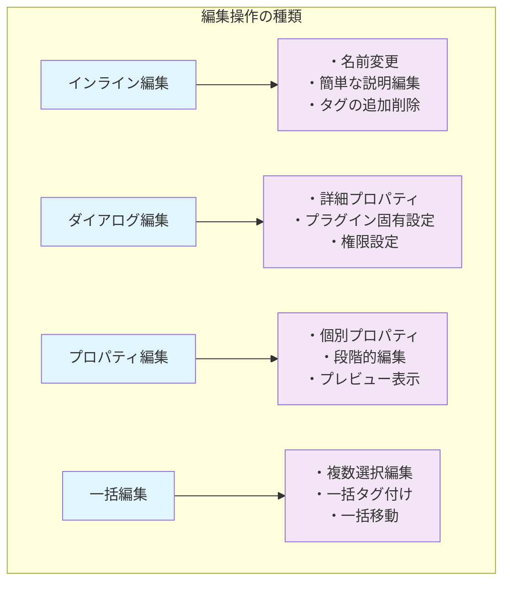

**編集権限と制限**

| 編集内容 | 必要権限 | 制限事項 | 注意点 |
|----------|----------|----------|--------|
| **名前変更** | 編集権限 | 重複チェック | 子ノードとの重複不可 |
| **移動** | 移動権限 | 循環参照防止 | 子ノードへの移動不可 |
| **削除** | 削除権限 | 子ノード存在時警告 | 関連データも削除される |
| **権限変更** | 管理者権限 | 自分の権限は変更不可 | 他ユーザーへの影響 |

#### 5.2.3 ノード削除

不要になったノードを削除するための操作です。

**削除の種類と手順**

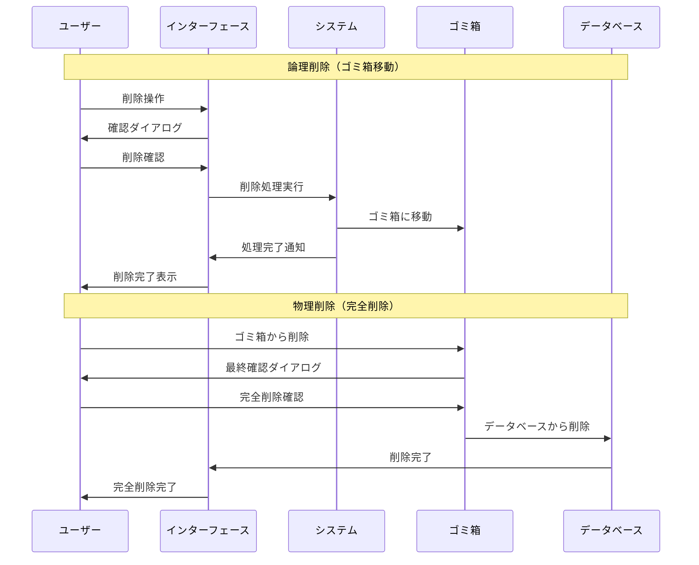

**削除操作の比較**

| 削除種類 | 操作場所 | 復旧可否 | 実行権限 | 確認回数 |
|----------|----------|----------|----------|----------|
| **論理削除** | メインツリー | 可能（ゴミ箱から復元） | 編集権限 | 1回 |
| **物理削除** | ゴミ箱 | 不可能 | 削除権限 | 2回 |
| **一括削除** | 複数選択 | 個別に依存 | 各ノードの権限 | 種類ごと |

### 5.3 データ操作

#### 5.3.1 コピー・ペースト

ノードの複製と移動のための操作です。

**コピー・ペースト操作**

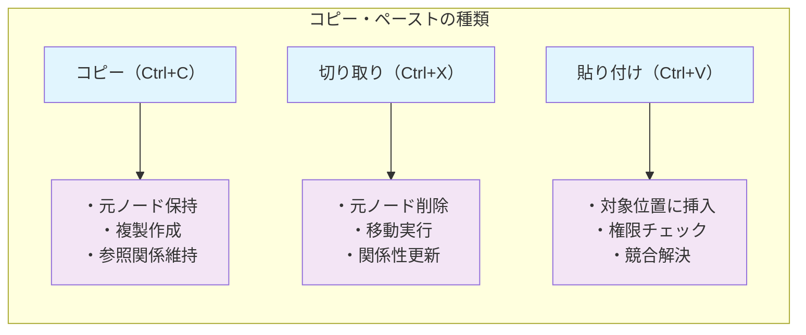

**コピー・ペースト時の考慮事項**

| 項目 | コピー | 切り取り | 注意点 |
|------|--------|----------|--------|
| **元ノード** | 保持 | 削除 | 切り取り後は一時的にグレーアウト |
| **子ノード** | 再帰的にコピー | 一緒に移動 | 大量の子ノードは時間要 |
| **参照関係** | 新しいIDで複製 | IDそのまま移動 | リンク切れに注意 |
| **権限** | コピー先で再設定 | 権限も一緒に移動 | アクセス権限の確認必要 |

#### 5.3.2 ドラッグ＆ドロップ

直感的なマウス操作でノードを移動・整理する機能です。

**ドラッグ＆ドロップの動作**

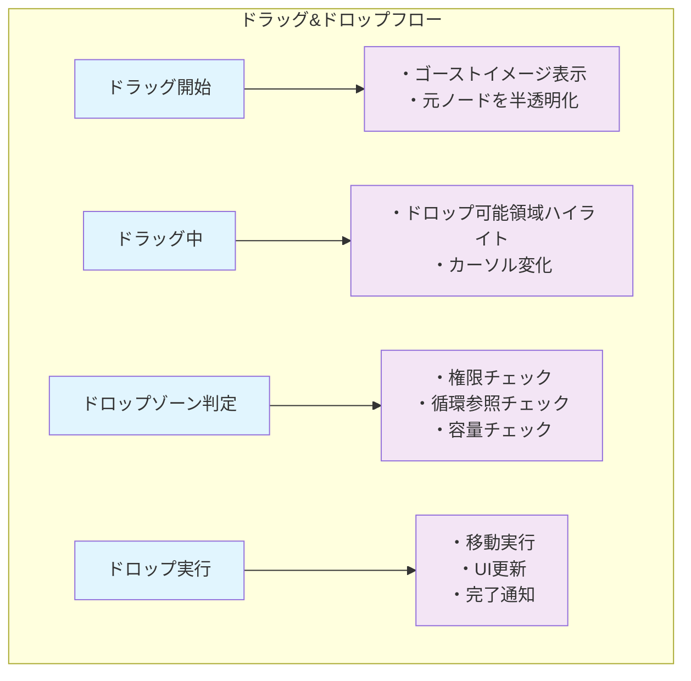

**修飾キーによる動作変更**

| 修飾キー | 動作 | 表示 | 用途 |
|----------|------|------|------|
| **なし** | 移動 | ➜ | 基本の移動操作 |
| **Ctrl** | コピー | ➕ | 複製作成 |
| **Shift** | ショートカット作成 | 🔗 | 参照リンク作成 |
| **Alt** | 強制移動 | ⚠️ | 権限警告を無視 |

#### 5.3.3 一括操作

複数のノードに対して同時に操作を実行する機能です。

**一括操作の種類**

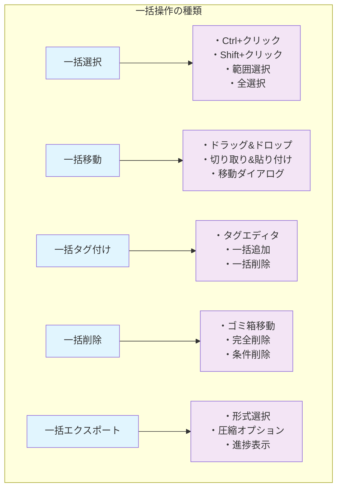

**一括操作時の注意事項**

| 注意項目 | 内容 | 対策 |
|----------|------|------|
| **処理時間** | 大量データは時間がかかる | 進捗表示・中断機能 |
| **権限エラー** | 一部ノードで権限不足 | エラーレポート・部分実行 |
| **容量制限** | ストレージ上限 | 事前チェック・警告表示 |
| **ネットワーク** | 通信エラーの可能性 | リトライ機能・オフライン対応 |

**まとめ**

HierarchiDBの画面構成と基本操作は、直感的でありながら高度な機能を提供しています。ヘッダー、ナビゲーション、メインコンテンツの各エリアが連携し、効率的なデータ管理を実現します。基本操作をマスターすることで、大量のデータも効率的に管理できるようになります。