# 第5部 ユースケースごとの操作

## Chapter 6: プロジェクト管理

この章では、HierarchiDBを使用したプロジェクト管理の具体的な方法について説明します。プロジェクトの作成から設定、タスク・資料管理、チーム共有まで、実際の業務フローに沿った操作手順を詳しく解説します。Project Pluginの機能を活用することで、効率的なプロジェクト運営が可能になります。

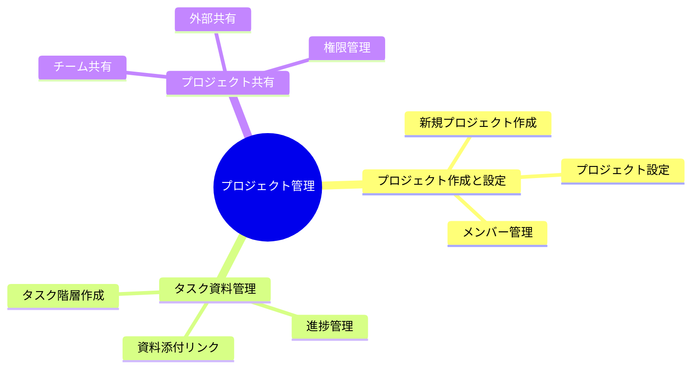
```mermaid
mindmap
  root((プロジェクト管理))
    プロジェクト作成と設定
      新規プロジェクト作成
      プロジェクト設定
      メンバー管理
    タスク資料管理
      タスク階層作成
      資料添付リンク
      進捗管理
    プロジェクト共有
      チーム共有
      外部共有
      権限管理
```

### 6.1 プロジェクト作成と設定

#### 6.1.1 新規プロジェクト作成

Projectツリーで新しいプロジェクトを作成する手順です。

**プロジェクト作成フロー**

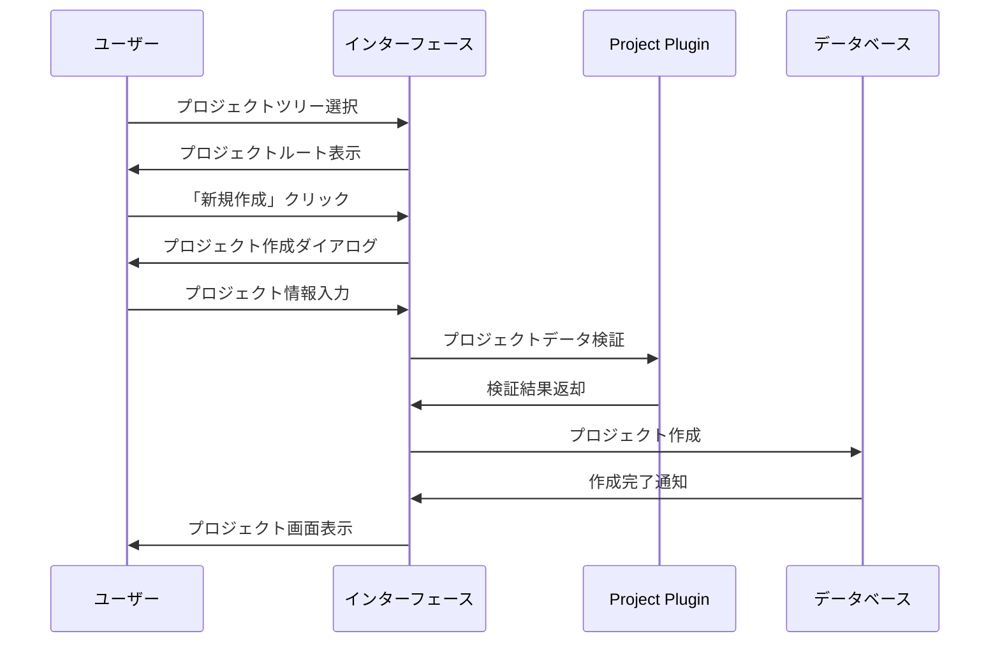
```mermaid
sequenceDiagram
    participant User as ユーザー
    participant UI as インターフェース
    participant ProjectPlugin as Project Plugin
    participant DB as データベース
    
    User->>UI: プロジェクトツリー選択
    UI->>User: プロジェクトルート表示
    User->>UI: 「新規作成」クリック
    UI->>User: プロジェクト作成ダイアログ
    User->>UI: プロジェクト情報入力
    UI->>ProjectPlugin: プロジェクトデータ検証
    ProjectPlugin->>UI: 検証結果返却
    UI->>DB: プロジェクト作成
    DB->>UI: 作成完了通知
    UI->>User: プロジェクト画面表示
```

**プロジェクト作成ダイアログの入力項目**

| 項目 | 必須/任意 | 説明 | 例 |
|------|-----------|------|-----|
| **プロジェクト名** | 必須 | プロジェクトの名称 | "Webサイトリニューアル" |
| **プロジェクトコード** | 必須 | 一意識別子 | "WEB-2024-001" |
| **説明** | 任意 | プロジェクトの概要 | "企業サイトの全面リニューアル" |
| **開始日** | 任意 | プロジェクト開始予定日 | 2024-04-01 |
| **終了日** | 任意 | プロジェクト終了予定日 | 2024-12-31 |
| **ステータス** | 必須 | 初期ステータス | 計画中/進行中/完了 |
| **優先度** | 任意 | プロジェクト優先度 | 高/中/低 |
| **予算** | 任意 | 予算設定 | 5,000,000円 |

**プロジェクト階層構造テンプレート**

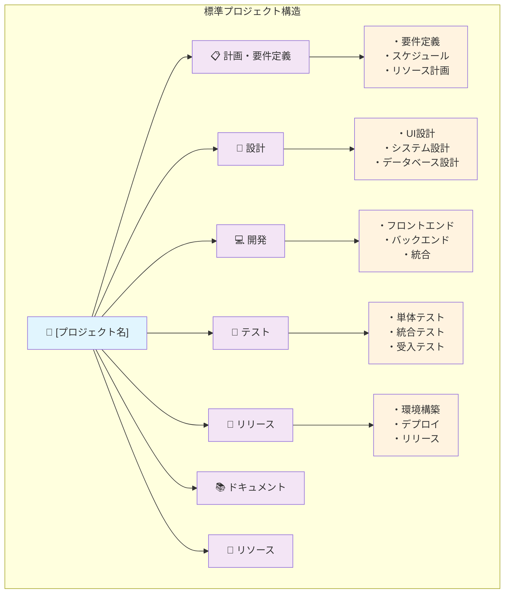
```mermaid
graph TB
    subgraph "標準プロジェクト構造"
        Project["🚀 [プロジェクト名]"]
        
        Planning["📋 計画・要件定義"]
        Design["🎨 設計"]
        Development["💻 開発"]
        Testing["🧪 テスト"]
        Deployment["🚀 リリース"]
        Documentation["📚 ドキュメント"]
        Resources["📁 リソース"]
        
        Project --> Planning
        Project --> Design
        Project --> Development
        Project --> Testing
        Project --> Deployment
        Project --> Documentation
        Project --> Resources
        
        PlanningTasks["・要件定義<br/>・スケジュール<br/>・リソース計画"]
        DesignTasks["・UI設計<br/>・システム設計<br/>・データベース設計"]
        DevTasks["・フロントエンド<br/>・バックエンド<br/>・統合"]
        TestTasks["・単体テスト<br/>・統合テスト<br/>・受入テスト"]
        DeployTasks["・環境構築<br/>・デプロイ<br/>・リリース"]
        
        Planning --> PlanningTasks
        Design --> DesignTasks
        Development --> DevTasks
        Testing --> TestTasks
        Deployment --> DeployTasks
    end
    
    classDef project fill:#e1f5fe
    classDef phase fill:#f3e5f5
    classDef task fill:#fff3e0
    
    class Project project
    class Planning,Design,Development,Testing,Deployment,Documentation,Resources phase
    class PlanningTasks,DesignTasks,DevTasks,TestTasks,DeployTasks task
```

#### 6.1.2 プロジェクト設定

作成したプロジェクトの詳細設定を行います。

**基本設定項目**

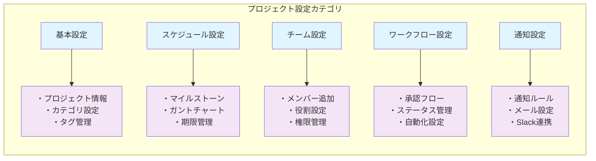
```mermaid
graph LR
    subgraph "プロジェクト設定カテゴリ"
        BasicSettings["基本設定"]
        Schedule["スケジュール設定"]
        Team["チーム設定"]
        Workflow["ワークフロー設定"]
        Notification["通知設定"]
        
        BasicContent["・プロジェクト情報<br/>・カテゴリ設定<br/>・タグ管理"]
        ScheduleContent["・マイルストーン<br/>・ガントチャート<br/>・期限管理"]
        TeamContent["・メンバー追加<br/>・役割設定<br/>・権限管理"]
        WorkflowContent["・承認フロー<br/>・ステータス管理<br/>・自動化設定"]
        NotifyContent["・通知ルール<br/>・メール設定<br/>・Slack連携"]
        
        BasicSettings --> BasicContent
        Schedule --> ScheduleContent
        Team --> TeamContent
        Workflow --> WorkflowContent
        Notification --> NotifyContent
    end
    
    classDef setting fill:#e1f5fe
    classDef content fill:#f3e5f5
    
    class BasicSettings,Schedule,Team,Workflow,Notification setting
    class BasicContent,ScheduleContent,TeamContent,WorkflowContent,NotifyContent content
```

**プロジェクト設定画面**

| 設定カテゴリ | 設定項目 | デフォルト値 | 説明 |
|--------------|----------|--------------|------|
| **表示設定** | ビューモード | ツリービュー | ツリー/ガント/カンバン |
| **表示設定** | 表示項目 | 名前、ステータス、期限 | 表示カラムの選択 |
| **動作設定** | 自動保存 | 有効 | 編集内容の自動保存 |
| **動作設定** | 自動並び替え | 無効 | 期限・優先度による自動ソート |
| **共有設定** | デフォルト権限 | 表示のみ | 新規メンバーの初期権限 |
| **共有設定** | 外部共有 | 無効 | 外部ユーザーとの共有許可 |

#### 6.1.3 メンバー管理

プロジェクトチームのメンバー管理機能です。

**メンバー招待フロー**

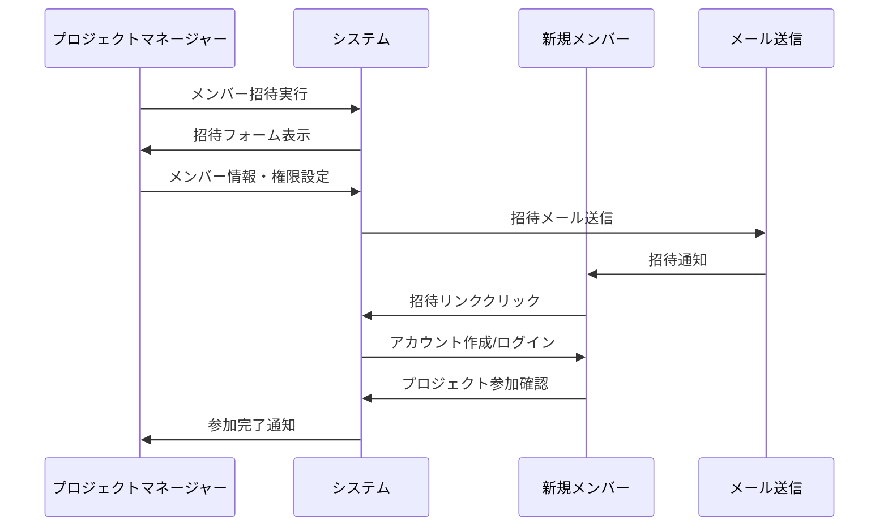
```mermaid
sequenceDiagram
    participant PM as プロジェクトマネージャー
    participant System as システム
    participant NewMember as 新規メンバー
    participant Email as メール送信
    
    PM->>System: メンバー招待実行
    System->>PM: 招待フォーム表示
    PM->>System: メンバー情報・権限設定
    System->>Email: 招待メール送信
    Email->>NewMember: 招待通知
    NewMember->>System: 招待リンククリック
    System->>NewMember: アカウント作成/ログイン
    NewMember->>System: プロジェクト参加確認
    System->>PM: 参加完了通知
```

**メンバー権限レベル**

| 権限レベル | できること | できないこと | 適用対象 |
|------------|------------|--------------|----------|
| **閲覧者** | ・内容表示 ・ファイルダウンロード | ・編集 ・削除 ・メンバー招待 | 外部関係者 |
| **編集者** | ・ノード編集 ・ファイルアップロード ・コメント | ・メンバー管理 ・プロジェクト設定変更 | 一般メンバー |
| **管理者** | ・全操作可能 ・メンバー管理 ・設定変更 | ・プロジェクト削除（オーナーのみ） | リーダー・マネージャー |
| **オーナー** | ・すべての操作 ・プロジェクト削除 ・権限変更 | なし | プロジェクト作成者 |

### 6.2 タスク・資料管理

#### 6.2.1 タスク階層作成

プロジェクト内でのタスク構造を作成・管理します。

**タスク階層の設計パターン**

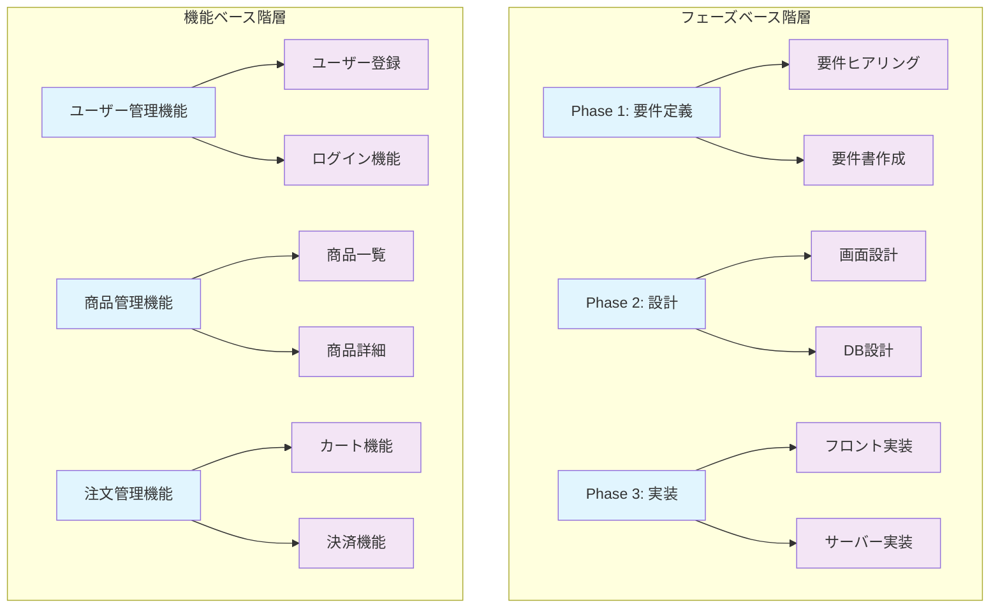
```mermaid
graph TB
    subgraph "フェーズベース階層"
        Phase1["Phase 1: 要件定義"]
        Phase2["Phase 2: 設計"]
        Phase3["Phase 3: 実装"]
        
        Task1_1["要件ヒアリング"]
        Task1_2["要件書作成"]
        Task2_1["画面設計"]
        Task2_2["DB設計"]
        Task3_1["フロント実装"]
        Task3_2["サーバー実装"]
        
        Phase1 --> Task1_1
        Phase1 --> Task1_2
        Phase2 --> Task2_1
        Phase2 --> Task2_2
        Phase3 --> Task3_1
        Phase3 --> Task3_2
    end
    
    subgraph "機能ベース階層"
        Feature1["ユーザー管理機能"]
        Feature2["商品管理機能"]
        Feature3["注文管理機能"]
        
        UserTask1["ユーザー登録"]
        UserTask2["ログイン機能"]
        ProductTask1["商品一覧"]
        ProductTask2["商品詳細"]
        OrderTask1["カート機能"]
        OrderTask2["決済機能"]
        
        Feature1 --> UserTask1
        Feature1 --> UserTask2
        Feature2 --> ProductTask1
        Feature2 --> ProductTask2
        Feature3 --> OrderTask1
        Feature3 --> OrderTask2
    end
    
    classDef phase fill:#e1f5fe
    classDef task fill:#f3e5f5
    
    class Phase1,Phase2,Phase3,Feature1,Feature2,Feature3 phase
    class Task1_1,Task1_2,Task2_1,Task2_2,Task3_1,Task3_2,UserTask1,UserTask2,ProductTask1,ProductTask2,OrderTask1,OrderTask2 task
```

**タスク作成時の入力項目**

| 項目 | 説明 | 例 | 入力形式 |
|------|------|-----|----------|
| **タスク名** | タスクの名称 | "ログイン画面作成" | テキスト |
| **担当者** | 責任者・実施者 | 田中太郎 | メンバー選択 |
| **期限** | 完了予定日 | 2024-05-15 | 日付ピッカー |
| **工数** | 予想作業時間 | 8時間 | 数値入力 |
| **優先度** | タスク優先度 | 高・中・低 | 選択ボタン |
| **ステータス** | 進捗状況 | 未着手/進行中/完了 | ステータス選択 |
| **依存関係** | 前提タスク | "要件定義完了" | タスク選択 |
| **説明** | 詳細内容 | "ログイン機能の画面実装" | マルチラインテキスト |

#### 6.2.2 資料添付・リンク

タスクや成果物に関連する資料を管理します。

**資料管理の種類**

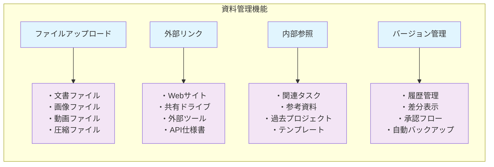
```mermaid
graph LR
    subgraph "資料管理機能"
        FileUpload["ファイルアップロード"]
        LinkAttach["外部リンク"]
        ReferenceNode["内部参照"]
        VersionControl["バージョン管理"]
        
        FileTypes["・文書ファイル<br/>・画像ファイル<br/>・動画ファイル<br/>・圧縮ファイル"]
        LinkTypes["・Webサイト<br/>・共有ドライブ<br/>・外部ツール<br/>・API仕様書"]
        RefTypes["・関連タスク<br/>・参考資料<br/>・過去プロジェクト<br/>・テンプレート"]
        VersionTypes["・履歴管理<br/>・差分表示<br/>・承認フロー<br/>・自動バックアップ"]
        
        FileUpload --> FileTypes
        LinkAttach --> LinkTypes
        ReferenceNode --> RefTypes
        VersionControl --> VersionTypes
    end
    
    classDef management fill:#e1f5fe
    classDef types fill:#f3e5f5
    
    class FileUpload,LinkAttach,ReferenceNode,VersionControl management
    class FileTypes,LinkTypes,RefTypes,VersionTypes types
```

**ファイル添付の操作手順**

| ステップ | 操作 | 画面変化 | 注意点 |
|----------|------|----------|--------|
| 1 | タスクノードを選択 | 詳細パネル表示 | 編集権限確認 |
| 2 | 「ファイル添付」ボタン | ファイル選択ダイアログ | 対応形式確認 |
| 3 | ファイル選択・アップロード | 進捗バー表示 | ファイルサイズ制限 |
| 4 | メタデータ入力 | 情報入力フォーム | 説明・タグ入力 |
| 5 | 保存 | ファイル一覧に追加 | 自動プレビュー生成 |

#### 6.2.3 進捗管理

プロジェクト全体とタスクレベルの進捗を管理します。

**進捗表示の種類**

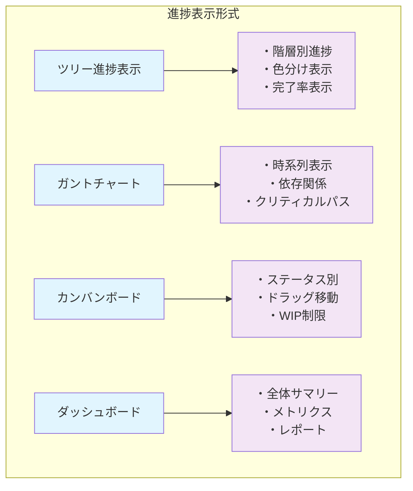
```mermaid
graph TB
    subgraph "進捗表示形式"
        TreeProgress["ツリー進捗表示"]
        GanttChart["ガントチャート"]
        KanbanBoard["カンバンボード"]
        Dashboard["ダッシュボード"]
        
        TreeFeatures["・階層別進捗<br/>・色分け表示<br/>・完了率表示"]
        GanttFeatures["・時系列表示<br/>・依存関係<br/>・クリティカルパス"]
        KanbanFeatures["・ステータス別<br/>・ドラッグ移動<br/>・WIP制限"]
        DashFeatures["・全体サマリー<br/>・メトリクス<br/>・レポート"]
        
        TreeProgress --> TreeFeatures
        GanttChart --> GanttFeatures
        KanbanBoard --> KanbanFeatures
        Dashboard --> DashFeatures
    end
    
    classDef view fill:#e1f5fe
    classDef features fill:#f3e5f5
    
    class TreeProgress,GanttChart,KanbanBoard,Dashboard view
    class TreeFeatures,GanttFeatures,KanbanFeatures,DashFeatures features
```

**進捗計算ロジック**

| 計算レベル | 算出方法 | 表示形式 | 更新タイミング |
|------------|----------|----------|----------------|
| **タスクレベル** | ステータス基準（0%/50%/100%） | プログレスバー | ステータス変更時 |
| **親ノードレベル** | 子タスクの重み付き平均 | 百分率 + バー | 子タスク更新時 |
| **プロジェクトレベル** | 全タスクの完了率 | 総合進捗率 | 任意のタスク更新時 |
| **時系列進捗** | 計画vs実績比較 | バーンダウン | 日次更新 |

### 6.3 プロジェクト共有

#### 6.3.1 チーム共有

プロジェクトチーム内での情報共有機能です。

**チーム共有設定**

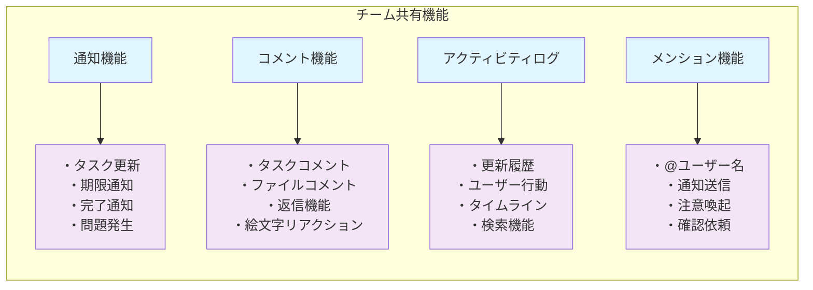
```mermaid
graph LR
    subgraph "チーム共有機能"
        Notification["通知機能"]
        Comment["コメント機能"]
        Activity["アクティビティログ"]
        Mention["メンション機能"]
        
        NotifyTypes["・タスク更新<br/>・期限通知<br/>・完了通知<br/>・問題発生"]
        CommentTypes["・タスクコメント<br/>・ファイルコメント<br/>・返信機能<br/>・絵文字リアクション"]
        ActivityTypes["・更新履歴<br/>・ユーザー行動<br/>・タイムライン<br/>・検索機能"]
        MentionTypes["・@ユーザー名<br/>・通知送信<br/>・注意喚起<br/>・確認依頼"]
        
        Notification --> NotifyTypes
        Comment --> CommentTypes
        Activity --> ActivityTypes
        Mention --> MentionTypes
    end
    
    classDef sharing fill:#e1f5fe
    classDef types fill:#f3e5f5
    
    class Notification,Comment,Activity,Mention sharing
    class NotifyTypes,CommentTypes,ActivityTypes,MentionTypes types
```

**通知設定オプション**

| 通知種類 | 通知タイミング | 通知方法 | 設定レベル |
|----------|----------------|----------|------------|
| **タスク割当** | 担当者設定時 | システム内 + メール | 個人設定 |
| **期限通知** | 期限3日前/当日 | システム内 + メール | プロジェクト設定 |
| **ステータス変更** | 変更時 | システム内のみ | チーム設定 |
| **コメント追加** | コメント投稿時 | システム内 | 個人設定 |
| **ファイル更新** | ファイル更新時 | システム内 | プロジェクト設定 |

#### 6.3.2 外部共有

プロジェクト外のステークホルダーとの共有機能です。

**外部共有の種類**

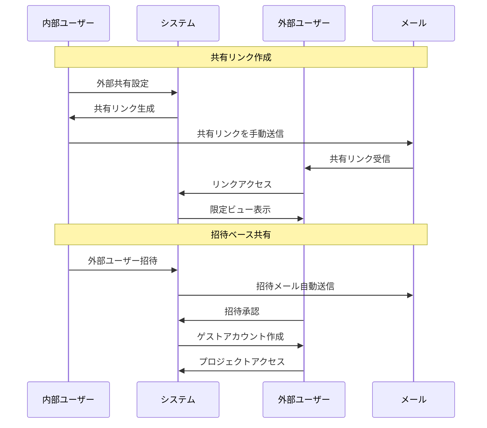
```mermaid
sequenceDiagram
    participant Internal as 内部ユーザー
    participant System as システム
    participant External as 外部ユーザー
    participant Email as メール
    
    Note over Internal,Email: 共有リンク作成
    Internal->>System: 外部共有設定
    System->>Internal: 共有リンク生成
    Internal->>Email: 共有リンクを手動送信
    Email->>External: 共有リンク受信
    External->>System: リンクアクセス
    System->>External: 限定ビュー表示
    
    Note over Internal,Email: 招待ベース共有
    Internal->>System: 外部ユーザー招待
    System->>Email: 招待メール自動送信
    External->>System: 招待承認
    System->>External: ゲストアカウント作成
    External->>System: プロジェクトアクセス
```

**外部共有の制限設定**

| 制限項目 | 設定オプション | デフォルト | 説明 |
|----------|----------------|------------|------|
| **アクセス期間** | 期間指定 | 30日 | リンク有効期限 |
| **表示範囲** | ノード選択 | 公開フォルダのみ | 表示可能な階層 |
| **操作権限** | 読み取り専用/コメント可 | 読み取り専用 | 実行可能な操作 |
| **ダウンロード** | 許可/禁止 | 許可 | ファイルダウンロード |
| **印刷** | 許可/禁止 | 許可 | 画面印刷 |
| **パスワード保護** | あり/なし | なし | アクセス時パスワード |

#### 6.3.3 権限管理

プロジェクト内での詳細な権限制御です。

**権限マトリックス**

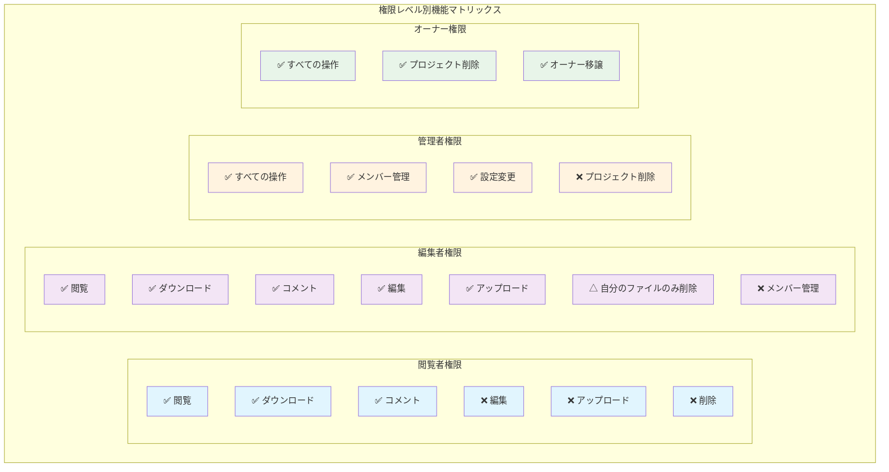
```mermaid
graph TB
    subgraph "権限レベル別機能マトリックス"
        
        subgraph "閲覧者権限"
            View["✅ 閲覧"]
            Download["✅ ダウンロード"]
            Comment["✅ コメント"]
            NoEdit["❌ 編集"]
            NoUpload["❌ アップロード"]
            NoDelete["❌ 削除"]
        end
        
        subgraph "編集者権限"
            EditView["✅ 閲覧"]
            EditDownload["✅ ダウンロード"]
            EditComment["✅ コメント"]
            Edit["✅ 編集"]
            Upload["✅ アップロード"]
            LimitedDelete["△ 自分のファイルのみ削除"]
            NoManage["❌ メンバー管理"]
        end
        
        subgraph "管理者権限"
            AdminAll["✅ すべての操作"]
            ManageMembers["✅ メンバー管理"]
            ManageSettings["✅ 設定変更"]
            NoProjectDelete["❌ プロジェクト削除"]
        end
        
        subgraph "オーナー権限"
            OwnerAll["✅ すべての操作"]
            ProjectDelete["✅ プロジェクト削除"]
            TransferOwnership["✅ オーナー移譲"]
        end
    end
    
    classDef viewer fill:#e1f5fe
    classDef editor fill:#f3e5f5
    classDef admin fill:#fff3e0
    classDef owner fill:#e8f5e9
    
    class View,Download,Comment,NoEdit,NoUpload,NoDelete viewer
    class EditView,EditDownload,EditComment,Edit,Upload,LimitedDelete,NoManage editor
    class AdminAll,ManageMembers,ManageSettings,NoProjectDelete admin
    class OwnerAll,ProjectDelete,TransferOwnership owner
```

## Chapter 7: データ整理・分類

この章では、HierarchiDBを効果的な情報整理ツールとして活用する方法について説明します。フォルダー構造の設計から、コンテンツ管理、整理の効率化まで、体系的なデータ管理のベストプラクティスを提供します。Resourcesツリーを中心とした実践的な整理手法を学べます。

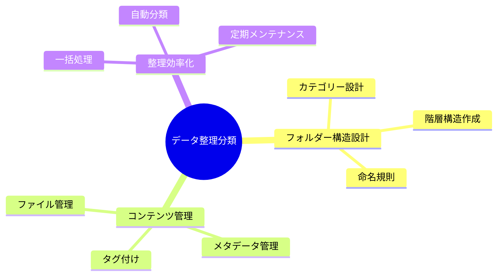
```mermaid
mindmap
  root((データ整理分類))
    フォルダー構造設計
      カテゴリー設計
      階層構造作成
      命名規則
    コンテンツ管理
      ファイル管理
      メタデータ管理
      タグ付け
    整理効率化
      一括処理
      自動分類
      定期メンテナンス
```

### 7.1 フォルダー構造設計

#### 7.1.1 カテゴリー設計

効果的なデータ整理の第一歩は、適切なカテゴリー設計です。

**カテゴリー設計の原則**

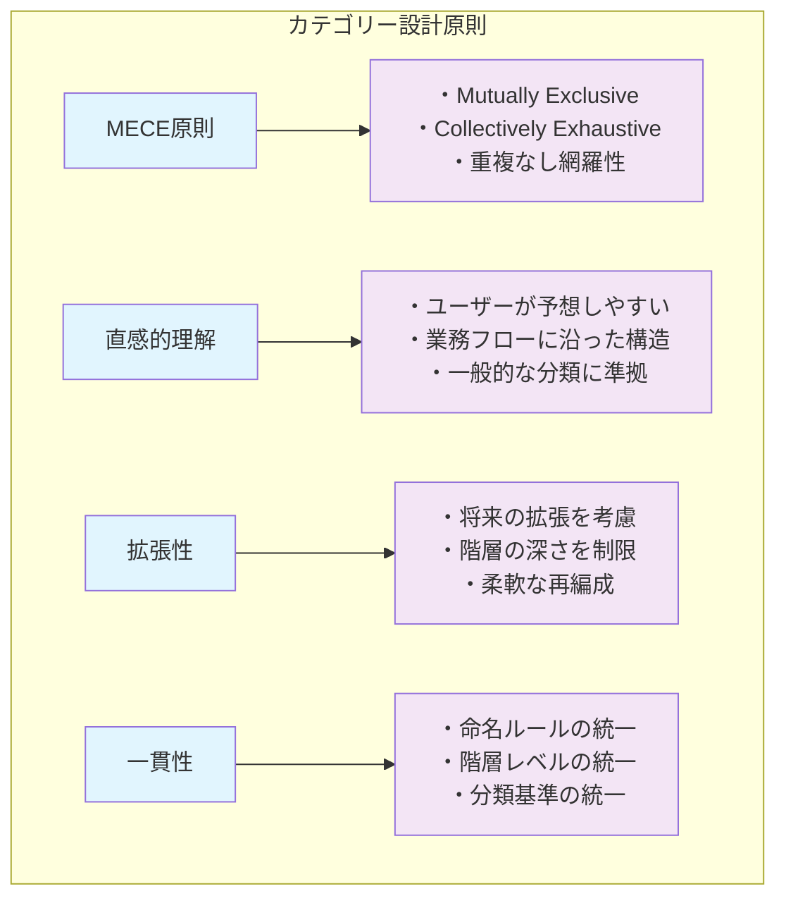
```mermaid
graph TB
    subgraph "カテゴリー設計原則"
        MECE["MECE原則"]
        Intuitive["直感的理解"]
        Scalable["拡張性"]
        Consistent["一貫性"]
        
        MECEDetail["・Mutually Exclusive<br/>・Collectively Exhaustive<br/>・重複なし網羅性"]
        IntuitiveDetail["・ユーザーが予想しやすい<br/>・業務フローに沿った構造<br/>・一般的な分類に準拠"]
        ScalableDetail["・将来の拡張を考慮<br/>・階層の深さを制限<br/>・柔軟な再編成"]
        ConsistentDetail["・命名ルールの統一<br/>・階層レベルの統一<br/>・分類基準の統一"]
        
        MECE --> MECEDetail
        Intuitive --> IntuitiveDetail
        Scalable --> ScalableDetail
        Consistent --> ConsistentDetail
    end
    
    classDef principle fill:#e1f5fe
    classDef detail fill:#f3e5f5
    
    class MECE,Intuitive,Scalable,Consistent principle
    class MECEDetail,IntuitiveDetail,ScalableDetail,ConsistentDetail detail
```

**業務別カテゴリー例**

| 業務分野 | 主要カテゴリー | サブカテゴリー例 |
|----------|----------------|------------------|
| **法務・コンプライアンス** | 契約書、規程、法的文書 | 売買契約/雇用契約/利用規約/就業規則 |
| **人事・総務** | 人事資料、総務文書、オフィス管理 | 採用/評価/研修/備品管理/施設管理 |
| **営業・マーケティング** | 営業資料、マーケティング、顧客情報 | 提案書/パンフレット/顧客データ/競合分析 |
| **技術・開発** | 技術文書、開発資料、システム情報 | 仕様書/設計書/マニュアル/ソースコード |
| **財務・経理** | 財務諸表、経理処理、予算管理 | 決算書/請求書/予算計画/支払い管理 |

#### 7.1.2 階層構造作成

情報の論理的な階層構造を構築します。

**推奨階層構造パターン**

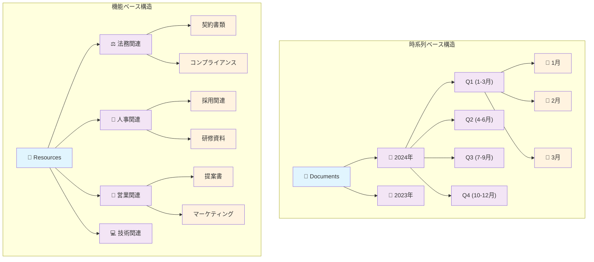
```mermaid
graph TB
    subgraph "時系列ベース構造"
        TimeRoot["📁 Documents"]
        
        Year2024["📅 2024年"]
        Year2023["📅 2023年"]
        
        Q1_2024["Q1 (1-3月)"]
        Q2_2024["Q2 (4-6月)"]
        Q3_2024["Q3 (7-9月)"]
        Q4_2024["Q4 (10-12月)"]
        
        Jan["📄 1月"]
        Feb["📄 2月"]
        Mar["📄 3月"]
        
        TimeRoot --> Year2024
        TimeRoot --> Year2023
        Year2024 --> Q1_2024
        Year2024 --> Q2_2024
        Year2024 --> Q3_2024
        Year2024 --> Q4_2024
        Q1_2024 --> Jan
        Q1_2024 --> Feb
        Q1_2024 --> Mar
    end
    
    subgraph "機能ベース構造"
        FuncRoot["📁 Resources"]
        
        Legal["⚖️ 法務関連"]
        HR["👥 人事関連"]
        Sales["💼 営業関連"]
        Tech["💻 技術関連"]
        
        Contracts["契約書類"]
        Compliance["コンプライアンス"]
        Recruiting["採用関連"]
        Training["研修資料"]
        Proposals["提案書"]
        Marketing["マーケティング"]
        
        FuncRoot --> Legal
        FuncRoot --> HR
        FuncRoot --> Sales
        FuncRoot --> Tech
        Legal --> Contracts
        Legal --> Compliance
        HR --> Recruiting
        HR --> Training
        Sales --> Proposals
        Sales --> Marketing
    end
    
    classDef root fill:#e1f5fe
    classDef category fill:#f3e5f5
    classDef subcategory fill:#fff3e0
    
    class TimeRoot,FuncRoot root
    class Year2024,Year2023,Q1_2024,Q2_2024,Q3_2024,Q4_2024,Legal,HR,Sales,Tech category
    class Jan,Feb,Mar,Contracts,Compliance,Recruiting,Training,Proposals,Marketing subcategory
```

**階層の深さ制限ガイドライン**

| 階層レベル | 推奨名称 | 例 | 注意点 |
|------------|----------|-----|--------|
| **Level 1** | ルートカテゴリ | Documents, Projects | 5-10個程度に抑制 |
| **Level 2** | メインカテゴリ | 法務, 人事, 営業 | 業務領域の大分類 |
| **Level 3** | サブカテゴリ | 契約書, 提案書, 仕様書 | 文書種別の中分類 |
| **Level 4** | 詳細カテゴリ | 売買契約, 雇用契約 | 具体的な分類 |
| **Level 5+** | 個別アイテム | 個別ファイル・フォルダ | 過度の階層は避ける |

#### 7.1.3 命名規則

一貫性のある命名規則により、検索性と管理性を向上させます。

**フォルダ命名規則**

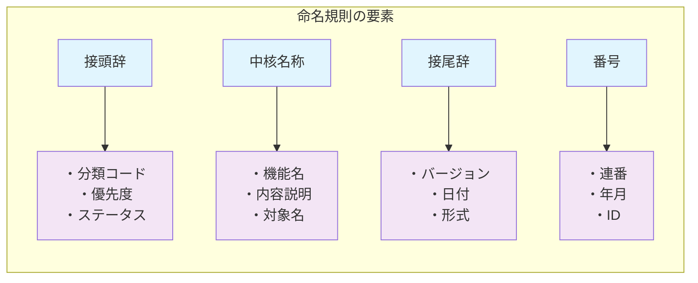
```mermaid
graph LR
    subgraph "命名規則の要素"
        Prefix["接頭辞"]
        Core["中核名称"]
        Suffix["接尾辞"]
        Number["番号"]
        
        PrefixTypes["・分類コード<br/>・優先度<br/>・ステータス"]
        CoreTypes["・機能名<br/>・内容説明<br/>・対象名"]
        SuffixTypes["・バージョン<br/>・日付<br/>・形式"]
        NumberTypes["・連番<br/>・年月<br/>・ID"]
        
        Prefix --> PrefixTypes
        Core --> CoreTypes
        Suffix --> SuffixTypes
        Number --> NumberTypes
    end
    
    classDef element fill:#e1f5fe
    classDef types fill:#f3e5f5
    
    class Prefix,Core,Suffix,Number element
    class PrefixTypes,CoreTypes,SuffixTypes,NumberTypes types
```

**命名規則例**

| 分類 | 命名パターン | 例 | 説明 |
|------|--------------|-----|------|
| **時系列フォルダ** | YYYY-MM | 2024-03, 2024-04 | 年月形式 |
| **プロジェクトフォルダ** | [PRJ]プロジェクト名 | [PRJ]ウェブサイトリニューアル | プロジェクト識別 |
| **部門別フォルダ** | [部門]機能名 | [営業]提案書類, [開発]設計書 | 部門識別 |
| **優先度付きフォルダ** | [P1-P3]名称 | [P1]緊急対応, [P2]通常業務 | 優先度識別 |
| **ステータス付きフォルダ** | [状態]名称 | [進行中]開発案件, [完了]過去案件 | 進捗状態 |

### 7.2 コンテンツ管理

#### 7.2.1 ファイル管理

アップロードされたファイルの効果的な管理方法です。

**ファイル管理機能**

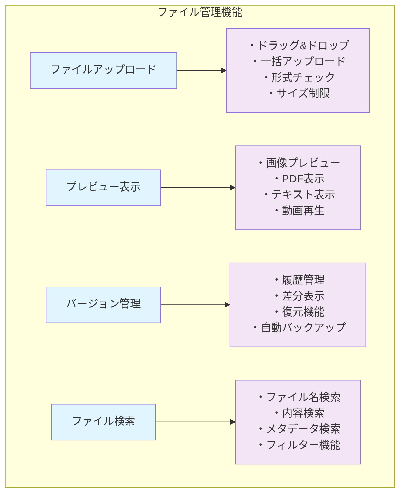
```mermaid
graph TB
    subgraph "ファイル管理機能"
        Upload["ファイルアップロード"]
        Preview["プレビュー表示"]
        Version["バージョン管理"]
        Search["ファイル検索"]
        
        UploadFeatures["・ドラッグ&ドロップ<br/>・一括アップロード<br/>・形式チェック<br/>・サイズ制限"]
        PreviewFeatures["・画像プレビュー<br/>・PDF表示<br/>・テキスト表示<br/>・動画再生"]
        VersionFeatures["・履歴管理<br/>・差分表示<br/>・復元機能<br/>・自動バックアップ"]
        SearchFeatures["・ファイル名検索<br/>・内容検索<br/>・メタデータ検索<br/>・フィルター機能"]
        
        Upload --> UploadFeatures
        Preview --> PreviewFeatures
        Version --> VersionFeatures
        Search --> SearchFeatures
    end
    
    classDef function fill:#e1f5fe
    classDef features fill:#f3e5f5
    
    class Upload,Preview,Version,Search function
    class UploadFeatures,PreviewFeatures,VersionFeatures,SearchFeatures features
```

**ファイル形式別対応**

| ファイル形式 | 拡張子 | プレビュー | 検索対象 | 制限事項 |
|--------------|--------|------------|----------|----------|
| **文書ファイル** | .pdf, .doc, .docx | ○ | ○ | テキスト抽出 |
| **スプレッドシート** | .xls, .xlsx, .csv | ○ | △ | データ部分のみ |
| **画像ファイル** | .jpg, .png, .gif | ○ | × | メタデータのみ |
| **圧縮ファイル** | .zip, .rar | × | × | 中身の確認不可 |
| **動画ファイル** | .mp4, .avi | ○ | × | サムネイルのみ |

#### 7.2.2 メタデータ管理

ファイルやノードに関連する詳細情報の管理です。

**メタデータの種類**

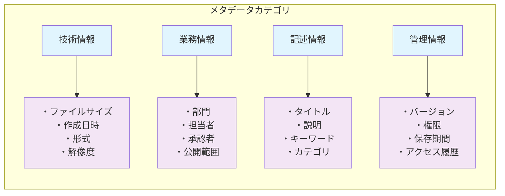
```mermaid
graph LR
    subgraph "メタデータカテゴリ"
        Technical["技術情報"]
        Business["業務情報"]
        Descriptive["記述情報"]
        Administrative["管理情報"]
        
        TechMeta["・ファイルサイズ<br/>・作成日時<br/>・形式<br/>・解像度"]
        BusinessMeta["・部門<br/>・担当者<br/>・承認者<br/>・公開範囲"]
        DescMeta["・タイトル<br/>・説明<br/>・キーワード<br/>・カテゴリ"]
        AdminMeta["・バージョン<br/>・権限<br/>・保存期間<br/>・アクセス履歴"]
        
        Technical --> TechMeta
        Business --> BusinessMeta
        Descriptive --> DescMeta
        Administrative --> AdminMeta
    end
    
    classDef category fill:#e1f5fe
    classDef meta fill:#f3e5f5
    
    class Technical,Business,Descriptive,Administrative category
    class TechMeta,BusinessMeta,DescMeta,AdminMeta meta
```

**メタデータ入力フォーム**

| フィールド名 | 入力形式 | 必須/任意 | 自動入力 |
|-------------|----------|-----------|----------|
| **タイトル** | テキスト | 必須 | ファイル名から |
| **説明** | マルチラインテキスト | 任意 | × |
| **作成者** | ユーザー選択 | 任意 | ログインユーザー |
| **作成日** | 日付 | 任意 | アップロード日時 |
| **部門** | 選択リスト | 任意 | ユーザー所属 |
| **公開レベル** | ラジオボタン | 必須 | 標準設定値 |
| **保存期間** | 数値 + 単位 | 任意 | 組織規定値 |

#### 7.2.3 タグ付け

横断的な分類とカテゴライゼーションのためのタグ機能です。

**タグシステムの設計**

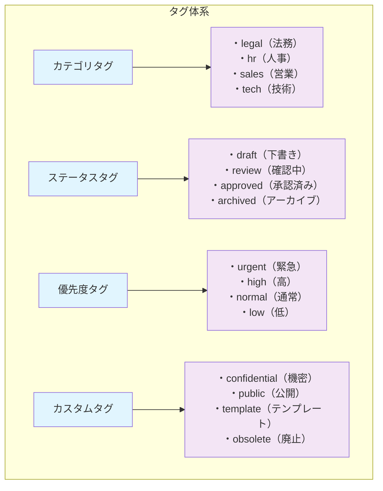
```mermaid
graph TB
    subgraph "タグ体系"
        CategoryTags["カテゴリタグ"]
        StatusTags["ステータスタグ"]
        PriorityTags["優先度タグ"]
        CustomTags["カスタムタグ"]
        
        CategoryExamples["・legal（法務）<br/>・hr（人事）<br/>・sales（営業）<br/>・tech（技術）"]
        StatusExamples["・draft（下書き）<br/>・review（確認中）<br/>・approved（承認済み）<br/>・archived（アーカイブ）"]
        PriorityExamples["・urgent（緊急）<br/>・high（高）<br/>・normal（通常）<br/>・low（低）"]
        CustomExamples["・confidential（機密）<br/>・public（公開）<br/>・template（テンプレート）<br/>・obsolete（廃止）"]
        
        CategoryTags --> CategoryExamples
        StatusTags --> StatusExamples
        PriorityTags --> PriorityExamples
        CustomTags --> CustomExamples
    end
    
    classDef tagtype fill:#e1f5fe
    classDef examples fill:#f3e5f5
    
    class CategoryTags,StatusTags,PriorityTags,CustomTags tagtype
    class CategoryExamples,StatusExamples,PriorityExamples,CustomExamples examples
```

**タグの運用規則**

| 規則 | 内容 | 例 | 効果 |
|------|------|-----|------|
| **一意性** | 同じ意味のタグは統一 | "urgent" vs "緊急" → "urgent"に統一 | 検索精度向上 |
| **階層性** | 親子関係を明確化 | "sales:proposal", "sales:contract" | 体系的分類 |
| **多言語** | 英語ベースで統一 | "legal", "hr", "sales" | 国際化対応 |
| **短縮形** | 簡潔で覚えやすい | "documentation" → "docs" | 入力効率 |
| **色分け** | 重要度で色を統一 | 緊急=赤、重要=黄、通常=緑 | 視覚的識別 |

### 7.3 整理効率化

#### 7.3.1 一括処理

大量のデータを効率的に処理するための機能です。

**一括処理の種類**

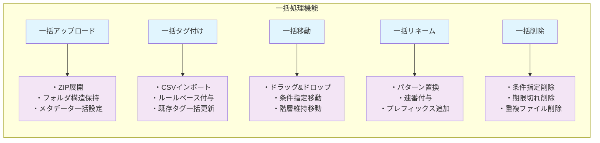
```mermaid
graph LR
    subgraph "一括処理機能"
        BulkUpload["一括アップロード"]
        BulkTag["一括タグ付け"]
        BulkMove["一括移動"]
        BulkRename["一括リネーム"]
        BulkDelete["一括削除"]
        
        UploadProcess["・ZIP展開<br/>・フォルダ構造保持<br/>・メタデータ一括設定"]
        TagProcess["・CSVインポート<br/>・ルールベース付与<br/>・既存タグ一括更新"]
        MoveProcess["・ドラッグ&ドロップ<br/>・条件指定移動<br/>・階層維持移動"]
        RenameProcess["・パターン置換<br/>・連番付与<br/>・プレフィックス追加"]
        DeleteProcess["・条件指定削除<br/>・期限切れ削除<br/>・重複ファイル削除"]
        
        BulkUpload --> UploadProcess
        BulkTag --> TagProcess
        BulkMove --> MoveProcess
        BulkRename --> RenameProcess
        BulkDelete --> DeleteProcess
    end
    
    classDef bulk fill:#e1f5fe
    classDef process fill:#f3e5f5
    
    class BulkUpload,BulkTag,BulkMove,BulkRename,BulkDelete bulk
    class UploadProcess,TagProcess,MoveProcess,RenameProcess,DeleteProcess process
```

**一括処理の実行手順**

| ステップ | 操作 | 確認事項 | リスク対策 |
|----------|------|----------|------------|
| **1. 対象選択** | 複数ノード選択 | 選択数・種類確認 | 意図しない選択の防止 |
| **2. 処理選択** | 一括処理メニューから選択 | 処理内容の確認 | 操作の可逆性確認 |
| **3. パラメータ設定** | 処理詳細の設定 | 設定値の妥当性 | プレビュー機能活用 |
| **4. 事前チェック** | 権限・制約の確認 | エラー項目の確認 | 部分実行の検討 |
| **5. 実行** | 一括処理実行 | 進捗状況の監視 | 中断・ロールバック準備 |
| **6. 結果確認** | 実行結果の検証 | 期待結果との比較 | 必要に応じて修正 |

#### 7.3.2 自動分類

ルールベースでの自動的なファイル分類機能です。

**自動分類ルール**

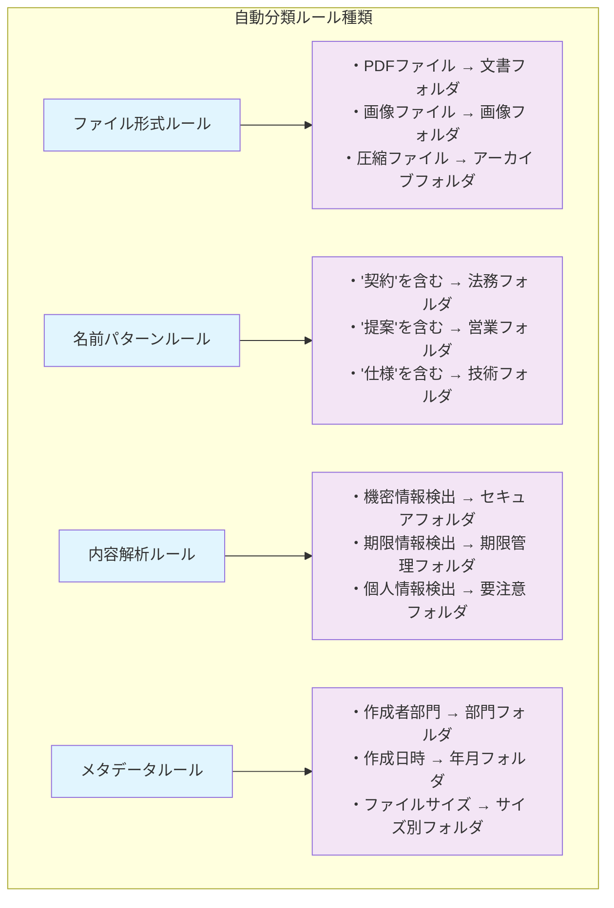
```mermaid
graph TB
    subgraph "自動分類ルール種類"
        FileTypeRule["ファイル形式ルール"]
        NameRule["名前パターンルール"]
        ContentRule["内容解析ルール"]
        MetadataRule["メタデータルール"]
        
        FileExamples["・PDFファイル → 文書フォルダ<br/>・画像ファイル → 画像フォルダ<br/>・圧縮ファイル → アーカイブフォルダ"]
        NameExamples["・'契約'を含む → 法務フォルダ<br/>・'提案'を含む → 営業フォルダ<br/>・'仕様'を含む → 技術フォルダ"]
        ContentExamples["・機密情報検出 → セキュアフォルダ<br/>・期限情報検出 → 期限管理フォルダ<br/>・個人情報検出 → 要注意フォルダ"]
        MetadataExamples["・作成者部門 → 部門フォルダ<br/>・作成日時 → 年月フォルダ<br/>・ファイルサイズ → サイズ別フォルダ"]
        
        FileTypeRule --> FileExamples
        NameRule --> NameExamples
        ContentRule --> ContentExamples
        MetadataRule --> MetadataExamples
    end
    
    classDef rule fill:#e1f5fe
    classDef examples fill:#f3e5f5
    
    class FileTypeRule,NameRule,ContentRule,MetadataRule rule
    class FileExamples,NameExamples,ContentExamples,MetadataExamples examples
```

**自動分類設定画面**

| 設定項目 | 説明 | 設定例 | 実行タイミング |
|----------|------|--------|----------------|
| **トリガー条件** | 自動実行条件 | ファイルアップロード時 | リアルタイム |
| **分類条件** | 判定ルール | ファイル名に"契約"を含む | 条件評価時 |
| **移動先** | 分類先フォルダ | /法務/契約書類 | 条件合致時 |
| **アクション** | 実行内容 | 移動 + タグ付け | 分類実行時 |
| **例外処理** | エラー時の動作 | 元位置に保持 | エラー発生時 |
| **通知設定** | 結果通知 | 管理者にメール通知 | 処理完了時 |

#### 7.3.3 定期メンテナンス

データの品質維持と整理状態の保持のための定期作業です。

**メンテナンス項目**

```mermaid
graph LR
    subgraph "定期メンテナンス"
        Cleanup["データクリーンアップ"]
        Reorganize["構造最適化"]
        Archive["アーカイブ化"]
        Backup["バックアップ"]
        
        CleanupTasks["・重複ファイル削除<br/>・期限切れデータ削除<br/>・未使用タグ削除<br/>・孤立ノード修復"]
        ReorganizeTasks["・階層構造見直し<br/>・命名規則統一<br/>・分類の最適化<br/>・パフォーマンス改善"]
        ArchiveTasks["・古いファイル移動<br/>・完了プロジェクト整理<br/>・保存期間管理<br/>・アクセス頻度分析"]
        BackupTasks["・定期バックアップ<br/>・データ整合性確認<br/>・復旧テスト<br/>・バージョン管理"]
        
        Cleanup --> CleanupTasks
        Reorganize --> ReorganizeTasks
        Archive --> ArchiveTasks
        Backup --> BackupTasks
    end
    
    classDef maintenance fill:#e1f5fe
    classDef tasks fill:#f3e5f5
    
    class Cleanup,Reorganize,Archive,Backup maintenance
    class CleanupTasks,ReorganizeTasks,ArchiveTasks,BackupTasks tasks
```

**メンテナンススケジュール例**

| 頻度 | 作業内容 | 実行時期 | 所要時間 | 担当者 |
|------|----------|----------|----------|--------|
| **毎日** | 自動バックアップ | 深夜2:00 | 30分 | システム自動 |
| **毎週** | 重複ファイルチェック | 日曜午前 | 1時間 | システム管理者 |
| **毎月** | アクセス統計レビュー | 月初 | 2時間 | データ管理者 |
| **四半期** | 構造最適化検討 | 四半期末 | 半日 | チーム全体 |
| **年次** | 全体アーカイブ作業 | 年度末 | 1日 | 全部門協力 |

## Chapter 8: 地理データ管理

この章では、Shape Pluginを使用した地理データの管理と可視化について説明します。地図データの設定から、地理的形状の管理、空間分析まで、GIS（地理情報システム）的な機能を活用したデータ管理の方法を詳しく解説します。

```mermaid
mindmap
  root((地理データ管理))
    地図データの利用
      ベースマップ設定
      レイヤー管理
      地図表示
    地理的形状管理
      Shapeデータ作成
      境界データ管理
      地理情報可視化
    分析と共有
      空間分析
      データエクスポート
      地図共有
```

### 8.1 地図データの利用

#### 8.1.1 ベースマップ設定

地図表示の基盤となるベースマップの設定を行います。

**利用可能ベースマップの種類**

```mermaid
graph TB
    subgraph "ベースマップの種類"
        OSM["OpenStreetMap"]
        Satellite["衛星画像"]
        Terrain["地形図"]
        Custom["カスタムマップ"]
        
        OSMFeatures["・オープンソース<br/>・詳細道路情報<br/>・多言語対応<br/>・無料利用可能"]
        SatelliteFeatures["・高解像度画像<br/>・最新の状況<br/>・建物・植生確認<br/>・有料サービス"]
        TerrainFeatures["・標高データ<br/>・等高線表示<br/>・地形の起伏<br/>・アウトドア用途"]
        CustomFeatures["・組織専用地図<br/>・特殊用途対応<br/>・独自データ統合<br/>・高度なカスタマイズ"]
        
        OSM --> OSMFeatures
        Satellite --> SatelliteFeatures
        Terrain --> TerrainFeatures
        Custom --> CustomFeatures
    end
    
    classDef basemap fill:#e1f5fe
    classDef features fill:#f3e5f5
    
    class OSM,Satellite,Terrain,Custom basemap
    class OSMFeatures,SatelliteFeatures,TerrainFeatures,CustomFeatures features
```

**ベースマップ設定項目**

| 設定項目 | 説明 | 設定値例 | 注意事項 |
|----------|------|----------|----------|
| **地図タイプ** | ベースマップの種類 | OpenStreetMap | 利用規約要確認 |
| **URL テンプレート** | タイル画像のURL | `https://tile.openstreetmap.org/{z}/{x}/{y}.png` | {x},{y},{z}必須 |
| **最大ズームレベル** | 拡大可能倍率 | 18 | データ提供者の制限 |
| **属性情報** | クレジット表記 | "© OpenStreetMap contributors" | 著作権表示義務 |
| **利用制限** | アクセス制限 | 1000リクエスト/日 | 過度な利用は禁止 |

#### 8.1.2 レイヤー管理

地図上に表示する情報の階層管理です。

**レイヤーの種類**

```mermaid
graph LR
    subgraph "地図レイヤー構成"
        BaseLayer["ベースレイヤー"]
        VectorLayer["ベクターレイヤー"]
        RasterLayer["ラスターレイヤー"]
        OverlayLayer["オーバーレイレイヤー"]
        
        BaseContent["・ベースマップ<br/>・背景地図<br/>・地形情報"]
        VectorContent["・行政境界<br/>・道路網<br/>・建物形状<br/>・ポイント情報"]
        RasterContent["・衛星画像<br/>・航空写真<br/>・気象データ<br/>・標高データ"]
        OverlayContent["・注釈<br/>・マーカー<br/>・測定結果<br/>・一時情報"]
        
        BaseLayer --> BaseContent
        VectorLayer --> VectorContent
        RasterLayer --> RasterContent
        OverlayLayer --> OverlayContent
    end
    
    classDef layer fill:#e1f5fe
    classDef content fill:#f3e5f5
    
    class BaseLayer,VectorLayer,RasterLayer,OverlayLayer layer
    class BaseContent,VectorContent,RasterContent,OverlayContent content
```

**レイヤー操作**

| 操作 | 方法 | 効果 | ショートカット |
|------|------|------|----------------|
| **表示/非表示** | チェックボックス | レイヤーの可視性切替 | - |
| **透明度調整** | スライダー | レイヤーの透明度変更 | - |
| **順序変更** | ドラッグ&ドロップ | レイヤーの重ね順変更 | - |
| **ズーム連動** | 設定チェック | ズームレベルで表示制御 | - |
| **スタイル変更** | スタイル設定 | 色・線幅・シンボル変更 | - |

#### 8.1.3 地図表示

インタラクティブな地図表示機能です。

**地図ナビゲーション**

```mermaid
graph TB
    subgraph "地図操作機能"
        Pan["パン（移動）"]
        Zoom["ズーム"]
        Rotate["回転"]
        Measure["計測"]
        
        PanMethods["・マウスドラッグ<br/>・キーボード矢印<br/>・ナビゲーションパッド"]
        ZoomMethods["・マウスホイール<br/>・ダブルクリック<br/>・ズームボタン<br/>・範囲指定ズーム"]
        RotateMethods["・Shift+ドラッグ<br/>・回転ボタン<br/>・角度入力"]
        MeasureMethods["・距離測定<br/>・面積測定<br/>・角度測定<br/>・座標表示"]
        
        Pan --> PanMethods
        Zoom --> ZoomMethods
        Rotate --> RotateMethods
        Measure --> MeasureMethods
    end
    
    classDef operation fill:#e1f5fe
    classDef methods fill:#f3e5f5
    
    class Pan,Zoom,Rotate,Measure operation
    class PanMethods,ZoomMethods,RotateMethods,MeasureMethods methods
```

### 8.2 地理的形状管理

#### 8.2.1 Shape データ作成

地理的な形状データの作成と編集機能です。

**Shape データの作成方法**

| 作成方法 | 説明 | 適用場面 | データ形式 |
|----------|------|----------|------------|
| **手動描画** | 地図上でポリゴン描画 | カスタム境界作成 | GeoJSON |
| **ファイルインポート** | Shapefileアップロード | 既存GISデータ利用 | .shp, .kml, .gpx |
| **座標入力** | 座標値の直接入力 | 正確な位置指定 | 緯度経度 |
| **外部API連携** | 地理データサービス連携 | 行政境界等の標準データ | API レスポンス |

**Shape データ作成ダイアログ**

```mermaid
sequenceDiagram
    participant User as ユーザー
    participant UI as 地図インターフェース
    participant DrawTool as 描画ツール
    participant Validator as データ検証
    participant Storage as データ保存
    
    User->>UI: Shape作成開始
    UI->>DrawTool: 描画モード開始
    User->>DrawTool: 地図上でポリゴン描画
    DrawTool->>UI: 座標データ生成
    UI->>User: プロパティ入力フォーム
    User->>UI: 名前・説明等入力
    UI->>Validator: データ検証
    Validator->>UI: 検証結果
    UI->>Storage: Shapeデータ保存
    Storage->>UI: 保存完了通知
    UI->>User: 作成完了表示
```

#### 8.2.2 境界データ管理

行政境界や特定エリアの境界データ管理です。

**境界データの階層管理**

```mermaid
graph TB
    subgraph "境界データの階層構造"
        Country["国境"]
        Prefecture["都道府県境"]
        City["市区町村境"]
        District["地区・町境"]
        Custom["カスタム境界"]
        
        CountryData["・国際境界<br/>・海岸線<br/>・主要河川"]
        PrefectureData["・都道府県界<br/>・県庁所在地<br/>・主要都市"]
        CityData["・市区町村界<br/>・役所位置<br/>・人口データ"]
        DistrictData["・町丁目境界<br/>・郵便番号区域<br/>・選挙区"]
        CustomData["・営業エリア<br/>・配送範囲<br/>・影響区域"]
        
        Country --> CountryData
        Prefecture --> PrefectureData
        City --> CityData
        District --> DistrictData
        Custom --> CustomData
    end
    
    classDef boundary fill:#e1f5fe
    classDef data fill:#f3e5f5
    
    class Country,Prefecture,City,District,Custom boundary
    class CountryData,PrefectureData,CityData,DistrictData,CustomData data
```

**境界データの属性管理**

| 属性カテゴリ | 属性名 | データ型 | 例 |
|--------------|--------|----------|-----|
| **識別情報** | ID, コード, 名称 | 文字列/数値 | "JP-13", "東京都" |
| **地理情報** | 面積, 周囲長, 中心点 | 数値, 座標 | 2,194 km², (35.676, 139.650) |
| **統計情報** | 人口, 世帯数, 人口密度 | 数値 | 13,960,236人 |
| **管理情報** | 作成日, 更新日, 精度 | 日付, 数値 | 2024-01-01, ±10m |

#### 8.2.3 地理情報可視化

地理データの効果的な可視化手法です。

**可視化手法**

```mermaid
graph LR
    subgraph "地理情報可視化手法"
        Choropleth["コロプレス図"]
        Symbols["シンボル表示"]
        Heatmap["ヒートマップ"]
        Flow["フロー表示"]
        
        ChoroplethDesc["・色分け表示<br/>・統計値の可視化<br/>・比較分析<br/>・密度表現"]
        SymbolsDesc["・アイコン表示<br/>・サイズ変更<br/>・属性表現<br/>・カテゴリ分類"]
        HeatmapDesc["・密度表示<br/>・集積の可視化<br/>・ホットスポット<br/>・グラデーション"]
        FlowDesc["・移動表現<br/>・関係性表示<br/>・流量表現<br/>・ネットワーク"]
        
        Choropleth --> ChoroplethDesc
        Symbols --> SymbolsDesc
        Heatmap --> HeatmapDesc
        Flow --> FlowDesc
    end
    
    classDef visualization fill:#e1f5fe
    classDef description fill:#f3e5f5
    
    class Choropleth,Symbols,Heatmap,Flow visualization
    class ChoroplethDesc,SymbolsDesc,HeatmapDesc,FlowDesc description
```

### 8.3 分析と共有

#### 8.3.1 空間分析

地理データを活用した空間的な分析機能です。

**空間分析機能**

| 分析機能 | 説明 | 入力データ | 出力結果 |
|----------|------|------------|----------|
| **バッファー分析** | 指定距離内の範囲作成 | ポイント/ライン + 距離 | ポリゴン境界 |
| **オーバーレイ分析** | 複数図形の重ね合わせ | 複数ポリゴン | 交差/結合領域 |
| **近接分析** | 最近隣の検索 | ポイント群 | 距離・方向情報 |
| **密度分析** | 分布密度の計算 | ポイント群 | 密度サーフェス |
| **ネットワーク分析** | 経路・到達圏分析 | 道路ネットワーク | 最短経路・所要時間 |

#### 8.3.2 データエクスポート

地理データの外部出力機能です。

**エクスポート形式**

```mermaid
graph TB
    subgraph "エクスポート形式"
        Shapefile["Shapefile"]
        GeoJSON["GeoJSON"]
        KML["KML/KMZ"]
        CSV["CSV"]
        Image["画像出力"]
        
        ShapefileDesc["・GIS標準形式<br/>・複数ファイル構成<br/>・属性データ含む<br/>・.shp, .dbf, .shx"]
        GeoJSONDesc["・Web標準形式<br/>・JSON形式<br/>・軽量・可読性<br/>・API連携適"]
        KMLDesc["・Google Earth対応<br/>・XML形式<br/>・3D表示対応<br/>・Web表示"]
        CSVDesc["・属性データのみ<br/>・座標情報含む<br/>・Excel対応<br/>・統計分析用"]
        ImageDesc["・PNG/JPEG<br/>・印刷用高解像度<br/>・プレゼン資料<br/>・Web掲載用"]
        
        Shapefile --> ShapefileDesc
        GeoJSON --> GeoJSONDesc
        KML --> KMLDesc
        CSV --> CSVDesc
        Image --> ImageDesc
    end
    
    classDef format fill:#e1f5fe
    classDef description fill:#f3e5f5
    
    class Shapefile,GeoJSON,KML,CSV,Image format
    class ShapefileDesc,GeoJSONDesc,KMLDesc,CSVDesc,ImageDesc description
```

#### 8.3.3 地図共有

作成した地図の共有とアクセス制御です。

**共有オプション**

| 共有方法 | アクセス制御 | 用途 | 機能制限 |
|----------|--------------|------|----------|
| **公開リンク** | なし | 一般公開 | 閲覧のみ |
| **パスワード保護** | パスワード認証 | 限定公開 | 閲覧のみ |
| **ユーザー招待** | アカウントベース | チーム共有 | 編集可能 |
| **埋め込みコード** | ドメイン制限 | Webサイト埋込 | 閲覧・基本操作 |
| **API提供** | APIキー認証 | システム連携 | データアクセス |

## Chapter 9: 表形式データ管理

この章では、Spreadsheet Pluginを使用した表形式データの管理について説明します。スプレッドシート形式での データ作成から分析、活用まで、表形式データを効果的に管理するための機能と操作方法を詳しく解説します。

```mermaid
mindmap
  root((表形式データ管理))
    スプレッドシート作成
      テーブル設計
      データ入力
      書式設定
    データ分析
      集計計算
      フィルタリング
      ソート
    データ活用
      グラフ作成
      レポート生成
      データ連携
```

### 9.1 スプレッドシート作成

#### 9.1.1 テーブル設計

効率的なデータ管理のためのテーブル構造設計です。

**テーブル設計の原則**

```mermaid
graph TB
    subgraph "テーブル設計原則"
        Normalization["正規化"]
        DataTypes["データ型定義"]
        Validation["入力検証"]
        Indexing["インデックス設計"]
        
        NormDetail["・重複排除<br/>・関係性明確化<br/>・更新異常防止<br/>・保守性向上"]
        TypeDetail["・数値/文字列/日付<br/>・制約条件<br/>・デフォルト値<br/>・NULL許可"]
        ValidDetail["・入力範囲制限<br/>・形式チェック<br/>・必須項目設定<br/>・一意性制約"]
        IndexDetail["・検索高速化<br/>・ソート最適化<br/>・パフォーマンス向上<br/>・メモリ効率"]
        
        Normalization --> NormDetail
        DataTypes --> TypeDetail
        Validation --> ValidDetail
        Indexing --> IndexDetail
    end
    
    classDef principle fill:#e1f5fe
    classDef detail fill:#f3e5f5
    
    class Normalization,DataTypes,Validation,Indexing principle
    class NormDetail,TypeDetail,ValidDetail,IndexDetail detail
```

**列設計のベストプラクティス**

| 設計項目 | 推奨事項 | 例 | 避けるべき点 |
|----------|----------|-----|--------------|
| **列名** | 短く明確で英数字 | product_name, price, created_at | 空白・特殊文字・長すぎる名前 |
| **データ型** | 適切な型を選択 | 数値→Number, 日付→Date | すべてText型での統一 |
| **必須項目** | 業務上必須なもののみ | ID, 名前, 作成日 | 過度な必須項目設定 |
| **デフォルト値** | 適切な初期値設定 | ステータス→"draft", 数量→0 | 無意味なデフォルト値 |
| **制約条件** | ビジネスルールを反映 | 価格 > 0, 日付 ≥ 今日 | 制約なしでの運用 |

#### 9.1.2 データ入力

効率的なデータ入力機能と操作方法です。

**データ入力方法**

```mermaid
graph LR
    subgraph "データ入力手段"
        Manual["手動入力"]
        Import["インポート"]
        Formula["数式入力"]
        Copy["コピー&ペースト"]
        Bulk["一括入力"]
        
        ManualFeatures["・セル編集<br/>・フォーム入力<br/>・ドロップダウン<br/>・バリデーション"]
        ImportFeatures["・CSVインポート<br/>・Excelインポート<br/>・データベース連携<br/>・API取得"]
        FormulaFeatures["・関数使用<br/>・計算式<br/>・参照<br/>・条件式"]
        CopyFeatures["・外部データ<br/>・範囲コピー<br/>・形式選択<br/>・変換貼付"]
        BulkFeatures["・パターン入力<br/>・連続データ<br/>・一括変更<br/>・テンプレート"]
        
        Manual --> ManualFeatures
        Import --> ImportFeatures
        Formula --> FormulaFeatures
        Copy --> CopyFeatures
        Bulk --> BulkFeatures
    end
    
    classDef input fill:#e1f5fe
    classDef features fill:#f3e5f5
    
    class Manual,Import,Formula,Copy,Bulk input
    class ManualFeatures,ImportFeatures,FormulaFeatures,CopyFeatures,BulkFeatures features
```

**入力支援機能**

| 機能 | 説明 | 操作方法 | 効果 |
|------|------|----------|------|
| **オートコンプリート** | 過去入力値からの候補表示 | 文字入力時に自動表示 | 入力速度向上 |
| **データ検証** | 入力値の妥当性チェック | 設定した条件での自動検証 | データ品質確保 |
| **ドロップダウンリスト** | 選択肢からの選択入力 | セルクリックでリスト表示 | 入力ミス防止 |
| **連続データ入力** | パターンベースの自動入力 | 範囲選択してフィル | 作業効率化 |
| **数式コピー** | 相対/絶対参照での数式複製 | 数式セルのコピー&ペースト | 計算の自動化 |

#### 9.1.3 書式設定

データの視認性向上のための書式設定機能です。

**書式設定の種類**

```mermaid
graph TB
    subgraph "書式設定カテゴリ"
        CellFormat["セル書式"]
        FontFormat["フォント"]
        BorderFormat["境界線"]
        ColorFormat["色・背景"]
        AlignFormat["配置"]
        
        CellOptions["・数値形式<br/>・日付形式<br/>・通貨形式<br/>・パーセント"]
        FontOptions["・フォント種類<br/>・サイズ<br/>・スタイル<br/>・色"]
        BorderOptions["・線種<br/>・太さ<br/>・色<br/>・スタイル"]
        ColorOptions["・セル背景色<br/>・文字色<br/>・グラデーション<br/>・パターン"]
        AlignOptions["・水平配置<br/>・垂直配置<br/>・テキスト回転<br/>・折り返し"]
        
        CellFormat --> CellOptions
        FontFormat --> FontOptions
        BorderFormat --> BorderOptions
        ColorFormat --> ColorOptions
        AlignFormat --> AlignOptions
    end
    
    classDef format fill:#e1f5fe
    classDef options fill:#f3e5f5
    
    class CellFormat,FontFormat,BorderFormat,ColorFormat,AlignFormat format
    class CellOptions,FontOptions,BorderOptions,ColorOptions,AlignOptions options
```

### 9.2 データ分析

#### 9.2.1 集計・計算

データの集計と分析のための計算機能です。

**集計関数の種類**

| 関数カテゴリ | 主要関数 | 用途 | 例 |
|-------------|----------|------|-----|
| **統計関数** | SUM, AVERAGE, COUNT | 基本統計 | `=SUM(A1:A10)` |
| **条件付き集計** | SUMIF, COUNTIF | 条件指定集計 | `=SUMIF(B:B,">100",C:C)` |
| **検索・参照** | VLOOKUP, INDEX, MATCH | データ検索 | `=VLOOKUP(A2,D:E,2,FALSE)` |
| **日付・時間** | TODAY, YEAR, DATEDIF | 日付計算 | `=DATEDIF(A2,TODAY(),"Y")` |
| **文字列** | CONCATENATE, LEFT, MID | 文字列操作 | `=CONCATENATE(A2," ",B2)` |
| **論理関数** | IF, AND, OR | 条件判定 | `=IF(A2>100,"高","低")` |

#### 9.2.2 フィルタリング

データの絞り込みと条件指定表示機能です。

**フィルタリング機能**

```mermaid
graph LR
    subgraph "フィルタリング機能"
        AutoFilter["オートフィルタ"]
        CustomFilter["カスタムフィルタ"]
        AdvancedFilter["詳細フィルタ"]
        SlicerFilter["スライサー"]
        
        AutoFeatures["・ドロップダウン選択<br/>・チェックボックス<br/>・テキスト検索<br/>・数値範囲"]
        CustomFeatures["・複数条件組合せ<br/>・AND/OR演算<br/>・比較演算子<br/>・ワイルドカード"]
        AdvancedFeatures["・複雑条件設定<br/>・計算結果利用<br/>・他テーブル参照<br/>・動的条件"]
        SlicerFeatures["・視覚的操作<br/>・複数項目連動<br/>・ボタン形式<br/>・リアルタイム"]
        
        AutoFilter --> AutoFeatures
        CustomFilter --> CustomFeatures
        AdvancedFilter --> AdvancedFeatures
        SlicerFilter --> SlicerFeatures
    end
    
    classDef filter fill:#e1f5fe
    classDef features fill:#f3e5f5
    
    class AutoFilter,CustomFilter,AdvancedFilter,SlicerFilter filter
    class AutoFeatures,CustomFeatures,AdvancedFeatures,SlicerFeatures features
```

#### 9.2.3 ソート

データの並び替え機能です。

**ソート機能の種類**

| ソート種類 | 説明 | 操作方法 | 適用場面 |
|------------|------|----------|----------|
| **単一キーソート** | 1つの列での並び替え | 列ヘッダクリック | 基本的な並び替え |
| **複数キーソート** | 複数条件での並び替え | ソートダイアログ使用 | 階層的な並び替え |
| **カスタムソート** | ユーザー定義順序 | カスタムリスト使用 | 月名、曜日等の順序 |
| **条件付きソート** | 条件に応じた並び替え | フィルタと組み合わせ | 特定条件下でのソート |

### 9.3 データ活用

#### 9.3.1 グラフ作成

データの可視化のためのグラフ作成機能です。

**グラフの種類と用途**

```mermaid
graph TB
    subgraph "グラフの種類"
        ColumnChart["縦棒グラフ"]
        LineChart["線グラフ"]
        PieChart["円グラフ"]
        ScatterChart["散布図"]
        AreaChart["面グラフ"]
        
        ColumnUse["・カテゴリ比較<br/>・時系列比較<br/>・ランキング表示<br/>・実績対比"]
        LineUse["・時系列変化<br/>・トレンド分析<br/>・推移表示<br/>・予測線"]
        PieUse["・構成比表示<br/>・シェア表示<br/>・割合表現<br/>・全体に対する比率"]
        ScatterUse["・相関関係<br/>・分布状況<br/>・クラスター分析<br/>・外れ値検出"]
        AreaUse["・累積表示<br/>・積み重ね比較<br/>・ボリューム表現<br/>・全体の変化"]
        
        ColumnChart --> ColumnUse
        LineChart --> LineUse
        PieChart --> PieUse
        ScatterChart --> ScatterUse
        AreaChart --> AreaUse
    end
    
    classDef chart fill:#e1f5fe
    classDef usage fill:#f3e5f5
    
    class ColumnChart,LineChart,PieChart,ScatterChart,AreaChart chart
    class ColumnUse,LineUse,PieUse,ScatterUse,AreaUse usage
```

#### 9.3.2 レポート生成

分析結果の文書化とレポート作成機能です。

**レポート構成要素**

| 要素 | 内容 | 自動生成 | カスタマイズ |
|------|------|----------|-------------|
| **サマリー** | データの概要統計 | ○ | テンプレート選択 |
| **グラフ** | 視覚的表現 | ○ | 種類・スタイル変更 |
| **テーブル** | 詳細データ表 | ○ | 列選択・並び順 |
| **分析コメント** | 解釈・考察 | × | 手動入力 |
| **推奨アクション** | 次のステップ提案 | △ | テンプレート+手動 |

#### 9.3.3 データ連携

他システムとのデータ連携機能です。

**連携方法**

```mermaid
graph LR
    subgraph "データ連携方式"
        Export["エクスポート連携"]
        Import["インポート連携"]
        API["API連携"]
        RealTime["リアルタイム連携"]
        
        ExportMethods["・CSV出力<br/>・Excel出力<br/>・JSON出力<br/>・PDF出力"]
        ImportMethods["・ファイル読込<br/>・データベース接続<br/>・Web取得<br/>・クリップボード"]
        APIMethods["・REST API<br/>・GraphQL<br/>・Webhook<br/>・RPC"]
        RealTimeMethods["・データ同期<br/>・変更通知<br/>・自動更新<br/>・双方向連携"]
        
        Export --> ExportMethods
        Import --> ImportMethods
        API --> APIMethods
        RealTime --> RealTimeMethods
    end
    
    classDef integration fill:#e1f5fe
    classDef methods fill:#f3e5f5
    
    class Export,Import,API,RealTime integration
    class ExportMethods,ImportMethods,APIMethods,RealTimeMethods methods
```

**まとめ**

ユースケースごとの操作では、HierarchiDBの各プラグインを活用した実践的な業務シナリオを詳しく解説しました。プロジェクト管理では協調作業と進捗管理、データ整理では体系的な分類手法、地理データ管理では空間情報の可視化、表形式データ管理では分析とレポート作成について、具体的な操作手順とベストプラクティスを提供しました。これらの知識により、様々な業務シーンでHierarchiDBを効果的に活用できるようになります。