# 第5部 ユースケースごとの操作 ⭐️⭐️⭐️⭐️

## Chapter 6,7: 欠番

## Chapter 8: 地理データ管理

この章では、Shape Pluginを使用した地理データの管理と可視化について説明します。地図データの設定から、地理的形状の管理、空間分析まで、GIS（地理情報システム）的な機能を活用したデータ管理の方法を詳しく解説します。

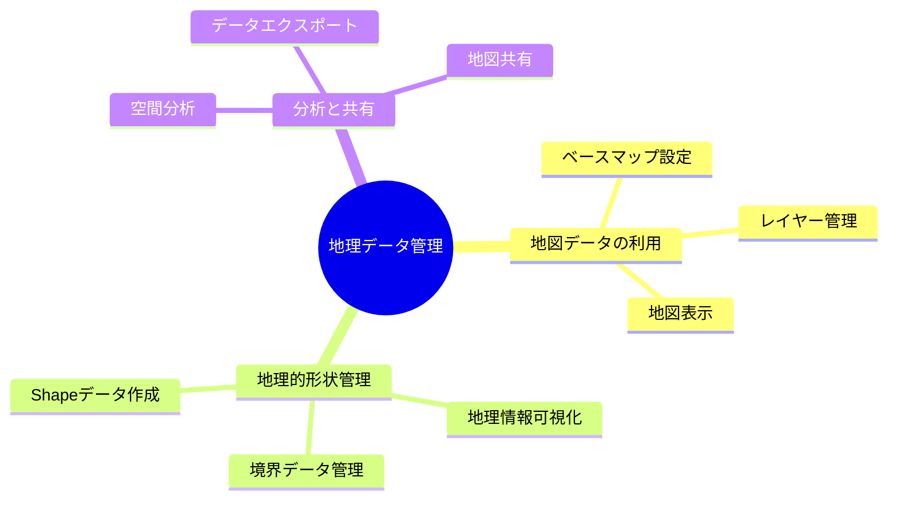

### 8.1 地図データの利用 ❌

#### 8.1.1 ベースマップ設定 ❌

地図表示の基盤となるベースマップの設定を行います。

**利用可能ベースマップの種類**

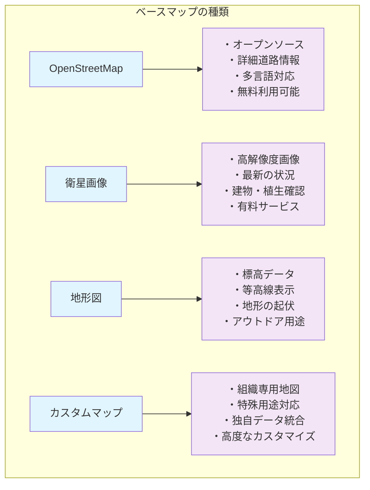

**ベースマップ設定項目**

| 設定項目 | 説明 | 設定値例 | 注意事項 |
|----------|------|----------|----------|
| **地図タイプ** | ベースマップの種類 | OpenStreetMap | 利用規約要確認 |
| **URL テンプレート** | タイル画像のURL | `https://tile.openstreetmap.org/{z}/{x}/{y}.png` | {x},{y},{z}必須 |
| **最大ズームレベル** | 拡大可能倍率 | 18 | データ提供者の制限 |
| **属性情報** | クレジット表記 | "© OpenStreetMap contributors" | 著作権表示義務 |
| **利用制限** | アクセス制限 | 1000リクエスト/日 | 過度な利用は禁止 |

#### 8.1.2 レイヤー管理 ❌

地図上に表示する情報の階層管理です。

**レイヤーの種類**

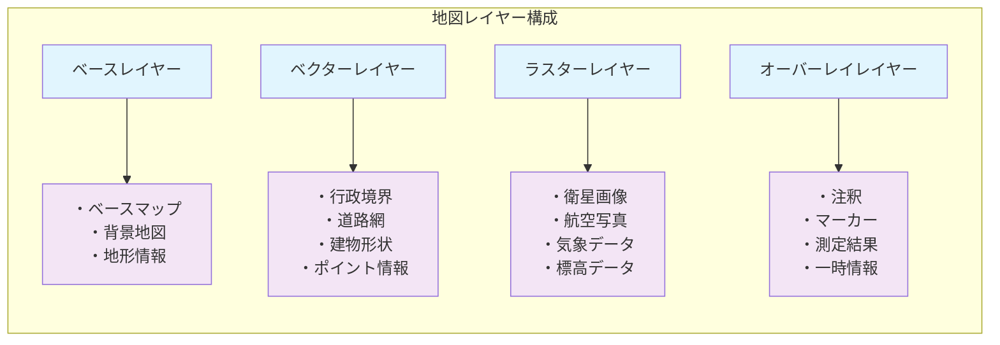

**レイヤー操作**

| 操作 | 方法 | 効果 | ショートカット |
|------|------|------|----------------|
| **表示/非表示** | チェックボックス | レイヤーの可視性切替 | - |
| **透明度調整** | スライダー | レイヤーの透明度変更 | - |
| **順序変更** | ドラッグ&ドロップ | レイヤーの重ね順変更 | - |
| **ズーム連動** | 設定チェック | ズームレベルで表示制御 | - |
| **スタイル変更** | スタイル設定 | 色・線幅・シンボル変更 | - |

#### 8.1.3 地図表示 ❌

インタラクティブな地図表示機能です。

**地図ナビゲーション**

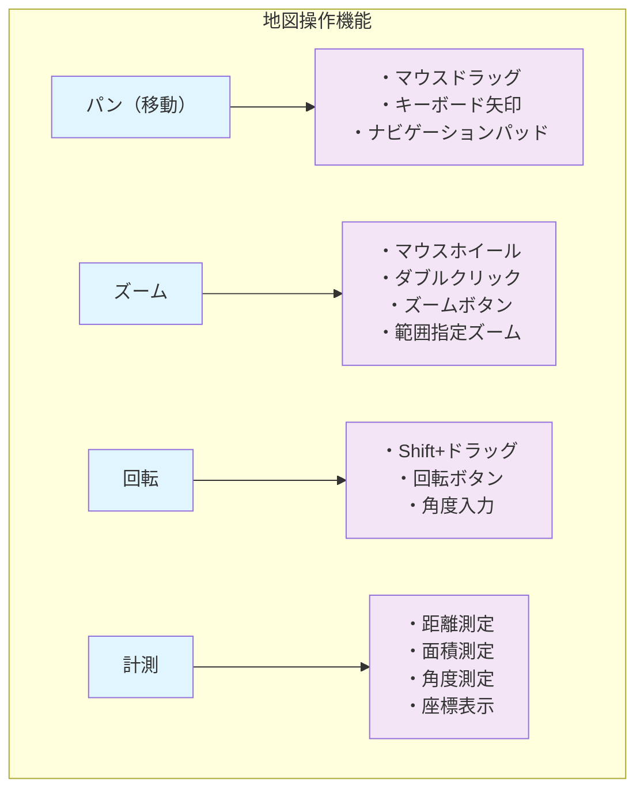

### 8.2 地理的形状管理 ⭐️⭐️

#### 8.2.1 Shape データ作成 ⭐️⭐️

地理的な形状データの作成と編集機能です。

**Shape データの作成方法**

| 作成方法 | 説明 | 適用場面 | データ形式 |
|----------|------|----------|------------|
| **手動描画** | 地図上でポリゴン描画 | カスタム境界作成 | GeoJSON |
| **ファイルインポート** | Shapefileアップロード | 既存GISデータ利用 | .shp, .kml, .gpx |
| **座標入力** | 座標値の直接入力 | 正確な位置指定 | 緯度経度 |
| **外部API連携** | 地理データサービス連携 | 行政境界等の標準データ | API レスポンス |

**Shape データ作成ダイアログ**

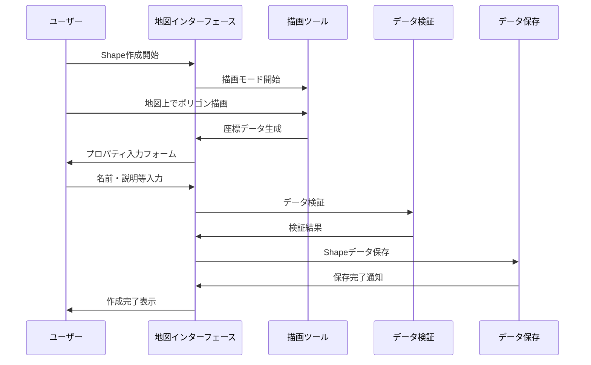

#### 8.2.2 境界データ管理 ⭐️⭐️

行政境界や特定エリアの境界データ管理です。

**境界データの階層管理**

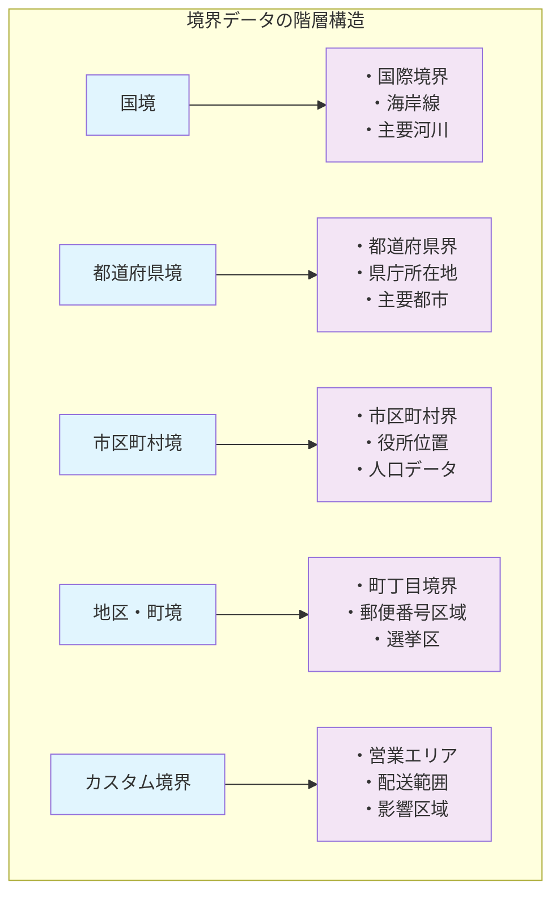

**境界データの属性管理**

| 属性カテゴリ | 属性名 | データ型 | 例 |
|--------------|--------|----------|-----|
| **識別情報** | ID, コード, 名称 | 文字列/数値 | "JP-13", "東京都" |
| **地理情報** | 面積, 周囲長, 中心点 | 数値, 座標 | 2,194 km², (35.676, 139.650) |
| **統計情報** | 人口, 世帯数, 人口密度 | 数値 | 13,960,236人 |
| **管理情報** | 作成日, 更新日, 精度 | 日付, 数値 | 2024-01-01, ±10m |

#### 8.2.3 地理情報可視化（開発予定） ⭐️⭐️

地理データの効果的な可視化手法です。

**可視化手法**

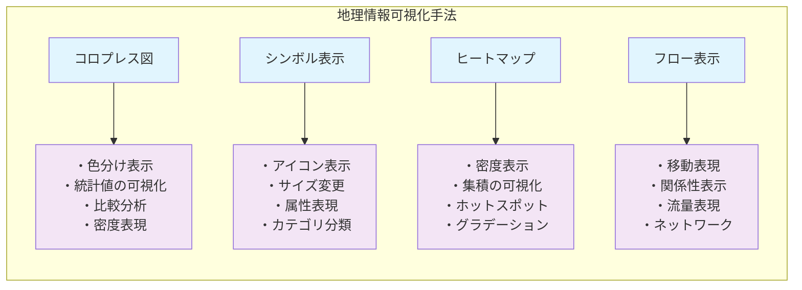

### 8.3 分析と共有（開発予定） ❌❌

#### 8.3.1 空間分析 ❌❌

地理データを活用した空間的な分析機能です。

**空間分析機能**

| 分析機能 | 説明 | 入力データ | 出力結果 |
|----------|------|------------|----------|
| **バッファー分析** | 指定距離内の範囲作成 | ポイント/ライン + 距離 | ポリゴン境界 |
| **オーバーレイ分析** | 複数図形の重ね合わせ | 複数ポリゴン | 交差/結合領域 |
| **近接分析** | 最近隣の検索 | ポイント群 | 距離・方向情報 |
| **密度分析** | 分布密度の計算 | ポイント群 | 密度サーフェス |
| **ネットワーク分析** | 経路・到達圏分析 | 道路ネットワーク | 最短経路・所要時間 |

#### 8.3.2 データエクスポート ⭐️⭐️

地理データの外部出力機能です。

**エクスポート形式**

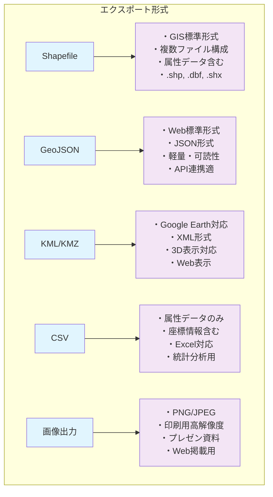

#### 8.3.3 地図共有（開発予定） ❌❌

作成した地図の共有とアクセス制御です。

**共有オプション**

| 共有方法 | アクセス制御 | 用途 | 機能制限 |
|----------|--------------|------|----------|
| **公開リンク** | なし | 一般公開 | 閲覧のみ |
| **パスワード保護** | パスワード認証 | 限定公開 | 閲覧のみ |
| **ユーザー招待** | アカウントベース | チーム共有 | 編集可能 |
| **埋め込みコード** | ドメイン制限 | Webサイト埋込 | 閲覧・基本操作 |
| **API提供** | APIキー認証 | システム連携 | データアクセス |

## Chapter 9: 表形式データ管理

この章では、Spreadsheet Pluginを使用した表形式データの管理について説明します。スプレッドシート形式での データ作成から分析、活用まで、表形式データを効果的に管理するための機能と操作方法を詳しく解説します。

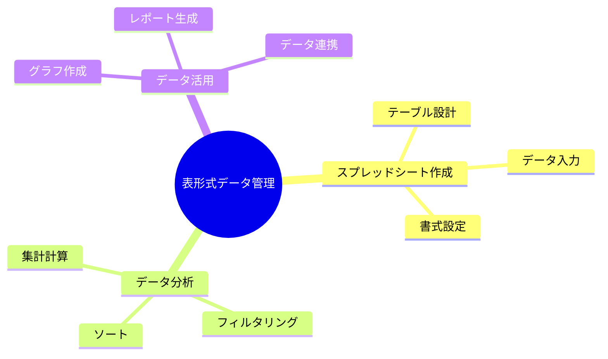

### 9.1 スプレッドシート作成 ⭐️⭐️

#### 9.1.1 テーブル設計 ⭐️⭐️

効率的なデータ管理のためのテーブル構造設計です。

**テーブル設計の原則**

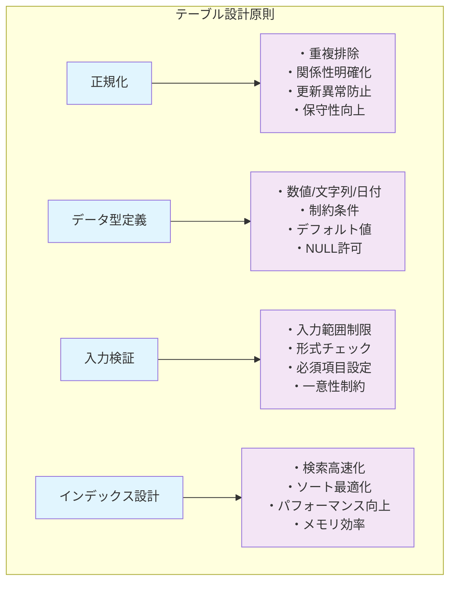

**列設計のベストプラクティス**

| 設計項目 | 推奨事項 | 例 | 避けるべき点 |
|----------|----------|-----|--------------|
| **列名** | 短く明確で英数字 | product_name, price, created_at | 空白・特殊文字・長すぎる名前 |
| **データ型** | 適切な型を選択 | 数値→Number, 日付→Date | すべてText型での統一 |
| **必須項目** | 業務上必須なもののみ | ID, 名前, 作成日 | 過度な必須項目設定 |
| **デフォルト値** | 適切な初期値設定 | ステータス→"draft", 数量→0 | 無意味なデフォルト値 |
| **制約条件** | ビジネスルールを反映 | 価格 > 0, 日付 ≥ 今日 | 制約なしでの運用 |

#### 9.1.2 データ入力 ❌❌

効率的なデータ入力機能と操作方法です。
現在のところ、スプレッドシート機能としては、表示のみで、データ入力・編集には対応していません。

**データ入力方法（開発検討中）**

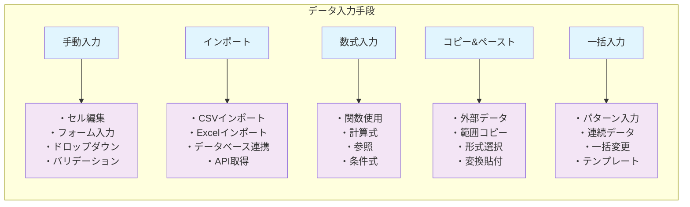

**入力支援機能(開発検討中)**

| 機能 | 説明 | 操作方法 | 効果 |
|------|------|----------|------|
| **オートコンプリート** | 過去入力値からの候補表示 | 文字入力時に自動表示 | 入力速度向上 |
| **データ検証** | 入力値の妥当性チェック | 設定した条件での自動検証 | データ品質確保 |
| **ドロップダウンリスト** | 選択肢からの選択入力 | セルクリックでリスト表示 | 入力ミス防止 |
| **連続データ入力** | パターンベースの自動入力 | 範囲選択してフィル | 作業効率化 |
| **数式コピー** | 相対/絶対参照での数式複製 | 数式セルのコピー&ペースト | 計算の自動化 |

#### 9.1.3 書式設定 ❌❌

データの視認性向上のための書式設定機能です。実装は完了していません。

**書式設定の種類**

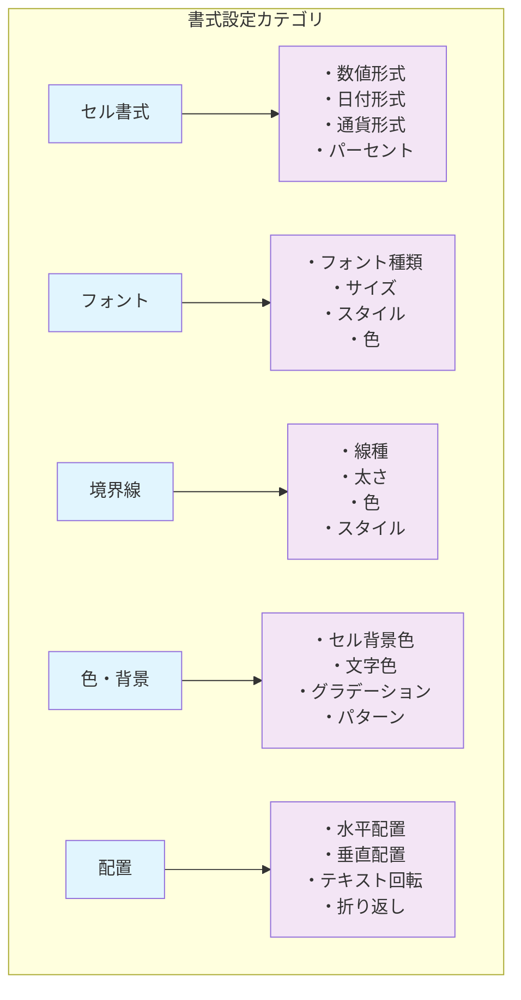

### 9.2 データ分析 ❌❌

#### 9.2.1 集計・計算 ❌❌

データの集計と分析のための計算機能です。実装は完了していません。

**集計関数の種類**

| 関数カテゴリ | 主要関数 | 用途 | 例 |
|-------------|----------|------|-----|
| **統計関数** | SUM, AVERAGE, COUNT | 基本統計 | `=SUM(A1:A10)` |
| **条件付き集計** | SUMIF, COUNTIF | 条件指定集計 | `=SUMIF(B:B,">100",C:C)` |
| **検索・参照** | VLOOKUP, INDEX, MATCH | データ検索 | `=VLOOKUP(A2,D:E,2,FALSE)` |
| **日付・時間** | TODAY, YEAR, DATEDIF | 日付計算 | `=DATEDIF(A2,TODAY(),"Y")` |
| **文字列** | CONCATENATE, LEFT, MID | 文字列操作 | `=CONCATENATE(A2," ",B2)` |
| **論理関数** | IF, AND, OR | 条件判定 | `=IF(A2>100,"高","低")` |

#### 9.2.2 フィルタリング ❌❌

データの絞り込みと条件指定表示機能です。

**フィルタリング機能**

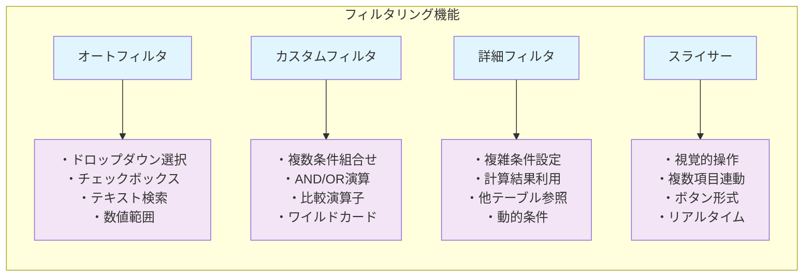

#### 9.2.3 ソート 

データの並び替え機能です。

**ソート機能の種類**

| ソート種類 | 説明 | 操作方法 | 適用場面 |
|------------|------|----------|----------|
| **単一キーソート** | 1つの列での並び替え | 列ヘッダクリック | 基本的な並び替え |
| **複数キーソート** | 複数条件での並び替え | ソートダイアログ使用 | 階層的な並び替え |
| **カスタムソート** | ユーザー定義順序 | カスタムリスト使用 | 月名、曜日等の順序 |
| **条件付きソート** | 条件に応じた並び替え | フィルタと組み合わせ | 特定条件下でのソート |

### 9.3 データ活用 ❌❌

#### 9.3.1 グラフ作成 ❌❌❌

データの可視化のためのグラフ作成機能です。実装は完了していません。

**グラフの種類と用途**

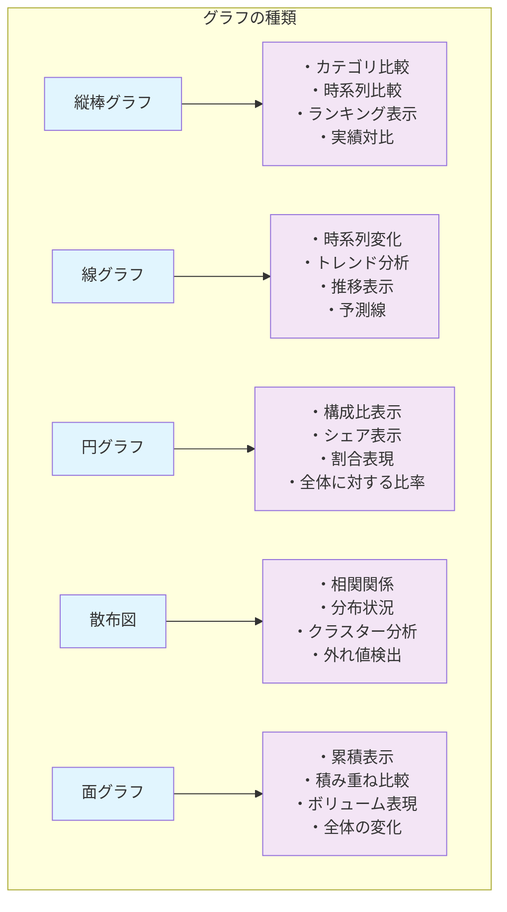

#### 9.3.2 データ連携 ❌❌

他システムとのデータ連携機能です。
実装は完了していません。

**連携方法**

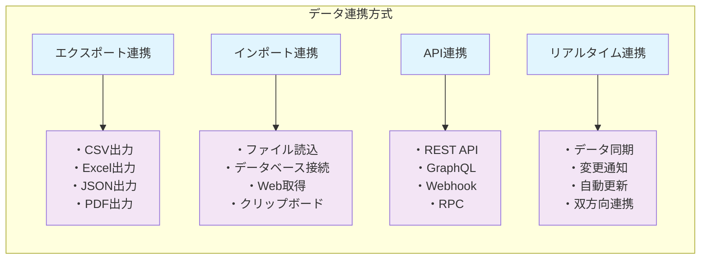

**まとめ**

ユースケースごとの操作では、HierarchiDBの各プラグインを活用した実践的な業務シナリオを詳しく解説しました。プロジェクト管理では協調作業と進捗管理、データ整理では体系的な分類手法、地理データ管理では空間情報の可視化、表形式データ管理では分析とレポート作成について、具体的な操作手順とベストプラクティスを提供しました。これらの知識により、様々な業務シーンでHierarchiDBを効果的に活用できるようになります。