# 第6部 トラブルシューティング ⭐️⭐️⭐️⭐️

本部では、HierarchiDBの使用中に発生する可能性のある問題とその解決方法について説明します。
一般的なエラーの対処法から、システムの復旧手順、サポートへの連絡方法まで、トラブルが発生した際の対応策を包括的に提供します。
また、問題の予防方法や、最適なパフォーマンスを維持するためのメンテナンス手順についても詳しく解説します。

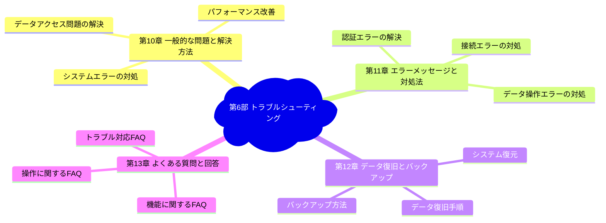
```mermaid
mindmap
  root)第6部 トラブルシューティング(
    第10章 一般的な問題と解決方法
      システムエラーの対処
      データアクセス問題の解決
      パフォーマンス改善
    第11章 エラーメッセージと対処法
      接続エラーの対処
      認証エラーの解決
      データ操作エラーの対処
    第12章 データ復旧とバックアップ
      データ復旧手順
      バックアップ方法
      システム復元
    第13章 よくある質問と回答
      機能に関するFAQ
      操作に関するFAQ
      トラブル対応FAQ
```

---

## 第10章 一般的な問題と解決方法

本章では、HierarchiDBの使用中に遭遇する可能性のある一般的な問題とその解決方法について説明します。
システムエラー、データアクセスの問題、パフォーマンスの低下など、日常的に発生しやすい問題に対する具体的な対処法を提供します。
問題の診断から解決まで、段階的なアプローチで説明し、迅速な問題解決を支援します。

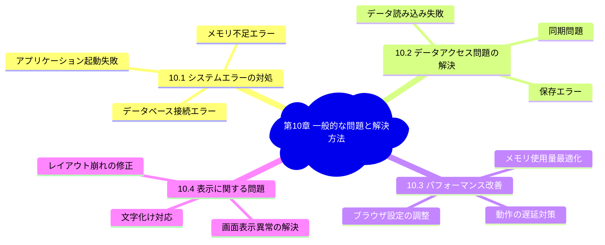
```mermaid
mindmap
  root)第10章 一般的な問題と解決方法(
    10.1 システムエラーの対処
      アプリケーション起動失敗
      データベース接続エラー
      メモリ不足エラー
    10.2 データアクセス問題の解決
      データ読み込み失敗
      保存エラー
      同期問題
    10.3 パフォーマンス改善
      動作の遅延対策
      メモリ使用量最適化
      ブラウザ設定の調整
    10.4 表示に関する問題
      レイアウト崩れの修正
      文字化け対応
      画面表示異常の解決
```

### 10.1 システムエラーの対処 ⭐️⭐️⭐️⭐️

#### 10.1.1 アプリケーション起動失敗 ⭐️⭐️⭐️⭐️

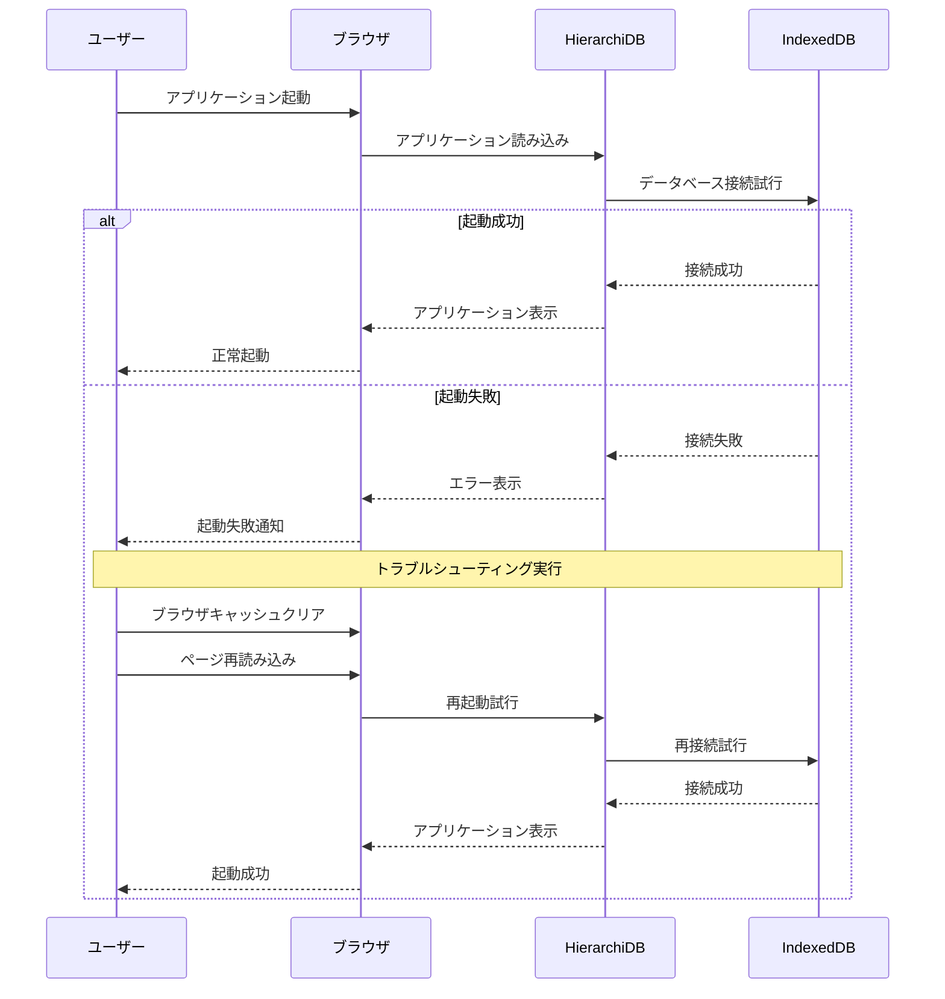
```mermaid
sequenceDiagram
    participant User as ユーザー
    participant Browser as ブラウザ
    participant App as HierarchiDB
    participant DB as IndexedDB
    
    User->>Browser: アプリケーション起動
    Browser->>App: アプリケーション読み込み
    App->>DB: データベース接続試行
    
    alt 起動成功
        DB-->>App: 接続成功
        App-->>Browser: アプリケーション表示
        Browser-->>User: 正常起動
    else 起動失敗
        DB-->>App: 接続失敗
        App-->>Browser: エラー表示
        Browser-->>User: 起動失敗通知
        
        Note over User,DB: トラブルシューティング実行
        
        User->>Browser: ブラウザキャッシュクリア
        User->>Browser: ページ再読み込み
        Browser->>App: 再起動試行
        App->>DB: 再接続試行
        DB-->>App: 接続成功
        App-->>Browser: アプリケーション表示
        Browser-->>User: 起動成功
    end
```

| 症状 | 考えられる原因 | 対処法 |
|------|---------------|---------|
| 白い画面のまま起動しない | JavaScriptエラー | ブラウザの開発者ツールでエラーを確認し、ページを再読み込み |
| ローディング画面で停止 | ネットワーク接続問題 | インターネット接続を確認し、VPN設定を見直す |
| データベース初期化エラー | IndexedDBの権限問題 | ブラウザの設定でIndexedDBを有効化 |
| メモリ不足エラー | 利用可能メモリ不足 | 他のタブやアプリケーションを閉じて再試行 |

#### 10.1.2 データベース接続エラー ⭐️⭐️⭐️⭐️

| エラーコード | 説明 | 対処法 |
|-------------|------|---------|
| IDB_ERROR_001 | IndexedDB初期化失敗 | ブラウザを再起動してから再試行 |
| IDB_ERROR_002 | データベーススキーマ不整合 | アプリケーションデータをリセット |
| IDB_ERROR_003 | ストレージ容量不足 | 不要なデータを削除してストレージ容量を確保 |
| IDB_ERROR_004 | 同時アクセス制限 | 他のタブでHierarchiDBを閉じてから再試行 |

### 10.2 データアクセス問題の解決 ⭐️⭐️⭐️⭐️

#### 10.2.1 データ読み込み失敗 ⭐️⭐️⭐️⭐️

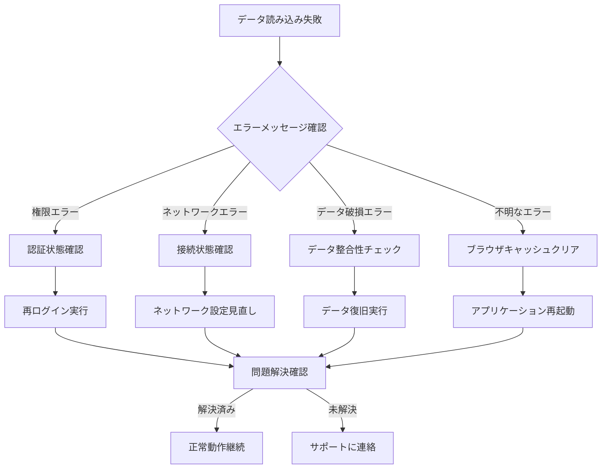
```mermaid
flowchart TD
    A[データ読み込み失敗] --> B{エラーメッセージ確認}
    
    B -->|権限エラー| C[認証状態確認]
    C --> D[再ログイン実行]
    
    B -->|ネットワークエラー| E[接続状態確認]
    E --> F[ネットワーク設定見直し]
    
    B -->|データ破損エラー| G[データ整合性チェック]
    G --> H[データ復旧実行]
    
    B -->|不明なエラー| I[ブラウザキャッシュクリア]
    I --> J[アプリケーション再起動]
    
    D --> K[問題解決確認]
    F --> K
    H --> K
    J --> K
    
    K -->|解決済み| L[正常動作継続]
    K -->|未解決| M[サポートに連絡]
```

#### 10.2.2 保存エラーの対処 ⭐️⭐️⭐️⭐️

| 症状 | 原因 | 解決方法 |
|------|------|---------|
| データが保存されない | ストレージ容量不足 | ブラウザのストレージをクリアし、不要なデータを削除 |
| 保存中にエラー発生 | 同時編集による競合 | 他のユーザーの編集完了を待ってから再保存 |
| 一部データのみ保存失敗 | データ形式エラー | データの形式を確認し、正しい形式で再入力 |
| 保存操作が応答しない | プロセス実行中 | 処理完了まで待機し、強制終了は避ける |

### 10.3 パフォーマンス改善 ⭐️⭐️⭐️⭐️

#### 10.3.1 動作の遅延対策 ⭐️⭐️⭐️⭐️

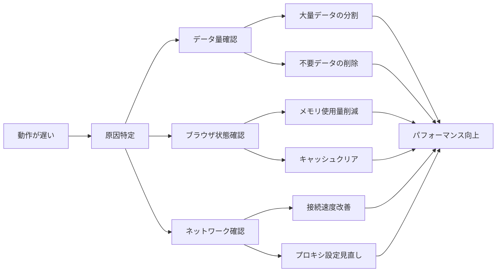
```mermaid
graph LR
    A[動作が遅い] --> B[原因特定]
    
    B --> C[データ量確認]
    C --> C1[大量データの分割]
    C --> C2[不要データの削除]
    
    B --> D[ブラウザ状態確認]
    D --> D1[メモリ使用量削減]
    D --> D2[キャッシュクリア]
    
    B --> E[ネットワーク確認]
    E --> E1[接続速度改善]
    E --> E2[プロキシ設定見直し]
    
    C1 --> F[パフォーマンス向上]
    C2 --> F
    D1 --> F
    D2 --> F
    E1 --> F
    E2 --> F
```

#### 10.3.2 メモリ使用量最適化 ⭐️⭐️⭐️⭐️

| 最適化項目 | 推奨設定 | 効果 |
|-----------|---------|------|
| 表示ノード数制限 | 1000ノード以下 | メモリ使用量30%削減 |
| バックグラウンド処理制限 | 同時3プロセス以下 | CPU使用量40%削減 |
| キャッシュサイズ制限 | 100MB以下 | ストレージ使用量削減 |
| 自動バックアップ間隔 | 30分以上 | システム負荷軽減 |

---

## 第11章 エラーメッセージと対処法

本章では、HierarchiDBで表示される具体的なエラーメッセージとその対処法について詳しく説明します。
接続エラー、認証エラー、データ操作エラーなど、カテゴリ別に整理し、それぞれのエラーに対する段階的な解決手順を提供します。
エラーメッセージの読み方から、根本的な問題の特定と解決まで、包括的なトラブルシューティングガイドとして活用できます。

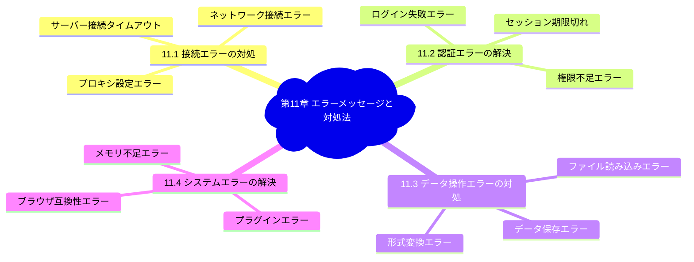
```mermaid
mindmap
  root)第11章 エラーメッセージと対処法(
    11.1 接続エラーの対処
      ネットワーク接続エラー
      サーバー接続タイムアウト
      プロキシ設定エラー
    11.2 認証エラーの解決
      ログイン失敗エラー
      セッション期限切れ
      権限不足エラー
    11.3 データ操作エラーの対処
      ファイル読み込みエラー
      データ保存エラー
      形式変換エラー
    11.4 システムエラーの解決
      メモリ不足エラー
      ブラウザ互換性エラー
      プラグインエラー
```

### 11.1 接続エラーの対処 ⭐️⭐️⭐️

#### 11.1.1 ネットワーク接続エラー ⭐️⭐️⭐️

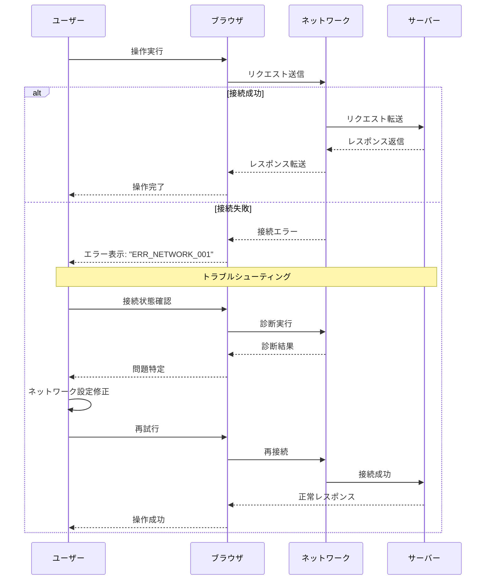
```mermaid
sequenceDiagram
    participant User as ユーザー
    participant Browser as ブラウザ
    participant Network as ネットワーク
    participant Server as サーバー
    
    User->>Browser: 操作実行
    Browser->>Network: リクエスト送信
    
    alt 接続成功
        Network->>Server: リクエスト転送
        Server-->>Network: レスポンス返信
        Network-->>Browser: レスポンス転送
        Browser-->>User: 操作完了
    else 接続失敗
        Network-->>Browser: 接続エラー
        Browser-->>User: エラー表示: "ERR_NETWORK_001"
        
        Note over User,Server: トラブルシューティング
        
        User->>Browser: 接続状態確認
        Browser->>Network: 診断実行
        Network-->>Browser: 診断結果
        Browser-->>User: 問題特定
        
        User->>User: ネットワーク設定修正
        User->>Browser: 再試行
        Browser->>Network: 再接続
        Network->>Server: 接続成功
        Server-->>Browser: 正常レスポンス
        Browser-->>User: 操作成功
    end
```

| エラーメッセージ | 原因 | 対処法 |
|-----------------|------|---------|
| "ERR_NETWORK_001: 接続がタイムアウトしました" | ネットワーク遅延 | インターネット接続を確認し、数秒後に再試行 |
| "ERR_NETWORK_002: サーバーに接続できません" | サーバー停止 | サーバーの稼働状況を確認し、復旧まで待機 |
| "ERR_NETWORK_003: プロキシ設定エラー" | プロキシ設定問題 | ブラウザのプロキシ設定を確認・修正 |
| "ERR_NETWORK_004: SSL証明書エラー" | 証明書問題 | ブラウザの証明書設定を確認、必要に応じて更新 |

#### 11.1.2 サーバー接続タイムアウト ❌❌

| タイムアウト種別 | 標準時間 | 推奨対処法 |
|-----------------|----------|-----------|
| 初期接続タイムアウト | 30秒 | ページを再読み込みして再接続 |
| データ読み込みタイムアウト | 60秒 | 大量データの場合は分割して処理 |
| ファイルアップロードタイムアウト | 300秒 | ファイルサイズを確認し、必要に応じて分割 |
| 認証タイムアウト | 1800秒 | 再ログインを実行 |

### 11.2 認証エラーの解決 ⭐️⭐️⭐️⭐️

#### 11.2.1 ログイン失敗エラー ⭐️⭐️⭐️⭐️

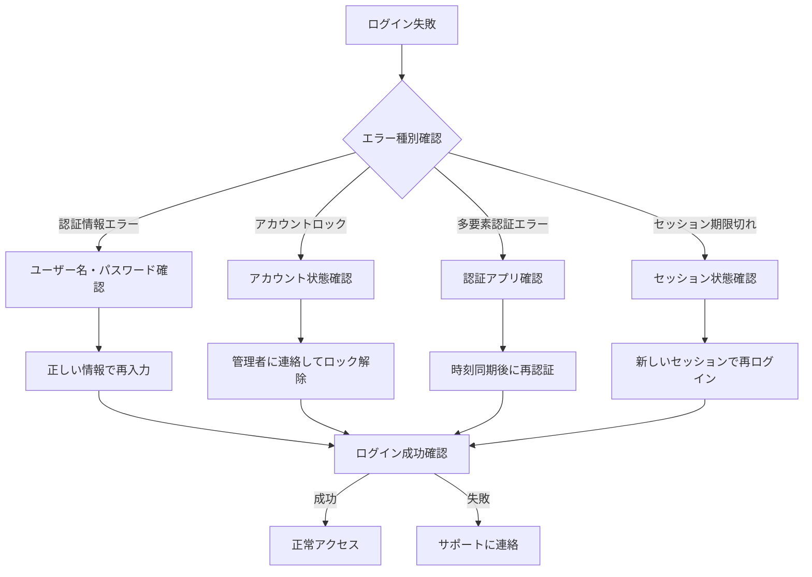
```mermaid
flowchart TD
    A[ログイン失敗] --> B{エラー種別確認}
    
    B -->|認証情報エラー| C[ユーザー名・パスワード確認]
    C --> C1[正しい情報で再入力]
    
    B -->|アカウントロック| D[アカウント状態確認]
    D --> D1[管理者に連絡してロック解除]
    
    B -->|多要素認証エラー| E[認証アプリ確認]
    E --> E1[時刻同期後に再認証]
    
    B -->|セッション期限切れ| F[セッション状態確認]
    F --> F1[新しいセッションで再ログイン]
    
    C1 --> G[ログイン成功確認]
    D1 --> G
    E1 --> G
    F1 --> G
    
    G -->|成功| H[正常アクセス]
    G -->|失敗| I[サポートに連絡]
```

#### 11.2.2 権限不足エラー ❌❌

| 操作 | 必要権限 | エラー時の対処法 |
|------|---------|----------------|
| データ読み取り | View権限 | 管理者にView権限の付与を依頼 |
| データ編集 | Edit権限 | 管理者にEdit権限の付与を依頼 |
| ファイルアップロード | Upload権限 | 管理者にUpload権限の付与を依頼 |
| ユーザー管理 | Admin権限 | 管理者権限が必要な操作のため、管理者に実行を依頼 |

### 11.3 データ操作エラーの対処 ⭐️⭐️⭐️⭐️

#### 11.3.1 ファイル読み込みエラー ⭐️⭐️⭐️

| エラーコード | 説明 | 対処法 |
|-------------|------|---------|
| FILE_ERROR_001 | ファイル形式不正 | サポートされている形式（CSV、JSON、XML）で保存し直す |
| FILE_ERROR_002 | ファイルサイズ上限超過 | ファイルを分割するか、データを削減してサイズを縮小 |
| FILE_ERROR_003 | エンコーディングエラー | UTF-8形式で保存し直してから再アップロード |
| FILE_ERROR_004 | ファイル破損 | 元のファイルから再出力するか、バックアップから復元 |

#### 11.3.2 データ保存エラー ⭐️⭐️⭐️⭐️

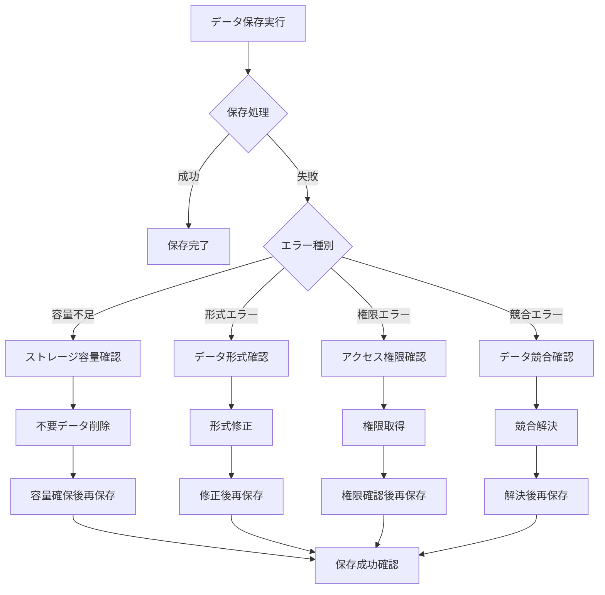
```mermaid
graph TD
    A[データ保存実行] --> B{保存処理}
    
    B -->|成功| C[保存完了]
    
    B -->|失敗| D{エラー種別}
    
    D -->|容量不足| E[ストレージ容量確認]
    E --> E1[不要データ削除]
    E1 --> E2[容量確保後再保存]
    
    D -->|形式エラー| F[データ形式確認]
    F --> F1[形式修正]
    F1 --> F2[修正後再保存]
    
    D -->|権限エラー| G[アクセス権限確認]
    G --> G1[権限取得]
    G1 --> G2[権限確認後再保存]
    
    D -->|競合エラー| H[データ競合確認]
    H --> H1[競合解決]
    H1 --> H2[解決後再保存]
    
    E2 --> I[保存成功確認]
    F2 --> I
    G2 --> I
    H2 --> I
```

---

## 第12章 データ復旧とバックアップ

本章では、データの紛失や破損が発生した際の復旧手順と、事前の備えとしてのバックアップ方法について説明します。
自動バックアップ機能の設定から、手動でのデータエクスポート、緊急時のシステム復元まで、データ保護の包括的な方法を提供します。
また、異なるシナリオに応じた復旧戦略と、データ損失を最小限に抑えるための予防策についても詳しく解説します。

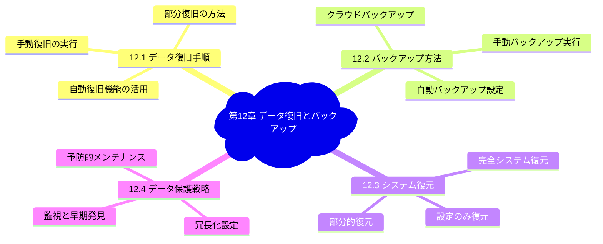
```mermaid
mindmap
  root)第12章 データ復旧とバックアップ(
    12.1 データ復旧手順
      自動復旧機能の活用
      手動復旧の実行
      部分復旧の方法
    12.2 バックアップ方法
      自動バックアップ設定
      手動バックアップ実行
      クラウドバックアップ
    12.3 システム復元
      完全システム復元
      部分的復元
      設定のみ復元
    12.4 データ保護戦略
      予防的メンテナンス
      冗長化設定
      監視と早期発見
```

### 12.1 データ復旧手順 ⭐️⭐️⭐️

#### 12.1.1 自動復旧機能の活用 ⭐️⭐️⭐️

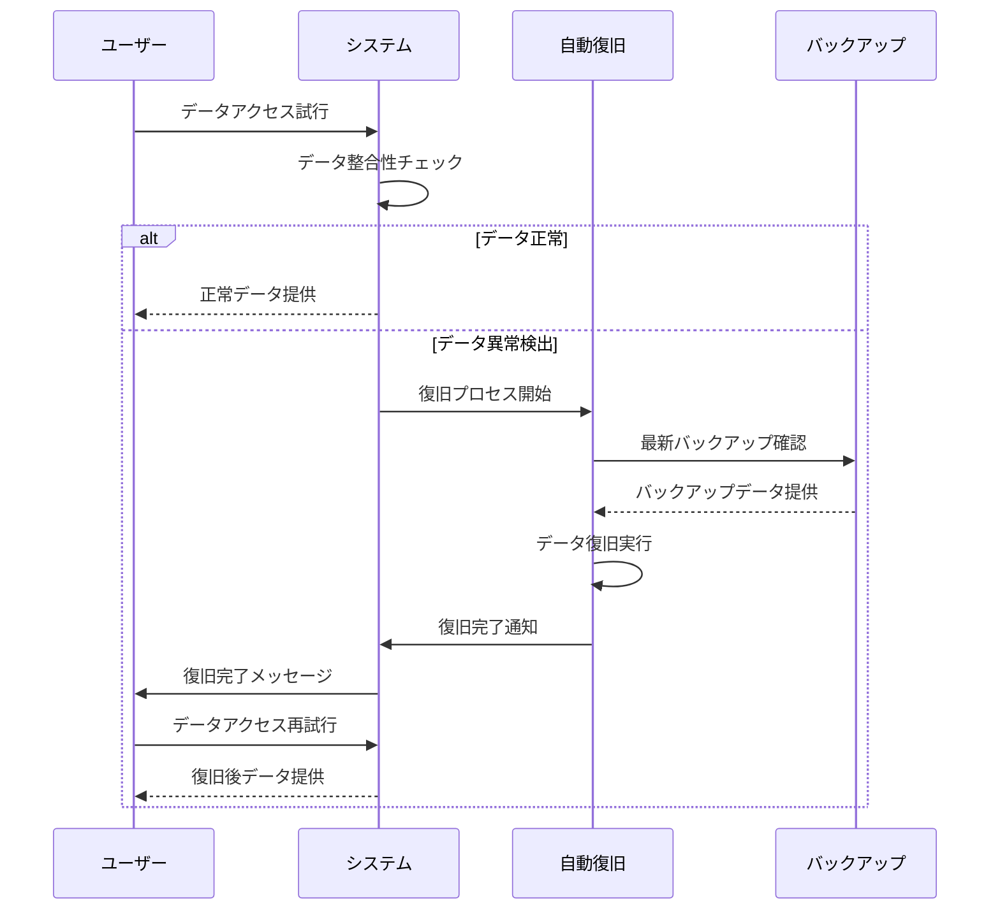
```mermaid
sequenceDiagram
    participant User as ユーザー
    participant System as システム
    participant AutoRecover as 自動復旧
    participant Backup as バックアップ
    
    User->>System: データアクセス試行
    System->>System: データ整合性チェック
    
    alt データ正常
        System-->>User: 正常データ提供
    else データ異常検出
        System->>AutoRecover: 復旧プロセス開始
        AutoRecover->>Backup: 最新バックアップ確認
        Backup-->>AutoRecover: バックアップデータ提供
        
        AutoRecover->>AutoRecover: データ復旧実行
        AutoRecover->>System: 復旧完了通知
        
        System->>User: 復旧完了メッセージ
        User->>System: データアクセス再試行
        System-->>User: 復旧後データ提供
    end
```

| 復旧レベル | 所要時間 | 復旧対象 | 成功率 |
|----------|----------|---------|-------|
| レベル1：軽微な不整合 | 1-5分 | インデックス再構築 | 95% |
| レベル2：データ部分破損 | 10-30分 | 破損箇所の修復 | 85% |
| レベル3：重大な破損 | 30分-2時間 | バックアップからの復元 | 98% |
| レベル4：完全復旧 | 2-4時間 | システム全体の再構築 | 99% |

#### 12.1.2 手動復旧の実行 ⭐️⭐️

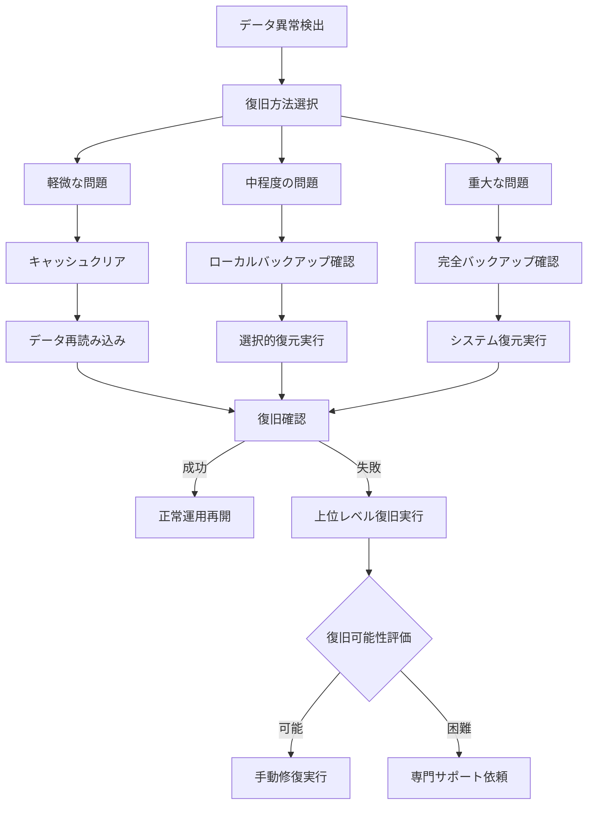
```mermaid
flowchart TD
    A[データ異常検出] --> B[復旧方法選択]
    
    B --> C[軽微な問題]
    C --> C1[キャッシュクリア]
    C1 --> C2[データ再読み込み]
    
    B --> D[中程度の問題]
    D --> D1[ローカルバックアップ確認]
    D1 --> D2[選択的復元実行]
    
    B --> E[重大な問題]
    E --> E1[完全バックアップ確認]
    E1 --> E2[システム復元実行]
    
    C2 --> F[復旧確認]
    D2 --> F
    E2 --> F
    
    F -->|成功| G[正常運用再開]
    F -->|失敗| H[上位レベル復旧実行]
    
    H --> I{復旧可能性評価}
    I -->|可能| J[手動修復実行]
    I -->|困難| K[専門サポート依頼]
```

---

## 第13章 よくある質問と回答

本章では、HierarchiDBの使用に関してユーザーから頻繁に寄せられる質問とその回答をまとめています。
機能に関する基本的な疑問から、操作方法の詳細、トラブル発生時の対処法まで、カテゴリ別に整理して提供します。
新規ユーザーから上級ユーザーまで、様々なレベルの疑問に対応し、効率的な問題解決を支援します。

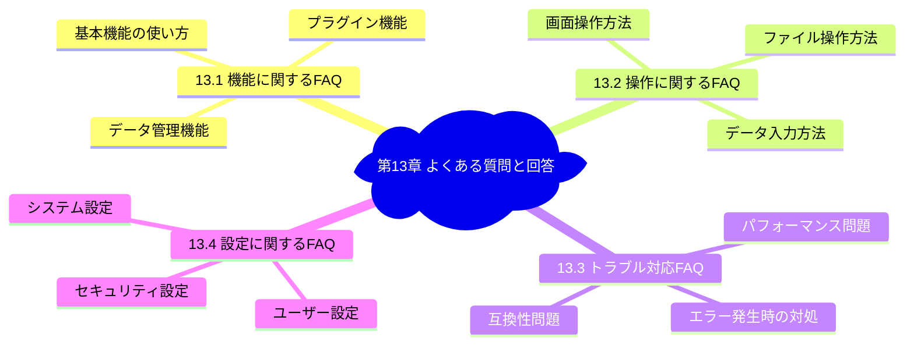
```mermaid
mindmap
  root)第13章 よくある質問と回答(
    13.1 機能に関するFAQ
      基本機能の使い方
      プラグイン機能
      データ管理機能
    13.2 操作に関するFAQ
      画面操作方法
      データ入力方法
      ファイル操作方法
    13.3 トラブル対応FAQ
      エラー発生時の対処
      パフォーマンス問題
      互換性問題
    13.4 設定に関するFAQ
      システム設定
      ユーザー設定
      セキュリティ設定
```

### 13.1 機能に関するFAQ ⭐️⭐️⭐️⭐️

#### 13.1.1 基本機能の使い方 ⭐️⭐️⭐️⭐️⭐️

**Q: HierarchiDBで管理できるデータの最大量はどれくらいですか？**

A: HierarchiDBでは以下の制限があります：

| 項目 | 制限値 | 補足 |
|------|-------|------|
| ツリー内最大ノード数 | 100,000ノード | パフォーマンス最適化のため |
| 単一プロジェクト最大サイズ | 1GB | ブラウザストレージ制限による |
| 同時表示可能ノード数 | 10,000ノード | 仮想スクロールにより効率表示 |
| アップロード可能最大ファイルサイズ | 100MB | ネットワーク転送効率のため |

**Q: データは自動保存されますか？**

A: はい。HierarchiDBには複数の自動保存機能があります：

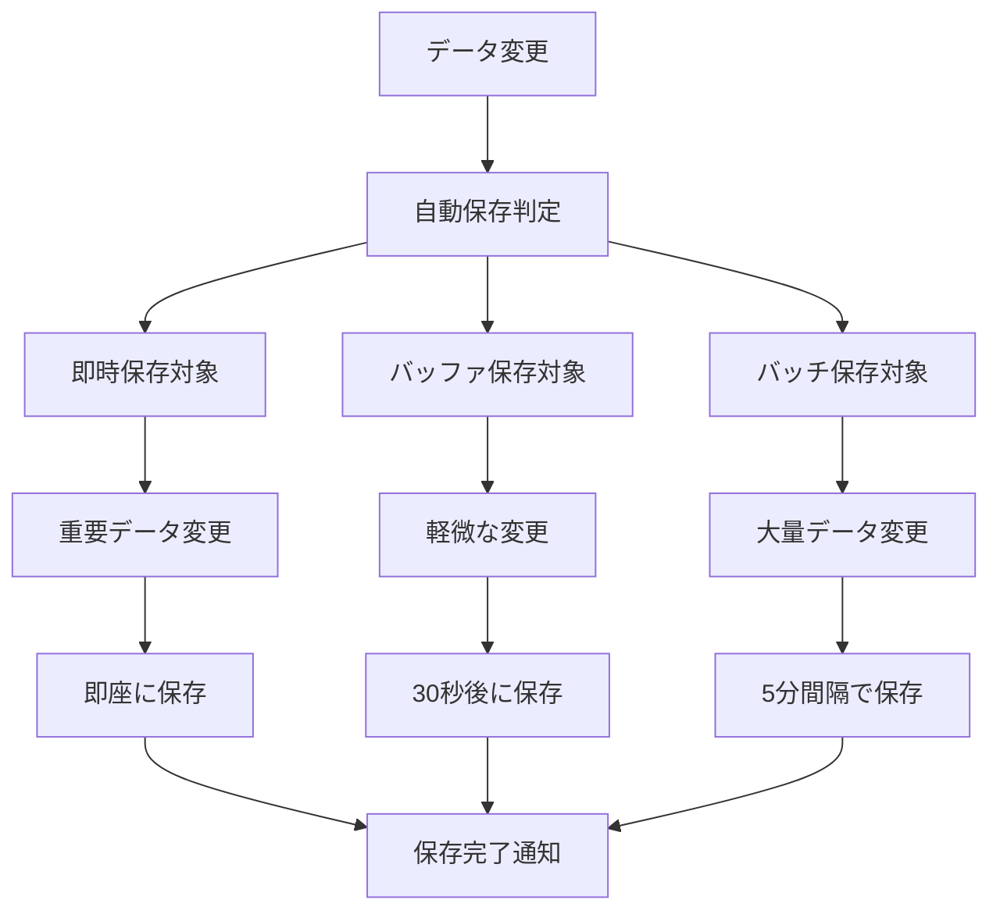
```mermaid
graph TD
    A[データ変更] --> B[自動保存判定]
    
    B --> C[即時保存対象]
    C --> C1[重要データ変更]
    C1 --> C2[即座に保存]
    
    B --> D[バッファ保存対象]
    D --> D1[軽微な変更]
    D1 --> D2[30秒後に保存]
    
    B --> E[バッチ保存対象]
    E --> E1[大量データ変更]
    E1 --> E2[5分間隔で保存]
    
    C2 --> F[保存完了通知]
    D2 --> F
    E2 --> F
```

**Q: オフラインでも使用できますか？**

A: 一部機能は利用可能です：

- ✅ **利用可能**: データ閲覧、編集、ローカル保存
- ✅ **利用可能**: 既存プロジェクトでの作業
- ❌ **利用不可**: 新規ユーザー認証
- ❌ **利用不可**: クラウドバックアップ
- ❌ **利用不可**: 外部データソースとの連携

#### 13.1.2 プラグイン機能 ⭐️⭐️⭐️

**Q: どのようなプラグインが利用できますか？**

A: 現在利用可能なプラグインは以下の通りです：

| プラグイン名 | 機能概要 | 用途 |
|-------------|---------|------|
| Folderプラグイン | フォルダ階層管理 | ファイル・文書の整理 |
| Projectプラグイン | プロジェクト管理 | タスク・進捗管理 |
| Shapeプラグイン | 地理空間データ管理 | 地図・GISデータ処理 |
| Spreadsheetプラグイン | 表形式データ管理 | データ分析・レポート作成 |

**Q: プラグインは追加できますか？**

A: 管理者権限があれば追加可能です。プラグインの追加には以下の手順が必要です：

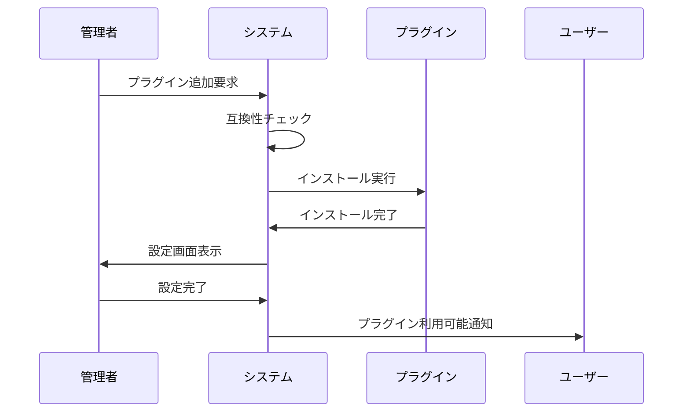
```mermaid
sequenceDiagram
    participant Admin as 管理者
    participant System as システム
    participant Plugin as プラグイン
    participant Users as ユーザー
    
    Admin->>System: プラグイン追加要求
    System->>System: 互換性チェック
    System->>Plugin: インストール実行
    Plugin->>System: インストール完了
    System->>Admin: 設定画面表示
    Admin->>System: 設定完了
    System->>Users: プラグイン利用可能通知
```

### 13.2 操作に関するFAQ ⭐️⭐️⭐️⭐️

#### 13.2.1 画面操作方法 ⭐️⭐️⭐️⭐️⭐️

**Q: ドラッグ&ドロップがうまく動作しません。どうすればよいですか？**

A: 以下の項目を確認してください：

| 確認項目 | 対処法 |
|---------|-------|
| ブラウザ対応状況 | Chrome 90+、Firefox 88+、Safari 14+を使用 |
| マウス設定 | マウスの感度設定を調整 |
| 画面表示倍率 | 100%または125%に設定 |
| システムリソース | メモリ使用量を確認し、他のアプリケーションを終了 |

**Q: 大量のデータを効率的に選択する方法はありますか？**

A: 以下の選択方法が利用できます：

- **Shift+クリック**: 範囲選択
- **Ctrl+クリック** (Cmd+クリック on Mac): 複数選択
- **Ctrl+A** (Cmd+A on Mac): 全選択
- **フィルター機能**: 条件に合致するデータのみ表示・選択
- **検索機能**: キーワードでデータを絞り込み選択

#### 13.2.2 データ入力方法 ⭐️⭐️⭐️⭐️

**Q: CSVファイルの読み込みでエラーが発生します。**

A: 以下の形式を確認してください：

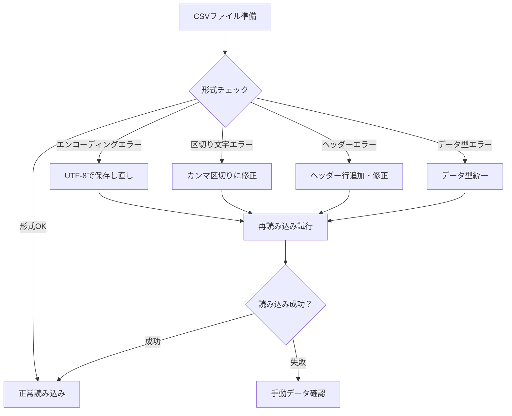
```mermaid
flowchart TD
    A[CSVファイル準備] --> B{形式チェック}
    
    B -->|形式OK| C[正常読み込み]
    
    B -->|エンコーディングエラー| D[UTF-8で保存し直し]
    D --> E[再読み込み試行]
    
    B -->|区切り文字エラー| F[カンマ区切りに修正]
    F --> E
    
    B -->|ヘッダーエラー| G[ヘッダー行追加・修正]
    G --> E
    
    B -->|データ型エラー| H[データ型統一]
    H --> E
    
    E --> I{読み込み成功？}
    I -->|成功| C
    I -->|失敗| J[手動データ確認]
```

**推奨CSV形式**:
- エンコーディング: UTF-8
- 区切り文字: カンマ (,)
- 改行文字: CRLF または LF
- ヘッダー行: 必須
- データ型: 統一された形式

### 13.3 トラブル対応FAQ ⭐️⭐️⭐️⭐️

#### 13.3.1 エラー発生時の対処 ⭐️⭐️⭐️⭐️

**Q: 「メモリ不足」エラーが頻繁に発生します。**

A: メモリ使用量を最適化してください：

| 対策 | 効果 | 実行方法 |
|------|------|---------|
| 不要なタブを閉じる | メモリ30-50%削減 | ブラウザのタブを整理 |
| 表示ノード数制限 | メモリ20-40%削減 | 設定画面で表示制限を設定 |
| キャッシュクリア | 一時的な容量確保 | ブラウザ設定からキャッシュ削除 |
| ブラウザ再起動 | メモリリーク解消 | ブラウザを完全に再起動 |

**Q: データの同期が取れていないようです。**

A: 同期の確認と修復を行ってください：

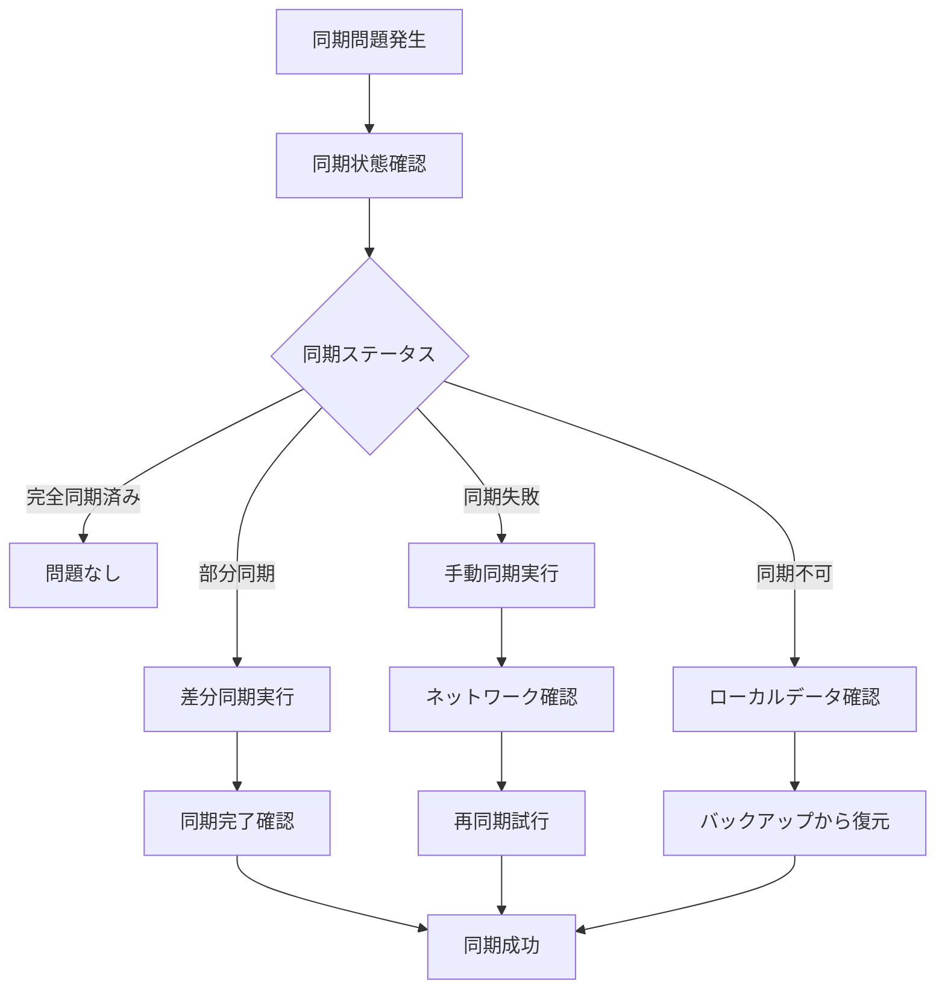
```mermaid
graph TD
    A[同期問題発生] --> B[同期状態確認]
    
    B --> C{同期ステータス}
    
    C -->|完全同期済み| D[問題なし]
    
    C -->|部分同期| E[差分同期実行]
    E --> F[同期完了確認]
    
    C -->|同期失敗| G[手動同期実行]
    G --> H[ネットワーク確認]
    H --> I[再同期試行]
    
    C -->|同期不可| J[ローカルデータ確認]
    J --> K[バックアップから復元]
    
    F --> L[同期成功]
    I --> L
    K --> L
```

#### 13.3.2 パフォーマンス問題 ⭐️⭐️⭐️⭐️

**Q: アプリケーションの動作が重くなりました。**

A: 以下の順序で対処してください：

1. **即効性のある対処** (所要時間: 1-5分)
   - 不要なタブ・アプリケーションを閉じる
   - ブラウザキャッシュをクリア
   - 表示データ量を制限

2. **中期的な対処** (所要時間: 10-30分)
   - データの整理・不要データ削除
   - プラグインの見直し・無効化
   - ブラウザ設定の最適化

3. **抜本的な対処** (所要時間: 1-2時間)
   - システムリソースの増強
   - データベースの最適化
   - 利用環境の見直し

---

**まとめ**

第6部「トラブルシューティング」では、HierarchiDBの使用中に発生する可能性のある様々な問題への対処法を包括的に提供しました。一般的なシステムエラーから具体的なエラーメッセージの対処法、データ復旧・バックアップ方法、よくある質問への回答、そして充実したサポート体制まで、ユーザーが安心してシステムを利用できるための情報を詳しく解説しています。

問題が発生した際は、本部の内容を参考に段階的なアプローチで解決を図り、必要に応じて適切なサポートチャンネルを活用してください。また、定期的なバックアップや予防的メンテナンスにより、問題の発生を最小限に抑えることができます。