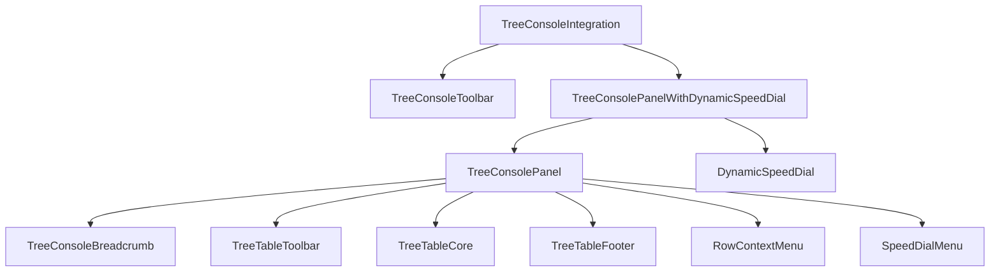

# TreeConsole Routing Architecture

## Overview

This document describes the routing architecture and component hierarchy for the TreeConsole UI in HierarchiDB, specifically analyzing the URL path `/hierarchidb/t/r`.

## URL Structure

The TreeConsole uses a hierarchical URL structure:
```
/hierarchidb/t/{treeId}/{pageNodeId}/{targetNodeId}/{nodeType}/{action}
```

For the example URL `/hierarchidb/t/r`:
- Base path: `/hierarchidb` (from VITE_APP_NAME environment variable)
- Route: `/t` (tree console route)
- Tree ID: `r` (Resource tree)
- Page Node ID: undefined (defaults to `rRoot`)

## File-based Routing Hierarchy (React Router v7)

### 1. Route Files

```
app/src/routes/
├── t.($treeId)._layout.tsx         # Tree loader wrapper
├── t.($treeId).($pageNodeId)._layout.tsx  # Main layout with AppBar
└── t.($treeId).($pageNodeId).tsx   # Route handler
```

#### `t.($treeId)._layout.tsx`
- **Purpose**: Basic tree data loading
- **Loader**: `loadTree()` - Fetches tree metadata
- **Component**: Simple `<Outlet />` wrapper

#### `t.($treeId).($pageNodeId)._layout.tsx`
- **Purpose**: Main application layout
- **Loader**: `loadPageNode()` - Fetches current node data
- **Features**:
  - AppBar with tree switcher
  - User login button
  - TreeConsoleIntegration component
  - Default pageNodeId handling (`{treeId}Root` when undefined)

#### `t.($treeId).($pageNodeId).tsx`
- **Purpose**: Final route handler
- **Loader**: `loadPageNode()` with default handling
- **Component**: Simple `<Outlet />` for child routes

## Component Architecture

### Integration Layer

#### TreeConsoleIntegration (`~/components/TreeConsoleIntegration.tsx`)
- **Role**: Central orchestrator for TreeConsole functionality
- **Responsibilities**:
  - Worker API integration
  - State management hub
  - Action coordination
  - Toolbar action handling
  - Guided tour integration
- **Key Features**:
  - Trash item detection
  - Undo/Redo support
  - Import/Export handling
  - Context menu action routing

#### useTreeConsoleIntegration Hook (`~/hooks/useTreeConsoleIntegration.ts`)
- **Role**: State and action management
- **Provides**:
  - Tree data fetching
  - Node selection/expansion state
  - Search functionality
  - CRUD operations
  - Navigation history

### UI Component Hierarchy



### Component Responsibilities

#### TreeConsoleToolbar (`@hierarchidb/ui-treeconsole-toolbar`)
- Search functionality
- Undo/Redo buttons
- Copy/Paste/Duplicate operations
- Import/Export actions
- Trash management (restore/empty)

#### TreeConsolePanelWithDynamicSpeedDial (`~/components/TreeConsolePanelWithDynamicSpeedDial.tsx`)
- Wrapper combining TreeConsolePanel with DynamicSpeedDial
- Replaces hardcoded plugin actions with dynamic loading

#### TreeConsolePanel (`@hierarchidb/ui-treeconsole-base`)
- Main tree display logic
- Integrates all table components
- Manages context menu state
- Handles node interactions

#### TreeTableCore (`@hierarchidb/ui-treeconsole-treetable`)
- **Current Implementation** (as of latest migration)
- TanStack React Table based
- Features:
  - Column sorting with indicators
  - Row selection with select-all checkbox
  - Column resizing with drag handles
  - Expandable rows
  - Virtual scrolling ready
  - Drag & drop support

#### Supporting Components
- **TreeConsoleBreadcrumb**: Navigation path display
- **TreeTableToolbar**: Table-specific controls (view mode, filters, actions)
- **TreeTableFooter**: Status information (item counts, loading state)
- **RowContextMenu**: Right-click context menu
- **DynamicSpeedDial**: Plugin-based create actions

## Data Flow

### Loading Sequence

1. **Route Activation**: React Router triggers route loaders
2. **Tree Loading**: `loadTree()` fetches tree metadata
3. **Page Node Loading**: `loadPageNode()` fetches current node and children
4. **Worker API Initialization**: `WorkerAPIClient.getSingleton()` establishes connection
5. **Data Subscription**: Component subscribes to node updates
6. **UI Rendering**: Components render with loaded data

### State Management

```typescript
// State flow through useTreeConsoleIntegration
WorkerAPI --> useTreeConsoleIntegration --> TreeConsoleIntegration --> UI Components
```

Key state elements:
- `treeData`: Current node's children
- `selectedIds`: Selected row IDs
- `expandedIds`: Expanded row IDs
- `searchTerm`: Current search filter
- `breadcrumbItems`: Navigation path
- `viewMode`: List or grid view

### Action Flow

User actions flow through multiple layers:
1. **UI Event** (click, keyboard, etc.)
2. **Component Handler** (TreeTableCore, Toolbar, etc.)
3. **Integration Layer** (TreeConsoleIntegration)
4. **Hook Layer** (useTreeConsoleIntegration)
5. **Worker API** (via Comlink RPC)
6. **Database Operations** (Dexie)

## Package Dependencies

### UI Packages Used
- `@hierarchidb/ui-treeconsole-base`: Core TreeConsole components
- `@hierarchidb/ui-treeconsole-treetable`: Advanced table implementation
- `@hierarchidb/ui-treeconsole-toolbar`: Toolbar component
- `@hierarchidb/ui-treeconsole-breadcrumb`: Breadcrumb navigation
- `@hierarchidb/ui-treeconsole-speeddial`: FAB menu for actions
- `@hierarchidb/ui-usermenu`: User authentication UI
- `@hierarchidb/ui-client`: Worker API client

### Core Dependencies
- `@hierarchidb/common-core`: Type definitions
- `@tanstack/react-table`: Table functionality
- `@mui/material`: UI components
- `react-router`: Routing

## Migration History

### TreeTable Implementation Evolution

1. **Original**: `TreeTableView` in `packages/ui/treeconsole/base/src/components/TreeTable/core/TreeTableView.tsx`
   - Simple MUI Table implementation
   - Basic sorting and selection

2. **Intermediate**: `TreeTableCore` in `packages/ui/treeconsole/base/src/components/TreeTable/TreeTableCore.tsx`
   - Attempted TanStack integration
   - Never fully implemented

3. **Current**: `TreeTableCore` in `packages/ui/treeconsole/treetable/src/components/TreeTableCore.tsx`
   - Full TanStack React Table implementation
   - Advanced features (sorting, resizing, virtual scrolling ready)
   - Plugin system support
   - Better separation of concerns

## Configuration Points

### Environment Variables
- `VITE_APP_NAME`: Sets base path (e.g., "hierarchidb" for GitHub Pages)

### Route Parameters
- `treeId`: Identifies the tree (e.g., "r" for resources, "p" for projects)
- `pageNodeId`: Current node being viewed (defaults to `{treeId}Root`)
- `targetNodeId`: Target for actions (optional)
- `nodeType`: Plugin type for specialized views (optional)
- `action`: Specific action to perform (optional)

## Performance Considerations

1. **Virtual Scrolling**: TreeTableCore supports virtual scrolling for large datasets
2. **Memoization**: Components use React.memo and useMemo extensively
3. **Lazy Loading**: Child nodes loaded on demand
4. **Worker Thread**: All database operations in separate thread
5. **Comlink RPC**: Efficient serialization for worker communication

## Future Enhancements

1. **Virtualization**: Enable virtual scrolling for very large trees
2. **Keyboard Navigation**: Enhanced keyboard shortcuts
3. **Drag & Drop**: Full drag-and-drop reordering
4. **Custom Columns**: User-configurable column layouts
5. **Advanced Filtering**: Multi-column filtering support
6. **Bulk Operations**: Select and operate on multiple nodes efficiently

## Related Documentation

- [Plugin Architecture](../plugin-architecture.md)
- [Worker API Documentation](../worker-api.md)
- [UI Component Guide](../ui-components.md)
- [Database Schema](../database-schema.md)