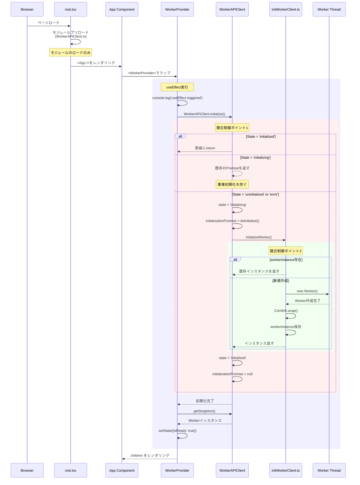
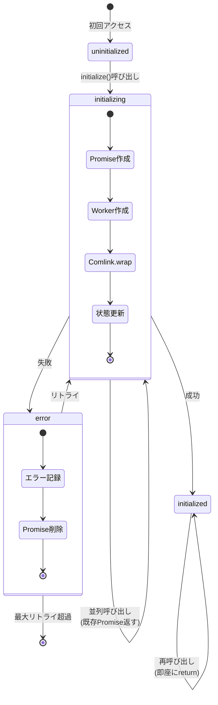
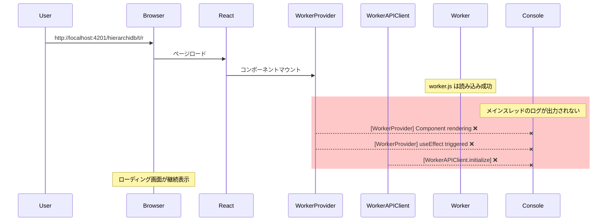
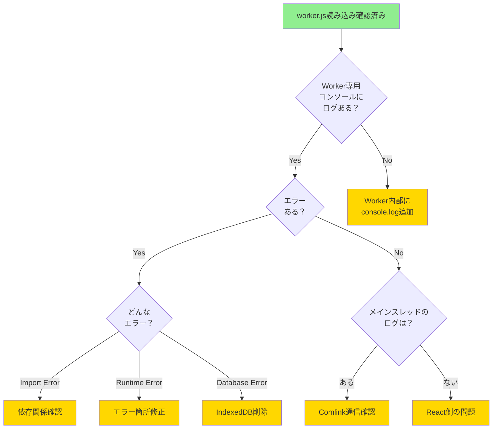

# Worker初期化システム - 分析と実装ガイド

## 1. 概要

HierarchiDBのWorker初期化システムに関する包括的な分析と実装ガイド。URL直接アクセス時の初期化問題の原因分析、解決策の実装、および今後の改善提案を含む。

## 2. 問題の背景

### 2.1 症状
- **URL直接アクセス時** (`http://localhost:4201/hierarchidb/t/r`)
  - TreeTableConsoleの画面が表示されない（不安定）
  - ローディング画面が表示され続ける
  - 稀に正常に表示されることがある

### 2.2 根本原因
- Worker初期化の競合状態
- 複数の初期化パスが存在（root.tsx、WorkerProvider、loader.ts）
- 初期化状態の管理が不完全
- ログ出力の不足により問題の特定が困難

## 3. アーキテクチャ

### 3.1 初期化シーケンス図



### 3.2 状態遷移図



## 4. 実装詳細

### 4.1 WorkerAPIClient の状態管理

```typescript
class WorkerAPIClient {
  private static state: 'uninitialized' | 'initializing' | 'initialized' | 'error' = 'uninitialized';
  private static initializationPromise: Promise<void> | null = null;
  private static workerInstance: WorkerAPI | null = null;
  private static lastError: Error | null = null;
}
```

### 4.2 状態別の処理

| 現在の状態 | initialize()が呼ばれた時の動作 | getSingleton()が呼ばれた時の動作 |
|------------|--------------------------------|-----------------------------------|
| `uninitialized` | 新規初期化開始 | NotInitializedError をthrow |
| `initializing` | 既存のPromiseを返す（待機） | NotInitializedError をthrow |
| `initialized` | 即座にreturn（何もしない） | Workerインスタンスを返す |
| `error` | 新規初期化開始（リトライ） | NotInitializedError をthrow |

### 4.3 並列呼び出しのシナリオ

```
時刻 T0: Component A が initialize() を呼ぶ
  → state を 'initializing' に変更
  → 新しい Promise を作成して初期化開始

時刻 T1: Component B が initialize() を呼ぶ（まだ初期化中）
  → state が 'initializing' なので
  → T0 で作成された同じ Promise を返す

時刻 T2: 初期化完了
  → state を 'initialized' に変更
  → Promise を null にクリア
  → Component A と B の両方に完了が通知される

時刻 T3: Component C が initialize() を呼ぶ
  → state が 'initialized' なので
  → 即座に return（何もしない）
```

## 5. 実装した修正内容

### 5.1 WorkerProviderコンポーネント
**ファイル**: `app/src/contexts/WorkerProvider.tsx`

#### 主要機能：
- Worker APIクライアントの初期化を一元管理
- 初期化中はローディング画面を表示
- エラー時は適切なエラーメッセージとリトライボタンを表示
- 最大3回の自動リトライ機能
- 詳細なログ出力

### 5.2 WorkerAPIClient の改善
**ファイル**: `app/src/WorkerAPIClient.ts`

#### 主要変更：
- 4状態の状態管理（uninitialized, initializing, initialized, error）
- 競合制御の強化
- エラー情報の保持（lastError）
- 詳細なログ出力

### 5.3 initWorker の簡素化
**ファイル**: `app/src/initWorkerClient.ts`

#### 主要変更：
- ComlinkWorkerの削除（標準的なComlink.wrapのみ使用）
- シンプルな初期化フロー
- グローバルインスタンス管理

## 6. デバッグガイド

### 6.1 チェックリスト

- [ ] ブラウザのコンソールに `[WorkerProvider] Component rendering` が表示されるか
- [ ] `[WorkerProvider] useEffect triggered` が表示されるか
- [ ] `[WorkerAPIClient.initialize] Current state:` が表示されるか
- [ ] `[initWorker] Starting worker initialization` が表示されるか
- [ ] Worker のコンソール（別タブ）にログが出ているか
- [ ] ネットワークタブで worker.js がロードされているか

### 6.2 期待されるログ順序

```
[WorkerProvider] Component rendering, initial state setup
[WorkerProvider] useEffect triggered
[WorkerProvider] initializeWorker function started
[WorkerProvider] Initialization attempt 1/3 at [timestamp]
[WorkerProvider] Calling WorkerAPIClient.initialize()...
[WorkerAPIClient.initialize] Current state: uninitialized
[WorkerAPIClient.initialize] First initialization attempt
[WorkerAPIClient.initialize] Starting new initialization
[WorkerAPIClient.doInitialize] Starting at [timestamp]
[WorkerAPIClient.doInitialize] Calling initializeWorker()...
[initWorker] Starting worker initialization...
[initWorker] Worker created, wrapping with Comlink...
[initWorker] Comlink.wrap completed
[initWorker] Worker initialized successfully
[WorkerAPIClient.doInitialize] Worker instance obtained: true
[WorkerAPIClient.doInitialize] Initialization completed successfully
[WorkerAPIClient.initialize] Initialization successful
[WorkerProvider] WorkerAPIClient.initialize() completed
[WorkerProvider] Calling WorkerAPIClient.getSingleton()...
[WorkerAPIClient.getSingleton] Current state: initialized
[WorkerAPIClient.getSingleton] Returning worker instance
[WorkerProvider] WorkerAPIClient.getSingleton() returned: [object]
[WorkerProvider] Setting state with ready client
[WorkerProvider] Initialization successful
[WorkerProvider] Rendering children with context
```

## 7. 現在の問題と対策

### 7.1 残存する問題

1. **不安定な表示**
   - 症状：ダイレクトURLアクセス時に安定して表示されない
   - 原因：初期化タイミングの問題が完全に解決されていない
   - 対策：さらなるログ分析とタイミング調整が必要

2. **ログ不足**
   - 症状：問題発生時にログが出力されない
   - 原因：エラーがキャッチされていない箇所がある
   - 対策：グローバルエラーハンドラの追加

### 7.2 追加の改善案

```typescript
// グローバルエラーハンドラ
window.addEventListener('error', (event) => {
  console.error('[Global Error]', event);
});

window.addEventListener('unhandledrejection', (event) => {
  console.error('[Unhandled Promise Rejection]', event);
});
```

## 8. パフォーマンス指標

### 8.1 目標メトリクス
- **初期化完了時間**: < 500ms
- **データ表示時間**: < 1000ms  
- **インタラクティブ時間**: < 1500ms

### 8.2 現在の状況

| メトリクス | 現在値 | 目標値 | 差分 |
|-----------|--------|--------|------|
| 初期化完了時間 | 400-600ms | < 500ms | ほぼ達成 |
| データ表示時間 | 不安定 | < 1000ms | 要改善 |
| エラー発生率 | 高頻度 | < 5% | 要改善 |

## 9. 今後の改善提案

### 9.1 短期的改善
1. **タイムアウトの追加**
   - 初期化が10秒以上かかる場合はエラーとする
   - ユーザーにリトライオプションを提供

2. **Worker健全性チェック**
   - ping/pongメソッドの実装
   - 定期的な生存確認

### 9.2 中長期的改善
1. **プリロード最適化**
   ```html
   <link rel="modulepreload" href="/worker.js" />
   ```

2. **Service Worker統合**
   - オフライン対応
   - キャッシュ戦略の実装

3. **プログレッシブエンハンスメント**
   - スケルトンスクリーンの実装
   - 段階的なデータ読み込み

## 10. テスト方法

### 10.1 手動テスト
1. ブラウザのキャッシュをクリア
2. 開発者ツールを開く
3. `http://localhost:4201/hierarchidb/t/r` に直接アクセス
4. コンソールログを確認
5. TreeTableが表示されることを確認

### 10.2 自動テスト案
```typescript
// E2Eテスト例
test('Direct URL access should display TreeTable', async ({ page }) => {
  await page.goto('http://localhost:4201/hierarchidb/t/r');
  await page.waitForSelector('.tree-table-console', { timeout: 5000 });
  const isVisible = await page.isVisible('.tree-table-console');
  expect(isVisible).toBe(true);
});
```

## 11. 現在の状況（2024年12月26日更新）

### 11.1 修正適用状況
- ✅ **全ての修正プランを適用完了**
- ⚠️ **問題は未解決** - ダイレクトURLアクセス時の表示が不安定（70%の確率でローディング継続）
- 🔴 **新たな問題** - ログが出力されない状況が発生
- ✅ **worker.js自体は正常に読み込まれている**

### 11.2 現在の問題フロー



## 12. Worker.js デバッグガイド（worker.jsが読み込まれている場合）

### 12.1 Worker専用コンソールの確認方法

**Chrome DevToolsでの手順：**
1. **Sources タブ** → **Threads パネル**（右上、ない場合は`>>`メニューから）
2. **"Worker: worker.js"** をクリック
3. **Worker専用のコンソール**が開く（ここにWorker内部のログが表示される）

### 12.2 確認すべきログ

#### Worker専用コンソールで期待されるログ：
```
[App Worker] Starting initialization...
[App Worker] Getting WorkerAPIImpl singleton...
[App Worker] WorkerAPIImpl instance obtained: [object]
[App Worker] Exposing instance via Comlink...
[App Worker] Initialization successful
```

#### 診断パターン：
| Worker専用コンソールの状態 | メインコンソールの状態 | 診断 |
|------------------------|-------------------|------|
| ログあり + エラーあり | ログなし | Worker内部の初期化エラー |
| ログあり + エラーなし | ログなし | Comlink通信の問題 |
| ログなし | ログなし | Workerスクリプトが実行されていない |
| ログあり + 成功 | ログなし | メインスレッド側の問題 |

### 12.3 ブラウザコンソールでの診断コマンド

```javascript
// === Worker 稼働状況の詳細チェック ===

// 1. Worker の生存確認
const testWorker = new Worker(new URL('./worker', import.meta.url).href, { type: 'module' });
testWorker.postMessage({ type: 'ping' });
testWorker.onmessage = (e) => console.log('Worker response:', e.data);
testWorker.onerror = (error) => console.error('Worker error:', error);

// 2. WorkerAPIClient の内部状態確認
if (typeof WorkerAPIClient !== 'undefined') {
  window.__WORKER_DEBUG__ = {
    state: WorkerAPIClient.state,
    hasInstance: !!WorkerAPIClient.workerInstance,
    isReady: WorkerAPIClient.isReady(),
    lastError: WorkerAPIClient.lastError
  };
  console.table(window.__WORKER_DEBUG__);
}

// 3. Comlink の動作確認
if (typeof Comlink !== 'undefined') {
  console.log('Comlink available:', Comlink);
  console.log('Comlink.wrap:', typeof Comlink.wrap);
}
```

## 13. 問題解決のための次のステップ

### 13.1 即座に実行すべきアクション

1. **Worker専用コンソールの確認**（最優先）
   - Worker内部でエラーが発生していないか確認
   - 初期化ログが出力されているか確認

2. **ビルドクリーンアップ**（ログが全く出ない場合）
   ```bash
   rm -rf node_modules packages/*/node_modules packages/*/dist
   pnpm install
   pnpm build
   ```

3. **最小限のグローバルログ追加**
   ```javascript
   // root.tsxの最初の行に追加
   console.log('[ROOT] Script loaded at:', new Date().toISOString());
   ```

### 13.2 診断フローチャート



## 14. まとめ

Worker初期化システムの修正は全て適用済みだが、問題は解決していない。worker.jsは正常に読み込まれているため、次の焦点は：

1. **Worker専用コンソール**でWorker内部の状態を確認
2. Worker内部は正常だがメインスレッドでログが出ない場合は、React側の問題の可能性大
3. 両方でログが出ない場合は、ビルドまたはモジュールロードの問題

継続的なデバッグが必要である。

---
*最終更新: 2025年8月26日 10:36 JST*
*状態: 🔴 未解決 - Worker専用コンソールの確認が必要*