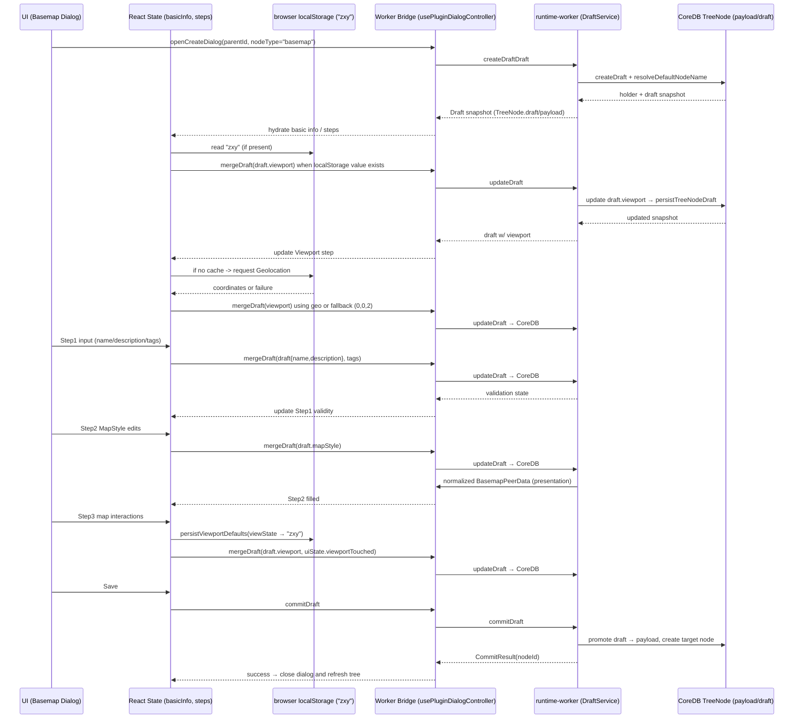
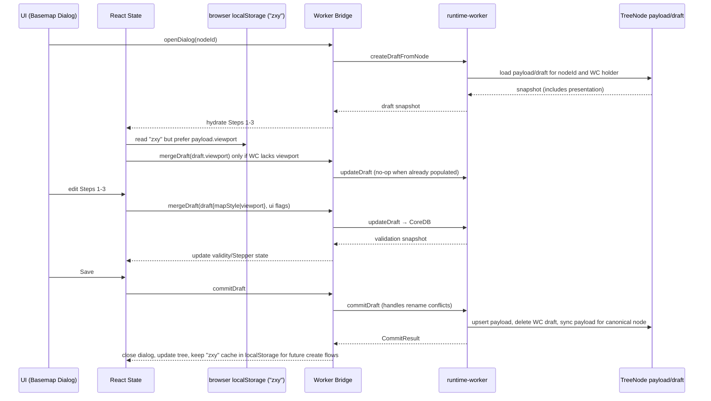

# Basemap Dialog Flow

TreeNode payload/draft が唯一のソースであり、Dexie `peerEntities` は廃止済み。Basemap ダイアログでは UI 側の state と runtime-worker の Draft API が以下の順序で連携する。

## Create Flow

## Edit Flow

## 仕様メモ

- Basemap payload (`BasemapPeerData`) は `schemaVersion=1` と `presentation` (mapStyle / viewport) のみを保持。UI 表示用フィールド（name/description/tags）は TreeNode の top-level に存在する。
- `ViewportStep` は `window.localStorage.zxy` → Geolocation API → `[0,0] zoom 2` の順に初期状態を決める。MapLibre の view state 変更イベントで `zxy` を常にリライトする。
- DraftService は Step1/2/3 の入力を `TreeNode.draft` に書き込み、Worker 側で normalize を適用し `TreeNode.data/draftData` を更新する。PeerStore は廃止済みのため、commit 後は TreeNode の更新だけで完結する。
