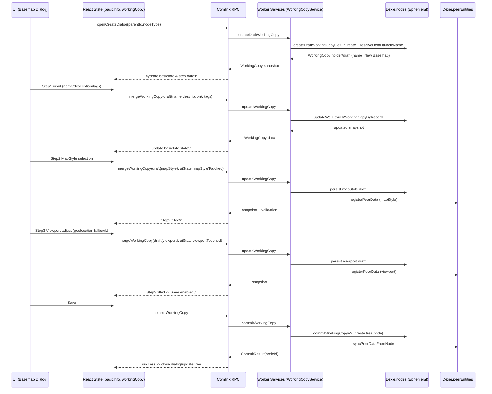
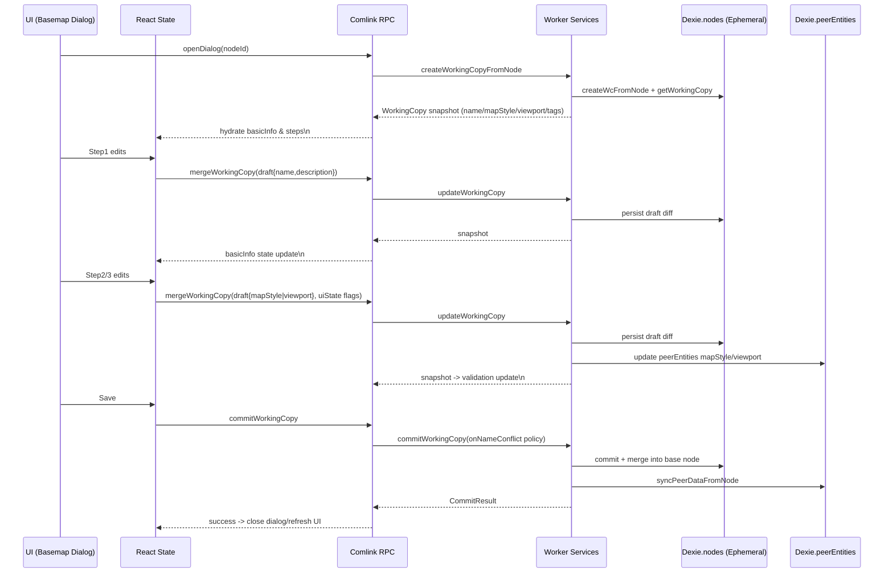

# Basemap Dialog Flow

## Create Flow (Default value hydration included)

```mermaid
sequenceDiagram
    participant User as UI (Basemap Dialog)
    participant React as React State (basicInfo, workingCopy)
    participant Comlink as Comlink RPC
    participant Worker as Worker Services (WorkingCopyService)
    participant Nodes as Dexie.nodes (Ephemeral)
    participant Peers as Dexie.peerEntities

    User->>Comlink: openCreateDialog(parentId,nodeType)
    Comlink->>Worker: createDraftWorkingCopy
    Worker->>Nodes: createDraftWorkingCopyGetOrCreate + resolveDefaultNodeName
    Nodes-->>Worker: WorkingCopy holder/draft (name=New Basemap)
    Worker-->>Comlink: WorkingCopy snapshot
    Comlink-->>React: hydrate basicInfo & step data\n

    User->>React: Step1 input (name/description/tags)
    React->>Comlink: mergeWorkingCopy(draft{name,description}, tags)
    Comlink->>Worker: updateWorkingCopy
    Worker->>Nodes: updateWc + touchWorkingCopyByRecord
    Nodes-->>Worker: updated snapshot
    Worker-->>Comlink: WorkingCopy data
    Comlink-->>React: update basicInfo state\n

    User->>React: Step2 MapStyle selection
    React->>Comlink: mergeWorkingCopy(draft{mapStyle}, uiState.mapStyleTouched)
    Comlink->>Worker: updateWorkingCopy
    Worker->>Nodes: persist mapStyle draft
    Worker->>Peers: registerPeerData (mapStyle)
    Worker-->>Comlink: snapshot + validation
    Comlink-->>React: Step2 filled\n

    User->>React: Step3 Viewport adjust (geolocation fallback)
    React->>Comlink: mergeWorkingCopy(draft{viewport}, uiState.viewportTouched)
    Comlink->>Worker: updateWorkingCopy
    Worker->>Nodes: persist viewport draft
    Worker->>Peers: registerPeerData (viewport)
    Worker-->>Comlink: snapshot
    Comlink-->>React: Step3 filled -> Save enabled\n

    User->>React: Save
    React->>Comlink: commitWorkingCopy
    Comlink->>Worker: commitWorkingCopy
    Worker->>Nodes: commitWorkingCopyV2 (create tree node)
    Worker->>Peers: syncPeerDataFromNode
    Worker-->>Comlink: CommitResult(nodeId)
    Comlink-->>React: success -> close dialog/update tree
```

## Edit Flow

```mermaid
sequenceDiagram
    participant User as UI (Basemap Dialog)
    participant React as React State
    participant Comlink as Comlink RPC
    participant Worker as Worker Services
    participant Nodes as Dexie.nodes (Ephemeral)
    participant Peers as Dexie.peerEntities

    User->>Comlink: openDialog(nodeId)
    Comlink->>Worker: createWorkingCopyFromNode
    Worker->>Nodes: createWcFromNode + getWorkingCopy
    Worker-->>Comlink: WorkingCopy snapshot (name/mapStyle/viewport/tags)
    Comlink-->>React: hydrate basicInfo & steps\n

    User->>React: Step1 edits
    React->>Comlink: mergeWorkingCopy(draft{name,description})
    Comlink->>Worker: updateWorkingCopy
    Worker->>Nodes: persist draft diff
    Worker-->>Comlink: snapshot
    Comlink-->>React: basicInfo state update\n

    User->>React: Step2/3 edits
    React->>Comlink: mergeWorkingCopy(draft{mapStyle|viewport}, uiState flags)
    Comlink->>Worker: updateWorkingCopy
    Worker->>Nodes: persist draft diff
    Worker->>Peers: update peerEntities mapStyle/viewport
    Worker-->>Comlink: snapshot -> validation update\n

    User->>React: Save
    React->>Comlink: commitWorkingCopy
    Comlink->>Worker: commitWorkingCopy(onNameConflict policy)
    Worker->>Nodes: commit + merge into base node
    Worker->>Peers: syncPeerDataFromNode
    Worker-->>Comlink: CommitResult
    Comlink-->>React: success -> close dialog/refresh UI
```
