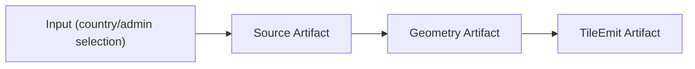

# ビルドセッション仕様

## 目的と対象範囲

本書は、Shape のビルドセッションにおけるタスク生成・実行・一時停止・再開のルールを、メタデータまたはタイムスタンプ比較に基づく厳密な仕様として定義する。対象は source / geometry / tileEmit の各ステージと、それに付随するメタデータ生成である。必須識別子・メタデータ・時刻・ライフサイクル遷移の欠落や不正値は契約違反として即時に失敗させ、補完・推測・互換読み込みで処理を継続しない。

## 用語定義

- 入力データ（Input data）: ビルド処理の入力となるデータ。`meta`（メタデータ署名）を持つ。`updatedAt` は任意。例: データソースの国×ADM 選択。
- 生成物（Artifact）: ステージ処理の出力。元データを辿れる参照キー（`sourceKey` や `originKey` など）と `meta` または `updatedAt` を持つ。
- タスク（Task）: ステージ内で生成物を作成/更新する処理単位。タスクステータスの定義は「タスクステータス定義」セクションを参照。
- ステージ（Stage）: `source` → `geometry` → `tileEmit` の順序で進行する処理単位。
- ビルドセッション（Build Session）: 複数ステージを順に実行する一連の処理。再開可能な状態を永続化する。ライフサイクルフェーズの定義は「ビルドセッションライフサイクル」セクションを参照。

## ビルドセッションライフサイクル

ビルドセッションは以下のフェーズを持つ。

| フェーズ | 意味 |
| --- | --- |
| `idle` | セッション未開始または完全終了後の待機状態 |
| `starting` | ビルド開始処理中（Worker への命令送信〜実行開始前） |
| `running` | ステージ実行中 |
| `pausing` | 一時停止命令を送信済み、Worker の応答待ち |
| `paused` | 一時停止中（再開可能） |
| `resuming` | 再開命令を送信済み、Worker の応答待ち |
| `finalizing` | 全ステージ完了後の後処理中 |
| `completed` | 正常完了（終端状態） |
| `failed` | エラー終了（終端状態） |

`isActive` は `starting / running / pausing / resuming / finalizing` のいずれかのとき `true` となる。

### Pause 完了条件（規範）

1. pause 要求を受けたセッションは、まず `pausing` へ遷移して session の AbortController を abort する。
2. abort 後は、その session の実 pipeline Promise が settle し、実行中の worker/job が存在しないことを確認するまで `pausing` を維持する。
3. `running` task の `queued` への戻しと `paused` の永続化は、実 pipeline の停止確認後にのみ行う。停止確認前に task status を書き換えて drain 済みと見せてはならない。
4. 規定時間内に停止を確認できない場合は `failed` を永続化し、pause command を型付き timeout error で reject する。UI command handler はその reject を UI 内部の `criticalError` に変換する。timeout を `paused` や再開可能状態へ読み替えない。
5. `paused` の `canResume` は、停止確認後の再キューが完了した場合にのみ `true` とする。
6. `paused` を永続化する transaction は、停止確認後に取得した明示的な pause 完了時刻を `buildSessionHeartbeats.lastHeartbeatAt` として同時に保存する。Worker は同じ時刻を `sessionStatusUpdated(paused).pausedAt` に必須で載せ、同時に同値の `heartbeat` も発行する。UI は `sessionStatusUpdated(paused)` の適用時に phase と停止端点を同じ SSOT atom 更新で確定し、別チャネルの到着順には依存しない。直前の周期 heartbeat、read 時刻、`Date.now()` fallback で pause 完了時刻を推測しない。
7. AbortController 等の非シリアライズ可能な runtime handle は、nodeId に対応する SSOT 状態木エントリに保持する。React state / ref / module-scope collection に同じ session 状態を複製しない。

### 旧形式セッションの明示回復（規範）

現行契約で必須の `buildStageStatuses.inactiveMs` を持たない旧形式の永続セッションは、再開可能なセッションやセッション不存在へ読み替えない。通常の厳格読取は、nodeId・不正フィールド・stage row を含む型付き `ShapeBuildSessionContractError` で失敗する。

1. UI は Worker の serializable な session probe を先に実行する。probe が `LEGACY_BUILD_STAGE_INACTIVE_MS_MISSING` を返した場合、UI 内部の `criticalError` に recovery descriptor を格納して `ui-initializing` を `failed` で終了する。これは Worker→UI の第5イベントではない。
2. UI は回復内容と保持対象を示す確認ダイアログを表示する。キャンセルはダイアログを閉じるだけであり、Worker command、永続データ変更、SSOT 状態木の reset を実行しない。
3. ユーザー確認後だけ、confirmation literal `RESET_LEGACY_BUILD_SESSION_AND_TASKS` と probe で得た error descriptor を Worker の回復 command に渡す。
4. Worker は同一 Dexie read-write transaction 内で対象 nodeId を再 probe し、現在も同じ recoverable error であることを照合してから削除する。error が解消・変化している場合や confirmation が一致しない場合は、何も削除せず失敗する。
5. 削除対象は対象 nodeId の `buildSessionConfigs` / `buildSessionHeartbeats` / `buildSessionStatuses` / `buildStageStatuses` / `buildTasks` の5テーブルだけとする。
6. node data、draft/config、source/geometry/tile cache、geometry errors、tile relation、artifact、生成済み output は保持する。汎用の `clearNodeData` / `clearShapeArtifacts` / metadata cleanup を回復 command から呼び出してはならない。
7. transaction 成功後にのみ UI の SSOT 状態木を reset し、recovery revision を進める。同じ nodeId の bridge はこの revision を依存値として再初期化し、新規セッションを開始可能にする。

欠落した `inactiveMs` を `0`、現在時刻、migration、互換 fallback で補完することは禁止する。この回復経路は不正な旧セッションを明示的に破棄するものであり、契約違反データを受理する経路ではない。

## タスクステータス定義

| ステータス | 意味 | 経過時間計算への影響 |
| --- | --- | --- |
| `queued` | 処理待ち | 分母に含める |
| `running` | 処理中 | 分母に含める |
| `completed` | 処理成功（成果物あり） | `done` に含める |
| `failed` | 処理失敗（エラー） | `done` に含める |
| `skipped` | 処理実行・成果物なし（エラーではない） | `done` に含める |
| `recycled` | 有効なキャッシュが存在するため処理実行なし | 経過時間計算の分母から除外 |

残り時間の推定において、`recycled` タスクは平均処理時間の分母から除外する。`skipped` タスクは `done` カウントに含める。

### Step 5 task progress bar のフィルター契約

- Shape の Step 5 は `failedMode=false / skippedMode=false / completedMode=false` を stage filter の初期値として共有 Panel へ明示的に渡す。共有 Panel の他 consumer に対する既定値から推測してはならない。
- `failedMode` / `skippedMode` / `completedMode` がすべて `false` の場合、全 task と計画済みの waiting slot を表示する。
- 1つ以上が `true` の場合、選択された outcome category だけを OR 条件で表示する。`failedMode` は `failed`、`skippedMode` は skip display または skip message を持つ task、`completedMode` は skip ではない `completed / recycled` を対象とする。
- skipped 判定は status 判定より優先する。skipped task を `completedMode` だけで表示してはならない。
- active filter 中は `queued / running / paused / waiting` を表示しない。
- segment、stage offset、stage count、view width、viewport index は同一のフィルター済み task 列から導出する。
- task progress bar と task card list は同一の visibility predicate を使用する。
- 非選択 task を `fillOpacity` で dim 表示してはならない。

## データモデル要件（規範）

1. 入力データは空でない安定キーと、空でない `meta` または finite かつ非負の `updatedAt` のいずれかを持つ。
2. 国×ADM など選択スナップショットが入力となる場合、空でない `meta` は必須で `updatedAt` は不要とする。
3. 生成物は空でない安定キー、元データを辿れる空でない参照キー、および空でない `meta` または finite かつ非負の `updatedAt` を持つ。
4. 生成物は以下の向き付きグラフ構造で参照できる。
5. 必須キー、参照キー、および比較に採用する `meta` または `updatedAt` が欠落・空・不正な record は stale 扱いにせず、永続化/query 境界で契約違反として失敗させる。

## ステージ別の入出力

- source
  - 入力: 入力データ（国/ADM 選択、データソース）
  - 出力: Source Cache（`sourceKey`, `meta` または `updatedAt`）
- geometry
  - 入力: Source Cache
  - 出力: Geometry Cache（`sourceKey`, `meta` または `updatedAt`）
- tileEmit
  - 入力: Geometry Cache と Tile 関係
  - 出力: Vector Tile（`originKey`, `meta` または `updatedAt`）

## タスク生成規則（定式）

### 記号

- ステージ k のソース集合を `S_k`、生成物集合を `A_k` とする。
- `s.key` はソース識別子、`a.key` は生成物識別子、`a.sourceKey` はソース参照キー。
- `s.meta`, `a.meta` はメタデータ署名。`s.updatedAt`, `a.updatedAt` は更新時刻。

### ルール

1. 比較関数 `needsUpdate(s, a)` の定義
   - 対応する `a` が存在しない場合は更新対象とする。
   - `s.meta` または `a.meta` のいずれかが存在する場合はメタデータ比較を採用する。
     - 両方が空でない文字列でなければ契約違反として失敗する。
     - `s.meta !== a.meta` のとき更新対象とする。
   - 両方の `meta` が存在しない場合は `updatedAt` 比較を採用する。
     - `s.updatedAt` と `a.updatedAt` はともに finite かつ非負でなければ契約違反として失敗する。
     - `a.updatedAt < s.updatedAt` のとき更新対象とする。
   - 比較値の欠落を「更新不要」「更新対象」へ読み替えたり、現在時刻で補完したりしない。
2. 新規/更新タスクの生成
   - 任意の `s ∈ S_k` に対し、対応する `a ∈ A_k` が存在しない、または `needsUpdate(s, a)` が真の場合、タスク `t(s)` を生成する。
3. 既存生成物の保持
   - `needsUpdate(s, a)` が偽のとき、対応タスクは不要とし、生成物は保持する（`recycled` 扱い）。
4. ソース消失時の削除
   - `A_k` に存在するが対応する `s ∈ S_k` が存在しない生成物は削除する。
   - 当該生成物を入力とする下流ステージの生成物/タスクは連鎖削除する。
   - 連鎖削除は lineage の下流端までを同一 cleanup operation として扱い、全対象の削除完了後にのみ成功とする。
   - 現行の永続 tile record は source/geometry cache への逆参照を持たない。このため source または geometry の invalidation では、対象 nodeId の vector tile、tile summary、feature metadata、data-source metadata をすべて削除する。この node 単位境界は正規仕様であり、逆参照欠落を補う fallback ではない。
   - cleanup は下流から上流へ、(1) 対象 nodeId の永続 tile/metadata を単一 ShapeDB transaction で削除、(2) source artifact に保存された正規 `rawSourceCacheKey` で対象 raw chunk を削除、(3) relation/task/error と対象 geometry/source cache を単一 EphemeralDB transaction で削除、の順に実行する。source cache ID を chunk metadata ID として読み替えない。
   - cleanup target の source/geometry cache ID は同じ nodeId に所有されなければならない。別 node の record を指す ID は永続成果物の削除前に契約違反として失敗させる。
   - 各削除は存在しない record に対しても成功する冪等操作とし、途中失敗後は同じ cleanup target で再試行できる。
   - 二相 cache write の data record は `timestamp === 0` だけでは invalid ではない。対応する metadata が存在しない場合に限り incomplete cache として cascade cleanup の対象にする。
   - cleanup の一部失敗を黙殺して session を継続しない。失敗した task/session を可視な error に遷移させ、stale artifact を再利用不可とする。

## ステージ進行規則

1. ステージは `source` → `geometry` → `tileEmit` の順で実行する。
2. 各ステージ開始時に「タスク生成規則」に従ってタスクを準備する。
3. 準備が完了したタスクを全て実行する。
4. すべてのタスクを完了したら次ステージへ移行する。
5. 最終ステージ完了でビルドセッションを終了する。

## 新規セッションの仕様

- 既存の生成物は無いものとして扱い、`S_k` に基づき全タスクを生成する。
- ソースが存在しない生成物は発生しないため、削除処理は不要。

## 再開セッションの仕様

- 既存タスクと生成物を読み込み、各ステージでタスク生成規則を再適用する。
- 失敗タスクは同一入力として再キューイングする。
- `sourceKey` が一致しない生成物は削除し、下流生成物も削除する。

## 仕様の十分性（新規/再開）

- 新規セッションでは、ソース集合が完全であればタスク生成規則のみで正しい処理順序が確定する。
- 再開セッションでは、メタデータ比較または `updatedAt` 比較とソース消失時の削除により、未処理・失敗・更新のいずれも再決定できるため、十分である。
- 上記の十分性は、必須キー・比較値・lineage がすべて契約を満たす場合に限る。不完全な永続 record から状態を推測して再開しない。

## 現行実装との整合性（要点）

以下は現行コードに対する比較観点であり、仕様と実装の差異を示す。

- メタデータ/タイムスタンプ比較によるタスク更新
  - 仕様: `meta` 比較を優先し、無い場合に `updatedAt` 比較で更新判断。
  - 実装: `inputData` の署名比較（`buildStableSignature`）で `meta` を作成し、`reconcileByMetadata` で更新判定を行う。`updatedAt` も補助的に利用できる。
  - 参照: `packages/batch/src/session/buildSessionReconcile.ts`
  - 参照: `plugins/shape-plugin/src/services/vt/shapeStageReconcile.ts`

- ソース消失時の生成物削除
  - 仕様: ソース消失→生成物と下流生成物を削除。
  - 実装: 選択差分、invalid cache、pipeline cleanup、fresh build の各入口を共通 coordinator に集約し、永続成果物→raw source chunk→一時 lineage の順で連鎖削除する。
  - 参照: `plugins/shape-plugin/src/services/vt/runShapeArtifactCascadeCleanup.ts`
  - 参照: `plugins/shape-plugin/src/worker/api/shapeBuildRuntimeExecutionControl.ts`

- ステージ順序とタスク生成のタイミング
  - 仕様: 各ステージ開始時にタスク生成規則を適用。
  - 実装: 各ステージでタスク生成は行い、`meta` 比較を利用する。source は選択スナップショット、geometry は source タスク出力、tileEmit は geometry cache の関連情報に基づく。
  - 参照: `plugins/shape-plugin/src/services/vt/shapePipeline.ts`
  - 参照: `plugins/shape-plugin/src/services/vt/shapePipelineVtStage.ts`（ファイル名は旧称 `vt` のまま、tileEmit ステージに対応）

- 生成物の参照グラフ
  - 仕様: 生成物メタデータから元データを辿れる構造を要求。
  - 実装: `sourceKey` や `originKey` により辿れるが、グラフ構造を用いた更新判定は未実装。
  - 参照: `packages/gis-sdk/src/ephemeral/EphemeralDBRecordTypes.ts`
  - 参照: `plugins/shape-plugin/src/services/vt/shapeStageMetadata.ts`

## 実装との差異まとめ

- タスク更新判定は `meta` 比較を用いる。artifact lineage cleanup は共通 coordinator に集約され、source/geometry invalidation 時は逆参照を持たない永続 tile 系を node 単位で削除する。
- `updatedAt` を用いた更新判定は補助的であり、ソース側の時刻更新が必要なケースは未整理である。
- pause command は Worker 内の Jotai vanilla store を唯一の保持先とする nodeId ごとの PauseState に、active `{ promise, abortController, runId }` を1件だけ保持し、全 stage へ親 AbortSignal を伝播する。PauseState の module-scope collection や直接ミューテーションは持たない。対象 Promise の settle 後にのみ `running` task を `queued` へ戻して `paused / canResume=true` を永続化し、その永続化が完了するまで active tuple を解放しない。15秒以内に settle しない場合は run を invalid 化し、内部 pause flag を解除して `failed / canResume=false` と型付き `ShapeBuildPauseShutdownTimeoutError` を返す。invalid 化された run は task/cache/session/event の新規更新を開始できず、実 Promise が後から settle するまで replacement start を task/cache/session mutation より前に拒否する（#702）。
- Geometry は `baseTolerance` / profile 欠落時のtask内探索、固定値、clampを持ち、本書および tolerance SSOT の fail-fast 契約を満たさない。
- invalid geometry filtering は tileEmit が復元済み GeoJSON collection に対して一度だけ実行し、フィルタ後の同一 collection から親タイル集計・continent grouping・geojson-vt index を構築する。Source / Geometry stage は `tileEmitConfig.invalidGeometryFilter` を参照しない（#332）。
- cache identity は source / geometry / tileEmit task生成時に必須構成値を厳密検証し、完全な `cacheKey` / `inputHash` pairを永続化する。resume/reconcileでは正規stageと永続pairだけを読み、欠落値をtask payload、legacy key、丸め、既定値から再構成しない。
- artifact lineage cleanup は下流端まで実施し、一部失敗は typed error として session/UI の失敗経路へ伝播する（#1324）。
